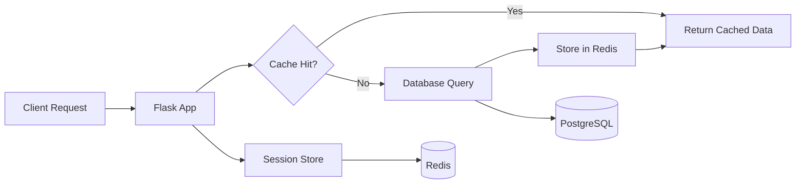
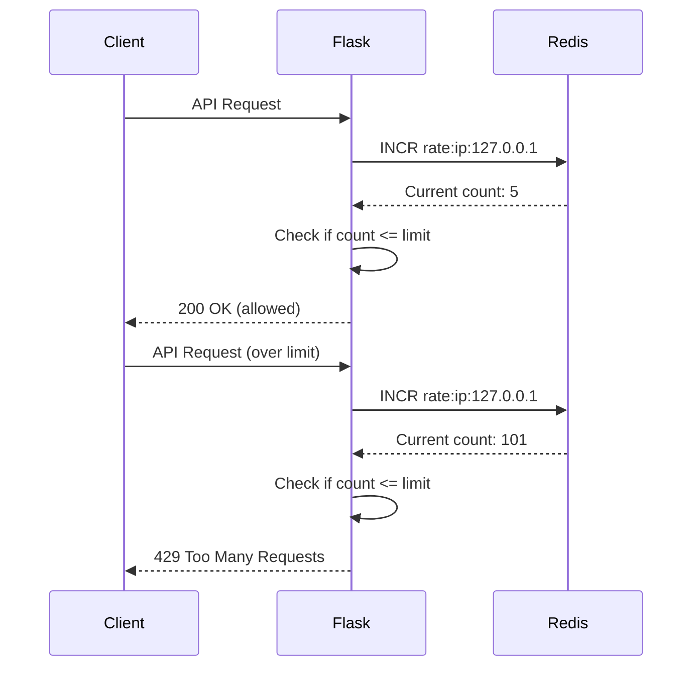
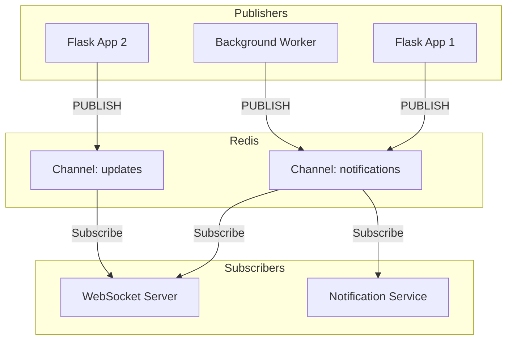

# How to Use Flask with Redis

Author: [nawazdhandala](https://www.github.com/nawazdhandala)

Tags: Python, Flask, Redis, Caching, Session Management, Web Development, Backend

Description: Learn how to integrate Redis with Flask for caching, session management, and real-time features with practical code examples.

---

> Redis is a powerful in-memory data store that pairs perfectly with Flask applications. Whether you need fast caching, session storage, or real-time pub/sub messaging, Redis delivers the performance your Flask app needs.

This guide covers the essential patterns for integrating Redis with Flask, from basic setup to production-ready implementations.

---

## Architecture Overview

Before diving into code, let's understand how Flask and Redis work together:



Redis sits between your Flask application and slower data sources, providing:
- Sub-millisecond response times for cached data
- Shared session storage across multiple app instances
- Pub/sub messaging for real-time features

---

## Getting Started

### Installation

Install Flask and the Redis client library:

```bash
pip install flask redis
```

For production deployments, you will also want connection pooling:

```bash
pip install flask redis hiredis
```

The `hiredis` package is a C-based parser that speeds up Redis operations significantly.

### Basic Connection

Create a simple Flask application with Redis connection:

```python
# app.py
from flask import Flask
import redis
import os

app = Flask(__name__)

# Create Redis connection
# Use environment variable for production, fallback to localhost for development
redis_client = redis.Redis(
    host=os.getenv('REDIS_HOST', 'localhost'),
    port=int(os.getenv('REDIS_PORT', 6379)),
    db=int(os.getenv('REDIS_DB', 0)),
    decode_responses=True  # Return strings instead of bytes
)

@app.route('/health')
def health_check():
    """Verify Redis connection is working"""
    try:
        redis_client.ping()
        return {'status': 'healthy', 'redis': 'connected'}
    except redis.ConnectionError:
        return {'status': 'unhealthy', 'redis': 'disconnected'}, 503

if __name__ == '__main__':
    app.run(debug=True)
```

The `decode_responses=True` parameter is important - without it, Redis returns bytes instead of strings, which can cause issues with JSON serialization.

---

## Connection Pooling

For production applications, always use connection pooling to avoid creating new connections for every request:

```python
# config.py
import redis
import os

class RedisConfig:
    """Redis configuration with connection pooling"""

    # Connection pool is shared across all requests
    # max_connections limits concurrent connections to Redis
    pool = redis.ConnectionPool(
        host=os.getenv('REDIS_HOST', 'localhost'),
        port=int(os.getenv('REDIS_PORT', 6379)),
        db=int(os.getenv('REDIS_DB', 0)),
        max_connections=20,  # Adjust based on your worker count
        decode_responses=True,
        socket_connect_timeout=5,  # Fail fast on connection issues
        socket_timeout=5,          # Don't wait forever for responses
        retry_on_timeout=True      # Automatically retry on timeout
    )

def get_redis():
    """Get Redis client from connection pool"""
    return redis.Redis(connection_pool=RedisConfig.pool)
```

```python
# app.py
from flask import Flask, g
from config import get_redis

app = Flask(__name__)

@app.before_request
def before_request():
    """Attach Redis client to Flask's g object for request-scoped access"""
    g.redis = get_redis()

@app.route('/api/data')
def get_data():
    # Access Redis through g.redis
    value = g.redis.get('my_key')
    return {'value': value}
```

The connection pool pattern ensures:
- Connections are reused across requests
- Maximum connections are limited to prevent resource exhaustion
- Timeouts prevent hung connections from blocking your app

---

## Caching Patterns

### Simple Key-Value Caching

The most common use case is caching expensive database queries or API responses:

```python
# cache.py
import json
from functools import wraps
from flask import g

def cache_result(key_prefix, ttl=300):
    """
    Decorator to cache function results in Redis.

    Args:
        key_prefix: Prefix for the cache key (combined with function args)
        ttl: Time to live in seconds (default 5 minutes)
    """
    def decorator(func):
        @wraps(func)
        def wrapper(*args, **kwargs):
            # Build cache key from prefix and arguments
            # Example: "user:123" for get_user(123)
            cache_key = f"{key_prefix}:{':'.join(str(a) for a in args)}"

            # Try to get cached result
            cached = g.redis.get(cache_key)
            if cached:
                return json.loads(cached)

            # Execute function and cache result
            result = func(*args, **kwargs)
            g.redis.setex(
                cache_key,
                ttl,
                json.dumps(result)
            )
            return result
        return wrapper
    return decorator
```

```python
# routes.py
from flask import Flask, g, jsonify
from cache import cache_result
from models import db, User

app = Flask(__name__)

@app.route('/users/<int:user_id>')
@cache_result(key_prefix='user', ttl=300)
def get_user(user_id):
    """Get user with 5-minute cache"""
    user = User.query.get_or_404(user_id)
    return {
        'id': user.id,
        'name': user.name,
        'email': user.email
    }

@app.route('/users/<int:user_id>', methods=['PUT'])
def update_user(user_id):
    """Update user and invalidate cache"""
    user = User.query.get_or_404(user_id)
    # Update user logic here...

    # Invalidate cache after update
    g.redis.delete(f'user:{user_id}')

    return {'status': 'updated'}
```

### Cache Invalidation Strategy

Cache invalidation is one of the hardest problems in computer science. Here is a pattern that handles it cleanly:

```python
# cache_manager.py
import json
from datetime import datetime

class CacheManager:
    """Manages cache operations with proper invalidation"""

    def __init__(self, redis_client):
        self.redis = redis_client

    def get(self, key):
        """Get value from cache"""
        data = self.redis.get(key)
        return json.loads(data) if data else None

    def set(self, key, value, ttl=300, tags=None):
        """
        Set value in cache with optional tags for group invalidation.

        Tags allow you to invalidate related cache entries together.
        Example: tag all user-related caches with 'user:123' to clear
        them all when the user is updated.
        """
        self.redis.setex(key, ttl, json.dumps(value))

        # Track cache keys by tag for group invalidation
        if tags:
            for tag in tags:
                self.redis.sadd(f'cache_tag:{tag}', key)
                # Set expiry on tag set to prevent memory leaks
                self.redis.expire(f'cache_tag:{tag}', ttl + 60)

    def invalidate_by_tag(self, tag):
        """Invalidate all cache entries with a specific tag"""
        tag_key = f'cache_tag:{tag}'
        keys = self.redis.smembers(tag_key)

        if keys:
            # Delete all cached values and the tag set
            self.redis.delete(*keys, tag_key)

        return len(keys)
```

```python
# Usage example
@app.route('/users/<int:user_id>/posts')
def get_user_posts(user_id):
    cache = CacheManager(g.redis)
    cache_key = f'user_posts:{user_id}'

    posts = cache.get(cache_key)
    if posts:
        return jsonify(posts)

    # Fetch from database
    posts = Post.query.filter_by(user_id=user_id).all()
    posts_data = [{'id': p.id, 'title': p.title} for p in posts]

    # Cache with user tag for easy invalidation
    cache.set(
        cache_key,
        posts_data,
        ttl=600,
        tags=[f'user:{user_id}']  # Invalidate when user changes
    )

    return jsonify(posts_data)

@app.route('/users/<int:user_id>', methods=['DELETE'])
def delete_user(user_id):
    cache = CacheManager(g.redis)

    # Delete user from database
    User.query.filter_by(id=user_id).delete()
    db.session.commit()

    # Invalidate all caches related to this user
    invalidated = cache.invalidate_by_tag(f'user:{user_id}')

    return {'deleted': True, 'caches_cleared': invalidated}
```

---

## Session Management

Flask's default sessions store data in cookies, which has limitations. Redis-backed sessions provide:
- Larger storage capacity (not limited by cookie size)
- Server-side security (session data never leaves the server)
- Shared sessions across multiple app instances

### Using Flask-Session

```bash
pip install flask-session
```

```python
# app.py
from flask import Flask, session
from flask_session import Session
import redis
import os

app = Flask(__name__)

# Session configuration
app.config['SECRET_KEY'] = os.getenv('SECRET_KEY', 'dev-key-change-in-prod')
app.config['SESSION_TYPE'] = 'redis'
app.config['SESSION_PERMANENT'] = True
app.config['PERMANENT_SESSION_LIFETIME'] = 86400  # 24 hours
app.config['SESSION_USE_SIGNER'] = True  # Sign session cookie for security
app.config['SESSION_KEY_PREFIX'] = 'myapp:session:'  # Namespace in Redis
app.config['SESSION_REDIS'] = redis.Redis(
    host=os.getenv('REDIS_HOST', 'localhost'),
    port=int(os.getenv('REDIS_PORT', 6379)),
    db=1  # Use separate DB for sessions
)

# Initialize Flask-Session
Session(app)

@app.route('/login', methods=['POST'])
def login():
    # Authentication logic here...
    user = authenticate(request.json)

    # Store user info in session
    session['user_id'] = user.id
    session['user_email'] = user.email
    session['logged_in_at'] = datetime.utcnow().isoformat()

    return {'status': 'logged_in'}

@app.route('/profile')
def profile():
    if 'user_id' not in session:
        return {'error': 'Not authenticated'}, 401

    return {
        'user_id': session['user_id'],
        'email': session['user_email']
    }

@app.route('/logout', methods=['POST'])
def logout():
    session.clear()  # Removes session from Redis
    return {'status': 'logged_out'}
```

### Custom Session Implementation

For more control, you can implement sessions manually:

```python
# sessions.py
import uuid
import json
from datetime import datetime, timedelta
from functools import wraps
from flask import request, g

class RedisSessionManager:
    """Custom session manager with additional features"""

    def __init__(self, redis_client, prefix='session:', ttl=86400):
        self.redis = redis_client
        self.prefix = prefix
        self.ttl = ttl

    def create_session(self, user_id, metadata=None):
        """Create a new session and return the session ID"""
        session_id = str(uuid.uuid4())
        session_data = {
            'user_id': user_id,
            'created_at': datetime.utcnow().isoformat(),
            'last_activity': datetime.utcnow().isoformat(),
            'metadata': metadata or {}
        }

        # Store session in Redis
        self.redis.setex(
            f'{self.prefix}{session_id}',
            self.ttl,
            json.dumps(session_data)
        )

        # Track active sessions per user (for "log out all devices")
        self.redis.sadd(f'user_sessions:{user_id}', session_id)

        return session_id

    def get_session(self, session_id):
        """Retrieve session data and refresh TTL"""
        key = f'{self.prefix}{session_id}'
        data = self.redis.get(key)

        if not data:
            return None

        session_data = json.loads(data)

        # Update last activity and refresh TTL
        session_data['last_activity'] = datetime.utcnow().isoformat()
        self.redis.setex(key, self.ttl, json.dumps(session_data))

        return session_data

    def destroy_session(self, session_id):
        """Destroy a specific session"""
        key = f'{self.prefix}{session_id}'
        data = self.redis.get(key)

        if data:
            session_data = json.loads(data)
            user_id = session_data.get('user_id')

            # Remove from user's session set
            if user_id:
                self.redis.srem(f'user_sessions:{user_id}', session_id)

        self.redis.delete(key)

    def destroy_all_user_sessions(self, user_id):
        """Log out user from all devices"""
        session_ids = self.redis.smembers(f'user_sessions:{user_id}')

        for session_id in session_ids:
            self.redis.delete(f'{self.prefix}{session_id}')

        self.redis.delete(f'user_sessions:{user_id}')

        return len(session_ids)
```

```python
# Using the custom session manager
sessions = RedisSessionManager(get_redis())

def require_auth(f):
    """Decorator to require authentication"""
    @wraps(f)
    def decorated(*args, **kwargs):
        session_id = request.headers.get('X-Session-ID')

        if not session_id:
            return {'error': 'Missing session ID'}, 401

        session_data = sessions.get_session(session_id)

        if not session_data:
            return {'error': 'Invalid or expired session'}, 401

        g.session = session_data
        g.user_id = session_data['user_id']

        return f(*args, **kwargs)
    return decorated

@app.route('/api/protected')
@require_auth
def protected_endpoint():
    return {'user_id': g.user_id, 'message': 'You are authenticated'}
```

---

## Rate Limiting

Redis is excellent for implementing rate limiting due to its atomic operations:



### Sliding Window Rate Limiter

```python
# rate_limiter.py
import time
from functools import wraps
from flask import request, g, jsonify

class RateLimiter:
    """
    Sliding window rate limiter using Redis sorted sets.

    More accurate than fixed window counters because it considers
    the actual time distribution of requests.
    """

    def __init__(self, redis_client):
        self.redis = redis_client

    def is_allowed(self, key, limit, window_seconds):
        """
        Check if request is allowed under rate limit.

        Args:
            key: Unique identifier (e.g., user ID or IP)
            limit: Maximum requests allowed
            window_seconds: Time window in seconds

        Returns:
            tuple: (is_allowed, remaining, reset_time)
        """
        now = time.time()
        window_start = now - window_seconds

        # Use Redis pipeline for atomic operations
        pipe = self.redis.pipeline()

        # Remove old entries outside the window
        pipe.zremrangebyscore(key, 0, window_start)

        # Count current requests in window
        pipe.zcard(key)

        # Add current request with timestamp as score
        pipe.zadd(key, {str(now): now})

        # Set key expiry to clean up automatically
        pipe.expire(key, window_seconds)

        results = pipe.execute()
        current_count = results[1]  # zcard result

        is_allowed = current_count < limit
        remaining = max(0, limit - current_count - 1)

        # Calculate when the oldest request will expire
        oldest = self.redis.zrange(key, 0, 0, withscores=True)
        reset_time = int(oldest[0][1] + window_seconds) if oldest else int(now + window_seconds)

        return is_allowed, remaining, reset_time

def rate_limit(limit=100, window=60, key_func=None):
    """
    Decorator to apply rate limiting to routes.

    Args:
        limit: Maximum requests per window
        window: Time window in seconds
        key_func: Function to extract rate limit key from request
    """
    def decorator(f):
        @wraps(f)
        def decorated(*args, **kwargs):
            limiter = RateLimiter(g.redis)

            # Default key is client IP, but can be customized
            if key_func:
                rate_key = f'ratelimit:{key_func()}'
            else:
                rate_key = f'ratelimit:{request.remote_addr}'

            is_allowed, remaining, reset_time = limiter.is_allowed(
                rate_key, limit, window
            )

            # Add rate limit headers to response
            response = None
            if not is_allowed:
                response = jsonify({'error': 'Rate limit exceeded'})
                response.status_code = 429
            else:
                response = f(*args, **kwargs)
                if not isinstance(response, tuple):
                    response = jsonify(response) if isinstance(response, dict) else response

            # Add standard rate limit headers
            response.headers['X-RateLimit-Limit'] = str(limit)
            response.headers['X-RateLimit-Remaining'] = str(remaining)
            response.headers['X-RateLimit-Reset'] = str(reset_time)

            return response
        return decorated
    return decorator
```

```python
# routes.py
@app.route('/api/search')
@rate_limit(limit=30, window=60)  # 30 requests per minute
def search():
    query = request.args.get('q')
    results = perform_search(query)
    return {'results': results}

@app.route('/api/expensive-operation')
@rate_limit(limit=5, window=3600)  # 5 requests per hour
def expensive_operation():
    # This endpoint is costly, so limit it heavily
    return {'result': do_expensive_thing()}

# Rate limit by user ID instead of IP
@app.route('/api/user-action')
@require_auth
@rate_limit(
    limit=100,
    window=60,
    key_func=lambda: g.user_id  # Use authenticated user ID
)
def user_action():
    return {'status': 'ok'}
```

---

## Pub/Sub for Real-Time Features

Redis pub/sub enables real-time communication between different parts of your application:



### Publishing Events

```python
# events.py
import json
from datetime import datetime

class EventPublisher:
    """Publish events to Redis channels"""

    def __init__(self, redis_client):
        self.redis = redis_client

    def publish(self, channel, event_type, data):
        """
        Publish an event to a Redis channel.

        Args:
            channel: Channel name (e.g., 'user:123:notifications')
            event_type: Type of event (e.g., 'new_message')
            data: Event payload
        """
        event = {
            'type': event_type,
            'data': data,
            'timestamp': datetime.utcnow().isoformat()
        }

        self.redis.publish(channel, json.dumps(event))

    def publish_to_user(self, user_id, event_type, data):
        """Publish event to a specific user's channel"""
        self.publish(f'user:{user_id}', event_type, data)

    def publish_broadcast(self, event_type, data):
        """Publish event to all subscribers"""
        self.publish('broadcast', event_type, data)
```

```python
# Using the publisher in routes
@app.route('/messages', methods=['POST'])
@require_auth
def send_message():
    data = request.json
    recipient_id = data['recipient_id']

    # Save message to database
    message = Message(
        sender_id=g.user_id,
        recipient_id=recipient_id,
        content=data['content']
    )
    db.session.add(message)
    db.session.commit()

    # Publish real-time notification
    publisher = EventPublisher(g.redis)
    publisher.publish_to_user(
        recipient_id,
        'new_message',
        {
            'message_id': message.id,
            'sender_id': g.user_id,
            'preview': data['content'][:100]
        }
    )

    return {'message_id': message.id}
```

### Subscribing to Events

For handling subscriptions, you typically need a separate process (not the Flask request handler):

```python
# subscriber.py
import redis
import json

def message_handler(message):
    """Process incoming pub/sub messages"""
    if message['type'] == 'message':
        data = json.loads(message['data'])
        print(f"Received: {data['type']} - {data['data']}")

        # Handle different event types
        if data['type'] == 'new_message':
            send_push_notification(data['data'])
        elif data['type'] == 'user_online':
            update_presence(data['data'])

def run_subscriber():
    """Run the subscriber in a separate process"""
    redis_client = redis.Redis(host='localhost', port=6379, decode_responses=True)
    pubsub = redis_client.pubsub()

    # Subscribe to channels (supports patterns)
    pubsub.subscribe('broadcast')
    pubsub.psubscribe('user:*')  # Pattern subscribe to all user channels

    print("Subscriber started, listening for events...")

    # Listen for messages (blocking)
    for message in pubsub.listen():
        if message['type'] in ('message', 'pmessage'):
            message_handler(message)

if __name__ == '__main__':
    run_subscriber()
```

---

## Task Queue with Redis Lists

For simple background tasks without Celery, Redis lists work well:

```python
# task_queue.py
import json
import uuid
from datetime import datetime

class SimpleTaskQueue:
    """
    Simple task queue using Redis lists.
    Use this for basic needs; consider Celery for complex requirements.
    """

    def __init__(self, redis_client, queue_name='tasks'):
        self.redis = redis_client
        self.queue_name = queue_name

    def enqueue(self, task_name, payload, priority='normal'):
        """Add a task to the queue"""
        task = {
            'id': str(uuid.uuid4()),
            'name': task_name,
            'payload': payload,
            'priority': priority,
            'created_at': datetime.utcnow().isoformat()
        }

        # Use LPUSH for high priority, RPUSH for normal
        if priority == 'high':
            self.redis.lpush(self.queue_name, json.dumps(task))
        else:
            self.redis.rpush(self.queue_name, json.dumps(task))

        return task['id']

    def dequeue(self, timeout=0):
        """
        Get next task from queue (blocking).

        Args:
            timeout: Seconds to wait for a task (0 = wait forever)

        Returns:
            Task dict or None if timeout reached
        """
        result = self.redis.blpop(self.queue_name, timeout=timeout)

        if result:
            return json.loads(result[1])
        return None

    def get_queue_length(self):
        """Get number of pending tasks"""
        return self.redis.llen(self.queue_name)
```

```python
# worker.py
from task_queue import SimpleTaskQueue
import redis

def process_task(task):
    """Process a task based on its name"""
    handlers = {
        'send_email': handle_send_email,
        'generate_report': handle_generate_report,
        'process_image': handle_process_image,
    }

    handler = handlers.get(task['name'])
    if handler:
        handler(task['payload'])
    else:
        print(f"Unknown task: {task['name']}")

def run_worker():
    """Run the task worker"""
    redis_client = redis.Redis(host='localhost', port=6379, decode_responses=True)
    queue = SimpleTaskQueue(redis_client)

    print("Worker started, waiting for tasks...")

    while True:
        task = queue.dequeue(timeout=5)
        if task:
            print(f"Processing task: {task['name']}")
            try:
                process_task(task)
                print(f"Task {task['id']} completed")
            except Exception as e:
                print(f"Task {task['id']} failed: {e}")
                # Optionally re-queue failed tasks

if __name__ == '__main__':
    run_worker()
```

```python
# Using the queue in Flask
@app.route('/reports', methods=['POST'])
@require_auth
def request_report():
    queue = SimpleTaskQueue(g.redis)

    task_id = queue.enqueue(
        'generate_report',
        {
            'user_id': g.user_id,
            'report_type': request.json['type'],
            'date_range': request.json['date_range']
        }
    )

    return {
        'task_id': task_id,
        'status': 'queued',
        'queue_position': queue.get_queue_length()
    }
```

---

## Production Best Practices

### Error Handling and Resilience

```python
# redis_client.py
import redis
from redis.exceptions import ConnectionError, TimeoutError
import logging
import time

logger = logging.getLogger(__name__)

class ResilientRedisClient:
    """Redis client with automatic reconnection and error handling"""

    def __init__(self, **kwargs):
        self.config = kwargs
        self.client = None
        self._connect()

    def _connect(self):
        """Establish connection to Redis"""
        self.client = redis.Redis(**self.config)

    def execute_with_retry(self, method, *args, max_retries=3, **kwargs):
        """Execute Redis command with automatic retry on failure"""
        last_error = None

        for attempt in range(max_retries):
            try:
                return method(*args, **kwargs)
            except (ConnectionError, TimeoutError) as e:
                last_error = e
                logger.warning(
                    f"Redis operation failed (attempt {attempt + 1}/{max_retries}): {e}"
                )

                # Wait before retry with exponential backoff
                if attempt < max_retries - 1:
                    time.sleep(2 ** attempt)
                    self._connect()

        logger.error(f"Redis operation failed after {max_retries} attempts")
        raise last_error

    def get(self, key):
        return self.execute_with_retry(self.client.get, key)

    def set(self, key, value, **kwargs):
        return self.execute_with_retry(self.client.set, key, value, **kwargs)

    def setex(self, key, ttl, value):
        return self.execute_with_retry(self.client.setex, key, ttl, value)

    def delete(self, *keys):
        return self.execute_with_retry(self.client.delete, *keys)
```

### Health Checks and Monitoring

```python
# health.py
from flask import Blueprint, g
import time

health_bp = Blueprint('health', __name__)

@health_bp.route('/health')
def health_check():
    """Comprehensive health check endpoint"""
    checks = {}
    overall_healthy = True

    # Check Redis connectivity
    try:
        start = time.time()
        g.redis.ping()
        redis_latency = (time.time() - start) * 1000  # ms

        checks['redis'] = {
            'status': 'healthy',
            'latency_ms': round(redis_latency, 2)
        }
    except Exception as e:
        checks['redis'] = {
            'status': 'unhealthy',
            'error': str(e)
        }
        overall_healthy = False

    # Check Redis memory usage
    try:
        info = g.redis.info('memory')
        memory_used = info.get('used_memory_human', 'unknown')
        checks['redis_memory'] = {
            'status': 'healthy',
            'used': memory_used
        }
    except Exception:
        pass

    status_code = 200 if overall_healthy else 503

    return {
        'status': 'healthy' if overall_healthy else 'unhealthy',
        'checks': checks
    }, status_code
```

### Configuration for Different Environments

```python
# config.py
import os

class Config:
    """Base configuration"""
    REDIS_HOST = os.getenv('REDIS_HOST', 'localhost')
    REDIS_PORT = int(os.getenv('REDIS_PORT', 6379))
    REDIS_DB = int(os.getenv('REDIS_DB', 0))
    REDIS_PASSWORD = os.getenv('REDIS_PASSWORD')
    REDIS_SSL = os.getenv('REDIS_SSL', 'false').lower() == 'true'

class DevelopmentConfig(Config):
    """Development configuration"""
    DEBUG = True
    REDIS_MAX_CONNECTIONS = 5

class ProductionConfig(Config):
    """Production configuration"""
    DEBUG = False
    REDIS_MAX_CONNECTIONS = 20

    # Use Redis Sentinel for high availability
    REDIS_SENTINEL_HOSTS = os.getenv('REDIS_SENTINEL_HOSTS', '').split(',')
    REDIS_SENTINEL_MASTER = os.getenv('REDIS_SENTINEL_MASTER', 'mymaster')

def get_redis_client(config):
    """Create Redis client based on configuration"""
    if hasattr(config, 'REDIS_SENTINEL_HOSTS') and config.REDIS_SENTINEL_HOSTS[0]:
        # Use Sentinel for production HA setup
        from redis.sentinel import Sentinel

        sentinel_hosts = [
            (h.split(':')[0], int(h.split(':')[1]))
            for h in config.REDIS_SENTINEL_HOSTS
        ]
        sentinel = Sentinel(sentinel_hosts)
        return sentinel.master_for(
            config.REDIS_SENTINEL_MASTER,
            password=config.REDIS_PASSWORD,
            decode_responses=True
        )
    else:
        # Standard Redis connection
        return redis.Redis(
            host=config.REDIS_HOST,
            port=config.REDIS_PORT,
            db=config.REDIS_DB,
            password=config.REDIS_PASSWORD,
            ssl=config.REDIS_SSL,
            decode_responses=True,
            socket_connect_timeout=5,
            socket_timeout=5
        )
```

---

## Complete Example Application

Here is a complete Flask application combining all the patterns:

```python
# app.py
from flask import Flask, request, g, jsonify
import redis
import os

from cache import CacheManager
from rate_limiter import rate_limit
from sessions import RedisSessionManager
from events import EventPublisher

app = Flask(__name__)

# Redis connection pool
pool = redis.ConnectionPool(
    host=os.getenv('REDIS_HOST', 'localhost'),
    port=int(os.getenv('REDIS_PORT', 6379)),
    max_connections=20,
    decode_responses=True
)

@app.before_request
def before_request():
    """Set up request-scoped Redis access"""
    g.redis = redis.Redis(connection_pool=pool)
    g.cache = CacheManager(g.redis)
    g.sessions = RedisSessionManager(g.redis)
    g.events = EventPublisher(g.redis)

@app.route('/api/login', methods=['POST'])
@rate_limit(limit=5, window=60)  # Prevent brute force
def login():
    data = request.json
    user = authenticate(data['email'], data['password'])

    if not user:
        return {'error': 'Invalid credentials'}, 401

    session_id = g.sessions.create_session(
        user.id,
        metadata={'ip': request.remote_addr}
    )

    return {
        'session_id': session_id,
        'user': {'id': user.id, 'name': user.name}
    }

@app.route('/api/products/<int:product_id>')
@rate_limit(limit=100, window=60)
def get_product(product_id):
    # Try cache first
    cached = g.cache.get(f'product:{product_id}')
    if cached:
        return jsonify(cached)

    # Fetch from database
    product = Product.query.get_or_404(product_id)
    product_data = product.to_dict()

    # Cache for 10 minutes
    g.cache.set(
        f'product:{product_id}',
        product_data,
        ttl=600,
        tags=['products', f'category:{product.category_id}']
    )

    return jsonify(product_data)

@app.route('/api/products/<int:product_id>', methods=['PUT'])
def update_product(product_id):
    # Update product in database
    product = Product.query.get_or_404(product_id)
    product.update(request.json)
    db.session.commit()

    # Invalidate cache
    g.cache.invalidate_by_tag(f'product:{product_id}')

    # Notify subscribers
    g.events.publish_broadcast('product_updated', {
        'product_id': product_id,
        'changes': list(request.json.keys())
    })

    return jsonify(product.to_dict())

if __name__ == '__main__':
    app.run(debug=True)
```

---

## Conclusion

Redis transforms Flask applications with:

- **Caching** that reduces database load and speeds up responses
- **Session management** that scales across multiple app instances
- **Rate limiting** that protects your API from abuse
- **Pub/sub messaging** for real-time features
- **Task queues** for background processing

Start with simple caching, then add more Redis features as your application grows. The patterns in this guide provide a solid foundation for production-ready Flask applications.

---

*Building a Flask application that needs monitoring? [OneUptime](https://oneuptime.com) provides comprehensive application monitoring with Redis health checks, response time tracking, and alerting.*
