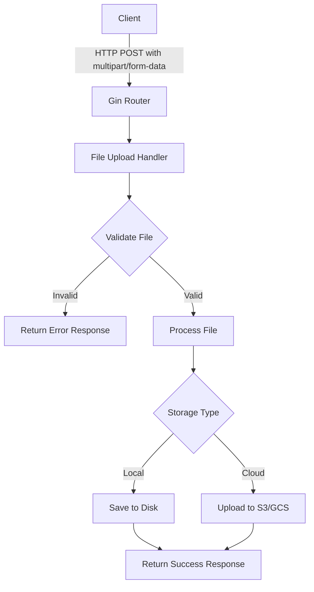
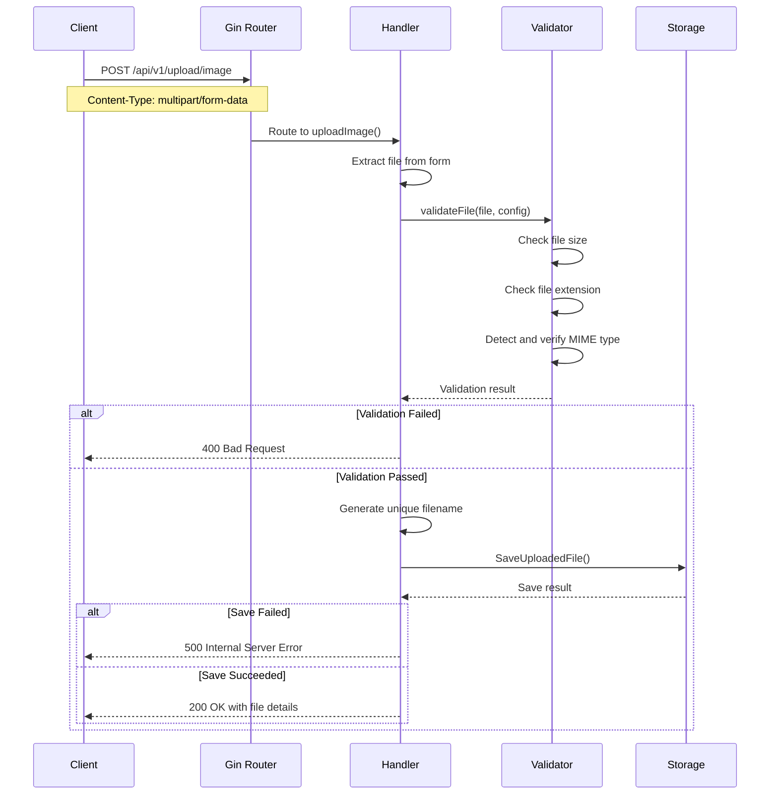

# How to Build File Upload APIs with Gin

Author: [nawazdhandala](https://www.github.com/nawazdhandala)

Tags: Go, Gin, File Upload, REST API, Backend Development, Web Development, Golang

Description: A practical guide to building file upload APIs using Gin framework in Go, covering single and multiple file uploads, validation, and storage strategies.

---

File uploads are a common requirement in modern web applications. Whether you're building a document management system, an image gallery, or a user profile service, handling file uploads efficiently is essential. Gin, one of the most popular Go web frameworks, makes this straightforward with its built-in support for multipart form handling.

In this guide, we'll build a production-ready file upload API that handles single files, multiple files, and includes proper validation and error handling.

## Prerequisites

Before we begin, make sure you have:

- Go 1.21 or later installed
- Basic familiarity with Go and REST APIs
- A code editor of your choice

## Project Setup

Start by creating a new Go module and installing Gin:

```bash
# Create project directory
mkdir gin-file-upload && cd gin-file-upload

# Initialize Go module
go mod init gin-file-upload

# Install Gin framework
go get -u github.com/gin-gonic/gin
```

## Architecture Overview

Here's how our file upload system will work:



## Single File Upload

Let's start with a basic single file upload endpoint. This is the foundation for more complex scenarios.

```go
package main

import (
    "fmt"
    "net/http"
    "path/filepath"

    "github.com/gin-gonic/gin"
)

func main() {
    // Create a Gin router with default middleware (logger and recovery)
    router := gin.Default()

    // Set maximum memory for multipart forms (default is 32 MiB)
    // This controls how much of the file is kept in memory vs temp files
    router.MaxMultipartMemory = 8 << 20 // 8 MiB

    // Define the upload endpoint
    router.POST("/upload", uploadFile)

    // Start the server on port 8080
    router.Run(":8080")
}

// uploadFile handles single file uploads
func uploadFile(c *gin.Context) {
    // Retrieve the file from the form data
    // "file" is the form field name the client uses
    file, err := c.FormFile("file")
    if err != nil {
        c.JSON(http.StatusBadRequest, gin.H{
            "error":   "No file provided",
            "details": err.Error(),
        })
        return
    }

    // Generate a safe filename to prevent directory traversal attacks
    filename := filepath.Base(file.Filename)

    // Define the destination path
    dst := filepath.Join("./uploads", filename)

    // Save the uploaded file to the destination
    if err := c.SaveUploadedFile(file, dst); err != nil {
        c.JSON(http.StatusInternalServerError, gin.H{
            "error":   "Failed to save file",
            "details": err.Error(),
        })
        return
    }

    // Return success response with file details
    c.JSON(http.StatusOK, gin.H{
        "message":  "File uploaded successfully",
        "filename": filename,
        "size":     file.Size,
    })
}
```

## Multiple File Upload

Many applications need to handle multiple files at once. Here's how to extend our API:

```go
// uploadMultipleFiles handles batch file uploads
func uploadMultipleFiles(c *gin.Context) {
    // Parse the multipart form with a memory limit
    form, err := c.MultipartForm()
    if err != nil {
        c.JSON(http.StatusBadRequest, gin.H{
            "error":   "Failed to parse form",
            "details": err.Error(),
        })
        return
    }

    // Get all files from the "files" field
    files := form.File["files"]

    if len(files) == 0 {
        c.JSON(http.StatusBadRequest, gin.H{
            "error": "No files provided",
        })
        return
    }

    // Track uploaded files for the response
    uploadedFiles := make([]gin.H, 0, len(files))
    var failedFiles []string

    // Process each file
    for _, file := range files {
        filename := filepath.Base(file.Filename)
        dst := filepath.Join("./uploads", filename)

        if err := c.SaveUploadedFile(file, dst); err != nil {
            failedFiles = append(failedFiles, filename)
            continue
        }

        uploadedFiles = append(uploadedFiles, gin.H{
            "filename": filename,
            "size":     file.Size,
        })
    }

    // Build appropriate response based on results
    response := gin.H{
        "uploaded": uploadedFiles,
        "count":    len(uploadedFiles),
    }

    if len(failedFiles) > 0 {
        response["failed"] = failedFiles
        c.JSON(http.StatusPartialContent, response)
        return
    }

    c.JSON(http.StatusOK, response)
}
```

## File Validation

Production APIs need proper validation. Let's create a comprehensive validation middleware:

```go
package main

import (
    "mime/multipart"
    "net/http"
    "path/filepath"
    "strings"

    "github.com/gin-gonic/gin"
)

// FileConfig holds validation rules for uploads
type FileConfig struct {
    MaxSize       int64    // Maximum file size in bytes
    AllowedTypes  []string // Allowed MIME types
    AllowedExts   []string // Allowed file extensions
}

// DefaultImageConfig provides sensible defaults for image uploads
var DefaultImageConfig = FileConfig{
    MaxSize:      5 << 20, // 5 MiB
    AllowedTypes: []string{"image/jpeg", "image/png", "image/gif", "image/webp"},
    AllowedExts:  []string{".jpg", ".jpeg", ".png", ".gif", ".webp"},
}

// DefaultDocumentConfig provides defaults for document uploads
var DefaultDocumentConfig = FileConfig{
    MaxSize:      10 << 20, // 10 MiB
    AllowedTypes: []string{"application/pdf", "application/msword", "text/plain"},
    AllowedExts:  []string{".pdf", ".doc", ".docx", ".txt"},
}

// ValidateFile checks if the uploaded file meets the configuration requirements
func ValidateFile(file *multipart.FileHeader, config FileConfig) error {
    // Check file size
    if file.Size > config.MaxSize {
        return fmt.Errorf("file size %d exceeds maximum allowed size %d",
            file.Size, config.MaxSize)
    }

    // Check file extension
    ext := strings.ToLower(filepath.Ext(file.Filename))
    extValid := false
    for _, allowedExt := range config.AllowedExts {
        if ext == allowedExt {
            extValid = true
            break
        }
    }
    if !extValid {
        return fmt.Errorf("file extension %s is not allowed", ext)
    }

    // Open the file to check MIME type
    src, err := file.Open()
    if err != nil {
        return fmt.Errorf("failed to open file: %w", err)
    }
    defer src.Close()

    // Read the first 512 bytes to detect content type
    buffer := make([]byte, 512)
    _, err = src.Read(buffer)
    if err != nil {
        return fmt.Errorf("failed to read file: %w", err)
    }

    // Detect the content type
    contentType := http.DetectContentType(buffer)

    // Check if the content type is allowed
    typeValid := false
    for _, allowedType := range config.AllowedTypes {
        if strings.HasPrefix(contentType, allowedType) {
            typeValid = true
            break
        }
    }
    if !typeValid {
        return fmt.Errorf("file type %s is not allowed", contentType)
    }

    return nil
}

// FileValidationMiddleware creates a middleware for validating uploads
func FileValidationMiddleware(fieldName string, config FileConfig) gin.HandlerFunc {
    return func(c *gin.Context) {
        file, err := c.FormFile(fieldName)
        if err != nil {
            c.AbortWithStatusJSON(http.StatusBadRequest, gin.H{
                "error": "File is required",
            })
            return
        }

        if err := ValidateFile(file, config); err != nil {
            c.AbortWithStatusJSON(http.StatusBadRequest, gin.H{
                "error":   "File validation failed",
                "details": err.Error(),
            })
            return
        }

        // Store validated file in context for the handler
        c.Set("validatedFile", file)
        c.Next()
    }
}
```

## Complete API Implementation

Here's the full implementation bringing everything together:

```go
package main

import (
    "crypto/rand"
    "encoding/hex"
    "fmt"
    "mime/multipart"
    "net/http"
    "os"
    "path/filepath"
    "strings"
    "time"

    "github.com/gin-gonic/gin"
)

// FileConfig holds validation rules
type FileConfig struct {
    MaxSize      int64
    AllowedTypes []string
    AllowedExts  []string
}

// UploadResponse represents the API response for uploads
type UploadResponse struct {
    Success  bool   `json:"success"`
    Message  string `json:"message"`
    Filename string `json:"filename,omitempty"`
    Size     int64  `json:"size,omitempty"`
    URL      string `json:"url,omitempty"`
}

var imageConfig = FileConfig{
    MaxSize:      5 << 20,
    AllowedTypes: []string{"image/jpeg", "image/png", "image/gif", "image/webp"},
    AllowedExts:  []string{".jpg", ".jpeg", ".png", ".gif", ".webp"},
}

func main() {
    // Create uploads directory if it doesn't exist
    if err := os.MkdirAll("./uploads", 0755); err != nil {
        panic(fmt.Sprintf("Failed to create uploads directory: %v", err))
    }

    router := gin.Default()
    router.MaxMultipartMemory = 8 << 20

    // Serve uploaded files statically
    router.Static("/files", "./uploads")

    // API routes
    api := router.Group("/api/v1")
    {
        // Single file upload with validation
        api.POST("/upload/image", uploadImage)

        // Multiple files upload
        api.POST("/upload/images", uploadMultipleImages)

        // Generic file upload (documents, etc.)
        api.POST("/upload/document", uploadDocument)
    }

    router.Run(":8080")
}

// generateUniqueFilename creates a unique filename to prevent collisions
func generateUniqueFilename(originalName string) string {
    ext := filepath.Ext(originalName)

    // Generate random bytes for uniqueness
    randomBytes := make([]byte, 8)
    rand.Read(randomBytes)
    randomStr := hex.EncodeToString(randomBytes)

    // Include timestamp for sortability
    timestamp := time.Now().Format("20060102-150405")

    return fmt.Sprintf("%s-%s%s", timestamp, randomStr, ext)
}

// validateFile performs comprehensive file validation
func validateFile(file *multipart.FileHeader, config FileConfig) error {
    // Check file size
    if file.Size > config.MaxSize {
        return fmt.Errorf("file size exceeds maximum of %d MB", config.MaxSize/(1<<20))
    }

    // Check extension
    ext := strings.ToLower(filepath.Ext(file.Filename))
    extAllowed := false
    for _, allowed := range config.AllowedExts {
        if ext == allowed {
            extAllowed = true
            break
        }
    }
    if !extAllowed {
        return fmt.Errorf("extension %s not allowed, use: %v", ext, config.AllowedExts)
    }

    // Verify actual content type
    src, err := file.Open()
    if err != nil {
        return err
    }
    defer src.Close()

    buffer := make([]byte, 512)
    if _, err := src.Read(buffer); err != nil {
        return err
    }

    contentType := http.DetectContentType(buffer)
    typeAllowed := false
    for _, allowed := range config.AllowedTypes {
        if strings.HasPrefix(contentType, allowed) {
            typeAllowed = true
            break
        }
    }
    if !typeAllowed {
        return fmt.Errorf("content type %s not allowed", contentType)
    }

    return nil
}

// uploadImage handles single image uploads
func uploadImage(c *gin.Context) {
    file, err := c.FormFile("image")
    if err != nil {
        c.JSON(http.StatusBadRequest, UploadResponse{
            Success: false,
            Message: "No image file provided",
        })
        return
    }

    // Validate the file
    if err := validateFile(file, imageConfig); err != nil {
        c.JSON(http.StatusBadRequest, UploadResponse{
            Success: false,
            Message: err.Error(),
        })
        return
    }

    // Generate unique filename and save
    uniqueName := generateUniqueFilename(file.Filename)
    dst := filepath.Join("./uploads", uniqueName)

    if err := c.SaveUploadedFile(file, dst); err != nil {
        c.JSON(http.StatusInternalServerError, UploadResponse{
            Success: false,
            Message: "Failed to save file",
        })
        return
    }

    c.JSON(http.StatusOK, UploadResponse{
        Success:  true,
        Message:  "Image uploaded successfully",
        Filename: uniqueName,
        Size:     file.Size,
        URL:      fmt.Sprintf("/files/%s", uniqueName),
    })
}

// uploadMultipleImages handles batch image uploads
func uploadMultipleImages(c *gin.Context) {
    form, err := c.MultipartForm()
    if err != nil {
        c.JSON(http.StatusBadRequest, gin.H{
            "success": false,
            "message": "Invalid form data",
        })
        return
    }

    files := form.File["images"]
    if len(files) == 0 {
        c.JSON(http.StatusBadRequest, gin.H{
            "success": false,
            "message": "No images provided",
        })
        return
    }

    // Limit batch size to prevent abuse
    const maxBatchSize = 10
    if len(files) > maxBatchSize {
        c.JSON(http.StatusBadRequest, gin.H{
            "success": false,
            "message": fmt.Sprintf("Maximum %d files allowed per request", maxBatchSize),
        })
        return
    }

    var uploaded []UploadResponse
    var errors []string

    for _, file := range files {
        // Validate each file
        if err := validateFile(file, imageConfig); err != nil {
            errors = append(errors, fmt.Sprintf("%s: %s", file.Filename, err.Error()))
            continue
        }

        uniqueName := generateUniqueFilename(file.Filename)
        dst := filepath.Join("./uploads", uniqueName)

        if err := c.SaveUploadedFile(file, dst); err != nil {
            errors = append(errors, fmt.Sprintf("%s: save failed", file.Filename))
            continue
        }

        uploaded = append(uploaded, UploadResponse{
            Filename: uniqueName,
            Size:     file.Size,
            URL:      fmt.Sprintf("/files/%s", uniqueName),
        })
    }

    status := http.StatusOK
    if len(errors) > 0 && len(uploaded) > 0 {
        status = http.StatusPartialContent
    } else if len(errors) > 0 && len(uploaded) == 0 {
        status = http.StatusBadRequest
    }

    c.JSON(status, gin.H{
        "success":  len(uploaded) > 0,
        "uploaded": uploaded,
        "errors":   errors,
        "count":    len(uploaded),
    })
}

// uploadDocument handles document uploads with different validation rules
func uploadDocument(c *gin.Context) {
    docConfig := FileConfig{
        MaxSize:      10 << 20, // 10 MiB
        AllowedTypes: []string{"application/pdf", "text/plain"},
        AllowedExts:  []string{".pdf", ".txt"},
    }

    file, err := c.FormFile("document")
    if err != nil {
        c.JSON(http.StatusBadRequest, UploadResponse{
            Success: false,
            Message: "No document provided",
        })
        return
    }

    if err := validateFile(file, docConfig); err != nil {
        c.JSON(http.StatusBadRequest, UploadResponse{
            Success: false,
            Message: err.Error(),
        })
        return
    }

    uniqueName := generateUniqueFilename(file.Filename)
    dst := filepath.Join("./uploads", uniqueName)

    if err := c.SaveUploadedFile(file, dst); err != nil {
        c.JSON(http.StatusInternalServerError, UploadResponse{
            Success: false,
            Message: "Failed to save document",
        })
        return
    }

    c.JSON(http.StatusOK, UploadResponse{
        Success:  true,
        Message:  "Document uploaded successfully",
        Filename: uniqueName,
        Size:     file.Size,
        URL:      fmt.Sprintf("/files/%s", uniqueName),
    })
}
```

## Request Flow

Here's how a typical file upload request flows through the system:



## Testing the API

Test your file upload API using curl:

```bash
# Upload a single image
curl -X POST http://localhost:8080/api/v1/upload/image \
  -F "image=@photo.jpg"

# Upload multiple images
curl -X POST http://localhost:8080/api/v1/upload/images \
  -F "images=@photo1.jpg" \
  -F "images=@photo2.jpg" \
  -F "images=@photo3.png"

# Upload a document
curl -X POST http://localhost:8080/api/v1/upload/document \
  -F "document=@report.pdf"
```

Expected response for a single image upload:

```json
{
  "success": true,
  "message": "Image uploaded successfully",
  "filename": "20260126-143052-a1b2c3d4.jpg",
  "size": 245678,
  "url": "/files/20260126-143052-a1b2c3d4.jpg"
}
```

## Adding Progress Tracking

For large files, clients may want to track upload progress. While Gin handles the upload, you can add hooks for monitoring:

```go
// ProgressReader wraps an io.Reader to track read progress
type ProgressReader struct {
    Reader     io.Reader
    TotalSize  int64
    ReadBytes  int64
    OnProgress func(readBytes, totalBytes int64)
}

func (pr *ProgressReader) Read(p []byte) (int, error) {
    n, err := pr.Reader.Read(p)
    pr.ReadBytes += int64(n)

    if pr.OnProgress != nil {
        pr.OnProgress(pr.ReadBytes, pr.TotalSize)
    }

    return n, err
}

// uploadWithProgress demonstrates progress tracking
func uploadWithProgress(c *gin.Context) {
    file, header, err := c.Request.FormFile("file")
    if err != nil {
        c.JSON(http.StatusBadRequest, gin.H{"error": "No file provided"})
        return
    }
    defer file.Close()

    // Create progress reader
    progressReader := &ProgressReader{
        Reader:    file,
        TotalSize: header.Size,
        OnProgress: func(read, total int64) {
            percent := float64(read) / float64(total) * 100
            fmt.Printf("Upload progress: %.2f%%\n", percent)
        },
    }

    // Create destination file
    filename := generateUniqueFilename(header.Filename)
    dst, err := os.Create(filepath.Join("./uploads", filename))
    if err != nil {
        c.JSON(http.StatusInternalServerError, gin.H{"error": "Failed to create file"})
        return
    }
    defer dst.Close()

    // Copy with progress tracking
    if _, err := io.Copy(dst, progressReader); err != nil {
        c.JSON(http.StatusInternalServerError, gin.H{"error": "Failed to save file"})
        return
    }

    c.JSON(http.StatusOK, gin.H{
        "success":  true,
        "filename": filename,
    })
}
```

## Cloud Storage Integration

For production applications, you'll often want to upload files to cloud storage. Here's an example using AWS S3:

```go
package main

import (
    "context"
    "fmt"
    "mime/multipart"
    "net/http"

    "github.com/aws/aws-sdk-go-v2/aws"
    "github.com/aws/aws-sdk-go-v2/config"
    "github.com/aws/aws-sdk-go-v2/service/s3"
    "github.com/gin-gonic/gin"
)

// S3Uploader handles uploads to AWS S3
type S3Uploader struct {
    client     *s3.Client
    bucketName string
}

// NewS3Uploader creates a new S3 uploader
func NewS3Uploader(bucketName string) (*S3Uploader, error) {
    cfg, err := config.LoadDefaultConfig(context.TODO())
    if err != nil {
        return nil, fmt.Errorf("failed to load AWS config: %w", err)
    }

    return &S3Uploader{
        client:     s3.NewFromConfig(cfg),
        bucketName: bucketName,
    }, nil
}

// Upload sends a file to S3
func (u *S3Uploader) Upload(ctx context.Context, file *multipart.FileHeader, key string) (string, error) {
    src, err := file.Open()
    if err != nil {
        return "", fmt.Errorf("failed to open file: %w", err)
    }
    defer src.Close()

    // Detect content type
    buffer := make([]byte, 512)
    src.Read(buffer)
    contentType := http.DetectContentType(buffer)

    // Reset reader position
    src.Seek(0, 0)

    // Upload to S3
    _, err = u.client.PutObject(ctx, &s3.PutObjectInput{
        Bucket:      aws.String(u.bucketName),
        Key:         aws.String(key),
        Body:        src,
        ContentType: aws.String(contentType),
    })
    if err != nil {
        return "", fmt.Errorf("failed to upload to S3: %w", err)
    }

    // Return the S3 URL
    return fmt.Sprintf("https://%s.s3.amazonaws.com/%s", u.bucketName, key), nil
}

// uploadToS3 handler for S3 uploads
func uploadToS3(uploader *S3Uploader) gin.HandlerFunc {
    return func(c *gin.Context) {
        file, err := c.FormFile("file")
        if err != nil {
            c.JSON(http.StatusBadRequest, gin.H{"error": "No file provided"})
            return
        }

        // Generate S3 key (path within bucket)
        key := fmt.Sprintf("uploads/%s", generateUniqueFilename(file.Filename))

        url, err := uploader.Upload(c.Request.Context(), file, key)
        if err != nil {
            c.JSON(http.StatusInternalServerError, gin.H{
                "error":   "Upload failed",
                "details": err.Error(),
            })
            return
        }

        c.JSON(http.StatusOK, gin.H{
            "success": true,
            "url":     url,
            "key":     key,
        })
    }
}
```

## Error Handling Best Practices

Proper error handling improves both security and user experience:

```go
// Custom error types for better error handling
type UploadError struct {
    Code    string
    Message string
    Details string
}

func (e UploadError) Error() string {
    return e.Message
}

var (
    ErrNoFile          = UploadError{Code: "NO_FILE", Message: "No file provided"}
    ErrFileTooLarge    = UploadError{Code: "FILE_TOO_LARGE", Message: "File exceeds size limit"}
    ErrInvalidType     = UploadError{Code: "INVALID_TYPE", Message: "File type not allowed"}
    ErrInvalidExt      = UploadError{Code: "INVALID_EXT", Message: "File extension not allowed"}
    ErrStorageFailed   = UploadError{Code: "STORAGE_FAILED", Message: "Failed to store file"}
)

// handleUploadError converts errors to appropriate HTTP responses
func handleUploadError(c *gin.Context, err error) {
    if uploadErr, ok := err.(UploadError); ok {
        status := http.StatusBadRequest
        if uploadErr.Code == "STORAGE_FAILED" {
            status = http.StatusInternalServerError
        }

        c.JSON(status, gin.H{
            "success": false,
            "error": gin.H{
                "code":    uploadErr.Code,
                "message": uploadErr.Message,
                "details": uploadErr.Details,
            },
        })
        return
    }

    // Generic error response
    c.JSON(http.StatusInternalServerError, gin.H{
        "success": false,
        "error": gin.H{
            "code":    "UNKNOWN_ERROR",
            "message": "An unexpected error occurred",
        },
    })
}
```

## Security Considerations

When building file upload APIs, keep these security practices in mind:

1. **Always validate file types** - Check both the extension and actual content type using magic bytes
2. **Generate unique filenames** - Never use user-provided filenames directly to prevent path traversal attacks
3. **Set size limits** - Configure maximum file sizes at both the application and reverse proxy level
4. **Store files outside web root** - For sensitive files, store them outside the publicly accessible directory
5. **Use virus scanning** - For public uploads, consider integrating with ClamAV or similar
6. **Implement rate limiting** - Prevent abuse by limiting upload frequency per user/IP

## Summary

Building file upload APIs with Gin is straightforward once you understand the key components:

- Use `c.FormFile()` for single files and `c.MultipartForm()` for multiple files
- Always validate file size, extension, and actual content type
- Generate unique filenames to prevent collisions and security issues
- Handle errors gracefully with informative responses
- Consider cloud storage for production scalability

Gin's simple API combined with Go's strong standard library makes it an excellent choice for building reliable file upload services.
