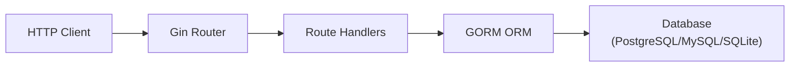
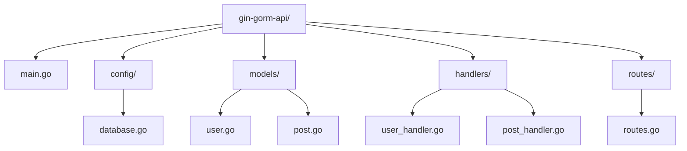
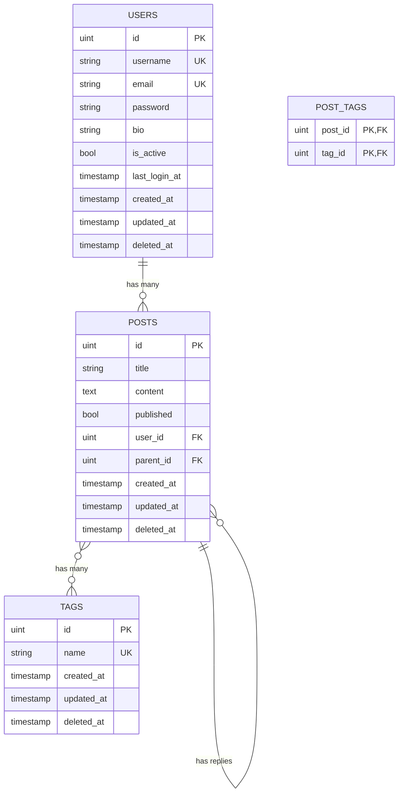
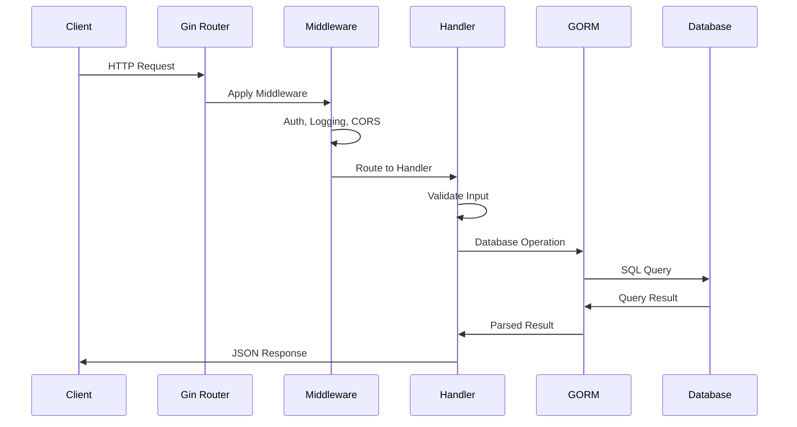

# How to Use Gin with GORM

Author: [nawazdhandala](https://www.github.com/nawazdhandala)

Tags: Go, Gin, GORM, Database, ORM

Description: Learn how to use Gin with GORM for building REST APIs with database operations including models, CRUD, relationships, and migrations.

---

> Building REST APIs in Go becomes straightforward when you combine Gin's fast HTTP routing with GORM's powerful ORM capabilities. This guide walks you through setting up a complete web application with database persistence.

Go developers often reach for Gin when they need a lightweight, fast web framework. Pairing it with GORM provides a clean way to interact with databases without writing raw SQL.

---

## Overview



---

## Project Setup

### Initialize Go Module

Start by creating a new Go module and installing the required dependencies:

```bash
# Create a new directory for your project
mkdir gin-gorm-api
cd gin-gorm-api

# Initialize the Go module
go mod init github.com/yourname/gin-gorm-api

# Install Gin web framework
go get -u github.com/gin-gonic/gin

# Install GORM and database drivers
go get -u gorm.io/gorm
go get -u gorm.io/driver/postgres
go get -u gorm.io/driver/mysql
go get -u gorm.io/driver/sqlite
```

---

## Project Structure

Organize your project with a clean directory structure:



---

## Database Configuration

### Connection Setup

Create a database configuration file that handles connection pooling and lifecycle:

```go
// config/database.go
package config

import (
    "fmt"
    "log"
    "os"
    "time"

    "gorm.io/driver/postgres"
    "gorm.io/gorm"
    "gorm.io/gorm/logger"
)

// DB holds the global database connection instance
// This gets initialized once at application startup
var DB *gorm.DB

// ConnectDatabase establishes the database connection
// and configures connection pooling for optimal performance
func ConnectDatabase() {
    // Build the connection string from environment variables
    // This keeps sensitive credentials out of the codebase
    dsn := fmt.Sprintf(
        "host=%s user=%s password=%s dbname=%s port=%s sslmode=disable",
        os.Getenv("DB_HOST"),
        os.Getenv("DB_USER"),
        os.Getenv("DB_PASSWORD"),
        os.Getenv("DB_NAME"),
        os.Getenv("DB_PORT"),
    )

    // Configure GORM with custom settings
    // The logger helps with debugging SQL queries during development
    db, err := gorm.Open(postgres.Open(dsn), &gorm.Config{
        Logger: logger.Default.LogMode(logger.Info),
    })
    if err != nil {
        log.Fatal("Failed to connect to database:", err)
    }

    // Get the underlying SQL database connection for pool configuration
    sqlDB, err := db.DB()
    if err != nil {
        log.Fatal("Failed to get database instance:", err)
    }

    // Configure connection pool settings
    // MaxIdleConns: number of connections kept open when idle
    sqlDB.SetMaxIdleConns(10)
    // MaxOpenConns: maximum total connections to the database
    sqlDB.SetMaxOpenConns(100)
    // ConnMaxLifetime: how long a connection can be reused
    sqlDB.SetConnMaxLifetime(time.Hour)

    DB = db
    log.Println("Database connected successfully")
}
```

### SQLite Configuration (for Development)

For local development, SQLite provides a simpler setup:

```go
// config/database_sqlite.go
package config

import (
    "log"

    "gorm.io/driver/sqlite"
    "gorm.io/gorm"
)

// ConnectSQLite sets up a SQLite database for local development
// SQLite stores data in a single file, making it easy to reset
func ConnectSQLite() {
    db, err := gorm.Open(sqlite.Open("app.db"), &gorm.Config{})
    if err != nil {
        log.Fatal("Failed to connect to SQLite database:", err)
    }

    DB = db
    log.Println("SQLite database connected")
}
```

---

## Defining Models

### Basic Model Structure

GORM models map Go structs to database tables:

```go
// models/user.go
package models

import (
    "time"

    "gorm.io/gorm"
)

// User represents the users table in the database
// GORM uses struct tags to define column properties
type User struct {
    // gorm.Model embeds ID, CreatedAt, UpdatedAt, and DeletedAt fields
    gorm.Model

    // Username must be unique and cannot be null
    // The `gorm` tag defines database constraints
    Username string `gorm:"uniqueIndex;not null;size:50" json:"username"`

    // Email field with validation constraints
    Email string `gorm:"uniqueIndex;not null;size:100" json:"email"`

    // Password is stored but never returned in JSON responses
    // The `json:"-"` tag hides this field from API responses
    Password string `gorm:"not null" json:"-"`

    // Optional fields use pointers to allow null values
    Bio *string `gorm:"size:500" json:"bio,omitempty"`

    // Active status with a default value
    IsActive bool `gorm:"default:true" json:"is_active"`

    // Custom timestamp field
    LastLoginAt *time.Time `json:"last_login_at,omitempty"`
}

// TableName overrides the default table name
// By default, GORM would use "users" (pluralized struct name)
func (User) TableName() string {
    return "users"
}
```

### Model with Relationships

Define models that have relationships to other tables:

```go
// models/post.go
package models

import (
    "gorm.io/gorm"
)

// Post represents a blog post with author relationship
type Post struct {
    gorm.Model

    // Title of the post with length constraint
    Title string `gorm:"not null;size:200" json:"title"`

    // Content can be large, so we use text type
    Content string `gorm:"type:text" json:"content"`

    // Published status for draft/published workflow
    Published bool `gorm:"default:false" json:"published"`

    // Foreign key to the users table
    // GORM automatically creates the foreign key constraint
    UserID uint `gorm:"not null" json:"user_id"`

    // Belongs to relationship - GORM will populate this
    // when you use Preload to fetch related data
    User User `gorm:"foreignKey:UserID" json:"author,omitempty"`

    // Self-referencing relationship for reply/thread functionality
    ParentID *uint   `json:"parent_id,omitempty"`
    Parent   *Post   `gorm:"foreignKey:ParentID" json:"parent,omitempty"`
    Replies  []Post  `gorm:"foreignKey:ParentID" json:"replies,omitempty"`

    // Many-to-many relationship through a join table
    Tags []Tag `gorm:"many2many:post_tags;" json:"tags,omitempty"`
}

// Tag represents a categorization label for posts
type Tag struct {
    gorm.Model

    Name  string `gorm:"uniqueIndex;not null;size:50" json:"name"`
    Posts []Post `gorm:"many2many:post_tags;" json:"posts,omitempty"`
}
```

---

## Relationships Diagram



---

## Migrations

### Auto Migration

GORM can automatically create and update tables based on your models:

```go
// config/migrate.go
package config

import (
    "log"

    "github.com/yourname/gin-gorm-api/models"
)

// RunMigrations creates or updates database tables
// based on the model struct definitions
func RunMigrations() {
    // AutoMigrate creates tables, missing columns, and missing indexes
    // It will NOT delete unused columns to protect your data
    err := DB.AutoMigrate(
        &models.User{},
        &models.Post{},
        &models.Tag{},
    )
    if err != nil {
        log.Fatal("Migration failed:", err)
    }

    log.Println("Database migration completed")
}
```

### Manual Migration with SQL

For more control over schema changes, use manual migrations:

```go
// config/manual_migrate.go
package config

import (
    "log"
)

// RunManualMigrations executes raw SQL for precise schema control
func RunManualMigrations() {
    // Create an index for faster queries on published posts
    err := DB.Exec(`
        CREATE INDEX IF NOT EXISTS idx_posts_published_created
        ON posts (published, created_at DESC)
        WHERE deleted_at IS NULL
    `).Error
    if err != nil {
        log.Println("Warning: Could not create index:", err)
    }

    // Add a check constraint for valid email format
    DB.Exec(`
        ALTER TABLE users
        ADD CONSTRAINT IF NOT EXISTS chk_email_format
        CHECK (email ~* '^[A-Za-z0-9._%+-]+@[A-Za-z0-9.-]+\.[A-Za-z]{2,}$')
    `)
}
```

---

## CRUD Operations

### Create Handler

Implement the create operation with proper validation and error handling:

```go
// handlers/user_handler.go
package handlers

import (
    "net/http"

    "github.com/gin-gonic/gin"
    "github.com/yourname/gin-gorm-api/config"
    "github.com/yourname/gin-gorm-api/models"
    "golang.org/x/crypto/bcrypt"
)

// CreateUserInput defines the expected request body
// Using a separate struct allows for validation without exposing all model fields
type CreateUserInput struct {
    Username string `json:"username" binding:"required,min=3,max=50"`
    Email    string `json:"email" binding:"required,email"`
    Password string `json:"password" binding:"required,min=8"`
    Bio      string `json:"bio" binding:"max=500"`
}

// CreateUser handles POST /users
// It creates a new user with a hashed password
func CreateUser(c *gin.Context) {
    var input CreateUserInput

    // Bind and validate the JSON request body
    // If validation fails, Gin returns a 400 error automatically
    if err := c.ShouldBindJSON(&input); err != nil {
        c.JSON(http.StatusBadRequest, gin.H{
            "error":   "Validation failed",
            "details": err.Error(),
        })
        return
    }

    // Hash the password before storing
    // Never store plain text passwords in the database
    hashedPassword, err := bcrypt.GenerateFromPassword(
        []byte(input.Password),
        bcrypt.DefaultCost,
    )
    if err != nil {
        c.JSON(http.StatusInternalServerError, gin.H{
            "error": "Failed to process password",
        })
        return
    }

    // Create the user model
    user := models.User{
        Username: input.Username,
        Email:    input.Email,
        Password: string(hashedPassword),
    }

    // Handle optional bio field
    if input.Bio != "" {
        user.Bio = &input.Bio
    }

    // Insert into database
    // GORM handles the SQL INSERT statement
    result := config.DB.Create(&user)
    if result.Error != nil {
        // Check for unique constraint violations
        c.JSON(http.StatusConflict, gin.H{
            "error": "Username or email already exists",
        })
        return
    }

    // Return the created user (password is hidden via json:"-" tag)
    c.JSON(http.StatusCreated, gin.H{
        "message": "User created successfully",
        "user":    user,
    })
}
```

### Read Operations

Implement various read operations with filtering and pagination:

```go
// handlers/user_handler.go (continued)

// GetUser handles GET /users/:id
// Retrieves a single user by ID
func GetUser(c *gin.Context) {
    id := c.Param("id")

    var user models.User

    // First finds the first record matching the condition
    // It returns ErrRecordNotFound if no record is found
    result := config.DB.First(&user, id)
    if result.Error != nil {
        c.JSON(http.StatusNotFound, gin.H{
            "error": "User not found",
        })
        return
    }

    c.JSON(http.StatusOK, user)
}

// ListUsers handles GET /users
// Returns a paginated list of users with optional filtering
func ListUsers(c *gin.Context) {
    var users []models.User

    // Parse query parameters for pagination
    // Default: page 1, 10 items per page
    page := c.DefaultQuery("page", "1")
    limit := c.DefaultQuery("limit", "10")

    // Convert to integers for GORM
    var pageNum, limitNum int
    fmt.Sscanf(page, "%d", &pageNum)
    fmt.Sscanf(limit, "%d", &limitNum)

    // Calculate offset for pagination
    offset := (pageNum - 1) * limitNum

    // Build query with optional filters
    query := config.DB.Model(&models.User{})

    // Filter by active status if provided
    if active := c.Query("active"); active != "" {
        query = query.Where("is_active = ?", active == "true")
    }

    // Search by username if provided
    if search := c.Query("search"); search != "" {
        // Use ILIKE for case-insensitive search (PostgreSQL)
        query = query.Where("username ILIKE ?", "%"+search+"%")
    }

    // Get total count for pagination metadata
    var total int64
    query.Count(&total)

    // Fetch paginated results
    result := query.
        Order("created_at DESC").
        Offset(offset).
        Limit(limitNum).
        Find(&users)

    if result.Error != nil {
        c.JSON(http.StatusInternalServerError, gin.H{
            "error": "Failed to fetch users",
        })
        return
    }

    c.JSON(http.StatusOK, gin.H{
        "users": users,
        "pagination": gin.H{
            "page":        pageNum,
            "limit":       limitNum,
            "total":       total,
            "total_pages": (total + int64(limitNum) - 1) / int64(limitNum),
        },
    })
}
```

### Update Handler

Implement update with partial updates support:

```go
// handlers/user_handler.go (continued)

// UpdateUserInput defines fields that can be updated
// All fields are optional for partial updates
type UpdateUserInput struct {
    Username *string `json:"username" binding:"omitempty,min=3,max=50"`
    Email    *string `json:"email" binding:"omitempty,email"`
    Bio      *string `json:"bio" binding:"omitempty,max=500"`
    IsActive *bool   `json:"is_active"`
}

// UpdateUser handles PATCH /users/:id
// Supports partial updates - only provided fields are changed
func UpdateUser(c *gin.Context) {
    id := c.Param("id")

    // First, find the existing user
    var user models.User
    if result := config.DB.First(&user, id); result.Error != nil {
        c.JSON(http.StatusNotFound, gin.H{
            "error": "User not found",
        })
        return
    }

    // Bind the update input
    var input UpdateUserInput
    if err := c.ShouldBindJSON(&input); err != nil {
        c.JSON(http.StatusBadRequest, gin.H{
            "error":   "Validation failed",
            "details": err.Error(),
        })
        return
    }

    // Build a map of fields to update
    // This allows for partial updates without overwriting with zero values
    updates := make(map[string]interface{})

    if input.Username != nil {
        updates["username"] = *input.Username
    }
    if input.Email != nil {
        updates["email"] = *input.Email
    }
    if input.Bio != nil {
        updates["bio"] = *input.Bio
    }
    if input.IsActive != nil {
        updates["is_active"] = *input.IsActive
    }

    // Perform the update
    // Updates only modifies the specified fields
    result := config.DB.Model(&user).Updates(updates)
    if result.Error != nil {
        c.JSON(http.StatusConflict, gin.H{
            "error": "Update failed - username or email may already exist",
        })
        return
    }

    // Refresh the user data to return updated values
    config.DB.First(&user, id)

    c.JSON(http.StatusOK, gin.H{
        "message": "User updated successfully",
        "user":    user,
    })
}
```

### Delete Handler

Implement soft delete (default) and hard delete options:

```go
// handlers/user_handler.go (continued)

// DeleteUser handles DELETE /users/:id
// Performs a soft delete by default (sets deleted_at timestamp)
func DeleteUser(c *gin.Context) {
    id := c.Param("id")

    // Check if user exists
    var user models.User
    if result := config.DB.First(&user, id); result.Error != nil {
        c.JSON(http.StatusNotFound, gin.H{
            "error": "User not found",
        })
        return
    }

    // Check for hard delete flag
    hardDelete := c.Query("hard") == "true"

    if hardDelete {
        // Permanently delete the record
        // Use Unscoped to bypass soft delete behavior
        result := config.DB.Unscoped().Delete(&user)
        if result.Error != nil {
            c.JSON(http.StatusInternalServerError, gin.H{
                "error": "Failed to delete user",
            })
            return
        }
        c.JSON(http.StatusOK, gin.H{
            "message": "User permanently deleted",
        })
    } else {
        // Soft delete - sets deleted_at timestamp
        // Record remains in database but is excluded from queries
        result := config.DB.Delete(&user)
        if result.Error != nil {
            c.JSON(http.StatusInternalServerError, gin.H{
                "error": "Failed to delete user",
            })
            return
        }
        c.JSON(http.StatusOK, gin.H{
            "message": "User deleted successfully",
        })
    }
}

// RestoreUser handles POST /users/:id/restore
// Restores a soft-deleted user
func RestoreUser(c *gin.Context) {
    id := c.Param("id")

    // Use Unscoped to find soft-deleted records
    var user models.User
    result := config.DB.Unscoped().First(&user, id)
    if result.Error != nil {
        c.JSON(http.StatusNotFound, gin.H{
            "error": "User not found",
        })
        return
    }

    // Check if the user was actually deleted
    if user.DeletedAt.Time.IsZero() {
        c.JSON(http.StatusBadRequest, gin.H{
            "error": "User is not deleted",
        })
        return
    }

    // Clear the deleted_at field to restore
    config.DB.Unscoped().Model(&user).Update("deleted_at", nil)

    c.JSON(http.StatusOK, gin.H{
        "message": "User restored successfully",
        "user":    user,
    })
}
```

---

## Request Flow Diagram



---

## Working with Relationships

### Creating Records with Relationships

```go
// handlers/post_handler.go
package handlers

import (
    "net/http"

    "github.com/gin-gonic/gin"
    "github.com/yourname/gin-gorm-api/config"
    "github.com/yourname/gin-gorm-api/models"
)

// CreatePostInput defines the request body for creating posts
type CreatePostInput struct {
    Title   string   `json:"title" binding:"required,max=200"`
    Content string   `json:"content" binding:"required"`
    UserID  uint     `json:"user_id" binding:"required"`
    Tags    []string `json:"tags"` // Tag names to associate
}

// CreatePost handles POST /posts
// Creates a post and associates it with tags
func CreatePost(c *gin.Context) {
    var input CreatePostInput
    if err := c.ShouldBindJSON(&input); err != nil {
        c.JSON(http.StatusBadRequest, gin.H{
            "error": err.Error(),
        })
        return
    }

    // Verify the user exists
    var user models.User
    if result := config.DB.First(&user, input.UserID); result.Error != nil {
        c.JSON(http.StatusBadRequest, gin.H{
            "error": "User not found",
        })
        return
    }

    // Find or create tags
    var tags []models.Tag
    for _, tagName := range input.Tags {
        var tag models.Tag
        // FirstOrCreate finds existing tag or creates new one
        config.DB.FirstOrCreate(&tag, models.Tag{Name: tagName})
        tags = append(tags, tag)
    }

    // Create the post with associated tags
    post := models.Post{
        Title:   input.Title,
        Content: input.Content,
        UserID:  input.UserID,
        Tags:    tags,
    }

    // Create saves the post and creates the many-to-many associations
    result := config.DB.Create(&post)
    if result.Error != nil {
        c.JSON(http.StatusInternalServerError, gin.H{
            "error": "Failed to create post",
        })
        return
    }

    c.JSON(http.StatusCreated, gin.H{
        "message": "Post created successfully",
        "post":    post,
    })
}
```

### Fetching with Preload

```go
// handlers/post_handler.go (continued)

// GetPost handles GET /posts/:id
// Returns a post with its author and tags preloaded
func GetPost(c *gin.Context) {
    id := c.Param("id")

    var post models.Post

    // Preload fetches related records in separate queries
    // This avoids the N+1 query problem
    result := config.DB.
        Preload("User").           // Load the author
        Preload("Tags").           // Load associated tags
        Preload("Replies").        // Load reply posts
        Preload("Replies.User").   // Load authors of replies
        First(&post, id)

    if result.Error != nil {
        c.JSON(http.StatusNotFound, gin.H{
            "error": "Post not found",
        })
        return
    }

    c.JSON(http.StatusOK, post)
}

// ListPosts handles GET /posts
// Returns posts with filtering and eager loading
func ListPosts(c *gin.Context) {
    var posts []models.Post

    query := config.DB.Model(&models.Post{})

    // Filter by published status
    if published := c.Query("published"); published != "" {
        query = query.Where("published = ?", published == "true")
    }

    // Filter by author
    if authorID := c.Query("author_id"); authorID != "" {
        query = query.Where("user_id = ?", authorID)
    }

    // Filter by tag
    if tagName := c.Query("tag"); tagName != "" {
        // Use joins for many-to-many filtering
        query = query.
            Joins("JOIN post_tags ON post_tags.post_id = posts.id").
            Joins("JOIN tags ON tags.id = post_tags.tag_id").
            Where("tags.name = ?", tagName)
    }

    // Fetch with preloaded relationships
    result := query.
        Preload("User").
        Preload("Tags").
        Order("created_at DESC").
        Find(&posts)

    if result.Error != nil {
        c.JSON(http.StatusInternalServerError, gin.H{
            "error": "Failed to fetch posts",
        })
        return
    }

    c.JSON(http.StatusOK, posts)
}
```

---

## Transactions

Handle complex operations that require atomicity:

```go
// handlers/transaction_example.go
package handlers

import (
    "net/http"

    "github.com/gin-gonic/gin"
    "github.com/yourname/gin-gorm-api/config"
    "github.com/yourname/gin-gorm-api/models"
    "gorm.io/gorm"
)

// TransferPostInput defines the request for transferring post ownership
type TransferPostInput struct {
    PostID    uint `json:"post_id" binding:"required"`
    NewUserID uint `json:"new_user_id" binding:"required"`
}

// TransferPost handles POST /posts/transfer
// Transfers ownership of a post to another user atomically
func TransferPost(c *gin.Context) {
    var input TransferPostInput
    if err := c.ShouldBindJSON(&input); err != nil {
        c.JSON(http.StatusBadRequest, gin.H{
            "error": err.Error(),
        })
        return
    }

    // Use a transaction to ensure all operations succeed or fail together
    err := config.DB.Transaction(func(tx *gorm.DB) error {
        // All database operations inside this function use the transaction

        // Find the post
        var post models.Post
        if err := tx.First(&post, input.PostID).Error; err != nil {
            return err
        }

        // Verify the new owner exists
        var newOwner models.User
        if err := tx.First(&newOwner, input.NewUserID).Error; err != nil {
            return err
        }

        // Update the post ownership
        if err := tx.Model(&post).Update("user_id", input.NewUserID).Error; err != nil {
            return err
        }

        // Create an audit log entry
        auditLog := map[string]interface{}{
            "action":       "transfer",
            "post_id":      input.PostID,
            "old_user_id":  post.UserID,
            "new_user_id":  input.NewUserID,
        }
        if err := tx.Table("audit_logs").Create(auditLog).Error; err != nil {
            return err
        }

        // Return nil to commit the transaction
        // Any error returned will cause a rollback
        return nil
    })

    if err != nil {
        c.JSON(http.StatusInternalServerError, gin.H{
            "error": "Transfer failed: " + err.Error(),
        })
        return
    }

    c.JSON(http.StatusOK, gin.H{
        "message": "Post transferred successfully",
    })
}
```

---

## Routes Setup

Configure all routes in a centralized location:

```go
// routes/routes.go
package routes

import (
    "github.com/gin-gonic/gin"
    "github.com/yourname/gin-gorm-api/handlers"
)

// SetupRoutes configures all application routes
func SetupRoutes(router *gin.Engine) {
    // API version group
    v1 := router.Group("/api/v1")
    {
        // User routes
        users := v1.Group("/users")
        {
            users.POST("", handlers.CreateUser)
            users.GET("", handlers.ListUsers)
            users.GET("/:id", handlers.GetUser)
            users.PATCH("/:id", handlers.UpdateUser)
            users.DELETE("/:id", handlers.DeleteUser)
            users.POST("/:id/restore", handlers.RestoreUser)
        }

        // Post routes
        posts := v1.Group("/posts")
        {
            posts.POST("", handlers.CreatePost)
            posts.GET("", handlers.ListPosts)
            posts.GET("/:id", handlers.GetPost)
            posts.PATCH("/:id", handlers.UpdatePost)
            posts.DELETE("/:id", handlers.DeletePost)
            posts.POST("/transfer", handlers.TransferPost)
        }

        // Tag routes
        tags := v1.Group("/tags")
        {
            tags.GET("", handlers.ListTags)
            tags.GET("/:id/posts", handlers.GetTagPosts)
        }
    }
}
```

---

## Main Application

Bring everything together in the main entry point:

```go
// main.go
package main

import (
    "log"
    "os"

    "github.com/gin-gonic/gin"
    "github.com/yourname/gin-gorm-api/config"
    "github.com/yourname/gin-gorm-api/routes"
)

func main() {
    // Set Gin mode based on environment
    // Production mode disables debug output
    if os.Getenv("GIN_MODE") == "release" {
        gin.SetMode(gin.ReleaseMode)
    }

    // Connect to database
    config.ConnectDatabase()

    // Run migrations
    config.RunMigrations()

    // Create Gin router with default middleware
    // Default includes Logger and Recovery middleware
    router := gin.Default()

    // Add CORS middleware for frontend access
    router.Use(corsMiddleware())

    // Setup application routes
    routes.SetupRoutes(router)

    // Health check endpoint
    router.GET("/health", func(c *gin.Context) {
        c.JSON(200, gin.H{
            "status": "healthy",
        })
    })

    // Start server
    port := os.Getenv("PORT")
    if port == "" {
        port = "8080"
    }

    log.Printf("Server starting on port %s", port)
    if err := router.Run(":" + port); err != nil {
        log.Fatal("Failed to start server:", err)
    }
}

// corsMiddleware adds CORS headers for cross-origin requests
func corsMiddleware() gin.HandlerFunc {
    return func(c *gin.Context) {
        c.Writer.Header().Set("Access-Control-Allow-Origin", "*")
        c.Writer.Header().Set("Access-Control-Allow-Methods", "GET, POST, PATCH, DELETE, OPTIONS")
        c.Writer.Header().Set("Access-Control-Allow-Headers", "Content-Type, Authorization")

        if c.Request.Method == "OPTIONS" {
            c.AbortWithStatus(204)
            return
        }

        c.Next()
    }
}
```

---

## Middleware Examples

### Database Transaction Middleware

Wrap requests in database transactions for automatic rollback on errors:

```go
// middleware/transaction.go
package middleware

import (
    "net/http"

    "github.com/gin-gonic/gin"
    "github.com/yourname/gin-gorm-api/config"
    "gorm.io/gorm"
)

// TransactionMiddleware wraps the request in a database transaction
// On error or panic, the transaction is rolled back
func TransactionMiddleware() gin.HandlerFunc {
    return func(c *gin.Context) {
        // Start a transaction
        tx := config.DB.Begin()
        if tx.Error != nil {
            c.AbortWithStatusJSON(http.StatusInternalServerError, gin.H{
                "error": "Failed to start transaction",
            })
            return
        }

        // Store transaction in context for handlers to use
        c.Set("tx", tx)

        // Handle panics with rollback
        defer func() {
            if r := recover(); r != nil {
                tx.Rollback()
                panic(r)
            }
        }()

        // Process request
        c.Next()

        // Check for errors and rollback or commit
        if c.Writer.Status() >= 400 {
            tx.Rollback()
        } else {
            if err := tx.Commit().Error; err != nil {
                c.AbortWithStatusJSON(http.StatusInternalServerError, gin.H{
                    "error": "Failed to commit transaction",
                })
            }
        }
    }
}

// GetTx retrieves the transaction from context
func GetTx(c *gin.Context) *gorm.DB {
    if tx, exists := c.Get("tx"); exists {
        return tx.(*gorm.DB)
    }
    return config.DB
}
```

---

## Testing

Write tests for your handlers and database operations:

```go
// handlers/user_handler_test.go
package handlers_test

import (
    "bytes"
    "encoding/json"
    "net/http"
    "net/http/httptest"
    "testing"

    "github.com/gin-gonic/gin"
    "github.com/stretchr/testify/assert"
    "github.com/yourname/gin-gorm-api/config"
    "github.com/yourname/gin-gorm-api/handlers"
    "github.com/yourname/gin-gorm-api/models"
)

func setupTestDB() {
    // Use SQLite for testing
    config.ConnectSQLite()
    config.DB.AutoMigrate(&models.User{}, &models.Post{}, &models.Tag{})
}

func setupRouter() *gin.Engine {
    gin.SetMode(gin.TestMode)
    router := gin.Default()
    return router
}

func TestCreateUser(t *testing.T) {
    setupTestDB()
    router := setupRouter()
    router.POST("/users", handlers.CreateUser)

    // Test valid user creation
    t.Run("valid user", func(t *testing.T) {
        payload := map[string]string{
            "username": "testuser",
            "email":    "test@example.com",
            "password": "securepassword123",
        }
        body, _ := json.Marshal(payload)

        req, _ := http.NewRequest("POST", "/users", bytes.NewBuffer(body))
        req.Header.Set("Content-Type", "application/json")

        w := httptest.NewRecorder()
        router.ServeHTTP(w, req)

        assert.Equal(t, http.StatusCreated, w.Code)

        var response map[string]interface{}
        json.Unmarshal(w.Body.Bytes(), &response)
        assert.Equal(t, "User created successfully", response["message"])
    })

    // Test duplicate username
    t.Run("duplicate username", func(t *testing.T) {
        payload := map[string]string{
            "username": "testuser",
            "email":    "test2@example.com",
            "password": "securepassword123",
        }
        body, _ := json.Marshal(payload)

        req, _ := http.NewRequest("POST", "/users", bytes.NewBuffer(body))
        req.Header.Set("Content-Type", "application/json")

        w := httptest.NewRecorder()
        router.ServeHTTP(w, req)

        assert.Equal(t, http.StatusConflict, w.Code)
    })

    // Test invalid email
    t.Run("invalid email", func(t *testing.T) {
        payload := map[string]string{
            "username": "newuser",
            "email":    "invalid-email",
            "password": "securepassword123",
        }
        body, _ := json.Marshal(payload)

        req, _ := http.NewRequest("POST", "/users", bytes.NewBuffer(body))
        req.Header.Set("Content-Type", "application/json")

        w := httptest.NewRecorder()
        router.ServeHTTP(w, req)

        assert.Equal(t, http.StatusBadRequest, w.Code)
    })

    // Cleanup
    config.DB.Exec("DELETE FROM users")
}
```

---

## Environment Variables

Configure your application using environment variables:

```bash
# .env.example
# Database Configuration
DB_HOST=localhost
DB_PORT=5432
DB_USER=postgres
DB_PASSWORD=your_password
DB_NAME=gin_gorm_db

# Application Configuration
PORT=8080
GIN_MODE=debug  # or "release" for production

# Security
JWT_SECRET=your-super-secret-key
```

---

## Best Practices

1. **Use connection pooling** - configure MaxIdleConns, MaxOpenConns, and ConnMaxLifetime
2. **Implement soft deletes** - use gorm.Model for DeletedAt support
3. **Validate input** - use Gin's binding tags for request validation
4. **Preload relationships** - avoid N+1 queries with Preload
5. **Use transactions** - wrap multi-step operations in transactions
6. **Index frequently queried columns** - add indexes for better performance
7. **Separate input structs** - use different structs for create/update operations
8. **Handle errors gracefully** - return appropriate HTTP status codes

---

## Conclusion

Combining Gin and GORM gives you a powerful foundation for building Go web applications. Key takeaways:

- **Models define your schema** - use struct tags for constraints and relationships
- **GORM handles migrations** - AutoMigrate creates tables from your models
- **Preload avoids N+1 queries** - eager load relationships when needed
- **Transactions ensure consistency** - use them for multi-step operations
- **Soft deletes preserve data** - gorm.Model includes DeletedAt support

The combination of Gin's performance and GORM's convenience makes it an excellent choice for REST APIs that need database persistence.

---

*Building a Go API with database support? This pattern scales well from small projects to large applications. Start simple and add complexity as needed.*
