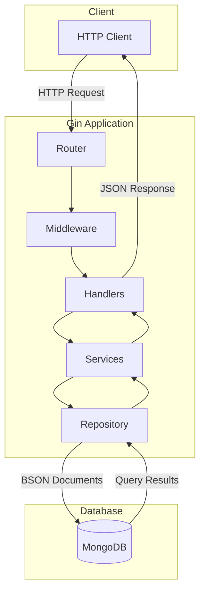
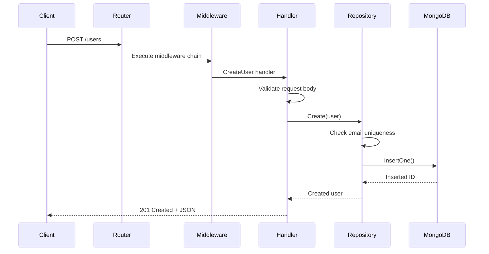

# How to Use Gin with MongoDB

Author: [nawazdhandala](https://www.github.com/nawazdhandala)

Tags: Go, Gin, MongoDB, REST API, CRUD, Database, Backend Development

Description: A practical guide to building REST APIs with Gin and MongoDB in Go, covering database connections, CRUD operations, and production-ready patterns.

---

> Gin is one of the fastest HTTP frameworks in Go, and MongoDB is a flexible NoSQL database. Together, they make a powerful combination for building scalable REST APIs. This guide walks you through setting up a complete CRUD application with production-ready patterns.

Building web applications with Go has become increasingly popular due to its performance and simplicity. Gin provides an expressive API with middleware support, while MongoDB offers flexible document storage that works well with Go structs.

---

## Architecture Overview

Here is how the components interact in a typical Gin-MongoDB application:



---

## Project Setup

First, create a new Go project and install the required dependencies:

```bash
# Create a new directory for your project
mkdir gin-mongodb-api
cd gin-mongodb-api

# Initialize Go module
go mod init gin-mongodb-api

# Install Gin web framework
go get -u github.com/gin-gonic/gin

# Install MongoDB Go driver
go get go.mongodb.org/mongo-driver/mongo
```

---

## Project Structure

Organize your project with a clean structure that separates concerns:

```
gin-mongodb-api/
├── main.go              # Application entry point
├── config/
│   └── config.go        # Configuration management
├── models/
│   └── user.go          # Data models
├── repository/
│   └── user_repository.go  # Database operations
├── handlers/
│   └── user_handler.go  # HTTP handlers
├── middleware/
│   └── auth.go          # Custom middleware
└── routes/
    └── routes.go        # Route definitions
```

---

## Database Connection

Create a robust MongoDB connection with proper error handling and connection pooling:

```go
// config/config.go
package config

import (
	"context"
	"log"
	"time"

	"go.mongodb.org/mongo-driver/mongo"
	"go.mongodb.org/mongo-driver/mongo/options"
)

// Database holds the MongoDB client and database references
type Database struct {
	Client   *mongo.Client
	Database *mongo.Database
}

// ConnectDB establishes a connection to MongoDB and returns a Database instance.
// It configures connection pooling and sets appropriate timeouts.
func ConnectDB(uri, dbName string) (*Database, error) {
	// Create a context with timeout for the connection attempt
	ctx, cancel := context.WithTimeout(context.Background(), 10*time.Second)
	defer cancel()

	// Configure client options with connection pooling
	clientOptions := options.Client().
		ApplyURI(uri).
		SetMaxPoolSize(50).                       // Maximum connections in the pool
		SetMinPoolSize(10).                       // Minimum connections to maintain
		SetMaxConnIdleTime(30 * time.Second).     // Close idle connections after 30s
		SetServerSelectionTimeout(5 * time.Second) // Timeout for server selection

	// Connect to MongoDB
	client, err := mongo.Connect(ctx, clientOptions)
	if err != nil {
		return nil, err
	}

	// Verify the connection by pinging the server
	if err := client.Ping(ctx, nil); err != nil {
		return nil, err
	}

	log.Println("Connected to MongoDB successfully")

	return &Database{
		Client:   client,
		Database: client.Database(dbName),
	}, nil
}

// Disconnect closes the MongoDB connection gracefully.
// Call this when shutting down the application.
func (db *Database) Disconnect() error {
	ctx, cancel := context.WithTimeout(context.Background(), 10*time.Second)
	defer cancel()
	return db.Client.Disconnect(ctx)
}

// GetCollection returns a reference to the specified collection.
// Use this to perform operations on a specific collection.
func (db *Database) GetCollection(name string) *mongo.Collection {
	return db.Database.Collection(name)
}
```

---

## Data Models

Define your data structures with proper BSON and JSON tags:

```go
// models/user.go
package models

import (
	"time"

	"go.mongodb.org/mongo-driver/bson/primitive"
)

// User represents a user document in MongoDB.
// The bson tags define how fields are stored in MongoDB.
// The json tags define how fields appear in API responses.
type User struct {
	// ID is the MongoDB ObjectID, automatically generated if not provided
	ID primitive.ObjectID `bson:"_id,omitempty" json:"id,omitempty"`

	// Name is the user's full name (required)
	Name string `bson:"name" json:"name" binding:"required"`

	// Email must be unique and is used for authentication
	Email string `bson:"email" json:"email" binding:"required,email"`

	// Password is hashed before storage (excluded from JSON responses)
	Password string `bson:"password" json:"-" binding:"required,min=8"`

	// Role defines user permissions (admin, user, guest)
	Role string `bson:"role" json:"role"`

	// Active indicates if the account is enabled
	Active bool `bson:"active" json:"active"`

	// CreatedAt is set automatically when the document is created
	CreatedAt time.Time `bson:"created_at" json:"created_at"`

	// UpdatedAt is updated whenever the document changes
	UpdatedAt time.Time `bson:"updated_at" json:"updated_at"`
}

// CreateUserRequest contains the fields required to create a new user.
// Using a separate struct prevents clients from setting internal fields.
type CreateUserRequest struct {
	Name     string `json:"name" binding:"required,min=2,max=100"`
	Email    string `json:"email" binding:"required,email"`
	Password string `json:"password" binding:"required,min=8"`
	Role     string `json:"role" binding:"omitempty,oneof=admin user guest"`
}

// UpdateUserRequest contains fields that can be updated.
// All fields are optional to support partial updates.
type UpdateUserRequest struct {
	Name   *string `json:"name" binding:"omitempty,min=2,max=100"`
	Email  *string `json:"email" binding:"omitempty,email"`
	Role   *string `json:"role" binding:"omitempty,oneof=admin user guest"`
	Active *bool   `json:"active"`
}
```

---

## Repository Layer

The repository pattern encapsulates all database operations:

```go
// repository/user_repository.go
package repository

import (
	"context"
	"errors"
	"time"

	"gin-mongodb-api/models"

	"go.mongodb.org/mongo-driver/bson"
	"go.mongodb.org/mongo-driver/bson/primitive"
	"go.mongodb.org/mongo-driver/mongo"
	"go.mongodb.org/mongo-driver/mongo/options"
)

// Common errors returned by the repository
var (
	ErrUserNotFound      = errors.New("user not found")
	ErrEmailAlreadyExists = errors.New("email already exists")
)

// UserRepository handles all user-related database operations.
// It abstracts MongoDB operations behind a clean interface.
type UserRepository struct {
	collection *mongo.Collection
}

// NewUserRepository creates a new repository instance.
// Pass the MongoDB collection to use for user documents.
func NewUserRepository(collection *mongo.Collection) *UserRepository {
	return &UserRepository{
		collection: collection,
	}
}

// Create inserts a new user document into the database.
// It sets timestamps and returns the created user with its ID.
func (r *UserRepository) Create(ctx context.Context, user *models.User) (*models.User, error) {
	// Check if email already exists to prevent duplicates
	existingUser, _ := r.FindByEmail(ctx, user.Email)
	if existingUser != nil {
		return nil, ErrEmailAlreadyExists
	}

	// Set timestamps
	now := time.Now()
	user.CreatedAt = now
	user.UpdatedAt = now

	// Set default values if not provided
	if user.Role == "" {
		user.Role = "user"
	}
	user.Active = true

	// Insert the document
	result, err := r.collection.InsertOne(ctx, user)
	if err != nil {
		return nil, err
	}

	// Set the generated ID on the user struct
	user.ID = result.InsertedID.(primitive.ObjectID)

	return user, nil
}

// FindByID retrieves a user by their ObjectID.
// Returns ErrUserNotFound if no user matches the ID.
func (r *UserRepository) FindByID(ctx context.Context, id primitive.ObjectID) (*models.User, error) {
	var user models.User

	// Create filter to match the _id field
	filter := bson.M{"_id": id}

	// Execute the query
	err := r.collection.FindOne(ctx, filter).Decode(&user)
	if err != nil {
		if err == mongo.ErrNoDocuments {
			return nil, ErrUserNotFound
		}
		return nil, err
	}

	return &user, nil
}

// FindByEmail retrieves a user by their email address.
// Useful for authentication and duplicate checking.
func (r *UserRepository) FindByEmail(ctx context.Context, email string) (*models.User, error) {
	var user models.User

	filter := bson.M{"email": email}

	err := r.collection.FindOne(ctx, filter).Decode(&user)
	if err != nil {
		if err == mongo.ErrNoDocuments {
			return nil, ErrUserNotFound
		}
		return nil, err
	}

	return &user, nil
}

// FindAll retrieves users with pagination support.
// Use page and limit to control the result set size.
func (r *UserRepository) FindAll(ctx context.Context, page, limit int64) ([]*models.User, int64, error) {
	var users []*models.User

	// Calculate skip value for pagination
	skip := (page - 1) * limit

	// Configure query options for pagination and sorting
	findOptions := options.Find().
		SetSkip(skip).
		SetLimit(limit).
		SetSort(bson.M{"created_at": -1}) // Sort by newest first

	// Execute the query with empty filter (match all documents)
	cursor, err := r.collection.Find(ctx, bson.M{}, findOptions)
	if err != nil {
		return nil, 0, err
	}
	defer cursor.Close(ctx)

	// Decode all documents from the cursor
	if err := cursor.All(ctx, &users); err != nil {
		return nil, 0, err
	}

	// Get total count for pagination metadata
	total, err := r.collection.CountDocuments(ctx, bson.M{})
	if err != nil {
		return nil, 0, err
	}

	return users, total, nil
}

// Update modifies an existing user document.
// Only non-nil fields in the update map will be changed.
func (r *UserRepository) Update(ctx context.Context, id primitive.ObjectID, update bson.M) (*models.User, error) {
	// Always update the updated_at timestamp
	update["updated_at"] = time.Now()

	// Configure update operation
	filter := bson.M{"_id": id}
	updateDoc := bson.M{"$set": update}

	// Use FindOneAndUpdate to get the updated document in one operation
	opts := options.FindOneAndUpdate().SetReturnDocument(options.After)

	var user models.User
	err := r.collection.FindOneAndUpdate(ctx, filter, updateDoc, opts).Decode(&user)
	if err != nil {
		if err == mongo.ErrNoDocuments {
			return nil, ErrUserNotFound
		}
		return nil, err
	}

	return &user, nil
}

// Delete removes a user document from the database.
// Returns ErrUserNotFound if the user does not exist.
func (r *UserRepository) Delete(ctx context.Context, id primitive.ObjectID) error {
	filter := bson.M{"_id": id}

	result, err := r.collection.DeleteOne(ctx, filter)
	if err != nil {
		return err
	}

	// Check if any document was deleted
	if result.DeletedCount == 0 {
		return ErrUserNotFound
	}

	return nil
}
```

---

## HTTP Handlers

Create handlers that process HTTP requests and return JSON responses:

```go
// handlers/user_handler.go
package handlers

import (
	"net/http"
	"strconv"

	"gin-mongodb-api/models"
	"gin-mongodb-api/repository"

	"github.com/gin-gonic/gin"
	"go.mongodb.org/mongo-driver/bson"
	"go.mongodb.org/mongo-driver/bson/primitive"
)

// UserHandler contains all HTTP handlers for user operations.
// It depends on the repository for database access.
type UserHandler struct {
	repo *repository.UserRepository
}

// NewUserHandler creates a new handler with the given repository.
func NewUserHandler(repo *repository.UserRepository) *UserHandler {
	return &UserHandler{repo: repo}
}

// CreateUser handles POST /users requests.
// It validates the request body and creates a new user.
func (h *UserHandler) CreateUser(c *gin.Context) {
	var req models.CreateUserRequest

	// Bind and validate JSON request body
	if err := c.ShouldBindJSON(&req); err != nil {
		c.JSON(http.StatusBadRequest, gin.H{
			"error":   "Invalid request body",
			"details": err.Error(),
		})
		return
	}

	// Create user model from request
	user := &models.User{
		Name:     req.Name,
		Email:    req.Email,
		Password: req.Password, // In production, hash this password
		Role:     req.Role,
	}

	// Save to database
	createdUser, err := h.repo.Create(c.Request.Context(), user)
	if err != nil {
		if err == repository.ErrEmailAlreadyExists {
			c.JSON(http.StatusConflict, gin.H{
				"error": "A user with this email already exists",
			})
			return
		}
		c.JSON(http.StatusInternalServerError, gin.H{
			"error": "Failed to create user",
		})
		return
	}

	c.JSON(http.StatusCreated, gin.H{
		"message": "User created successfully",
		"user":    createdUser,
	})
}

// GetUser handles GET /users/:id requests.
// It retrieves a single user by their ID.
func (h *UserHandler) GetUser(c *gin.Context) {
	// Parse the ID parameter from the URL
	idParam := c.Param("id")
	id, err := primitive.ObjectIDFromHex(idParam)
	if err != nil {
		c.JSON(http.StatusBadRequest, gin.H{
			"error": "Invalid user ID format",
		})
		return
	}

	// Fetch user from database
	user, err := h.repo.FindByID(c.Request.Context(), id)
	if err != nil {
		if err == repository.ErrUserNotFound {
			c.JSON(http.StatusNotFound, gin.H{
				"error": "User not found",
			})
			return
		}
		c.JSON(http.StatusInternalServerError, gin.H{
			"error": "Failed to fetch user",
		})
		return
	}

	c.JSON(http.StatusOK, user)
}

// ListUsers handles GET /users requests.
// It returns a paginated list of users.
func (h *UserHandler) ListUsers(c *gin.Context) {
	// Parse pagination parameters with defaults
	page, _ := strconv.ParseInt(c.DefaultQuery("page", "1"), 10, 64)
	limit, _ := strconv.ParseInt(c.DefaultQuery("limit", "10"), 10, 64)

	// Enforce reasonable limits
	if page < 1 {
		page = 1
	}
	if limit < 1 || limit > 100 {
		limit = 10
	}

	// Fetch users from database
	users, total, err := h.repo.FindAll(c.Request.Context(), page, limit)
	if err != nil {
		c.JSON(http.StatusInternalServerError, gin.H{
			"error": "Failed to fetch users",
		})
		return
	}

	// Calculate pagination metadata
	totalPages := (total + limit - 1) / limit

	c.JSON(http.StatusOK, gin.H{
		"users": users,
		"pagination": gin.H{
			"page":        page,
			"limit":       limit,
			"total":       total,
			"total_pages": totalPages,
		},
	})
}

// UpdateUser handles PUT /users/:id requests.
// It updates specific fields of an existing user.
func (h *UserHandler) UpdateUser(c *gin.Context) {
	// Parse the ID parameter
	idParam := c.Param("id")
	id, err := primitive.ObjectIDFromHex(idParam)
	if err != nil {
		c.JSON(http.StatusBadRequest, gin.H{
			"error": "Invalid user ID format",
		})
		return
	}

	// Bind the update request
	var req models.UpdateUserRequest
	if err := c.ShouldBindJSON(&req); err != nil {
		c.JSON(http.StatusBadRequest, gin.H{
			"error":   "Invalid request body",
			"details": err.Error(),
		})
		return
	}

	// Build update document with only provided fields
	update := bson.M{}
	if req.Name != nil {
		update["name"] = *req.Name
	}
	if req.Email != nil {
		update["email"] = *req.Email
	}
	if req.Role != nil {
		update["role"] = *req.Role
	}
	if req.Active != nil {
		update["active"] = *req.Active
	}

	// Check if there is anything to update
	if len(update) == 0 {
		c.JSON(http.StatusBadRequest, gin.H{
			"error": "No fields to update",
		})
		return
	}

	// Perform the update
	updatedUser, err := h.repo.Update(c.Request.Context(), id, update)
	if err != nil {
		if err == repository.ErrUserNotFound {
			c.JSON(http.StatusNotFound, gin.H{
				"error": "User not found",
			})
			return
		}
		c.JSON(http.StatusInternalServerError, gin.H{
			"error": "Failed to update user",
		})
		return
	}

	c.JSON(http.StatusOK, gin.H{
		"message": "User updated successfully",
		"user":    updatedUser,
	})
}

// DeleteUser handles DELETE /users/:id requests.
// It removes a user from the database.
func (h *UserHandler) DeleteUser(c *gin.Context) {
	// Parse the ID parameter
	idParam := c.Param("id")
	id, err := primitive.ObjectIDFromHex(idParam)
	if err != nil {
		c.JSON(http.StatusBadRequest, gin.H{
			"error": "Invalid user ID format",
		})
		return
	}

	// Delete the user
	err = h.repo.Delete(c.Request.Context(), id)
	if err != nil {
		if err == repository.ErrUserNotFound {
			c.JSON(http.StatusNotFound, gin.H{
				"error": "User not found",
			})
			return
		}
		c.JSON(http.StatusInternalServerError, gin.H{
			"error": "Failed to delete user",
		})
		return
	}

	c.JSON(http.StatusOK, gin.H{
		"message": "User deleted successfully",
	})
}
```

---

## Request Flow

Here is how a typical request flows through the application:



---

## Route Configuration

Set up routes with middleware:

```go
// routes/routes.go
package routes

import (
	"gin-mongodb-api/handlers"

	"github.com/gin-gonic/gin"
)

// SetupRoutes configures all API routes and applies middleware.
// It organizes routes by version for API versioning support.
func SetupRoutes(router *gin.Engine, userHandler *handlers.UserHandler) {
	// Health check endpoint (no auth required)
	router.GET("/health", func(c *gin.Context) {
		c.JSON(200, gin.H{"status": "healthy"})
	})

	// API v1 routes
	v1 := router.Group("/api/v1")
	{
		// User routes
		users := v1.Group("/users")
		{
			users.POST("", userHandler.CreateUser)
			users.GET("", userHandler.ListUsers)
			users.GET("/:id", userHandler.GetUser)
			users.PUT("/:id", userHandler.UpdateUser)
			users.DELETE("/:id", userHandler.DeleteUser)
		}
	}
}
```

---

## Main Application

Bring everything together in the main file:

```go
// main.go
package main

import (
	"log"
	"os"
	"os/signal"
	"syscall"

	"gin-mongodb-api/config"
	"gin-mongodb-api/handlers"
	"gin-mongodb-api/repository"
	"gin-mongodb-api/routes"

	"github.com/gin-gonic/gin"
)

func main() {
	// Load configuration from environment variables
	mongoURI := getEnv("MONGODB_URI", "mongodb://localhost:27017")
	dbName := getEnv("DB_NAME", "gin_mongodb_api")
	port := getEnv("PORT", "8080")

	// Connect to MongoDB
	db, err := config.ConnectDB(mongoURI, dbName)
	if err != nil {
		log.Fatalf("Failed to connect to MongoDB: %v", err)
	}

	// Initialize repository and handlers
	userCollection := db.GetCollection("users")
	userRepo := repository.NewUserRepository(userCollection)
	userHandler := handlers.NewUserHandler(userRepo)

	// Create Gin router with default middleware (logger, recovery)
	router := gin.Default()

	// Configure routes
	routes.SetupRoutes(router, userHandler)

	// Start server in a goroutine
	go func() {
		log.Printf("Server starting on port %s", port)
		if err := router.Run(":" + port); err != nil {
			log.Fatalf("Failed to start server: %v", err)
		}
	}()

	// Wait for interrupt signal for graceful shutdown
	quit := make(chan os.Signal, 1)
	signal.Notify(quit, syscall.SIGINT, syscall.SIGTERM)
	<-quit

	log.Println("Shutting down server...")

	// Disconnect from MongoDB
	if err := db.Disconnect(); err != nil {
		log.Printf("Error disconnecting from MongoDB: %v", err)
	}

	log.Println("Server stopped")
}

// getEnv retrieves an environment variable or returns a default value.
func getEnv(key, defaultValue string) string {
	if value, exists := os.LookupEnv(key); exists {
		return value
	}
	return defaultValue
}
```

---

## Creating Indexes

Indexes improve query performance. Create them during application startup:

```go
// config/indexes.go
package config

import (
	"context"
	"log"
	"time"

	"go.mongodb.org/mongo-driver/bson"
	"go.mongodb.org/mongo-driver/mongo"
	"go.mongodb.org/mongo-driver/mongo/options"
)

// CreateIndexes sets up database indexes for optimal query performance.
// Run this during application startup or as a migration step.
func CreateIndexes(db *Database) error {
	ctx, cancel := context.WithTimeout(context.Background(), 30*time.Second)
	defer cancel()

	usersCollection := db.GetCollection("users")

	// Define indexes for the users collection
	indexes := []mongo.IndexModel{
		{
			// Unique index on email for fast lookups and uniqueness constraint
			Keys:    bson.D{{Key: "email", Value: 1}},
			Options: options.Index().SetUnique(true),
		},
		{
			// Index on created_at for sorting by date
			Keys: bson.D{{Key: "created_at", Value: -1}},
		},
		{
			// Compound index for filtering active users by role
			Keys: bson.D{
				{Key: "active", Value: 1},
				{Key: "role", Value: 1},
			},
		},
	}

	// Create all indexes
	names, err := usersCollection.Indexes().CreateMany(ctx, indexes)
	if err != nil {
		return err
	}

	log.Printf("Created indexes: %v", names)
	return nil
}
```

---

## Error Handling Middleware

Create consistent error responses across your API:

```go
// middleware/error_handler.go
package middleware

import (
	"log"
	"net/http"

	"github.com/gin-gonic/gin"
)

// ErrorResponse represents a standardized error response format.
type ErrorResponse struct {
	Code    string `json:"code"`
	Message string `json:"message"`
	Details any    `json:"details,omitempty"`
}

// ErrorHandler is middleware that catches panics and returns proper error responses.
func ErrorHandler() gin.HandlerFunc {
	return func(c *gin.Context) {
		defer func() {
			if err := recover(); err != nil {
				// Log the panic for debugging
				log.Printf("Panic recovered: %v", err)

				c.JSON(http.StatusInternalServerError, ErrorResponse{
					Code:    "INTERNAL_ERROR",
					Message: "An unexpected error occurred",
				})
				c.Abort()
			}
		}()

		c.Next()

		// Handle any errors set during request processing
		if len(c.Errors) > 0 {
			err := c.Errors.Last()
			c.JSON(http.StatusInternalServerError, ErrorResponse{
				Code:    "REQUEST_ERROR",
				Message: err.Error(),
			})
		}
	}
}
```

---

## Aggregation Pipeline Example

MongoDB aggregation pipelines allow complex data transformations:

```go
// repository/user_repository.go (additional method)

// GetUserStats returns aggregated statistics about users.
// This demonstrates MongoDB's aggregation pipeline capabilities.
func (r *UserRepository) GetUserStats(ctx context.Context) (map[string]any, error) {
	// Define the aggregation pipeline
	pipeline := mongo.Pipeline{
		// Stage 1: Group users by role and count them
		{{Key: "$group", Value: bson.D{
			{Key: "_id", Value: "$role"},
			{Key: "count", Value: bson.D{{Key: "$sum", Value: 1}}},
			{Key: "activeCount", Value: bson.D{
				{Key: "$sum", Value: bson.D{
					{Key: "$cond", Value: bson.A{"$active", 1, 0}},
				}},
			}},
		}}},
		// Stage 2: Sort by count descending
		{{Key: "$sort", Value: bson.D{{Key: "count", Value: -1}}}},
	}

	// Execute the aggregation
	cursor, err := r.collection.Aggregate(ctx, pipeline)
	if err != nil {
		return nil, err
	}
	defer cursor.Close(ctx)

	// Decode results
	var results []bson.M
	if err := cursor.All(ctx, &results); err != nil {
		return nil, err
	}

	// Get total count
	total, _ := r.collection.CountDocuments(ctx, bson.M{})

	return map[string]any{
		"total":    total,
		"by_role":  results,
	}, nil
}
```

---

## Testing Your API

Use curl or httpie to test your endpoints:

```bash
# Create a new user
curl -X POST http://localhost:8080/api/v1/users \
  -H "Content-Type: application/json" \
  -d '{
    "name": "John Doe",
    "email": "john@example.com",
    "password": "securepassword123"
  }'

# Get all users with pagination
curl "http://localhost:8080/api/v1/users?page=1&limit=10"

# Get a specific user by ID
curl http://localhost:8080/api/v1/users/507f1f77bcf86cd799439011

# Update a user
curl -X PUT http://localhost:8080/api/v1/users/507f1f77bcf86cd799439011 \
  -H "Content-Type: application/json" \
  -d '{
    "name": "John Updated",
    "role": "admin"
  }'

# Delete a user
curl -X DELETE http://localhost:8080/api/v1/users/507f1f77bcf86cd799439011
```

---

## Production Considerations

When deploying to production, keep these points in mind:

| Aspect | Recommendation |
|--------|----------------|
| **Connection Pooling** | Set appropriate min/max pool sizes based on load |
| **Timeouts** | Configure read/write timeouts to prevent hung connections |
| **Indexes** | Create indexes for all frequently queried fields |
| **Validation** | Validate all input at the handler level |
| **Logging** | Log all errors and important operations |
| **Monitoring** | Track connection pool usage and query latency |
| **Security** | Use TLS for MongoDB connections, hash passwords |

---

## Conclusion

You now have a solid foundation for building REST APIs with Gin and MongoDB. Key takeaways:

- **Repository pattern** keeps database logic separate from HTTP handling
- **Proper connection management** prevents resource leaks
- **Input validation** using Gin's binding tags catches errors early
- **Pagination** is essential for listing endpoints
- **Indexes** significantly improve query performance

This architecture scales well from small projects to production applications handling thousands of requests per second.

---

*Need to monitor your Gin and MongoDB application in production? [OneUptime](https://oneuptime.com) provides comprehensive application monitoring with distributed tracing and error tracking.*

**Related Reading:**
- [How to Implement Connection Pooling in MongoDB](https://oneuptime.com/blog/post/2025-12-15-mongodb-connection-closed-errors)
- [How to Instrument Go Applications with OpenTelemetry](https://oneuptime.com/blog/post/2026-01-07-go-opentelemetry-instrumentation)
