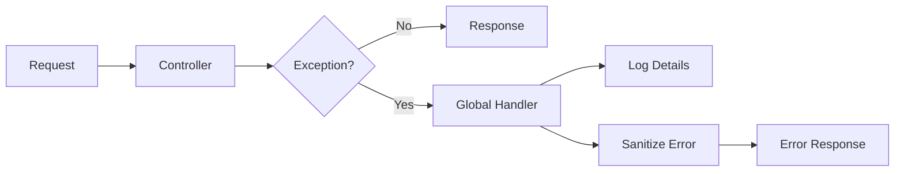

# How to Build a Global Exception Handler in ASP.NET Core

Author: [nawazdhandala](https://www.github.com/nawazdhandala)

Tags: .NET, C#, ASP.NET Core, Error Handling, Middleware

Description: Learn how to build a production-ready global exception handler in ASP.NET Core that provides consistent error responses, proper logging, and security through hiding sensitive error details.

---

Proper exception handling is essential for production applications. Without a global handler, unhandled exceptions leak stack traces to users, provide inconsistent error formats, and make debugging difficult. ASP.NET Core 8 introduces IExceptionHandler, a clean way to centralize exception handling across your entire application.

## Why Global Exception Handling?

Every API should return consistent error responses. Without centralized handling, different endpoints might return errors in different formats, making it harder for clients to parse errors. A global handler also ensures sensitive information never leaks to clients while still capturing full details in logs.



## The Problem Response Structure

Define a consistent error response format that clients can rely on.

```csharp
// ProblemResponse.cs
public class ProblemResponse
{
    public string Type { get; set; } = "about:blank";
    public string Title { get; set; } = string.Empty;
    public int Status { get; set; }
    public string? Detail { get; set; }
    public string? Instance { get; set; }
    public string TraceId { get; set; } = string.Empty;
    public Dictionary<string, string[]>? Errors { get; set; }
    public DateTimeOffset Timestamp { get; set; }
}

// This follows RFC 7807 Problem Details standard
// Example response:
// {
//   "type": "https://yourapi.com/errors/validation",
//   "title": "Validation Failed",
//   "status": 400,
//   "detail": "One or more validation errors occurred.",
//   "instance": "/api/users",
//   "traceId": "00-abc123...",
//   "errors": {
//     "email": ["Email is required", "Email format is invalid"]
//   },
//   "timestamp": "2026-01-25T10:30:00Z"
// }
```

## Creating Custom Exceptions

Define custom exception types for different error scenarios. This allows the handler to return appropriate HTTP status codes.

```csharp
// Custom exception base class
public abstract class AppException : Exception
{
    public abstract int StatusCode { get; }
    public abstract string ErrorType { get; }

    protected AppException(string message) : base(message) { }
    protected AppException(string message, Exception inner) : base(message, inner) { }
}

// 404 Not Found
public class NotFoundException : AppException
{
    public override int StatusCode => 404;
    public override string ErrorType => "https://yourapi.com/errors/not-found";

    public NotFoundException(string resource, object id)
        : base($"{resource} with ID '{id}' was not found.") { }
}

// 400 Bad Request
public class ValidationException : AppException
{
    public override int StatusCode => 400;
    public override string ErrorType => "https://yourapi.com/errors/validation";
    public Dictionary<string, string[]> Errors { get; }

    public ValidationException(Dictionary<string, string[]> errors)
        : base("One or more validation errors occurred.")
    {
        Errors = errors;
    }

    public ValidationException(string field, string message)
        : base("Validation failed.")
    {
        Errors = new Dictionary<string, string[]>
        {
            { field, new[] { message } }
        };
    }
}

// 409 Conflict
public class ConflictException : AppException
{
    public override int StatusCode => 409;
    public override string ErrorType => "https://yourapi.com/errors/conflict";

    public ConflictException(string message) : base(message) { }
}

// 403 Forbidden
public class ForbiddenException : AppException
{
    public override int StatusCode => 403;
    public override string ErrorType => "https://yourapi.com/errors/forbidden";

    public ForbiddenException(string message = "You do not have permission to perform this action.")
        : base(message) { }
}

// 422 Unprocessable Entity (business rule violation)
public class BusinessRuleException : AppException
{
    public override int StatusCode => 422;
    public override string ErrorType => "https://yourapi.com/errors/business-rule";

    public BusinessRuleException(string message) : base(message) { }
}
```

## Implementing IExceptionHandler

ASP.NET Core 8 introduces IExceptionHandler for clean exception handling.

```csharp
// GlobalExceptionHandler.cs
using Microsoft.AspNetCore.Diagnostics;
using System.Diagnostics;

public class GlobalExceptionHandler : IExceptionHandler
{
    private readonly ILogger<GlobalExceptionHandler> _logger;
    private readonly IHostEnvironment _environment;

    public GlobalExceptionHandler(
        ILogger<GlobalExceptionHandler> logger,
        IHostEnvironment environment)
    {
        _logger = logger;
        _environment = environment;
    }

    public async ValueTask<bool> TryHandleAsync(
        HttpContext httpContext,
        Exception exception,
        CancellationToken cancellationToken)
    {
        // Get or create a trace ID for correlation
        var traceId = Activity.Current?.Id ?? httpContext.TraceIdentifier;

        // Log the exception with full details
        LogException(exception, traceId, httpContext);

        // Build the problem response
        var problem = CreateProblemResponse(exception, traceId, httpContext);

        // Set response properties
        httpContext.Response.StatusCode = problem.Status;
        httpContext.Response.ContentType = "application/problem+json";

        await httpContext.Response.WriteAsJsonAsync(problem, cancellationToken);

        // Return true to indicate the exception was handled
        return true;
    }

    private void LogException(
        Exception exception,
        string traceId,
        HttpContext context)
    {
        // Include contextual information in the log
        var logContext = new
        {
            TraceId = traceId,
            RequestPath = context.Request.Path.ToString(),
            RequestMethod = context.Request.Method,
            UserId = context.User?.FindFirst("sub")?.Value,
            ExceptionType = exception.GetType().Name
        };

        // Use appropriate log level based on exception type
        if (exception is AppException)
        {
            // Application exceptions are expected, log as Warning
            _logger.LogWarning(
                exception,
                "Application exception occurred. Context: {@Context}",
                logContext);
        }
        else
        {
            // Unexpected exceptions are errors
            _logger.LogError(
                exception,
                "Unhandled exception occurred. Context: {@Context}",
                logContext);
        }
    }

    private ProblemResponse CreateProblemResponse(
        Exception exception,
        string traceId,
        HttpContext context)
    {
        var problem = new ProblemResponse
        {
            TraceId = traceId,
            Instance = context.Request.Path,
            Timestamp = DateTimeOffset.UtcNow
        };

        switch (exception)
        {
            case ValidationException validationEx:
                problem.Type = validationEx.ErrorType;
                problem.Title = "Validation Failed";
                problem.Status = validationEx.StatusCode;
                problem.Detail = validationEx.Message;
                problem.Errors = validationEx.Errors;
                break;

            case NotFoundException notFoundEx:
                problem.Type = notFoundEx.ErrorType;
                problem.Title = "Resource Not Found";
                problem.Status = notFoundEx.StatusCode;
                problem.Detail = notFoundEx.Message;
                break;

            case ConflictException conflictEx:
                problem.Type = conflictEx.ErrorType;
                problem.Title = "Conflict";
                problem.Status = conflictEx.StatusCode;
                problem.Detail = conflictEx.Message;
                break;

            case ForbiddenException forbiddenEx:
                problem.Type = forbiddenEx.ErrorType;
                problem.Title = "Forbidden";
                problem.Status = forbiddenEx.StatusCode;
                problem.Detail = forbiddenEx.Message;
                break;

            case BusinessRuleException businessEx:
                problem.Type = businessEx.ErrorType;
                problem.Title = "Business Rule Violation";
                problem.Status = businessEx.StatusCode;
                problem.Detail = businessEx.Message;
                break;

            case OperationCanceledException:
                problem.Type = "https://yourapi.com/errors/cancelled";
                problem.Title = "Request Cancelled";
                problem.Status = 499;  // Client Closed Request
                problem.Detail = "The request was cancelled.";
                break;

            default:
                // For unexpected exceptions, hide details in production
                problem.Type = "https://yourapi.com/errors/internal";
                problem.Title = "Internal Server Error";
                problem.Status = 500;
                problem.Detail = _environment.IsDevelopment()
                    ? exception.Message
                    : "An unexpected error occurred. Please try again later.";
                break;
        }

        return problem;
    }
}
```

## Alternative: Exception Handling Middleware

If you are using an older version of ASP.NET Core or need more control, use middleware instead.

```csharp
// ExceptionHandlingMiddleware.cs
public class ExceptionHandlingMiddleware
{
    private readonly RequestDelegate _next;
    private readonly ILogger<ExceptionHandlingMiddleware> _logger;
    private readonly IHostEnvironment _environment;

    public ExceptionHandlingMiddleware(
        RequestDelegate next,
        ILogger<ExceptionHandlingMiddleware> logger,
        IHostEnvironment environment)
    {
        _next = next;
        _logger = logger;
        _environment = environment;
    }

    public async Task InvokeAsync(HttpContext context)
    {
        try
        {
            await _next(context);
        }
        catch (Exception ex)
        {
            await HandleExceptionAsync(context, ex);
        }
    }

    private async Task HandleExceptionAsync(HttpContext context, Exception exception)
    {
        var traceId = Activity.Current?.Id ?? context.TraceIdentifier;

        _logger.LogError(
            exception,
            "Exception occurred. TraceId: {TraceId}, Path: {Path}",
            traceId,
            context.Request.Path);

        var (statusCode, message) = exception switch
        {
            AppException appEx => (appEx.StatusCode, appEx.Message),
            _ => (500, _environment.IsDevelopment()
                ? exception.Message
                : "An unexpected error occurred.")
        };

        context.Response.StatusCode = statusCode;
        context.Response.ContentType = "application/problem+json";

        var problem = new ProblemResponse
        {
            Title = GetTitle(statusCode),
            Status = statusCode,
            Detail = message,
            TraceId = traceId,
            Instance = context.Request.Path,
            Timestamp = DateTimeOffset.UtcNow
        };

        await context.Response.WriteAsJsonAsync(problem);
    }

    private static string GetTitle(int statusCode) => statusCode switch
    {
        400 => "Bad Request",
        401 => "Unauthorized",
        403 => "Forbidden",
        404 => "Not Found",
        409 => "Conflict",
        422 => "Unprocessable Entity",
        _ => "Internal Server Error"
    };
}
```

## Handling Model Validation Errors

Override the default model validation behavior to use your custom error format.

```csharp
// Program.cs
builder.Services.AddControllers()
    .ConfigureApiBehaviorOptions(options =>
    {
        // Customize the automatic 400 response for model validation
        options.InvalidModelStateResponseFactory = context =>
        {
            var errors = context.ModelState
                .Where(e => e.Value?.Errors.Count > 0)
                .ToDictionary(
                    kvp => kvp.Key,
                    kvp => kvp.Value!.Errors.Select(e => e.ErrorMessage).ToArray()
                );

            var problem = new ProblemResponse
            {
                Type = "https://yourapi.com/errors/validation",
                Title = "Validation Failed",
                Status = 400,
                Detail = "One or more validation errors occurred.",
                Instance = context.HttpContext.Request.Path,
                TraceId = Activity.Current?.Id ?? context.HttpContext.TraceIdentifier,
                Errors = errors,
                Timestamp = DateTimeOffset.UtcNow
            };

            return new BadRequestObjectResult(problem)
            {
                ContentTypes = { "application/problem+json" }
            };
        };
    });
```

## Registration and Configuration

Register the exception handler in Program.cs.

```csharp
// Program.cs
var builder = WebApplication.CreateBuilder(args);

// Add services
builder.Services.AddControllers();

// Register the exception handler
builder.Services.AddExceptionHandler<GlobalExceptionHandler>();

// Required for IExceptionHandler to work
builder.Services.AddProblemDetails();

var app = builder.Build();

// Use the exception handler
// This must be early in the pipeline
app.UseExceptionHandler();

// Or if using middleware approach:
// app.UseMiddleware<ExceptionHandlingMiddleware>();

app.UseHttpsRedirection();
app.UseAuthentication();
app.UseAuthorization();

app.MapControllers();

app.Run();
```

## Using Custom Exceptions

With everything in place, throw custom exceptions from your services and controllers.

```csharp
// UserService.cs
public class UserService
{
    private readonly UserRepository _repository;

    public UserService(UserRepository repository)
    {
        _repository = repository;
    }

    public async Task<User> GetByIdAsync(int id)
    {
        var user = await _repository.FindByIdAsync(id);

        if (user == null)
        {
            // Throws 404 with appropriate message
            throw new NotFoundException("User", id);
        }

        return user;
    }

    public async Task<User> CreateAsync(CreateUserRequest request)
    {
        // Check for duplicate email
        var existing = await _repository.FindByEmailAsync(request.Email);

        if (existing != null)
        {
            // Throws 409 Conflict
            throw new ConflictException(
                $"A user with email '{request.Email}' already exists.");
        }

        // Custom validation
        if (request.Age < 18)
        {
            // Throws 400 with validation errors
            throw new ValidationException("age", "User must be at least 18 years old.");
        }

        return await _repository.CreateAsync(request);
    }

    public async Task DeleteAsync(int id, int requestingUserId)
    {
        var user = await GetByIdAsync(id);

        // Check permissions
        if (user.Id != requestingUserId && !await IsAdminAsync(requestingUserId))
        {
            // Throws 403 Forbidden
            throw new ForbiddenException("You can only delete your own account.");
        }

        await _repository.DeleteAsync(id);
    }
}

// UsersController.cs
[ApiController]
[Route("api/[controller]")]
public class UsersController : ControllerBase
{
    private readonly UserService _userService;

    public UsersController(UserService userService)
    {
        _userService = userService;
    }

    [HttpGet("{id}")]
    public async Task<ActionResult<User>> GetById(int id)
    {
        // If user not found, NotFoundException is thrown
        // Global handler catches it and returns 404 with proper format
        var user = await _userService.GetByIdAsync(id);
        return Ok(user);
    }

    [HttpPost]
    public async Task<ActionResult<User>> Create(CreateUserRequest request)
    {
        // ValidationException or ConflictException may be thrown
        // Global handler returns appropriate status code
        var user = await _userService.CreateAsync(request);
        return CreatedAtAction(nameof(GetById), new { id = user.Id }, user);
    }
}
```

## Testing Exception Handling

Write tests to verify your exception handler works correctly.

```csharp
// GlobalExceptionHandlerTests.cs
public class GlobalExceptionHandlerTests
{
    private readonly GlobalExceptionHandler _handler;
    private readonly Mock<ILogger<GlobalExceptionHandler>> _loggerMock;

    public GlobalExceptionHandlerTests()
    {
        _loggerMock = new Mock<ILogger<GlobalExceptionHandler>>();
        var environmentMock = new Mock<IHostEnvironment>();
        environmentMock.Setup(e => e.EnvironmentName).Returns("Production");

        _handler = new GlobalExceptionHandler(_loggerMock.Object, environmentMock.Object);
    }

    [Fact]
    public async Task TryHandleAsync_NotFoundException_Returns404()
    {
        // Arrange
        var context = new DefaultHttpContext();
        context.Response.Body = new MemoryStream();
        var exception = new NotFoundException("User", 123);

        // Act
        var result = await _handler.TryHandleAsync(
            context,
            exception,
            CancellationToken.None);

        // Assert
        Assert.True(result);
        Assert.Equal(404, context.Response.StatusCode);

        // Read response body
        context.Response.Body.Seek(0, SeekOrigin.Begin);
        var reader = new StreamReader(context.Response.Body);
        var body = await reader.ReadToEndAsync();
        var problem = JsonSerializer.Deserialize<ProblemResponse>(body);

        Assert.Equal("Resource Not Found", problem.Title);
        Assert.Contains("User", problem.Detail);
    }

    [Fact]
    public async Task TryHandleAsync_UnexpectedException_HidesDetailsInProduction()
    {
        // Arrange
        var context = new DefaultHttpContext();
        context.Response.Body = new MemoryStream();
        var exception = new InvalidOperationException("Sensitive database error details");

        // Act
        await _handler.TryHandleAsync(context, exception, CancellationToken.None);

        // Assert
        context.Response.Body.Seek(0, SeekOrigin.Begin);
        var reader = new StreamReader(context.Response.Body);
        var body = await reader.ReadToEndAsync();

        // Sensitive details should not appear in response
        Assert.DoesNotContain("database", body);
        Assert.Contains("unexpected error", body.ToLower());
    }
}
```

## Summary

A well-designed global exception handler provides several benefits:

| Benefit | Implementation |
|---------|----------------|
| Consistent format | RFC 7807 Problem Details |
| Proper status codes | Custom exception classes |
| Security | Hide stack traces in production |
| Debugging | Trace ID correlation |
| Logging | Contextual error logging |
| Testability | Centralized handling logic |

By centralizing exception handling, you ensure every error response follows the same format, making your API predictable and easier to consume. The trace ID allows you to correlate client error reports with server logs, speeding up debugging when issues occur.
