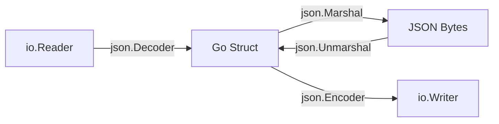
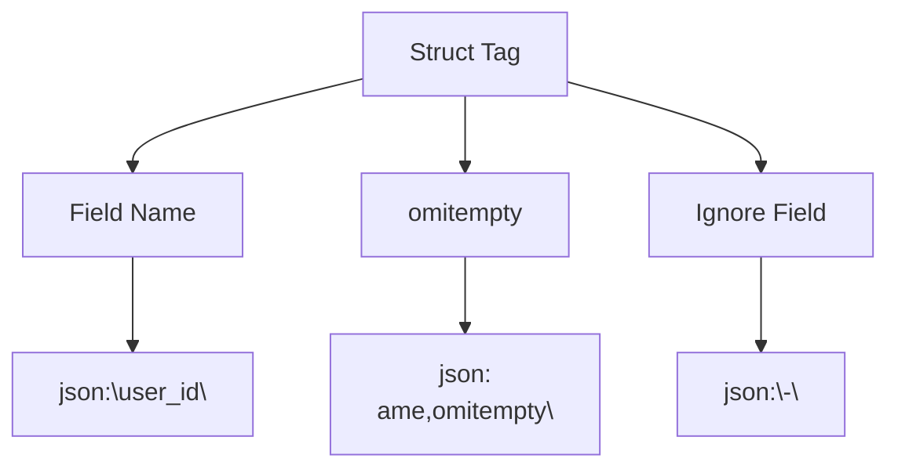
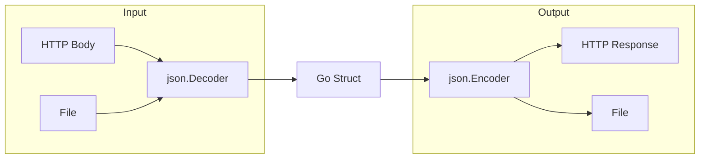
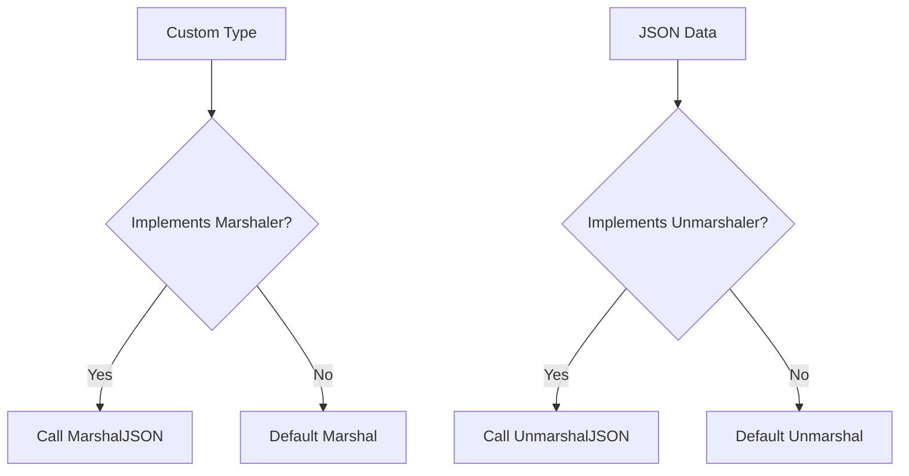
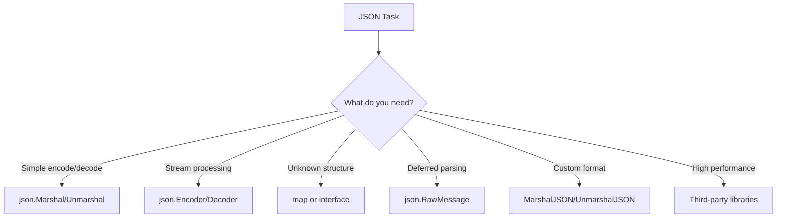

# How to Handle JSON in Go

Author: [nawazdhandala](https://www.github.com/nawazdhandala)

Tags: Go, JSON, Serialization, API Development, Data Processing

Description: Learn how to handle JSON in Go with encoding/decoding, struct tags, custom marshalers, streaming, and working with dynamic JSON data.

---

Go's `encoding/json` package provides everything you need to work with JSON data. This guide covers the fundamentals and advanced techniques for encoding and decoding JSON in Go applications.

---

## JSON Processing Overview



---

## Basic Encoding and Decoding

The `encoding/json` package provides two primary functions: `Marshal` for encoding Go values to JSON, and `Unmarshal` for decoding JSON into Go values.

```go
package main

import (
    "encoding/json"
    "fmt"
)

// User represents a user in our system.
// Struct fields must be exported (uppercase) to be included in JSON.
type User struct {
    ID        int    `json:"id"`
    Username  string `json:"username"`
    Email     string `json:"email"`
    IsActive  bool   `json:"is_active"`
}

func main() {
    // Create a user struct
    user := User{
        ID:       1,
        Username: "gopher",
        Email:    "gopher@example.com",
        IsActive: true,
    }

    // Marshal: Convert Go struct to JSON bytes
    jsonBytes, err := json.Marshal(user)
    if err != nil {
        fmt.Println("Error marshaling:", err)
        return
    }
    fmt.Println("JSON:", string(jsonBytes))
    // Output: JSON: {"id":1,"username":"gopher","email":"gopher@example.com","is_active":true}

    // Unmarshal: Convert JSON bytes back to Go struct
    jsonData := []byte(`{"id":2,"username":"newuser","email":"new@example.com","is_active":false}`)
    var decodedUser User
    err = json.Unmarshal(jsonData, &decodedUser)
    if err != nil {
        fmt.Println("Error unmarshaling:", err)
        return
    }
    fmt.Printf("Decoded: %+v\n", decodedUser)
    // Output: Decoded: {ID:2 Username:newuser Email:new@example.com IsActive:false}
}
```

---

## Pretty Printing with MarshalIndent

For human-readable JSON output, use `MarshalIndent`:

```go
package main

import (
    "encoding/json"
    "fmt"
)

type Config struct {
    Server   string   `json:"server"`
    Port     int      `json:"port"`
    Features []string `json:"features"`
}

func main() {
    config := Config{
        Server:   "localhost",
        Port:     8080,
        Features: []string{"auth", "logging", "metrics"},
    }

    // MarshalIndent takes prefix and indent strings
    // First argument is the prefix for each line
    // Second argument is the indent string
    prettyJSON, err := json.MarshalIndent(config, "", "  ")
    if err != nil {
        fmt.Println("Error:", err)
        return
    }
    fmt.Println(string(prettyJSON))
}
```

Output:
```json
{
  "server": "localhost",
  "port": 8080,
  "features": [
    "auth",
    "logging",
    "metrics"
  ]
}
```

---

## Struct Tags for JSON Control

Struct tags give you fine-grained control over JSON field names and behavior.



```go
package main

import (
    "encoding/json"
    "fmt"
)

type Product struct {
    // Custom JSON key name
    ID int `json:"product_id"`

    // Keep Go name but add omitempty
    Name string `json:"name"`

    // Omit from JSON if empty/zero value
    Description string `json:"description,omitempty"`

    // Completely ignore this field in JSON
    InternalCode string `json:"-"`

    // Field with zero value handling
    Price    float64 `json:"price"`
    Discount float64 `json:"discount,omitempty"`

    // Pointer fields: nil = omitted with omitempty
    Category *string `json:"category,omitempty"`
}

func main() {
    // Product with minimal data
    p1 := Product{
        ID:           1,
        Name:         "Widget",
        InternalCode: "W-001", // This won't appear in JSON
        Price:        29.99,
    }

    data, _ := json.MarshalIndent(p1, "", "  ")
    fmt.Println("Minimal product:")
    fmt.Println(string(data))
    // Note: description, discount, and category are omitted

    // Product with all fields
    category := "Electronics"
    p2 := Product{
        ID:           2,
        Name:         "Gadget",
        Description:  "A useful gadget",
        InternalCode: "G-002",
        Price:        99.99,
        Discount:     10.0,
        Category:     &category,
    }

    data, _ = json.MarshalIndent(p2, "", "  ")
    fmt.Println("\nFull product:")
    fmt.Println(string(data))
}
```

---

## Handling Nested Structures

JSON often contains nested objects and arrays. Go handles these naturally with nested structs and slices.

```go
package main

import (
    "encoding/json"
    "fmt"
)

// Address represents a physical address
type Address struct {
    Street  string `json:"street"`
    City    string `json:"city"`
    Country string `json:"country"`
    ZipCode string `json:"zip_code"`
}

// Order represents a customer order
type Order struct {
    OrderID string  `json:"order_id"`
    Total   float64 `json:"total"`
}

// Customer has nested address and slice of orders
type Customer struct {
    ID      int      `json:"id"`
    Name    string   `json:"name"`
    Address Address  `json:"address"`
    Orders  []Order  `json:"orders"`
    Tags    []string `json:"tags,omitempty"`
}

func main() {
    customer := Customer{
        ID:   1001,
        Name: "Jane Smith",
        Address: Address{
            Street:  "123 Main St",
            City:    "Portland",
            Country: "USA",
            ZipCode: "97201",
        },
        Orders: []Order{
            {OrderID: "ORD-001", Total: 150.00},
            {OrderID: "ORD-002", Total: 89.50},
        },
        Tags: []string{"premium", "verified"},
    }

    // Encode to JSON
    data, err := json.MarshalIndent(customer, "", "  ")
    if err != nil {
        fmt.Println("Error:", err)
        return
    }
    fmt.Println(string(data))

    // Decode JSON with nested structures
    jsonInput := `{
        "id": 1002,
        "name": "Bob Johnson",
        "address": {
            "street": "456 Oak Ave",
            "city": "Seattle",
            "country": "USA",
            "zip_code": "98101"
        },
        "orders": [
            {"order_id": "ORD-100", "total": 200.00}
        ]
    }`

    var decoded Customer
    err = json.Unmarshal([]byte(jsonInput), &decoded)
    if err != nil {
        fmt.Println("Decode error:", err)
        return
    }
    fmt.Printf("\nDecoded customer: %+v\n", decoded)
    fmt.Printf("First order: %+v\n", decoded.Orders[0])
}
```

---

## Streaming JSON with Encoder and Decoder

For working with streams (files, HTTP responses, network connections), use `json.Encoder` and `json.Decoder`:



```go
package main

import (
    "bytes"
    "encoding/json"
    "fmt"
    "strings"
)

type Message struct {
    Type    string `json:"type"`
    Content string `json:"content"`
}

func main() {
    // Simulate reading from a stream with multiple JSON objects
    // This is common when reading newline-delimited JSON (NDJSON)
    input := `{"type":"info","content":"Starting process"}
{"type":"warning","content":"Low memory"}
{"type":"error","content":"Connection failed"}`

    decoder := json.NewDecoder(strings.NewReader(input))

    fmt.Println("Decoding stream:")
    for decoder.More() {
        var msg Message
        if err := decoder.Decode(&msg); err != nil {
            fmt.Println("Decode error:", err)
            break
        }
        fmt.Printf("  [%s] %s\n", msg.Type, msg.Content)
    }

    // Encoding to a stream
    var output bytes.Buffer
    encoder := json.NewEncoder(&output)
    encoder.SetIndent("", "  ") // Optional: pretty print

    messages := []Message{
        {Type: "success", Content: "Task completed"},
        {Type: "info", Content: "Cleanup started"},
    }

    fmt.Println("\nEncoding to stream:")
    for _, msg := range messages {
        if err := encoder.Encode(msg); err != nil {
            fmt.Println("Encode error:", err)
            break
        }
    }
    fmt.Println(output.String())
}
```

---

## Working with Dynamic JSON

Sometimes you don't know the JSON structure ahead of time. Go provides several approaches for handling dynamic JSON.

### Using map[string]interface{}

```go
package main

import (
    "encoding/json"
    "fmt"
)

func main() {
    // Unknown JSON structure
    jsonData := `{
        "name": "Dynamic Object",
        "count": 42,
        "active": true,
        "tags": ["a", "b", "c"],
        "nested": {"key": "value"}
    }`

    // Decode into a map
    var data map[string]interface{}
    err := json.Unmarshal([]byte(jsonData), &data)
    if err != nil {
        fmt.Println("Error:", err)
        return
    }

    // Access values with type assertions
    name, ok := data["name"].(string)
    if ok {
        fmt.Println("Name:", name)
    }

    // Numbers decode as float64 by default
    count, ok := data["count"].(float64)
    if ok {
        fmt.Println("Count:", int(count))
    }

    // Nested objects are map[string]interface{}
    nested, ok := data["nested"].(map[string]interface{})
    if ok {
        fmt.Println("Nested key:", nested["key"])
    }

    // Arrays are []interface{}
    tags, ok := data["tags"].([]interface{})
    if ok {
        fmt.Print("Tags: ")
        for _, tag := range tags {
            fmt.Print(tag.(string), " ")
        }
        fmt.Println()
    }
}
```

### Using json.RawMessage for Deferred Parsing

```go
package main

import (
    "encoding/json"
    "fmt"
)

// Event has a fixed header but dynamic payload
type Event struct {
    Type    string          `json:"type"`
    Time    string          `json:"time"`
    Payload json.RawMessage `json:"payload"` // Parse later based on type
}

type UserPayload struct {
    UserID   int    `json:"user_id"`
    Username string `json:"username"`
}

type OrderPayload struct {
    OrderID string  `json:"order_id"`
    Amount  float64 `json:"amount"`
}

func main() {
    events := []string{
        `{"type":"user_created","time":"2024-01-15","payload":{"user_id":1,"username":"alice"}}`,
        `{"type":"order_placed","time":"2024-01-15","payload":{"order_id":"ORD-123","amount":99.99}}`,
    }

    for _, eventJSON := range events {
        var event Event
        err := json.Unmarshal([]byte(eventJSON), &event)
        if err != nil {
            fmt.Println("Error:", err)
            continue
        }

        fmt.Printf("Event type: %s at %s\n", event.Type, event.Time)

        // Parse payload based on event type
        switch event.Type {
        case "user_created":
            var payload UserPayload
            json.Unmarshal(event.Payload, &payload)
            fmt.Printf("  User: %d - %s\n", payload.UserID, payload.Username)

        case "order_placed":
            var payload OrderPayload
            json.Unmarshal(event.Payload, &payload)
            fmt.Printf("  Order: %s - $%.2f\n", payload.OrderID, payload.Amount)
        }
    }
}
```

---

## Custom Marshaling and Unmarshaling

Implement the `json.Marshaler` and `json.Unmarshaler` interfaces for custom JSON handling.



```go
package main

import (
    "encoding/json"
    "fmt"
    "strings"
    "time"
)

// CustomTime wraps time.Time with a custom format
type CustomTime struct {
    time.Time
}

// Custom format for JSON
const customTimeFormat = "2006-01-02"

// MarshalJSON implements json.Marshaler
func (ct CustomTime) MarshalJSON() ([]byte, error) {
    // Format time as "YYYY-MM-DD"
    formatted := fmt.Sprintf(`"%s"`, ct.Format(customTimeFormat))
    return []byte(formatted), nil
}

// UnmarshalJSON implements json.Unmarshaler
func (ct *CustomTime) UnmarshalJSON(data []byte) error {
    // Remove quotes from JSON string
    str := strings.Trim(string(data), `"`)
    if str == "null" {
        return nil
    }

    // Parse with custom format
    parsed, err := time.Parse(customTimeFormat, str)
    if err != nil {
        return err
    }
    ct.Time = parsed
    return nil
}

// Status type with custom string representation
type Status int

const (
    StatusPending Status = iota
    StatusActive
    StatusCompleted
)

// MarshalJSON converts Status to a string
func (s Status) MarshalJSON() ([]byte, error) {
    var str string
    switch s {
    case StatusPending:
        str = "pending"
    case StatusActive:
        str = "active"
    case StatusCompleted:
        str = "completed"
    default:
        str = "unknown"
    }
    return json.Marshal(str)
}

// UnmarshalJSON converts string to Status
func (s *Status) UnmarshalJSON(data []byte) error {
    var str string
    if err := json.Unmarshal(data, &str); err != nil {
        return err
    }
    switch str {
    case "pending":
        *s = StatusPending
    case "active":
        *s = StatusActive
    case "completed":
        *s = StatusCompleted
    default:
        *s = StatusPending
    }
    return nil
}

type Task struct {
    ID        int        `json:"id"`
    Title     string     `json:"title"`
    DueDate   CustomTime `json:"due_date"`
    Status    Status     `json:"status"`
}

func main() {
    task := Task{
        ID:      1,
        Title:   "Write documentation",
        DueDate: CustomTime{time.Date(2024, 6, 15, 0, 0, 0, 0, time.UTC)},
        Status:  StatusActive,
    }

    // Marshal with custom formats
    data, _ := json.MarshalIndent(task, "", "  ")
    fmt.Println("Marshaled:")
    fmt.Println(string(data))

    // Unmarshal with custom parsing
    jsonInput := `{"id":2,"title":"Review code","due_date":"2024-07-01","status":"pending"}`
    var decoded Task
    json.Unmarshal([]byte(jsonInput), &decoded)
    fmt.Printf("\nUnmarshaled: %+v\n", decoded)
    fmt.Printf("Due date (Go format): %s\n", decoded.DueDate.Format(time.RFC3339))
}
```

---

## Handling Errors

Always check for errors when working with JSON. Common error types include syntax errors, type mismatches, and missing required fields.

```go
package main

import (
    "encoding/json"
    "fmt"
)

type User struct {
    ID   int    `json:"id"`
    Name string `json:"name"`
}

func main() {
    testCases := []string{
        `{"id": 1, "name": "Alice"}`,           // Valid
        `{"id": "not a number", "name": "Bob"}`, // Type mismatch
        `{invalid json}`,                        // Syntax error
        `{"id": 1}`,                             // Missing field (allowed)
    }

    for i, jsonStr := range testCases {
        var user User
        err := json.Unmarshal([]byte(jsonStr), &user)

        fmt.Printf("Test %d: ", i+1)
        if err != nil {
            // Check error type for specific handling
            switch e := err.(type) {
            case *json.SyntaxError:
                fmt.Printf("Syntax error at offset %d\n", e.Offset)
            case *json.UnmarshalTypeError:
                fmt.Printf("Type error: expected %s for field %s, got %s\n",
                    e.Type, e.Field, e.Value)
            default:
                fmt.Printf("Error: %v\n", err)
            }
        } else {
            fmt.Printf("Success: %+v\n", user)
        }
    }
}
```

---

## Validation with Struct Tags

While Go's JSON package does not have built-in validation, you can combine it with validation libraries or implement your own.

```go
package main

import (
    "encoding/json"
    "errors"
    "fmt"
    "strings"
)

type CreateUserRequest struct {
    Username string `json:"username"`
    Email    string `json:"email"`
    Age      int    `json:"age"`
}

// Validate checks the request fields
func (r CreateUserRequest) Validate() error {
    var errs []string

    if r.Username == "" {
        errs = append(errs, "username is required")
    } else if len(r.Username) < 3 {
        errs = append(errs, "username must be at least 3 characters")
    }

    if r.Email == "" {
        errs = append(errs, "email is required")
    } else if !strings.Contains(r.Email, "@") {
        errs = append(errs, "email must be valid")
    }

    if r.Age < 0 {
        errs = append(errs, "age cannot be negative")
    } else if r.Age > 150 {
        errs = append(errs, "age seems invalid")
    }

    if len(errs) > 0 {
        return errors.New(strings.Join(errs, "; "))
    }
    return nil
}

func main() {
    testInputs := []string{
        `{"username": "alice", "email": "alice@example.com", "age": 25}`,
        `{"username": "ab", "email": "invalid", "age": -5}`,
        `{"username": "", "email": "", "age": 0}`,
    }

    for i, input := range testInputs {
        var req CreateUserRequest
        if err := json.Unmarshal([]byte(input), &req); err != nil {
            fmt.Printf("Test %d: Parse error: %v\n", i+1, err)
            continue
        }

        if err := req.Validate(); err != nil {
            fmt.Printf("Test %d: Validation failed: %v\n", i+1, err)
        } else {
            fmt.Printf("Test %d: Valid request: %+v\n", i+1, req)
        }
    }
}
```

---

## Performance Tips

When working with JSON in performance-critical applications, consider these tips:

```go
package main

import (
    "bytes"
    "encoding/json"
    "fmt"
    "sync"
)

type Data struct {
    ID    int    `json:"id"`
    Value string `json:"value"`
}

// Reuse buffers with sync.Pool to reduce allocations
var bufferPool = sync.Pool{
    New: func() interface{} {
        return new(bytes.Buffer)
    },
}

func encodeWithPool(data interface{}) ([]byte, error) {
    buf := bufferPool.Get().(*bytes.Buffer)
    buf.Reset()
    defer bufferPool.Put(buf)

    encoder := json.NewEncoder(buf)
    if err := encoder.Encode(data); err != nil {
        return nil, err
    }

    // Make a copy since we're returning the buffer to the pool
    result := make([]byte, buf.Len())
    copy(result, buf.Bytes())
    return result, nil
}

func main() {
    data := Data{ID: 1, Value: "test"}

    // Standard approach
    standard, _ := json.Marshal(data)
    fmt.Println("Standard:", string(standard))

    // Pooled approach (better for high-throughput scenarios)
    pooled, _ := encodeWithPool(data)
    fmt.Println("Pooled:", string(pooled))

    // For even better performance, consider:
    // 1. github.com/json-iterator/go - drop-in replacement, faster
    // 2. github.com/mailru/easyjson - code generation, much faster
    // 3. github.com/bytedance/sonic - SIMD-accelerated, fastest
}
```

---

## Common Patterns Summary



| Task | Approach |
|------|----------|
| Simple encoding | `json.Marshal(v)` |
| Pretty print | `json.MarshalIndent(v, "", "  ")` |
| Simple decoding | `json.Unmarshal(data, &v)` |
| Stream encoding | `json.NewEncoder(w).Encode(v)` |
| Stream decoding | `json.NewDecoder(r).Decode(&v)` |
| Custom field names | Struct tags `json:"name"` |
| Omit empty fields | `json:",omitempty"` |
| Ignore field | `json:"-"` |
| Dynamic JSON | `map[string]interface{}` |
| Deferred parsing | `json.RawMessage` |
| Custom format | Implement `Marshaler`/`Unmarshaler` |

---

## Summary

Go's `encoding/json` package provides a robust foundation for JSON handling:

1. Use `Marshal` and `Unmarshal` for simple encoding and decoding
2. Use struct tags to control field names and behavior
3. Use `Encoder` and `Decoder` for streaming scenarios
4. Use `map[string]interface{}` or `json.RawMessage` for dynamic JSON
5. Implement custom marshalers for special formatting needs
6. Always handle errors appropriately
7. Consider third-party libraries for performance-critical applications

The standard library handles most JSON tasks well. Only reach for alternatives when benchmarks show you need better performance.

---

*Want to monitor your Go API's JSON processing performance? [OneUptime](https://oneuptime.com) provides real-time monitoring and alerting to help you track response times and catch issues before your users do.*
