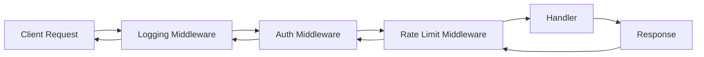
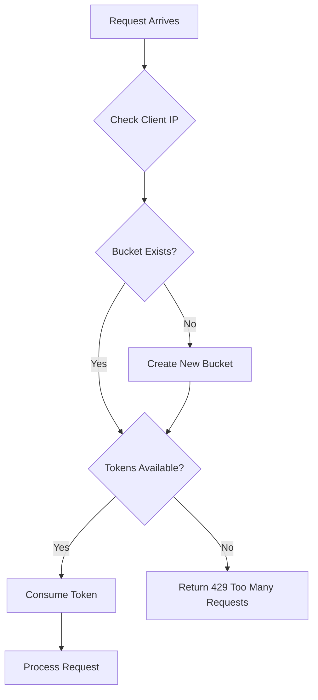
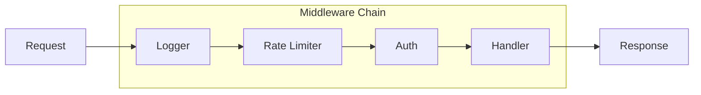
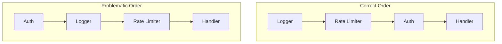

# How to Implement Middleware in Go Web Applications

Author: [nawazdhandala](https://www.github.com/nawazdhandala)

Tags: Go, Middleware, Web Development, HTTP, Backend Development

Description: Learn how to implement middleware in Go web applications for logging, authentication, rate limiting, and request processing chains.

---

Middleware sits between incoming HTTP requests and your application handlers. It lets you run code before and after your handlers execute, which is useful for cross-cutting concerns like logging, authentication, and rate limiting. Go's standard library makes middleware implementation straightforward because the `http.Handler` interface is simple and composable.

## How Middleware Works

The concept is straightforward. A middleware function takes a handler, wraps it with additional logic, and returns a new handler. The request flows through each middleware layer before reaching your final handler.



Each middleware can:
- Inspect or modify the request
- Decide whether to pass the request to the next handler
- Inspect or modify the response
- Perform cleanup after the handler returns

## The Basic Middleware Pattern

In Go, middleware follows a specific signature. It takes an `http.Handler` and returns an `http.Handler`.

```go
package main

import (
    "net/http"
)

// Middleware is a function that wraps an http.Handler
// and returns a new http.Handler with additional behavior
type Middleware func(http.Handler) http.Handler

// BasicMiddleware demonstrates the fundamental pattern
// It runs code before and after the next handler
func BasicMiddleware(next http.Handler) http.Handler {
    return http.HandlerFunc(func(w http.ResponseWriter, r *http.Request) {
        // Code here runs BEFORE the handler
        // You can inspect the request, set headers, etc.

        // Call the next handler in the chain
        next.ServeHTTP(w, r)

        // Code here runs AFTER the handler
        // The response has already been written at this point
    })
}
```

The `http.HandlerFunc` type is an adapter that lets you use ordinary functions as HTTP handlers. This is how Go turns a closure into something that satisfies the `http.Handler` interface.

## Building a Logging Middleware

Logging middleware captures request details and timing information. The challenge is capturing the response status code, which requires wrapping the ResponseWriter.

```go
package middleware

import (
    "log"
    "net/http"
    "time"
)

// statusRecorder wraps http.ResponseWriter to capture the status code
// Go's ResponseWriter doesn't expose the status after WriteHeader is called
type statusRecorder struct {
    http.ResponseWriter
    statusCode int
}

// WriteHeader captures the status code before passing it through
func (sr *statusRecorder) WriteHeader(code int) {
    sr.statusCode = code
    sr.ResponseWriter.WriteHeader(code)
}

// Logger middleware records request method, path, status, and duration
// Place this first in your middleware chain to capture all requests
func Logger(next http.Handler) http.Handler {
    return http.HandlerFunc(func(w http.ResponseWriter, r *http.Request) {
        // Record the start time before processing
        start := time.Now()

        // Wrap the ResponseWriter to capture status code
        recorder := &statusRecorder{
            ResponseWriter: w,
            statusCode:     http.StatusOK, // Default if WriteHeader is never called
        }

        // Process the request through remaining middleware and handler
        next.ServeHTTP(recorder, r)

        // Calculate duration and log the request details
        duration := time.Since(start)
        log.Printf(
            "[%s] %s %s - %d (%v)",
            r.RemoteAddr,
            r.Method,
            r.URL.Path,
            recorder.statusCode,
            duration,
        )
    })
}
```

The status recorder pattern is common in Go middleware. Without it, you have no way to know what status code your handler sent.

## Building Authentication Middleware

Authentication middleware validates credentials and attaches user information to the request context. This example uses Bearer tokens, but the pattern works with any auth scheme.

```go
package middleware

import (
    "context"
    "net/http"
    "strings"
)

// contextKey is a private type to prevent context key collisions
// Using a custom type ensures other packages cannot accidentally
// overwrite your context values
type contextKey string

// UserKey is the context key for storing user information
const UserKey contextKey = "user"

// User represents an authenticated user
type User struct {
    ID       string
    Username string
    Roles    []string
}

// AuthConfig holds authentication configuration
type AuthConfig struct {
    // ValidateToken should verify the token and return user info
    // Return nil and an error if the token is invalid
    ValidateToken func(token string) (*User, error)

    // SkipPaths lists paths that don't require authentication
    SkipPaths []string
}

// Auth middleware validates Bearer tokens and adds user to context
// Requests without valid tokens receive a 401 Unauthorized response
func Auth(config AuthConfig) func(http.Handler) http.Handler {
    return func(next http.Handler) http.Handler {
        return http.HandlerFunc(func(w http.ResponseWriter, r *http.Request) {
            // Check if this path should skip authentication
            for _, path := range config.SkipPaths {
                if r.URL.Path == path {
                    next.ServeHTTP(w, r)
                    return
                }
            }

            // Extract the Authorization header
            authHeader := r.Header.Get("Authorization")
            if authHeader == "" {
                http.Error(w, "Authorization header required", http.StatusUnauthorized)
                return
            }

            // Parse Bearer token format: "Bearer <token>"
            parts := strings.SplitN(authHeader, " ", 2)
            if len(parts) != 2 || parts[0] != "Bearer" {
                http.Error(w, "Invalid authorization format, expected Bearer token", http.StatusUnauthorized)
                return
            }

            // Validate the token using the provided function
            user, err := config.ValidateToken(parts[1])
            if err != nil {
                http.Error(w, "Invalid or expired token", http.StatusUnauthorized)
                return
            }

            // Add the user to the request context
            // Handlers can retrieve this with GetUserFromContext
            ctx := context.WithValue(r.Context(), UserKey, user)
            next.ServeHTTP(w, r.WithContext(ctx))
        })
    }
}

// GetUserFromContext retrieves the authenticated user from the request context
// Returns nil if no user is present (unauthenticated request)
func GetUserFromContext(r *http.Request) *User {
    user, ok := r.Context().Value(UserKey).(*User)
    if !ok {
        return nil
    }
    return user
}
```

The context pattern is the standard way to pass request-scoped data through the handler chain. Using a custom type for context keys prevents accidental collisions with keys from other packages.

## Building Rate Limiting Middleware

Rate limiting protects your API from abuse. This implementation uses a token bucket algorithm with per-client tracking.



```go
package middleware

import (
    "net/http"
    "sync"
    "time"
)

// RateLimiter tracks request rates per client
type RateLimiter struct {
    mu       sync.RWMutex
    clients  map[string]*bucket
    rate     int           // Tokens added per interval
    capacity int           // Maximum tokens in bucket
    interval time.Duration // How often to add tokens
}

// bucket tracks tokens for a single client
type bucket struct {
    tokens     int
    lastRefill time.Time
}

// NewRateLimiter creates a rate limiter with the specified parameters
// rate: number of requests allowed per interval
// capacity: maximum burst size
// interval: time period for rate calculation
func NewRateLimiter(rate, capacity int, interval time.Duration) *RateLimiter {
    return &RateLimiter{
        clients:  make(map[string]*bucket),
        rate:     rate,
        capacity: capacity,
        interval: interval,
    }
}

// getClientIP extracts the client IP address
// Checks X-Forwarded-For first for proxied requests
func getClientIP(r *http.Request) string {
    // Check for proxy headers first
    forwarded := r.Header.Get("X-Forwarded-For")
    if forwarded != "" {
        // X-Forwarded-For can contain multiple IPs, take the first
        return strings.Split(forwarded, ",")[0]
    }

    // Fall back to direct connection IP
    // RemoteAddr includes port, so strip it
    ip := r.RemoteAddr
    if colonIndex := strings.LastIndex(ip, ":"); colonIndex != -1 {
        ip = ip[:colonIndex]
    }
    return ip
}

// allow checks if a client can make a request
// Returns true if allowed, false if rate limited
func (rl *RateLimiter) allow(clientIP string) bool {
    rl.mu.Lock()
    defer rl.mu.Unlock()

    now := time.Now()

    // Get or create bucket for this client
    b, exists := rl.clients[clientIP]
    if !exists {
        // New client starts with full bucket
        rl.clients[clientIP] = &bucket{
            tokens:     rl.capacity - 1, // Minus one for current request
            lastRefill: now,
        }
        return true
    }

    // Refill tokens based on elapsed time
    elapsed := now.Sub(b.lastRefill)
    tokensToAdd := int(elapsed / rl.interval) * rl.rate

    if tokensToAdd > 0 {
        b.tokens += tokensToAdd
        if b.tokens > rl.capacity {
            b.tokens = rl.capacity
        }
        b.lastRefill = now
    }

    // Check if request is allowed
    if b.tokens > 0 {
        b.tokens--
        return true
    }

    return false
}

// Middleware returns the rate limiting middleware function
func (rl *RateLimiter) Middleware(next http.Handler) http.Handler {
    return http.HandlerFunc(func(w http.ResponseWriter, r *http.Request) {
        clientIP := getClientIP(r)

        if !rl.allow(clientIP) {
            // Set standard rate limit headers
            w.Header().Set("Retry-After", "60")
            w.Header().Set("X-RateLimit-Remaining", "0")
            http.Error(w, "Rate limit exceeded", http.StatusTooManyRequests)
            return
        }

        next.ServeHTTP(w, r)
    })
}
```

You need to add the missing import for strings at the top of the rate limiter file. The token bucket algorithm smoothly handles bursts while enforcing an average rate over time.

## Chaining Middleware

Multiple middleware functions need to be chained together. Go provides several approaches.

### Manual Chaining

The simplest approach nests function calls, but it becomes hard to read with many middleware.

```go
// Manual chaining works but gets unwieldy
handler := Logger(Auth(authConfig)(RateLimiter.Middleware(finalHandler)))
```

### Using a Chain Helper

A helper function makes middleware composition cleaner and more readable.

```go
package middleware

import "net/http"

// Chain combines multiple middleware into a single middleware
// Middleware executes in the order provided (left to right)
func Chain(middlewares ...func(http.Handler) http.Handler) func(http.Handler) http.Handler {
    return func(final http.Handler) http.Handler {
        // Build the chain from right to left
        // This ensures execution happens left to right
        for i := len(middlewares) - 1; i >= 0; i-- {
            final = middlewares[i](final)
        }
        return final
    }
}
```

Now you can compose middleware in a readable way:

```go
// Create a middleware chain
// Requests flow through: Logger -> RateLimiter -> Auth -> Handler
chain := middleware.Chain(
    middleware.Logger,
    rateLimiter.Middleware,
    middleware.Auth(authConfig),
)

// Apply the chain to a handler
http.Handle("/api/users", chain(usersHandler))
```



## Complete Example

Here is a full example that brings everything together into a working server.

```go
package main

import (
    "encoding/json"
    "errors"
    "log"
    "net/http"
    "time"

    "yourapp/middleware"
)

func main() {
    // Create rate limiter: 100 requests per minute, burst of 10
    rateLimiter := middleware.NewRateLimiter(100, 10, time.Minute)

    // Configure authentication
    authConfig := middleware.AuthConfig{
        ValidateToken: validateToken,
        SkipPaths:     []string{"/health", "/login"},
    }

    // Build the middleware chain
    // Order matters: logging first, then rate limiting, then auth
    chain := middleware.Chain(
        middleware.Logger,
        rateLimiter.Middleware,
        middleware.Auth(authConfig),
    )

    // Public endpoints (still get logging and rate limiting)
    publicChain := middleware.Chain(
        middleware.Logger,
        rateLimiter.Middleware,
    )

    // Set up routes
    http.Handle("/health", publicChain(http.HandlerFunc(healthHandler)))
    http.Handle("/login", publicChain(http.HandlerFunc(loginHandler)))
    http.Handle("/api/profile", chain(http.HandlerFunc(profileHandler)))
    http.Handle("/api/data", chain(http.HandlerFunc(dataHandler)))

    // Start the server
    log.Println("Server starting on :8080")
    if err := http.ListenAndServe(":8080", nil); err != nil {
        log.Fatal(err)
    }
}

// validateToken checks if a token is valid
// In production, this would verify JWT signatures or check a token store
func validateToken(token string) (*middleware.User, error) {
    // This is a placeholder - implement real validation
    if token == "valid-token" {
        return &middleware.User{
            ID:       "123",
            Username: "testuser",
            Roles:    []string{"user"},
        }, nil
    }
    return nil, errors.New("invalid token")
}

// healthHandler returns server health status
func healthHandler(w http.ResponseWriter, r *http.Request) {
    w.Header().Set("Content-Type", "application/json")
    json.NewEncoder(w).Encode(map[string]string{
        "status": "healthy",
        "time":   time.Now().Format(time.RFC3339),
    })
}

// loginHandler handles user authentication
func loginHandler(w http.ResponseWriter, r *http.Request) {
    if r.Method != http.MethodPost {
        http.Error(w, "Method not allowed", http.StatusMethodNotAllowed)
        return
    }

    // Implement your login logic here
    w.Header().Set("Content-Type", "application/json")
    json.NewEncoder(w).Encode(map[string]string{
        "token": "valid-token",
    })
}

// profileHandler returns the authenticated user's profile
func profileHandler(w http.ResponseWriter, r *http.Request) {
    user := middleware.GetUserFromContext(r)
    if user == nil {
        http.Error(w, "User not found in context", http.StatusInternalServerError)
        return
    }

    w.Header().Set("Content-Type", "application/json")
    json.NewEncoder(w).Encode(user)
}

// dataHandler returns some protected data
func dataHandler(w http.ResponseWriter, r *http.Request) {
    user := middleware.GetUserFromContext(r)

    w.Header().Set("Content-Type", "application/json")
    json.NewEncoder(w).Encode(map[string]interface{}{
        "user": user.Username,
        "data": []string{"item1", "item2", "item3"},
    })
}
```

## Middleware Order Matters

The sequence of middleware in your chain affects behavior significantly.



Recommended order:

1. **Logging** should come first to capture all requests, including those rejected by later middleware
2. **Rate limiting** comes early to prevent resource exhaustion before expensive operations
3. **Authentication** verifies identity before processing protected resources
4. **Authorization** checks permissions after identity is established
5. **Request-specific middleware** (validation, transformation) comes last before the handler

## Testing Middleware

Each middleware function can be tested independently before integration testing.

```go
package middleware

import (
    "net/http"
    "net/http/httptest"
    "testing"
)

func TestLoggerMiddleware(t *testing.T) {
    // Create a simple handler that returns 200 OK
    handler := http.HandlerFunc(func(w http.ResponseWriter, r *http.Request) {
        w.WriteHeader(http.StatusOK)
    })

    // Wrap with logging middleware
    logged := Logger(handler)

    // Create a test request
    req := httptest.NewRequest("GET", "/test", nil)
    rec := httptest.NewRecorder()

    // Execute the request
    logged.ServeHTTP(rec, req)

    // Verify the response passed through correctly
    if rec.Code != http.StatusOK {
        t.Errorf("Expected status 200, got %d", rec.Code)
    }
}

func TestRateLimiter(t *testing.T) {
    // Create a rate limiter that allows 2 requests per second
    rl := NewRateLimiter(2, 2, time.Second)

    handler := http.HandlerFunc(func(w http.ResponseWriter, r *http.Request) {
        w.WriteHeader(http.StatusOK)
    })

    limited := rl.Middleware(handler)

    // First two requests should succeed
    for i := 0; i < 2; i++ {
        req := httptest.NewRequest("GET", "/test", nil)
        req.RemoteAddr = "192.168.1.1:12345"
        rec := httptest.NewRecorder()
        limited.ServeHTTP(rec, req)

        if rec.Code != http.StatusOK {
            t.Errorf("Request %d: expected 200, got %d", i, rec.Code)
        }
    }

    // Third request should be rate limited
    req := httptest.NewRequest("GET", "/test", nil)
    req.RemoteAddr = "192.168.1.1:12345"
    rec := httptest.NewRecorder()
    limited.ServeHTTP(rec, req)

    if rec.Code != http.StatusTooManyRequests {
        t.Errorf("Expected 429, got %d", rec.Code)
    }
}
```

## Best Practices

**Keep middleware focused.** Each middleware should do one thing well. Logging middleware logs. Auth middleware authenticates. Mixing concerns makes testing and maintenance harder.

**Use context for request-scoped data.** The request context is the proper place to store data that needs to travel through the middleware chain. Avoid using global state or package-level variables.

**Handle errors consistently.** Middleware should return appropriate HTTP status codes and error messages. Consider using a consistent error response format across all middleware.

**Clean up resources.** If middleware acquires resources (connections, locks), make sure they are released even if later middleware or the handler panics. Consider using defer.

**Document skip conditions.** If middleware can be bypassed for certain paths or conditions, document this clearly and make the configuration explicit.

**Consider performance.** Middleware runs on every request. Avoid expensive operations like database queries unless necessary. Cache validation results when appropriate.

## Wrapping Up

Go's middleware pattern leverages the simple `http.Handler` interface to create composable request processing pipelines. By implementing logging, authentication, and rate limiting as separate middleware functions, you can mix and match them as needed for different routes.

The key points to remember:

- Middleware wraps handlers and returns handlers
- Use the Chain helper for readable composition
- Order your middleware thoughtfully
- Test each middleware in isolation
- Keep middleware focused on single responsibilities

This pattern scales well from simple applications to complex systems with multiple middleware layers handling different cross-cutting concerns.
