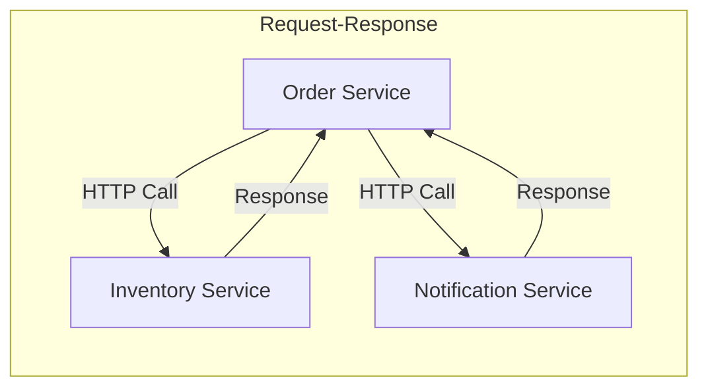
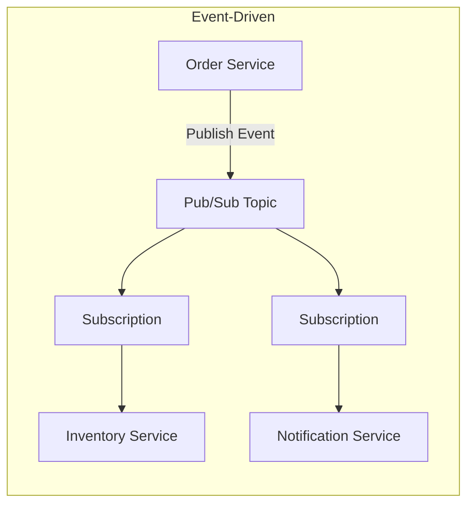
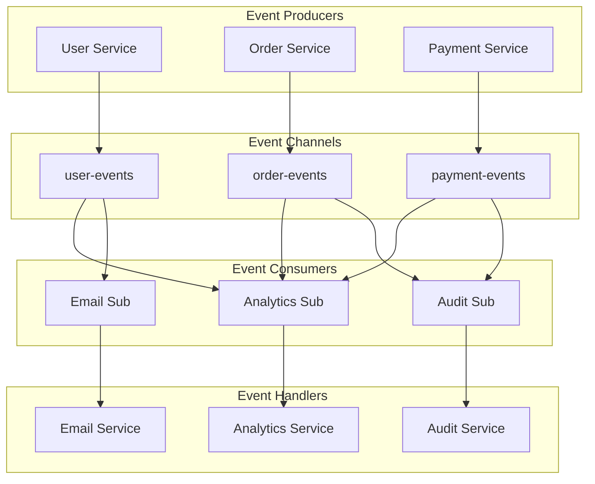
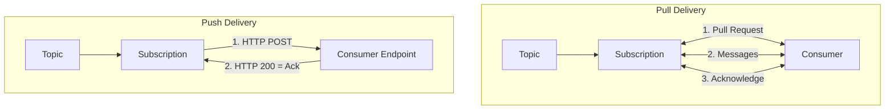
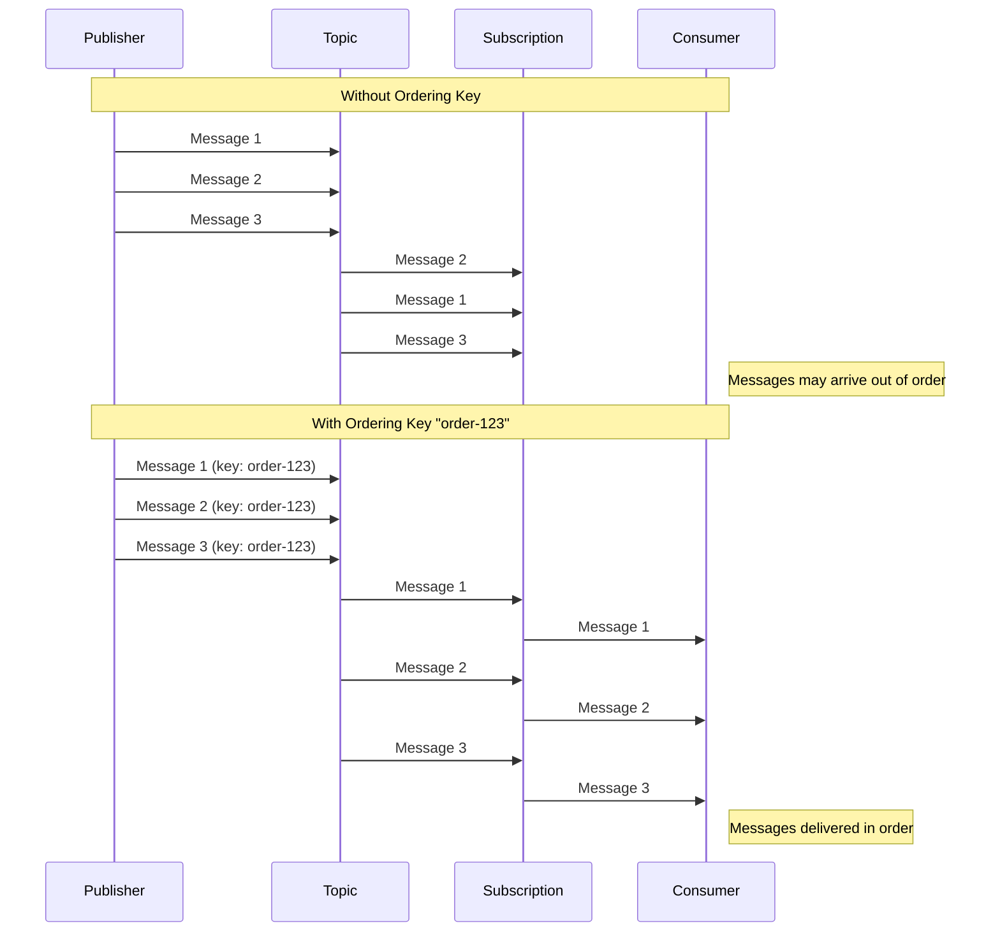
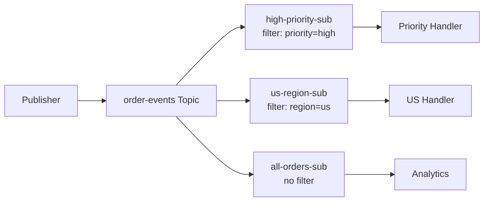
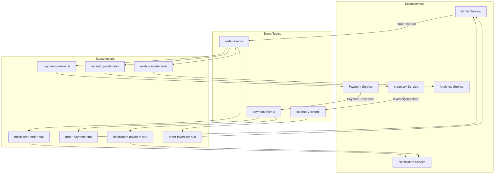
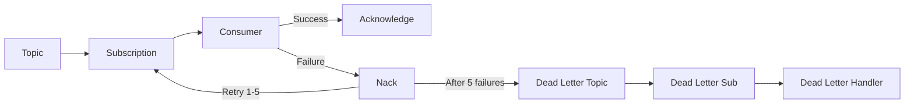

# How to Use Google Pub/Sub for Event-Driven Architecture

Author: [nawazdhandala](https://www.github.com/nawazdhandala)

Tags: Google Pub/Sub, Event-Driven Architecture, GCP, Message Queue, Microservices

Description: Learn how to use Google Pub/Sub for event-driven architecture with topics, subscriptions, push/pull delivery, and ordering guarantees.

---

Event-driven architecture decouples services by having them communicate through events rather than direct calls. Google Cloud Pub/Sub provides a fully managed messaging service that makes building event-driven systems straightforward. This guide walks through practical patterns for using Pub/Sub to build scalable, loosely coupled microservices.

## What is Event-Driven Architecture?

In event-driven architecture, services emit events when something happens and other services react to those events. This differs from request-response patterns where Service A directly calls Service B and waits for a response.





With event-driven architecture, the Order Service publishes an "OrderCreated" event and moves on. It does not need to know which services care about this event or wait for them to process it.

## Core Pub/Sub Concepts for Event-Driven Systems

Before diving into patterns, let's understand how Pub/Sub components map to event-driven concepts.



- **Topics** are event channels. Create one topic per event type or domain.
- **Subscriptions** represent interest in events. Each subscription gets its own copy of every message.
- **Messages** are the events themselves, containing data and metadata.

## Setting Up Your First Event-Driven Flow

Let's build a simple e-commerce event flow where order creation triggers multiple downstream processes.

### Step 1: Create the Topic

```bash
# Create a topic for order events
gcloud pubsub topics create order-events

# Verify the topic was created
gcloud pubsub topics describe order-events
```

### Step 2: Create Subscriptions for Each Consumer

```bash
# Subscription for inventory service (pull-based)
gcloud pubsub subscriptions create inventory-order-sub \
    --topic=order-events \
    --ack-deadline=60

# Subscription for notification service (push-based)
gcloud pubsub subscriptions create notification-order-sub \
    --topic=order-events \
    --push-endpoint=https://notification-service.example.com/events \
    --ack-deadline=30

# Subscription for analytics service (pull-based)
gcloud pubsub subscriptions create analytics-order-sub \
    --topic=order-events \
    --ack-deadline=120
```

### Step 3: Publish Events from the Order Service

```python
# order_service.py - Publishing order events
from google.cloud import pubsub_v1
import json
from datetime import datetime

# Initialize the publisher client
# The client handles connection pooling and batching automatically
publisher = pubsub_v1.PublisherClient()
project_id = "my-project"
topic_path = publisher.topic_path(project_id, "order-events")


def create_order(order_data):
    """
    Create an order and publish an event.
    The event contains all information downstream services need.
    """
    # Save order to database (your existing logic)
    order_id = save_order_to_database(order_data)

    # Build the event payload
    # Include enough context so consumers don't need to call back
    event = {
        "event_type": "OrderCreated",
        "event_id": generate_uuid(),
        "timestamp": datetime.utcnow().isoformat(),
        "data": {
            "order_id": order_id,
            "customer_id": order_data["customer_id"],
            "items": order_data["items"],
            "total_amount": order_data["total"],
            "shipping_address": order_data["shipping_address"],
            "payment_method": order_data["payment_method"]
        }
    }

    # Publish the event
    # The message data must be bytes
    message_bytes = json.dumps(event).encode("utf-8")

    # Add attributes for filtering and routing
    # Subscribers can filter on these without parsing the message body
    future = publisher.publish(
        topic_path,
        message_bytes,
        event_type="OrderCreated",
        customer_tier=order_data.get("customer_tier", "standard"),
        region=order_data.get("region", "us")
    )

    # Wait for publish to complete
    message_id = future.result()
    print(f"Published event {event['event_id']} with message_id {message_id}")

    return order_id
```

### Step 4: Consume Events in Downstream Services

```python
# inventory_service.py - Consuming order events with pull delivery
from google.cloud import pubsub_v1
import json

# Initialize subscriber client
subscriber = pubsub_v1.SubscriberClient()
project_id = "my-project"
subscription_path = subscriber.subscription_path(
    project_id, "inventory-order-sub"
)


def process_order_event(message):
    """
    Handle incoming order events.
    This function is called for each message received.
    """
    try:
        # Parse the event payload
        event = json.loads(message.data.decode("utf-8"))

        # Check the event type
        # A subscription might receive different event types
        if event["event_type"] == "OrderCreated":
            handle_order_created(event["data"])
        elif event["event_type"] == "OrderCancelled":
            handle_order_cancelled(event["data"])
        else:
            # Log unknown event types but acknowledge them
            # This prevents redelivery of events we don't handle
            print(f"Unknown event type: {event['event_type']}")

        # Acknowledge the message after successful processing
        # This tells Pub/Sub we're done with this message
        message.ack()

    except json.JSONDecodeError as e:
        # Invalid JSON - acknowledge to prevent infinite redelivery
        print(f"Invalid message format: {e}")
        message.ack()

    except Exception as e:
        # Processing failed - don't acknowledge
        # Pub/Sub will redeliver after ack deadline expires
        print(f"Failed to process message: {e}")
        message.nack()


def handle_order_created(order_data):
    """
    Reserve inventory for the new order.
    """
    order_id = order_data["order_id"]
    items = order_data["items"]

    for item in items:
        # Reserve stock for each item
        reserve_inventory(
            product_id=item["product_id"],
            quantity=item["quantity"],
            order_id=order_id
        )

    print(f"Reserved inventory for order {order_id}")


def start_subscriber():
    """
    Start listening for messages.
    Uses streaming pull for efficient message delivery.
    """
    # Configure flow control to prevent overwhelming the service
    flow_control = pubsub_v1.types.FlowControl(
        max_messages=100,  # Process up to 100 messages concurrently
        max_bytes=10 * 1024 * 1024  # 10 MB buffer
    )

    # Start the streaming pull
    streaming_pull_future = subscriber.subscribe(
        subscription_path,
        callback=process_order_event,
        flow_control=flow_control
    )

    print(f"Listening for messages on {subscription_path}")

    # Keep the main thread alive
    try:
        streaming_pull_future.result()
    except KeyboardInterrupt:
        streaming_pull_future.cancel()
        streaming_pull_future.result()


if __name__ == "__main__":
    start_subscriber()
```

## Push vs Pull Delivery

Pub/Sub supports two delivery mechanisms. Choose based on your service characteristics.



### When to Use Pull Delivery

Pull delivery works best when:

- Your service runs continuously and can maintain connections
- You need fine-grained control over message processing rate
- You're processing messages in batches
- Your service runs in a private network without public endpoints

```python
# pull_consumer.py - Batch processing with pull delivery
from google.cloud import pubsub_v1
import json

subscriber = pubsub_v1.SubscriberClient()
subscription_path = subscriber.subscription_path("my-project", "batch-processor-sub")


def process_batch():
    """
    Pull and process messages in batches.
    Useful for bulk operations like database inserts.
    """
    # Pull up to 100 messages
    response = subscriber.pull(
        request={
            "subscription": subscription_path,
            "max_messages": 100
        }
    )

    if not response.received_messages:
        print("No messages available")
        return

    # Collect messages for batch processing
    messages_to_process = []
    ack_ids = []

    for received_message in response.received_messages:
        message = received_message.message
        ack_ids.append(received_message.ack_id)

        try:
            event = json.loads(message.data.decode("utf-8"))
            messages_to_process.append(event)
        except json.JSONDecodeError:
            # Skip invalid messages but still acknowledge them
            pass

    # Process all messages in a single batch operation
    if messages_to_process:
        batch_insert_to_database(messages_to_process)

    # Acknowledge all messages at once
    subscriber.acknowledge(
        request={
            "subscription": subscription_path,
            "ack_ids": ack_ids
        }
    )

    print(f"Processed batch of {len(messages_to_process)} messages")
```

### When to Use Push Delivery

Push delivery works best when:

- Your service is serverless (Cloud Functions, Cloud Run)
- You want Pub/Sub to handle retries and backoff
- Your service has a public HTTPS endpoint
- You prefer HTTP-based integration

```python
# push_handler.py - Flask handler for push delivery
from flask import Flask, request, jsonify
import json
import base64

app = Flask(__name__)


@app.route("/events", methods=["POST"])
def handle_pubsub_push():
    """
    Handle incoming Pub/Sub push messages.
    Pub/Sub sends messages as HTTP POST requests.
    """
    # Parse the Pub/Sub message envelope
    envelope = request.get_json()

    if not envelope:
        return "Bad Request: no message", 400

    # Extract the actual message
    pubsub_message = envelope.get("message", {})

    # Message data is base64 encoded
    if "data" in pubsub_message:
        message_data = base64.b64decode(pubsub_message["data"]).decode("utf-8")
        event = json.loads(message_data)

        # Get message attributes
        attributes = pubsub_message.get("attributes", {})
        event_type = attributes.get("event_type")

        # Process the event
        try:
            process_event(event, event_type)
            # Return 200 to acknowledge the message
            return "OK", 200
        except Exception as e:
            # Return non-2xx to trigger redelivery
            print(f"Processing failed: {e}")
            return f"Error: {e}", 500

    return "Bad Request: no data", 400


def process_event(event, event_type):
    """
    Route events to appropriate handlers.
    """
    if event_type == "OrderCreated":
        send_order_confirmation_email(event["data"])
    elif event_type == "OrderShipped":
        send_shipping_notification(event["data"])


if __name__ == "__main__":
    app.run(host="0.0.0.0", port=8080)
```

## Message Ordering Guarantees

By default, Pub/Sub does not guarantee message order. For scenarios where order matters, use ordering keys.



### Implementing Ordered Delivery

```bash
# Create a subscription with message ordering enabled
gcloud pubsub subscriptions create ordered-order-sub \
    --topic=order-events \
    --enable-message-ordering
```

```python
# ordered_publisher.py - Publishing with ordering keys
from google.cloud import pubsub_v1
from google.cloud.pubsub_v1 import types
import json

# Enable message ordering in the publisher
publisher_options = types.PublisherOptions(
    enable_message_ordering=True
)
publisher = pubsub_v1.PublisherClient(publisher_options=publisher_options)
topic_path = publisher.topic_path("my-project", "order-events")


def publish_order_lifecycle_events(order_id, events):
    """
    Publish a sequence of events for an order.
    Using the order_id as the ordering key ensures events
    for the same order are delivered in sequence.
    """
    for event in events:
        message_bytes = json.dumps(event).encode("utf-8")

        # The ordering_key groups related messages
        # Messages with the same key are delivered in order
        future = publisher.publish(
            topic_path,
            message_bytes,
            ordering_key=order_id,  # All events for this order use same key
            event_type=event["event_type"]
        )

        # Important: wait for each publish to complete
        # This ensures order is maintained
        message_id = future.result()
        print(f"Published {event['event_type']} for order {order_id}")


# Example: publish order lifecycle in sequence
order_id = "order-12345"
events = [
    {"event_type": "OrderCreated", "order_id": order_id, "timestamp": "2024-01-15T10:00:00Z"},
    {"event_type": "PaymentReceived", "order_id": order_id, "timestamp": "2024-01-15T10:01:00Z"},
    {"event_type": "OrderShipped", "order_id": order_id, "timestamp": "2024-01-15T14:00:00Z"},
    {"event_type": "OrderDelivered", "order_id": order_id, "timestamp": "2024-01-16T09:00:00Z"}
]

publish_order_lifecycle_events(order_id, events)
```

### Handling Ordering Failures

When using ordering keys, a failed publish blocks subsequent messages with the same key.

```python
# ordered_publisher_with_retry.py - Handling ordering failures
from google.cloud import pubsub_v1
from google.cloud.pubsub_v1 import types
from google.api_core.exceptions import GoogleAPICallError
import json
import time

publisher_options = types.PublisherOptions(enable_message_ordering=True)
publisher = pubsub_v1.PublisherClient(publisher_options=publisher_options)
topic_path = publisher.topic_path("my-project", "order-events")


def publish_with_ordering_retry(order_id, event, max_retries=3):
    """
    Publish with ordering key and handle failures properly.
    """
    message_bytes = json.dumps(event).encode("utf-8")

    for attempt in range(max_retries):
        try:
            future = publisher.publish(
                topic_path,
                message_bytes,
                ordering_key=order_id
            )
            return future.result()

        except GoogleAPICallError as e:
            print(f"Publish failed (attempt {attempt + 1}): {e}")

            # Resume publishing for this ordering key
            # Without this, all future messages with this key would fail
            publisher.resume_publish(topic_path, order_id)

            if attempt < max_retries - 1:
                time.sleep(2 ** attempt)  # Exponential backoff
            else:
                raise

    return None
```

## Event Filtering

Reduce processing overhead by filtering messages at the subscription level. Subscribers only receive messages matching their filter.



```bash
# Create filtered subscriptions
# Only receive high-priority orders
gcloud pubsub subscriptions create high-priority-orders-sub \
    --topic=order-events \
    --filter='attributes.priority="high"'

# Only receive orders from US region
gcloud pubsub subscriptions create us-orders-sub \
    --topic=order-events \
    --filter='attributes.region="us"'

# Receive orders over $1000
gcloud pubsub subscriptions create large-orders-sub \
    --topic=order-events \
    --filter='attributes.order_value_tier="large"'

# Complex filter with AND
gcloud pubsub subscriptions create priority-us-sub \
    --topic=order-events \
    --filter='attributes.priority="high" AND attributes.region="us"'
```

```python
# publisher_with_filter_attributes.py
from google.cloud import pubsub_v1
import json

publisher = pubsub_v1.PublisherClient()
topic_path = publisher.topic_path("my-project", "order-events")


def publish_order_event(order):
    """
    Publish order event with attributes for filtering.
    Subscribers can filter on these attributes without parsing the message.
    """
    event = {
        "event_type": "OrderCreated",
        "data": order
    }

    # Determine order value tier for filtering
    if order["total"] >= 1000:
        value_tier = "large"
    elif order["total"] >= 100:
        value_tier = "medium"
    else:
        value_tier = "small"

    # Publish with filter-friendly attributes
    future = publisher.publish(
        topic_path,
        json.dumps(event).encode("utf-8"),
        # These attributes can be used in subscription filters
        event_type="OrderCreated",
        priority=order.get("priority", "standard"),
        region=order.get("region", "unknown"),
        order_value_tier=value_tier,
        customer_type=order.get("customer_type", "regular")
    )

    return future.result()
```

## Building a Complete Event-Driven System

Let's put it all together with a complete e-commerce event-driven architecture.



### Event Definitions

```python
# events.py - Define event schemas
from dataclasses import dataclass, asdict
from datetime import datetime
from typing import List, Optional
import uuid
import json


@dataclass
class Event:
    """Base class for all events."""
    event_id: str
    event_type: str
    timestamp: str
    version: str = "1.0"

    def to_json(self) -> bytes:
        return json.dumps(asdict(self)).encode("utf-8")

    @classmethod
    def create(cls, **kwargs):
        return cls(
            event_id=str(uuid.uuid4()),
            timestamp=datetime.utcnow().isoformat(),
            **kwargs
        )


@dataclass
class OrderCreatedEvent(Event):
    """Published when a new order is placed."""
    event_type: str = "OrderCreated"
    order_id: str = ""
    customer_id: str = ""
    items: List[dict] = None
    total_amount: float = 0.0
    shipping_address: dict = None


@dataclass
class PaymentProcessedEvent(Event):
    """Published when payment is completed."""
    event_type: str = "PaymentProcessed"
    order_id: str = ""
    payment_id: str = ""
    amount: float = 0.0
    status: str = ""  # "success" or "failed"


@dataclass
class InventoryReservedEvent(Event):
    """Published when inventory is reserved for an order."""
    event_type: str = "InventoryReserved"
    order_id: str = ""
    items: List[dict] = None
    reservation_id: str = ""
```

### Event Publisher Utility

```python
# event_publisher.py - Centralized event publishing
from google.cloud import pubsub_v1
from functools import lru_cache
import logging

logger = logging.getLogger(__name__)


class EventPublisher:
    """
    Centralized event publisher with topic routing.
    Maps event types to their appropriate topics.
    """

    # Map event types to topics
    TOPIC_ROUTING = {
        "OrderCreated": "order-events",
        "OrderCancelled": "order-events",
        "OrderUpdated": "order-events",
        "PaymentProcessed": "payment-events",
        "PaymentRefunded": "payment-events",
        "InventoryReserved": "inventory-events",
        "InventoryReleased": "inventory-events",
    }

    def __init__(self, project_id: str):
        self.project_id = project_id
        self.publisher = pubsub_v1.PublisherClient()

    @lru_cache(maxsize=20)
    def _get_topic_path(self, topic_name: str) -> str:
        """Cache topic paths to avoid repeated string operations."""
        return self.publisher.topic_path(self.project_id, topic_name)

    def publish(self, event, **attributes) -> str:
        """
        Publish an event to its designated topic.

        Args:
            event: An Event dataclass instance
            **attributes: Additional message attributes for filtering

        Returns:
            The published message ID
        """
        # Determine the target topic
        topic_name = self.TOPIC_ROUTING.get(event.event_type)
        if not topic_name:
            raise ValueError(f"Unknown event type: {event.event_type}")

        topic_path = self._get_topic_path(topic_name)

        # Add event_type as an attribute for filtering
        attributes["event_type"] = event.event_type

        # Publish the event
        future = self.publisher.publish(
            topic_path,
            event.to_json(),
            **attributes
        )

        message_id = future.result()
        logger.info(
            f"Published {event.event_type} (id={event.event_id}) "
            f"to {topic_name} (message_id={message_id})"
        )

        return message_id


# Usage example
publisher = EventPublisher("my-project")

order_event = OrderCreatedEvent.create(
    order_id="order-123",
    customer_id="cust-456",
    items=[{"product_id": "prod-1", "quantity": 2}],
    total_amount=99.99
)

publisher.publish(
    order_event,
    priority="high",
    region="us"
)
```

### Event Consumer Framework

```python
# event_consumer.py - Framework for consuming events
from google.cloud import pubsub_v1
from abc import ABC, abstractmethod
from typing import Dict, Callable
import json
import logging

logger = logging.getLogger(__name__)


class EventHandler(ABC):
    """Base class for event handlers."""

    @abstractmethod
    def handle(self, event_data: dict) -> None:
        """Process the event. Raise exception to trigger redelivery."""
        pass


class EventConsumer:
    """
    Generic event consumer that routes events to handlers.
    Supports multiple event types per subscription.
    """

    def __init__(self, project_id: str, subscription_name: str):
        self.project_id = project_id
        self.subscription_name = subscription_name
        self.subscriber = pubsub_v1.SubscriberClient()
        self.subscription_path = self.subscriber.subscription_path(
            project_id, subscription_name
        )
        self.handlers: Dict[str, EventHandler] = {}

    def register_handler(self, event_type: str, handler: EventHandler) -> None:
        """Register a handler for a specific event type."""
        self.handlers[event_type] = handler
        logger.info(f"Registered handler for {event_type}")

    def _process_message(self, message) -> None:
        """
        Process a single message.
        Routes to appropriate handler based on event type.
        """
        try:
            # Parse the event
            event = json.loads(message.data.decode("utf-8"))
            event_type = event.get("event_type")
            event_id = event.get("event_id", "unknown")

            logger.info(f"Received {event_type} (id={event_id})")

            # Find and execute the handler
            handler = self.handlers.get(event_type)
            if handler:
                handler.handle(event)
                message.ack()
                logger.info(f"Successfully processed {event_type} (id={event_id})")
            else:
                # No handler registered - acknowledge to prevent redelivery
                logger.warning(f"No handler for event type: {event_type}")
                message.ack()

        except json.JSONDecodeError as e:
            logger.error(f"Invalid message format: {e}")
            message.ack()  # Don't retry malformed messages

        except Exception as e:
            logger.error(f"Failed to process message: {e}")
            message.nack()  # Trigger redelivery

    def start(self, max_messages: int = 100) -> None:
        """Start consuming messages."""
        flow_control = pubsub_v1.types.FlowControl(
            max_messages=max_messages
        )

        streaming_pull_future = self.subscriber.subscribe(
            self.subscription_path,
            callback=self._process_message,
            flow_control=flow_control
        )

        logger.info(f"Started consuming from {self.subscription_name}")

        try:
            streaming_pull_future.result()
        except KeyboardInterrupt:
            streaming_pull_future.cancel()
            streaming_pull_future.result()


# Example: Inventory service consumer
class OrderCreatedHandler(EventHandler):
    """Handle OrderCreated events in the inventory service."""

    def handle(self, event_data: dict) -> None:
        order_id = event_data["data"]["order_id"]
        items = event_data["data"]["items"]

        for item in items:
            self.reserve_inventory(
                item["product_id"],
                item["quantity"],
                order_id
            )

    def reserve_inventory(self, product_id, quantity, order_id):
        # Your inventory reservation logic
        print(f"Reserving {quantity} of {product_id} for {order_id}")


# Start the consumer
consumer = EventConsumer("my-project", "inventory-order-sub")
consumer.register_handler("OrderCreated", OrderCreatedHandler())
consumer.start()
```

## Error Handling and Dead Letter Queues

Configure dead letter queues to capture messages that repeatedly fail processing.



```bash
# Create dead letter infrastructure
gcloud pubsub topics create order-events-dead-letter
gcloud pubsub subscriptions create order-events-dead-letter-sub \
    --topic=order-events-dead-letter

# Update main subscription to use dead letter queue
gcloud pubsub subscriptions update inventory-order-sub \
    --dead-letter-topic=order-events-dead-letter \
    --max-delivery-attempts=5

# Grant necessary permissions
PROJECT_NUMBER=$(gcloud projects describe my-project --format='value(projectNumber)')

gcloud pubsub topics add-iam-policy-binding order-events-dead-letter \
    --member="serviceAccount:service-${PROJECT_NUMBER}@gcp-sa-pubsub.iam.gserviceaccount.com" \
    --role="roles/pubsub.publisher"

gcloud pubsub subscriptions add-iam-policy-binding inventory-order-sub \
    --member="serviceAccount:service-${PROJECT_NUMBER}@gcp-sa-pubsub.iam.gserviceaccount.com" \
    --role="roles/pubsub.subscriber"
```

```python
# dead_letter_handler.py - Process failed messages
from google.cloud import pubsub_v1
import json
import logging

logger = logging.getLogger(__name__)

subscriber = pubsub_v1.SubscriberClient()
subscription_path = subscriber.subscription_path(
    "my-project", "order-events-dead-letter-sub"
)


def handle_dead_letter(message):
    """
    Process messages that failed multiple times.
    Options: alert, store for manual review, attempt different processing.
    """
    try:
        event = json.loads(message.data.decode("utf-8"))

        # Get delivery attempt information from attributes
        delivery_attempt = message.attributes.get(
            "googclient_deliveryattempt", "unknown"
        )

        logger.error(
            f"Dead letter received: {event.get('event_type')} "
            f"(id={event.get('event_id')}, attempts={delivery_attempt})"
        )

        # Store in database for manual review
        store_failed_event(event, delivery_attempt, message.attributes)

        # Send alert to operations team
        send_alert(
            f"Event processing failed after {delivery_attempt} attempts",
            event
        )

        # Acknowledge to prevent further redelivery
        message.ack()

    except Exception as e:
        logger.error(f"Dead letter handler failed: {e}")
        # Still acknowledge - we don't want infinite loops
        message.ack()


def start_dead_letter_consumer():
    streaming_pull_future = subscriber.subscribe(
        subscription_path,
        callback=handle_dead_letter
    )

    logger.info("Started dead letter consumer")
    streaming_pull_future.result()
```

## Testing Event-Driven Systems

Testing event-driven systems requires verifying both publishing and consuming behavior.

```python
# test_events.py - Testing event publishing and handling
import pytest
from unittest.mock import Mock, patch, MagicMock
import json


class TestEventPublisher:
    """Tests for event publishing."""

    @patch('google.cloud.pubsub_v1.PublisherClient')
    def test_publishes_order_created_event(self, mock_client_class):
        """Verify OrderCreated events are published to correct topic."""
        # Setup mock
        mock_client = MagicMock()
        mock_client_class.return_value = mock_client
        mock_future = MagicMock()
        mock_future.result.return_value = "message-123"
        mock_client.publish.return_value = mock_future
        mock_client.topic_path.return_value = "projects/test/topics/order-events"

        # Create publisher and publish event
        publisher = EventPublisher("test-project")
        event = OrderCreatedEvent.create(
            order_id="order-123",
            customer_id="cust-456",
            items=[],
            total_amount=99.99
        )

        message_id = publisher.publish(event, priority="high")

        # Verify
        assert message_id == "message-123"
        mock_client.publish.assert_called_once()

        # Check the published data
        call_args = mock_client.publish.call_args
        published_data = json.loads(call_args[0][1].decode("utf-8"))
        assert published_data["event_type"] == "OrderCreated"
        assert published_data["order_id"] == "order-123"


class TestEventHandler:
    """Tests for event handlers."""

    def test_order_created_handler_reserves_inventory(self):
        """Verify OrderCreated handler reserves inventory correctly."""
        handler = OrderCreatedHandler()

        # Mock the inventory reservation
        handler.reserve_inventory = Mock()

        event_data = {
            "event_type": "OrderCreated",
            "event_id": "evt-123",
            "data": {
                "order_id": "order-123",
                "items": [
                    {"product_id": "prod-1", "quantity": 2},
                    {"product_id": "prod-2", "quantity": 1}
                ]
            }
        }

        handler.handle(event_data)

        # Verify reserve_inventory was called for each item
        assert handler.reserve_inventory.call_count == 2
        handler.reserve_inventory.assert_any_call("prod-1", 2, "order-123")
        handler.reserve_inventory.assert_any_call("prod-2", 1, "order-123")


class TestEventConsumerIntegration:
    """Integration tests using Pub/Sub emulator."""

    @pytest.fixture
    def pubsub_emulator(self):
        """
        Setup Pub/Sub emulator for integration tests.
        Requires: gcloud beta emulators pubsub start
        """
        import os
        os.environ["PUBSUB_EMULATOR_HOST"] = "localhost:8085"

        # Create test topic and subscription
        publisher = pubsub_v1.PublisherClient()
        subscriber = pubsub_v1.SubscriberClient()

        topic_path = publisher.topic_path("test-project", "test-topic")
        sub_path = subscriber.subscription_path("test-project", "test-sub")

        try:
            publisher.create_topic(request={"name": topic_path})
        except Exception:
            pass  # Topic might already exist

        try:
            subscriber.create_subscription(
                request={"name": sub_path, "topic": topic_path}
            )
        except Exception:
            pass

        yield {"topic": topic_path, "subscription": sub_path}

        # Cleanup
        del os.environ["PUBSUB_EMULATOR_HOST"]

    def test_end_to_end_event_flow(self, pubsub_emulator):
        """Test complete publish-consume cycle."""
        received_events = []

        def callback(message):
            event = json.loads(message.data.decode("utf-8"))
            received_events.append(event)
            message.ack()

        # Start consumer in background
        subscriber = pubsub_v1.SubscriberClient()
        future = subscriber.subscribe(
            pubsub_emulator["subscription"],
            callback=callback
        )

        # Publish test event
        publisher = pubsub_v1.PublisherClient()
        test_event = {"event_type": "Test", "data": "hello"}
        publisher.publish(
            pubsub_emulator["topic"],
            json.dumps(test_event).encode("utf-8")
        ).result()

        # Wait for message to be received
        import time
        time.sleep(2)
        future.cancel()

        # Verify
        assert len(received_events) == 1
        assert received_events[0]["event_type"] == "Test"
```

## Summary

Google Pub/Sub provides a robust foundation for event-driven architectures. Key takeaways:

1. **Decouple services** by publishing events instead of making direct calls. This allows independent scaling and deployment.

2. **Choose delivery mode wisely**: Use pull for always-on services that need control over processing rate. Use push for serverless functions and HTTP-based services.

3. **Use ordering keys** when event sequence matters for a specific entity (like all events for one order).

4. **Filter at the subscription level** to reduce unnecessary message processing. Put filterable data in message attributes.

5. **Configure dead letter queues** to capture and handle messages that repeatedly fail processing.

6. **Design events carefully**: Include enough context so consumers don't need to call back to the publisher. Version your events for backward compatibility.

Start with simple topics and subscriptions, then add ordering, filtering, and dead letter handling as your requirements evolve.
