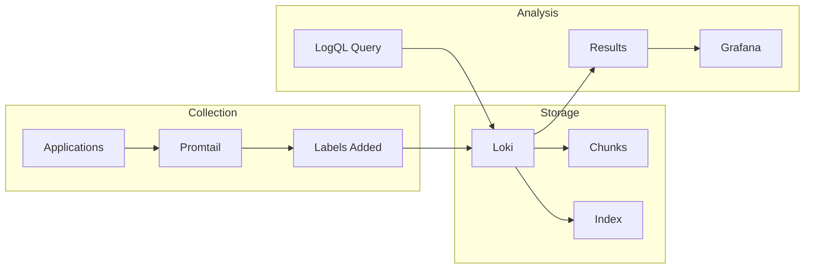
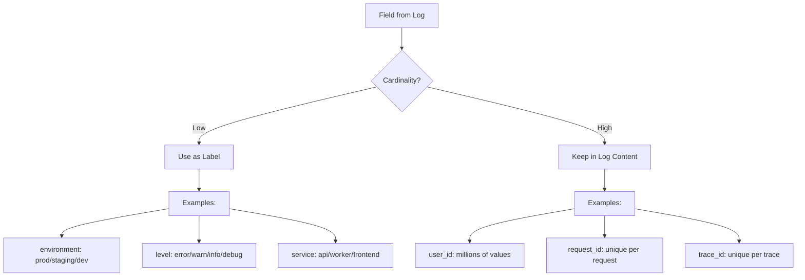
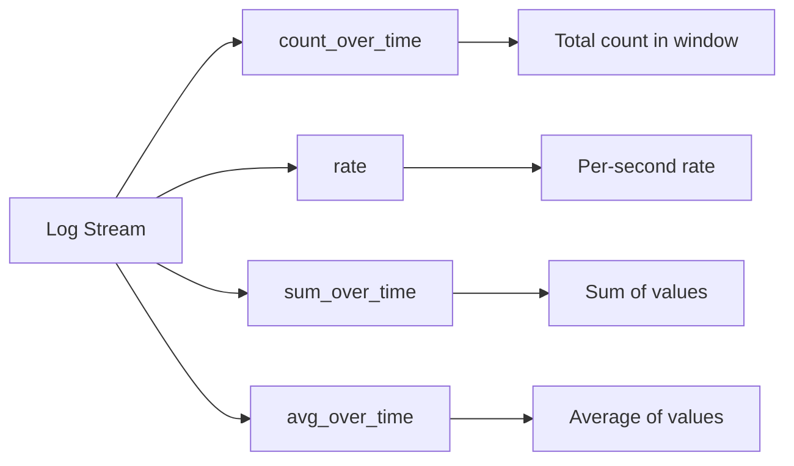
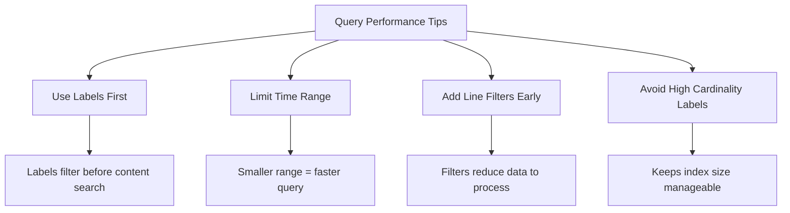

# How to Use Grafana Loki for Log Analysis

Author: [nawazdhandala](https://www.github.com/nawazdhandala)

Tags: Grafana, Loki, Logging, Observability, Monitoring

Description: Learn how to use Grafana Loki for cost-effective log aggregation and analysis with LogQL queries, labels, and Promtail configuration.

---

Log analysis is critical for understanding system behavior, debugging issues, and maintaining application health. Grafana Loki provides a cost-effective solution for log aggregation that indexes only labels rather than full log content. This guide walks you through practical log analysis techniques using Loki and LogQL.

## Understanding the Log Analysis Workflow

Before diving into queries, let's understand how log analysis flows through Loki:



The key insight is that Loki stores log content in compressed chunks but only indexes labels. Your analysis strategy should leverage labels for filtering and then apply content searches on the filtered set.

## Setting Up Promtail for Effective Analysis

Good log analysis starts with proper label configuration. Here's a Promtail configuration optimized for analysis:

```yaml
# promtail-config.yaml
server:
  http_listen_port: 9080
  grpc_listen_port: 0

# Define where Promtail stores its position files
# This tracks which logs have been sent to Loki
positions:
  filename: /tmp/positions.yaml

# Configure the Loki endpoint
clients:
  - url: http://loki:3100/loki/api/v1/push

scrape_configs:
  - job_name: application-logs
    static_configs:
      - targets:
          - localhost
        labels:
          # Static labels for this log source
          job: myapp
          environment: production
          __path__: /var/log/myapp/*.log

    pipeline_stages:
      # Parse JSON logs to extract fields
      - json:
          expressions:
            # Extract these fields from JSON
            level: level
            service: service
            trace_id: traceId
            user_id: userId

      # Promote certain fields to labels for fast filtering
      # Only use low-cardinality values as labels
      - labels:
          level:
          service:

      # Store high-cardinality values in log line, not labels
      # This keeps index size manageable
      - output:
          source: message
```

## Label Strategy for Log Analysis

Labels determine how quickly you can filter logs. Choose them carefully:



## Basic LogQL Queries for Analysis

LogQL combines stream selectors with pipeline operations. Start with the basics:

```logql
# Select all logs from a specific service
# The curly braces contain the stream selector
{service="api-gateway"}

# Filter logs by multiple labels
# Use comma to AND conditions together
{service="api-gateway", environment="production"}

# Match labels with regex
# The =~ operator enables regex matching
{service=~"api.*", level="error"}

# Exclude certain values
# The != operator excludes matching values
{service="api-gateway", level!="debug"}
```

## Content Filtering with Line Filters

After selecting streams, filter by content:

```logql
# Find logs containing "timeout"
# The |= operator does case-sensitive contains
{service="api-gateway"} |= "timeout"

# Exclude health check logs from results
# The != line filter removes matching lines
{service="api-gateway"} != "/health"

# Use regex for complex patterns
# The |~ operator enables regex matching
{service="api-gateway"} |~ "error|exception|failed"

# Case-insensitive search
# Use (?i) flag at the start of regex
{service="api-gateway"} |~ "(?i)timeout"

# Combine multiple filters
# Filters are applied in order, left to right
{service="api-gateway"} |= "error" != "expected error" != "/health"
```

## Parsing Structured Logs

Most applications emit JSON logs. Parse them for field-level analysis:

```logql
# Parse JSON and filter by field value
# The json parser extracts all fields
{service="api-gateway"} | json | status_code >= 500

# Parse and extract specific fields only
# This is more efficient for large logs
{service="api-gateway"} | json status_code, latency_ms, endpoint

# Filter by parsed field with regex
{service="api-gateway"} | json | endpoint =~ "/api/v2/.*"

# Work with nested JSON
# Use dot notation for nested fields
{service="api-gateway"} | json | request_headers_content_type = "application/json"
```

## Formatting Output for Readability

Transform log output for better analysis:

```logql
# Create a clean output format
# Use line_format to restructure the log line
{service="api-gateway"}
  | json
  | line_format "{{.level}} [{{.service}}] {{.message}}"

# Include timestamp in custom format
{service="api-gateway"}
  | json
  | line_format "{{.timestamp}} {{.level}}: {{.message}}"

# Format with conditional logic
# Use Go template syntax for conditions
{service="api-gateway"}
  | json
  | line_format "{{if eq .level \"error\"}}[ALERT] {{end}}{{.message}}"
```

## Aggregation Queries for Metrics

Convert logs into metrics for trend analysis:



```logql
# Count errors in the last hour
# count_over_time counts matching log lines
count_over_time({service="api-gateway", level="error"}[1h])

# Calculate error rate per second
# rate gives you per-second values
rate({service="api-gateway", level="error"}[5m])

# Sum errors by service
# Use sum with by clause for grouping
sum by (service) (
  count_over_time({environment="production", level="error"}[1h])
)

# Calculate error percentage
# Divide error count by total count
sum(rate({service="api-gateway", level="error"}[5m]))
/
sum(rate({service="api-gateway"}[5m]))
* 100

# Get top 5 services by error count
topk(5,
  sum by (service) (
    count_over_time({environment="production", level="error"}[1h])
  )
)
```

## Extracting Numeric Values

Work with numbers embedded in logs:

```logql
# Extract latency and calculate average
# unwrap converts a label to a numeric value
{service="api-gateway"}
  | json
  | unwrap latency_ms
  | avg_over_time([5m])

# Calculate 99th percentile latency
{service="api-gateway"}
  | json
  | unwrap latency_ms
  | quantile_over_time(0.99, [5m])

# Sum bytes transferred
{service="api-gateway"}
  | json
  | unwrap bytes_sent
  | sum_over_time([1h])

# Group percentiles by endpoint
avg by (endpoint) (
  {service="api-gateway"}
    | json
    | unwrap latency_ms
    | quantile_over_time(0.95, [5m])
)
```

## Pattern Analysis with Regex

Use regex for advanced pattern extraction:

```logql
# Extract request ID from unstructured logs
# Use regexp to capture groups
{service="api-gateway"}
  | regexp "request_id=(?P<request_id>[a-f0-9-]+)"
  | request_id != ""

# Parse custom log formats
# Extract multiple fields at once
{service="nginx"}
  | regexp "(?P<ip>\\d+\\.\\d+\\.\\d+\\.\\d+) - - \\[(?P<timestamp>[^\\]]+)\\] \"(?P<method>\\w+) (?P<path>[^ ]+)"

# Filter by extracted field
{service="nginx"}
  | regexp "status=(?P<status>\\d+)"
  | status >= 500
```

## Troubleshooting Workflows

Here are common analysis patterns for troubleshooting:

### Finding Error Spikes

```logql
# View error rate over time to identify spikes
sum(rate({environment="production", level="error"}[1m]))

# Break down by service to find the source
sum by (service) (rate({environment="production", level="error"}[1m]))

# Look at actual error messages during spike
{environment="production", level="error"}
  | json
  | line_format "{{.service}}: {{.message}}"
```

### Tracing a Request

```logql
# Find all logs for a specific trace ID
# Search across all services
{environment="production"} |= "trace_id=abc123"

# Or with JSON parsing
{environment="production"} | json | trace_id = "abc123"
```

### Analyzing Slow Requests

```logql
# Find requests slower than 1 second
{service="api-gateway"}
  | json
  | latency_ms > 1000
  | line_format "{{.endpoint}} took {{.latency_ms}}ms"

# Get distribution of slow requests by endpoint
sum by (endpoint) (
  count_over_time(
    {service="api-gateway"} | json | latency_ms > 1000 [1h]
  )
)
```

## Building Analysis Dashboards

Create Grafana panels for ongoing log analysis:

### Log Volume Panel

```logql
# Show log volume by level over time
sum by (level) (rate({environment="production"}[1m]))
```

Use visualization: Time series with stack mode

### Error Rate Panel

```logql
# Calculate error percentage
sum(rate({environment="production", level="error"}[5m]))
/
sum(rate({environment="production"}[5m]))
* 100
```

Use visualization: Stat panel with percentage unit

### Top Errors Table

```logql
# Group similar errors and count them
topk(10,
  sum by (message) (
    count_over_time({environment="production", level="error"} | json [1h])
  )
)
```

Use visualization: Table panel sorted by value

## Performance Tips

Keep these tips in mind for efficient log analysis:



```logql
# Slow: searches all logs then filters
{environment="production"} |= "user_id=12345"

# Fast: uses labels to narrow first
{environment="production", service="api-gateway"} |= "user_id=12345"

# Even faster: add time constraints in Grafana
# Set time range to smallest window needed
```

## Setting Up Log-Based Alerts

Create alerts based on log patterns:

```yaml
# alert-rules.yaml
groups:
  - name: log-based-alerts
    rules:
      # Alert when error rate exceeds threshold
      - alert: HighErrorRate
        expr: |
          sum(rate({environment="production", level="error"}[5m])) > 10
        for: 5m
        labels:
          severity: warning
        annotations:
          summary: "High error rate detected"
          description: "Error rate is {{ $value }} errors/sec"

      # Alert on specific error patterns
      - alert: DatabaseConnectionErrors
        expr: |
          count_over_time({service="api-gateway"} |= "database connection failed" [5m]) > 0
        for: 1m
        labels:
          severity: critical
        annotations:
          summary: "Database connection failures detected"
```

## Conclusion

Effective log analysis with Grafana Loki requires understanding its label-based architecture. Focus on:

1. Designing labels for fast filtering without creating high cardinality
2. Using LogQL's pipeline operators to progressively narrow results
3. Converting logs to metrics for trend analysis and alerting
4. Building dashboards that surface important patterns automatically

Start with simple queries and progressively add complexity as you understand your log patterns. The combination of label-based selection and content filtering gives you powerful tools for debugging and monitoring your applications.
