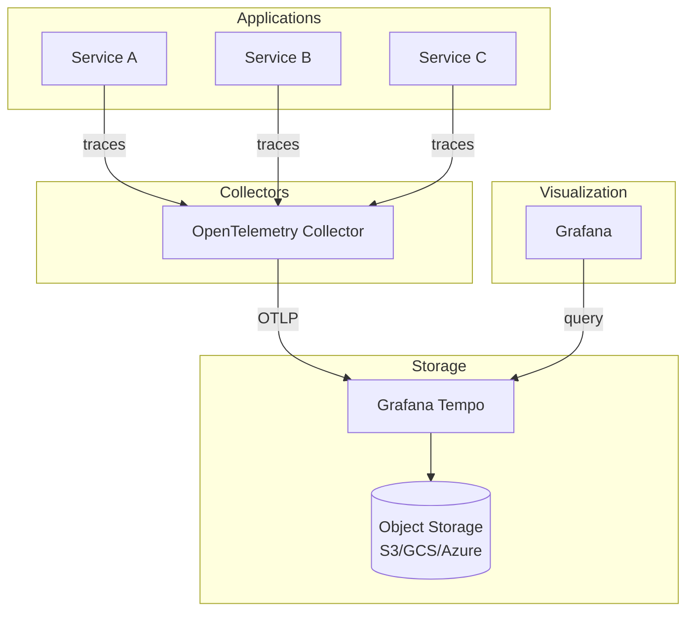
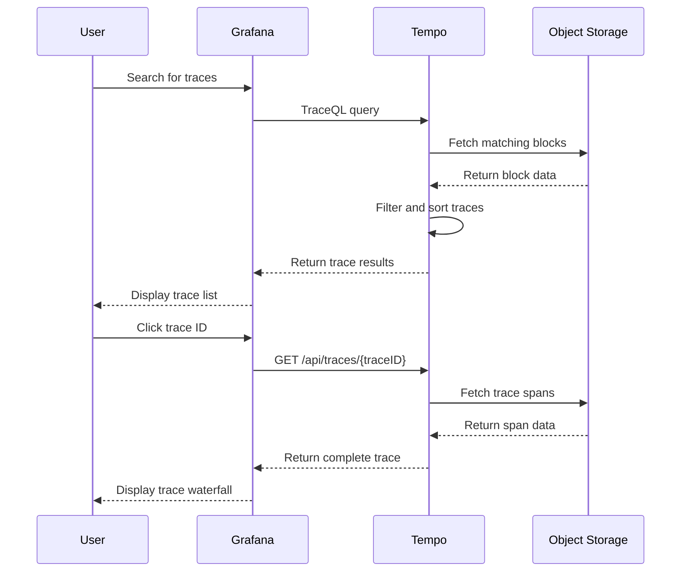
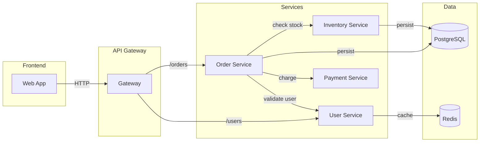
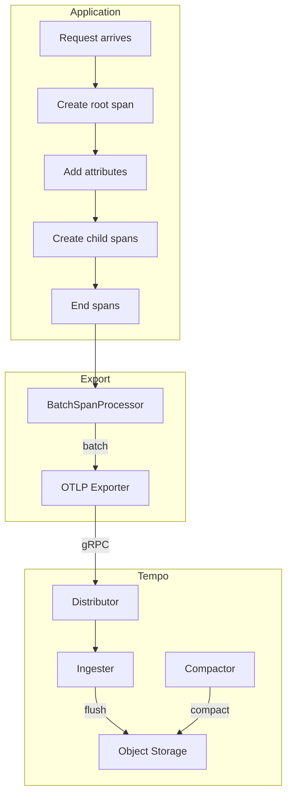

# How to Use Grafana Tempo for Tracing

Author: [nawazdhandala](https://www.github.com/nawazdhandala)

Tags: Grafana Tempo, Distributed Tracing, Observability, Monitoring, DevOps

Description: Learn how to use Grafana Tempo for distributed tracing with OpenTelemetry integration, trace queries, and service graphs.

---

Distributed tracing helps you understand how requests flow through your microservices architecture. Grafana Tempo is an open-source, high-scale distributed tracing backend that stores and queries traces efficiently. In this guide, you will learn how to use Grafana Tempo for tracing your applications.

## What is Grafana Tempo?

Grafana Tempo is a distributed tracing backend designed for high volume and low cost. Unlike other tracing solutions, Tempo only requires object storage (like S3, GCS, or Azure Blob Storage) to operate. It does not require a complex indexing infrastructure, making it cost-effective and simple to run.

### How Tempo Fits in the Observability Stack



## Prerequisites

Before getting started, ensure you have:

- Docker and Docker Compose installed
- Basic understanding of distributed tracing concepts
- An application instrumented with OpenTelemetry (or another tracing library)

## Setting Up Grafana Tempo

Let's start by setting up a local Tempo instance using Docker Compose.

### Tempo Configuration File

Create a `tempo.yaml` configuration file:

```yaml
# tempo.yaml
# This configuration sets up Tempo with local storage for development

# Server configuration
server:
  http_listen_port: 3200  # Port for HTTP API and Grafana queries

# Distributor receives traces from clients
distributor:
  receivers:
    otlp:
      protocols:
        grpc:
          endpoint: "0.0.0.0:4317"  # OpenTelemetry gRPC endpoint
        http:
          endpoint: "0.0.0.0:4318"  # OpenTelemetry HTTP endpoint
    jaeger:
      protocols:
        thrift_http:
          endpoint: "0.0.0.0:14268"  # Jaeger Thrift HTTP endpoint
        grpc:
          endpoint: "0.0.0.0:14250"  # Jaeger gRPC endpoint

# Ingester batches traces before writing to storage
ingester:
  max_block_duration: 5m  # How long to batch traces before flushing

# Compactor optimizes trace storage
compactor:
  compaction:
    block_retention: 48h  # How long to keep traces

# Storage configuration using local filesystem
storage:
  trace:
    backend: local
    wal:
      path: /var/tempo/wal  # Write-ahead log location
    local:
      path: /var/tempo/blocks  # Block storage location

# Metrics generator creates service graphs and span metrics
metrics_generator:
  registry:
    external_labels:
      source: tempo
  storage:
    path: /var/tempo/generator/wal
    remote_write:
      - url: http://prometheus:9090/api/v1/write
        send_exemplars: true

# Query frontend handles search and trace queries
query_frontend:
  search:
    duration_slo: 5s
    throughput_bytes_slo: 1.073741824e+09
```

### Docker Compose Setup

Create a `docker-compose.yaml` file to run Tempo with Grafana:

```yaml
# docker-compose.yaml
# Complete observability stack with Tempo, Grafana, and a demo app

version: "3.9"

services:
  # Grafana Tempo - distributed tracing backend
  tempo:
    image: grafana/tempo:latest
    command: ["-config.file=/etc/tempo.yaml"]
    volumes:
      - ./tempo.yaml:/etc/tempo.yaml  # Mount configuration
      - tempo-data:/var/tempo          # Persist trace data
    ports:
      - "3200:3200"   # Tempo HTTP API
      - "4317:4317"   # OTLP gRPC receiver
      - "4318:4318"   # OTLP HTTP receiver
      - "14268:14268" # Jaeger Thrift HTTP
    healthcheck:
      test: ["CMD", "wget", "--spider", "-q", "http://localhost:3200/ready"]
      interval: 10s
      timeout: 5s
      retries: 5

  # Grafana - visualization and dashboards
  grafana:
    image: grafana/grafana:latest
    environment:
      - GF_AUTH_ANONYMOUS_ENABLED=true
      - GF_AUTH_ANONYMOUS_ORG_ROLE=Admin
      - GF_AUTH_DISABLE_LOGIN_FORM=true
    volumes:
      - ./grafana-datasources.yaml:/etc/grafana/provisioning/datasources/datasources.yaml
    ports:
      - "3000:3000"  # Grafana web UI
    depends_on:
      - tempo

volumes:
  tempo-data:
```

### Grafana Datasource Configuration

Create `grafana-datasources.yaml` to automatically configure Tempo as a data source:

```yaml
# grafana-datasources.yaml
# Auto-provision Tempo as a Grafana data source

apiVersion: 1

datasources:
  - name: Tempo
    type: tempo
    access: proxy
    url: http://tempo:3200
    isDefault: true
    editable: true
    jsonData:
      httpMethod: GET
      tracesToLogsV2:
        datasourceUid: loki  # Link to Loki for log correlation
        spanStartTimeShift: '-1h'
        spanEndTimeShift: '1h'
        filterByTraceID: true
        filterBySpanID: true
      serviceMap:
        datasourceUid: prometheus  # Service graph metrics source
      nodeGraph:
        enabled: true
      search:
        hide: false
      lokiSearch:
        datasourceUid: loki
```

Start the stack:

```bash
# Start all services in detached mode
docker-compose up -d

# Check that all services are running
docker-compose ps

# View Tempo logs to verify it started correctly
docker-compose logs tempo
```

## Instrumenting Your Application

To send traces to Tempo, you need to instrument your application. Here is an example using Python with OpenTelemetry.

### Python Application Example

```python
# app.py
# Example Flask application with OpenTelemetry tracing

from flask import Flask, request
from opentelemetry import trace
from opentelemetry.exporter.otlp.proto.grpc.trace_exporter import OTLPSpanExporter
from opentelemetry.instrumentation.flask import FlaskInstrumentor
from opentelemetry.instrumentation.requests import RequestsInstrumentor
from opentelemetry.sdk.trace import TracerProvider
from opentelemetry.sdk.trace.export import BatchSpanProcessor
from opentelemetry.sdk.resources import Resource
import requests
import time

# Create a resource that identifies your service
# This metadata appears in Grafana when viewing traces
resource = Resource.create({
    "service.name": "order-service",      # Name shown in service graphs
    "service.version": "1.0.0",           # Version for filtering traces
    "deployment.environment": "production" # Environment tag
})

# Initialize the tracer provider with the resource
provider = TracerProvider(resource=resource)

# Configure the OTLP exporter to send traces to Tempo
# Using gRPC on port 4317 (the default OTLP gRPC port)
otlp_exporter = OTLPSpanExporter(
    endpoint="http://localhost:4317",  # Tempo OTLP gRPC endpoint
    insecure=True                       # Use insecure connection for local dev
)

# Use BatchSpanProcessor for better performance
# It batches spans before sending to reduce network overhead
processor = BatchSpanProcessor(otlp_exporter)
provider.add_span_processor(processor)

# Set the global tracer provider
trace.set_tracer_provider(provider)

# Get a tracer for creating custom spans
tracer = trace.get_tracer(__name__)

# Create Flask app
app = Flask(__name__)

# Automatically instrument Flask to create spans for each request
FlaskInstrumentor().instrument_app(app)

# Automatically instrument the requests library
# This creates child spans for outgoing HTTP calls
RequestsInstrumentor().instrument()


@app.route("/order", methods=["POST"])
def create_order():
    """
    Handle order creation with distributed tracing.
    This endpoint demonstrates nested spans and cross-service tracing.
    """
    # Create a custom span for order validation
    # This appears as a child span under the Flask request span
    with tracer.start_as_current_span("validate_order") as span:
        # Add attributes to help with debugging
        order_id = request.json.get("order_id", "unknown")
        span.set_attribute("order.id", order_id)
        span.set_attribute("order.items_count", len(request.json.get("items", [])))

        # Simulate validation logic
        time.sleep(0.05)

    # Create another span for inventory check
    # The requests library auto-instrumentation will add a child span
    # for the HTTP call to the inventory service
    with tracer.start_as_current_span("check_inventory") as span:
        span.set_attribute("order.id", order_id)

        # This HTTP call will automatically propagate trace context
        # to the inventory service via W3C Trace Context headers
        response = requests.get(
            "http://inventory-service:8080/check",
            params={"order_id": order_id}
        )
        span.set_attribute("inventory.available", response.json().get("available"))

    # Create span for payment processing
    with tracer.start_as_current_span("process_payment") as span:
        span.set_attribute("order.id", order_id)
        span.set_attribute("payment.method", request.json.get("payment_method"))

        # Simulate payment processing
        time.sleep(0.1)

        # Record important events within the span
        span.add_event("payment_authorized", {
            "authorization_code": "AUTH123"
        })

    return {"status": "created", "order_id": order_id}


@app.route("/health")
def health():
    """Health check endpoint - not traced to reduce noise."""
    return {"status": "healthy"}


if __name__ == "__main__":
    app.run(host="0.0.0.0", port=5000)
```

### Install Dependencies

```bash
# Install OpenTelemetry packages for Python
pip install flask \
    opentelemetry-api \
    opentelemetry-sdk \
    opentelemetry-exporter-otlp \
    opentelemetry-instrumentation-flask \
    opentelemetry-instrumentation-requests
```

### Node.js Application Example

```javascript
// tracing.js
// OpenTelemetry setup for Node.js applications

const { NodeSDK } = require('@opentelemetry/sdk-node');
const { OTLPTraceExporter } = require('@opentelemetry/exporter-trace-otlp-grpc');
const { getNodeAutoInstrumentations } = require('@opentelemetry/auto-instrumentations-node');
const { Resource } = require('@opentelemetry/resources');
const { SemanticResourceAttributes } = require('@opentelemetry/semantic-conventions');

// Configure the OTLP exporter to send traces to Tempo
const traceExporter = new OTLPTraceExporter({
  url: 'http://localhost:4317',  // Tempo OTLP gRPC endpoint
});

// Create the SDK with automatic instrumentation
// This instruments popular libraries like Express, HTTP, and database clients
const sdk = new NodeSDK({
  // Define service metadata that appears in Grafana
  resource: new Resource({
    [SemanticResourceAttributes.SERVICE_NAME]: 'user-service',
    [SemanticResourceAttributes.SERVICE_VERSION]: '1.0.0',
    [SemanticResourceAttributes.DEPLOYMENT_ENVIRONMENT]: 'production',
  }),

  traceExporter: traceExporter,

  // Auto-instrument common Node.js libraries
  instrumentations: [
    getNodeAutoInstrumentations({
      // Disable fs instrumentation to reduce noise
      '@opentelemetry/instrumentation-fs': {
        enabled: false,
      },
      // Configure HTTP instrumentation
      '@opentelemetry/instrumentation-http': {
        // Ignore health check endpoints to reduce trace volume
        ignoreIncomingRequestHook: (request) => {
          return request.url === '/health' || request.url === '/ready';
        },
      },
    }),
  ],
});

// Start the SDK before your application code
sdk.start();

// Gracefully shut down the SDK on process exit
process.on('SIGTERM', () => {
  sdk.shutdown()
    .then(() => console.log('Tracing terminated'))
    .catch((error) => console.error('Error shutting down tracing', error))
    .finally(() => process.exit(0));
});

module.exports = sdk;
```

```javascript
// app.js
// Express application with custom span creation

// Import tracing FIRST - before any other imports
require('./tracing');

const express = require('express');
const { trace, SpanStatusCode } = require('@opentelemetry/api');

const app = express();
app.use(express.json());

// Get a tracer for creating custom spans
const tracer = trace.getTracer('user-service');

app.post('/users', async (req, res) => {
  // Create a custom span for the user creation logic
  const span = tracer.startSpan('create_user');

  try {
    // Add attributes that help with debugging and filtering
    span.setAttribute('user.email', req.body.email);
    span.setAttribute('user.role', req.body.role || 'user');

    // Simulate database operation
    await createUserInDatabase(req.body);

    // Record successful completion
    span.setStatus({ code: SpanStatusCode.OK });

    res.json({ status: 'created' });
  } catch (error) {
    // Record the error in the span for visibility in Grafana
    span.setStatus({
      code: SpanStatusCode.ERROR,
      message: error.message,
    });
    span.recordException(error);

    res.status(500).json({ error: 'Failed to create user' });
  } finally {
    // Always end the span
    span.end();
  }
});

async function createUserInDatabase(userData) {
  // Create a child span for the database operation
  return tracer.startActiveSpan('db_insert_user', async (span) => {
    try {
      span.setAttribute('db.system', 'postgresql');
      span.setAttribute('db.operation', 'INSERT');
      span.setAttribute('db.table', 'users');

      // Simulate database latency
      await new Promise(resolve => setTimeout(resolve, 50));

      return { id: 'user-123' };
    } finally {
      span.end();
    }
  });
}

app.listen(3001, () => {
  console.log('User service listening on port 3001');
});
```

## Querying Traces in Grafana

Once your applications are sending traces to Tempo, you can query them in Grafana.

### Trace Search Architecture



### Using TraceQL

TraceQL is Tempo's query language for searching traces. Here are common query patterns:

```
# Find all traces from a specific service
{ resource.service.name = "order-service" }

# Find traces with errors
{ status = error }

# Find traces where a specific operation took longer than 500ms
{ name = "process_payment" && duration > 500ms }

# Find traces with a specific attribute value
{ span.order.id = "ORD-12345" }

# Combine multiple conditions
{ resource.service.name = "order-service" && status = error && duration > 1s }

# Find traces that pass through multiple services
{ resource.service.name = "order-service" } >> { resource.service.name = "inventory-service" }

# Search by trace ID prefix (useful for debugging)
{ trace:id = "abc123" }
```

### Grafana Explore Interface

To query traces in Grafana:

1. Open Grafana at http://localhost:3000
2. Click on "Explore" in the left sidebar
3. Select "Tempo" as the data source
4. Choose a query type:
   - **Search**: Find traces by service, operation, or attributes
   - **TraceQL**: Write custom TraceQL queries
   - **Service Graph**: Visualize service dependencies

## Service Graphs and Metrics

Tempo can generate service graphs that show how your services communicate.

### Service Graph Architecture



### Enabling Service Graphs

To enable service graphs, configure Tempo's metrics generator and connect it to Prometheus:

```yaml
# tempo.yaml - metrics generator configuration
metrics_generator:
  registry:
    external_labels:
      source: tempo
      cluster: production
  storage:
    path: /var/tempo/generator/wal
    remote_write:
      # Send generated metrics to Prometheus
      - url: http://prometheus:9090/api/v1/write
        send_exemplars: true

  # Configure which metrics to generate
  processor:
    service_graphs:
      # Include these dimensions in service graph metrics
      dimensions:
        - http.method
        - http.status_code
      # Enable histogram metrics for latency percentiles
      histogram_buckets: [0.01, 0.05, 0.1, 0.25, 0.5, 1, 2.5, 5, 10]

    span_metrics:
      # Generate metrics from span data
      dimensions:
        - service.name
        - span.name
        - status.code
```

### Viewing Service Graphs

In Grafana, you can view service graphs by:

1. Go to Explore and select Tempo
2. Click on "Service Graph" tab
3. The graph shows:
   - Services as nodes
   - Request rates on edges
   - Error rates highlighted in red
   - Latency percentiles

## Best Practices

### Sampling Strategies

For high-volume production environments, implement sampling to control trace volume:

```yaml
# OpenTelemetry Collector configuration with sampling
receivers:
  otlp:
    protocols:
      grpc:
        endpoint: 0.0.0.0:4317

processors:
  # Tail-based sampling - make decisions after seeing full trace
  tail_sampling:
    decision_wait: 10s
    num_traces: 100000
    policies:
      # Always keep traces with errors
      - name: errors
        type: status_code
        status_code:
          status_codes: [ERROR]

      # Keep slow traces (over 2 seconds)
      - name: slow-traces
        type: latency
        latency:
          threshold_ms: 2000

      # Sample 10% of remaining traces
      - name: probabilistic
        type: probabilistic
        probabilistic:
          sampling_percentage: 10

exporters:
  otlp:
    endpoint: tempo:4317
    tls:
      insecure: true

service:
  pipelines:
    traces:
      receivers: [otlp]
      processors: [tail_sampling]
      exporters: [otlp]
```

### Adding Context to Spans

Add meaningful attributes to make traces more useful:

```python
# Good span attributes for debugging
span.set_attribute("user.id", user_id)
span.set_attribute("order.total", order_total)
span.set_attribute("http.route", "/api/v1/orders")  # Use route, not path with IDs
span.set_attribute("feature.flag", "new_checkout_enabled")

# Record events for important milestones
span.add_event("cache_miss", {"cache.key": cache_key})
span.add_event("retry_attempt", {"attempt": 2, "reason": "timeout"})

# Link related traces (e.g., async processing)
from opentelemetry.trace import Link
link = Link(original_span_context, attributes={"link.type": "async_job"})
tracer.start_span("process_async", links=[link])
```

### Trace Data Flow



## Troubleshooting

### Common Issues

**Traces not appearing in Grafana:**

1. Check Tempo is receiving data:
```bash
# Check Tempo metrics for incoming spans
curl http://localhost:3200/metrics | grep tempo_distributor_spans_received
```

2. Verify your application's OTLP endpoint configuration:
```bash
# Test OTLP endpoint is reachable
curl -v http://localhost:4318/v1/traces
```

3. Check Tempo logs for errors:
```bash
docker-compose logs tempo | grep -i error
```

**High latency in trace queries:**

1. Enable caching in Tempo:
```yaml
# tempo.yaml
query_frontend:
  search:
    query_shards: 20  # Parallelize queries
  cache:
    max_size_mb: 1000  # In-memory cache size
```

2. Reduce trace retention if storage is slow:
```yaml
compactor:
  compaction:
    block_retention: 24h  # Shorter retention
```

## Summary

Grafana Tempo provides a scalable, cost-effective solution for distributed tracing. Key takeaways:

- Tempo uses object storage, keeping infrastructure costs low
- OpenTelemetry provides vendor-neutral instrumentation
- TraceQL enables powerful trace queries
- Service graphs help visualize system architecture
- Sampling strategies control trace volume in production

By following this guide, you now have a working Tempo setup and instrumented applications sending traces. Use the TraceQL queries and service graphs to debug issues and understand your system's behavior.
