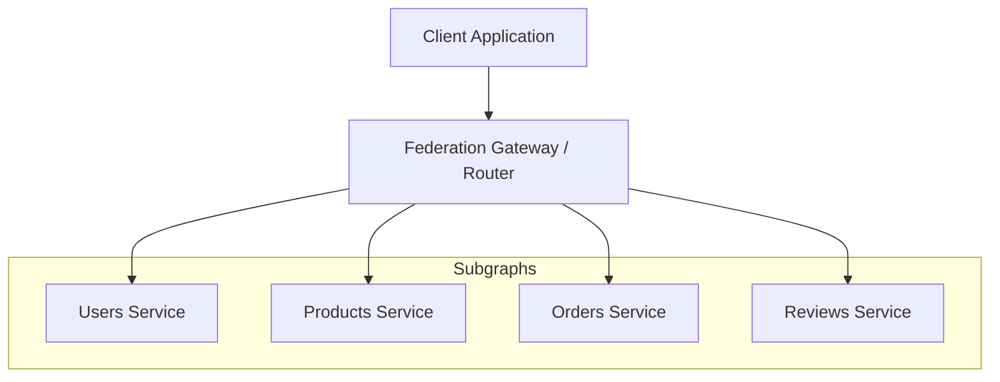
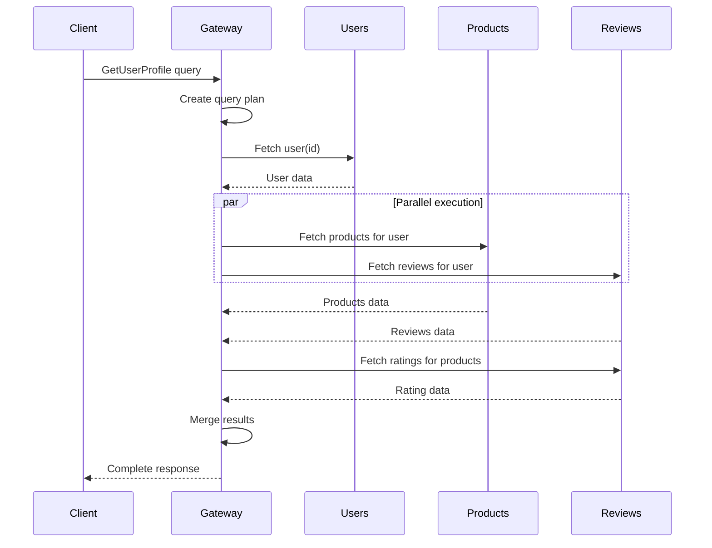
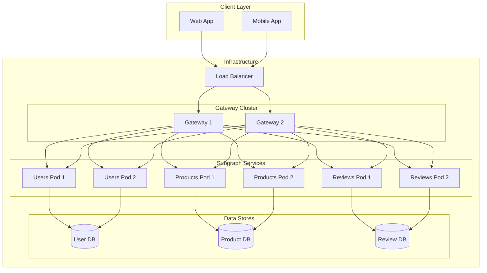

# How to Use GraphQL Federation for Microservices

Author: [nawazdhandala](https://www.github.com/nawazdhandala)

Tags: GraphQL, Federation, Microservices, API Gateway, Apollo, Distributed Systems, Backend Architecture

Description: Learn how to implement GraphQL Federation to unify your microservices into a single, cohesive API layer.

---

Building a microservices architecture often leads to a fragmented API landscape. Each service exposes its own endpoints, and clients must juggle multiple connections. GraphQL Federation solves this problem by creating a unified graph that spans all your services while letting each team own their piece of the schema.

## What Is GraphQL Federation?

GraphQL Federation is an architecture pattern that allows you to compose multiple GraphQL services (called subgraphs) into a single unified API (the supergraph). Unlike schema stitching, federation gives each microservice full ownership of its portion of the schema while enabling cross-service relationships.



The gateway acts as the single entry point. It receives queries from clients, plans how to fetch data from the relevant subgraphs, and assembles the final response.

## Why Use Federation for Microservices?

### Traditional REST Microservices Challenges

With REST-based microservices, clients often face these issues:

- Multiple HTTP calls to different services for a single view
- Over-fetching or under-fetching data
- Complex client-side data assembly
- Tight coupling between frontend and backend service boundaries

### Federation Benefits

1. **Single endpoint**: Clients make one request to get all the data they need
2. **Team autonomy**: Each team owns and deploys their subgraph independently
3. **Type safety**: The schema serves as a contract between services
4. **Efficient queries**: The gateway optimizes data fetching across services

## Setting Up a Federated Architecture

Let's build a practical example with three microservices: Users, Products, and Reviews.

### Project Structure

```
federation-demo/
├── gateway/
│   ├── package.json
│   └── index.js
├── services/
│   ├── users/
│   │   ├── package.json
│   │   ├── index.js
│   │   └── schema.graphql
│   ├── products/
│   │   ├── package.json
│   │   ├── index.js
│   │   └── schema.graphql
│   └── reviews/
│       ├── package.json
│       ├── index.js
│       └── schema.graphql
└── docker-compose.yml
```

### Step 1: Create the Users Subgraph

The Users service owns the `User` type and exposes user-related queries.

```graphql
# services/users/schema.graphql

# The @key directive marks User as an entity that can be referenced
# by other subgraphs. The "id" field is the primary key.
extend schema @link(url: "https://specs.apollo.dev/federation/v2.0", import: ["@key"])

type Query {
  # Fetch a single user by their unique identifier
  user(id: ID!): User

  # Fetch all users with optional pagination
  users(limit: Int, offset: Int): [User!]!
}

# The User entity - this is the authoritative definition
# Other subgraphs can extend this type but Users service owns it
type User @key(fields: "id") {
  id: ID!
  email: String!
  username: String!
  fullName: String!
  createdAt: String!
}
```

```javascript
// services/users/index.js

const { ApolloServer } = require('@apollo/server');
const { startStandaloneServer } = require('@apollo/server/standalone');
const { buildSubgraphSchema } = require('@apollo/subgraph');
const { readFileSync } = require('fs');
const { parse } = require('graphql');

// Load the schema from the .graphql file
const typeDefs = parse(readFileSync('./schema.graphql', 'utf-8'));

// Sample user data - in production, this would come from a database
const users = [
  { id: '1', email: 'alice@example.com', username: 'alice', fullName: 'Alice Johnson', createdAt: '2024-01-15' },
  { id: '2', email: 'bob@example.com', username: 'bob', fullName: 'Bob Smith', createdAt: '2024-02-20' },
  { id: '3', email: 'carol@example.com', username: 'carol', fullName: 'Carol Williams', createdAt: '2024-03-10' },
];

const resolvers = {
  Query: {
    // Resolver for fetching a single user
    user: (_, { id }) => users.find(user => user.id === id),

    // Resolver for fetching multiple users with pagination
    users: (_, { limit = 10, offset = 0 }) => {
      return users.slice(offset, offset + limit);
    },
  },

  User: {
    // __resolveReference is called when another subgraph references a User
    // The gateway passes the key fields (id) as the "reference" parameter
    __resolveReference: (reference) => {
      return users.find(user => user.id === reference.id);
    },
  },
};

async function startServer() {
  const server = new ApolloServer({
    schema: buildSubgraphSchema({ typeDefs, resolvers }),
  });

  const { url } = await startStandaloneServer(server, {
    listen: { port: 4001 },
  });

  console.log(`Users service running at ${url}`);
}

startServer();
```

### Step 2: Create the Products Subgraph

The Products service defines products and references users as sellers.

```graphql
# services/products/schema.graphql

extend schema @link(url: "https://specs.apollo.dev/federation/v2.0", import: ["@key", "@external"])

type Query {
  # Fetch a single product by ID
  product(id: ID!): Product

  # Fetch products with optional filtering and pagination
  products(category: String, limit: Int, offset: Int): [Product!]!
}

# Product is an entity owned by this subgraph
type Product @key(fields: "id") {
  id: ID!
  name: String!
  description: String!
  price: Float!
  category: String!
  inventory: Int!

  # Reference to the User who sells this product
  # The sellerId is stored locally, but we expose the full User type
  seller: User!
}

# Extend the User type from the Users subgraph
# We're adding a "products" field to User without owning the User type
type User @key(fields: "id") {
  # The id field is external - it's defined in the Users subgraph
  id: ID! @external

  # Products sold by this user - this field is owned by Products subgraph
  products: [Product!]!
}
```

```javascript
// services/products/index.js

const { ApolloServer } = require('@apollo/server');
const { startStandaloneServer } = require('@apollo/server/standalone');
const { buildSubgraphSchema } = require('@apollo/subgraph');
const { readFileSync } = require('fs');
const { parse } = require('graphql');

const typeDefs = parse(readFileSync('./schema.graphql', 'utf-8'));

// Sample product data
const products = [
  { id: 'p1', name: 'Wireless Keyboard', description: 'Ergonomic wireless keyboard', price: 79.99, category: 'Electronics', inventory: 50, sellerId: '1' },
  { id: 'p2', name: 'Standing Desk', description: 'Adjustable height standing desk', price: 449.99, category: 'Furniture', inventory: 15, sellerId: '1' },
  { id: 'p3', name: 'Monitor Arm', description: 'Dual monitor arm mount', price: 129.99, category: 'Electronics', inventory: 30, sellerId: '2' },
  { id: 'p4', name: 'Desk Lamp', description: 'LED desk lamp with dimmer', price: 45.99, category: 'Furniture', inventory: 100, sellerId: '3' },
];

const resolvers = {
  Query: {
    product: (_, { id }) => products.find(p => p.id === id),

    products: (_, { category, limit = 10, offset = 0 }) => {
      let result = products;

      // Filter by category if provided
      if (category) {
        result = result.filter(p => p.category === category);
      }

      // Apply pagination
      return result.slice(offset, offset + limit);
    },
  },

  Product: {
    // Resolve the reference when the gateway needs to fetch a Product
    __resolveReference: (reference) => {
      return products.find(p => p.id === reference.id);
    },

    // Return a reference to the User entity
    // The gateway will resolve the full User from the Users subgraph
    seller: (product) => {
      // Return just the key fields - the gateway handles the rest
      return { __typename: 'User', id: product.sellerId };
    },
  },

  User: {
    // When the gateway asks for products for a User reference,
    // we find all products where that user is the seller
    products: (user) => {
      return products.filter(p => p.sellerId === user.id);
    },
  },
};

async function startServer() {
  const server = new ApolloServer({
    schema: buildSubgraphSchema({ typeDefs, resolvers }),
  });

  const { url } = await startStandaloneServer(server, {
    listen: { port: 4002 },
  });

  console.log(`Products service running at ${url}`);
}

startServer();
```

### Step 3: Create the Reviews Subgraph

The Reviews service handles product reviews and extends both User and Product types.

```graphql
# services/reviews/schema.graphql

extend schema @link(url: "https://specs.apollo.dev/federation/v2.0", import: ["@key", "@external"])

type Query {
  # Fetch reviews for a specific product
  reviewsForProduct(productId: ID!): [Review!]!

  # Fetch reviews by a specific user
  reviewsByUser(userId: ID!): [Review!]!
}

type Mutation {
  # Create a new review
  createReview(input: CreateReviewInput!): Review!
}

input CreateReviewInput {
  productId: ID!
  authorId: ID!
  rating: Int!
  title: String!
  body: String!
}

# Review is an entity owned by this subgraph
type Review @key(fields: "id") {
  id: ID!
  rating: Int!
  title: String!
  body: String!
  createdAt: String!

  # References to entities from other subgraphs
  author: User!
  product: Product!
}

# Extend User to add reviews field
type User @key(fields: "id") {
  id: ID! @external

  # All reviews written by this user
  reviews: [Review!]!

  # Average rating given by this user
  averageRatingGiven: Float
}

# Extend Product to add reviews and rating fields
type Product @key(fields: "id") {
  id: ID! @external

  # All reviews for this product
  reviews: [Review!]!

  # Computed average rating based on all reviews
  averageRating: Float

  # Total number of reviews
  reviewCount: Int!
}
```

```javascript
// services/reviews/index.js

const { ApolloServer } = require('@apollo/server');
const { startStandaloneServer } = require('@apollo/server/standalone');
const { buildSubgraphSchema } = require('@apollo/subgraph');
const { readFileSync } = require('fs');
const { parse } = require('graphql');

const typeDefs = parse(readFileSync('./schema.graphql', 'utf-8'));

// Sample reviews data
let reviews = [
  { id: 'r1', productId: 'p1', authorId: '2', rating: 5, title: 'Great keyboard!', body: 'Very comfortable for long typing sessions.', createdAt: '2024-06-01' },
  { id: 'r2', productId: 'p1', authorId: '3', rating: 4, title: 'Good value', body: 'Works well, minor connectivity issues occasionally.', createdAt: '2024-06-15' },
  { id: 'r3', productId: 'p2', authorId: '2', rating: 5, title: 'Life changer', body: 'My back feels so much better now.', createdAt: '2024-07-01' },
  { id: 'r4', productId: 'p3', authorId: '1', rating: 4, title: 'Solid build', body: 'Holds my monitors securely. Easy to adjust.', createdAt: '2024-07-10' },
];

// Helper function to calculate average
const calculateAverage = (nums) => {
  if (nums.length === 0) return null;
  return nums.reduce((a, b) => a + b, 0) / nums.length;
};

const resolvers = {
  Query: {
    reviewsForProduct: (_, { productId }) => {
      return reviews.filter(r => r.productId === productId);
    },

    reviewsByUser: (_, { userId }) => {
      return reviews.filter(r => r.authorId === userId);
    },
  },

  Mutation: {
    createReview: (_, { input }) => {
      const newReview = {
        id: `r${reviews.length + 1}`,
        ...input,
        createdAt: new Date().toISOString().split('T')[0],
      };
      reviews.push(newReview);
      return newReview;
    },
  },

  Review: {
    __resolveReference: (reference) => {
      return reviews.find(r => r.id === reference.id);
    },

    // Return User reference for the gateway to resolve
    author: (review) => {
      return { __typename: 'User', id: review.authorId };
    },

    // Return Product reference for the gateway to resolve
    product: (review) => {
      return { __typename: 'Product', id: review.productId };
    },
  },

  User: {
    // Resolve reviews for a User entity reference
    reviews: (user) => {
      return reviews.filter(r => r.authorId === user.id);
    },

    // Calculate average rating given by this user
    averageRatingGiven: (user) => {
      const userReviews = reviews.filter(r => r.authorId === user.id);
      return calculateAverage(userReviews.map(r => r.rating));
    },
  },

  Product: {
    // Resolve reviews for a Product entity reference
    reviews: (product) => {
      return reviews.filter(r => r.productId === product.id);
    },

    // Calculate average rating for this product
    averageRating: (product) => {
      const productReviews = reviews.filter(r => r.productId === product.id);
      return calculateAverage(productReviews.map(r => r.rating));
    },

    // Count total reviews for this product
    reviewCount: (product) => {
      return reviews.filter(r => r.productId === product.id).length;
    },
  },
};

async function startServer() {
  const server = new ApolloServer({
    schema: buildSubgraphSchema({ typeDefs, resolvers }),
  });

  const { url } = await startStandaloneServer(server, {
    listen: { port: 4003 },
  });

  console.log(`Reviews service running at ${url}`);
}

startServer();
```

### Step 4: Set Up the Federation Gateway

The gateway composes all subgraphs and handles query planning.

```javascript
// gateway/index.js

const { ApolloServer } = require('@apollo/server');
const { startStandaloneServer } = require('@apollo/server/standalone');
const { ApolloGateway, IntrospectAndCompose } = require('@apollo/gateway');

async function startGateway() {
  // Create the gateway with service list
  // In production, you would use Apollo Studio's managed federation
  const gateway = new ApolloGateway({
    supergraphSdl: new IntrospectAndCompose({
      subgraphs: [
        { name: 'users', url: 'http://localhost:4001/graphql' },
        { name: 'products', url: 'http://localhost:4002/graphql' },
        { name: 'reviews', url: 'http://localhost:4003/graphql' },
      ],
    }),
  });

  // Create the Apollo Server with the gateway
  const server = new ApolloServer({
    gateway,
    // Disable subscriptions since the gateway doesn't support them directly
    subscriptions: false,
  });

  const { url } = await startStandaloneServer(server, {
    listen: { port: 4000 },
  });

  console.log(`Gateway running at ${url}`);
}

startGateway();
```

## Query Examples

Once your federated graph is running, clients can execute powerful queries that span multiple services.

### Fetching User with Products and Reviews

```graphql
# This single query fetches data from all three subgraphs
query GetUserProfile($userId: ID!) {
  user(id: $userId) {
    # From Users subgraph
    id
    fullName
    email

    # From Products subgraph (extended User type)
    products {
      id
      name
      price

      # From Reviews subgraph (extended Product type)
      averageRating
      reviewCount
    }

    # From Reviews subgraph (extended User type)
    reviews {
      rating
      title
      product {
        # Resolved via Products subgraph
        name
      }
    }
    averageRatingGiven
  }
}
```

### Query Execution Flow



## Federation Directives Reference

Federation uses special directives to define relationships between subgraphs.

| Directive | Purpose | Example |
|-----------|---------|---------|
| `@key` | Marks a type as an entity with a unique identifier | `type User @key(fields: "id")` |
| `@external` | Marks a field as defined in another subgraph | `id: ID! @external` |
| `@requires` | Specifies fields needed from the base type | `@requires(fields: "price weight")` |
| `@provides` | Indicates a resolver provides certain fields | `@provides(fields: "name")` |
| `@shareable` | Allows multiple subgraphs to resolve the same field | `name: String! @shareable` |
| `@override` | Migrates a field from one subgraph to another | `@override(from: "products")` |

## Best Practices for Production

### 1. Schema Design

Keep entity definitions focused. Each subgraph should own specific business domains.

```graphql
# Good: Clear ownership
# Users subgraph owns authentication and profile data
type User @key(fields: "id") {
  id: ID!
  email: String!
  profile: UserProfile!
}

# Products subgraph extends User with selling-related fields
extend type User @key(fields: "id") {
  id: ID! @external
  sellerRating: Float
  totalSales: Int!
}
```

### 2. Error Handling

Implement consistent error handling across subgraphs.

```javascript
// Standardized error handling in resolvers
const resolvers = {
  Query: {
    user: async (_, { id }, context) => {
      try {
        const user = await context.dataSources.users.getUser(id);

        if (!user) {
          throw new GraphQLError('User not found', {
            extensions: {
              code: 'USER_NOT_FOUND',
              argumentName: 'id',
            },
          });
        }

        return user;
      } catch (error) {
        // Log for observability
        context.logger.error('Failed to fetch user', { id, error });
        throw error;
      }
    },
  },
};
```

### 3. Performance Optimization with DataLoader

Use DataLoader to batch and cache requests within a single query.

```javascript
// dataloaders/userLoader.js

const DataLoader = require('dataloader');

// Create a loader that batches user fetches
function createUserLoader(db) {
  return new DataLoader(async (userIds) => {
    // Fetch all requested users in a single database query
    const users = await db.users.findMany({
      where: { id: { in: userIds } },
    });

    // Return users in the same order as the input IDs
    const userMap = new Map(users.map(u => [u.id, u]));
    return userIds.map(id => userMap.get(id) || null);
  });
}

// Use in context creation
const server = new ApolloServer({
  schema: buildSubgraphSchema({ typeDefs, resolvers }),
  context: ({ req }) => ({
    userLoader: createUserLoader(db),
  }),
});
```

### 4. Health Checks and Observability

```javascript
// Add health check endpoint for each subgraph
const express = require('express');
const app = express();

app.get('/health', (req, res) => {
  // Check database connectivity and other dependencies
  const healthy = checkDependencies();

  if (healthy) {
    res.status(200).json({ status: 'healthy', service: 'users' });
  } else {
    res.status(503).json({ status: 'unhealthy', service: 'users' });
  }
});

// Add tracing for observability
const { ApolloServerPluginUsageReporting } = require('@apollo/server/plugin/usageReporting');

const server = new ApolloServer({
  schema: buildSubgraphSchema({ typeDefs, resolvers }),
  plugins: [
    ApolloServerPluginUsageReporting({
      sendHeaders: { onlyNames: ['x-request-id'] },
    }),
  ],
});
```

## Deployment Architecture



## Common Pitfalls to Avoid

### 1. Circular Dependencies

Avoid creating tight circular dependencies between subgraphs.

```graphql
# Problematic: Creates tight coupling
type Order @key(fields: "id") {
  id: ID!
  user: User!
  payment: Payment!  # Payment subgraph
}

type Payment @key(fields: "id") {
  id: ID!
  order: Order!  # Circular reference back to Orders
  refunds: [Refund!]!
}

# Better: Use IDs for loose coupling where appropriate
type Payment @key(fields: "id") {
  id: ID!
  orderId: ID!  # Store the reference, resolve only when needed
  refunds: [Refund!]!
}
```

### 2. N+1 Query Problems

Without proper batching, federation can create N+1 query patterns.

```javascript
// Problem: Each product triggers a separate user fetch
seller: (product) => {
  return db.users.findUnique({ where: { id: product.sellerId } });
}

// Solution: Use DataLoader
seller: (product, _, context) => {
  return context.userLoader.load(product.sellerId);
}
```

### 3. Schema Versioning

Plan for schema evolution using the `@deprecated` directive.

```graphql
type Product @key(fields: "id") {
  id: ID!
  name: String!

  # Old field - will be removed in next major version
  price: Float! @deprecated(reason: "Use priceInfo.amount instead")

  # New structured pricing
  priceInfo: PriceInfo!
}

type PriceInfo {
  amount: Float!
  currency: String!
  discount: Float
}
```

## Testing Federated Services

### Unit Testing Subgraphs

```javascript
// tests/users.test.js

const { ApolloServer } = require('@apollo/server');
const { buildSubgraphSchema } = require('@apollo/subgraph');

describe('Users Subgraph', () => {
  let server;

  beforeAll(() => {
    server = new ApolloServer({
      schema: buildSubgraphSchema({ typeDefs, resolvers }),
    });
  });

  it('resolves user by id', async () => {
    const response = await server.executeOperation({
      query: `
        query GetUser($id: ID!) {
          user(id: $id) {
            id
            email
            fullName
          }
        }
      `,
      variables: { id: '1' },
    });

    expect(response.body.singleResult.errors).toBeUndefined();
    expect(response.body.singleResult.data.user).toEqual({
      id: '1',
      email: 'alice@example.com',
      fullName: 'Alice Johnson',
    });
  });

  it('resolves user reference', async () => {
    // Test the __resolveReference function
    const response = await server.executeOperation({
      query: `
        query {
          _entities(representations: [{ __typename: "User", id: "1" }]) {
            ... on User {
              id
              fullName
            }
          }
        }
      `,
    });

    expect(response.body.singleResult.data._entities[0].fullName).toBe('Alice Johnson');
  });
});
```

### Integration Testing the Gateway

```javascript
// tests/gateway.integration.test.js

describe('Federation Gateway', () => {
  it('executes cross-subgraph query', async () => {
    const response = await gateway.executeOperation({
      query: `
        query {
          user(id: "1") {
            fullName
            products {
              name
              reviews {
                rating
              }
            }
          }
        }
      `,
    });

    const user = response.body.singleResult.data.user;
    expect(user.fullName).toBe('Alice Johnson');
    expect(user.products).toHaveLength(2);
    expect(user.products[0].reviews).toBeDefined();
  });
});
```

## Conclusion

GraphQL Federation provides a scalable approach to building unified APIs across microservices. By letting each team own their portion of the schema while maintaining a cohesive client experience, you get the benefits of both microservices architecture and a single GraphQL endpoint.

Key takeaways:

- Use federation to compose multiple GraphQL services into a unified API
- Define clear entity ownership with `@key` directives
- Leverage DataLoader to prevent N+1 queries
- Plan for schema evolution from the start
- Test both individual subgraphs and the composed gateway

Start small with two or three subgraphs, validate the architecture works for your team, and expand from there. The investment in setting up federation pays off as your system grows and more teams contribute to the graph.
