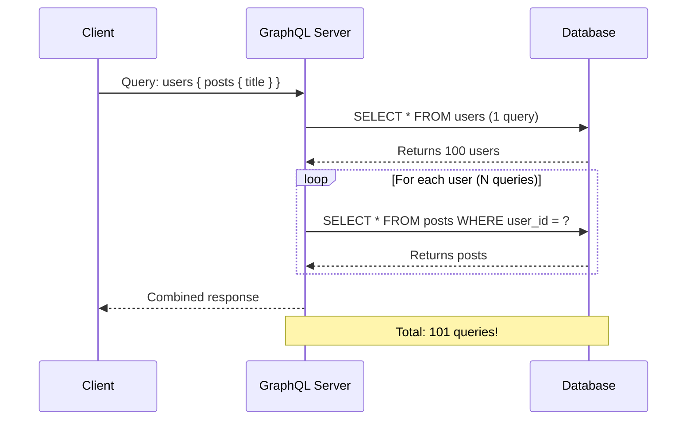
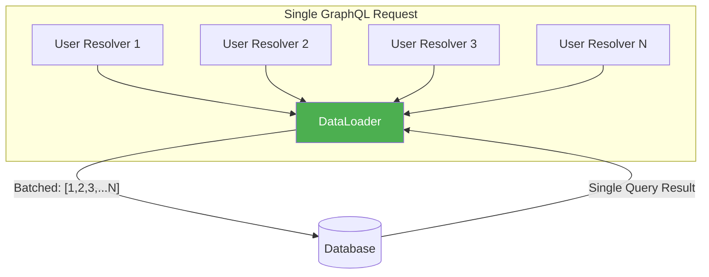
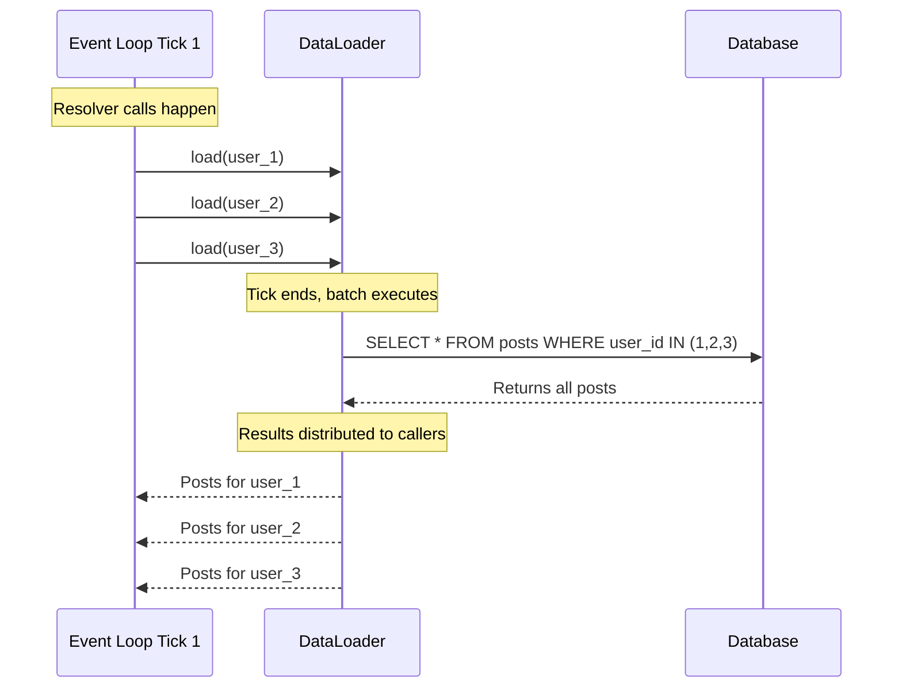
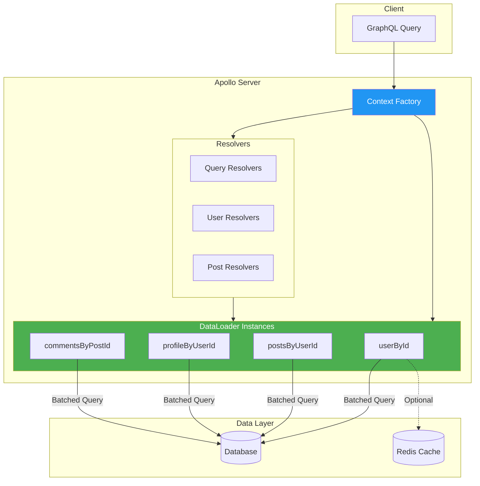

# How to Build GraphQL Resolvers with N+1 Prevention

Author: [nawazdhandala](https://www.github.com/nawazdhandala)

Tags: GraphQL, N+1 Problem, DataLoader, Performance, Backend Development

Description: Learn how to build efficient GraphQL resolvers that prevent N+1 query problems using DataLoader, batching, and caching strategies.

---

GraphQL gives clients the power to request exactly the data they need. But this flexibility comes with a hidden cost: the N+1 query problem. If you build resolvers without thinking about data fetching patterns from the start, your API can quickly become a performance nightmare. This guide shows you how to build GraphQL resolvers that prevent N+1 issues by design.

## Understanding the N+1 Problem

The N+1 problem occurs when your GraphQL server executes one query to fetch a list of items (the "1"), then executes an additional query for each item to fetch related data (the "N"). For a list of 100 items, that means 101 database queries instead of 2.



## Setting Up Your Project

Let's build a GraphQL server with proper N+1 prevention from scratch. We'll use Apollo Server with DataLoader.

```bash
# Initialize your project
npm init -y
npm install apollo-server graphql dataloader
npm install --save-dev typescript @types/node ts-node
```

## The Wrong Way: Naive Resolvers

First, let's see what naive resolvers look like. This is the pattern you want to avoid.

```typescript
// BAD EXAMPLE - This causes N+1 queries
// File: src/resolvers-naive.ts

import { db } from './database';

const resolvers = {
  Query: {
    // This fetches all users - 1 query
    users: async () => {
      return db.query('SELECT * FROM users');
    },
  },
  User: {
    // This runs ONCE PER USER - N queries!
    posts: async (parent: { id: string }) => {
      // If we have 100 users, this runs 100 times
      return db.query('SELECT * FROM posts WHERE user_id = ?', [parent.id]);
    },
    // Same problem here
    profile: async (parent: { id: string }) => {
      return db.query('SELECT * FROM profiles WHERE user_id = ?', [parent.id]);
    },
  },
};
```

The problem is clear: each field resolver runs independently, with no awareness of other resolvers requesting similar data.

## The Right Way: DataLoader Pattern

DataLoader solves N+1 by batching and caching data requests within a single request cycle. Here's the architecture:



### Step 1: Create DataLoader Instances

```typescript
// File: src/loaders.ts
// DataLoader factory functions for batching database queries

import DataLoader from 'dataloader';
import { db } from './database';

// Types for our data models
interface Post {
  id: string;
  user_id: string;
  title: string;
  content: string;
}

interface Profile {
  id: string;
  user_id: string;
  bio: string;
  avatar_url: string;
}

// Batch function for loading posts by user IDs
// This is the key to preventing N+1 queries
async function batchPostsByUserIds(userIds: readonly string[]): Promise<Post[][]> {
  // Single query fetches ALL posts for ALL requested users
  const posts = await db.query<Post>(
    `SELECT * FROM posts WHERE user_id IN (?)`,
    [userIds]
  );

  // Group posts by user_id to match DataLoader's expected format
  // DataLoader expects results in the same order as the input keys
  const postsByUserId = new Map<string, Post[]>();

  // Initialize empty arrays for each user
  userIds.forEach(id => postsByUserId.set(id, []));

  // Populate the map with actual posts
  posts.forEach(post => {
    const userPosts = postsByUserId.get(post.user_id);
    if (userPosts) {
      userPosts.push(post);
    }
  });

  // Return results in the same order as input userIds
  return userIds.map(id => postsByUserId.get(id) || []);
}

// Batch function for loading profiles by user IDs
async function batchProfilesByUserIds(userIds: readonly string[]): Promise<(Profile | null)[]> {
  const profiles = await db.query<Profile>(
    `SELECT * FROM profiles WHERE user_id IN (?)`,
    [userIds]
  );

  // Create a lookup map for O(1) access
  const profileByUserId = new Map<string, Profile>();
  profiles.forEach(profile => {
    profileByUserId.set(profile.user_id, profile);
  });

  // Return profiles in the same order as input userIds
  // Use null for users without profiles
  return userIds.map(id => profileByUserId.get(id) || null);
}

// Factory function to create fresh loaders for each request
// IMPORTANT: Never reuse DataLoader instances across requests
export function createLoaders() {
  return {
    postsByUserId: new DataLoader(batchPostsByUserIds),
    profileByUserId: new DataLoader(batchProfilesByUserIds),
  };
}
```

### Step 2: Attach Loaders to Context

DataLoader instances must be created fresh for each request. This ensures proper batching within a request while preventing data leaks between requests.

```typescript
// File: src/server.ts
// Apollo Server setup with DataLoader context

import { ApolloServer } from 'apollo-server';
import { typeDefs } from './schema';
import { resolvers } from './resolvers';
import { createLoaders } from './loaders';

// Define the context type for TypeScript
export interface Context {
  loaders: ReturnType<typeof createLoaders>;
  // Add other context properties like user auth here
  currentUser?: { id: string; role: string };
}

const server = new ApolloServer({
  typeDefs,
  resolvers,
  // Context function runs for EVERY request
  context: ({ req }): Context => {
    return {
      // Create fresh loaders for each request
      // This is crucial for proper batching and cache isolation
      loaders: createLoaders(),
      // You can also add authentication info here
      currentUser: req.headers.authorization
        ? verifyToken(req.headers.authorization)
        : undefined,
    };
  },
});

server.listen().then(({ url }) => {
  console.log(`Server ready at ${url}`);
});
```

### Step 3: Use Loaders in Resolvers

Now your resolvers use DataLoader instead of direct database queries:

```typescript
// File: src/resolvers.ts
// Resolvers that use DataLoader for N+1 prevention

import { Context } from './server';
import { db } from './database';

interface User {
  id: string;
  name: string;
  email: string;
}

export const resolvers = {
  Query: {
    // Root query still fetches the initial list
    users: async (): Promise<User[]> => {
      return db.query('SELECT * FROM users');
    },

    // Single user lookup
    user: async (_: unknown, { id }: { id: string }): Promise<User | null> => {
      const users = await db.query<User>('SELECT * FROM users WHERE id = ?', [id]);
      return users[0] || null;
    },
  },

  User: {
    // Use DataLoader instead of direct queries
    // Multiple calls to this resolver will be batched automatically
    posts: async (parent: User, _: unknown, context: Context) => {
      // DataLoader batches all .load() calls made in the same tick
      return context.loaders.postsByUserId.load(parent.id);
    },

    profile: async (parent: User, _: unknown, context: Context) => {
      return context.loaders.profileByUserId.load(parent.id);
    },
  },

  Post: {
    // You can chain loaders for nested relationships
    author: async (parent: { user_id: string }, _: unknown, context: Context) => {
      // This loader fetches users by their IDs
      return context.loaders.userById.load(parent.user_id);
    },
  },
};
```

## How DataLoader Batching Works

Understanding the batching mechanism helps you design better loaders:



DataLoader collects all `.load()` calls made during a single tick of the event loop, then executes the batch function once with all collected keys.

## Advanced Patterns

### Pattern 1: Composite Keys

Sometimes you need to batch by multiple parameters. Use a key object with a cache key function:

```typescript
// File: src/loaders/comments-loader.ts
// DataLoader with composite keys for complex queries

import DataLoader from 'dataloader';
import { db } from '../database';

interface CommentKey {
  postId: string;
  status: 'approved' | 'pending' | 'rejected';
}

interface Comment {
  id: string;
  post_id: string;
  status: string;
  content: string;
}

// Batch function handles composite keys
async function batchComments(keys: readonly CommentKey[]): Promise<Comment[][]> {
  // Group keys by status for efficient querying
  const keysByStatus = new Map<string, string[]>();

  keys.forEach(key => {
    const postIds = keysByStatus.get(key.status) || [];
    postIds.push(key.postId);
    keysByStatus.set(key.status, postIds);
  });

  // Fetch comments for each status group
  const allComments: Comment[] = [];

  for (const [status, postIds] of keysByStatus) {
    const comments = await db.query<Comment>(
      `SELECT * FROM comments WHERE post_id IN (?) AND status = ?`,
      [postIds, status]
    );
    allComments.push(...comments);
  }

  // Map results back to original key order
  return keys.map(key =>
    allComments.filter(
      c => c.post_id === key.postId && c.status === key.status
    )
  );
}

export function createCommentsLoader() {
  return new DataLoader(batchComments, {
    // Custom cache key function for composite keys
    // Without this, object keys would not match correctly
    cacheKeyFn: (key: CommentKey) => `${key.postId}:${key.status}`,
  });
}
```

### Pattern 2: Priming the Cache

When you already have data, you can prime the DataLoader cache to prevent redundant queries:

```typescript
// File: src/resolvers/user-resolvers.ts
// Example of cache priming to avoid redundant queries

export const resolvers = {
  Query: {
    usersWithProfiles: async (_: unknown, __: unknown, context: Context) => {
      // Fetch users with profiles in a single JOIN query
      const results = await db.query(`
        SELECT
          u.id as user_id, u.name, u.email,
          p.id as profile_id, p.bio, p.avatar_url
        FROM users u
        LEFT JOIN profiles p ON u.id = p.user_id
      `);

      // Transform results and prime the cache
      const users = results.map(row => {
        const user = { id: row.user_id, name: row.name, email: row.email };

        // Prime the profile loader with data we already have
        // This prevents the profile resolver from making another query
        if (row.profile_id) {
          const profile = {
            id: row.profile_id,
            user_id: row.user_id,
            bio: row.bio,
            avatar_url: row.avatar_url,
          };
          context.loaders.profileByUserId.prime(user.id, profile);
        } else {
          // Prime with null so we know there is no profile
          context.loaders.profileByUserId.prime(user.id, null);
        }

        return user;
      });

      return users;
    },
  },
};
```

### Pattern 3: Clearing the Cache

Sometimes you need to clear cached data after mutations:

```typescript
// File: src/resolvers/mutation-resolvers.ts
// Cache clearing after mutations

export const resolvers = {
  Mutation: {
    updateProfile: async (
      _: unknown,
      { userId, input }: { userId: string; input: ProfileInput },
      context: Context
    ) => {
      // Update the profile in the database
      await db.query(
        `UPDATE profiles SET bio = ?, avatar_url = ? WHERE user_id = ?`,
        [input.bio, input.avatarUrl, userId]
      );

      // Clear the cached value so subsequent queries get fresh data
      context.loaders.profileByUserId.clear(userId);

      // Fetch and return the updated profile
      return context.loaders.profileByUserId.load(userId);
    },

    deleteUser: async (
      _: unknown,
      { id }: { id: string },
      context: Context
    ) => {
      await db.query('DELETE FROM users WHERE id = ?', [id]);

      // Clear all related cached data
      context.loaders.userById.clear(id);
      context.loaders.profileByUserId.clear(id);
      context.loaders.postsByUserId.clear(id);

      return { success: true };
    },
  },
};
```

## Testing Your DataLoader Implementation

Always test that batching works correctly:

```typescript
// File: src/__tests__/loaders.test.ts
// Tests to verify DataLoader batching behavior

import { createLoaders } from '../loaders';
import { db } from '../database';

// Mock the database module
jest.mock('../database');

describe('DataLoader batching', () => {
  let loaders: ReturnType<typeof createLoaders>;
  let queryMock: jest.Mock;

  beforeEach(() => {
    // Create fresh loaders for each test
    loaders = createLoaders();
    queryMock = db.query as jest.Mock;
    queryMock.mockClear();
  });

  it('should batch multiple post requests into single query', async () => {
    // Setup mock response
    queryMock.mockResolvedValue([
      { id: '1', user_id: 'user_1', title: 'Post 1' },
      { id: '2', user_id: 'user_2', title: 'Post 2' },
      { id: '3', user_id: 'user_1', title: 'Post 3' },
    ]);

    // Make multiple load calls (simulating multiple resolver calls)
    const [posts1, posts2, posts3] = await Promise.all([
      loaders.postsByUserId.load('user_1'),
      loaders.postsByUserId.load('user_2'),
      loaders.postsByUserId.load('user_3'),
    ]);

    // Verify only ONE query was made
    expect(queryMock).toHaveBeenCalledTimes(1);

    // Verify the query included all user IDs
    expect(queryMock).toHaveBeenCalledWith(
      expect.stringContaining('IN'),
      [['user_1', 'user_2', 'user_3']]
    );

    // Verify correct results were returned
    expect(posts1).toHaveLength(2); // user_1 has 2 posts
    expect(posts2).toHaveLength(1); // user_2 has 1 post
    expect(posts3).toHaveLength(0); // user_3 has no posts
  });

  it('should use cache for repeated requests', async () => {
    queryMock.mockResolvedValue([
      { id: '1', user_id: 'user_1', bio: 'Hello' },
    ]);

    // First load triggers query
    await loaders.profileByUserId.load('user_1');

    // Second load should use cache
    await loaders.profileByUserId.load('user_1');

    // Only one query should have been made
    expect(queryMock).toHaveBeenCalledTimes(1);
  });
});
```

## Monitoring N+1 Queries in Production

Add query logging to catch N+1 issues that slip through:

```typescript
// File: src/plugins/query-logger.ts
// Apollo Server plugin for monitoring query counts

import { ApolloServerPlugin } from 'apollo-server-plugin-base';

interface RequestMetrics {
  queryCount: number;
  queries: string[];
}

export const queryLoggerPlugin: ApolloServerPlugin = {
  requestDidStart: async () => {
    const metrics: RequestMetrics = {
      queryCount: 0,
      queries: [],
    };

    return {
      // Track database queries during request execution
      executionDidStart: async () => {
        // Hook into your database client to count queries
        // This example assumes a db.on('query') event
        const queryHandler = (query: string) => {
          metrics.queryCount++;
          metrics.queries.push(query);
        };

        db.on('query', queryHandler);

        return {
          willResolveField: async ({ info }) => {
            // Optional: track field-level timing
          },
        };
      },

      willSendResponse: async ({ response, request }) => {
        // Log warning if query count seems too high
        const threshold = 10;

        if (metrics.queryCount > threshold) {
          console.warn(
            `Potential N+1 detected! ${metrics.queryCount} queries for operation: ` +
            `${request.operationName || 'anonymous'}`
          );
          console.warn('Queries:', metrics.queries);
        }

        // Add metrics to response extensions for debugging
        if (process.env.NODE_ENV === 'development') {
          response.extensions = {
            ...response.extensions,
            queryMetrics: {
              count: metrics.queryCount,
              queries: metrics.queries,
            },
          };
        }
      },
    };
  },
};
```

## Complete Architecture Overview

Here's how all the pieces fit together:



## Key Takeaways

Building GraphQL resolvers with N+1 prevention requires planning upfront:

1. **Create DataLoader instances per request** - Never share loaders between requests to avoid data leaks and stale caches.

2. **Design batch functions carefully** - Return results in the same order as input keys, and handle missing data gracefully.

3. **Use composite keys when needed** - Custom cache key functions let you batch by multiple parameters.

4. **Prime the cache when possible** - If you fetch related data in a single query, prime the loader to prevent duplicate fetches.

5. **Monitor query counts in production** - Add logging to catch N+1 patterns that slip through code review.

6. **Test batching behavior** - Write tests that verify multiple loads result in single queries.

The upfront investment in proper resolver architecture pays off quickly. A well-designed GraphQL API handles complex nested queries with a handful of database calls instead of hundreds.
