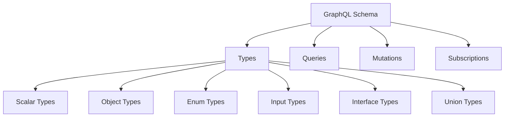
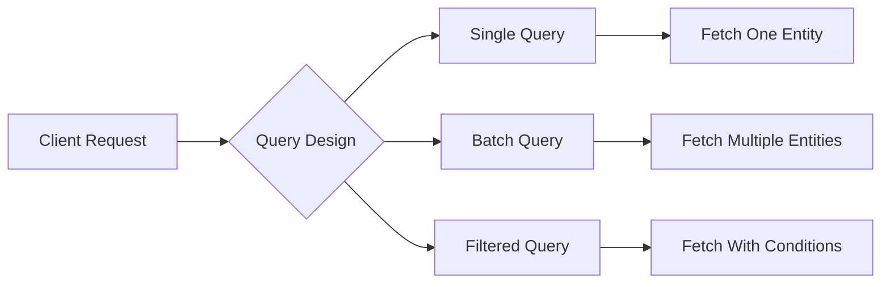
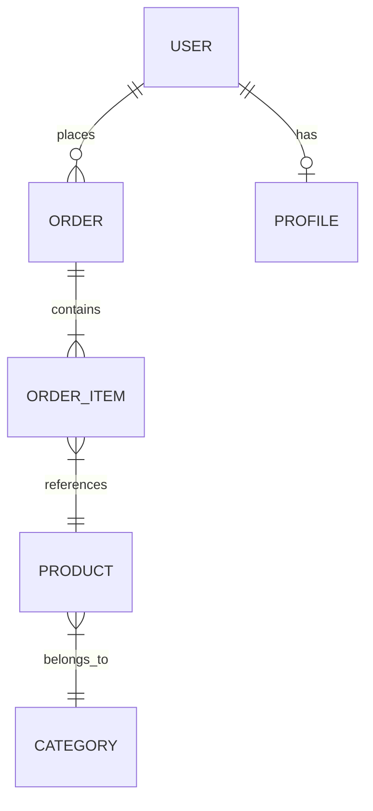
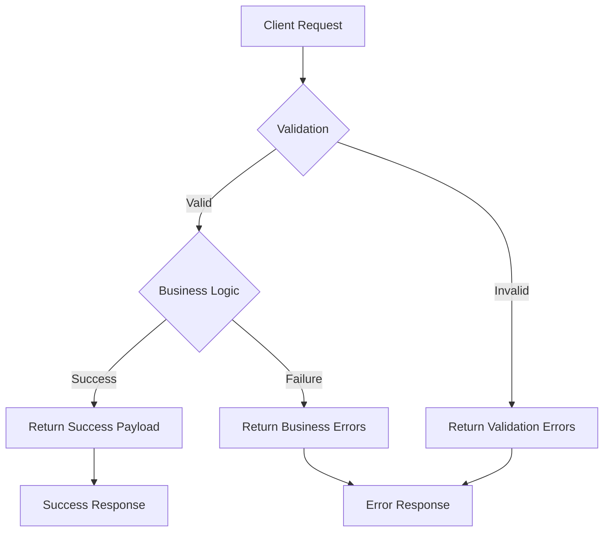

# How to Design GraphQL Schemas Effectively

Author: [nawazdhandala](https://www.github.com/nawazdhandala)

Tags: GraphQL, API Design, Schema Design, Backend Development, Web Development

Description: A comprehensive guide to designing effective GraphQL schemas with best practices for types, queries, mutations, and relationships.

---

GraphQL has become a popular choice for building APIs, but the flexibility it offers can be a double-edged sword. A poorly designed schema leads to confusion, performance issues, and maintenance headaches. This guide walks you through proven patterns and practices for creating GraphQL schemas that scale well and remain intuitive for API consumers.

## Understanding GraphQL Schema Fundamentals

Before diving into design patterns, let's establish what makes up a GraphQL schema. The schema defines the shape of your data graph and the operations clients can perform.



## Start With Your Domain Model

The best GraphQL schemas reflect your business domain, not your database structure. Think about the entities your application deals with and how they relate to each other.

```graphql
# Define types based on business concepts, not database tables
# This User type represents how the business thinks about users,
# not necessarily how they're stored in the database

type User {
  # Unique identifier for the user
  id: ID!

  # Display name shown throughout the application
  displayName: String!

  # Email address used for authentication and notifications
  email: String!

  # The user's profile with extended information
  profile: UserProfile

  # Orders placed by this user, with optional filtering
  orders(
    status: OrderStatus
    first: Int
    after: String
  ): OrderConnection!

  # Timestamp when the account was created
  createdAt: DateTime!
}

type UserProfile {
  # URL to the user's avatar image
  avatarUrl: String

  # Short biography written by the user
  bio: String

  # User's location if they've chosen to share it
  location: String

  # Social media links
  socialLinks: [SocialLink!]
}

type SocialLink {
  # The platform name (e.g., "twitter", "linkedin")
  platform: String!

  # Full URL to the profile
  url: String!
}
```

## Use Descriptive and Consistent Naming

Naming consistency makes your schema predictable and easy to navigate. Follow these conventions:

```graphql
# Use PascalCase for type names
type BlogPost {
  id: ID!
  title: String!
}

# Use camelCase for field names
type Author {
  firstName: String!
  lastName: String!
  fullName: String!  # Computed field
}

# Use SCREAMING_SNAKE_CASE for enum values
enum PostStatus {
  DRAFT
  PUBLISHED
  ARCHIVED
  PENDING_REVIEW
}

# Prefix input types with the operation name for clarity
input CreatePostInput {
  title: String!
  content: String!
  authorId: ID!
}

input UpdatePostInput {
  title: String
  content: String
}
```

## Design Queries for Client Needs

Your queries should be designed around what clients need to accomplish, not what your backend can easily provide.



```graphql
type Query {
  # Fetch a single user by their unique identifier
  # Returns null if the user doesn't exist
  user(id: ID!): User

  # Fetch a user by email address
  # Useful for authentication flows
  userByEmail(email: String!): User

  # List users with pagination and filtering
  # Follows the Relay connection specification
  users(
    # Filter by search term (searches name and email)
    searchTerm: String

    # Filter by user status
    status: UserStatus

    # Pagination: number of items to return
    first: Int

    # Pagination: cursor to start after
    after: String

    # Pagination: number of items from the end
    last: Int

    # Pagination: cursor to end before
    before: String
  ): UserConnection!

  # Get the currently authenticated user
  # Returns null if not authenticated
  me: User
}

# Connection type for paginated user results
type UserConnection {
  # List of user edges containing the node and cursor
  edges: [UserEdge!]!

  # Information about the current page
  pageInfo: PageInfo!

  # Total count of users matching the filter
  totalCount: Int!
}

type UserEdge {
  # The user object
  node: User!

  # Cursor for pagination
  cursor: String!
}

type PageInfo {
  # Whether there are more items after the last edge
  hasNextPage: Boolean!

  # Whether there are items before the first edge
  hasPreviousPage: Boolean!

  # Cursor of the first edge
  startCursor: String

  # Cursor of the last edge
  endCursor: String
}
```

## Structure Mutations Thoughtfully

Mutations represent actions in your system. Design them to be atomic, predictable, and informative about their results.

```graphql
type Mutation {
  # Create a new user account
  # Returns the created user and any relevant status information
  createUser(input: CreateUserInput!): CreateUserPayload!

  # Update an existing user's information
  # Only provided fields will be updated
  updateUser(input: UpdateUserInput!): UpdateUserPayload!

  # Delete a user account
  # Performs soft delete by default
  deleteUser(input: DeleteUserInput!): DeleteUserPayload!

  # Invite a user to the organization
  # Sends an invitation email automatically
  inviteUser(input: InviteUserInput!): InviteUserPayload!
}

# Input for creating a new user
input CreateUserInput {
  # Required email address for the account
  email: String!

  # Display name (defaults to email prefix if not provided)
  displayName: String

  # Initial password (must meet security requirements)
  password: String!

  # Optional role assignment
  roleId: ID
}

# Payload returned after creating a user
type CreateUserPayload {
  # The newly created user
  user: User

  # Any errors that occurred during creation
  errors: [CreateUserError!]

  # Whether the operation succeeded
  success: Boolean!
}

# Possible errors when creating a user
type CreateUserError {
  # Machine-readable error code
  code: CreateUserErrorCode!

  # Human-readable error message
  message: String!

  # The field that caused the error, if applicable
  field: String
}

enum CreateUserErrorCode {
  EMAIL_ALREADY_EXISTS
  INVALID_EMAIL_FORMAT
  PASSWORD_TOO_WEAK
  ROLE_NOT_FOUND
  PERMISSION_DENIED
}
```

## Model Relationships Carefully

Relationships between types should reflect real-world connections while considering performance implications.



```graphql
type Order {
  id: ID!

  # The user who placed this order
  # This is a required relationship
  user: User!

  # Items in this order with pagination
  # Use pagination for potentially large collections
  items(first: Int, after: String): OrderItemConnection!

  # Current status of the order
  status: OrderStatus!

  # Shipping address for this order
  shippingAddress: Address!

  # Total price calculations
  subtotal: Money!
  tax: Money!
  shipping: Money!
  total: Money!

  # Timestamps
  createdAt: DateTime!
  updatedAt: DateTime!
}

type OrderItem {
  id: ID!

  # Reference to the product
  product: Product!

  # Quantity ordered
  quantity: Int!

  # Price at time of order (may differ from current product price)
  unitPrice: Money!

  # Line total (quantity * unitPrice)
  lineTotal: Money!
}

# Custom scalar type for monetary values
# Stored as cents internally, formatted for display
type Money {
  # Amount in smallest currency unit (e.g., cents)
  amount: Int!

  # ISO 4217 currency code
  currency: String!

  # Formatted string for display (e.g., "$19.99")
  formatted: String!
}
```

## Use Interfaces and Unions for Polymorphism

When you have types that share common fields or need to represent multiple possible types, use interfaces and unions.

```graphql
# Interface for anything that can appear in a search result
interface SearchResult {
  # Unique identifier
  id: ID!

  # Relevance score from the search algorithm
  relevanceScore: Float!

  # Highlighted snippet showing the match
  highlightedSnippet: String
}

# User implements SearchResult
type User implements SearchResult {
  id: ID!
  relevanceScore: Float!
  highlightedSnippet: String

  # User-specific fields
  displayName: String!
  email: String!
  avatarUrl: String
}

# Post implements SearchResult
type Post implements SearchResult {
  id: ID!
  relevanceScore: Float!
  highlightedSnippet: String

  # Post-specific fields
  title: String!
  content: String!
  author: User!
}

# Comment implements SearchResult
type Comment implements SearchResult {
  id: ID!
  relevanceScore: Float!
  highlightedSnippet: String

  # Comment-specific fields
  body: String!
  author: User!
  post: Post!
}

# Union type for notifications that can be different types
union NotificationContent =
  | NewFollowerNotification
  | CommentNotification
  | MentionNotification
  | SystemNotification

type Notification {
  id: ID!

  # When the notification was created
  createdAt: DateTime!

  # Whether the user has seen this notification
  read: Boolean!

  # The actual content varies by notification type
  content: NotificationContent!
}

type NewFollowerNotification {
  follower: User!
}

type CommentNotification {
  comment: Comment!
  post: Post!
}

type MentionNotification {
  mentionedIn: Post!
  mentionedBy: User!
}

type SystemNotification {
  title: String!
  message: String!
  severity: NotificationSeverity!
}
```

## Implement Proper Error Handling

Design your schema to handle errors gracefully and provide useful information to clients.



```graphql
# Generic result interface for mutations
interface MutationResult {
  # Whether the operation completed successfully
  success: Boolean!

  # Human-readable message about the result
  message: String
}

# Specific payload for updating a post
type UpdatePostPayload implements MutationResult {
  success: Boolean!
  message: String

  # The updated post (null if operation failed)
  post: Post

  # Specific errors that occurred
  errors: [UpdatePostError!]
}

type UpdatePostError {
  # The field that caused the error
  field: UpdatePostField!

  # Machine-readable error code
  code: UpdatePostErrorCode!

  # Human-readable description
  message: String!
}

enum UpdatePostField {
  TITLE
  CONTENT
  CATEGORY_ID
  TAGS
  PUBLISHED_AT
}

enum UpdatePostErrorCode {
  # Title validation errors
  TITLE_TOO_SHORT
  TITLE_TOO_LONG
  TITLE_CONTAINS_PROHIBITED_WORDS

  # Content validation errors
  CONTENT_TOO_SHORT
  CONTENT_EXCEEDS_LIMIT

  # Reference errors
  CATEGORY_NOT_FOUND
  TAG_NOT_FOUND

  # Permission errors
  NOT_AUTHORIZED
  POST_LOCKED
}
```

## Design for Performance

Consider how your schema will perform under load. Avoid patterns that lead to N+1 queries or excessive data fetching.

```graphql
type Query {
  # BAD: This could trigger N+1 queries
  # posts: [Post!]!  # Each post.author would be a separate query

  # GOOD: Use DataLoader pattern with connection-based pagination
  posts(first: Int!, after: String): PostConnection!
}

type Post {
  id: ID!
  title: String!

  # The author field should use DataLoader to batch requests
  # Multiple posts by the same author will share one database query
  author: User!

  # For large text content, consider making it optional
  # or providing a preview field
  contentPreview: String!

  # Full content might be expensive, mark it clearly
  fullContent: String!

  # Avoid deeply nested required relationships
  # This allows clients to fetch only what they need
  category: Category
  tags: [Tag!]
}

# Use field arguments to let clients control data fetching
type User {
  id: ID!
  displayName: String!

  # Let clients specify how many posts they need
  posts(
    first: Int = 10
    after: String
    # Allow filtering to reduce data transfer
    status: PostStatus
  ): PostConnection!

  # Aggregate fields avoid fetching all data just to count
  postsCount: Int!
  followersCount: Int!
  followingCount: Int!
}
```

## Add Subscriptions for Real-Time Features

When your application needs real-time updates, design subscriptions that are specific and efficient.

```graphql
type Subscription {
  # Subscribe to new messages in a specific conversation
  # More efficient than subscribing to all messages
  messageReceived(conversationId: ID!): Message!

  # Subscribe to order status changes for a specific order
  orderStatusChanged(orderId: ID!): OrderStatusUpdate!

  # Subscribe to notifications for the current user
  # Requires authentication
  notificationReceived: Notification!

  # Subscribe to typing indicators in a conversation
  typingIndicator(conversationId: ID!): TypingIndicator!
}

type OrderStatusUpdate {
  # The order that was updated
  order: Order!

  # Previous status
  previousStatus: OrderStatus!

  # New status
  newStatus: OrderStatus!

  # When the change occurred
  changedAt: DateTime!

  # Optional message about the change
  statusMessage: String
}

type TypingIndicator {
  # User who is typing
  user: User!

  # Whether they are currently typing
  isTyping: Boolean!
}
```

## Document Your Schema

Use descriptions to make your schema self-documenting. This information appears in GraphQL tooling like GraphiQL and Apollo Studio.

```graphql
"""
Represents a product available for purchase in the store.
Products belong to categories and can have multiple variants.
"""
type Product {
  """
  Unique identifier for the product.
  This ID is stable and can be used for caching.
  """
  id: ID!

  """
  Human-readable product name displayed to customers.
  Maximum length: 200 characters.
  """
  name: String!

  """
  URL-friendly identifier for the product.
  Used in product page URLs: /products/{slug}
  """
  slug: String!

  """
  Full product description in Markdown format.
  Supports basic formatting, links, and images.
  """
  description: String

  """
  Base price for the product before any discounts.
  Individual variants may have different prices.
  """
  basePrice: Money!

  """
  Available variants of this product (size, color, etc).
  At least one variant is always present.
  """
  variants: [ProductVariant!]!

  """
  Whether the product is currently available for purchase.
  False if all variants are out of stock.
  """
  isAvailable: Boolean!

  """
  Average rating from customer reviews (1-5).
  Null if the product has no reviews yet.
  """
  averageRating: Float

  """
  Number of reviews for this product.
  """
  reviewCount: Int!
}
```

## Schema Evolution and Deprecation

Plan for change by using deprecation notices and additive-only changes when possible.

```graphql
type User {
  id: ID!

  # New preferred field
  displayName: String!

  # Deprecated field with migration guidance
  name: String! @deprecated(reason: "Use displayName instead. Will be removed in version 3.0.")

  # New structured name fields
  firstName: String
  lastName: String

  # Old flat email field
  email: String! @deprecated(reason: "Use emailAddresses[0].address for the primary email. Will be removed in version 3.0.")

  # New structured email field supporting multiple addresses
  emailAddresses: [EmailAddress!]!
}

type EmailAddress {
  address: String!
  isPrimary: Boolean!
  isVerified: Boolean!
  label: String  # "work", "personal", etc.
}
```

## Complete Schema Example

Here's a more complete example showing these patterns working together:

```graphql
# Custom scalar definitions
scalar DateTime
scalar URL
scalar EmailAddress

# Root Query type
type Query {
  # User queries
  me: User
  user(id: ID!): User
  users(
    searchTerm: String
    role: UserRole
    first: Int = 20
    after: String
  ): UserConnection!

  # Product queries
  product(id: ID!): Product
  productBySlug(slug: String!): Product
  products(
    categoryId: ID
    searchTerm: String
    minPrice: Int
    maxPrice: Int
    inStock: Boolean
    sortBy: ProductSortField = CREATED_AT
    sortOrder: SortOrder = DESC
    first: Int = 20
    after: String
  ): ProductConnection!

  # Order queries
  order(id: ID!): Order
  orders(
    userId: ID
    status: OrderStatus
    dateFrom: DateTime
    dateTo: DateTime
    first: Int = 20
    after: String
  ): OrderConnection!
}

# Root Mutation type
type Mutation {
  # Authentication
  login(input: LoginInput!): AuthPayload!
  logout: LogoutPayload!
  register(input: RegisterInput!): AuthPayload!

  # User mutations
  updateProfile(input: UpdateProfileInput!): UpdateProfilePayload!
  changePassword(input: ChangePasswordInput!): ChangePasswordPayload!

  # Product mutations (admin only)
  createProduct(input: CreateProductInput!): CreateProductPayload!
  updateProduct(input: UpdateProductInput!): UpdateProductPayload!
  deleteProduct(id: ID!): DeleteProductPayload!

  # Order mutations
  createOrder(input: CreateOrderInput!): CreateOrderPayload!
  cancelOrder(id: ID!, reason: String): CancelOrderPayload!

  # Cart mutations
  addToCart(input: AddToCartInput!): CartPayload!
  updateCartItem(input: UpdateCartItemInput!): CartPayload!
  removeFromCart(itemId: ID!): CartPayload!
  clearCart: CartPayload!
}

# Root Subscription type
type Subscription {
  orderStatusChanged(orderId: ID!): OrderStatusUpdate!
  productInventoryChanged(productId: ID!): InventoryUpdate!
  cartUpdated: Cart!
}

# Enum definitions
enum UserRole {
  CUSTOMER
  STAFF
  ADMIN
}

enum OrderStatus {
  PENDING
  CONFIRMED
  PROCESSING
  SHIPPED
  DELIVERED
  CANCELLED
  REFUNDED
}

enum ProductSortField {
  NAME
  PRICE
  CREATED_AT
  POPULARITY
  RATING
}

enum SortOrder {
  ASC
  DESC
}
```

## Summary

Designing effective GraphQL schemas requires balancing flexibility with structure. The key principles to remember are:

1. Model your domain, not your database
2. Use consistent naming conventions throughout
3. Design queries around client needs
4. Structure mutations to be atomic and return rich payloads
5. Handle errors explicitly in your schema
6. Consider performance implications of relationships
7. Document your schema thoroughly
8. Plan for evolution with deprecation strategies

By following these patterns, you'll create GraphQL schemas that are intuitive for consumers, maintainable for your team, and performant in production. Start simple, iterate based on real usage patterns, and don't be afraid to refactor as your understanding of the domain deepens.
