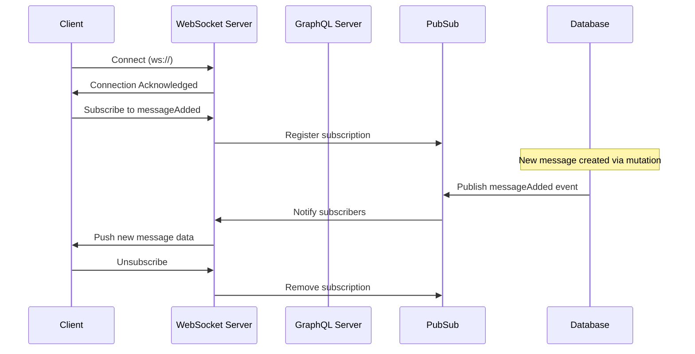
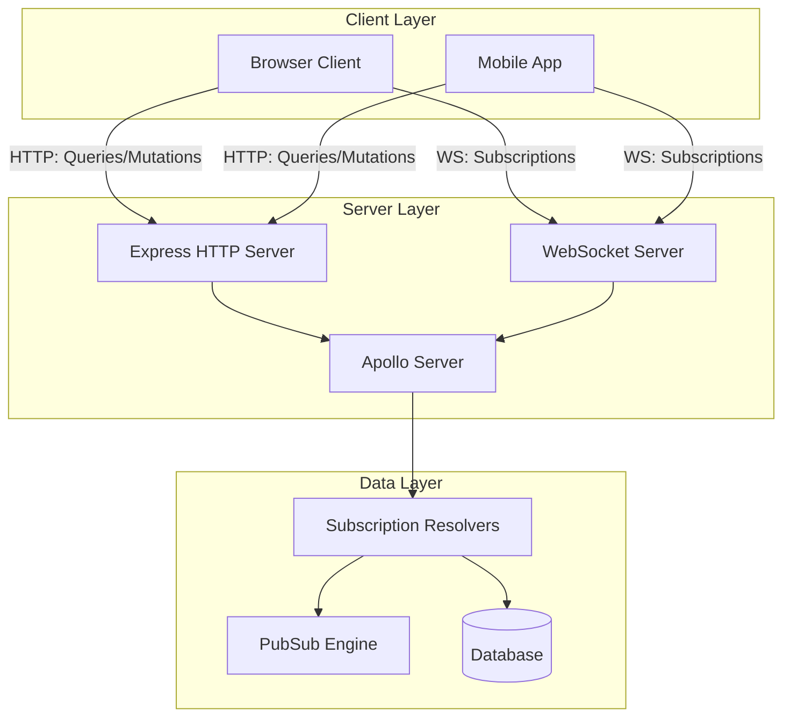
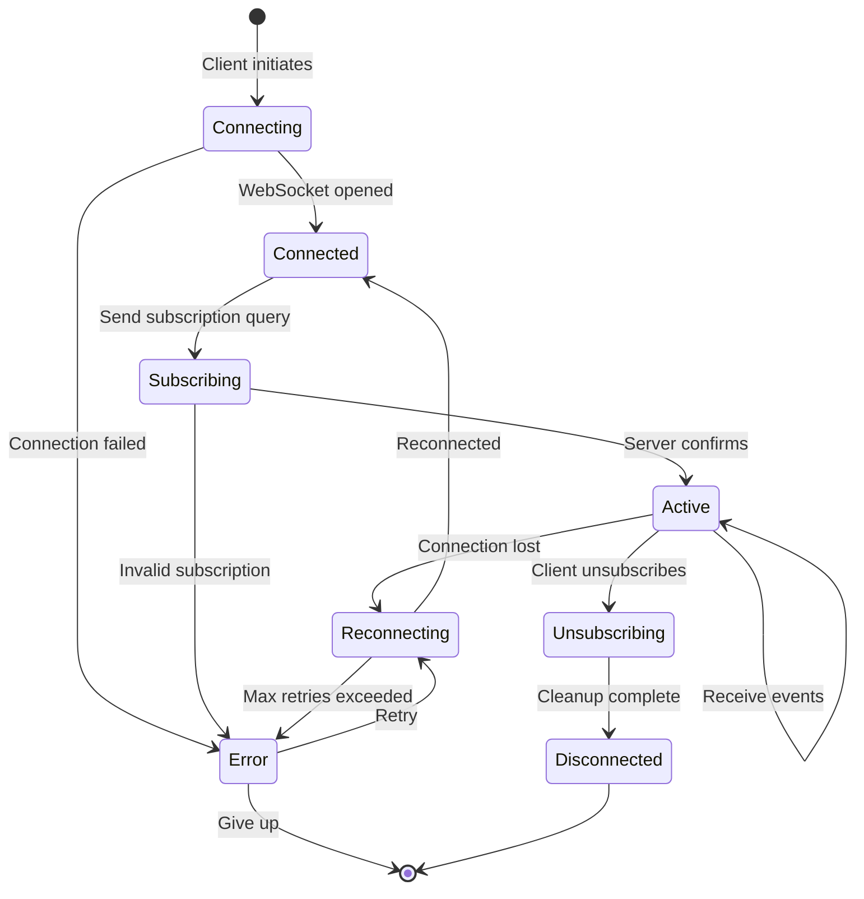

# How to Implement GraphQL Subscriptions

Author: [nawazdhandala](https://www.github.com/nawazdhandala)

Tags: GraphQL, Subscriptions, Real-Time, WebSocket, Backend Development

Description: Learn how to implement GraphQL subscriptions for real-time updates using WebSocket connections with Apollo Server and other frameworks.

---

GraphQL subscriptions provide a way to push real-time updates from your server to connected clients. Unlike queries and mutations that follow a request-response pattern, subscriptions maintain a persistent connection that allows the server to send data whenever relevant events occur. This makes subscriptions perfect for features like live notifications, chat applications, collaborative editing, and real-time dashboards.

## How GraphQL Subscriptions Work

Before diving into implementation, let's understand how subscriptions differ from queries and mutations.



The key components are:

1. **WebSocket Connection**: Maintains a persistent bidirectional connection between client and server
2. **PubSub System**: Manages event publishing and subscriber notifications
3. **Subscription Resolver**: Defines what data to send when events occur

## Setting Up Your Project

Let's build a complete example using Apollo Server. First, initialize your project and install the required dependencies.

```bash
# Create a new project directory
mkdir graphql-subscriptions-demo
cd graphql-subscriptions-demo

# Initialize package.json
npm init -y

# Install required dependencies
npm install @apollo/server graphql graphql-subscriptions graphql-ws ws express cors
npm install --save-dev typescript @types/node @types/express @types/ws ts-node
```

Create a `tsconfig.json` file:

```json
{
  "compilerOptions": {
    "target": "ES2020",
    "module": "commonjs",
    "strict": true,
    "esModuleInterop": true,
    "skipLibCheck": true,
    "outDir": "./dist"
  },
  "include": ["src/**/*"]
}
```

## Project Architecture

Here's how the different components of our subscription system interact:



## Defining the GraphQL Schema

Create a schema that includes subscription types alongside your queries and mutations.

```typescript
// src/schema.ts

import { gql } from 'graphql-tag';

// Define the GraphQL schema with types for queries, mutations, and subscriptions
export const typeDefs = gql`
  # Message type represents a chat message in our system
  type Message {
    id: ID!
    content: String!
    sender: String!
    timestamp: String!
    roomId: String!
  }

  # User type for tracking online presence
  type User {
    id: ID!
    username: String!
    isOnline: Boolean!
  }

  # Notification type for system events
  type Notification {
    id: ID!
    type: NotificationType!
    message: String!
    timestamp: String!
  }

  # Enum for different notification types
  enum NotificationType {
    MESSAGE
    USER_JOINED
    USER_LEFT
    SYSTEM
  }

  # Standard queries for fetching data
  type Query {
    messages(roomId: String!): [Message!]!
    users: [User!]!
  }

  # Mutations for creating and modifying data
  type Mutation {
    sendMessage(roomId: String!, content: String!, sender: String!): Message!
    setUserOnline(userId: ID!, isOnline: Boolean!): User!
  }

  # Subscriptions for real-time updates
  # Each subscription can optionally filter by specific criteria
  type Subscription {
    # Subscribe to new messages in a specific room
    messageAdded(roomId: String!): Message!

    # Subscribe to user presence changes
    userStatusChanged: User!

    # Subscribe to all notifications for a user
    notificationReceived(userId: ID!): Notification!
  }
`;
```

## Setting Up the PubSub System

The PubSub system is responsible for managing event publishing and subscriber notifications. For development, you can use the in-memory PubSub. For production, consider using Redis PubSub for scalability.

```typescript
// src/pubsub.ts

import { PubSub } from 'graphql-subscriptions';

// Create a PubSub instance for managing subscription events
// In production, replace this with RedisPubSub for horizontal scaling
export const pubsub = new PubSub();

// Define event names as constants to prevent typos and enable autocomplete
export const EVENTS = {
  MESSAGE_ADDED: 'MESSAGE_ADDED',
  USER_STATUS_CHANGED: 'USER_STATUS_CHANGED',
  NOTIFICATION_RECEIVED: 'NOTIFICATION_RECEIVED',
} as const;

// Helper type for event payloads
export interface MessageAddedPayload {
  messageAdded: {
    id: string;
    content: string;
    sender: string;
    timestamp: string;
    roomId: string;
  };
}

export interface UserStatusPayload {
  userStatusChanged: {
    id: string;
    username: string;
    isOnline: boolean;
  };
}

export interface NotificationPayload {
  notificationReceived: {
    id: string;
    type: string;
    message: string;
    timestamp: string;
    userId: string;
  };
}
```

## Implementing Resolvers

Now let's implement the resolvers that handle queries, mutations, and subscriptions.

```typescript
// src/resolvers.ts

import { pubsub, EVENTS } from './pubsub';
import { withFilter } from 'graphql-subscriptions';

// In-memory storage for demo purposes
// In production, replace with actual database calls
const messages: any[] = [];
const users: Map<string, any> = new Map([
  ['1', { id: '1', username: 'alice', isOnline: false }],
  ['2', { id: '2', username: 'bob', isOnline: false }],
]);

// Generate unique IDs for new entities
const generateId = () => Math.random().toString(36).substring(2, 9);

export const resolvers = {
  Query: {
    // Fetch all messages for a specific room
    messages: (_: any, { roomId }: { roomId: string }) => {
      return messages.filter(msg => msg.roomId === roomId);
    },

    // Fetch all users
    users: () => Array.from(users.values()),
  },

  Mutation: {
    // Send a new message and publish the event to subscribers
    sendMessage: (_: any, { roomId, content, sender }: {
      roomId: string;
      content: string;
      sender: string;
    }) => {
      // Create the new message object
      const message = {
        id: generateId(),
        content,
        sender,
        timestamp: new Date().toISOString(),
        roomId,
      };

      // Store the message
      messages.push(message);

      // Publish the event to all subscribers watching this room
      // The payload structure must match what the subscription resolver expects
      pubsub.publish(EVENTS.MESSAGE_ADDED, {
        messageAdded: message
      });

      return message;
    },

    // Update user online status and notify subscribers
    setUserOnline: (_: any, { userId, isOnline }: {
      userId: string;
      isOnline: boolean;
    }) => {
      const user = users.get(userId);

      if (!user) {
        throw new Error(`User with id ${userId} not found`);
      }

      // Update the user's online status
      user.isOnline = isOnline;
      users.set(userId, user);

      // Publish the status change event
      pubsub.publish(EVENTS.USER_STATUS_CHANGED, {
        userStatusChanged: user
      });

      return user;
    },
  },

  Subscription: {
    // Subscribe to new messages in a specific room
    // withFilter allows us to only send events to relevant subscribers
    messageAdded: {
      subscribe: withFilter(
        // The base subscription iterator
        () => pubsub.asyncIterator([EVENTS.MESSAGE_ADDED]),

        // Filter function that determines if this event should be sent
        // to this particular subscriber based on the roomId argument
        (payload, variables) => {
          // Only send the message if it belongs to the subscribed room
          return payload.messageAdded.roomId === variables.roomId;
        }
      ),
    },

    // Subscribe to user status changes (no filtering needed)
    userStatusChanged: {
      subscribe: () => pubsub.asyncIterator([EVENTS.USER_STATUS_CHANGED]),
    },

    // Subscribe to notifications for a specific user
    notificationReceived: {
      subscribe: withFilter(
        () => pubsub.asyncIterator([EVENTS.NOTIFICATION_RECEIVED]),

        // Only send notifications intended for this specific user
        (payload, variables) => {
          return payload.notificationReceived.userId === variables.userId;
        }
      ),
    },
  },
};
```

## Creating the Server

Now let's put everything together and create the Apollo Server with WebSocket support.

```typescript
// src/server.ts

import { ApolloServer } from '@apollo/server';
import { expressMiddleware } from '@apollo/server/express4';
import { ApolloServerPluginDrainHttpServer } from '@apollo/server/plugin/drainHttpServer';
import { createServer } from 'http';
import express from 'express';
import { makeExecutableSchema } from '@graphql-tools/schema';
import { WebSocketServer } from 'ws';
import { useServer } from 'graphql-ws/lib/use/ws';
import cors from 'cors';
import { typeDefs } from './schema';
import { resolvers } from './resolvers';

async function startServer() {
  // Create Express app and HTTP server
  const app = express();
  const httpServer = createServer(app);

  // Create the executable GraphQL schema
  const schema = makeExecutableSchema({ typeDefs, resolvers });

  // Create WebSocket server for handling subscriptions
  // This runs alongside the HTTP server on the same port
  const wsServer = new WebSocketServer({
    server: httpServer,
    path: '/graphql', // WebSocket endpoint path
  });

  // Set up graphql-ws server with the schema
  // This handles the WebSocket protocol for GraphQL subscriptions
  const serverCleanup = useServer(
    {
      schema,
      // Called when a client connects
      onConnect: async (ctx) => {
        console.log('Client connected for subscriptions');
        // You can add authentication logic here
        // Return false to reject the connection
        return true;
      },
      // Called when a client disconnects
      onDisconnect: async (ctx, code, reason) => {
        console.log('Client disconnected');
      },
      // Called when a subscription starts
      onSubscribe: async (ctx, msg) => {
        console.log(`Subscription started: ${msg.payload.operationName}`);
      },
    },
    wsServer
  );

  // Create Apollo Server instance
  const server = new ApolloServer({
    schema,
    plugins: [
      // Proper shutdown for HTTP server
      ApolloServerPluginDrainHttpServer({ httpServer }),

      // Proper shutdown for WebSocket server
      {
        async serverWillStart() {
          return {
            async drainServer() {
              await serverCleanup.dispose();
            },
          };
        },
      },
    ],
  });

  // Start Apollo Server
  await server.start();

  // Apply Express middleware
  app.use(
    '/graphql',
    cors<cors.CorsRequest>(),
    express.json(),
    expressMiddleware(server)
  );

  // Start listening
  const PORT = process.env.PORT || 4000;
  httpServer.listen(PORT, () => {
    console.log(`Server ready at http://localhost:${PORT}/graphql`);
    console.log(`Subscriptions ready at ws://localhost:${PORT}/graphql`);
  });
}

// Start the server
startServer().catch(console.error);
```

## Client-Side Implementation

Here's how to connect to subscriptions from a React client using Apollo Client.

```typescript
// client/src/apolloClient.ts

import {
  ApolloClient,
  InMemoryCache,
  HttpLink,
  split
} from '@apollo/client';
import { GraphQLWsLink } from '@apollo/client/link/subscriptions';
import { createClient } from 'graphql-ws';
import { getMainDefinition } from '@apollo/client/utilities';

// HTTP link for queries and mutations
const httpLink = new HttpLink({
  uri: 'http://localhost:4000/graphql',
});

// WebSocket link for subscriptions
const wsLink = new GraphQLWsLink(
  createClient({
    url: 'ws://localhost:4000/graphql',
    // Reconnection configuration
    connectionParams: {
      // You can pass authentication tokens here
      authToken: localStorage.getItem('token'),
    },
    // Automatic reconnection on connection loss
    retryAttempts: 5,
    shouldRetry: () => true,
    on: {
      connected: () => console.log('WebSocket connected'),
      closed: () => console.log('WebSocket closed'),
      error: (error) => console.error('WebSocket error:', error),
    },
  })
);

// Split link: use WebSocket for subscriptions, HTTP for everything else
// This ensures each operation type uses the appropriate transport
const splitLink = split(
  ({ query }) => {
    const definition = getMainDefinition(query);
    return (
      definition.kind === 'OperationDefinition' &&
      definition.operation === 'subscription'
    );
  },
  wsLink,  // Use WebSocket for subscriptions
  httpLink // Use HTTP for queries and mutations
);

// Create the Apollo Client instance
export const apolloClient = new ApolloClient({
  link: splitLink,
  cache: new InMemoryCache(),
});
```

## React Component with Subscription

Here's a React component that uses the subscription to display real-time messages.

```tsx
// client/src/components/ChatRoom.tsx

import React, { useEffect, useState } from 'react';
import { useQuery, useMutation, useSubscription, gql } from '@apollo/client';

// GraphQL operations
const GET_MESSAGES = gql`
  query GetMessages($roomId: String!) {
    messages(roomId: $roomId) {
      id
      content
      sender
      timestamp
    }
  }
`;

const SEND_MESSAGE = gql`
  mutation SendMessage($roomId: String!, $content: String!, $sender: String!) {
    sendMessage(roomId: $roomId, content: $content, sender: $sender) {
      id
      content
      sender
      timestamp
    }
  }
`;

const MESSAGE_SUBSCRIPTION = gql`
  subscription OnMessageAdded($roomId: String!) {
    messageAdded(roomId: $roomId) {
      id
      content
      sender
      timestamp
    }
  }
`;

interface Message {
  id: string;
  content: string;
  sender: string;
  timestamp: string;
}

interface ChatRoomProps {
  roomId: string;
  currentUser: string;
}

export const ChatRoom: React.FC<ChatRoomProps> = ({ roomId, currentUser }) => {
  const [newMessage, setNewMessage] = useState('');

  // Fetch initial messages
  const { data, loading } = useQuery(GET_MESSAGES, {
    variables: { roomId },
  });

  // Mutation for sending messages
  const [sendMessage] = useMutation(SEND_MESSAGE);

  // Subscribe to new messages
  // The subscription automatically updates when new messages arrive
  const { data: subscriptionData } = useSubscription(MESSAGE_SUBSCRIPTION, {
    variables: { roomId },
    // This callback fires whenever a new message is received
    onSubscriptionData: ({ subscriptionData }) => {
      console.log('New message received:', subscriptionData.data?.messageAdded);
    },
  });

  // Combine initial data with subscription updates
  // Apollo Client handles this automatically with cache normalization,
  // but for simplicity we track messages in local state here
  const [messages, setMessages] = useState<Message[]>([]);

  useEffect(() => {
    if (data?.messages) {
      setMessages(data.messages);
    }
  }, [data]);

  useEffect(() => {
    if (subscriptionData?.messageAdded) {
      // Check if message already exists to prevent duplicates
      setMessages(prev => {
        const exists = prev.some(m => m.id === subscriptionData.messageAdded.id);
        if (exists) return prev;
        return [...prev, subscriptionData.messageAdded];
      });
    }
  }, [subscriptionData]);

  const handleSend = async () => {
    if (!newMessage.trim()) return;

    try {
      await sendMessage({
        variables: {
          roomId,
          content: newMessage,
          sender: currentUser,
        },
      });
      setNewMessage('');
    } catch (error) {
      console.error('Failed to send message:', error);
    }
  };

  if (loading) return <div>Loading messages...</div>;

  return (
    <div className="chat-room">
      <div className="messages-container">
        {messages.map((message) => (
          <div
            key={message.id}
            className={`message ${message.sender === currentUser ? 'own' : ''}`}
          >
            <span className="sender">{message.sender}</span>
            <p className="content">{message.content}</p>
            <span className="timestamp">
              {new Date(message.timestamp).toLocaleTimeString()}
            </span>
          </div>
        ))}
      </div>

      <div className="input-container">
        <input
          type="text"
          value={newMessage}
          onChange={(e) => setNewMessage(e.target.value)}
          onKeyPress={(e) => e.key === 'Enter' && handleSend()}
          placeholder="Type a message..."
        />
        <button onClick={handleSend}>Send</button>
      </div>
    </div>
  );
};
```

## Subscription Lifecycle

Understanding the subscription lifecycle helps with debugging and optimization.



## Scaling with Redis PubSub

The in-memory PubSub works for single-server setups, but you need Redis for horizontal scaling.

```typescript
// src/pubsub-redis.ts

import { RedisPubSub } from 'graphql-redis-subscriptions';
import Redis from 'ioredis';

// Configure Redis connection options
const redisOptions = {
  host: process.env.REDIS_HOST || 'localhost',
  port: parseInt(process.env.REDIS_PORT || '6379'),
  password: process.env.REDIS_PASSWORD,
  retryStrategy: (times: number) => {
    // Exponential backoff with max delay of 3 seconds
    return Math.min(times * 50, 3000);
  },
};

// Create Redis clients for publish and subscribe
// Redis requires separate connections for pub and sub
const publishClient = new Redis(redisOptions);
const subscribeClient = new Redis(redisOptions);

// Handle connection events
publishClient.on('connect', () => console.log('Redis publish client connected'));
subscribeClient.on('connect', () => console.log('Redis subscribe client connected'));

publishClient.on('error', (err) => console.error('Redis publish error:', err));
subscribeClient.on('error', (err) => console.error('Redis subscribe error:', err));

// Create the RedisPubSub instance
// This is a drop-in replacement for the in-memory PubSub
export const pubsub = new RedisPubSub({
  publisher: publishClient,
  subscriber: subscribeClient,
});

// Export the same EVENTS constants
export const EVENTS = {
  MESSAGE_ADDED: 'MESSAGE_ADDED',
  USER_STATUS_CHANGED: 'USER_STATUS_CHANGED',
  NOTIFICATION_RECEIVED: 'NOTIFICATION_RECEIVED',
} as const;
```

## Adding Authentication

Protect your subscriptions by validating authentication during connection.

```typescript
// src/auth.ts

import { verify } from 'jsonwebtoken';

interface DecodedToken {
  userId: string;
  username: string;
  exp: number;
}

// Verify JWT token and extract user information
export function verifyToken(token: string): DecodedToken | null {
  try {
    const decoded = verify(
      token,
      process.env.JWT_SECRET || 'your-secret-key'
    ) as DecodedToken;

    // Check if token is expired
    if (decoded.exp * 1000 < Date.now()) {
      return null;
    }

    return decoded;
  } catch (error) {
    console.error('Token verification failed:', error);
    return null;
  }
}
```

Update the WebSocket server configuration to use authentication:

```typescript
// In server.ts, update the useServer configuration

const serverCleanup = useServer(
  {
    schema,
    // Authentication during connection
    onConnect: async (ctx) => {
      // Extract the auth token from connection params
      const token = ctx.connectionParams?.authToken as string;

      if (!token) {
        // Reject connections without a token
        throw new Error('Authentication required');
      }

      const user = verifyToken(token);

      if (!user) {
        throw new Error('Invalid or expired token');
      }

      // Store user info in context for use in resolvers
      // This will be available in subscription resolvers
      return { user };
    },

    // Make context available to resolvers
    context: async (ctx) => {
      // The return value from onConnect is available here
      return { user: ctx.extra?.user };
    },

    onDisconnect: async (ctx, code, reason) => {
      const user = ctx.extra?.user;
      if (user) {
        console.log(`User ${user.username} disconnected`);
      }
    },
  },
  wsServer
);
```

## Error Handling

Implement proper error handling for subscriptions to provide a good user experience.

```typescript
// src/utils/subscriptionErrors.ts

import { GraphQLError } from 'graphql';

// Custom error class for subscription-specific errors
export class SubscriptionError extends GraphQLError {
  constructor(message: string, code: string) {
    super(message, {
      extensions: {
        code,
        type: 'SUBSCRIPTION_ERROR',
      },
    });
  }
}

// Common subscription errors
export const SubscriptionErrors = {
  UNAUTHORIZED: new SubscriptionError(
    'You must be authenticated to subscribe',
    'UNAUTHORIZED'
  ),

  FORBIDDEN: new SubscriptionError(
    'You do not have permission to access this subscription',
    'FORBIDDEN'
  ),

  RATE_LIMITED: new SubscriptionError(
    'Too many subscription requests. Please try again later.',
    'RATE_LIMITED'
  ),

  INVALID_INPUT: (field: string) => new SubscriptionError(
    `Invalid input for field: ${field}`,
    'INVALID_INPUT'
  ),
};
```

## Testing Subscriptions

Here's how to test your subscriptions using Jest and a WebSocket client.

```typescript
// src/__tests__/subscriptions.test.ts

import { createClient } from 'graphql-ws';
import WebSocket from 'ws';

describe('GraphQL Subscriptions', () => {
  let client: any;

  beforeAll(() => {
    // Create a WebSocket client for testing
    client = createClient({
      url: 'ws://localhost:4000/graphql',
      webSocketImpl: WebSocket,
    });
  });

  afterAll(() => {
    client.dispose();
  });

  it('should receive messages when subscribed to a room', (done) => {
    const roomId = 'test-room';
    const testMessage = 'Hello, subscription!';

    // Subscribe to the room
    const unsubscribe = client.subscribe(
      {
        query: `
          subscription OnMessageAdded($roomId: String!) {
            messageAdded(roomId: $roomId) {
              id
              content
              sender
            }
          }
        `,
        variables: { roomId },
      },
      {
        next: (data: any) => {
          // Verify the received message
          expect(data.data.messageAdded.content).toBe(testMessage);
          expect(data.data.messageAdded.sender).toBe('test-user');
          unsubscribe();
          done();
        },
        error: (err: any) => {
          unsubscribe();
          done(err);
        },
        complete: () => {},
      }
    );

    // Send a message after subscribing
    // In a real test, you would call your mutation here
    setTimeout(async () => {
      // Trigger the mutation that publishes to the subscription
      await fetch('http://localhost:4000/graphql', {
        method: 'POST',
        headers: { 'Content-Type': 'application/json' },
        body: JSON.stringify({
          query: `
            mutation {
              sendMessage(
                roomId: "${roomId}",
                content: "${testMessage}",
                sender: "test-user"
              ) {
                id
              }
            }
          `,
        }),
      });
    }, 100);
  });

  it('should only receive messages for subscribed room', (done) => {
    const subscribedRoom = 'room-1';
    const otherRoom = 'room-2';
    let messageCount = 0;

    const unsubscribe = client.subscribe(
      {
        query: `
          subscription OnMessageAdded($roomId: String!) {
            messageAdded(roomId: $roomId) {
              id
              roomId
            }
          }
        `,
        variables: { roomId: subscribedRoom },
      },
      {
        next: (data: any) => {
          messageCount++;
          // Should only receive messages for room-1
          expect(data.data.messageAdded.roomId).toBe(subscribedRoom);
        },
        error: (err: any) => done(err),
        complete: () => {},
      }
    );

    // Send messages to both rooms
    setTimeout(async () => {
      // Message to subscribed room
      await sendTestMessage(subscribedRoom);

      // Message to other room (should not be received)
      await sendTestMessage(otherRoom);

      // Wait and verify only one message was received
      setTimeout(() => {
        expect(messageCount).toBe(1);
        unsubscribe();
        done();
      }, 200);
    }, 100);
  });
});

// Helper function for tests
async function sendTestMessage(roomId: string) {
  await fetch('http://localhost:4000/graphql', {
    method: 'POST',
    headers: { 'Content-Type': 'application/json' },
    body: JSON.stringify({
      query: `
        mutation {
          sendMessage(roomId: "${roomId}", content: "test", sender: "tester") {
            id
          }
        }
      `,
    }),
  });
}
```

## Best Practices

When implementing GraphQL subscriptions in production, keep these practices in mind:

1. **Always use filtering**: Use `withFilter` to ensure clients only receive relevant events. This reduces unnecessary network traffic and processing.

2. **Implement connection limits**: Prevent abuse by limiting the number of concurrent subscriptions per user or IP address.

3. **Handle reconnection gracefully**: Clients should automatically reconnect and resubscribe when connections drop. The `graphql-ws` library handles this well.

4. **Use Redis for production**: The in-memory PubSub doesn't work across multiple server instances. Redis PubSub enables horizontal scaling.

5. **Add heartbeat/keepalive**: Implement ping/pong messages to detect dead connections and clean up resources.

6. **Monitor subscription metrics**: Track active subscriptions, message rates, and connection durations to identify issues early.

7. **Clean up on disconnect**: Ensure resources are properly released when clients disconnect to prevent memory leaks.

## Conclusion

GraphQL subscriptions provide a powerful way to add real-time functionality to your applications. By combining WebSockets with the GraphQL type system, you get type-safe real-time updates that integrate naturally with your existing queries and mutations.

The key takeaways are:

- Use a PubSub system to decouple event publishers from subscribers
- Apply filtering to ensure clients only receive relevant events
- Scale horizontally with Redis PubSub
- Implement proper authentication and error handling
- Test your subscriptions thoroughly

With these patterns in place, you can build responsive real-time features that scale to meet your application's needs.
