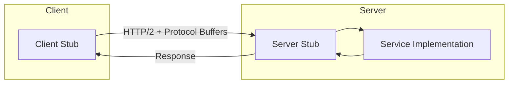
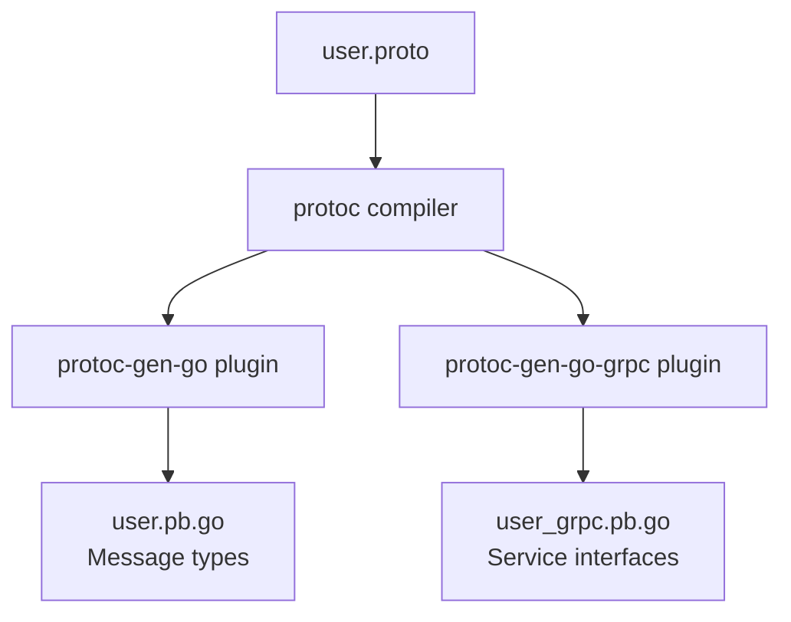
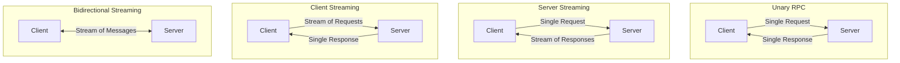
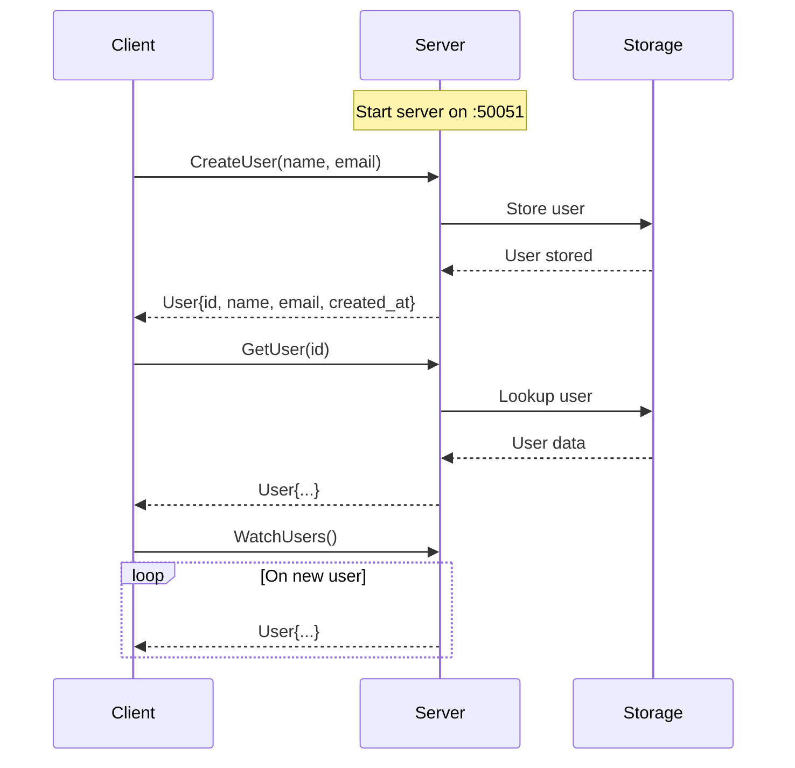

# How to Build gRPC Services from Scratch

Author: [nawazdhandala](https://www.github.com/nawazdhandala)

Tags: gRPC, Microservices, API Development, Protocol Buffers, Backend Development

Description: A step-by-step guide to building gRPC services from scratch, covering protocol buffers, service definitions, and client-server implementation.

---

> gRPC enables high-performance communication between services using Protocol Buffers for serialization. This guide walks through building a complete gRPC service from the ground up with practical examples.

Building APIs with REST works well for many use cases, but gRPC offers significant advantages for service-to-service communication: strongly typed contracts, efficient binary serialization, and built-in streaming support.

---

## What is gRPC?

gRPC is a Remote Procedure Call (RPC) framework developed by Google. It uses HTTP/2 for transport, Protocol Buffers for message serialization, and provides features like bidirectional streaming, flow control, and authentication.



---

## Project Structure

Before diving into code, here is the project structure we will build:

```
grpc-service/
├── proto/
│   └── user.proto          # Service and message definitions
├── server/
│   ├── main.go             # Server entry point
│   └── user_service.go     # Service implementation
├── client/
│   └── main.go             # Client entry point
├── generated/
│   └── user/               # Generated code (auto-created)
├── go.mod
└── go.sum
```

---

## Step 1: Define the Protocol Buffer Schema

Protocol Buffers (protobuf) define the structure of your messages and services. Create a file called `user.proto` in the `proto` directory:

```protobuf
// proto/user.proto
// Protocol Buffers version 3 syntax
syntax = "proto3";

// Package name for generated Go code
package user;

// Go package path for generated files
option go_package = "grpc-service/generated/user";

// User message represents a user entity in the system
// Each field has a unique number used for binary encoding
message User {
  // Unique identifier for the user
  int64 id = 1;

  // User's display name
  string name = 2;

  // User's email address
  string email = 3;

  // Unix timestamp of when the user was created
  int64 created_at = 4;
}

// Request message for GetUser RPC
message GetUserRequest {
  // ID of the user to retrieve
  int64 id = 1;
}

// Request message for CreateUser RPC
message CreateUserRequest {
  // Name for the new user
  string name = 1;

  // Email for the new user
  string email = 2;
}

// Request message for ListUsers RPC
message ListUsersRequest {
  // Maximum number of users to return (default: 10)
  int32 page_size = 1;

  // Token for pagination (empty for first page)
  string page_token = 2;
}

// Response message for ListUsers RPC
message ListUsersResponse {
  // List of users matching the request
  repeated User users = 1;

  // Token for fetching the next page (empty if no more results)
  string next_page_token = 2;
}

// UserService defines the RPC methods for user management
service UserService {
  // GetUser retrieves a single user by ID
  rpc GetUser(GetUserRequest) returns (User);

  // CreateUser creates a new user and returns the created entity
  rpc CreateUser(CreateUserRequest) returns (User);

  // ListUsers returns a paginated list of users
  rpc ListUsers(ListUsersRequest) returns (ListUsersResponse);

  // WatchUsers streams user updates in real-time (server streaming)
  rpc WatchUsers(ListUsersRequest) returns (stream User);
}
```

---

## Step 2: Generate Code from Proto Files

Install the Protocol Buffer compiler and Go plugins:

```bash
# Install protoc (Protocol Buffer compiler)
# On macOS:
brew install protobuf

# On Ubuntu/Debian:
apt-get install -y protobuf-compiler

# Install Go plugins for protoc
go install google.golang.org/protobuf/cmd/protoc-gen-go@latest
go install google.golang.org/grpc/cmd/protoc-gen-go-grpc@latest

# Add Go bin to PATH (add to your shell profile)
export PATH="$PATH:$(go env GOPATH)/bin"
```

Generate the Go code:

```bash
# Create output directory
mkdir -p generated/user

# Generate Go code from proto file
protoc --go_out=. --go_opt=paths=source_relative \
       --go-grpc_out=. --go-grpc_opt=paths=source_relative \
       proto/user.proto
```

The code generation flow:



---

## Step 3: Initialize the Go Module

```bash
# Initialize Go module
go mod init grpc-service

# Download dependencies
go get google.golang.org/grpc
go get google.golang.org/protobuf
```

---

## Step 4: Implement the Server

Create the service implementation in `server/user_service.go`:

```go
// server/user_service.go
package main

import (
	"context"
	"errors"
	"sync"
	"time"

	pb "grpc-service/generated/user"

	"google.golang.org/grpc/codes"
	"google.golang.org/grpc/status"
)

// userServer implements the UserServiceServer interface generated by protoc.
// It stores users in memory for this example. In production, you would
// replace this with a database.
type userServer struct {
	// Embed the unimplemented server to ensure forward compatibility.
	// This allows your service to compile even if new methods are added
	// to the proto definition in the future.
	pb.UnimplementedUserServiceServer

	// mu protects concurrent access to the users map
	mu sync.RWMutex

	// users stores all users indexed by their ID
	users map[int64]*pb.User

	// nextID is an auto-incrementing counter for user IDs
	nextID int64

	// subscribers holds channels for clients watching user updates
	subscribers []chan *pb.User
}

// newUserServer creates a new userServer with initialized fields.
func newUserServer() *userServer {
	return &userServer{
		users:  make(map[int64]*pb.User),
		nextID: 1,
	}
}

// GetUser retrieves a user by ID. It returns a NotFound error if the user
// does not exist.
func (s *userServer) GetUser(ctx context.Context, req *pb.GetUserRequest) (*pb.User, error) {
	// Validate the request
	if req.Id <= 0 {
		return nil, status.Error(codes.InvalidArgument, "user ID must be positive")
	}

	// Acquire read lock for thread-safe access
	s.mu.RLock()
	defer s.mu.RUnlock()

	// Look up the user in our in-memory store
	user, exists := s.users[req.Id]
	if !exists {
		// Return a gRPC status error with NotFound code
		// This allows clients to handle specific error types
		return nil, status.Errorf(codes.NotFound, "user with ID %d not found", req.Id)
	}

	return user, nil
}

// CreateUser creates a new user with the provided name and email.
// It assigns an auto-generated ID and creation timestamp.
func (s *userServer) CreateUser(ctx context.Context, req *pb.CreateUserRequest) (*pb.User, error) {
	// Validate required fields
	if req.Name == "" {
		return nil, status.Error(codes.InvalidArgument, "name is required")
	}
	if req.Email == "" {
		return nil, status.Error(codes.InvalidArgument, "email is required")
	}

	// Acquire write lock for thread-safe modification
	s.mu.Lock()
	defer s.mu.Unlock()

	// Create the new user with auto-generated ID
	user := &pb.User{
		Id:        s.nextID,
		Name:      req.Name,
		Email:     req.Email,
		CreatedAt: time.Now().Unix(),
	}

	// Store the user and increment the ID counter
	s.users[user.Id] = user
	s.nextID++

	// Notify all subscribers about the new user
	// This enables real-time updates for WatchUsers clients
	s.notifySubscribers(user)

	return user, nil
}

// ListUsers returns a paginated list of users.
func (s *userServer) ListUsers(ctx context.Context, req *pb.ListUsersRequest) (*pb.ListUsersResponse, error) {
	s.mu.RLock()
	defer s.mu.RUnlock()

	// Set default page size if not specified
	pageSize := req.PageSize
	if pageSize <= 0 {
		pageSize = 10
	}

	// Collect all users into a slice for pagination
	// In production, you would use database-level pagination
	var allUsers []*pb.User
	for _, user := range s.users {
		allUsers = append(allUsers, user)
	}

	// Simple pagination: return up to pageSize users
	// A real implementation would use the page_token for cursor-based pagination
	end := int(pageSize)
	if end > len(allUsers) {
		end = len(allUsers)
	}

	return &pb.ListUsersResponse{
		Users:         allUsers[:end],
		NextPageToken: "", // Simplified: no pagination token in this example
	}, nil
}

// WatchUsers implements server-side streaming. It sends user updates
// to the client as they occur in real-time.
func (s *userServer) WatchUsers(req *pb.ListUsersRequest, stream pb.UserService_WatchUsersServer) error {
	// Create a channel to receive user updates
	updates := make(chan *pb.User, 10)

	// Register this channel as a subscriber
	s.mu.Lock()
	s.subscribers = append(s.subscribers, updates)
	s.mu.Unlock()

	// Clean up when the stream ends
	defer func() {
		s.mu.Lock()
		// Remove this channel from subscribers
		for i, ch := range s.subscribers {
			if ch == updates {
				s.subscribers = append(s.subscribers[:i], s.subscribers[i+1:]...)
				break
			}
		}
		s.mu.Unlock()
		close(updates)
	}()

	// Stream updates to the client until they disconnect
	for {
		select {
		case user := <-updates:
			// Send the user update to the client
			if err := stream.Send(user); err != nil {
				return err
			}
		case <-stream.Context().Done():
			// Client disconnected or context cancelled
			return stream.Context().Err()
		}
	}
}

// notifySubscribers sends a user update to all active subscribers.
// This is called when a new user is created.
func (s *userServer) notifySubscribers(user *pb.User) {
	for _, ch := range s.subscribers {
		// Non-blocking send to avoid slow subscribers blocking others
		select {
		case ch <- user:
		default:
			// Channel full, skip this subscriber
		}
	}
}
```

---

## Step 5: Create the Server Entry Point

Create `server/main.go`:

```go
// server/main.go
package main

import (
	"flag"
	"fmt"
	"log"
	"net"

	pb "grpc-service/generated/user"

	"google.golang.org/grpc"
	"google.golang.org/grpc/reflection"
)

func main() {
	// Parse command-line flags
	port := flag.Int("port", 50051, "The server port")
	flag.Parse()

	// Create a TCP listener on the specified port
	address := fmt.Sprintf(":%d", *port)
	listener, err := net.Listen("tcp", address)
	if err != nil {
		log.Fatalf("Failed to listen on %s: %v", address, err)
	}

	// Create a new gRPC server instance
	// You can add interceptors here for logging, authentication, etc.
	grpcServer := grpc.NewServer(
		// Example: Add a unary interceptor for logging
		// grpc.UnaryInterceptor(loggingInterceptor),
	)

	// Register our UserService implementation with the gRPC server
	userService := newUserServer()
	pb.RegisterUserServiceServer(grpcServer, userService)

	// Enable server reflection for debugging tools like grpcurl
	// This allows clients to discover available services and methods
	reflection.Register(grpcServer)

	log.Printf("gRPC server listening on %s", address)

	// Start serving requests. This blocks until the server is stopped.
	if err := grpcServer.Serve(listener); err != nil {
		log.Fatalf("Failed to serve: %v", err)
	}
}
```

---

## Step 6: Implement the Client

Create `client/main.go`:

```go
// client/main.go
package main

import (
	"context"
	"flag"
	"io"
	"log"
	"time"

	pb "grpc-service/generated/user"

	"google.golang.org/grpc"
	"google.golang.org/grpc/credentials/insecure"
)

func main() {
	// Parse command-line flags for server address
	serverAddr := flag.String("server", "localhost:50051", "The server address")
	flag.Parse()

	// Establish a connection to the gRPC server
	// Using insecure credentials for local development only
	// In production, use TLS credentials
	conn, err := grpc.Dial(
		*serverAddr,
		grpc.WithTransportCredentials(insecure.NewCredentials()),
	)
	if err != nil {
		log.Fatalf("Failed to connect to server: %v", err)
	}
	defer conn.Close()

	// Create a client stub from the connection
	client := pb.NewUserServiceClient(conn)

	// Create a context with timeout for RPC calls
	ctx, cancel := context.WithTimeout(context.Background(), 10*time.Second)
	defer cancel()

	// Example 1: Create a new user
	log.Println("Creating a new user...")
	newUser, err := client.CreateUser(ctx, &pb.CreateUserRequest{
		Name:  "Alice Smith",
		Email: "alice@example.com",
	})
	if err != nil {
		log.Fatalf("CreateUser failed: %v", err)
	}
	log.Printf("Created user: ID=%d, Name=%s, Email=%s",
		newUser.Id, newUser.Name, newUser.Email)

	// Example 2: Retrieve the user we just created
	log.Println("Fetching user by ID...")
	fetchedUser, err := client.GetUser(ctx, &pb.GetUserRequest{
		Id: newUser.Id,
	})
	if err != nil {
		log.Fatalf("GetUser failed: %v", err)
	}
	log.Printf("Fetched user: ID=%d, Name=%s, Email=%s",
		fetchedUser.Id, fetchedUser.Name, fetchedUser.Email)

	// Example 3: List all users
	log.Println("Listing all users...")
	listResp, err := client.ListUsers(ctx, &pb.ListUsersRequest{
		PageSize: 10,
	})
	if err != nil {
		log.Fatalf("ListUsers failed: %v", err)
	}
	log.Printf("Found %d users:", len(listResp.Users))
	for _, user := range listResp.Users {
		log.Printf("  - ID=%d, Name=%s, Email=%s", user.Id, user.Name, user.Email)
	}

	// Example 4: Watch for new users (streaming)
	log.Println("Watching for new users (will timeout after 5 seconds)...")
	watchCtx, watchCancel := context.WithTimeout(context.Background(), 5*time.Second)
	defer watchCancel()

	stream, err := client.WatchUsers(watchCtx, &pb.ListUsersRequest{})
	if err != nil {
		log.Fatalf("WatchUsers failed: %v", err)
	}

	// Receive streamed user updates
	for {
		user, err := stream.Recv()
		if err == io.EOF {
			log.Println("Stream ended")
			break
		}
		if err != nil {
			// Context deadline exceeded is expected after timeout
			log.Printf("Stream error (expected after timeout): %v", err)
			break
		}
		log.Printf("Received user update: ID=%d, Name=%s", user.Id, user.Name)
	}

	log.Println("Client finished")
}
```

---

## gRPC Communication Patterns

gRPC supports four communication patterns:



| Pattern | Use Case | Example |
|---------|----------|---------|
| Unary | Simple request/response | GetUser, CreateUser |
| Server Streaming | Real-time updates | WatchUsers, live feeds |
| Client Streaming | Bulk uploads | File uploads, batch processing |
| Bidirectional | Chat, gaming | Real-time collaboration |

---

## Step 7: Add Interceptors for Cross-Cutting Concerns

Interceptors allow you to add logging, authentication, and other cross-cutting concerns:

```go
// interceptors/logging.go
package main

import (
	"context"
	"log"
	"time"

	"google.golang.org/grpc"
	"google.golang.org/grpc/status"
)

// loggingInterceptor logs information about each RPC call including
// the method name, duration, and any errors that occurred.
func loggingInterceptor(
	ctx context.Context,
	req interface{},
	info *grpc.UnaryServerInfo,
	handler grpc.UnaryHandler,
) (interface{}, error) {
	// Record the start time
	start := time.Now()

	// Call the actual RPC handler
	resp, err := handler(ctx, req)

	// Calculate the duration
	duration := time.Since(start)

	// Extract the gRPC status code
	code := status.Code(err)

	// Log the RPC call details
	log.Printf("RPC: method=%s duration=%s status=%s error=%v",
		info.FullMethod,
		duration,
		code.String(),
		err,
	)

	return resp, err
}

// authInterceptor validates authentication tokens on incoming requests.
// It extracts the token from metadata and validates it before allowing
// the request to proceed.
func authInterceptor(
	ctx context.Context,
	req interface{},
	info *grpc.UnaryServerInfo,
	handler grpc.UnaryHandler,
) (interface{}, error) {
	// Skip auth for health check endpoints
	if info.FullMethod == "/grpc.health.v1.Health/Check" {
		return handler(ctx, req)
	}

	// Extract metadata from context
	// md, ok := metadata.FromIncomingContext(ctx)
	// if !ok {
	//     return nil, status.Error(codes.Unauthenticated, "missing metadata")
	// }

	// Validate the authorization token
	// tokens := md.Get("authorization")
	// if len(tokens) == 0 {
	//     return nil, status.Error(codes.Unauthenticated, "missing token")
	// }
	// if !validateToken(tokens[0]) {
	//     return nil, status.Error(codes.Unauthenticated, "invalid token")
	// }

	return handler(ctx, req)
}

// chainInterceptors combines multiple interceptors into a single interceptor.
// Interceptors are executed in the order they are provided.
func chainInterceptors(interceptors ...grpc.UnaryServerInterceptor) grpc.UnaryServerInterceptor {
	return func(
		ctx context.Context,
		req interface{},
		info *grpc.UnaryServerInfo,
		handler grpc.UnaryHandler,
	) (interface{}, error) {
		// Build the chain from the end
		chain := handler
		for i := len(interceptors) - 1; i >= 0; i-- {
			interceptor := interceptors[i]
			next := chain
			chain = func(ctx context.Context, req interface{}) (interface{}, error) {
				return interceptor(ctx, req, info, next)
			}
		}
		return chain(ctx, req)
	}
}
```

To use multiple interceptors, update your server:

```go
// Create server with chained interceptors
grpcServer := grpc.NewServer(
	grpc.ChainUnaryInterceptor(
		loggingInterceptor,
		authInterceptor,
	),
)
```

---

## Step 8: Error Handling

gRPC uses status codes for error handling. Here are the common codes and when to use them:

```go
// errors/errors.go
package main

import (
	"google.golang.org/grpc/codes"
	"google.golang.org/grpc/status"
)

// Common error types for the user service

// ErrUserNotFound returns a NotFound status error
func ErrUserNotFound(id int64) error {
	return status.Errorf(codes.NotFound, "user %d not found", id)
}

// ErrInvalidArgument returns an InvalidArgument status error
func ErrInvalidArgument(msg string) error {
	return status.Error(codes.InvalidArgument, msg)
}

// ErrAlreadyExists returns an AlreadyExists status error
func ErrAlreadyExists(email string) error {
	return status.Errorf(codes.AlreadyExists, "user with email %s already exists", email)
}

// ErrInternal returns an Internal status error for unexpected failures
func ErrInternal(msg string) error {
	return status.Error(codes.Internal, msg)
}

// ErrUnavailable returns an Unavailable status error for temporary failures
func ErrUnavailable(msg string) error {
	return status.Error(codes.Unavailable, msg)
}
```

| Status Code | When to Use |
|-------------|-------------|
| OK | Success |
| InvalidArgument | Bad input from client |
| NotFound | Resource does not exist |
| AlreadyExists | Resource already exists (e.g., duplicate email) |
| PermissionDenied | Authorization failed |
| Unauthenticated | Authentication failed |
| Internal | Unexpected server error |
| Unavailable | Service temporarily unavailable |

---

## Running the Service



Start the server:

```bash
# Run the server
go run server/*.go

# Output:
# gRPC server listening on :50051
```

In a separate terminal, run the client:

```bash
# Run the client
go run client/main.go

# Output:
# Creating a new user...
# Created user: ID=1, Name=Alice Smith, Email=alice@example.com
# Fetching user by ID...
# Fetched user: ID=1, Name=Alice Smith, Email=alice@example.com
# Listing all users...
# Found 1 users:
#   - ID=1, Name=Alice Smith, Email=alice@example.com
# Watching for new users (will timeout after 5 seconds)...
# Stream error (expected after timeout): context deadline exceeded
# Client finished
```

---

## Testing with grpcurl

`grpcurl` is a command-line tool for interacting with gRPC servers:

```bash
# Install grpcurl
brew install grpcurl  # macOS
# or
go install github.com/fullstorydev/grpcurl/cmd/grpcurl@latest

# List available services (requires reflection enabled)
grpcurl -plaintext localhost:50051 list

# Output:
# grpc.reflection.v1alpha.ServerReflection
# user.UserService

# Describe the UserService
grpcurl -plaintext localhost:50051 describe user.UserService

# Create a user
grpcurl -plaintext -d '{"name": "Bob", "email": "bob@example.com"}' \
    localhost:50051 user.UserService/CreateUser

# Get a user
grpcurl -plaintext -d '{"id": 1}' \
    localhost:50051 user.UserService/GetUser

# List users
grpcurl -plaintext -d '{"page_size": 10}' \
    localhost:50051 user.UserService/ListUsers
```

---

## Production Considerations

When deploying gRPC services to production, consider these aspects:

### TLS Configuration

```go
// Load TLS credentials
creds, err := credentials.NewServerTLSFromFile("server.crt", "server.key")
if err != nil {
    log.Fatalf("Failed to load TLS credentials: %v", err)
}

// Create server with TLS
grpcServer := grpc.NewServer(grpc.Creds(creds))
```

### Health Checks

```go
import "google.golang.org/grpc/health/grpc_health_v1"
import "google.golang.org/grpc/health"

// Register health service
healthServer := health.NewServer()
grpc_health_v1.RegisterHealthServer(grpcServer, healthServer)

// Set service status
healthServer.SetServingStatus("user.UserService", grpc_health_v1.HealthCheckResponse_SERVING)
```

### Graceful Shutdown

```go
// Handle shutdown signals
sigCh := make(chan os.Signal, 1)
signal.Notify(sigCh, syscall.SIGINT, syscall.SIGTERM)

go func() {
    <-sigCh
    log.Println("Shutting down gracefully...")
    grpcServer.GracefulStop()
}()
```

---

## Summary

Building gRPC services from scratch involves these key steps:

1. Define your service contract using Protocol Buffers
2. Generate code using the protoc compiler with language-specific plugins
3. Implement the server by embedding the unimplemented server interface
4. Create clients using the generated stub code
5. Add interceptors for logging, authentication, and other cross-cutting concerns
6. Handle errors using gRPC status codes
7. Enable health checks and graceful shutdown for production readiness

gRPC provides a robust foundation for building high-performance microservices with strongly typed contracts and efficient binary serialization. The generated code ensures type safety across service boundaries, while features like streaming enable real-time communication patterns that are difficult to achieve with REST APIs.
