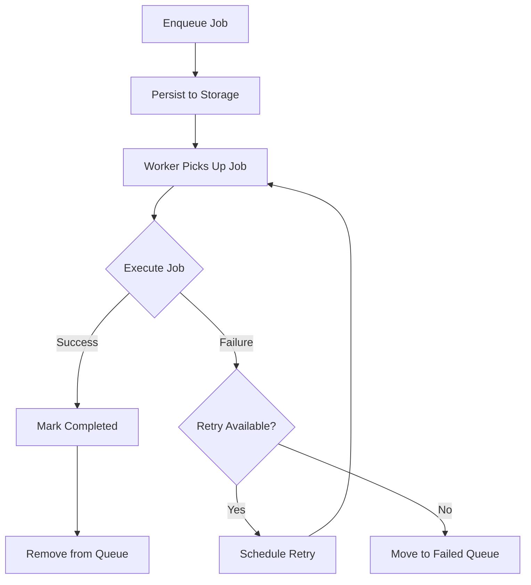

# How to Build a Task Scheduler with Hangfire in .NET

Author: [nawazdhandala](https://www.github.com/nawazdhandala)

Tags: .NET, C#, Hangfire, Background Jobs, Task Scheduling, ASP.NET Core

Description: Learn how to implement reliable background job processing and task scheduling in .NET using Hangfire. This guide covers fire-and-forget jobs, scheduled tasks, recurring jobs, and production best practices.

---

Background jobs are essential for handling tasks that should not block HTTP requests: sending emails, processing files, generating reports, or syncing data with external services. Hangfire provides a robust solution for background job processing in .NET, with built-in persistence, retries, and a dashboard for monitoring.

## Why Hangfire?

Hangfire stands out from other background job libraries because:

- **Persistence**: Jobs survive application restarts
- **Automatic retries**: Failed jobs retry with exponential backoff
- **Dashboard**: Visual monitoring and management of jobs
- **Multiple storage backends**: SQL Server, PostgreSQL, Redis, and more
- **Job continuations**: Chain jobs together
- **Batches**: Group related jobs (Pro feature)

## Getting Started

Install the required packages:

```bash
dotnet add package Hangfire.Core
dotnet add package Hangfire.AspNetCore
dotnet add package Hangfire.SqlServer  # Or your preferred storage
```

Configure Hangfire in `Program.cs`:

```csharp
var builder = WebApplication.CreateBuilder(args);

// Add Hangfire services
builder.Services.AddHangfire(config => config
    .SetDataCompatibilityLevel(CompatibilityLevel.Version_180)
    .UseSimpleAssemblyNameTypeSerializer()
    .UseRecommendedSerializerSettings()
    .UseSqlServerStorage(
        builder.Configuration.GetConnectionString("HangfireConnection"),
        new SqlServerStorageOptions
        {
            CommandBatchMaxTimeout = TimeSpan.FromMinutes(5),
            SlidingInvisibilityTimeout = TimeSpan.FromMinutes(5),
            QueuePollInterval = TimeSpan.Zero,
            UseRecommendedIsolationLevel = true,
            DisableGlobalLocks = true
        }));

// Add the processing server
builder.Services.AddHangfireServer(options =>
{
    options.WorkerCount = Environment.ProcessorCount * 2;
    options.Queues = new[] { "critical", "default", "low" };
});

var app = builder.Build();

// Enable the dashboard (protect in production!)
app.UseHangfireDashboard("/hangfire", new DashboardOptions
{
    Authorization = new[] { new HangfireAuthorizationFilter() }
});

app.Run();
```

Create an authorization filter for the dashboard:

```csharp
public class HangfireAuthorizationFilter : IDashboardAuthorizationFilter
{
    public bool Authorize(DashboardContext context)
    {
        var httpContext = context.GetHttpContext();

        // In production, check for admin role or specific claim
        return httpContext.User.Identity?.IsAuthenticated == true
            && httpContext.User.IsInRole("Admin");
    }
}
```

## Fire-and-Forget Jobs

The simplest job type executes once immediately:

```csharp
// Services/EmailService.cs
public interface IEmailService
{
    Task SendWelcomeEmailAsync(string userId);
    Task SendPasswordResetEmailAsync(string email, string resetToken);
    Task SendOrderConfirmationAsync(string orderId);
}

public class EmailService : IEmailService
{
    private readonly ISmtpClient _smtpClient;
    private readonly IUserRepository _userRepository;
    private readonly ILogger<EmailService> _logger;

    public EmailService(
        ISmtpClient smtpClient,
        IUserRepository userRepository,
        ILogger<EmailService> logger)
    {
        _smtpClient = smtpClient;
        _userRepository = userRepository;
        _logger = logger;
    }

    public async Task SendWelcomeEmailAsync(string userId)
    {
        var user = await _userRepository.GetByIdAsync(userId);
        if (user == null)
        {
            _logger.LogWarning("User {UserId} not found for welcome email", userId);
            return;
        }

        _logger.LogInformation("Sending welcome email to {Email}", user.Email);

        await _smtpClient.SendAsync(new EmailMessage
        {
            To = user.Email,
            Subject = "Welcome to Our Platform!",
            Body = $"Hello {user.Name}, welcome aboard!"
        });
    }

    public async Task SendPasswordResetEmailAsync(string email, string resetToken)
    {
        _logger.LogInformation("Sending password reset email to {Email}", email);

        await _smtpClient.SendAsync(new EmailMessage
        {
            To = email,
            Subject = "Password Reset Request",
            Body = $"Click here to reset your password: https://example.com/reset?token={resetToken}"
        });
    }

    public async Task SendOrderConfirmationAsync(string orderId)
    {
        // Implementation here
        _logger.LogInformation("Sending order confirmation for {OrderId}", orderId);
    }
}
```

Enqueue jobs from controllers or services:

```csharp
[ApiController]
[Route("api/[controller]")]
public class UsersController : ControllerBase
{
    private readonly IUserService _userService;
    private readonly IBackgroundJobClient _backgroundJobs;

    public UsersController(IUserService userService, IBackgroundJobClient backgroundJobs)
    {
        _userService = userService;
        _backgroundJobs = backgroundJobs;
    }

    [HttpPost]
    public async Task<IActionResult> CreateUser([FromBody] CreateUserRequest request)
    {
        var user = await _userService.CreateAsync(request);

        // Enqueue email to be sent in background
        // Job will be persisted and processed even if the app restarts
        _backgroundJobs.Enqueue<IEmailService>(
            x => x.SendWelcomeEmailAsync(user.Id));

        return CreatedAtAction(nameof(GetUser), new { id = user.Id }, user);
    }
}
```

## Delayed Jobs

Schedule jobs to run at a specific time:

```csharp
public class OrderService
{
    private readonly IBackgroundJobClient _backgroundJobs;
    private readonly IOrderRepository _repository;

    public OrderService(IBackgroundJobClient backgroundJobs, IOrderRepository repository)
    {
        _backgroundJobs = backgroundJobs;
        _repository = repository;
    }

    public async Task<Order> CreateOrderAsync(CreateOrderRequest request)
    {
        var order = await _repository.CreateAsync(request);

        // Send reminder if payment not completed in 30 minutes
        _backgroundJobs.Schedule<IOrderService>(
            x => x.SendPaymentReminderAsync(order.Id),
            TimeSpan.FromMinutes(30));

        // Auto-cancel unpaid orders after 24 hours
        _backgroundJobs.Schedule<IOrderService>(
            x => x.CancelIfUnpaidAsync(order.Id),
            TimeSpan.FromHours(24));

        return order;
    }

    public async Task SendPaymentReminderAsync(string orderId)
    {
        var order = await _repository.GetByIdAsync(orderId);

        if (order == null || order.Status != OrderStatus.PendingPayment)
            return;

        // Send reminder email
        await _emailService.SendPaymentReminderAsync(order);
    }

    public async Task CancelIfUnpaidAsync(string orderId)
    {
        var order = await _repository.GetByIdAsync(orderId);

        if (order == null || order.Status != OrderStatus.PendingPayment)
            return;

        order.Status = OrderStatus.Cancelled;
        order.CancelledReason = "Payment not received within 24 hours";
        await _repository.UpdateAsync(order);
    }
}
```

## Recurring Jobs

Set up jobs that run on a schedule using cron expressions:

```csharp
// Services/MaintenanceService.cs
public interface IMaintenanceService
{
    Task CleanupExpiredSessionsAsync();
    Task GenerateDailyReportAsync();
    Task SyncInventoryAsync();
    Task SendWeeklyDigestAsync();
}

public class MaintenanceService : IMaintenanceService
{
    private readonly ILogger<MaintenanceService> _logger;
    private readonly ISessionRepository _sessionRepository;
    private readonly IReportGenerator _reportGenerator;

    public MaintenanceService(
        ILogger<MaintenanceService> logger,
        ISessionRepository sessionRepository,
        IReportGenerator reportGenerator)
    {
        _logger = logger;
        _sessionRepository = sessionRepository;
        _reportGenerator = reportGenerator;
    }

    public async Task CleanupExpiredSessionsAsync()
    {
        _logger.LogInformation("Starting session cleanup");

        var cutoff = DateTime.UtcNow.AddDays(-7);
        var deleted = await _sessionRepository.DeleteExpiredAsync(cutoff);

        _logger.LogInformation("Cleaned up {Count} expired sessions", deleted);
    }

    public async Task GenerateDailyReportAsync()
    {
        _logger.LogInformation("Generating daily report");

        var report = await _reportGenerator.GenerateDailyAsync(DateTime.UtcNow.AddDays(-1));

        // Store report or send via email
        _logger.LogInformation("Daily report generated: {ReportId}", report.Id);
    }

    public async Task SyncInventoryAsync()
    {
        _logger.LogInformation("Starting inventory sync");
        // Sync with external inventory system
    }

    public async Task SendWeeklyDigestAsync()
    {
        _logger.LogInformation("Sending weekly digest emails");
        // Send digest to all subscribers
    }
}
```

Register recurring jobs at startup:

```csharp
// Program.cs or a separate configuration class
public static class HangfireJobsConfig
{
    public static void ConfigureRecurringJobs()
    {
        var manager = new RecurringJobManager();

        // Every hour at minute 0
        manager.AddOrUpdate<IMaintenanceService>(
            "cleanup-sessions",
            x => x.CleanupExpiredSessionsAsync(),
            Cron.Hourly());

        // Every day at 2 AM UTC
        manager.AddOrUpdate<IMaintenanceService>(
            "daily-report",
            x => x.GenerateDailyReportAsync(),
            "0 2 * * *",
            new RecurringJobOptions { TimeZone = TimeZoneInfo.Utc });

        // Every 15 minutes
        manager.AddOrUpdate<IMaintenanceService>(
            "sync-inventory",
            x => x.SyncInventoryAsync(),
            "*/15 * * * *");

        // Every Monday at 9 AM Eastern
        manager.AddOrUpdate<IMaintenanceService>(
            "weekly-digest",
            x => x.SendWeeklyDigestAsync(),
            "0 9 * * 1",
            new RecurringJobOptions
            {
                TimeZone = TimeZoneInfo.FindSystemTimeZoneById("Eastern Standard Time")
            });
    }
}

// In Program.cs, after app.Build()
HangfireJobsConfig.ConfigureRecurringJobs();
```

## Job Continuations

Chain jobs together so one runs after another completes:

```csharp
public class ReportingService
{
    private readonly IBackgroundJobClient _backgroundJobs;

    public ReportingService(IBackgroundJobClient backgroundJobs)
    {
        _backgroundJobs = backgroundJobs;
    }

    public string StartMonthlyReportPipeline(int year, int month)
    {
        // Step 1: Gather data
        var gatherJobId = _backgroundJobs.Enqueue<IReportingService>(
            x => x.GatherMonthlyDataAsync(year, month));

        // Step 2: Generate report (after data is gathered)
        var generateJobId = _backgroundJobs.ContinueJobWith<IReportingService>(
            gatherJobId,
            x => x.GenerateReportAsync(year, month));

        // Step 3: Send report (after generation)
        var sendJobId = _backgroundJobs.ContinueJobWith<IReportingService>(
            generateJobId,
            x => x.SendReportToStakeholdersAsync(year, month));

        // Step 4: Archive (after sending)
        _backgroundJobs.ContinueJobWith<IReportingService>(
            sendJobId,
            x => x.ArchiveReportAsync(year, month));

        return gatherJobId;  // Return root job ID for tracking
    }

    public async Task GatherMonthlyDataAsync(int year, int month)
    {
        // Gather data from various sources
    }

    public async Task GenerateReportAsync(int year, int month)
    {
        // Generate PDF or Excel report
    }

    public async Task SendReportToStakeholdersAsync(int year, int month)
    {
        // Email report to stakeholders
    }

    public async Task ArchiveReportAsync(int year, int month)
    {
        // Move to cold storage
    }
}
```

## Custom Job Filters

Add cross-cutting concerns like logging and metrics:

```csharp
public class JobLoggingFilter : JobFilterAttribute, IServerFilter
{
    private readonly ILogger<JobLoggingFilter> _logger;

    public JobLoggingFilter(ILogger<JobLoggingFilter> logger)
    {
        _logger = logger;
    }

    public void OnPerforming(PerformingContext context)
    {
        _logger.LogInformation(
            "Starting job {JobId} ({JobType})",
            context.BackgroundJob.Id,
            context.BackgroundJob.Job.Type.Name);
    }

    public void OnPerformed(PerformedContext context)
    {
        if (context.Exception != null)
        {
            _logger.LogError(
                context.Exception,
                "Job {JobId} failed",
                context.BackgroundJob.Id);
        }
        else
        {
            _logger.LogInformation(
                "Job {JobId} completed successfully",
                context.BackgroundJob.Id);
        }
    }
}

// Apply globally in configuration
builder.Services.AddHangfire(config => config
    .UseFilter(new JobLoggingFilter(loggerFactory.CreateLogger<JobLoggingFilter>()))
    // ... other config
);
```

## Retry Configuration

Configure retry behavior for specific jobs:

```csharp
public class ExternalApiService
{
    private readonly HttpClient _httpClient;

    public ExternalApiService(HttpClient httpClient)
    {
        _httpClient = httpClient;
    }

    // Retry up to 10 times with exponential backoff
    [AutomaticRetry(Attempts = 10, DelaysInSeconds = new[] { 10, 30, 60, 120, 300 })]
    public async Task SyncWithExternalApiAsync(string entityId)
    {
        var response = await _httpClient.PostAsync(
            $"/api/sync/{entityId}",
            new StringContent("{}"));

        response.EnsureSuccessStatusCode();
    }

    // No retries for this job
    [AutomaticRetry(Attempts = 0)]
    public async Task SendOneTimeNotificationAsync(string userId, string message)
    {
        // If this fails, don't retry (notification is time-sensitive)
    }

    // Custom retry logic
    [AutomaticRetry(Attempts = 5, OnAttemptsExceeded = AttemptsExceededAction.Delete)]
    public async Task ProcessWebhookAsync(string webhookId)
    {
        // After 5 failures, delete the job instead of moving to failed queue
    }
}
```

## Queue Priority

Use queues to prioritize jobs:

```csharp
public class NotificationService
{
    private readonly IBackgroundJobClient _backgroundJobs;

    public NotificationService(IBackgroundJobClient backgroundJobs)
    {
        _backgroundJobs = backgroundJobs;
    }

    public void SendCriticalAlert(string message)
    {
        // High priority - processed first
        _backgroundJobs.Enqueue<INotificationService>(
            x => x.SendAlertAsync(message),
            new EnqueuedState("critical"));
    }

    public void SendMarketingEmail(string userId)
    {
        // Low priority - processed when critical and default queues are empty
        _backgroundJobs.Enqueue<INotificationService>(
            x => x.SendMarketingEmailAsync(userId),
            new EnqueuedState("low"));
    }
}
```

## Monitoring Job Status

Track job progress and status:

```csharp
[ApiController]
[Route("api/[controller]")]
public class JobsController : ControllerBase
{
    private readonly IBackgroundJobClient _backgroundJobs;

    public JobsController(IBackgroundJobClient backgroundJobs)
    {
        _backgroundJobs = backgroundJobs;
    }

    [HttpGet("{jobId}/status")]
    public IActionResult GetJobStatus(string jobId)
    {
        var connection = JobStorage.Current.GetConnection();
        var jobData = connection.GetJobData(jobId);

        if (jobData == null)
        {
            return NotFound(new { Error = "Job not found" });
        }

        return Ok(new
        {
            JobId = jobId,
            State = jobData.State,
            CreatedAt = jobData.CreatedAt,
            Job = jobData.Job?.Type.Name
        });
    }

    [HttpDelete("{jobId}")]
    public IActionResult CancelJob(string jobId)
    {
        var deleted = _backgroundJobs.Delete(jobId);

        if (!deleted)
        {
            return NotFound(new { Error = "Job not found or already completed" });
        }

        return Ok(new { Message = "Job cancelled" });
    }
}
```

## Job Execution Flow



## Summary

Hangfire provides a complete solution for background job processing in .NET:

| Job Type | Use Case | Example |
|----------|----------|---------|
| **Fire-and-forget** | Immediate async processing | Sending emails |
| **Delayed** | Execute at specific time | Payment reminders |
| **Recurring** | Scheduled tasks | Daily reports, cleanup |
| **Continuations** | Job pipelines | Multi-step workflows |

Key best practices:
- Always make jobs idempotent (safe to run multiple times)
- Use appropriate retry settings for different job types
- Monitor the dashboard and set up alerts for failed jobs
- Use queues to prioritize critical jobs
- Keep job arguments serializable and small

With Hangfire, you can offload time-consuming tasks from your request pipeline, ensuring your API stays responsive while background work happens reliably.
