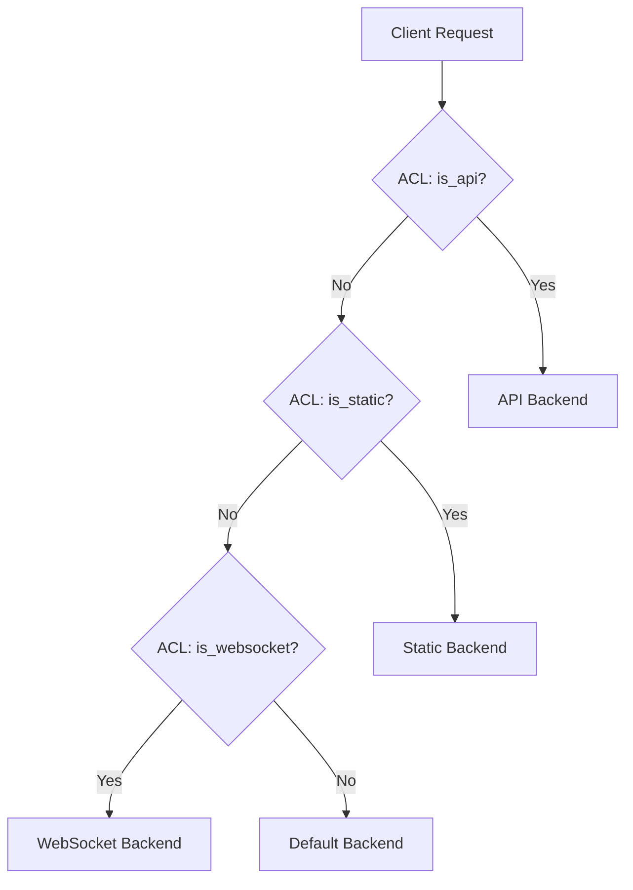
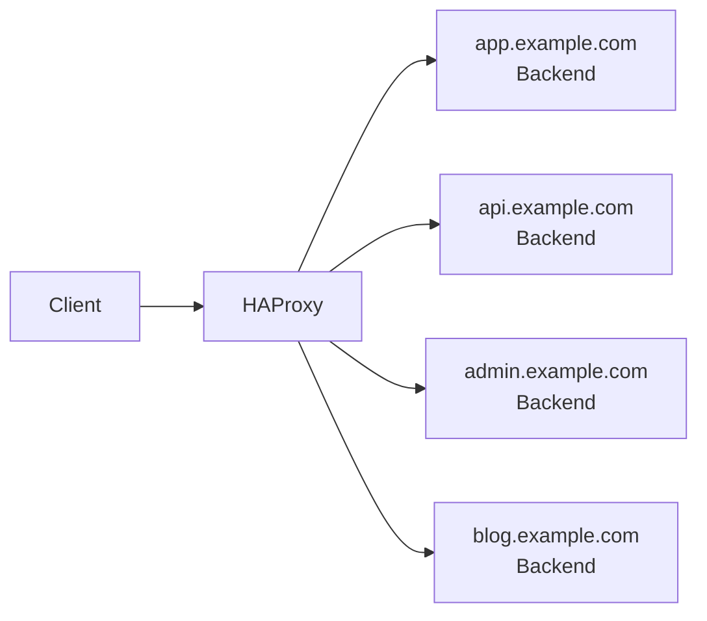
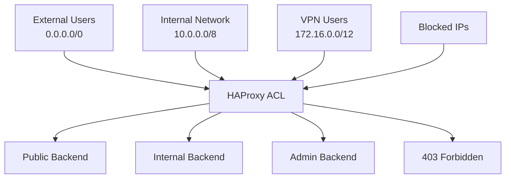
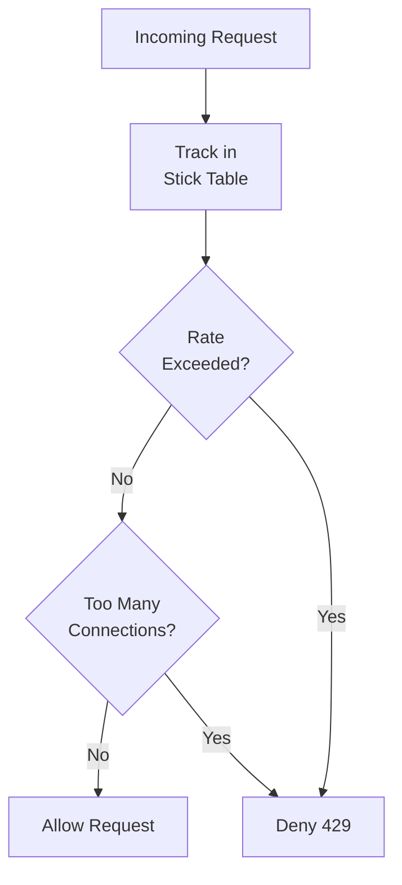

# How to Implement HAProxy ACLs

Author: [nawazdhandala](https://www.github.com/nawazdhandala)

Tags: HAProxy, ACLs, Load Balancing, Traffic Routing, DevOps, Networking, Linux

Description: Learn how to implement HAProxy Access Control Lists (ACLs) for intelligent traffic routing, content-based switching, and request filtering.

---

## Introduction

Access Control Lists (ACLs) are one of HAProxy's most powerful features. They allow you to make routing decisions based on virtually any aspect of incoming requests, including URL paths, headers, cookies, source IPs, and more. With ACLs, you can build sophisticated traffic management rules that go far beyond simple load balancing.

In this guide, you will learn how to implement HAProxy ACLs for various real-world scenarios. We will cover the fundamentals of ACL syntax, common use cases, and production-ready configuration examples.

## What Are HAProxy ACLs?

An ACL in HAProxy is a named condition that evaluates to true or false based on request or connection attributes. When combined with `use_backend`, `http-request`, or `http-response` directives, ACLs enable dynamic traffic routing and request manipulation.



## ACL Syntax Fundamentals

The basic ACL syntax follows this pattern:

```haproxy
acl <name> <criterion> [flags] [operator] <value>
```

Let us break down each component:

- **name**: A unique identifier for the ACL (alphanumeric, can include underscores)
- **criterion**: What to test (path, header, source IP, etc.)
- **flags**: Optional modifiers (case insensitivity, negation, etc.)
- **operator**: Comparison method (exact match, prefix, regex, etc.)
- **value**: The value to match against

### Example of a simple ACL definition
```haproxy
# Match requests where the path starts with /api
acl is_api path_beg /api

# Match requests from a specific IP range
acl is_internal src 192.168.1.0/24

# Match requests with a specific header value (case insensitive)
acl is_mobile hdr_sub(User-Agent) -i mobile
```

## Path-Based Routing

Path-based ACLs are the most common use case. They allow you to route traffic to different backends based on the URL path.

### Common path matching criteria
```haproxy
frontend http_front
    bind *:80

    # path_beg: Match if path begins with specified value
    # Useful for routing API requests or specific application sections
    acl is_api path_beg /api /v1 /v2

    # path_end: Match if path ends with specified value
    # Useful for routing based on file extensions
    acl is_images path_end .jpg .jpeg .png .gif .webp

    # path: Exact path match
    # Useful for specific endpoints like health checks
    acl is_health path /health /healthz /ready

    # path_reg: Regular expression match
    # Useful for complex patterns
    acl is_user_profile path_reg ^/users/[0-9]+/profile$

    # path_sub: Match if path contains the substring
    # Useful for finding patterns anywhere in the path
    acl is_admin path_sub /admin/

    # Route to appropriate backends
    use_backend api_backend if is_api
    use_backend static_backend if is_images
    use_backend health_backend if is_health
    use_backend admin_backend if is_admin

    default_backend web_backend
```

### Production example: Microservices routing
```haproxy
frontend http_front
    bind *:80

    # Define service-specific ACLs
    acl svc_users path_beg /api/users /api/auth /api/profile
    acl svc_orders path_beg /api/orders /api/cart /api/checkout
    acl svc_products path_beg /api/products /api/catalog /api/inventory
    acl svc_search path_beg /api/search

    # Route each service to its dedicated backend
    use_backend users_service if svc_users
    use_backend orders_service if svc_orders
    use_backend products_service if svc_products
    use_backend search_service if svc_search

    default_backend web_frontend

backend users_service
    balance leastconn
    option httpchk GET /api/users/health
    http-check expect status 200
    server user1 10.0.1.10:8080 check inter 5s fall 3 rise 2
    server user2 10.0.1.11:8080 check inter 5s fall 3 rise 2

backend orders_service
    balance leastconn
    option httpchk GET /api/orders/health
    http-check expect status 200
    server order1 10.0.2.10:8080 check inter 5s fall 3 rise 2
    server order2 10.0.2.11:8080 check inter 5s fall 3 rise 2

backend products_service
    balance roundrobin
    option httpchk GET /api/products/health
    http-check expect status 200
    server prod1 10.0.3.10:8080 check inter 5s fall 3 rise 2
    server prod2 10.0.3.11:8080 check inter 5s fall 3 rise 2

backend search_service
    balance roundrobin
    option httpchk GET /api/search/health
    http-check expect status 200
    server search1 10.0.4.10:9200 check inter 5s fall 3 rise 2
    server search2 10.0.4.11:9200 check inter 5s fall 3 rise 2

backend web_frontend
    balance roundrobin
    server web1 10.0.5.10:3000 check
    server web2 10.0.5.11:3000 check
```

## Host-Based Routing (Virtual Hosting)

Host-based ACLs enable you to serve multiple domains from a single HAProxy instance, routing each to the appropriate backend.



### Virtual hosting configuration
```haproxy
frontend http_front
    bind *:80
    bind *:443 ssl crt /etc/haproxy/certs/

    # Match based on Host header
    # hdr(host): Extracts the Host header value
    # -i flag: Case insensitive matching
    acl host_app hdr(host) -i app.example.com www.example.com
    acl host_api hdr(host) -i api.example.com
    acl host_admin hdr(host) -i admin.example.com
    acl host_blog hdr(host) -i blog.example.com

    # Route based on hostname
    use_backend app_backend if host_app
    use_backend api_backend if host_api
    use_backend admin_backend if host_admin
    use_backend blog_backend if host_blog

    # Return 404 for unrecognized hosts
    default_backend no_match_backend

backend app_backend
    balance roundrobin
    server app1 10.0.1.10:8080 check
    server app2 10.0.1.11:8080 check

backend api_backend
    balance leastconn
    server api1 10.0.2.10:8080 check
    server api2 10.0.2.11:8080 check

backend admin_backend
    balance roundrobin
    server admin1 10.0.3.10:8080 check

backend blog_backend
    balance roundrobin
    server blog1 10.0.4.10:8080 check
    server blog2 10.0.4.11:8080 check

backend no_match_backend
    # Return HTTP 404 for unrecognized hosts
    http-request deny deny_status 404
```

### Wildcard domain matching with regex
```haproxy
frontend http_front
    bind *:80

    # Match any subdomain of example.com using regex
    # The -m reg flag enables regex matching
    acl is_example_subdomain hdr_reg(host) -i ^[a-z0-9-]+\.example\.com$

    # Match specific pattern: tenant subdomains like tenant1.app.example.com
    acl is_tenant hdr_reg(host) -i ^[a-z0-9-]+\.app\.example\.com$

    use_backend tenant_backend if is_tenant
    use_backend main_backend if is_example_subdomain

    default_backend fallback_backend
```

## Header-Based Routing

Header-based ACLs allow sophisticated routing based on HTTP headers, enabling use cases like API versioning, mobile detection, and A/B testing.

### API versioning with headers
```haproxy
frontend api_front
    bind *:80

    # Match API version from Accept header
    # Common pattern: Accept: application/vnd.api.v1+json
    acl api_v1 hdr(Accept) -i application/vnd.api.v1+json
    acl api_v2 hdr(Accept) -i application/vnd.api.v2+json
    acl api_v3 hdr(Accept) -i application/vnd.api.v3+json

    # Alternative: Version in custom header
    # X-API-Version: 1
    acl api_v1_header hdr(X-API-Version) 1
    acl api_v2_header hdr(X-API-Version) 2
    acl api_v3_header hdr(X-API-Version) 3

    # Route to versioned backends
    use_backend api_v1_backend if api_v1 or api_v1_header
    use_backend api_v2_backend if api_v2 or api_v2_header
    use_backend api_v3_backend if api_v3 or api_v3_header

    # Default to latest stable version
    default_backend api_v2_backend

backend api_v1_backend
    # Legacy API - maintenance mode only
    balance roundrobin
    server api_v1_1 10.0.1.10:8080 check

backend api_v2_backend
    # Current stable version
    balance leastconn
    server api_v2_1 10.0.2.10:8080 check
    server api_v2_2 10.0.2.11:8080 check

backend api_v3_backend
    # New version in beta
    balance leastconn
    server api_v3_1 10.0.3.10:8080 check
```

### Mobile and device detection
```haproxy
frontend http_front
    bind *:80

    # Detect mobile devices from User-Agent header
    # hdr_sub: Check if header contains substring
    acl is_mobile hdr_sub(User-Agent) -i mobile android iphone
    acl is_tablet hdr_sub(User-Agent) -i ipad tablet
    acl is_bot hdr_sub(User-Agent) -i bot crawler spider googlebot

    # Route mobile traffic to optimized backend
    use_backend mobile_backend if is_mobile
    use_backend mobile_backend if is_tablet

    # Route bots to a separate backend (for rate limiting or caching)
    use_backend bot_backend if is_bot

    default_backend desktop_backend

backend mobile_backend
    balance roundrobin
    # Mobile-optimized servers with different caching strategy
    server mobile1 10.0.1.10:8080 check
    server mobile2 10.0.1.11:8080 check

backend bot_backend
    balance roundrobin
    # Separate pool for crawlers to prevent impact on user traffic
    server bot1 10.0.2.10:8080 check

backend desktop_backend
    balance roundrobin
    server web1 10.0.3.10:8080 check
    server web2 10.0.3.11:8080 check
```

### A/B testing with headers
```haproxy
frontend http_front
    bind *:80

    # Check for existing A/B test cookie
    acl has_ab_cookie req.cook(ab_test) -m found

    # Determine variant from cookie
    acl variant_a req.cook(ab_test) -m str variant_a
    acl variant_b req.cook(ab_test) -m str variant_b

    # For new users without cookie, use random assignment
    # rand(100) generates random number 0-99
    acl should_get_variant_a rand(100) lt 50

    # Route based on variant
    use_backend variant_a_backend if variant_a
    use_backend variant_b_backend if variant_b
    use_backend variant_a_backend if !has_ab_cookie should_get_variant_a
    use_backend variant_b_backend if !has_ab_cookie !should_get_variant_a

backend variant_a_backend
    balance roundrobin
    # Set cookie for variant A on first response
    http-response set-header Set-Cookie "ab_test=variant_a; Path=/; Max-Age=604800"
    server var_a1 10.0.1.10:8080 check
    server var_a2 10.0.1.11:8080 check

backend variant_b_backend
    balance roundrobin
    # Set cookie for variant B on first response
    http-response set-header Set-Cookie "ab_test=variant_b; Path=/; Max-Age=604800"
    server var_b1 10.0.2.10:8080 check
    server var_b2 10.0.2.11:8080 check
```

## Source IP-Based Routing and Filtering

Source IP ACLs enable you to implement IP whitelisting, geographic routing, and internal vs external traffic separation.



### IP whitelist for admin access
```haproxy
frontend http_front
    bind *:80

    # Define trusted IP ranges
    acl is_internal src 10.0.0.0/8 172.16.0.0/12 192.168.0.0/16
    acl is_vpn src 203.0.113.0/24
    acl is_office src 198.51.100.10 198.51.100.11

    # Define admin paths
    acl is_admin_path path_beg /admin /management /internal

    # Allow admin access only from trusted IPs
    # Block admin access from external IPs
    http-request deny deny_status 403 if is_admin_path !is_internal !is_vpn !is_office

    use_backend admin_backend if is_admin_path
    default_backend public_backend

backend admin_backend
    balance roundrobin
    server admin1 10.0.1.10:8080 check

backend public_backend
    balance roundrobin
    server web1 10.0.2.10:8080 check
    server web2 10.0.2.11:8080 check
```

### IP blocklist for security
```haproxy
frontend http_front
    bind *:80

    # Block known malicious IPs (can be loaded from file)
    acl blocked_ips src -f /etc/haproxy/blocked_ips.txt

    # Block specific IP ranges
    acl blocked_ranges src 192.0.2.0/24 198.51.100.0/24

    # Deny blocked IPs before any other processing
    http-request deny deny_status 403 if blocked_ips
    http-request deny deny_status 403 if blocked_ranges

    default_backend web_backend
```

### Creating the blocked IPs file
```bash
# Create blocked IPs list file
# One IP or CIDR range per line
sudo tee /etc/haproxy/blocked_ips.txt << 'EOF'
192.0.2.1
192.0.2.50
198.51.100.0/24
203.0.113.100
EOF

# Set proper permissions
sudo chmod 644 /etc/haproxy/blocked_ips.txt
sudo chown haproxy:haproxy /etc/haproxy/blocked_ips.txt
```

### Geographic routing based on IP
```haproxy
frontend http_front
    bind *:80

    # Define geographic regions using IP ranges
    # These would typically come from GeoIP databases
    acl region_us src -f /etc/haproxy/geoip/us.txt
    acl region_eu src -f /etc/haproxy/geoip/eu.txt
    acl region_asia src -f /etc/haproxy/geoip/asia.txt

    # Route to regional backends for latency optimization
    use_backend us_backend if region_us
    use_backend eu_backend if region_eu
    use_backend asia_backend if region_asia

    # Default to nearest region (US for this example)
    default_backend us_backend

backend us_backend
    balance roundrobin
    server us1 10.0.1.10:8080 check
    server us2 10.0.1.11:8080 check

backend eu_backend
    balance roundrobin
    server eu1 10.0.2.10:8080 check
    server eu2 10.0.2.11:8080 check

backend asia_backend
    balance roundrobin
    server asia1 10.0.3.10:8080 check
    server asia2 10.0.3.11:8080 check
```

## Method-Based Routing

Route traffic based on HTTP methods to separate read and write operations or enforce RESTful patterns.

### Separate read and write backends
```haproxy
frontend http_front
    bind *:80

    # Define method-based ACLs
    acl is_read method GET HEAD OPTIONS
    acl is_write method POST PUT PATCH DELETE

    # Route reads to read replicas, writes to primary
    use_backend read_replicas if is_read
    use_backend write_primary if is_write

    default_backend read_replicas

backend read_replicas
    balance roundrobin
    # Read replicas can handle more traffic
    server read1 10.0.1.10:8080 check
    server read2 10.0.1.11:8080 check
    server read3 10.0.1.12:8080 check

backend write_primary
    balance leastconn
    # Write operations go to primary only
    server primary 10.0.2.10:8080 check
    # Backup server for failover
    server standby 10.0.2.11:8080 check backup
```

### Restrict dangerous methods
```haproxy
frontend http_front
    bind *:80

    # Block TRACE and TRACK methods (security best practice)
    acl is_trace method TRACE TRACK
    http-request deny deny_status 405 if is_trace

    # Restrict DELETE to specific paths
    acl is_delete method DELETE
    acl is_deletable_path path_beg /api/temp /api/cache

    # Block DELETE requests outside allowed paths
    http-request deny deny_status 405 if is_delete !is_deletable_path

    default_backend web_backend
```

## Combining ACLs with Boolean Logic

HAProxy supports combining multiple ACLs using AND, OR, and NOT operators for complex routing logic.

### Boolean operators
```haproxy
frontend http_front
    bind *:80

    # Define individual conditions
    acl is_api path_beg /api
    acl is_admin path_beg /admin
    acl is_internal src 10.0.0.0/8
    acl is_authenticated hdr(Authorization) -m found
    acl is_secure ssl_fc

    # Combine with AND (implicit - space between conditions)
    # API requests from internal network
    use_backend internal_api if is_api is_internal

    # Combine with OR
    # Admin access for internal users OR authenticated users
    use_backend admin_backend if is_admin is_internal or is_admin is_authenticated

    # Combine with NOT (!)
    # Redirect non-HTTPS traffic to HTTPS
    http-request redirect scheme https if !is_secure

    # Complex condition: API requests that are NOT from internal network
    # AND do NOT have authentication
    http-request deny deny_status 401 if is_api !is_internal !is_authenticated

    default_backend web_backend
```

### Negation with ! operator
```haproxy
frontend http_front
    bind *:80

    acl is_health_check path /health /ready /live
    acl is_internal src 10.0.0.0/8
    acl has_api_key hdr(X-API-Key) -m found

    # Log all requests EXCEPT health checks
    http-request set-log-level silent if is_health_check

    # Require API key for external requests (NOT internal)
    http-request deny deny_status 401 if !is_internal !has_api_key !is_health_check

    default_backend api_backend
```

### Parentheses with or operator
```haproxy
frontend http_front
    bind *:80

    acl is_api path_beg /api
    acl is_internal src 10.0.0.0/8
    acl is_vpn src 172.16.0.0/12
    acl has_token hdr(Authorization) -m found

    # Allow API access if:
    # - Request is from internal network, OR
    # - Request is from VPN, OR
    # - Request has authentication token
    use_backend api_backend if is_api is_internal or is_api is_vpn or is_api has_token

    # Deny API access if none of the above conditions match
    http-request deny deny_status 403 if is_api

    default_backend web_backend
```

## Request Manipulation with ACLs

ACLs can trigger request modifications, header additions, and URL rewrites.

### Adding headers based on conditions
```haproxy
frontend http_front
    bind *:80
    bind *:443 ssl crt /etc/haproxy/certs/example.pem

    acl is_secure ssl_fc
    acl is_internal src 10.0.0.0/8

    # Add X-Forwarded-Proto header
    http-request set-header X-Forwarded-Proto https if is_secure
    http-request set-header X-Forwarded-Proto http if !is_secure

    # Add internal marker header
    http-request set-header X-Internal-Request true if is_internal
    http-request set-header X-Internal-Request false if !is_internal

    # Add request ID for tracing
    http-request set-header X-Request-ID %[uuid()]

    default_backend web_backend
```

### URL rewriting
```haproxy
frontend http_front
    bind *:80

    # Rewrite legacy API paths to new paths
    acl is_legacy_api path_beg /v1/api
    http-request replace-path /v1/api(.*) /api/v1\1 if is_legacy_api

    # Strip prefix for internal routing
    acl is_service_a path_beg /service-a
    http-request replace-path /service-a(.*) \1 if is_service_a

    # Redirect www to non-www
    acl is_www hdr_beg(host) -i www.
    http-request redirect prefix http://example.com code 301 if is_www

    use_backend service_a_backend if is_service_a
    default_backend web_backend
```

### Setting backend dynamically
```haproxy
frontend http_front
    bind *:80

    # Extract tenant from subdomain
    # Example: tenant1.app.example.com
    http-request set-var(req.tenant) hdr(host),regsub(\.app\.example\.com$,,),lower

    # Use variable in backend selection
    acl is_tenant1 var(req.tenant) -m str tenant1
    acl is_tenant2 var(req.tenant) -m str tenant2
    acl is_tenant3 var(req.tenant) -m str tenant3

    use_backend tenant1_backend if is_tenant1
    use_backend tenant2_backend if is_tenant2
    use_backend tenant3_backend if is_tenant3

    default_backend shared_backend
```

## Rate Limiting with ACLs

Combine ACLs with stick tables to implement sophisticated rate limiting.



### Basic rate limiting by source IP
```haproxy
frontend http_front
    bind *:80

    # Create stick table to track request rates
    # type ip: Track by source IP
    # size 100k: Store up to 100,000 entries
    # expire 30s: Remove entries after 30 seconds of inactivity
    # store http_req_rate(10s): Track requests per 10 second window
    stick-table type ip size 100k expire 30s store http_req_rate(10s),conn_cur

    # Track the source IP in the stick table
    tcp-request connection track-sc0 src

    # Define rate limit thresholds
    # sc0_http_req_rate: Request rate for tracked entry
    acl rate_exceeded sc0_http_req_rate gt 100

    # conn_cur: Current connection count
    acl conn_exceeded sc0_conn_cur gt 20

    # Block requests exceeding limits
    http-request deny deny_status 429 content-type application/json string '{"error": "Rate limit exceeded"}' if rate_exceeded
    http-request deny deny_status 429 if conn_exceeded

    default_backend web_backend
```

### Tiered rate limiting for different paths
```haproxy
frontend http_front
    bind *:80

    # Separate stick tables for different rate limit tiers
    stick-table type ip size 100k expire 30s store http_req_rate(10s)

    # Track connections
    tcp-request connection track-sc0 src

    # Define path-based ACLs
    acl is_api path_beg /api
    acl is_login path /api/login /api/auth
    acl is_expensive path_beg /api/reports /api/export

    # Different rate limits for different endpoints
    # General API: 100 req/10s
    acl api_rate_exceeded sc0_http_req_rate gt 100

    # Login: 10 req/10s (brute force protection)
    acl login_rate_exceeded sc0_http_req_rate gt 10

    # Expensive operations: 5 req/10s
    acl expensive_rate_exceeded sc0_http_req_rate gt 5

    # Apply appropriate limits
    http-request deny deny_status 429 if is_login login_rate_exceeded
    http-request deny deny_status 429 if is_expensive expensive_rate_exceeded
    http-request deny deny_status 429 if is_api api_rate_exceeded

    default_backend api_backend
```

### Rate limiting with API keys
```haproxy
frontend http_front
    bind *:80

    # Track by API key instead of IP
    stick-table type string len 64 size 100k expire 1h store http_req_rate(1m)

    # Extract API key from header
    http-request set-var(req.api_key) hdr(X-API-Key)

    # Track by API key if present, otherwise by IP
    acl has_api_key var(req.api_key) -m found
    http-request track-sc0 var(req.api_key) table http_front if has_api_key
    http-request track-sc0 src table http_front if !has_api_key

    # Rate limit: 1000 requests per minute for authenticated
    # Rate limit: 100 requests per minute for unauthenticated
    acl auth_rate_exceeded sc0_http_req_rate gt 1000
    acl unauth_rate_exceeded sc0_http_req_rate gt 100

    http-request deny deny_status 429 if has_api_key auth_rate_exceeded
    http-request deny deny_status 429 if !has_api_key unauth_rate_exceeded

    default_backend api_backend
```

## WebSocket and Protocol Detection

Detect and route WebSocket connections using ACLs.

### WebSocket routing
```haproxy
frontend http_front
    bind *:80

    # Detect WebSocket upgrade requests
    # WebSocket connections have Upgrade: websocket header
    acl is_websocket hdr(Upgrade) -i websocket

    # Alternative: Check Connection header
    acl is_ws_connection hdr(Connection) -i upgrade

    # Route WebSocket traffic to dedicated backend
    use_backend websocket_backend if is_websocket is_ws_connection

    default_backend http_backend

backend websocket_backend
    balance source
    # Use source IP hash for sticky sessions
    # WebSocket connections are long-lived

    # Longer timeouts for persistent connections
    timeout tunnel 1h
    timeout client 1h
    timeout server 1h

    server ws1 10.0.1.10:8080 check
    server ws2 10.0.1.11:8080 check

backend http_backend
    balance roundrobin
    server web1 10.0.2.10:8080 check
    server web2 10.0.2.11:8080 check
```

### gRPC routing
```haproxy
frontend grpc_front
    bind *:443 ssl crt /etc/haproxy/certs/example.pem alpn h2

    # Detect gRPC requests
    # gRPC uses content-type: application/grpc
    acl is_grpc hdr(content-type) -i application/grpc

    # Route gRPC to dedicated backend
    use_backend grpc_backend if is_grpc

    default_backend http_backend

backend grpc_backend
    balance roundrobin
    # gRPC requires HTTP/2
    option httpchk
    http-check connect proto h2
    http-check send meth GET uri /grpc.health.v1.Health/Check
    http-check expect status 200

    server grpc1 10.0.1.10:50051 check proto h2
    server grpc2 10.0.1.11:50051 check proto h2
```

## SSL/TLS ACLs

Make routing decisions based on SSL/TLS connection properties.

### SSL-based routing
```haproxy
frontend https_front
    bind *:443 ssl crt /etc/haproxy/certs/

    # Check if connection is over SSL
    acl is_ssl ssl_fc

    # Check SSL version
    acl is_tls12 ssl_fc_protocol TLSv1.2
    acl is_tls13 ssl_fc_protocol TLSv1.3

    # Check client certificate
    acl has_client_cert ssl_c_used
    acl valid_client_cert ssl_c_verify 0

    # Check SNI (Server Name Indication)
    acl sni_app1 ssl_fc_sni -i app1.example.com
    acl sni_app2 ssl_fc_sni -i app2.example.com

    # Log TLS version for monitoring
    http-request set-header X-TLS-Version %[ssl_fc_protocol]

    # Require TLS 1.2 or higher
    http-request deny deny_status 403 if !is_tls12 !is_tls13

    # Route based on SNI
    use_backend app1_backend if sni_app1
    use_backend app2_backend if sni_app2

    default_backend default_backend
```

### Client certificate authentication
```haproxy
frontend https_front
    bind *:443 ssl crt /etc/haproxy/certs/server.pem ca-file /etc/haproxy/certs/ca.pem verify optional

    # Check if client provided a certificate
    acl has_client_cert ssl_c_used

    # Check if certificate is valid (verify returns 0 for valid)
    acl valid_cert ssl_c_verify 0

    # Extract certificate details for logging
    http-request set-header X-Client-CN %{+Q}[ssl_c_s_dn(cn)]
    http-request set-header X-Client-Cert-Valid %[ssl_c_verify]

    # Require valid client cert for sensitive paths
    acl is_sensitive path_beg /admin /internal /api/admin
    http-request deny deny_status 403 if is_sensitive !has_client_cert
    http-request deny deny_status 403 if is_sensitive !valid_cert

    default_backend web_backend
```

## Debugging ACLs

Troubleshoot ACL behavior with logging and headers.

### Add debug headers
```haproxy
frontend http_front
    bind *:80

    # Define ACLs
    acl is_api path_beg /api
    acl is_internal src 10.0.0.0/8
    acl is_authenticated hdr(Authorization) -m found

    # Add debug headers showing ACL matches
    # Only in non-production environments
    acl is_debug hdr(X-Debug) -m found

    http-response set-header X-ACL-API %[acl_matched(is_api)] if is_debug
    http-response set-header X-ACL-Internal %[acl_matched(is_internal)] if is_debug
    http-response set-header X-ACL-Auth %[acl_matched(is_authenticated)] if is_debug
    http-response set-header X-Backend %b if is_debug

    default_backend web_backend
```

### Enable verbose logging
```haproxy
global
    log /dev/log local0 debug

defaults
    log global
    option httplog

    # Custom log format showing ACL evaluations
    log-format "%ci:%cp [%tr] %ft %b/%s %TR/%Tw/%Tc/%Tr/%Ta %ST %B %CC %CS %tsc %ac/%fc/%bc/%sc/%rc %sq/%bq %hr %hs %{+Q}r"

frontend http_front
    bind *:80

    # Log ACL matches
    acl is_api path_beg /api
    http-request set-var(txn.matched_api) acl_matched(is_api)

    # Include variable in log
    http-request capture var(txn.matched_api) len 10

    default_backend web_backend
```

### Test ACL configuration
```bash
# Validate HAProxy configuration
sudo haproxy -c -f /etc/haproxy/haproxy.cfg

# Test with verbose output
sudo haproxy -c -V -f /etc/haproxy/haproxy.cfg

# Test specific request routing using curl
# Test path-based routing
curl -v http://localhost/api/users

# Test header-based routing
curl -v -H "X-API-Version: 2" http://localhost/api/users

# Test with specific host header
curl -v -H "Host: api.example.com" http://localhost/users
```

## Complete Production Example

Here is a comprehensive production configuration combining multiple ACL patterns.

```haproxy
#---------------------------------------------------------------------
# Global settings
#---------------------------------------------------------------------
global
    log /dev/log local0
    log /dev/log local1 notice
    chroot /var/lib/haproxy
    stats socket /run/haproxy/admin.sock mode 660 level admin
    stats timeout 30s
    user haproxy
    group haproxy
    daemon
    maxconn 100000

    # SSL settings
    ssl-default-bind-ciphers ECDHE-ECDSA-AES128-GCM-SHA256:ECDHE-RSA-AES128-GCM-SHA256
    ssl-default-bind-options ssl-min-ver TLSv1.2 no-tls-tickets
    tune.ssl.default-dh-param 2048

#---------------------------------------------------------------------
# Defaults
#---------------------------------------------------------------------
defaults
    mode http
    log global
    option httplog
    option dontlognull
    option http-server-close
    option forwardfor except 127.0.0.0/8
    option redispatch
    retries 3
    timeout http-request 10s
    timeout queue 1m
    timeout connect 5s
    timeout client 30s
    timeout server 30s
    timeout http-keep-alive 10s
    timeout check 5s
    maxconn 50000

#---------------------------------------------------------------------
# Stats Dashboard
#---------------------------------------------------------------------
frontend stats
    bind *:8404
    stats enable
    stats uri /stats
    stats refresh 10s
    stats auth admin:SecurePassword123
    stats admin if TRUE
    stats hide-version

#---------------------------------------------------------------------
# Main Frontend
#---------------------------------------------------------------------
frontend main
    bind *:80
    bind *:443 ssl crt /etc/haproxy/certs/ alpn h2,http/1.1

    # Rate limiting stick table
    stick-table type ip size 200k expire 30s store http_req_rate(10s),conn_cur,bytes_in_rate(1m)

    # Track connections
    tcp-request connection track-sc0 src

    # Security ACLs
    acl blocked_ips src -f /etc/haproxy/blocked_ips.txt
    acl rate_exceeded sc0_http_req_rate gt 100
    acl conn_exceeded sc0_conn_cur gt 50

    # Protocol ACLs
    acl is_ssl ssl_fc
    acl is_websocket hdr(Upgrade) -i websocket

    # Path ACLs
    acl is_api path_beg /api
    acl is_admin path_beg /admin
    acl is_health path /health /ready /live
    acl is_static path_end .js .css .png .jpg .gif .ico .woff .woff2

    # Host ACLs
    acl host_api hdr(host) -i api.example.com
    acl host_admin hdr(host) -i admin.example.com

    # Source ACLs
    acl is_internal src 10.0.0.0/8 172.16.0.0/12

    # Method ACLs
    acl is_options method OPTIONS

    # Security: Block bad actors
    http-request deny deny_status 403 if blocked_ips
    http-request deny deny_status 429 if rate_exceeded
    http-request deny deny_status 429 if conn_exceeded

    # Security: Redirect HTTP to HTTPS
    http-request redirect scheme https code 301 if !is_ssl

    # Security: Restrict admin access
    http-request deny deny_status 403 if is_admin !is_internal

    # CORS preflight handling
    http-request return status 200 content-type text/plain string "OK" if is_options

    # Silent health check logging
    http-request set-log-level silent if is_health

    # Add security headers
    http-response set-header Strict-Transport-Security "max-age=31536000; includeSubDomains"
    http-response set-header X-Frame-Options "SAMEORIGIN"
    http-response set-header X-Content-Type-Options "nosniff"

    # Forward original client info
    http-request set-header X-Real-IP %[src]
    http-request set-header X-Forwarded-Proto https if is_ssl

    # Routing
    use_backend websocket_backend if is_websocket
    use_backend api_backend if host_api
    use_backend api_backend if is_api
    use_backend admin_backend if is_admin
    use_backend admin_backend if host_admin
    use_backend static_backend if is_static

    default_backend app_backend

#---------------------------------------------------------------------
# Backends
#---------------------------------------------------------------------
backend app_backend
    balance roundrobin
    option httpchk GET /health
    http-check expect status 200
    cookie SERVERID insert indirect nocache
    compression algo gzip
    compression type text/html text/css application/javascript application/json

    server app1 10.0.1.10:8080 check inter 5s fall 3 rise 2 cookie app1
    server app2 10.0.1.11:8080 check inter 5s fall 3 rise 2 cookie app2
    server app3 10.0.1.12:8080 check inter 5s fall 3 rise 2 cookie app3

backend api_backend
    balance leastconn
    option httpchk GET /api/health
    http-check expect status 200
    timeout server 60s

    server api1 10.0.2.10:8080 check inter 5s fall 3 rise 2
    server api2 10.0.2.11:8080 check inter 5s fall 3 rise 2

backend admin_backend
    balance roundrobin
    option httpchk GET /admin/health
    http-check expect status 200

    server admin1 10.0.3.10:8080 check

backend static_backend
    balance roundrobin
    http-response set-header Cache-Control "public, max-age=31536000"

    server static1 10.0.4.10:80 check
    server static2 10.0.4.11:80 check

backend websocket_backend
    balance source
    timeout tunnel 1h
    timeout server 1h

    server ws1 10.0.5.10:8080 check
    server ws2 10.0.5.11:8080 check
```

## Conclusion

HAProxy ACLs provide a flexible and powerful mechanism for implementing sophisticated traffic management rules. In this guide, you learned how to:

- Define ACLs using various criteria including paths, headers, IPs, and methods
- Implement path-based and host-based routing for microservices architectures
- Create header-based routing for API versioning and device detection
- Filter traffic using IP whitelists and blocklists
- Combine ACLs using boolean logic for complex routing decisions
- Manipulate requests and responses based on conditions
- Implement rate limiting with stick tables
- Handle WebSocket and gRPC protocols
- Debug ACL configurations effectively

ACLs are the foundation of intelligent traffic management in HAProxy. By mastering ACL syntax and patterns, you can build load balancing solutions that adapt to virtually any routing requirement.

## Additional Resources

- [HAProxy ACL Documentation](http://docs.haproxy.org/2.8/configuration.html#7)
- [HAProxy Fetch Methods](http://docs.haproxy.org/2.8/configuration.html#7.3)
- [HAProxy Configuration Manual](http://cbonte.github.io/haproxy-dconv/)
- [HAProxy Community Forums](https://discourse.haproxy.org/)
