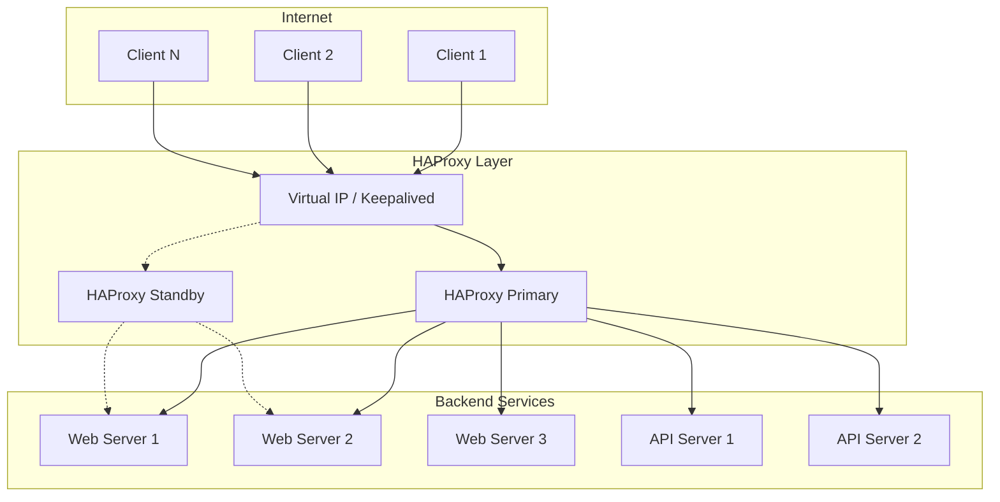

# How to Configure HAProxy for Production

Author: [nawazdhandala](https://www.github.com/nawazdhandala)

Tags: HAProxy, Load Balancing, DevOps, High Availability, SSL, Performance, Linux

Description: A practical guide to configuring HAProxy for production environments with secure defaults, performance tuning, health checks, SSL termination, and monitoring best practices.

---

HAProxy has been the workhorse of internet infrastructure for over two decades. Companies like GitHub, Stack Overflow, and Instagram rely on it to handle millions of requests per second. This guide walks through a battle-tested production configuration, explaining each decision along the way.

## Why HAProxy?

Before diving into configuration, it helps to understand what makes HAProxy stand out:

- Single-threaded event-driven architecture (with multi-threading support since 1.8)
- Zero-copy forwarding for maximum throughput
- Extremely low memory footprint - often under 100MB for high-traffic deployments
- Connection pooling and keep-alive management
- Built-in statistics and health monitoring

## Architecture Overview

Here is a typical production setup with HAProxy fronting multiple backend services:



## Installation

On Debian/Ubuntu systems, install the latest stable version from the official PPA:

```bash
# Add the HAProxy PPA for the latest stable release
sudo add-apt-repository ppa:vbernat/haproxy-2.8

# Update package lists and install
sudo apt update
sudo apt install haproxy

# Verify installation
haproxy -v
```

For RHEL/CentOS:

```bash
# Enable the HAProxy repository
sudo yum install epel-release
sudo yum install haproxy

# Enable and start the service
sudo systemctl enable haproxy
sudo systemctl start haproxy
```

## The Complete Production Configuration

Let us build a production-ready configuration file piece by piece. The full config lives at `/etc/haproxy/haproxy.cfg`.

### Global Settings

The global section sets process-wide parameters:

```haproxy
global
    # Run as a background daemon
    daemon

    # Drop privileges after binding to ports
    user haproxy
    group haproxy

    # Chroot for security isolation
    chroot /var/lib/haproxy

    # Maximum concurrent connections across all frontends
    maxconn 100000

    # Enable multi-threading (use all available CPU cores)
    nbthread 4

    # CPU affinity - bind threads to specific cores for better cache locality
    cpu-map auto:1/1-4 0-3

    # SSL/TLS settings
    ssl-default-bind-ciphers ECDHE-ECDSA-AES128-GCM-SHA256:ECDHE-RSA-AES128-GCM-SHA256
    ssl-default-bind-ciphersuites TLS_AES_128_GCM_SHA256:TLS_AES_256_GCM_SHA384
    ssl-default-bind-options ssl-min-ver TLSv1.2 no-tls-tickets

    # Logging via syslog
    log /dev/log local0
    log /dev/log local1 notice

    # Stats socket for runtime management
    stats socket /run/haproxy/admin.sock mode 660 level admin expose-fd listeners
    stats timeout 30s

    # Tune buffer sizes for high throughput
    tune.bufsize 32768
    tune.maxrewrite 8192
    tune.ssl.default-dh-param 2048
```

Key decisions here:

- **chroot** isolates HAProxy from the rest of the filesystem
- **maxconn** should match your expected peak connections plus headroom
- **nbthread** enables multi-threading - set this to match your CPU core count
- **ssl-min-ver TLSv1.2** disables vulnerable older protocols

### Default Settings

Defaults apply to all frontends and backends unless overridden:

```haproxy
defaults
    # Use HTTP mode (alternative: tcp for raw TCP proxying)
    mode http

    # Inherit logging from global section
    log global

    # Log HTTP requests with timing information
    option httplog

    # Do not log connections without requests (reduces noise)
    option dontlognull

    # Enable HTTP connection keep-alive
    option http-keep-alive

    # Close connections to servers after each request (backend pooling)
    option http-server-close

    # Forward client IP to backend servers
    option forwardfor except 127.0.0.0/8

    # Enable HTTP health checks by default
    option httpchk

    # Abort connections on client disconnect
    option abortonclose

    # Connection timeouts
    timeout connect 5s       # Time to wait for backend connection
    timeout client 30s       # Inactivity timeout on client side
    timeout server 30s       # Inactivity timeout on server side
    timeout http-request 10s # Time to wait for complete HTTP request
    timeout http-keep-alive 2s # Keep-alive timeout between requests
    timeout queue 30s        # Time requests can wait in queue

    # Retry failed connections to other servers
    retries 3

    # Specify which errors trigger server marking as down
    default-server inter 3s fall 3 rise 2
```

The timeout values deserve special attention:

- **timeout connect** - Keep this short (3-5s). If a backend cannot accept connections quickly, something is wrong.
- **timeout client/server** - 30s handles most web traffic. Increase for long-polling or streaming.
- **timeout http-request** - Protects against slowloris attacks. 10s is generous for legitimate requests.

### Frontend Configuration

Frontends define how HAProxy receives traffic:

```haproxy
# HTTP frontend - redirect all traffic to HTTPS
frontend http_front
    bind *:80

    # ACME challenge for Let's Encrypt certificate renewal
    acl letsencrypt path_beg /.well-known/acme-challenge/
    use_backend letsencrypt_backend if letsencrypt

    # Redirect everything else to HTTPS
    http-request redirect scheme https unless { ssl_fc } or letsencrypt

# Main HTTPS frontend
frontend https_front
    # Bind to port 443 with SSL certificate
    bind *:443 ssl crt /etc/haproxy/certs/combined.pem alpn h2,http/1.1

    # Enable HTTP/2
    http-request set-header X-Forwarded-Proto https

    # Security headers
    http-response set-header Strict-Transport-Security "max-age=31536000; includeSubDomains; preload"
    http-response set-header X-Frame-Options "SAMEORIGIN"
    http-response set-header X-Content-Type-Options "nosniff"

    # Rate limiting - track requests per IP
    stick-table type ip size 100k expire 30s store http_req_rate(10s)
    http-request track-sc0 src

    # Deny if more than 100 requests in 10 seconds
    http-request deny deny_status 429 if { sc_http_req_rate(0) gt 100 }

    # ACLs for routing
    acl is_api path_beg /api/
    acl is_static path_beg /static/ /assets/ /images/
    acl is_websocket hdr(Upgrade) -i WebSocket

    # Route to appropriate backends
    use_backend api_servers if is_api
    use_backend static_servers if is_static
    use_backend websocket_servers if is_websocket
    default_backend web_servers
```

Notable features:

- **alpn h2,http/1.1** enables HTTP/2 with HTTP/1.1 fallback
- **stick-table** provides in-memory rate limiting without external dependencies
- **ACLs** route traffic based on URL path, headers, or any other criteria

### Backend Configuration

Backends define your server pools:

```haproxy
# Primary web application servers
backend web_servers
    balance roundrobin

    # Health check endpoint
    option httpchk GET /health
    http-check expect status 200

    # Cookie-based session persistence (if needed)
    cookie SERVERID insert indirect nocache

    # Server definitions with health check parameters
    server web1 10.0.1.10:8080 check cookie web1 weight 100
    server web2 10.0.1.11:8080 check cookie web2 weight 100
    server web3 10.0.1.12:8080 check cookie web3 weight 100

    # Backup server - only used when all primary servers are down
    server web_backup 10.0.1.20:8080 check backup

# API servers with consistent hashing
backend api_servers
    # Consistent hashing based on URL - same URL always hits same server (good for caching)
    balance uri
    hash-type consistent

    option httpchk GET /api/health
    http-check expect status 200

    # Connection pooling settings
    http-reuse safe

    server api1 10.0.2.10:3000 check maxconn 500
    server api2 10.0.2.11:3000 check maxconn 500

# Static content servers
backend static_servers
    balance roundrobin

    option httpchk GET /health

    # Cache static content aggressively
    http-response set-header Cache-Control "public, max-age=31536000"

    server static1 10.0.3.10:80 check
    server static2 10.0.3.11:80 check

# WebSocket backend with sticky sessions
backend websocket_servers
    balance source

    # Longer timeouts for persistent connections
    timeout tunnel 1h
    timeout server 1h

    server ws1 10.0.4.10:8080 check
    server ws2 10.0.4.11:8080 check

# Let's Encrypt ACME challenge backend
backend letsencrypt_backend
    server letsencrypt 127.0.0.1:8888
```

Load balancing algorithm choices:

- **roundrobin** - Even distribution, good default for stateless services
- **leastconn** - Best for long-lived connections or uneven request durations
- **source** - IP-based stickiness, useful for WebSockets
- **uri** - Hash URL for cache-friendly distribution

### Statistics Dashboard

The built-in stats page provides real-time visibility:

```haproxy
# Statistics dashboard
frontend stats
    bind *:8404
    mode http
    stats enable
    stats uri /stats
    stats refresh 10s
    stats admin if LOCALHOST

    # Basic authentication
    stats auth admin:your_secure_password_here

    # Hide HAProxy version
    stats hide-version
```

Access the dashboard at `http://your-haproxy-server:8404/stats` to see:

- Request rates per backend
- Server health status
- Connection counts
- Response time percentiles
- Error rates

## SSL Certificate Management

For production, you need properly managed SSL certificates. HAProxy expects certificates in a combined format:

```bash
# Combine certificate, private key, and chain into one file
cat /etc/letsencrypt/live/yourdomain.com/fullchain.pem \
    /etc/letsencrypt/live/yourdomain.com/privkey.pem \
    > /etc/haproxy/certs/combined.pem

# Secure the file permissions
chmod 600 /etc/haproxy/certs/combined.pem
chown haproxy:haproxy /etc/haproxy/certs/combined.pem
```

For automatic certificate renewal with Let's Encrypt:

```bash
# /etc/letsencrypt/renewal-hooks/deploy/haproxy.sh
#!/bin/bash

# Combine renewed certificates
cat /etc/letsencrypt/live/yourdomain.com/fullchain.pem \
    /etc/letsencrypt/live/yourdomain.com/privkey.pem \
    > /etc/haproxy/certs/combined.pem

# Reload HAProxy without dropping connections
systemctl reload haproxy
```

## Health Checks

Proper health checks prevent routing traffic to unhealthy servers:

```haproxy
backend api_servers
    # HTTP health check configuration
    option httpchk
    http-check connect
    http-check send meth GET uri /health ver HTTP/1.1 hdr Host localhost
    http-check expect status 200

    # Advanced health check with response body validation
    # http-check expect string "status":"healthy"

    # Timing parameters for health checks
    # inter: time between checks
    # fall: consecutive failures before marking down
    # rise: consecutive successes before marking up
    server api1 10.0.2.10:3000 check inter 5s fall 3 rise 2
```

Your health check endpoint should verify:

- Database connectivity
- Cache availability
- Disk space
- Memory usage
- Dependent service availability

## Monitoring and Alerting

Export HAProxy metrics to your monitoring stack:

### Prometheus Integration

HAProxy 2.0+ has native Prometheus support:

```haproxy
frontend stats
    bind *:8405
    mode http
    http-request use-service prometheus-exporter if { path /metrics }
```

Then configure Prometheus to scrape:

```yaml
# prometheus.yml
scrape_configs:
  - job_name: 'haproxy'
    static_configs:
      - targets: ['haproxy-server:8405']
```

### Key Metrics to Monitor

Watch these metrics closely:

- **haproxy_frontend_current_sessions** - Current active connections
- **haproxy_backend_active_servers** - Healthy servers per backend
- **haproxy_backend_http_responses_total** - Response codes (watch for 5xx spikes)
- **haproxy_backend_response_time_average_seconds** - Backend latency
- **haproxy_backend_queue_current** - Requests waiting in queue

Set up alerts for:

- Backend servers going down
- Response time exceeding SLA thresholds
- 5xx error rate above baseline
- Connection queue building up

## Performance Tuning

### Kernel Parameters

HAProxy can only perform as well as the underlying OS allows:

```bash
# /etc/sysctl.d/99-haproxy.conf

# Increase connection tracking table
net.netfilter.nf_conntrack_max = 1000000

# Increase local port range for outbound connections
net.ipv4.ip_local_port_range = 1024 65535

# Allow reuse of TIME_WAIT sockets
net.ipv4.tcp_tw_reuse = 1

# Increase socket buffer sizes
net.core.rmem_max = 16777216
net.core.wmem_max = 16777216
net.ipv4.tcp_rmem = 4096 87380 16777216
net.ipv4.tcp_wmem = 4096 65536 16777216

# Increase backlog for incoming connections
net.core.somaxconn = 65535
net.ipv4.tcp_max_syn_backlog = 65535

# Apply settings
sudo sysctl -p /etc/sysctl.d/99-haproxy.conf
```

### File Descriptor Limits

HAProxy needs many file descriptors for high connection counts:

```bash
# /etc/security/limits.d/haproxy.conf
haproxy soft nofile 1000000
haproxy hard nofile 1000000
```

Also update the systemd service file:

```ini
# /etc/systemd/system/haproxy.service.d/limits.conf
[Service]
LimitNOFILE=1000000
```

## Testing Your Configuration

Always validate before applying changes:

```bash
# Syntax check
haproxy -c -f /etc/haproxy/haproxy.cfg

# Test with verbose output
haproxy -c -V -f /etc/haproxy/haproxy.cfg

# Graceful reload (zero-downtime)
sudo systemctl reload haproxy

# Check runtime status
echo "show info" | sudo socat stdio /run/haproxy/admin.sock
echo "show stat" | sudo socat stdio /run/haproxy/admin.sock
```

## Common Pitfalls

A few issues that catch teams off guard:

1. **Forgetting to enable HTTP health checks** - Without `option httpchk`, HAProxy only checks TCP connectivity.

2. **Timeout mismatch** - If your backend timeout is shorter than your application timeout, HAProxy will cut connections during long operations.

3. **Missing X-Forwarded headers** - Your application will see HAProxy's IP instead of client IPs. Use `option forwardfor` and configure your app to trust the header.

4. **Certificate ordering** - HAProxy needs certificates in a specific order: certificate, intermediate chain, private key.

5. **Not testing under load** - Use tools like `wrk` or `hey` to load test your configuration before production.

---

HAProxy configuration is one of those things that looks simple until you need it to handle real traffic. The configuration above has been tested across production environments handling thousands of requests per second. Start with these defaults, monitor closely, and tune based on your specific workload patterns. The stats dashboard and Prometheus integration give you the visibility needed to make informed decisions.

For ongoing operations, integrate HAProxy metrics with OneUptime to get alerting when backends go unhealthy, latency spikes, or error rates climb. Proactive monitoring catches issues before they become outages.
