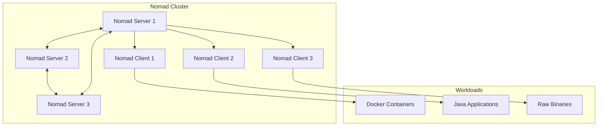
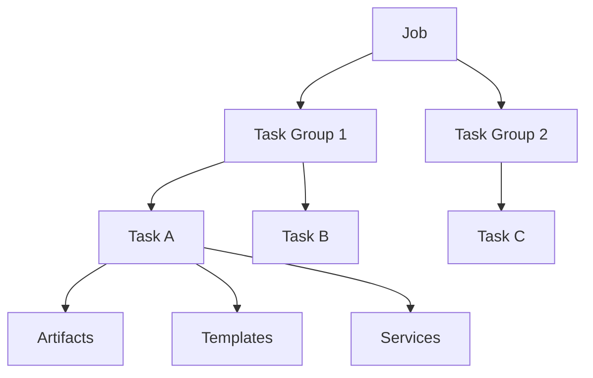

# How to Get Started with HashiCorp Nomad

Author: [nawazdhandala](https://www.github.com/nawazdhandala)

Tags: Nomad, HashiCorp, Container Orchestration, DevOps, Infrastructure, Workload Scheduling

Description: A practical guide to getting started with HashiCorp Nomad for workload orchestration. Learn how to install, configure, and deploy your first containerized applications with Nomad.

---

HashiCorp Nomad is a flexible workload orchestrator that can deploy and manage containers, non-containerized applications, and batch jobs across your infrastructure. Unlike Kubernetes, which focuses solely on containers, Nomad can schedule VMs, Java applications, raw binaries, and more alongside your Docker workloads.

This guide walks you through installing Nomad, setting up a cluster, and deploying your first applications with real, working examples.

## Why Choose Nomad?

Before diving into the technical setup, let's understand when Nomad makes sense:

- **Simplicity**: Nomad is a single binary with minimal dependencies. You can get a cluster running in minutes.
- **Flexibility**: Schedule Docker containers, Java JARs, raw executables, or even Windows applications.
- **Multi-region**: Built-in support for federating clusters across datacenters and cloud providers.
- **Integration**: Works seamlessly with Consul for service discovery and Vault for secrets management.



## Prerequisites

Before starting, make sure you have:

- A Linux server (Ubuntu 20.04 or later recommended)
- Root or sudo access
- At least 2GB RAM and 2 CPU cores
- Docker installed (for running container workloads)

## Installing Nomad

### Option 1: Using the HashiCorp Repository (Recommended)

```bash
# Install required packages
sudo apt update
sudo apt install -y curl gnupg software-properties-common

# Add the HashiCorp GPG key
curl -fsSL https://apt.releases.hashicorp.com/gpg | sudo gpg --dearmor -o /usr/share/keyrings/hashicorp-archive-keyring.gpg

# Add the HashiCorp repository
echo "deb [signed-by=/usr/share/keyrings/hashicorp-archive-keyring.gpg] https://apt.releases.hashicorp.com $(lsb_release -cs) main" | sudo tee /etc/apt/sources.list.d/hashicorp.list

# Install Nomad
sudo apt update
sudo apt install -y nomad

# Verify the installation
nomad version
```

### Option 2: Manual Binary Installation

```bash
# Download the latest version (check releases.hashicorp.com for current version)
NOMAD_VERSION="1.7.3"
wget https://releases.hashicorp.com/nomad/${NOMAD_VERSION}/nomad_${NOMAD_VERSION}_linux_amd64.zip

# Unzip and install
unzip nomad_${NOMAD_VERSION}_linux_amd64.zip
sudo mv nomad /usr/local/bin/

# Verify installation
nomad version
```

## Running Nomad in Development Mode

The quickest way to start experimenting with Nomad is development mode. This runs both server and client on a single node with no persistent state.

```bash
# Start Nomad in development mode
sudo nomad agent -dev

# In another terminal, check the node status
nomad node status

# Check server members
nomad server members
```

The dev agent listens on `http://localhost:4646` where you can access the web UI.

## Production Configuration

For production, you need to configure Nomad properly with separate server and client roles.

### Server Configuration

Create the configuration directory and file:

```bash
# Create directories
sudo mkdir -p /etc/nomad.d
sudo mkdir -p /opt/nomad/data
```

Create the server configuration at `/etc/nomad.d/server.hcl`:

```hcl
# /etc/nomad.d/server.hcl

# Data directory for Nomad state
data_dir = "/opt/nomad/data"

# Bind to all interfaces
bind_addr = "0.0.0.0"

# Server-specific configuration
server {
  # Enable server mode
  enabled = true

  # Number of servers in the cluster (3 or 5 for production)
  bootstrap_expect = 3

  # Encrypt gossip communication (generate with: nomad operator gossip keyring generate)
  encrypt = "your-gossip-encryption-key"
}

# Enable the ACL system for production
acl {
  enabled = true
}

# Telemetry for monitoring
telemetry {
  publish_allocation_metrics = true
  publish_node_metrics       = true
  prometheus_metrics         = true
}

# Advertise addresses for multi-node setup
advertise {
  http = "{{ GetInterfaceIP \"eth0\" }}"
  rpc  = "{{ GetInterfaceIP \"eth0\" }}"
  serf = "{{ GetInterfaceIP \"eth0\" }}"
}
```

### Client Configuration

Create the client configuration at `/etc/nomad.d/client.hcl`:

```hcl
# /etc/nomad.d/client.hcl

# Data directory
data_dir = "/opt/nomad/data"

# Bind to all interfaces
bind_addr = "0.0.0.0"

# Client-specific configuration
client {
  enabled = true

  # Servers to join (use actual IPs in production)
  servers = ["10.0.0.1:4647", "10.0.0.2:4647", "10.0.0.3:4647"]

  # Node class for scheduling constraints
  node_class = "worker"

  # Meta information for scheduling
  meta {
    datacenter = "dc1"
    region     = "us-east"
  }

  # Host volumes for persistent storage
  host_volume "data" {
    path      = "/opt/nomad/volumes/data"
    read_only = false
  }
}

# Enable Docker driver
plugin "docker" {
  config {
    # Allow privileged containers if needed
    allow_privileged = false

    # Volume configuration
    volumes {
      enabled = true
    }
  }
}

# Enable raw_exec driver (use with caution)
plugin "raw_exec" {
  config {
    enabled = true
  }
}
```

### Create Systemd Service

Create `/etc/systemd/system/nomad.service`:

```ini
[Unit]
Description=HashiCorp Nomad
Documentation=https://nomadproject.io/docs/
Wants=network-online.target
After=network-online.target

[Service]
ExecStart=/usr/bin/nomad agent -config=/etc/nomad.d
ExecReload=/bin/kill -HUP $MAINPID
KillMode=process
KillSignal=SIGINT
LimitNOFILE=65536
LimitNPROC=infinity
Restart=on-failure
RestartSec=2
TasksMax=infinity

[Install]
WantedBy=multi-user.target
```

Start the service:

```bash
# Reload systemd and start Nomad
sudo systemctl daemon-reload
sudo systemctl start nomad
sudo systemctl enable nomad

# Check status
sudo systemctl status nomad
```

## Understanding Job Specifications

Nomad uses a declarative job specification format. Here is the hierarchy:



- **Job**: The top-level workload definition
- **Task Group**: A set of tasks that run together on the same node
- **Task**: A single unit of work (a container, binary, or script)

## Deploying Your First Application

Let's deploy a simple web application using Docker.

### Basic Web Server Job

Create a file called `web.nomad.hcl`:

```hcl
# web.nomad.hcl - A simple web server deployment

job "web" {
  # Run in the default datacenter
  datacenters = ["dc1"]

  # Service type job (long-running)
  type = "service"

  # Update strategy for zero-downtime deployments
  update {
    # Deploy one allocation at a time
    max_parallel = 1

    # Wait 30 seconds before considering healthy
    min_healthy_time = "30s"

    # Maximum time for deployment
    healthy_deadline = "5m"

    # Automatically revert on failure
    auto_revert = true

    # Enable canary deployments
    canary = 1
  }

  group "app" {
    # Run 3 instances
    count = 3

    # Networking configuration
    network {
      port "http" {
        # Dynamic port allocation
        to = 80
      }
    }

    # Restart policy for failed tasks
    restart {
      attempts = 3
      interval = "5m"
      delay    = "15s"
      mode     = "fail"
    }

    # Service registration (works with Consul)
    service {
      name = "web"
      port = "http"

      # Health check
      check {
        type     = "http"
        path     = "/"
        interval = "10s"
        timeout  = "2s"
      }

      # Tags for routing
      tags = ["urlprefix-/web"]
    }

    task "nginx" {
      # Use Docker driver
      driver = "docker"

      config {
        # Use official nginx image
        image = "nginx:alpine"

        # Map the dynamic port
        ports = ["http"]
      }

      # Resource constraints
      resources {
        cpu    = 100  # MHz
        memory = 128  # MB
      }
    }
  }
}
```

Deploy the job:

```bash
# Validate the job file
nomad job validate web.nomad.hcl

# Plan the deployment (dry run)
nomad job plan web.nomad.hcl

# Run the job
nomad job run web.nomad.hcl

# Check job status
nomad job status web

# View allocations
nomad alloc status <allocation-id>
```

## Deploying a Multi-Container Application

Let's deploy a more realistic application with a web frontend and Redis backend.

Create `app-stack.nomad.hcl`:

```hcl
# app-stack.nomad.hcl - Multi-container application

job "app-stack" {
  datacenters = ["dc1"]
  type        = "service"

  # Redis backend group
  group "cache" {
    count = 1

    network {
      port "redis" {
        static = 6379
      }
    }

    service {
      name = "redis"
      port = "redis"

      check {
        type     = "tcp"
        port     = "redis"
        interval = "10s"
        timeout  = "2s"
      }
    }

    task "redis" {
      driver = "docker"

      config {
        image = "redis:7-alpine"
        ports = ["redis"]

        # Persist data using host volume
        volumes = [
          "local/data:/data"
        ]

        # Redis configuration
        args = [
          "redis-server",
          "--appendonly", "yes"
        ]
      }

      resources {
        cpu    = 200
        memory = 256
      }
    }
  }

  # Web application group
  group "web" {
    count = 2

    network {
      port "http" {
        to = 5000
      }
    }

    service {
      name = "web-app"
      port = "http"

      check {
        type     = "http"
        path     = "/health"
        interval = "10s"
        timeout  = "3s"
      }
    }

    task "app" {
      driver = "docker"

      config {
        image = "my-flask-app:latest"
        ports = ["http"]
      }

      # Environment variables
      env {
        FLASK_ENV = "production"
      }

      # Template for dynamic configuration
      template {
        # Query Consul for Redis address
        data = <<EOF
REDIS_HOST={{ range service "redis" }}{{ .Address }}{{ end }}
REDIS_PORT={{ range service "redis" }}{{ .Port }}{{ end }}
EOF
        destination = "secrets/env.txt"
        env         = true
      }

      resources {
        cpu    = 300
        memory = 512
      }
    }
  }
}
```

## Running Batch Jobs

Nomad excels at running batch jobs and scheduled tasks.

Create `backup.nomad.hcl`:

```hcl
# backup.nomad.hcl - Scheduled backup job

job "database-backup" {
  datacenters = ["dc1"]

  # Batch job type
  type = "batch"

  # Run every day at 2 AM
  periodic {
    cron             = "0 2 * * *"
    prohibit_overlap = true
    time_zone        = "UTC"
  }

  group "backup" {
    task "dump" {
      driver = "docker"

      config {
        image   = "postgres:15-alpine"
        command = "/bin/sh"
        args    = ["-c", "pg_dump -h $DB_HOST -U $DB_USER $DB_NAME > /backup/dump-$(date +%Y%m%d).sql"]

        volumes = [
          "/opt/backups:/backup"
        ]
      }

      # Pull secrets from Vault
      template {
        data = <<EOF
{{ with secret "database/creds/backup" }}
DB_HOST={{ .Data.host }}
DB_USER={{ .Data.username }}
DB_PASSWORD={{ .Data.password }}
DB_NAME={{ .Data.database }}
{{ end }}
EOF
        destination = "secrets/db.env"
        env         = true
      }

      resources {
        cpu    = 500
        memory = 1024
      }
    }
  }
}
```

## Useful Nomad Commands

Here are the commands you will use most often:

```bash
# Job management
nomad job run job.nomad.hcl      # Deploy a job
nomad job stop web               # Stop a job
nomad job status web             # View job status
nomad job history web            # View deployment history

# Allocation management
nomad alloc status <alloc-id>    # View allocation details
nomad alloc logs <alloc-id>      # View task logs
nomad alloc exec <alloc-id> sh   # Execute command in allocation

# Cluster management
nomad node status                # List all nodes
nomad node drain <node-id>       # Drain node for maintenance
nomad server members             # List server members

# Monitoring
nomad operator raft list-peers   # Check Raft cluster health
nomad system gc                  # Garbage collect old allocations
```

## Integrating with Consul for Service Discovery

Nomad works best with Consul for service discovery. When Consul is available, Nomad automatically registers services.

```hcl
# Add to your Nomad client configuration
consul {
  # Consul agent address
  address = "127.0.0.1:8500"

  # Enable service registration
  auto_advertise = true

  # Use Consul for server discovery
  server_auto_join = true
  client_auto_join = true
}
```

Then your services can discover each other:

```hcl
template {
  data = <<EOF
{{ range service "redis" }}
REDIS_URL=redis://{{ .Address }}:{{ .Port }}
{{ end }}
EOF
  destination = "local/config.env"
  env         = true
}
```

## Monitoring Nomad

Nomad exposes Prometheus metrics for monitoring:

```bash
# Access metrics endpoint
curl http://localhost:4646/v1/metrics?format=prometheus
```

Key metrics to watch:

- `nomad_client_allocations_running` - Number of running allocations
- `nomad_client_allocated_cpu` - CPU allocated to tasks
- `nomad_client_allocated_memory` - Memory allocated to tasks
- `nomad_raft_leader` - Indicates if node is Raft leader

## Troubleshooting Common Issues

### Jobs Stuck in Pending State

```bash
# Check allocation status for reasons
nomad alloc status <alloc-id>

# Common causes:
# - Insufficient resources (check node status)
# - Constraint failures (check job constraints)
# - Driver issues (check Docker is running)
```

### Task Failures

```bash
# View task logs
nomad alloc logs <alloc-id> <task-name>

# View task events
nomad alloc status -verbose <alloc-id>
```

### Connectivity Issues

```bash
# Verify server connectivity
nomad server members

# Check node connectivity
nomad node status -verbose <node-id>

# Verify ports are open
ss -tlnp | grep nomad
```

## Next Steps

Now that you have Nomad running, consider these next steps:

1. **Set up Consul** for service discovery and health checking
2. **Configure Vault** for secrets management
3. **Enable ACLs** for production security
4. **Add more clients** to scale your cluster
5. **Implement monitoring** with Prometheus and Grafana

---

HashiCorp Nomad provides a simpler alternative to Kubernetes for workload orchestration without sacrificing power or flexibility. Its single-binary deployment and ability to schedule diverse workloads make it an excellent choice for teams that need container orchestration without the complexity overhead. For monitoring your Nomad deployments, consider using OneUptime to track cluster health, job status, and application performance metrics.
