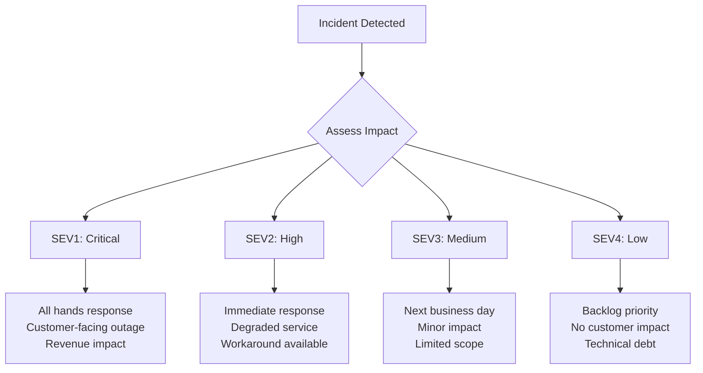
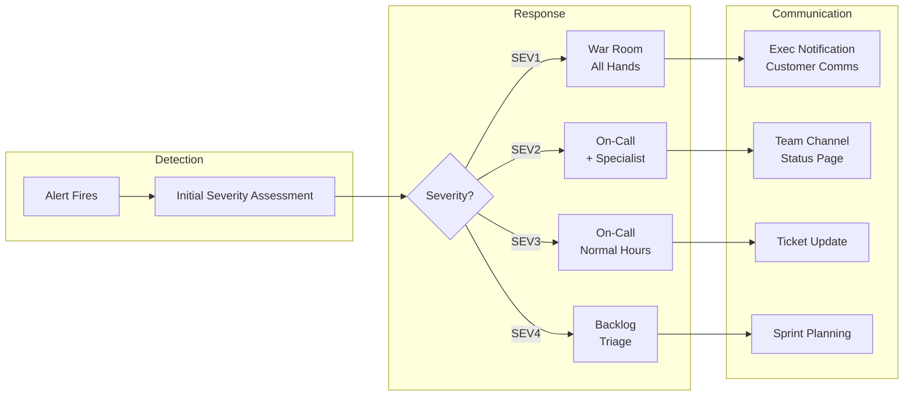

# How to Implement Incident Severity Levels

Author: [nawazdhandala](https://www.github.com/nawazdhandala)

Tags: Incident Management, SRE, Reliability, On-Call, Incident Response

Description: A practical guide to implementing incident severity levels that work for your team. Learn how to define, communicate, and operationalize severity classifications to improve incident response times and reduce alert fatigue.

Every engineering team eventually faces the same problem: an alert fires at 3 AM, and the on-call engineer has no idea if it requires immediate action or can wait until morning. Without clear severity levels, every incident feels equally urgent, leading to burnout, missed critical issues, and a team that stops trusting their alerting system.

Implementing effective incident severity levels is not just about creating a document with definitions. It is about building a shared understanding across your organization that drives consistent decision-making during stressful situations.

## Why Severity Levels Matter

Before diving into implementation, let us understand the problems that well-defined severity levels solve:

**Prioritization under pressure**: When multiple incidents occur simultaneously, severity levels help teams decide where to focus first.

**Communication alignment**: Product managers, executives, and engineers all have different mental models of "critical." Severity levels create a common language.

**Resource allocation**: High-severity incidents might require all hands on deck, while lower severity issues can be handled during business hours.

**Metrics and reporting**: Tracking incidents by severity helps identify patterns and measure improvement over time.

**Reduced alert fatigue**: When everything is critical, nothing is critical. Proper severity levels help on-call engineers trust their alerts.

## The Standard Four-Level Framework

Most organizations settle on four severity levels. This strikes a balance between granularity and simplicity. Here is a framework that works well for most teams:

### SEV1 - Critical

**Definition**: Complete service outage or security breach affecting all or most users.

**Impact criteria**:
- Production environment is completely unavailable
- Data loss or corruption is occurring
- Security breach with active exploitation
- Core business functionality is broken
- Revenue-generating features are non-functional

**Response expectations**:
- Immediate notification to all relevant stakeholders
- All available engineers engaged within 15 minutes
- Continuous status updates every 30 minutes
- Post-incident review mandatory within 48 hours

**Real-world example**: Your payment processing system stops accepting transactions. Customers cannot complete purchases. Revenue is actively being lost.

### SEV2 - High

**Definition**: Major functionality degraded but service is partially available.

**Impact criteria**:
- Significant feature is broken for a subset of users
- Performance degradation affecting user experience
- Workarounds exist but are not sustainable
- Secondary systems are down (search, recommendations)
- Partner integrations are failing

**Response expectations**:
- On-call engineer responds within 30 minutes
- Escalation to specialists if not resolved in 2 hours
- Status updates every hour
- Post-incident review within one week

**Real-world example**: Your search feature returns incomplete results. Users can still browse manually, but the experience is significantly degraded.

### SEV3 - Medium

**Definition**: Minor functionality impacted with limited user impact.

**Impact criteria**:
- Single customer or small group affected
- Non-critical feature is broken
- Easy workaround available
- Internal tooling issues
- Monitoring or alerting gaps

**Response expectations**:
- Addressed during next business day
- Can be triaged and prioritized with regular work
- Status updates as progress is made
- Lightweight review for patterns

**Real-world example**: A specific customer reports they cannot export reports in CSV format, but PDF export works fine.

### SEV4 - Low

**Definition**: Minimal impact, often improvement opportunities or technical debt.

**Impact criteria**:
- No direct user impact
- Cosmetic issues
- Documentation gaps
- Performance improvements
- Code quality concerns

**Response expectations**:
- Added to backlog for prioritization
- Addressed when bandwidth allows
- May be bundled with related work

**Real-world example**: A log message contains a typo, or a non-critical endpoint has higher than ideal latency.

## Determining Severity: The Decision Matrix

Abstract definitions only get you so far. Teams need concrete criteria to make consistent decisions. Here is a practical decision matrix:

| Factor | SEV1 | SEV2 | SEV3 | SEV4 |
|--------|------|------|------|------|
| Users Affected | >50% | 10-50% | <10% | None |
| Revenue Impact | Direct loss | Potential loss | Minimal | None |
| Data Risk | Loss/breach | Potential risk | None | None |
| Workaround | None | Difficult | Easy | N/A |
| Time Sensitivity | Immediate | Hours | Days | Weeks |

When multiple factors point to different severities, use the highest severity indicated. It is better to over-respond initially and downgrade than to under-respond to a serious issue.

## Implementation Checklist

Implementing severity levels is more than writing definitions. Here is a step-by-step approach:

### Step 1: Audit Current State

Before creating new definitions, understand how your team currently handles incidents:

- Review the last 20 incidents and how they were prioritized
- Interview on-call engineers about their decision-making process
- Identify inconsistencies in how similar incidents were handled
- Note any incidents where response time was inappropriate for actual impact

### Step 2: Draft Initial Definitions

Start with the four-level framework above and customize for your context:

- Replace generic examples with incidents from your own history
- Add specific metrics that apply to your services (error rates, latency thresholds)
- Include domain-specific criteria (compliance requirements, SLA obligations)
- Define severity for common incident types you experience

### Step 3: Validate with Stakeholders

Severity levels affect multiple teams. Get input from:

- Engineering leadership for technical criteria
- Product management for business impact assessment
- Customer support for user impact visibility
- Legal or compliance for regulatory requirements

### Step 4: Build into Your Tools

Severity levels only work if they are easy to use:

- Add severity as a required field in your incident management tool
- Create alert rules that suggest initial severity based on alert type
- Build dashboards that filter by severity
- Set up notification routing based on severity

### Step 5: Train Your Team

Roll out with proper education:

- Present the framework in a team meeting
- Walk through real incidents and discuss appropriate severity
- Create a reference card or cheat sheet for quick access
- Run tabletop exercises with hypothetical scenarios

### Step 6: Iterate Based on Feedback

No framework is perfect on the first try:

- Review severity assignments in post-incident reviews
- Track how often severity changes during an incident
- Collect feedback from on-call engineers
- Update definitions quarterly based on learnings

## Common Pitfalls to Avoid

### Pitfall 1: Too Many Levels

Some organizations try to create five, six, or even seven severity levels. This creates analysis paralysis. When someone is deciding between SEV3 and SEV4 at 2 AM, they are not focusing on fixing the problem.

### Pitfall 2: Severity Inflation

Over time, teams tend to escalate everything to higher severities to ensure faster response. Combat this by:

- Reviewing severity assignments in post-incident reviews
- Tracking severity distribution over time
- Addressing root causes of response time concerns

### Pitfall 3: Ignoring Low Severities

The opposite problem: if low-severity issues never get addressed, they accumulate and eventually cause high-severity incidents. Allocate regular time for SEV3 and SEV4 remediation.

### Pitfall 4: Static Definitions

Your services and business change. Severity definitions should be living documents that evolve. What was SEV3 last year might be SEV2 now as you have grown.

### Pitfall 5: Severity as Blame

Severity should describe impact, not assign fault. A SEV1 incident is not inherently someone's failure. If severity becomes tied to blame, engineers will avoid accurate assessments.

## Integrating with Incident Response

Severity levels should drive your entire incident response process:

### Notification Routing

Configure your alerting system to notify different channels based on severity:

- **SEV1**: Page on-call engineer, notify incident commander, alert engineering leadership, update status page
- **SEV2**: Page on-call engineer, notify team channel
- **SEV3**: Create ticket, notify team channel during business hours
- **SEV4**: Create ticket for triage

### Escalation Rules

Define clear escalation paths:

- SEV1 not acknowledged in 5 minutes - escalate to backup on-call
- SEV1 not resolved in 30 minutes - escalate to engineering manager
- SEV2 not resolved in 2 hours - escalate to team lead
- Any severity can be escalated by the responder if they need help

## Measuring Success

Track these metrics to evaluate your severity framework:

**Severity accuracy**: How often is initial severity correct versus changed during the incident? High change rates suggest unclear definitions.

**Time to acknowledge by severity**: Are higher severities getting faster responses? If SEV1 and SEV2 have similar response times, your routing may be broken.

**Severity distribution**: A healthy distribution might be 5% SEV1, 15% SEV2, 40% SEV3, 40% SEV4. If 50% of incidents are SEV1, you have an inflation problem.

**Recurrence by severity**: Are you seeing repeat incidents at each severity level? High recurrence at SEV1 and SEV2 indicates inadequate remediation.

## Real-World Example: Implementing at a Growing Startup

Let me share a realistic implementation scenario. Imagine a B2B SaaS company with 50 engineers and 500 customers.

**Before**: Incidents were labeled "urgent" or "not urgent." On-call engineers used gut feeling to decide when to escalate. Some 3 AM pages were for log volume warnings. Some daytime tickets turned out to be customer-facing outages.

**Implementation approach**:

1. Reviewed three months of incidents and categorized them retroactively
2. Found that 60% of "urgent" incidents had minimal customer impact
3. Created four-level framework with customer-specific criteria (enterprise customers get higher weight)
4. Added severity to PagerDuty and Jira workflows
5. Trained team over two sprint retrospectives
6. Adjusted thresholds after first month based on feedback

**After six months**:
- 3 AM pages reduced by 40%
- Mean time to resolve SEV1 improved by 25%
- On-call satisfaction scores increased
- Leadership has clear visibility into incident trends

## Conclusion

Incident severity levels are fundamental to effective incident management. They create shared understanding, enable appropriate resource allocation, and reduce the stress of incident response.

The key is to start simple, customize for your context, and iterate based on real-world feedback. Do not aim for perfection on day one. A basic framework that your team actually uses is infinitely better than a sophisticated framework that sits in a document nobody reads.

Begin with the four-level framework outlined here, adapt the criteria to your specific services and business context, and commit to reviewing and improving your definitions regularly. Your on-call engineers and your customers will thank you.

For more on incident management, check out our guides on [Effective Incident Postmortem Templates](https://oneuptime.com/blog/post/2025-09-09-effective-incident-postmortem-templates-ready-to-use-examples/view) and [What is MTTR, MTTD, MTBF and More](https://oneuptime.com/blog/post/2025-09-04-what-is-mttr-mttd-mtbf-and-more/view).
