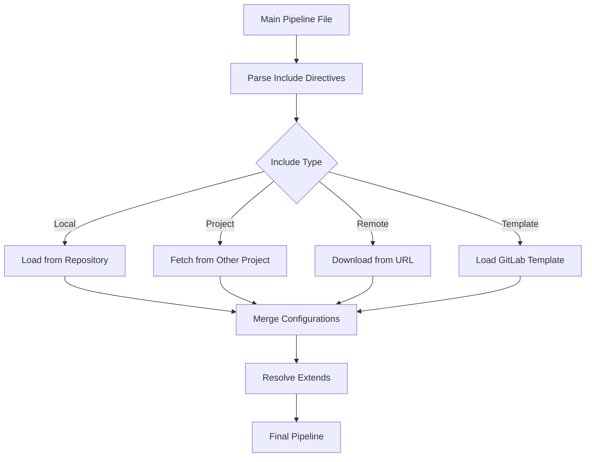

# How to Use Include Templates in GitLab CI

Author: [nawazdhandala](https://www.github.com/nawazdhandala)

Tags: GitLab CI, Templates, Include, CI/CD, Code Reuse, DevOps

Description: Learn how to use GitLab CI include templates to share pipeline configurations across projects, reduce duplication, and maintain consistency in your CI/CD workflows.

---

Copy-pasting pipeline configurations across projects creates maintenance nightmares. When you need to update a security scan or deployment process, you end up editing dozens of files. GitLab CI's include feature lets you extract common configurations into reusable templates. This guide shows you how to build and use templates effectively.

## Understanding Include Types

GitLab CI supports several include methods, each suited for different scenarios.

Local includes pull from the same repository. Remote includes fetch from any URL. Template includes use GitLab's built-in templates. Project includes reference files in other GitLab projects.

## Local Includes

Start by extracting common jobs into separate files within your repository.

```yaml
# .gitlab-ci.yml
include:
  - local: '/.gitlab/ci/build.yml'
  - local: '/.gitlab/ci/test.yml'
  - local: '/.gitlab/ci/deploy.yml'

stages:
  - build
  - test
  - deploy

variables:
  APP_NAME: "my-service"
```

```yaml
# .gitlab/ci/build.yml
build:
  stage: build
  image: node:20
  script:
    - npm ci
    - npm run build
  artifacts:
    paths:
      - dist/
```

```yaml
# .gitlab/ci/test.yml
test-unit:
  stage: test
  image: node:20
  script:
    - npm ci
    - npm test

test-lint:
  stage: test
  image: node:20
  script:
    - npm ci
    - npm run lint
```

This organization keeps your main pipeline file clean and makes each component easier to maintain.

## Project Includes

Share configurations across multiple projects by referencing files in a central repository.

```yaml
# In your application repository
include:
  - project: 'devops/ci-templates'
    ref: main
    file:
      - '/templates/node-build.yml'
      - '/templates/docker-deploy.yml'

variables:
  NODE_VERSION: "20"
  DOCKER_REGISTRY: "registry.example.com"
```

In the `devops/ci-templates` repository:

```yaml
# /templates/node-build.yml
.node-build:
  image: node:${NODE_VERSION:-20}
  cache:
    key:
      files:
        - package-lock.json
    paths:
      - node_modules/
  before_script:
    - npm ci

build:
  extends: .node-build
  stage: build
  script:
    - npm run build
  artifacts:
    paths:
      - dist/
```

The `ref` parameter lets you pin to a specific branch, tag, or commit for stability.

## Remote Includes

Include templates from any HTTP URL.

```yaml
include:
  - remote: 'https://raw.githubusercontent.com/your-org/ci-templates/main/templates/security-scan.yml'
```

Remote includes work well for public templates or when GitLab project access isn't available. However, they're slower and less secure than project includes since GitLab can't verify the content.

## GitLab's Built-in Templates

GitLab provides official templates for common tasks.

```yaml
include:
  # Security scanning
  - template: Security/SAST.gitlab-ci.yml
  - template: Security/Secret-Detection.gitlab-ci.yml

  # Code quality
  - template: Code-Quality.gitlab-ci.yml

  # Container scanning
  - template: Security/Container-Scanning.gitlab-ci.yml
```

These templates add jobs automatically configured for their purpose. Browse available templates at GitLab's documentation or in the repository at `https://gitlab.com/gitlab-org/gitlab/-/tree/master/lib/gitlab/ci/templates`.

## Building Reusable Templates

Create templates that consumers can customize.

```yaml
# /templates/deploy-kubernetes.yml
# Base template for Kubernetes deployments
.deploy-k8s:
  image:
    name: bitnami/kubectl:latest
    entrypoint: [""]
  variables:
    KUBE_NAMESPACE: ""
    DEPLOYMENT_NAME: ""
    CONTAINER_IMAGE: ""
  before_script:
    # Configure kubectl from environment
    - kubectl config use-context ${KUBE_CONTEXT}
  script:
    - kubectl -n ${KUBE_NAMESPACE} set image deployment/${DEPLOYMENT_NAME} app=${CONTAINER_IMAGE}
    - kubectl -n ${KUBE_NAMESPACE} rollout status deployment/${DEPLOYMENT_NAME} --timeout=300s

# Staging preset
.deploy-staging:
  extends: .deploy-k8s
  variables:
    KUBE_CONTEXT: "staging-cluster"
    KUBE_NAMESPACE: "staging"
  environment:
    name: staging
    url: https://staging.example.com

# Production preset
.deploy-production:
  extends: .deploy-k8s
  variables:
    KUBE_CONTEXT: "production-cluster"
    KUBE_NAMESPACE: "production"
  environment:
    name: production
    url: https://example.com
  when: manual
```

Consumers use these templates by extending them:

```yaml
include:
  - project: 'devops/ci-templates'
    file: '/templates/deploy-kubernetes.yml'

deploy-staging:
  extends: .deploy-staging
  variables:
    DEPLOYMENT_NAME: "my-api"
    CONTAINER_IMAGE: "${CI_REGISTRY_IMAGE}:${CI_COMMIT_SHA}"

deploy-production:
  extends: .deploy-production
  variables:
    DEPLOYMENT_NAME: "my-api"
    CONTAINER_IMAGE: "${CI_REGISTRY_IMAGE}:${CI_COMMIT_SHA}"
```

## Template Composition Pattern

Build complex templates from smaller components.

```yaml
# /templates/components/cache.yml
.npm-cache:
  cache:
    key:
      files:
        - package-lock.json
    paths:
      - node_modules/

# /templates/components/artifacts.yml
.build-artifacts:
  artifacts:
    paths:
      - dist/
    expire_in: 1 week

# /templates/node-pipeline.yml
include:
  - local: '/templates/components/cache.yml'
  - local: '/templates/components/artifacts.yml'

.node-build:
  extends:
    - .npm-cache
    - .build-artifacts
  image: node:20
  script:
    - npm ci
    - npm run build
```

Small, focused components are easier to test and maintain than monolithic templates.

## Include Flow

Here's how includes are processed:



## Variable Scoping in Templates

Templates can define default variables that consumers override.

```yaml
# Template with defaults
.docker-build:
  variables:
    DOCKER_BUILDKIT: "1"
    DOCKERFILE_PATH: "Dockerfile"
    BUILD_CONTEXT: "."
  script:
    - docker build -f ${DOCKERFILE_PATH} -t ${IMAGE_TAG} ${BUILD_CONTEXT}
```

```yaml
# Consumer overriding defaults
build-frontend:
  extends: .docker-build
  variables:
    DOCKERFILE_PATH: "docker/frontend.Dockerfile"
    BUILD_CONTEXT: "./frontend"
    IMAGE_TAG: "${CI_REGISTRY_IMAGE}/frontend:${CI_COMMIT_SHA}"
```

Job-level variables take precedence over template variables.

## Versioning Templates

Use Git tags to version your templates and provide stability.

```yaml
include:
  # Pin to specific version
  - project: 'devops/ci-templates'
    ref: v2.1.0
    file: '/templates/deploy.yml'
```

Maintain a changelog in your template repository:

```markdown
# Changelog

## v2.1.0
- Added support for blue-green deployments
- Fixed caching issue in node-build template

## v2.0.0
- Breaking: Renamed DEPLOY_ENV to ENVIRONMENT_NAME
- Added Kubernetes deployment templates
```

## Conditional Includes

Include files based on conditions using rules.

```yaml
include:
  - local: '/.gitlab/ci/base.yml'

  # Include security scanning only on protected branches
  - local: '/.gitlab/ci/security.yml'
    rules:
      - if: $CI_COMMIT_REF_PROTECTED == "true"

  # Include deployment only for specific projects
  - local: '/.gitlab/ci/deploy.yml'
    rules:
      - if: $CI_PROJECT_PATH =~ /^production\//
```

Conditional includes help reduce pipeline complexity when certain features aren't needed.

## Debugging Include Issues

When includes don't work as expected, use GitLab's CI Lint tool.

Navigate to your project's CI/CD, then Editor, then click "View merged YAML". This shows the fully resolved pipeline configuration after all includes are processed.

Common issues:

**File not found**: Check the path is relative to the repository root for local includes.

**Circular includes**: GitLab detects and rejects circular dependencies between include files.

**Variable resolution**: Variables in include paths are limited. Use explicit paths when possible.

```yaml
# This works
include:
  - project: 'devops/ci-templates'
    file: '/templates/deploy.yml'

# This might not work as expected
include:
  - project: '${TEMPLATE_PROJECT}'  # Variable expansion limited
    file: '/templates/deploy.yml'
```

## Organizing Template Repositories

Structure your template repository for clarity:

```
ci-templates/
  templates/
    build/
      node.yml
      python.yml
      go.yml
    deploy/
      kubernetes.yml
      serverless.yml
    security/
      sast.yml
      container-scan.yml
    components/
      cache.yml
      artifacts.yml
  examples/
    node-app.yml
    microservice.yml
  README.md
  CHANGELOG.md
```

Include a README with usage examples and a changelog documenting changes between versions.

---

Include templates transform GitLab CI from project-by-project configuration into organization-wide standards. Start by extracting duplicated jobs into a shared repository, then gradually build a library of composable templates. The upfront investment pays dividends every time you need to update a process across all projects.
