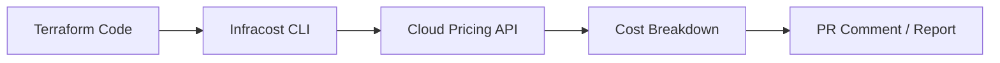
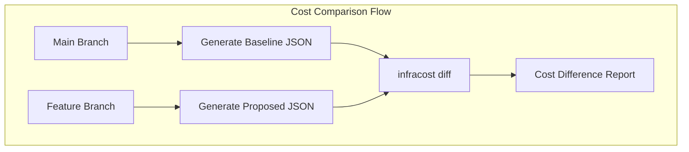
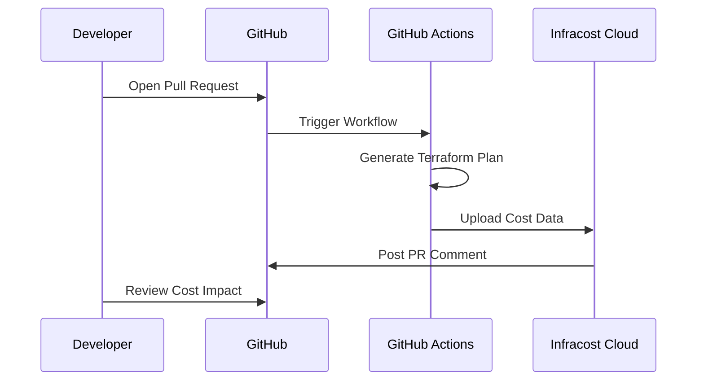
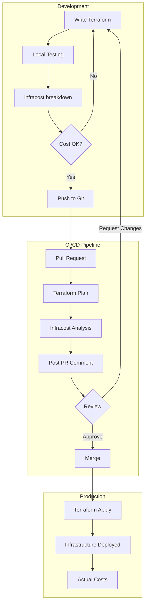

# How to Use Infracost for IaC Cost Estimation

Author: [nawazdhandala](https://www.github.com/nawazdhandala)

Tags: Infracost, FinOps, Terraform, Cost Estimation, Infrastructure as Code

Description: Learn how to use Infracost to estimate infrastructure costs from Terraform code with CI/CD integration and pull request comments.

---

Infrastructure costs can spiral out of control when developers provision resources without visibility into pricing. Infracost solves this by analyzing your Terraform code and showing cost estimates before you deploy. This guide walks through installing Infracost, generating cost breakdowns, and integrating it into your CI/CD pipeline.

## What is Infracost?

Infracost is an open-source tool that estimates cloud costs from Infrastructure as Code (IaC). It parses Terraform plans and calculates monthly costs based on cloud provider pricing APIs. The tool supports AWS, Azure, Google Cloud, and over 1,000 Terraform resources.



## Installing Infracost

Install the Infracost CLI on your development machine. The tool is available for macOS, Linux, and Windows.

### macOS with Homebrew

```bash
# Install Infracost using Homebrew package manager
brew install infracost

# Verify the installation succeeded
infracost --version
```

### Linux

```bash
# Download and run the official installation script
# This installs the latest version to /usr/local/bin
curl -fsSL https://raw.githubusercontent.com/infracost/infracost/master/scripts/install.sh | sh

# Verify installation
infracost --version
```

### Register for an API Key

Infracost requires a free API key to fetch cloud pricing data. Register and authenticate:

```bash
# Register for a free API key
# This opens a browser and saves your key locally
infracost auth login
```

The key is stored in `~/.config/infracost/credentials.yml` and included automatically in future commands.

## Generating Your First Cost Estimate

Navigate to a directory containing Terraform files and run the breakdown command.

### Example Terraform Configuration

Here is a simple AWS infrastructure setup to demonstrate cost estimation:

`main.tf`

```hcl
# Configure the AWS provider
# Infracost will use this region for pricing data
provider "aws" {
  region = "us-east-1"
}

# EC2 instance - Infracost calculates hourly cost * 730 hours/month
resource "aws_instance" "web" {
  ami           = "ami-0c55b159cbfafe1f0"
  instance_type = "t3.medium"  # 2 vCPU, 4 GB RAM

  # EBS root volume pricing is calculated separately
  root_block_device {
    volume_size = 50  # 50 GB gp3 volume
    volume_type = "gp3"
  }

  tags = {
    Name        = "web-server"
    Environment = "production"
  }
}

# RDS instance - includes compute, storage, and IOPS costs
resource "aws_db_instance" "database" {
  identifier        = "app-database"
  engine            = "postgres"
  engine_version    = "15.4"
  instance_class    = "db.t3.medium"   # 2 vCPU, 4 GB RAM
  allocated_storage = 100              # 100 GB storage
  storage_type      = "gp3"

  # Multi-AZ doubles the cost for high availability
  multi_az          = true

  username          = "admin"
  password          = "changeme123"    # Use secrets manager in production
  skip_final_snapshot = true
}

# S3 bucket - costs depend on storage class and request volume
resource "aws_s3_bucket" "assets" {
  bucket = "myapp-assets-bucket"
}

# NAT Gateway - fixed hourly cost plus data processing charges
resource "aws_nat_gateway" "main" {
  allocation_id = aws_eip.nat.id
  subnet_id     = "subnet-12345678"
}

resource "aws_eip" "nat" {
  domain = "vpc"
}
```

### Run Cost Breakdown

Generate a cost breakdown for the Terraform directory:

```bash
# Run infracost breakdown on the current directory
# The --path flag specifies the Terraform root module location
infracost breakdown --path .
```

Sample output:

```
Project: .

 Name                                     Monthly Qty  Unit   Monthly Cost

 aws_db_instance.database
 ├─ Database instance (db.t3.medium, Multi-AZ)   730  hours       $119.72
 ├─ Storage (gp3)                                100  GB            $11.50
 └─ Additional backup storage              Monthly cost depends on usage

 aws_instance.web
 ├─ Instance usage (Linux/UNIX, on-demand, t3.medium) 730  hours  $30.37
 └─ root_block_device
    └─ Storage (gp3)                              50  GB            $4.00

 aws_nat_gateway.main
 ├─ NAT gateway                                  730  hours        $32.85
 └─ Data processed                         Monthly cost depends on usage

 aws_eip.nat
 └─ IP address (if unused)                       730  hours         $3.65

 OVERALL TOTAL                                                    $202.09
```

## Comparing Costs Between Branches

One of the most powerful features is comparing costs between your current state and proposed changes. This helps catch expensive modifications before they reach production.



### Generate Baseline Costs

First, generate a JSON file from your main branch:

```bash
# Checkout main branch and generate baseline costs
git checkout main

# Output costs to JSON format for later comparison
# The --format json flag produces machine-readable output
infracost breakdown --path . --format json --out-file infracost-base.json
```

### Compare with Feature Branch

Switch to your feature branch and compare:

```bash
# Checkout your feature branch with infrastructure changes
git checkout feature/add-redis-cluster

# Compare current branch against the baseline JSON
# This shows cost differences: additions, removals, and changes
infracost diff --path . --compare-to infracost-base.json
```

Sample diff output:

```
Project: .

+ aws_elasticache_replication_group.redis
  ├─ ElastiCache (cache.r6g.large)              +$234.52
  └─ Backup storage                       Monthly cost depends on usage

Monthly cost will increase by $234.52

──────────────────────────────────
Key: + added, ~ changed, - removed
```

## Integrating with GitHub Actions

Automate cost estimation on every pull request. Infracost can post comments showing the cost impact of proposed changes.



### GitHub Actions Workflow

Create a workflow file to run Infracost on pull requests:

`.github/workflows/infracost.yml`

```yaml
# Infracost workflow for pull request cost estimation
# Posts a comment on each PR showing infrastructure cost changes
name: Infracost

on:
  pull_request:
    paths:
      - '**.tf'           # Run when Terraform files change
      - '**.tfvars'       # Run when variable files change

jobs:
  infracost:
    name: Infracost Analysis
    runs-on: ubuntu-latest

    permissions:
      contents: read       # Read repository contents
      pull-requests: write # Post PR comments

    env:
      TF_ROOT: ./terraform  # Path to Terraform files in your repo

    steps:
      # Check out the repository so Infracost can access Terraform files
      - name: Checkout repository
        uses: actions/checkout@v4

      # Install the Infracost CLI tool
      - name: Setup Infracost
        uses: infracost/actions/setup@v3
        with:
          api-key: ${{ secrets.INFRACOST_API_KEY }}

      # Generate baseline costs from the main branch
      # This is used for comparison against the PR changes
      - name: Checkout base branch
        uses: actions/checkout@v4
        with:
          ref: ${{ github.event.pull_request.base.ref }}
          path: base

      - name: Generate Infracost baseline
        run: |
          # Generate cost breakdown for the base branch
          infracost breakdown \
            --path base/${{ env.TF_ROOT }} \
            --format json \
            --out-file /tmp/infracost-base.json

      # Generate costs for the PR branch and compare
      - name: Checkout PR branch
        uses: actions/checkout@v4
        with:
          path: pr

      - name: Generate Infracost diff
        run: |
          # Compare PR branch costs against baseline
          # Output in JSON format for the comment action
          infracost diff \
            --path pr/${{ env.TF_ROOT }} \
            --compare-to /tmp/infracost-base.json \
            --format json \
            --out-file /tmp/infracost-diff.json

      # Post the cost comparison as a PR comment
      # Updates existing comment on subsequent pushes
      - name: Post PR comment
        uses: infracost/actions/comment@v1
        with:
          path: /tmp/infracost-diff.json
          behavior: update  # Update existing comment instead of creating new ones
```

### Required Secrets

Add these secrets to your GitHub repository:

1. `INFRACOST_API_KEY` - Your Infracost API key from registration
2. AWS/Azure/GCP credentials if Terraform needs provider authentication

## GitLab CI Integration

For GitLab users, add this job to your pipeline:

`.gitlab-ci.yml`

```yaml
# Infracost job for merge request cost estimation
infracost:
  stage: test
  image: infracost/infracost:ci-latest

  # Only run on merge requests to avoid unnecessary API calls
  rules:
    - if: $CI_PIPELINE_SOURCE == "merge_request_event"

  variables:
    # Path to your Terraform configuration
    TF_ROOT: ${CI_PROJECT_DIR}/terraform

  script:
    # Fetch the target branch for baseline comparison
    - git fetch origin $CI_MERGE_REQUEST_TARGET_BRANCH_NAME

    # Generate baseline costs from target branch
    - git checkout $CI_MERGE_REQUEST_TARGET_BRANCH_NAME
    - |
      infracost breakdown \
        --path $TF_ROOT \
        --format json \
        --out-file /tmp/infracost-base.json

    # Switch back to source branch
    - git checkout $CI_COMMIT_SHA

    # Generate diff and output for GitLab
    - |
      infracost diff \
        --path $TF_ROOT \
        --compare-to /tmp/infracost-base.json \
        --format json \
        --out-file /tmp/infracost-diff.json

    # Post comment to merge request using GitLab API
    - |
      infracost comment gitlab \
        --path /tmp/infracost-diff.json \
        --repo $CI_PROJECT_PATH \
        --merge-request $CI_MERGE_REQUEST_IID \
        --gitlab-server-url $CI_SERVER_URL \
        --gitlab-token $GITLAB_TOKEN
```

## Setting Cost Policies

Infracost supports policies to enforce cost guardrails. You can fail builds when costs exceed thresholds.

### Policy File

Create a policy file to define cost limits:

`infracost-policy.yml`

```yaml
# Infracost policy configuration
# Defines thresholds that trigger warnings or failures
version: 0.1

policies:
  # Fail if monthly cost increase exceeds $500
  - name: cost-increase-threshold
    description: Block PRs that increase costs by more than $500/month
    resource_type: infracost_total
    condition:
      # Compare the cost difference between baseline and proposed
      # diff returns the monthly cost change (positive = increase)
      diff: "> 500"
    action: deny

  # Warn on large EC2 instance types
  - name: large-instance-warning
    description: Warn when using expensive EC2 instance types
    resource_type: aws_instance
    condition:
      # Match instance types in the compute-optimized or memory-optimized families
      attribute: instance_type
      matches: "^(c6i|r6i|x2)\\."
    action: warn
    message: "Large instance type detected. Consider if this is necessary."

  # Block unencrypted storage
  - name: require-encrypted-volumes
    description: All EBS volumes must be encrypted
    resource_type: aws_ebs_volume
    condition:
      attribute: encrypted
      equals: false
    action: deny
    message: "EBS volumes must be encrypted for compliance."
```

### Running with Policies

Apply the policy during your breakdown or diff:

```bash
# Run breakdown with policy enforcement
# The --policy-path flag loads your policy configuration
infracost breakdown --path . --policy-path infracost-policy.yml

# Exit code will be non-zero if any deny policies are triggered
echo "Exit code: $?"
```

## Cost Usage Estimation

Some resources have usage-based pricing that Infracost cannot determine from Terraform alone. You can provide usage estimates for more accurate projections.

### Usage File

Create a usage file with expected consumption:

`infracost-usage.yml`

```yaml
# Usage estimates for resources with consumption-based pricing
# These values supplement the static Terraform configuration
version: 0.1

resource_usage:
  # S3 bucket usage estimates
  aws_s3_bucket.assets:
    # Storage estimates in GB
    standard:
      storage_gb: 500                 # 500 GB of standard storage

    # Request estimates per month
    monthly_tier_1_requests: 100000   # PUT, COPY, POST, LIST requests
    monthly_tier_2_requests: 1000000  # GET, SELECT requests

    # Data transfer in GB
    monthly_egress_data_transfer_gb:
      us_east_1: 100                  # 100 GB egress to us-east-1
      worldwide: 50                   # 50 GB egress worldwide

  # NAT Gateway data processing
  aws_nat_gateway.main:
    monthly_data_processed_gb: 500    # 500 GB through NAT gateway

  # Lambda function usage
  aws_lambda_function.api:
    monthly_requests: 5000000         # 5 million invocations
    request_duration_ms: 200          # Average 200ms per invocation

  # RDS additional backup storage
  aws_db_instance.database:
    additional_backup_storage_gb: 50  # 50 GB backup retention
```

### Run with Usage File

Include the usage file in your breakdown:

```bash
# Generate breakdown with usage-based cost estimates
# The --usage-file flag includes your consumption projections
infracost breakdown --path . --usage-file infracost-usage.yml
```

## Architecture Overview

Here is how Infracost fits into a typical infrastructure workflow:



## Best Practices

### 1. Run Locally Before Pushing

Always check costs on your machine before opening a pull request:

```bash
# Quick local check before committing
infracost breakdown --path . --format table
```

### 2. Use Terragrunt Support

Infracost supports Terragrunt out of the box:

```bash
# Run on Terragrunt configurations
# Infracost automatically detects terragrunt.hcl files
infracost breakdown --path ./live/production
```

### 3. Generate Multiple Formats

Export costs in different formats for reporting:

```bash
# HTML report for stakeholders
infracost breakdown --path . --format html --out-file cost-report.html

# JSON for programmatic processing
infracost breakdown --path . --format json --out-file costs.json

# Slack-formatted output
infracost breakdown --path . --format slack
```

### 4. Cache Pricing Data

Speed up CI runs by caching the pricing database:

```yaml
# GitHub Actions caching example
- name: Cache Infracost pricing data
  uses: actions/cache@v4
  with:
    path: ~/.config/infracost
    key: infracost-pricing-${{ runner.os }}
```

### 5. Set Up Alerts

Configure Infracost Cloud to alert when costs exceed thresholds:

```bash
# Upload results to Infracost Cloud for tracking
infracost breakdown --path . --format json | infracost upload --path -
```

## Troubleshooting

### Missing Resource Costs

If a resource shows "Monthly cost depends on usage," provide a usage file with estimates or check if the resource type is supported:

```bash
# List all supported resources
infracost list
```

### Authentication Errors

Ensure your API key is configured:

```bash
# Check current configuration
infracost configure get api_key

# Re-authenticate if needed
infracost auth login
```

### Terraform Version Mismatch

Specify the Terraform version if Infracost uses a different default:

```bash
# Use a specific Terraform version
INFRACOST_TERRAFORM_BINARY=/usr/local/bin/terraform-1.5 infracost breakdown --path .
```

## Conclusion

Infracost brings cost visibility into your infrastructure development workflow. By estimating costs from Terraform code, you catch expensive changes before they reach production. The CI/CD integration ensures every pull request includes cost impact, making FinOps a natural part of code review.

Start with local breakdowns to understand your current infrastructure costs, then add the GitHub Actions or GitLab CI integration to automate cost checks on every pull request. Use policies to enforce guardrails and usage files for accurate consumption-based estimates.

The shift-left approach to cloud costs saves money and prevents surprises in your monthly bill.
