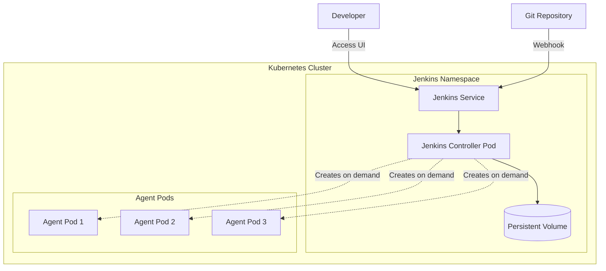

# How to Set Up Jenkins on Kubernetes

Author: [nawazdhandala](https://www.github.com/nawazdhandala)

Tags: Jenkins, Kubernetes, CI/CD, DevOps, Helm, Automation

Description: A complete guide to deploying Jenkins on Kubernetes using Helm, including persistent storage configuration, agent pods, pipeline setup, and production-ready best practices.

---

> Running Jenkins on Kubernetes gives you automatic scaling of build agents, self-healing infrastructure, and simplified maintenance. This guide walks through the complete setup process - from initial deployment to running your first pipeline.

Jenkins remains one of the most popular CI/CD tools, and running it on Kubernetes makes it even more powerful. Instead of manually provisioning build servers, Kubernetes spins up Jenkins agent pods on demand and terminates them when builds complete. This approach saves resources and provides consistent build environments.

---

## Prerequisites

Before we begin, make sure you have:

- A running Kubernetes cluster (Minikube, EKS, GKE, or any other distribution)
- kubectl configured to connect to your cluster
- Helm 3 installed
- At least 2 CPU cores and 4GB RAM available in your cluster

Let's verify your setup:

```bash
# Check kubectl connection
kubectl cluster-info

# Verify Helm installation
helm version

# Check available resources
kubectl top nodes
```

---

## Architecture Overview

Here's how Jenkins runs on Kubernetes:



The Jenkins controller runs as a persistent pod with its data stored on a Persistent Volume. When builds start, the Kubernetes plugin creates agent pods dynamically. These agents connect to the controller, execute the build, and get terminated when done.

---

## Step 1: Create a Namespace

Start by creating a dedicated namespace for Jenkins. This isolates Jenkins resources and makes management easier.

```bash
# Create the jenkins namespace
kubectl create namespace jenkins

# Verify the namespace was created
kubectl get namespaces | grep jenkins
```

---

## Step 2: Install Jenkins Using Helm

Helm makes Jenkins installation straightforward. First, add the Jenkins Helm repository:

```bash
# Add the official Jenkins Helm repository
helm repo add jenkins https://charts.jenkins.io

# Update your local Helm chart repository cache
helm repo update
```

Now create a values file to customize the installation. Save this as `jenkins-values.yaml`:

```yaml
# jenkins-values.yaml
# Custom configuration for Jenkins on Kubernetes

controller:
  # Jenkins controller image configuration
  image: jenkins/jenkins
  tag: lts-jdk17

  # Resource allocation for the controller pod
  resources:
    requests:
      cpu: "500m"
      memory: "1Gi"
    limits:
      cpu: "2000m"
      memory: "4Gi"

  # Service configuration - use LoadBalancer for cloud providers
  # or NodePort for local clusters like Minikube
  serviceType: LoadBalancer
  servicePort: 8080

  # Install recommended plugins during setup
  installPlugins:
    - kubernetes:latest
    - workflow-aggregator:latest
    - git:latest
    - configuration-as-code:latest
    - job-dsl:latest
    - blueocean:latest
    - credentials-binding:latest
    - pipeline-stage-view:latest

  # Enable Jenkins Configuration as Code
  JCasC:
    enabled: true
    defaultConfig: true

  # Ingress configuration (optional - enable if you have an ingress controller)
  ingress:
    enabled: false
    # Uncomment and configure if using ingress
    # hostName: jenkins.example.com
    # annotations:
    #   kubernetes.io/ingress.class: nginx

# Persistent storage for Jenkins home directory
persistence:
  enabled: true
  storageClass: ""  # Leave empty to use default storage class
  size: "20Gi"
  accessMode: ReadWriteOnce

# Jenkins agent configuration
agent:
  enabled: true
  # Default agent pod template
  podTemplates:
    default: |
      - name: default
        label: jenkins-agent
        serviceAccount: jenkins
        containers:
          - name: jnlp
            image: jenkins/inbound-agent:latest
            resourceRequestCpu: "500m"
            resourceRequestMemory: "512Mi"
            resourceLimitCpu: "1000m"
            resourceLimitMemory: "1Gi"

# Service account for Jenkins
serviceAccount:
  create: true
  name: jenkins
```

Install Jenkins with your custom values:

```bash
# Install Jenkins using Helm with custom values
helm install jenkins jenkins/jenkins \
  --namespace jenkins \
  --values jenkins-values.yaml \
  --wait

# This command will take a few minutes as it pulls images and starts pods
```

---

## Step 3: Access Jenkins

After installation completes, you need to get the admin password and access the UI.

```bash
# Get the auto-generated admin password
kubectl exec --namespace jenkins -it svc/jenkins -c jenkins -- \
  /bin/cat /run/secrets/additional/chart-admin-password && echo

# If using LoadBalancer, get the external IP
kubectl get svc --namespace jenkins jenkins

# If using Minikube, use port-forward
kubectl port-forward --namespace jenkins svc/jenkins 8080:8080
```

Open your browser and navigate to:
- LoadBalancer: `http://<EXTERNAL-IP>:8080`
- Port-forward: `http://localhost:8080`

Log in with username `admin` and the password you retrieved.

---

## Step 4: Configure Kubernetes Cloud

Jenkins needs to know how to create agent pods. The Helm chart configures most of this automatically, but let's verify and customize it.

Navigate to: **Manage Jenkins** > **Manage Nodes and Clouds** > **Configure Clouds**

You should see a "kubernetes" cloud already configured. The key settings are:

```yaml
# These settings should already be configured by Helm
Kubernetes URL: https://kubernetes.default
Jenkins URL: http://jenkins.jenkins.svc.cluster.local:8080
Jenkins tunnel: jenkins-agent.jenkins.svc.cluster.local:50000
```

If you need to configure it manually, here's a reference configuration:

```groovy
// Jenkins Configuration as Code snippet for Kubernetes cloud
// This is already applied if you used the Helm values above
jenkins:
  clouds:
    - kubernetes:
        name: "kubernetes"
        serverUrl: "https://kubernetes.default"
        jenkinsTunnel: "jenkins-agent.jenkins.svc.cluster.local:50000"
        jenkinsUrl: "http://jenkins.jenkins.svc.cluster.local:8080"
        namespace: "jenkins"
        podLabels:
          - key: "jenkins"
            value: "agent"
        templates:
          - name: "default"
            label: "jenkins-agent"
            nodeUsageMode: "NORMAL"
            containers:
              - name: "jnlp"
                image: "jenkins/inbound-agent:latest"
                workingDir: "/home/jenkins/agent"
```

---

## Step 5: Create a Pod Template for Custom Builds

The default agent works for basic builds, but you'll often need custom tools. Let's create a pod template that includes Docker for building container images.

Navigate to: **Manage Jenkins** > **Manage Nodes and Clouds** > **Configure Clouds** > **Pod Templates**

Add a new pod template:

```yaml
# Pod template for Docker builds
Name: docker-builder
Labels: docker
Namespace: jenkins

Containers:
  - Name: docker
    Image: docker:24-dind
    Command:
    Args:
    Working Directory: /home/jenkins/agent
    Resource Request CPU: 500m
    Resource Request Memory: 512Mi
    Resource Limit CPU: 2000m
    Resource Limit Memory: 2Gi

  - Name: jnlp
    Image: jenkins/inbound-agent:latest
    Working Directory: /home/jenkins/agent

Volumes:
  - Empty Dir Volume
    Mount Path: /var/lib/docker

Environment Variables:
  - DOCKER_HOST=tcp://localhost:2375

Service Account: jenkins

Raw YAML:
  spec:
    securityContext:
      runAsUser: 0
```

Alternatively, define this in your pipeline directly (shown in the next section).

---

## Step 6: Create Your First Pipeline

Now let's create a pipeline that uses dynamic Kubernetes agents. Go to **New Item** > **Pipeline** and use this Jenkinsfile:

```groovy
// Jenkinsfile - Basic Kubernetes Pipeline
// This pipeline demonstrates dynamic agent provisioning

pipeline {
    // Use the Kubernetes plugin to create agent pods
    agent {
        kubernetes {
            // Use the default pod template
            inheritFrom 'default'
            // Custom YAML for this specific pipeline
            yaml '''
apiVersion: v1
kind: Pod
metadata:
  labels:
    jenkins-build: app-build
spec:
  containers:
  - name: maven
    image: maven:3.9-eclipse-temurin-17
    command:
    - sleep
    args:
    - infinity
    resources:
      requests:
        memory: "512Mi"
        cpu: "500m"
      limits:
        memory: "1Gi"
        cpu: "1000m"
'''
        }
    }

    stages {
        stage('Checkout') {
            steps {
                // Clone your repository
                git branch: 'main', url: 'https://github.com/your-org/your-repo.git'
            }
        }

        stage('Build') {
            steps {
                // Run build commands in the maven container
                container('maven') {
                    sh 'mvn clean package -DskipTests'
                }
            }
        }

        stage('Test') {
            steps {
                container('maven') {
                    sh 'mvn test'
                }
            }
        }

        stage('Report') {
            steps {
                // Archive the built artifacts
                archiveArtifacts artifacts: 'target/*.jar', fingerprint: true
                // Publish test results
                junit 'target/surefire-reports/*.xml'
            }
        }
    }

    post {
        always {
            // Clean up workspace after build
            cleanWs()
        }
        success {
            echo 'Build succeeded!'
        }
        failure {
            echo 'Build failed!'
        }
    }
}
```

---

## Step 7: Docker-in-Docker Pipeline

For building Docker images within your pipeline, you need a Docker-in-Docker (DinD) setup. Here's a complete example:

```groovy
// Jenkinsfile - Docker Build Pipeline
// Builds and pushes Docker images using DinD

pipeline {
    agent {
        kubernetes {
            yaml '''
apiVersion: v1
kind: Pod
metadata:
  labels:
    jenkins-build: docker-build
spec:
  containers:
  # Docker daemon container running in privileged mode
  - name: docker
    image: docker:24-dind
    securityContext:
      privileged: true
    env:
    - name: DOCKER_TLS_CERTDIR
      value: ""
    volumeMounts:
    - name: docker-storage
      mountPath: /var/lib/docker

  # Container for running docker commands
  - name: docker-cli
    image: docker:24-cli
    command:
    - sleep
    args:
    - infinity
    env:
    - name: DOCKER_HOST
      value: tcp://localhost:2375

  volumes:
  - name: docker-storage
    emptyDir: {}
'''
        }
    }

    environment {
        // Docker registry credentials stored in Jenkins
        DOCKER_REGISTRY = 'registry.example.com'
        IMAGE_NAME = 'my-app'
        IMAGE_TAG = "${env.BUILD_NUMBER}"
    }

    stages {
        stage('Checkout') {
            steps {
                git branch: 'main', url: 'https://github.com/your-org/your-repo.git'
            }
        }

        stage('Build Image') {
            steps {
                container('docker-cli') {
                    // Wait for Docker daemon to be ready
                    sh '''
                        echo "Waiting for Docker daemon..."
                        while ! docker info > /dev/null 2>&1; do
                            sleep 1
                        done
                        echo "Docker daemon is ready"
                    '''

                    // Build the Docker image
                    sh "docker build -t ${DOCKER_REGISTRY}/${IMAGE_NAME}:${IMAGE_TAG} ."
                    sh "docker tag ${DOCKER_REGISTRY}/${IMAGE_NAME}:${IMAGE_TAG} ${DOCKER_REGISTRY}/${IMAGE_NAME}:latest"
                }
            }
        }

        stage('Push Image') {
            steps {
                container('docker-cli') {
                    // Login to registry using Jenkins credentials
                    withCredentials([usernamePassword(
                        credentialsId: 'docker-registry-creds',
                        usernameVariable: 'DOCKER_USER',
                        passwordVariable: 'DOCKER_PASS'
                    )]) {
                        sh '''
                            echo "$DOCKER_PASS" | docker login $DOCKER_REGISTRY -u "$DOCKER_USER" --password-stdin
                            docker push ${DOCKER_REGISTRY}/${IMAGE_NAME}:${IMAGE_TAG}
                            docker push ${DOCKER_REGISTRY}/${IMAGE_NAME}:latest
                        '''
                    }
                }
            }
        }
    }
}
```

---

## Step 8: Configure RBAC for Jenkins

Jenkins needs proper permissions to create pods in your cluster. The Helm chart creates a service account, but you may need additional permissions for certain operations.

Create a more permissive role if your pipelines need to deploy to Kubernetes:

```yaml
# jenkins-rbac.yaml
# Extended RBAC permissions for Jenkins deployments

---
apiVersion: rbac.authorization.k8s.io/v1
kind: Role
metadata:
  name: jenkins-deployer
  namespace: jenkins
rules:
  # Pod management for build agents
  - apiGroups: [""]
    resources: ["pods", "pods/log", "pods/exec"]
    verbs: ["create", "delete", "get", "list", "watch"]
  # Secret access for credentials
  - apiGroups: [""]
    resources: ["secrets"]
    verbs: ["get", "list"]
  # ConfigMap access
  - apiGroups: [""]
    resources: ["configmaps"]
    verbs: ["get", "list", "create", "update"]
  # Deployment management (if Jenkins deploys apps)
  - apiGroups: ["apps"]
    resources: ["deployments", "replicasets"]
    verbs: ["create", "delete", "get", "list", "update", "watch"]
  # Service management
  - apiGroups: [""]
    resources: ["services"]
    verbs: ["create", "delete", "get", "list", "update"]

---
apiVersion: rbac.authorization.k8s.io/v1
kind: RoleBinding
metadata:
  name: jenkins-deployer-binding
  namespace: jenkins
subjects:
  - kind: ServiceAccount
    name: jenkins
    namespace: jenkins
roleRef:
  kind: Role
  name: jenkins-deployer
  apiGroup: rbac.authorization.k8s.io
```

Apply the RBAC configuration:

```bash
kubectl apply -f jenkins-rbac.yaml
```

---

## Step 9: Set Up Persistent Storage Properly

The default Helm configuration uses dynamic provisioning, but for production you should ensure proper backup and recovery. Here's how to use a specific storage class:

```yaml
# jenkins-pvc.yaml
# Custom PVC for Jenkins with specific storage class

apiVersion: v1
kind: PersistentVolumeClaim
metadata:
  name: jenkins-home
  namespace: jenkins
spec:
  accessModes:
    - ReadWriteOnce
  storageClassName: fast-ssd  # Use your preferred storage class
  resources:
    requests:
      storage: 50Gi
```

For cloud providers, use their managed storage options:

```yaml
# AWS EBS storage class example
apiVersion: storage.k8s.io/v1
kind: StorageClass
metadata:
  name: jenkins-storage
provisioner: ebs.csi.aws.com
parameters:
  type: gp3
  encrypted: "true"
reclaimPolicy: Retain  # Keep data even if PVC is deleted
allowVolumeExpansion: true
```

---

## Step 10: Configure Resource Quotas

Prevent runaway builds from consuming all cluster resources by setting quotas:

```yaml
# jenkins-quota.yaml
# Resource quota for the Jenkins namespace

apiVersion: v1
kind: ResourceQuota
metadata:
  name: jenkins-quota
  namespace: jenkins
spec:
  hard:
    # Limit total pods (controller + agents)
    pods: "20"
    # CPU limits across all pods
    requests.cpu: "10"
    limits.cpu: "20"
    # Memory limits across all pods
    requests.memory: "20Gi"
    limits.memory: "40Gi"
    # PVC count limit
    persistentvolumeclaims: "5"
```

Also set limit ranges to ensure every pod has resource limits:

```yaml
# jenkins-limits.yaml
# Default limits for pods in Jenkins namespace

apiVersion: v1
kind: LimitRange
metadata:
  name: jenkins-limits
  namespace: jenkins
spec:
  limits:
    - default:
        cpu: "1"
        memory: "1Gi"
      defaultRequest:
        cpu: "200m"
        memory: "256Mi"
      type: Container
```

Apply both:

```bash
kubectl apply -f jenkins-quota.yaml
kubectl apply -f jenkins-limits.yaml
```

---

## Step 11: Enable High Availability (Optional)

For production environments, you may want to run multiple Jenkins controller replicas. Note that this requires Jenkins Enterprise or careful configuration.

A simpler approach is to ensure quick recovery with proper monitoring:

```yaml
# jenkins-ha-values.yaml
# Values for improved availability

controller:
  # Multiple replicas require shared storage and session management
  # For standard Jenkins, focus on fast recovery instead

  # Increase probe thresholds for stability
  livenessProbe:
    initialDelaySeconds: 90
    periodSeconds: 10
    timeoutSeconds: 5
    failureThreshold: 5

  readinessProbe:
    initialDelaySeconds: 60
    periodSeconds: 10
    timeoutSeconds: 5
    failureThreshold: 3

  # Pod disruption budget ensures availability during updates
  podDisruptionBudget:
    enabled: true
    minAvailable: 1

  # Topology spread for multi-node clusters
  topologySpreadConstraints:
    - maxSkew: 1
      topologyKey: kubernetes.io/hostname
      whenUnsatisfiable: DoNotSchedule
      labelSelector:
        matchLabels:
          app.kubernetes.io/name: jenkins

backup:
  # Configure automated backups
  enabled: true
  schedule: "0 2 * * *"  # Daily at 2 AM
  destination: "s3://my-bucket/jenkins-backups"
```

---

## Troubleshooting Common Issues

### Agent Pods Stuck in Pending

Check if there are enough resources in your cluster:

```bash
# Check pod status and events
kubectl describe pod <agent-pod-name> -n jenkins

# Check node resources
kubectl describe nodes | grep -A 5 "Allocated resources"

# Check resource quota usage
kubectl describe resourcequota -n jenkins
```

### Agent Cannot Connect to Controller

Verify the Jenkins tunnel configuration:

```bash
# Check if the agent service exists
kubectl get svc -n jenkins

# Test connectivity from a debug pod
kubectl run debug --rm -it --image=busybox -n jenkins -- \
  wget -O- http://jenkins:8080/login

# Check controller logs
kubectl logs -n jenkins deployment/jenkins -c jenkins | tail -100
```

### Persistent Volume Issues

```bash
# Check PVC status
kubectl get pvc -n jenkins

# Describe PVC for events
kubectl describe pvc jenkins -n jenkins

# Check storage class
kubectl get storageclass
```

### Plugin Installation Failures

```bash
# Access Jenkins pod and check plugin status
kubectl exec -it -n jenkins deployment/jenkins -c jenkins -- \
  cat /var/jenkins_home/plugins/failed-plugins.txt

# Or check via the UI at: Manage Jenkins > Manage Plugins > Installed
```

---

## Security Best Practices

1. **Use HTTPS**: Configure TLS through an ingress controller or load balancer
2. **Limit RBAC**: Only grant the minimum required permissions
3. **Scan Images**: Use only trusted base images for your agents
4. **Secrets Management**: Store credentials in Kubernetes secrets, not Jenkins
5. **Network Policies**: Restrict traffic between Jenkins and other namespaces

Example network policy:

```yaml
# jenkins-network-policy.yaml
apiVersion: networking.k8s.io/v1
kind: NetworkPolicy
metadata:
  name: jenkins-network-policy
  namespace: jenkins
spec:
  podSelector:
    matchLabels:
      app.kubernetes.io/name: jenkins
  policyTypes:
    - Ingress
    - Egress
  ingress:
    # Allow traffic from ingress controller
    - from:
        - namespaceSelector:
            matchLabels:
              name: ingress-nginx
      ports:
        - port: 8080
    # Allow agent connections
    - from:
        - podSelector:
            matchLabels:
              jenkins: agent
      ports:
        - port: 50000
  egress:
    # Allow DNS
    - to:
        - namespaceSelector: {}
      ports:
        - port: 53
          protocol: UDP
    # Allow HTTPS for plugin downloads
    - to:
        - ipBlock:
            cidr: 0.0.0.0/0
      ports:
        - port: 443
```

---

## Cleanup

If you need to remove Jenkins from your cluster:

```bash
# Uninstall the Helm release
helm uninstall jenkins -n jenkins

# Delete the PVC (WARNING: This deletes all Jenkins data)
kubectl delete pvc -n jenkins jenkins

# Delete the namespace
kubectl delete namespace jenkins
```

---

## Conclusion

Running Jenkins on Kubernetes provides significant advantages over traditional VM-based deployments. You get automatic agent scaling, consistent build environments, and infrastructure that heals itself when problems occur.

Key takeaways:

- **Use Helm** for installation - it handles the complexity of Kubernetes resources
- **Configure resource limits** to prevent builds from starving other workloads
- **Use pod templates** to define custom build environments
- **Enable persistence** to survive pod restarts
- **Set up proper RBAC** for security

The dynamic agent provisioning alone makes this setup worthwhile - no more maintaining a fleet of build servers or waiting for agents to become available.

---

*Need to monitor your Jenkins pipelines and Kubernetes infrastructure? [OneUptime](https://oneuptime.com) provides unified monitoring for CI/CD systems with build status tracking, deployment monitoring, and instant incident alerts.*

**Related Reading:**
- [How to Build Docker Images in Jenkins Pipelines](https://oneuptime.com/blog/post/2026-01-16-docker-jenkins-pipelines/view)
- [Helm Chart CI/CD with Jenkins Pipeline](https://oneuptime.com/blog/post/2026-01-17-helm-cicd-jenkins-pipeline/view)
- [How to Install and Configure Jenkins on Ubuntu](https://oneuptime.com/blog/post/2026-01-15-install-configure-jenkins-ubuntu/view)
