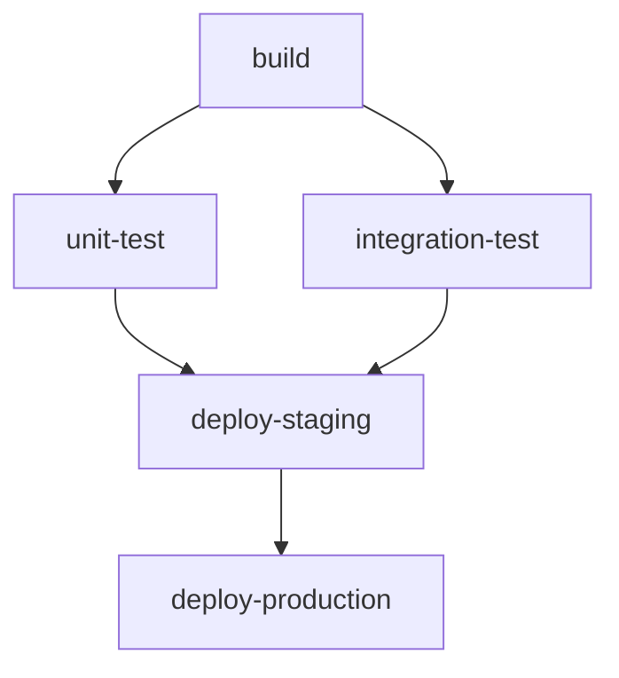

# How to Define Job Dependencies in GitHub Actions

Author: [nawazdhandala](https://www.github.com/nawazdhandala)

Tags: GitHub Actions, CI/CD, Job Dependencies, Workflow Optimization, DevOps, Parallel Jobs

Description: Master job dependencies in GitHub Actions to build efficient pipelines that run tasks in the right order, share outputs between jobs, and handle failures gracefully.

---

GitHub Actions workflows can have multiple jobs, and controlling how they relate to each other is essential for building efficient pipelines. Job dependencies let you run things in parallel when possible and in sequence when necessary.

## Understanding Job Dependencies

By default, all jobs in a workflow run in parallel. Use the `needs` keyword to create dependencies:

```yaml
jobs:
  build:
    runs-on: ubuntu-latest
    steps:
      - run: echo "Building..."

  test:
    needs: build  # Waits for build to complete
    runs-on: ubuntu-latest
    steps:
      - run: echo "Testing..."

  deploy:
    needs: test  # Waits for test to complete
    runs-on: ubuntu-latest
    steps:
      - run: echo "Deploying..."
```

## Dependency Flow Visualization

Here is how jobs flow based on their dependencies:



The workflow YAML for this flow:

```yaml
jobs:
  build:
    runs-on: ubuntu-latest
    steps:
      - uses: actions/checkout@v4
      - run: npm ci && npm run build

  unit-test:
    needs: build
    runs-on: ubuntu-latest
    steps:
      - uses: actions/checkout@v4
      - run: npm test

  integration-test:
    needs: build
    runs-on: ubuntu-latest
    steps:
      - uses: actions/checkout@v4
      - run: npm run test:integration

  deploy-staging:
    needs: [unit-test, integration-test]  # Waits for BOTH
    runs-on: ubuntu-latest
    steps:
      - run: ./deploy.sh staging

  deploy-production:
    needs: deploy-staging
    runs-on: ubuntu-latest
    steps:
      - run: ./deploy.sh production
```

## Passing Data Between Jobs

Jobs run on separate runners, so you need to explicitly pass data using outputs and artifacts.

### Using Job Outputs

```yaml
jobs:
  setup:
    runs-on: ubuntu-latest
    outputs:
      version: ${{ steps.version.outputs.value }}
      should-deploy: ${{ steps.check.outputs.deploy }}
    steps:
      - uses: actions/checkout@v4

      - name: Determine version
        id: version
        run: |
          VERSION=$(cat package.json | jq -r .version)
          echo "value=$VERSION" >> $GITHUB_OUTPUT

      - name: Check if deploy needed
        id: check
        run: |
          if git diff HEAD~1 --name-only | grep -q "^src/"; then
            echo "deploy=true" >> $GITHUB_OUTPUT
          else
            echo "deploy=false" >> $GITHUB_OUTPUT
          fi

  build:
    needs: setup
    runs-on: ubuntu-latest
    steps:
      - uses: actions/checkout@v4

      - name: Build with version
        run: |
          echo "Building version ${{ needs.setup.outputs.version }}"
          npm run build

  deploy:
    needs: [setup, build]
    if: needs.setup.outputs.should-deploy == 'true'
    runs-on: ubuntu-latest
    steps:
      - name: Deploy version
        run: |
          echo "Deploying ${{ needs.setup.outputs.version }}"
          ./deploy.sh
```

### Using Artifacts

For larger data like build outputs, use artifacts:

```yaml
jobs:
  build:
    runs-on: ubuntu-latest
    steps:
      - uses: actions/checkout@v4

      - name: Build application
        run: npm run build

      - name: Upload build artifacts
        uses: actions/upload-artifact@v4
        with:
          name: dist
          path: dist/
          retention-days: 1  # Short retention for CI artifacts

  test:
    needs: build
    runs-on: ubuntu-latest
    steps:
      - uses: actions/checkout@v4

      - name: Download build artifacts
        uses: actions/download-artifact@v4
        with:
          name: dist
          path: dist/

      - name: Run tests against build
        run: npm run test:e2e

  deploy:
    needs: [build, test]
    runs-on: ubuntu-latest
    steps:
      - name: Download build artifacts
        uses: actions/download-artifact@v4
        with:
          name: dist
          path: dist/

      - name: Deploy
        run: ./deploy.sh dist/
```

## Conditional Job Execution

Control whether dependent jobs run based on the outcome of their dependencies:

```yaml
jobs:
  test:
    runs-on: ubuntu-latest
    steps:
      - run: npm test

  deploy:
    needs: test
    # Only run if test succeeded (default behavior)
    runs-on: ubuntu-latest
    steps:
      - run: ./deploy.sh

  notify-success:
    needs: deploy
    if: success()  # Only if all dependencies succeeded
    runs-on: ubuntu-latest
    steps:
      - run: curl -X POST $SLACK_WEBHOOK -d '{"text":"Deployed!"}'

  notify-failure:
    needs: [test, deploy]
    if: failure()  # Run if any dependency failed
    runs-on: ubuntu-latest
    steps:
      - run: curl -X POST $SLACK_WEBHOOK -d '{"text":"Pipeline failed!"}'

  cleanup:
    needs: [test, deploy]
    if: always()  # Always run, regardless of dependency outcomes
    runs-on: ubuntu-latest
    steps:
      - run: ./cleanup.sh
```

## Matrix Jobs with Dependencies

Combine matrix strategies with dependencies for complex pipelines:

```yaml
jobs:
  build:
    runs-on: ubuntu-latest
    strategy:
      matrix:
        component: [api, web, worker]
    steps:
      - uses: actions/checkout@v4

      - name: Build ${{ matrix.component }}
        run: npm run build:${{ matrix.component }}

      - uses: actions/upload-artifact@v4
        with:
          name: ${{ matrix.component }}-build
          path: dist/${{ matrix.component }}

  test:
    needs: build
    runs-on: ubuntu-latest
    strategy:
      matrix:
        component: [api, web, worker]
    steps:
      - uses: actions/checkout@v4

      - uses: actions/download-artifact@v4
        with:
          name: ${{ matrix.component }}-build
          path: dist/${{ matrix.component }}

      - name: Test ${{ matrix.component }}
        run: npm run test:${{ matrix.component }}

  deploy:
    needs: test
    runs-on: ubuntu-latest
    steps:
      # Download all artifacts
      - uses: actions/download-artifact@v4

      - name: Deploy all components
        run: ./deploy-all.sh
```

## Fan-Out and Fan-In Pattern

Run multiple parallel jobs, then converge:

```yaml
jobs:
  # Fan-out: Multiple jobs in parallel
  lint:
    runs-on: ubuntu-latest
    steps:
      - uses: actions/checkout@v4
      - run: npm run lint

  type-check:
    runs-on: ubuntu-latest
    steps:
      - uses: actions/checkout@v4
      - run: npm run type-check

  unit-tests:
    runs-on: ubuntu-latest
    steps:
      - uses: actions/checkout@v4
      - run: npm test

  security-scan:
    runs-on: ubuntu-latest
    steps:
      - uses: actions/checkout@v4
      - run: npm audit

  # Fan-in: Wait for all parallel jobs
  build:
    needs: [lint, type-check, unit-tests, security-scan]
    runs-on: ubuntu-latest
    steps:
      - uses: actions/checkout@v4
      - run: npm run build

  # Continue sequential pipeline
  integration-tests:
    needs: build
    runs-on: ubuntu-latest
    steps:
      - uses: actions/checkout@v4
      - run: npm run test:integration

  deploy:
    needs: integration-tests
    runs-on: ubuntu-latest
    steps:
      - run: ./deploy.sh
```

## Handling Partial Failures

Sometimes you want to continue even if some jobs fail:

```yaml
jobs:
  test-chrome:
    runs-on: ubuntu-latest
    steps:
      - run: npm run test:e2e -- --browser=chrome

  test-firefox:
    runs-on: ubuntu-latest
    steps:
      - run: npm run test:e2e -- --browser=firefox

  test-safari:
    runs-on: ubuntu-latest
    steps:
      - run: npm run test:e2e -- --browser=safari

  report:
    needs: [test-chrome, test-firefox, test-safari]
    if: always()  # Run even if some tests failed
    runs-on: ubuntu-latest
    steps:
      - name: Generate report
        run: |
          echo "Chrome: ${{ needs.test-chrome.result }}"
          echo "Firefox: ${{ needs.test-firefox.result }}"
          echo "Safari: ${{ needs.test-safari.result }}"

      - name: Fail if critical browser failed
        if: needs.test-chrome.result == 'failure'
        run: exit 1
```

## Reusable Workflows with Dependencies

Call reusable workflows as jobs with dependencies:

```yaml
# .github/workflows/ci.yml
jobs:
  build:
    uses: ./.github/workflows/build.yml
    with:
      environment: staging

  test:
    needs: build
    uses: ./.github/workflows/test.yml
    with:
      artifact-name: ${{ needs.build.outputs.artifact }}

  deploy:
    needs: test
    uses: ./.github/workflows/deploy.yml
    secrets: inherit
    with:
      environment: staging
```

## Dynamic Dependencies with Matrix

Generate job matrices dynamically based on changed files:

```yaml
jobs:
  detect-changes:
    runs-on: ubuntu-latest
    outputs:
      services: ${{ steps.changes.outputs.services }}
    steps:
      - uses: actions/checkout@v4
        with:
          fetch-depth: 2

      - id: changes
        run: |
          CHANGED=$(git diff --name-only HEAD~1 | grep "^services/" | cut -d/ -f2 | sort -u | jq -R -s -c 'split("\n")[:-1]')
          echo "services=$CHANGED" >> $GITHUB_OUTPUT

  build-services:
    needs: detect-changes
    if: needs.detect-changes.outputs.services != '[]'
    runs-on: ubuntu-latest
    strategy:
      matrix:
        service: ${{ fromJSON(needs.detect-changes.outputs.services) }}
    steps:
      - uses: actions/checkout@v4
      - run: docker build services/${{ matrix.service }}
```

## Best Practices

1. **Minimize dependencies** - Only add `needs` when truly necessary. Parallel jobs finish faster.

2. **Keep outputs small** - Use outputs for small data (versions, flags). Use artifacts for large files.

3. **Use `if: always()` for cleanup** - Ensure cleanup jobs run regardless of failures.

4. **Name your artifacts clearly** - When multiple jobs produce artifacts, use descriptive names.

5. **Check job results explicitly** - Use `needs.job-name.result` to make decisions based on outcomes.

6. **Avoid long dependency chains** - Deep chains slow down feedback. Restructure to parallelize where possible.

Job dependencies give you precise control over execution order while maximizing parallelism. Use them to build pipelines that are both fast and correct.
