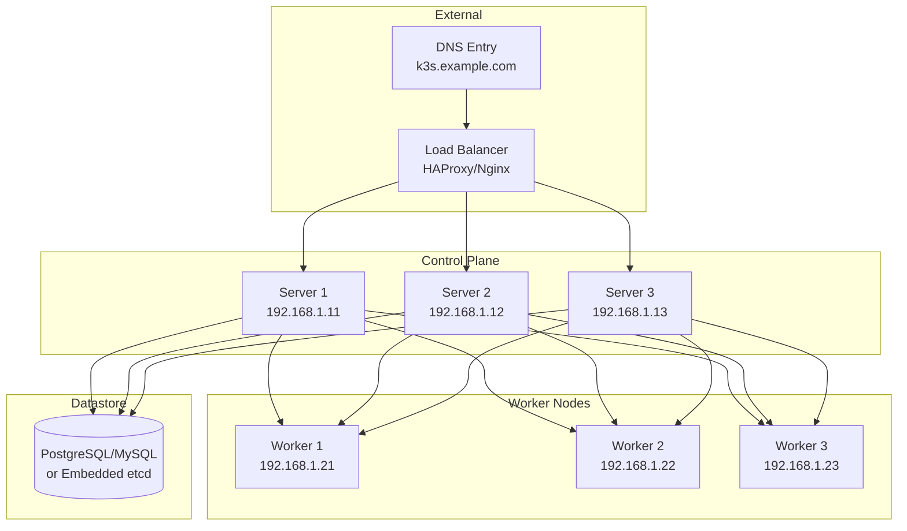

# How to Set Up K3s Production Cluster

Author: [nawazdhandala](https://github.com/nawazdhandala)

Tags: K3s, Kubernetes, Production, High Availability, DevOps, Infrastructure

Description: A comprehensive guide to deploying K3s in production with high availability, security hardening, external databases, TLS configuration, and operational best practices.

---

K3s has earned its reputation as a lightweight Kubernetes distribution, but many teams underestimate its production capabilities. With the right configuration, K3s can power serious workloads while maintaining its signature simplicity. This guide walks through setting up a production-ready K3s cluster that won't let you down when it matters most.

## Table of Contents

1. [Production Architecture Overview](#production-architecture-overview)
2. [Infrastructure Planning](#infrastructure-planning)
3. [Setting Up External Load Balancer](#setting-up-external-load-balancer)
4. [Installing High Availability Server Nodes](#installing-high-availability-server-nodes)
5. [Adding Worker Nodes](#adding-worker-nodes)
6. [TLS and Certificate Management](#tls-and-certificate-management)
7. [Security Hardening](#security-hardening)
8. [Network Policies](#network-policies)
9. [Backup and Disaster Recovery](#backup-and-disaster-recovery)
10. [Monitoring and Alerting](#monitoring-and-alerting)
11. [Upgrade Strategy](#upgrade-strategy)
12. [Conclusion](#conclusion)

## Production Architecture Overview

A production K3s cluster differs fundamentally from a development setup. You need redundancy at every layer, from the control plane to the datastore.



### Key Components

**Load Balancer**: Distributes API traffic across server nodes. If one server fails, clients automatically connect to healthy nodes.

**Server Nodes (Control Plane)**: Run Kubernetes control plane components. Three servers provide fault tolerance - the cluster survives losing one server.

**Worker Nodes**: Run your application workloads. Scale based on capacity requirements.

**Datastore**: Stores cluster state. Options include embedded etcd (recommended for most cases) or external PostgreSQL/MySQL.

## Infrastructure Planning

Before touching any servers, plan your infrastructure carefully.

### Hardware Requirements

For production workloads, allocate more resources than the minimum requirements:

| Role | CPU | RAM | Storage | Quantity |
|------|-----|-----|---------|----------|
| Server Node | 4 cores | 8GB | 100GB SSD | 3 (minimum) |
| Worker Node | 4+ cores | 8GB+ | 100GB+ SSD | Based on workload |
| Load Balancer | 2 cores | 2GB | 20GB | 2 (for HA) |

### Network Planning

Reserve IP addresses and plan your network layout:

```bash
# Example network allocation
# Management Network: 192.168.1.0/24

# Load Balancers
# 192.168.1.5 - Virtual IP (VIP) for HA
# 192.168.1.6 - Load Balancer 1
# 192.168.1.7 - Load Balancer 2

# Server Nodes
# 192.168.1.11 - k3s-server-1
# 192.168.1.12 - k3s-server-2
# 192.168.1.13 - k3s-server-3

# Worker Nodes
# 192.168.1.21 - k3s-worker-1
# 192.168.1.22 - k3s-worker-2
# 192.168.1.23 - k3s-worker-3

# Kubernetes Networks (internal)
# Pod CIDR: 10.42.0.0/16
# Service CIDR: 10.43.0.0/16
```

### Required Ports

Open these ports between nodes:

| Port | Protocol | Source | Destination | Purpose |
|------|----------|--------|-------------|---------|
| 6443 | TCP | All | Servers | Kubernetes API |
| 2379-2380 | TCP | Servers | Servers | etcd communication |
| 10250 | TCP | All | All | Kubelet API |
| 8472 | UDP | All | All | Flannel VXLAN |
| 51820 | UDP | All | All | Flannel WireGuard |

### Prepare All Nodes

Run this preparation script on every node in your cluster:

```bash
#!/bin/bash
# prepare-node.sh - Run on all K3s nodes

# Update system packages
sudo apt update && sudo apt upgrade -y

# Install required utilities
sudo apt install -y \
    curl \
    wget \
    apt-transport-https \
    ca-certificates \
    gnupg \
    lsb-release \
    nfs-common

# Disable swap - Kubernetes requires this
sudo swapoff -a
sudo sed -i '/ swap / s/^\(.*\)$/#\1/g' /etc/fstab

# Load required kernel modules
cat <<EOF | sudo tee /etc/modules-load.d/k3s.conf
br_netfilter
overlay
ip_vs
ip_vs_rr
ip_vs_wrr
ip_vs_sh
nf_conntrack
EOF

# Load modules immediately
sudo modprobe br_netfilter
sudo modprobe overlay
sudo modprobe ip_vs
sudo modprobe ip_vs_rr
sudo modprobe ip_vs_wrr
sudo modprobe ip_vs_sh
sudo modprobe nf_conntrack

# Configure kernel parameters for Kubernetes
cat <<EOF | sudo tee /etc/sysctl.d/k3s.conf
net.bridge.bridge-nf-call-iptables = 1
net.bridge.bridge-nf-call-ip6tables = 1
net.ipv4.ip_forward = 1
net.ipv4.conf.all.forwarding = 1
net.ipv6.conf.all.forwarding = 1
fs.inotify.max_user_watches = 524288
fs.inotify.max_user_instances = 512
EOF

# Apply sysctl settings
sudo sysctl --system

# Configure firewall (if using UFW)
sudo ufw allow 6443/tcp   # Kubernetes API
sudo ufw allow 2379:2380/tcp  # etcd
sudo ufw allow 10250/tcp  # Kubelet
sudo ufw allow 8472/udp   # Flannel VXLAN
sudo ufw allow 51820/udp  # Flannel WireGuard

echo "Node preparation complete. Reboot recommended."
```

## Setting Up External Load Balancer

The load balancer is your cluster's front door. Every kubectl command, every API call goes through it.

### HAProxy Configuration

Install and configure HAProxy on your load balancer nodes:

```bash
# Install HAProxy
sudo apt update && sudo apt install -y haproxy
```

Create the HAProxy configuration:

```bash
# /etc/haproxy/haproxy.cfg
# HAProxy configuration for K3s API load balancing

global
    log /dev/log local0
    log /dev/log local1 notice
    chroot /var/lib/haproxy
    stats socket /run/haproxy/admin.sock mode 660 level admin
    stats timeout 30s
    user haproxy
    group haproxy
    daemon

    # TLS settings
    ssl-default-bind-ciphers ECDHE-ECDSA-AES128-GCM-SHA256:ECDHE-RSA-AES128-GCM-SHA256
    ssl-default-bind-options ssl-min-ver TLSv1.2 no-tls-tickets

defaults
    log global
    mode tcp
    option tcplog
    option dontlognull
    timeout connect 5000ms
    timeout client 50000ms
    timeout server 50000ms
    retries 3

# Stats page for monitoring
listen stats
    bind *:8404
    mode http
    stats enable
    stats uri /stats
    stats refresh 10s
    stats admin if LOCALHOST

# K3s API Server load balancing
frontend k3s_api_frontend
    bind *:6443
    mode tcp
    option tcplog
    default_backend k3s_api_backend

backend k3s_api_backend
    mode tcp
    balance roundrobin
    option tcp-check

    # Server nodes - adjust IPs for your environment
    server k3s-server-1 192.168.1.11:6443 check fall 3 rise 2
    server k3s-server-2 192.168.1.12:6443 check fall 3 rise 2
    server k3s-server-3 192.168.1.13:6443 check fall 3 rise 2
```

Enable and start HAProxy:

```bash
# Validate configuration
sudo haproxy -c -f /etc/haproxy/haproxy.cfg

# Enable and start HAProxy
sudo systemctl enable haproxy
sudo systemctl start haproxy

# Check status
sudo systemctl status haproxy

# Monitor connections
watch 'echo "show stat" | sudo socat stdio /run/haproxy/admin.sock | cut -d "," -f 1,2,18'
```

### High Availability Load Balancer with Keepalived

For load balancer HA, use Keepalived to manage a floating VIP:

```bash
# Install keepalived on both load balancer nodes
sudo apt install -y keepalived
```

Configure Keepalived on the primary load balancer:

```bash
# /etc/keepalived/keepalived.conf (Primary - LB1)
global_defs {
    router_id LB1
    enable_script_security
}

vrrp_script check_haproxy {
    script "/usr/bin/killall -0 haproxy"
    interval 2
    weight 2
}

vrrp_instance VI_1 {
    state MASTER
    interface eth0
    virtual_router_id 51
    priority 101
    advert_int 1

    authentication {
        auth_type PASS
        auth_pass your_secure_password_here
    }

    virtual_ipaddress {
        192.168.1.5/24
    }

    track_script {
        check_haproxy
    }
}
```

Configure the backup load balancer:

```bash
# /etc/keepalived/keepalived.conf (Backup - LB2)
global_defs {
    router_id LB2
    enable_script_security
}

vrrp_script check_haproxy {
    script "/usr/bin/killall -0 haproxy"
    interval 2
    weight 2
}

vrrp_instance VI_1 {
    state BACKUP
    interface eth0
    virtual_router_id 51
    priority 100
    advert_int 1

    authentication {
        auth_type PASS
        auth_pass your_secure_password_here
    }

    virtual_ipaddress {
        192.168.1.5/24
    }

    track_script {
        check_haproxy
    }
}
```

Start Keepalived:

```bash
# Enable and start keepalived
sudo systemctl enable keepalived
sudo systemctl start keepalived

# Verify VIP is assigned
ip addr show eth0 | grep 192.168.1.5
```

## Installing High Availability Server Nodes

With the load balancer ready, install K3s on your server nodes.

### Generate Cluster Token

Create a secure token for cluster authentication:

```bash
# Generate a secure random token
export K3S_TOKEN=$(openssl rand -hex 32)
echo "K3S_TOKEN: $K3S_TOKEN"

# Save this token securely - you'll need it for all nodes
echo $K3S_TOKEN > ~/k3s-cluster-token.txt
chmod 600 ~/k3s-cluster-token.txt
```

### Install First Server Node

Bootstrap the cluster on the first server:

```bash
# On k3s-server-1 (192.168.1.11)

# Set your token and load balancer address
export K3S_TOKEN="your_generated_token_here"
export LB_IP="192.168.1.5"

# Install K3s as the first server with embedded etcd
curl -sfL https://get.k3s.io | sh -s - server \
    --token=$K3S_TOKEN \
    --cluster-init \
    --tls-san=$LB_IP \
    --tls-san=k3s.example.com \
    --disable=traefik \
    --disable=servicelb \
    --write-kubeconfig-mode=644 \
    --node-name=k3s-server-1 \
    --cluster-cidr=10.42.0.0/16 \
    --service-cidr=10.43.0.0/16 \
    --kube-controller-manager-arg="bind-address=0.0.0.0" \
    --kube-scheduler-arg="bind-address=0.0.0.0" \
    --etcd-expose-metrics=true

# Wait for the server to be ready
sleep 30

# Verify the first server is running
sudo kubectl get nodes
```

### Install Additional Server Nodes

Join the remaining servers to the cluster:

```bash
# On k3s-server-2 (192.168.1.12) and k3s-server-3 (192.168.1.13)

# Set your token and addresses
export K3S_TOKEN="your_generated_token_here"
export LB_IP="192.168.1.5"
export FIRST_SERVER_IP="192.168.1.11"

# Install K3s and join as a server
curl -sfL https://get.k3s.io | sh -s - server \
    --token=$K3S_TOKEN \
    --server=https://${FIRST_SERVER_IP}:6443 \
    --tls-san=$LB_IP \
    --tls-san=k3s.example.com \
    --disable=traefik \
    --disable=servicelb \
    --write-kubeconfig-mode=644 \
    --node-name=k3s-server-$(hostname -s | tail -c 2) \
    --kube-controller-manager-arg="bind-address=0.0.0.0" \
    --kube-scheduler-arg="bind-address=0.0.0.0" \
    --etcd-expose-metrics=true

# Wait and verify
sleep 30
sudo kubectl get nodes
```

### Verify Control Plane Health

Check that all server nodes are functioning:

```bash
# List all nodes and their roles
sudo kubectl get nodes -o wide

# Expected output:
# NAME           STATUS   ROLES                       AGE   VERSION
# k3s-server-1   Ready    control-plane,etcd,master   5m    v1.28.x+k3s1
# k3s-server-2   Ready    control-plane,etcd,master   3m    v1.28.x+k3s1
# k3s-server-3   Ready    control-plane,etcd,master   1m    v1.28.x+k3s1

# Check etcd cluster health
sudo k3s etcd-snapshot list

# Verify all system pods are running
sudo kubectl get pods -n kube-system

# Check component health
sudo kubectl get componentstatuses
```

## Adding Worker Nodes

Worker nodes run your application workloads. Add them to the cluster using the agent role.

### Install Worker Nodes

```bash
# On each worker node (k3s-worker-1, k3s-worker-2, k3s-worker-3)

# Set your token and load balancer address
export K3S_TOKEN="your_generated_token_here"
export LB_IP="192.168.1.5"
export NODE_NAME="k3s-worker-1"  # Change for each worker

# Install K3s agent
curl -sfL https://get.k3s.io | sh -s - agent \
    --token=$K3S_TOKEN \
    --server=https://${LB_IP}:6443 \
    --node-name=$NODE_NAME

# Check agent status
sudo systemctl status k3s-agent
```

### Label Worker Nodes

Apply labels for workload scheduling:

```bash
# Label nodes by role
kubectl label nodes k3s-worker-1 node-role.kubernetes.io/worker=true
kubectl label nodes k3s-worker-2 node-role.kubernetes.io/worker=true
kubectl label nodes k3s-worker-3 node-role.kubernetes.io/worker=true

# Add topology labels for spread scheduling
kubectl label nodes k3s-worker-1 topology.kubernetes.io/zone=zone-a
kubectl label nodes k3s-worker-2 topology.kubernetes.io/zone=zone-b
kubectl label nodes k3s-worker-3 topology.kubernetes.io/zone=zone-c

# Verify labels
kubectl get nodes --show-labels
```

### Taint Server Nodes (Optional)

Prevent workloads from running on control plane nodes:

```bash
# Taint server nodes to reserve them for control plane only
kubectl taint nodes k3s-server-1 node-role.kubernetes.io/control-plane:NoSchedule
kubectl taint nodes k3s-server-2 node-role.kubernetes.io/control-plane:NoSchedule
kubectl taint nodes k3s-server-3 node-role.kubernetes.io/control-plane:NoSchedule

# Verify taints
kubectl describe nodes | grep -A3 Taints
```

## TLS and Certificate Management

Production clusters need proper certificate management. Install cert-manager for automated certificate handling.

### Install cert-manager

```bash
# Install cert-manager using kubectl
kubectl apply -f https://github.com/cert-manager/cert-manager/releases/download/v1.14.0/cert-manager.yaml

# Wait for cert-manager to be ready
kubectl wait --for=condition=Available deployment/cert-manager -n cert-manager --timeout=300s
kubectl wait --for=condition=Available deployment/cert-manager-webhook -n cert-manager --timeout=300s
kubectl wait --for=condition=Available deployment/cert-manager-cainjector -n cert-manager --timeout=300s

# Verify installation
kubectl get pods -n cert-manager
```

### Configure Let's Encrypt Issuer

Set up automated certificate issuance:

```yaml
# cluster-issuer.yaml
# ClusterIssuer for Let's Encrypt certificates
apiVersion: cert-manager.io/v1
kind: ClusterIssuer
metadata:
  name: letsencrypt-prod
spec:
  acme:
    # Production Let's Encrypt server
    server: https://acme-v02.api.letsencrypt.org/directory
    email: admin@example.com
    privateKeySecretRef:
      name: letsencrypt-prod-account-key
    solvers:
    - http01:
        ingress:
          class: nginx
---
apiVersion: cert-manager.io/v1
kind: ClusterIssuer
metadata:
  name: letsencrypt-staging
spec:
  acme:
    # Staging server for testing - use this first
    server: https://acme-staging-v02.api.letsencrypt.org/directory
    email: admin@example.com
    privateKeySecretRef:
      name: letsencrypt-staging-account-key
    solvers:
    - http01:
        ingress:
          class: nginx
```

Apply the issuer:

```bash
kubectl apply -f cluster-issuer.yaml

# Verify issuers are ready
kubectl get clusterissuers
```

### Install NGINX Ingress Controller

Since we disabled Traefik, install NGINX ingress for production:

```bash
# Install NGINX ingress controller
kubectl apply -f https://raw.githubusercontent.com/kubernetes/ingress-nginx/controller-v1.9.0/deploy/static/provider/baremetal/deploy.yaml

# Wait for the controller to be ready
kubectl wait --for=condition=Available deployment/ingress-nginx-controller \
    -n ingress-nginx --timeout=300s

# Check the ingress controller
kubectl get pods -n ingress-nginx
kubectl get svc -n ingress-nginx
```

## Security Hardening

Production clusters require security hardening beyond the defaults.

### Enable RBAC Best Practices

Create a restricted namespace with proper RBAC:

```yaml
# secure-namespace.yaml
# Create a namespace with security restrictions
apiVersion: v1
kind: Namespace
metadata:
  name: production
  labels:
    pod-security.kubernetes.io/enforce: restricted
    pod-security.kubernetes.io/audit: restricted
    pod-security.kubernetes.io/warn: restricted
---
# Service account for application
apiVersion: v1
kind: ServiceAccount
metadata:
  name: app-service-account
  namespace: production
automountServiceAccountToken: false
---
# Role with minimal permissions
apiVersion: rbac.authorization.k8s.io/v1
kind: Role
metadata:
  name: app-role
  namespace: production
rules:
- apiGroups: [""]
  resources: ["configmaps", "secrets"]
  verbs: ["get", "list"]
- apiGroups: [""]
  resources: ["pods"]
  verbs: ["get", "list", "watch"]
---
# Bind role to service account
apiVersion: rbac.authorization.k8s.io/v1
kind: RoleBinding
metadata:
  name: app-role-binding
  namespace: production
subjects:
- kind: ServiceAccount
  name: app-service-account
  namespace: production
roleRef:
  kind: Role
  name: app-role
  apiGroup: rbac.authorization.k8s.io
```

### Pod Security Standards

Enforce pod security with a restricted policy:

```yaml
# pod-security-policy.yaml
# Example deployment following restricted security standards
apiVersion: apps/v1
kind: Deployment
metadata:
  name: secure-app
  namespace: production
spec:
  replicas: 3
  selector:
    matchLabels:
      app: secure-app
  template:
    metadata:
      labels:
        app: secure-app
    spec:
      serviceAccountName: app-service-account
      automountServiceAccountToken: false
      securityContext:
        runAsNonRoot: true
        runAsUser: 1000
        runAsGroup: 1000
        fsGroup: 1000
        seccompProfile:
          type: RuntimeDefault
      containers:
      - name: app
        image: nginx:alpine
        securityContext:
          allowPrivilegeEscalation: false
          readOnlyRootFilesystem: true
          capabilities:
            drop:
              - ALL
        resources:
          limits:
            cpu: "500m"
            memory: "256Mi"
          requests:
            cpu: "100m"
            memory: "128Mi"
        volumeMounts:
        - name: tmp
          mountPath: /tmp
        - name: cache
          mountPath: /var/cache/nginx
        - name: run
          mountPath: /var/run
      volumes:
      - name: tmp
        emptyDir: {}
      - name: cache
        emptyDir: {}
      - name: run
        emptyDir: {}
```

### Secrets Management with External Secrets

Install External Secrets Operator for secure secrets management:

```bash
# Add the External Secrets helm repository
helm repo add external-secrets https://charts.external-secrets.io
helm repo update

# Install External Secrets Operator
helm install external-secrets external-secrets/external-secrets \
    -n external-secrets \
    --create-namespace \
    --set installCRDs=true

# Verify installation
kubectl get pods -n external-secrets
```

## Network Policies

Implement network segmentation to control pod communication.

### Default Deny Policy

Start with a default deny policy:

```yaml
# network-policies.yaml
# Default deny all ingress and egress in production namespace
apiVersion: networking.k8s.io/v1
kind: NetworkPolicy
metadata:
  name: default-deny-all
  namespace: production
spec:
  podSelector: {}
  policyTypes:
  - Ingress
  - Egress
---
# Allow DNS resolution for all pods
apiVersion: networking.k8s.io/v1
kind: NetworkPolicy
metadata:
  name: allow-dns
  namespace: production
spec:
  podSelector: {}
  policyTypes:
  - Egress
  egress:
  - to:
    - namespaceSelector: {}
      podSelector:
        matchLabels:
          k8s-app: kube-dns
    ports:
    - protocol: UDP
      port: 53
    - protocol: TCP
      port: 53
---
# Allow ingress from ingress controller
apiVersion: networking.k8s.io/v1
kind: NetworkPolicy
metadata:
  name: allow-ingress-controller
  namespace: production
spec:
  podSelector:
    matchLabels:
      app: secure-app
  policyTypes:
  - Ingress
  ingress:
  - from:
    - namespaceSelector:
        matchLabels:
          kubernetes.io/metadata.name: ingress-nginx
    ports:
    - protocol: TCP
      port: 80
```

Apply network policies:

```bash
kubectl apply -f network-policies.yaml

# Verify policies are in place
kubectl get networkpolicies -n production
```

## Backup and Disaster Recovery

Production clusters need robust backup strategies.

### Automated etcd Snapshots

Configure automatic etcd snapshots:

```bash
# Create backup directory on all server nodes
sudo mkdir -p /var/lib/rancher/k3s/server/db/snapshots-backup

# K3s automatically creates snapshots, but configure retention
# Edit /etc/systemd/system/k3s.service to add:
# --etcd-snapshot-schedule-cron="0 */6 * * *"
# --etcd-snapshot-retention=10

# Alternatively, create a cron job for backups
cat <<'EOF' | sudo tee /etc/cron.d/k3s-backup
# K3s etcd backup - runs every 6 hours
0 */6 * * * root /usr/local/bin/k3s etcd-snapshot save --name scheduled-$(date +\%Y\%m\%d-\%H\%M\%S)
EOF

# Manual backup command
sudo k3s etcd-snapshot save --name manual-backup-$(date +%Y%m%d-%H%M%S)

# List available snapshots
sudo k3s etcd-snapshot list
```

### Install Velero for Application Backup

Velero provides application-level backup and restore:

```bash
# Install Velero CLI
wget https://github.com/vmware-tanzu/velero/releases/download/v1.13.0/velero-v1.13.0-linux-amd64.tar.gz
tar -xvf velero-v1.13.0-linux-amd64.tar.gz
sudo mv velero-v1.13.0-linux-amd64/velero /usr/local/bin/

# Install Velero with your backup storage provider
# Example for AWS S3:
velero install \
    --provider aws \
    --plugins velero/velero-plugin-for-aws:v1.9.0 \
    --bucket your-backup-bucket \
    --backup-location-config region=us-east-1 \
    --secret-file ./credentials-velero \
    --use-volume-snapshots=false

# Create a backup schedule
velero schedule create daily-backup \
    --schedule="0 2 * * *" \
    --include-namespaces production \
    --ttl 720h
```

### Disaster Recovery Procedure

Document your recovery steps:

```bash
# Restore etcd from snapshot
# 1. Stop K3s on all server nodes
sudo systemctl stop k3s

# 2. On one server, restore from snapshot
sudo k3s server \
    --cluster-reset \
    --cluster-reset-restore-path=/var/lib/rancher/k3s/server/db/snapshots/your-snapshot-name

# 3. Start K3s on the restored server
sudo systemctl start k3s

# 4. Remove old cluster data on other servers
sudo rm -rf /var/lib/rancher/k3s/server/db

# 5. Rejoin other servers to the cluster
# They will sync from the restored server
sudo systemctl start k3s

# 6. Verify cluster health
kubectl get nodes
kubectl get pods -A
```

## Monitoring and Alerting

Production clusters need visibility. Install a monitoring stack.

### Install Prometheus and Grafana

Use the kube-prometheus-stack for comprehensive monitoring:

```bash
# Add Prometheus community helm repository
helm repo add prometheus-community https://prometheus-community.github.io/helm-charts
helm repo update

# Create monitoring namespace
kubectl create namespace monitoring

# Install kube-prometheus-stack with production values
helm install prometheus prometheus-community/kube-prometheus-stack \
    --namespace monitoring \
    --set prometheus.prometheusSpec.retention=30d \
    --set prometheus.prometheusSpec.storageSpec.volumeClaimTemplate.spec.storageClassName=local-path \
    --set prometheus.prometheusSpec.storageSpec.volumeClaimTemplate.spec.resources.requests.storage=50Gi \
    --set grafana.persistence.enabled=true \
    --set grafana.persistence.size=10Gi \
    --set alertmanager.alertmanagerSpec.storage.volumeClaimTemplate.spec.storageClassName=local-path \
    --set alertmanager.alertmanagerSpec.storage.volumeClaimTemplate.spec.resources.requests.storage=10Gi

# Wait for deployment
kubectl wait --for=condition=Available deployment/prometheus-grafana \
    -n monitoring --timeout=300s

# Get Grafana admin password
kubectl get secret prometheus-grafana -n monitoring \
    -o jsonpath="{.data.admin-password}" | base64 --decode; echo
```

### Configure Alerting Rules

Create alerts for critical cluster conditions:

```yaml
# alerting-rules.yaml
apiVersion: monitoring.coreos.com/v1
kind: PrometheusRule
metadata:
  name: k3s-cluster-alerts
  namespace: monitoring
  labels:
    release: prometheus
spec:
  groups:
  - name: k3s-cluster
    rules:
    # Alert when a node is not ready
    - alert: NodeNotReady
      expr: kube_node_status_condition{condition="Ready",status="true"} == 0
      for: 5m
      labels:
        severity: critical
      annotations:
        summary: "Node {{ $labels.node }} is not ready"
        description: "Node has been unready for more than 5 minutes"

    # Alert on high memory usage
    - alert: HighMemoryUsage
      expr: (1 - (node_memory_MemAvailable_bytes / node_memory_MemTotal_bytes)) > 0.90
      for: 5m
      labels:
        severity: warning
      annotations:
        summary: "High memory usage on {{ $labels.instance }}"
        description: "Memory usage is above 90%"

    # Alert on high CPU usage
    - alert: HighCPUUsage
      expr: 100 - (avg by(instance) (rate(node_cpu_seconds_total{mode="idle"}[5m])) * 100) > 90
      for: 5m
      labels:
        severity: warning
      annotations:
        summary: "High CPU usage on {{ $labels.instance }}"
        description: "CPU usage is above 90%"

    # Alert when etcd has no leader
    - alert: EtcdNoLeader
      expr: etcd_server_has_leader == 0
      for: 1m
      labels:
        severity: critical
      annotations:
        summary: "etcd cluster has no leader"
        description: "etcd cluster has no leader - this is critical"

    # Alert on pod restart loops
    - alert: PodCrashLooping
      expr: rate(kube_pod_container_status_restarts_total[15m]) > 0
      for: 5m
      labels:
        severity: warning
      annotations:
        summary: "Pod {{ $labels.namespace }}/{{ $labels.pod }} is crash looping"
        description: "Pod has restarted multiple times in the last 15 minutes"
```

Apply alerting rules:

```bash
kubectl apply -f alerting-rules.yaml
```

## Upgrade Strategy

Plan your upgrade process carefully to minimize downtime.

### Pre-Upgrade Checklist

```bash
# 1. Check current versions
k3s --version
kubectl get nodes -o wide

# 2. Create etcd backup before upgrade
sudo k3s etcd-snapshot save --name pre-upgrade-$(date +%Y%m%d-%H%M%S)

# 3. Review K3s release notes for breaking changes
# https://github.com/k3s-io/k3s/releases

# 4. Test upgrade in staging environment first

# 5. Schedule maintenance window
```

### Rolling Upgrade Procedure

Upgrade nodes one at a time to maintain availability:

```bash
# Upgrade server nodes first, one at a time

# 1. Cordon the node to prevent new workloads
kubectl cordon k3s-server-1

# 2. Drain the node (if running workloads)
kubectl drain k3s-server-1 --ignore-daemonsets --delete-emptydir-data

# 3. Upgrade K3s on the node
# SSH to k3s-server-1
curl -sfL https://get.k3s.io | INSTALL_K3S_VERSION=v1.29.0+k3s1 sh -s - server

# 4. Verify the node is running new version
kubectl get nodes

# 5. Uncordon the node
kubectl uncordon k3s-server-1

# 6. Wait for node to be fully ready before proceeding to next node
kubectl wait --for=condition=Ready node/k3s-server-1 --timeout=300s

# 7. Repeat for remaining server nodes, then worker nodes
```

### Automated Upgrade with System Upgrade Controller

Install the K3s system upgrade controller for managed upgrades:

```bash
# Install system upgrade controller
kubectl apply -f https://github.com/rancher/system-upgrade-controller/releases/latest/download/system-upgrade-controller.yaml

# Wait for controller to be ready
kubectl wait --for=condition=Available deployment/system-upgrade-controller \
    -n system-upgrade --timeout=300s
```

Create upgrade plans:

```yaml
# upgrade-plan.yaml
apiVersion: upgrade.cattle.io/v1
kind: Plan
metadata:
  name: server-plan
  namespace: system-upgrade
spec:
  concurrency: 1
  cordon: true
  nodeSelector:
    matchExpressions:
    - key: node-role.kubernetes.io/control-plane
      operator: In
      values:
      - "true"
  serviceAccountName: system-upgrade
  upgrade:
    image: rancher/k3s-upgrade
  version: v1.29.0+k3s1
---
apiVersion: upgrade.cattle.io/v1
kind: Plan
metadata:
  name: agent-plan
  namespace: system-upgrade
spec:
  concurrency: 2
  cordon: true
  nodeSelector:
    matchExpressions:
    - key: node-role.kubernetes.io/control-plane
      operator: DoesNotExist
  prepare:
    args:
    - prepare
    - server-plan
    image: rancher/k3s-upgrade
  serviceAccountName: system-upgrade
  upgrade:
    image: rancher/k3s-upgrade
  version: v1.29.0+k3s1
```

## Conclusion

Setting up a production K3s cluster requires attention to detail across multiple areas - high availability, security, networking, monitoring, and operational procedures. The lightweight nature of K3s does not mean cutting corners on production readiness.

Key takeaways from this guide:

**High Availability**: Deploy at least three server nodes with an external load balancer. This configuration survives the loss of any single component without downtime.

**Security First**: Implement network policies, pod security standards, RBAC, and proper secrets management from day one. Retrofitting security is always harder than building it in.

**Observability**: You cannot manage what you cannot see. Install comprehensive monitoring and alerting before issues become incidents.

**Backup Everything**: etcd snapshots and application-level backups with Velero give you options when things go wrong. Test your restore procedures regularly.

**Upgrade Carefully**: Rolling upgrades with proper draining keep your cluster available during maintenance. Never upgrade production without testing in staging first.

K3s proves that lightweight does not mean lacking. With proper configuration, it delivers enterprise-grade Kubernetes without the operational overhead of a full distribution. Your production workloads deserve a cluster built with the same care you put into your applications.

For ongoing monitoring of your K3s clusters, consider tools like OneUptime that provide unified observability across your infrastructure. Having visibility into cluster health, application performance, and infrastructure metrics in one place makes operating production Kubernetes significantly easier.

## Additional Resources

- [K3s Official Documentation](https://docs.k3s.io/)
- [K3s GitHub Repository](https://github.com/k3s-io/k3s)
- [Kubernetes Security Best Practices](https://kubernetes.io/docs/concepts/security/)
- [cert-manager Documentation](https://cert-manager.io/docs/)
- [Velero Documentation](https://velero.io/docs/)
