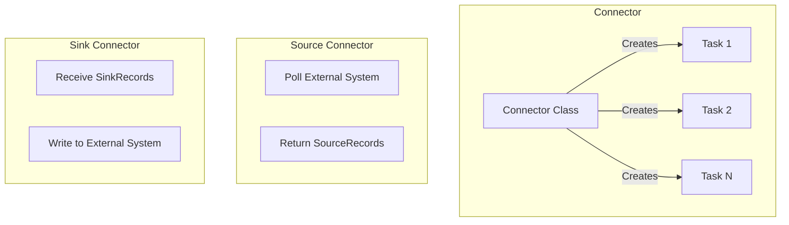

# How to Write Custom Kafka Connect Connectors

Author: [nawazdhandala](https://www.github.com/nawazdhandala)

Tags: Kafka, Kafka Connect, Integration, Data Pipeline, Java

Description: Build custom Kafka Connect source and sink connectors to integrate Kafka with systems that lack existing connectors.

---

Kafka Connect handles data movement between Kafka and external systems. When no connector exists for your system, build one. The Connect framework manages parallelism, offset tracking, and fault tolerance while you focus on the integration logic.

## Connector Architecture

A connector consists of two main components:



- **Connector**: Configuration and task management
- **Tasks**: Actual data movement (parallelizable)

## Project Setup

Create a Maven project with Connect dependencies.

```xml
<!-- pom.xml -->
<project>
    <groupId>com.example</groupId>
    <artifactId>custom-connector</artifactId>
    <version>1.0.0</version>
    <packaging>jar</packaging>

    <dependencies>
        <dependency>
            <groupId>org.apache.kafka</groupId>
            <artifactId>connect-api</artifactId>
            <version>3.6.0</version>
            <scope>provided</scope>
        </dependency>
        <dependency>
            <groupId>org.apache.kafka</groupId>
            <artifactId>connect-json</artifactId>
            <version>3.6.0</version>
            <scope>provided</scope>
        </dependency>
        <dependency>
            <groupId>org.slf4j</groupId>
            <artifactId>slf4j-api</artifactId>
            <version>2.0.9</version>
            <scope>provided</scope>
        </dependency>
    </dependencies>

    <build>
        <plugins>
            <plugin>
                <groupId>org.apache.maven.plugins</groupId>
                <artifactId>maven-assembly-plugin</artifactId>
                <version>3.6.0</version>
                <configuration>
                    <descriptorRefs>
                        <descriptorRef>jar-with-dependencies</descriptorRef>
                    </descriptorRefs>
                </configuration>
                <executions>
                    <execution>
                        <phase>package</phase>
                        <goals>
                            <goal>single</goal>
                        </goals>
                    </execution>
                </executions>
            </plugin>
        </plugins>
    </build>
</project>
```

## Building a Source Connector

Source connectors pull data from external systems into Kafka.

```java
// FileStreamSourceConnector.java
// Connector class - manages configuration and creates tasks
public class FileStreamSourceConnector extends SourceConnector {

    private Map<String, String> config;

    // Define configuration options
    public static final String FILE_CONFIG = "file";
    public static final String TOPIC_CONFIG = "topic";
    public static final String BATCH_SIZE_CONFIG = "batch.size";

    private static final ConfigDef CONFIG_DEF = new ConfigDef()
        .define(FILE_CONFIG,
                ConfigDef.Type.STRING,
                ConfigDef.Importance.HIGH,
                "Path to the file to read")
        .define(TOPIC_CONFIG,
                ConfigDef.Type.STRING,
                ConfigDef.Importance.HIGH,
                "Topic to write data to")
        .define(BATCH_SIZE_CONFIG,
                ConfigDef.Type.INT,
                100,
                ConfigDef.Importance.MEDIUM,
                "Batch size for polling");

    @Override
    public void start(Map<String, String> props) {
        // Validate and store configuration
        config = props;
        new AbstractConfig(CONFIG_DEF, props);  // Validates config
    }

    @Override
    public Class<? extends Task> taskClass() {
        return FileStreamSourceTask.class;
    }

    @Override
    public List<Map<String, String>> taskConfigs(int maxTasks) {
        // Split work across tasks
        // For file source, typically one task per file
        return List.of(config);
    }

    @Override
    public void stop() {
        // Cleanup resources
    }

    @Override
    public ConfigDef config() {
        return CONFIG_DEF;
    }

    @Override
    public String version() {
        return "1.0.0";
    }
}
```

```java
// FileStreamSourceTask.java
// Task class - does the actual work
public class FileStreamSourceTask extends SourceTask {

    private String filename;
    private String topic;
    private int batchSize;
    private BufferedReader reader;
    private long offset = 0;

    @Override
    public void start(Map<String, String> props) {
        filename = props.get(FileStreamSourceConnector.FILE_CONFIG);
        topic = props.get(FileStreamSourceConnector.TOPIC_CONFIG);
        batchSize = Integer.parseInt(
            props.getOrDefault(FileStreamSourceConnector.BATCH_SIZE_CONFIG, "100"));

        // Restore offset from Connect's offset storage
        Map<String, Object> offsetData = context.offsetStorageReader()
            .offset(Collections.singletonMap("file", filename));

        if (offsetData != null && offsetData.containsKey("position")) {
            offset = (Long) offsetData.get("position");
        }

        try {
            reader = new BufferedReader(new FileReader(filename));
            // Skip to stored position
            for (long i = 0; i < offset; i++) {
                reader.readLine();
            }
        } catch (IOException e) {
            throw new ConnectException("Failed to open file", e);
        }
    }

    @Override
    public List<SourceRecord> poll() throws InterruptedException {
        List<SourceRecord> records = new ArrayList<>();

        try {
            for (int i = 0; i < batchSize; i++) {
                String line = reader.readLine();
                if (line == null) {
                    // End of file - wait before checking again
                    Thread.sleep(1000);
                    break;
                }

                offset++;

                // Create source record with offset tracking
                SourceRecord record = new SourceRecord(
                    // Source partition - identifies this data source
                    Collections.singletonMap("file", filename),
                    // Source offset - position within the source
                    Collections.singletonMap("position", offset),
                    // Kafka topic
                    topic,
                    // Schema and value
                    Schema.STRING_SCHEMA,
                    line
                );

                records.add(record);
            }
        } catch (IOException e) {
            throw new ConnectException("Error reading file", e);
        }

        return records;
    }

    @Override
    public void stop() {
        try {
            if (reader != null) {
                reader.close();
            }
        } catch (IOException e) {
            // Log and ignore
        }
    }

    @Override
    public String version() {
        return "1.0.0";
    }
}
```

## Building a Sink Connector

Sink connectors write data from Kafka to external systems.

```java
// HttpSinkConnector.java
public class HttpSinkConnector extends SinkConnector {

    private Map<String, String> config;

    public static final String URL_CONFIG = "http.url";
    public static final String TIMEOUT_CONFIG = "http.timeout.ms";

    private static final ConfigDef CONFIG_DEF = new ConfigDef()
        .define(URL_CONFIG,
                ConfigDef.Type.STRING,
                ConfigDef.Importance.HIGH,
                "HTTP endpoint URL")
        .define(TIMEOUT_CONFIG,
                ConfigDef.Type.INT,
                30000,
                ConfigDef.Importance.MEDIUM,
                "HTTP timeout in milliseconds");

    @Override
    public void start(Map<String, String> props) {
        config = props;
        new AbstractConfig(CONFIG_DEF, props);
    }

    @Override
    public Class<? extends Task> taskClass() {
        return HttpSinkTask.class;
    }

    @Override
    public List<Map<String, String>> taskConfigs(int maxTasks) {
        // All tasks get same config for HTTP sink
        List<Map<String, String>> configs = new ArrayList<>();
        for (int i = 0; i < maxTasks; i++) {
            configs.add(config);
        }
        return configs;
    }

    @Override
    public void stop() {}

    @Override
    public ConfigDef config() {
        return CONFIG_DEF;
    }

    @Override
    public String version() {
        return "1.0.0";
    }
}
```

```java
// HttpSinkTask.java
public class HttpSinkTask extends SinkTask {

    private HttpClient httpClient;
    private String url;
    private int timeout;

    @Override
    public void start(Map<String, String> props) {
        url = props.get(HttpSinkConnector.URL_CONFIG);
        timeout = Integer.parseInt(
            props.getOrDefault(HttpSinkConnector.TIMEOUT_CONFIG, "30000"));

        httpClient = HttpClient.newBuilder()
            .connectTimeout(Duration.ofMillis(timeout))
            .build();
    }

    @Override
    public void put(Collection<SinkRecord> records) {
        for (SinkRecord record : records) {
            try {
                // Convert record to JSON
                String json = toJson(record);

                HttpRequest request = HttpRequest.newBuilder()
                    .uri(URI.create(url))
                    .header("Content-Type", "application/json")
                    .POST(HttpRequest.BodyPublishers.ofString(json))
                    .timeout(Duration.ofMillis(timeout))
                    .build();

                HttpResponse<String> response = httpClient.send(
                    request, HttpResponse.BodyHandlers.ofString());

                if (response.statusCode() >= 400) {
                    throw new RetriableException(
                        "HTTP error: " + response.statusCode());
                }

            } catch (IOException | InterruptedException e) {
                // RetriableException tells Connect to retry
                throw new RetriableException("HTTP request failed", e);
            }
        }
    }

    private String toJson(SinkRecord record) {
        // Simple JSON conversion
        Map<String, Object> data = new HashMap<>();
        data.put("topic", record.topic());
        data.put("partition", record.kafkaPartition());
        data.put("offset", record.kafkaOffset());
        data.put("key", record.key());
        data.put("value", record.value());
        return new Gson().toJson(data);
    }

    @Override
    public void stop() {
        // HttpClient doesn't need explicit cleanup
    }

    @Override
    public String version() {
        return "1.0.0";
    }
}
```

## Using Schemas and Structs

For structured data, use Connect's schema system.

```java
// Create schema for structured data
private static final Schema VALUE_SCHEMA = SchemaBuilder.struct()
    .name("com.example.Event")
    .field("id", Schema.STRING_SCHEMA)
    .field("timestamp", Schema.INT64_SCHEMA)
    .field("type", Schema.STRING_SCHEMA)
    .field("payload", Schema.OPTIONAL_STRING_SCHEMA)
    .build();

// Create record with schema
Struct value = new Struct(VALUE_SCHEMA)
    .put("id", "evt-123")
    .put("timestamp", System.currentTimeMillis())
    .put("type", "ORDER_CREATED")
    .put("payload", "{\"orderId\": \"123\"}");

SourceRecord record = new SourceRecord(
    sourcePartition,
    sourceOffset,
    topic,
    VALUE_SCHEMA,
    value
);
```

## Implementing Transforms

Single Message Transforms (SMTs) modify records in flight.

```java
public class MaskFieldTransform<R extends ConnectRecord<R>>
        implements Transformation<R> {

    private String fieldName;
    private static final String FIELD_CONFIG = "field";

    private static final ConfigDef CONFIG_DEF = new ConfigDef()
        .define(FIELD_CONFIG,
                ConfigDef.Type.STRING,
                ConfigDef.Importance.HIGH,
                "Field name to mask");

    @Override
    public void configure(Map<String, ?> configs) {
        fieldName = (String) configs.get(FIELD_CONFIG);
    }

    @Override
    public R apply(R record) {
        if (record.valueSchema() == null) {
            return record;  // Schemaless - skip
        }

        Struct value = (Struct) record.value();
        Schema schema = record.valueSchema();

        // Build new struct with masked field
        SchemaBuilder builder = SchemaBuilder.struct();
        for (Field field : schema.fields()) {
            builder.field(field.name(), field.schema());
        }
        Schema newSchema = builder.build();

        Struct newValue = new Struct(newSchema);
        for (Field field : schema.fields()) {
            if (field.name().equals(fieldName)) {
                newValue.put(field.name(), "****");
            } else {
                newValue.put(field.name(), value.get(field));
            }
        }

        return record.newRecord(
            record.topic(),
            record.kafkaPartition(),
            record.keySchema(),
            record.key(),
            newSchema,
            newValue,
            record.timestamp()
        );
    }

    @Override
    public ConfigDef config() {
        return CONFIG_DEF;
    }

    @Override
    public void close() {}
}
```

## Deploying the Connector

Package and install your connector.

```bash
# Build the JAR
mvn clean package

# Copy to Connect plugin path
mkdir -p /usr/share/kafka-connect/plugins/custom-connector
cp target/custom-connector-1.0.0-jar-with-dependencies.jar \
   /usr/share/kafka-connect/plugins/custom-connector/

# Restart Connect workers to pick up new plugin
```

Configure Connect to find plugins:

```properties
# connect-distributed.properties
plugin.path=/usr/share/kafka-connect/plugins
```

## Creating Connector Instances

Deploy connector instances via REST API.

```bash
# Create source connector instance
curl -X POST http://localhost:8083/connectors \
  -H "Content-Type: application/json" \
  -d '{
    "name": "file-source",
    "config": {
      "connector.class": "com.example.FileStreamSourceConnector",
      "tasks.max": "1",
      "file": "/var/log/app.log",
      "topic": "app-logs"
    }
  }'

# Create sink connector instance
curl -X POST http://localhost:8083/connectors \
  -H "Content-Type: application/json" \
  -d '{
    "name": "http-sink",
    "config": {
      "connector.class": "com.example.HttpSinkConnector",
      "tasks.max": "3",
      "topics": "events",
      "http.url": "https://api.example.com/events",
      "http.timeout.ms": "10000"
    }
  }'

# Check connector status
curl http://localhost:8083/connectors/file-source/status
```

## Error Handling

Configure dead letter queues for failed records.

```json
{
  "name": "http-sink",
  "config": {
    "connector.class": "com.example.HttpSinkConnector",
    "topics": "events",
    "http.url": "https://api.example.com/events",
    "errors.tolerance": "all",
    "errors.deadletterqueue.topic.name": "http-sink-dlq",
    "errors.deadletterqueue.topic.replication.factor": "3",
    "errors.deadletterqueue.context.headers.enable": "true"
  }
}
```

---

Custom Kafka Connect connectors handle data movement while the framework manages scaling and reliability. Start with the simplest implementation that works, then add schema support and error handling. Test thoroughly with realistic data volumes before production deployment. The initial investment in building a proper connector pays off in operational simplicity compared to custom data pipelines.
