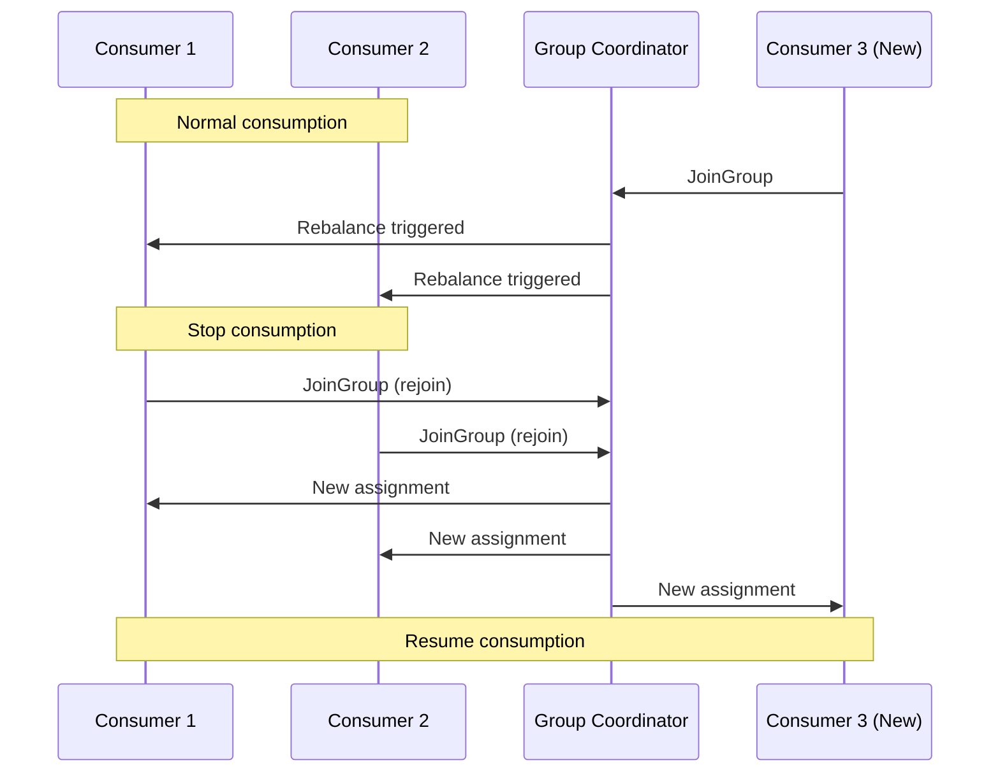

# How to Handle Rebalancing in Kafka Consumer Groups

Author: [nawazdhandala](https://www.github.com/nawazdhandala)

Tags: Kafka, Consumer Groups, Rebalancing, High Availability, Performance

Description: Minimize consumer group rebalancing disruption with cooperative protocols, static membership, and proper session timeout tuning.

---

Rebalancing redistributes partitions among consumer group members. It happens when consumers join, leave, or crash. During rebalancing, consumption stops. Long rebalances hurt throughput and latency. Understanding and optimizing rebalancing keeps your consumers running smoothly.

## Why Rebalancing Happens

Rebalancing triggers:
- Consumer joins the group
- Consumer leaves gracefully (shutdown)
- Consumer crashes (session timeout)
- Consumer misses heartbeats (network issues)
- Topic partition count changes
- Subscription pattern matches new topics



## Rebalancing Protocols

Kafka supports two rebalancing strategies:

**Eager (Stop-the-World)**: All consumers revoke all partitions, then receive new assignments. Simple but causes complete consumption pause.

**Cooperative (Incremental)**: Only affected partitions are revoked. Most consumers continue processing during rebalance.

```java
Properties props = new Properties();
props.put("bootstrap.servers", "localhost:9092");
props.put("group.id", "my-group");

// Use cooperative rebalancing (Kafka 2.4+)
props.put("partition.assignment.strategy",
    "org.apache.kafka.clients.consumer.CooperativeStickyAssignor");

KafkaConsumer<String, String> consumer = new KafkaConsumer<>(props);
```

## Configuring Session Timeouts

Tune timeouts to balance between fast failure detection and false positives.

```java
Properties props = new Properties();
props.put("bootstrap.servers", "localhost:9092");
props.put("group.id", "my-group");

// Session timeout: max time between heartbeats before consumer is considered dead
// Default: 45 seconds (previously 10 seconds)
props.put("session.timeout.ms", "45000");

// Heartbeat interval: how often to send heartbeats
// Should be 1/3 of session.timeout.ms
props.put("heartbeat.interval.ms", "15000");

// Max poll interval: max time between poll() calls
// Exceeding this triggers rebalance
props.put("max.poll.interval.ms", "300000");  // 5 minutes

// Max records per poll - affects processing time
props.put("max.poll.records", "500");
```

Guidelines:
- `session.timeout.ms`: Higher values reduce false rebalances but slow failure detection
- `heartbeat.interval.ms`: Keep at 1/3 of session timeout
- `max.poll.interval.ms`: Must exceed your longest processing time

## Static Group Membership

Static membership prevents rebalances during rolling restarts.

```java
Properties props = new Properties();
props.put("bootstrap.servers", "localhost:9092");
props.put("group.id", "my-group");

// Assign a stable identity to this consumer
// Must be unique within the group
props.put("group.instance.id", "consumer-pod-1");

// Session timeout for static members (can be longer)
props.put("session.timeout.ms", "300000");  // 5 minutes

KafkaConsumer<String, String> consumer = new KafkaConsumer<>(props);
```

With static membership:
- Consumer restarts within session timeout keep same partitions
- No rebalance during brief outages
- Identity must be stable across restarts (use hostname/pod name)

```java
// Kubernetes-friendly static membership
String podName = System.getenv("HOSTNAME");  // Pod name in K8s
props.put("group.instance.id", podName);
```

## Handling Rebalance Events

Use ConsumerRebalanceListener for cleanup and initialization.

```java
public class RebalanceHandler implements ConsumerRebalanceListener {

    private final KafkaConsumer<String, String> consumer;
    private final Map<TopicPartition, Long> currentOffsets = new HashMap<>();

    public RebalanceHandler(KafkaConsumer<String, String> consumer) {
        this.consumer = consumer;
    }

    @Override
    public void onPartitionsRevoked(Collection<TopicPartition> partitions) {
        // Called before partitions are taken away
        // Commit offsets for work in progress
        log.info("Partitions being revoked: {}", partitions);

        // Commit current offsets before losing partitions
        if (!currentOffsets.isEmpty()) {
            consumer.commitSync(currentOffsets);
            currentOffsets.clear();
        }

        // Cleanup resources tied to these partitions
        for (TopicPartition partition : partitions) {
            closePartitionResources(partition);
        }
    }

    @Override
    public void onPartitionsAssigned(Collection<TopicPartition> partitions) {
        // Called after new partitions are assigned
        log.info("Partitions assigned: {}", partitions);

        // Initialize resources for new partitions
        for (TopicPartition partition : partitions) {
            initializePartitionResources(partition);
        }

        // Optionally seek to specific positions
        // consumer.seekToBeginning(partitions);
    }

    // For cooperative rebalancing - called during incremental rebalance
    @Override
    public void onPartitionsLost(Collection<TopicPartition> partitions) {
        // Partitions were lost without revoke (consumer crashed/timed out)
        // Cannot commit offsets - just cleanup
        log.warn("Partitions lost unexpectedly: {}", partitions);
        for (TopicPartition partition : partitions) {
            closePartitionResources(partition);
        }
    }
}

// Usage
consumer.subscribe(List.of("my-topic"), new RebalanceHandler(consumer));
```

## Avoiding Long Processing Rebalances

Long message processing can trigger rebalances.

```java
// Problem: Processing takes longer than max.poll.interval.ms
while (true) {
    ConsumerRecords<String, String> records = consumer.poll(Duration.ofMillis(100));

    for (ConsumerRecord<String, String> record : records) {
        processRecord(record);  // Takes 30 seconds per record
        // After max.poll.interval.ms, consumer is kicked out!
    }
}

// Solution 1: Reduce batch size
props.put("max.poll.records", "10");  // Process fewer records per poll

// Solution 2: Increase poll interval
props.put("max.poll.interval.ms", "600000");  // 10 minutes

// Solution 3: Process asynchronously with pause/resume
ExecutorService executor = Executors.newFixedThreadPool(10);

while (true) {
    ConsumerRecords<String, String> records = consumer.poll(Duration.ofMillis(100));

    if (!records.isEmpty()) {
        // Pause fetching while processing
        consumer.pause(consumer.assignment());

        // Submit for async processing
        CompletableFuture<Void> future = CompletableFuture.runAsync(() -> {
            for (ConsumerRecord<String, String> record : records) {
                processRecord(record);
            }
        }, executor);

        // Wait with periodic heartbeats
        while (!future.isDone()) {
            consumer.poll(Duration.ofMillis(0));  // Sends heartbeat
            Thread.sleep(1000);
        }

        // Resume fetching
        consumer.resume(consumer.assignment());
        consumer.commitSync();
    }
}
```

## Monitoring Rebalance Metrics

Track rebalance frequency and duration.

```java
// Consumer metrics related to rebalancing
consumer.metrics().forEach((name, metric) -> {
    String metricName = name.name();

    if (metricName.equals("rebalance-total")) {
        // Total number of rebalances
        System.out.println("Rebalances: " + metric.metricValue());
    }
    if (metricName.equals("rebalance-latency-avg")) {
        // Average rebalance duration in ms
        System.out.println("Avg rebalance latency: " + metric.metricValue());
    }
    if (metricName.equals("rebalance-latency-max")) {
        System.out.println("Max rebalance latency: " + metric.metricValue());
    }
    if (metricName.equals("last-rebalance-seconds-ago")) {
        System.out.println("Time since last rebalance: " + metric.metricValue());
    }
});
```

Prometheus alerts:

```yaml
groups:
  - name: kafka-consumer-alerts
    rules:
      - alert: FrequentRebalancing
        expr: rate(kafka_consumer_rebalance_total[5m]) > 0.1
        for: 10m
        labels:
          severity: warning
        annotations:
          summary: "Consumer group {{ $labels.group }} rebalancing frequently"

      - alert: LongRebalance
        expr: kafka_consumer_rebalance_latency_avg > 30000
        for: 5m
        labels:
          severity: warning
        annotations:
          summary: "Consumer group rebalances taking over 30 seconds"
```

## Graceful Shutdown

Proper shutdown prevents unnecessary rebalances.

```java
public class GracefulConsumer {

    private final KafkaConsumer<String, String> consumer;
    private final AtomicBoolean running = new AtomicBoolean(true);

    public void consume() {
        // Register shutdown hook
        Runtime.getRuntime().addShutdownHook(new Thread(() -> {
            running.set(false);
            consumer.wakeup();  // Interrupt poll()
        }));

        try {
            consumer.subscribe(List.of("my-topic"));

            while (running.get()) {
                ConsumerRecords<String, String> records =
                    consumer.poll(Duration.ofMillis(100));
                processRecords(records);
                consumer.commitSync();
            }
        } catch (WakeupException e) {
            // Expected on shutdown - ignore
            if (running.get()) {
                throw e;
            }
        } finally {
            // Close cleanly - sends LeaveGroup to coordinator
            // Triggers immediate rebalance with remaining consumers
            consumer.close(Duration.ofSeconds(30));
        }
    }
}
```

## Partition Assignment Strategies

Choose the right strategy for your use case.

```java
// Range: Assigns consecutive partitions to each consumer
// Good for: Co-partitioned topics (joins)
props.put("partition.assignment.strategy",
    "org.apache.kafka.clients.consumer.RangeAssignor");

// Round-robin: Distributes partitions evenly
// Good for: Even load distribution
props.put("partition.assignment.strategy",
    "org.apache.kafka.clients.consumer.RoundRobinAssignor");

// Sticky: Minimizes partition movement during rebalance
// Good for: Reducing rebalance impact
props.put("partition.assignment.strategy",
    "org.apache.kafka.clients.consumer.StickyAssignor");

// Cooperative Sticky: Sticky + incremental rebalancing
// Good for: Production workloads (recommended)
props.put("partition.assignment.strategy",
    "org.apache.kafka.clients.consumer.CooperativeStickyAssignor");
```

---

Rebalancing is unavoidable, but its impact can be minimized. Use cooperative sticky assignment, configure appropriate timeouts, and implement static membership for stable deployments. Monitor rebalance frequency and duration as key health indicators. When rebalances become frequent, investigate consumer health, processing times, and network stability. The goal is not zero rebalances but controlled, quick rebalances that do not disrupt your data pipeline.
