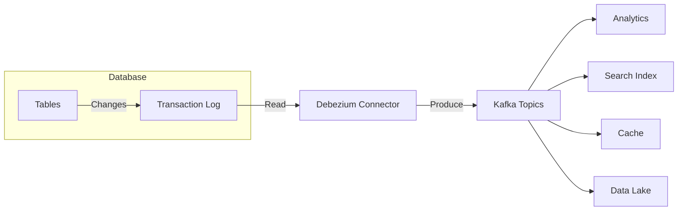

# How to Stream Database Changes with Debezium in Kafka

Author: [nawazdhandala](https://www.github.com/nawazdhandala)

Tags: Kafka, Debezium, CDC, Database, Event Streaming

Description: Set up Change Data Capture with Debezium to stream database changes to Kafka in real time, enabling event-driven architectures and data synchronization.

---

Debezium captures every insert, update, and delete from your database and streams them to Kafka. No polling, no missed changes, no application code modifications. Your database transaction log becomes an event stream.

## How CDC Works



Debezium reads the database transaction log (WAL in PostgreSQL, binlog in MySQL) to capture changes as they happen.

## Setting Up Debezium with Docker

Deploy Kafka Connect with Debezium connectors.

```yaml
# docker-compose.yml
version: '3'
services:
  zookeeper:
    image: confluentinc/cp-zookeeper:7.5.0
    environment:
      ZOOKEEPER_CLIENT_PORT: 2181

  kafka:
    image: confluentinc/cp-kafka:7.5.0
    depends_on:
      - zookeeper
    environment:
      KAFKA_BROKER_ID: 1
      KAFKA_ZOOKEEPER_CONNECT: zookeeper:2181
      KAFKA_ADVERTISED_LISTENERS: PLAINTEXT://kafka:9092
      KAFKA_OFFSETS_TOPIC_REPLICATION_FACTOR: 1

  postgres:
    image: postgres:15
    environment:
      POSTGRES_USER: postgres
      POSTGRES_PASSWORD: postgres
      POSTGRES_DB: myapp
    command:
      - "postgres"
      - "-c"
      - "wal_level=logical"  # Required for CDC

  debezium:
    image: debezium/connect:2.4
    depends_on:
      - kafka
      - postgres
    ports:
      - "8083:8083"
    environment:
      BOOTSTRAP_SERVERS: kafka:9092
      GROUP_ID: debezium-cluster
      CONFIG_STORAGE_TOPIC: debezium_configs
      OFFSET_STORAGE_TOPIC: debezium_offsets
      STATUS_STORAGE_TOPIC: debezium_status
```

## Configuring PostgreSQL for CDC

Enable logical replication in PostgreSQL.

```sql
-- Check current WAL level
SHOW wal_level;  -- Must be 'logical'

-- Create replication user
CREATE USER debezium WITH REPLICATION PASSWORD 'dbz_password';

-- Grant access to tables
GRANT SELECT ON ALL TABLES IN SCHEMA public TO debezium;
ALTER DEFAULT PRIVILEGES IN SCHEMA public GRANT SELECT ON TABLES TO debezium;

-- Create publication for all tables
CREATE PUBLICATION debezium_pub FOR ALL TABLES;
```

PostgreSQL configuration:

```properties
# postgresql.conf
wal_level = logical
max_replication_slots = 4
max_wal_senders = 4
```

## Creating a PostgreSQL Connector

Deploy the Debezium connector via REST API.

```bash
curl -X POST http://localhost:8083/connectors \
  -H "Content-Type: application/json" \
  -d '{
    "name": "postgres-connector",
    "config": {
      "connector.class": "io.debezium.connector.postgresql.PostgresConnector",
      "database.hostname": "postgres",
      "database.port": "5432",
      "database.user": "debezium",
      "database.password": "dbz_password",
      "database.dbname": "myapp",
      "topic.prefix": "myapp",
      "table.include.list": "public.orders,public.customers",
      "plugin.name": "pgoutput",
      "publication.name": "debezium_pub",
      "slot.name": "debezium_slot",
      "snapshot.mode": "initial",
      "key.converter": "org.apache.kafka.connect.json.JsonConverter",
      "value.converter": "org.apache.kafka.connect.json.JsonConverter",
      "key.converter.schemas.enable": "false",
      "value.converter.schemas.enable": "true"
    }
  }'
```

## MySQL CDC Configuration

For MySQL, enable binary logging.

```properties
# my.cnf
server-id = 1
log_bin = mysql-bin
binlog_format = ROW
binlog_row_image = FULL
expire_logs_days = 7
gtid_mode = ON
enforce_gtid_consistency = ON
```

```bash
# Create MySQL connector
curl -X POST http://localhost:8083/connectors \
  -H "Content-Type: application/json" \
  -d '{
    "name": "mysql-connector",
    "config": {
      "connector.class": "io.debezium.connector.mysql.MySqlConnector",
      "database.hostname": "mysql",
      "database.port": "3306",
      "database.user": "debezium",
      "database.password": "dbz_password",
      "database.server.id": "1",
      "topic.prefix": "myapp",
      "database.include.list": "inventory",
      "table.include.list": "inventory.orders,inventory.products",
      "schema.history.internal.kafka.bootstrap.servers": "kafka:9092",
      "schema.history.internal.kafka.topic": "schema-changes.myapp"
    }
  }'
```

## Understanding Change Events

Debezium produces structured change events.

```json
{
  "schema": { "...schema definition..." },
  "payload": {
    "before": {
      "id": 1001,
      "name": "Old Name",
      "email": "old@example.com"
    },
    "after": {
      "id": 1001,
      "name": "New Name",
      "email": "new@example.com"
    },
    "source": {
      "version": "2.4.0.Final",
      "connector": "postgresql",
      "name": "myapp",
      "ts_ms": 1706184000000,
      "snapshot": "false",
      "db": "myapp",
      "schema": "public",
      "table": "customers",
      "txId": 12345,
      "lsn": 9876543210
    },
    "op": "u",
    "ts_ms": 1706184000123
  }
}
```

Operation types (`op`):
- `c`: Create (INSERT)
- `u`: Update (UPDATE)
- `d`: Delete (DELETE)
- `r`: Read (initial snapshot)

## Consuming Change Events

Process change events in your application.

```java
@Service
public class CustomerChangeConsumer {

    @KafkaListener(topics = "myapp.public.customers")
    public void onCustomerChange(ConsumerRecord<String, String> record) {
        JsonNode event = objectMapper.readTree(record.value());
        JsonNode payload = event.get("payload");

        String operation = payload.get("op").asText();
        JsonNode before = payload.get("before");
        JsonNode after = payload.get("after");

        switch (operation) {
            case "c" -> handleInsert(after);
            case "u" -> handleUpdate(before, after);
            case "d" -> handleDelete(before);
            case "r" -> handleSnapshot(after);
        }
    }

    private void handleInsert(JsonNode data) {
        log.info("New customer: {}", data.get("name").asText());
        // Index in Elasticsearch, update cache, etc.
        searchService.indexCustomer(toCustomer(data));
    }

    private void handleUpdate(JsonNode before, JsonNode after) {
        log.info("Customer updated: {} -> {}",
            before.get("name").asText(),
            after.get("name").asText());
        // Update downstream systems
        searchService.updateCustomer(toCustomer(after));
        cacheService.invalidate("customer:" + after.get("id").asLong());
    }

    private void handleDelete(JsonNode data) {
        log.info("Customer deleted: {}", data.get("id").asLong());
        searchService.deleteCustomer(data.get("id").asLong());
        cacheService.delete("customer:" + data.get("id").asLong());
    }
}
```

## Snapshot Modes

Control how Debezium handles initial data load.

```json
{
  "config": {
    "snapshot.mode": "initial"
  }
}
```

| Mode | Behavior |
|------|----------|
| `initial` | Full snapshot on first run, then stream changes |
| `initial_only` | Snapshot only, no streaming |
| `when_needed` | Snapshot if offsets unavailable |
| `never` | No snapshot, stream changes only |
| `schema_only` | Capture schema, no data snapshot |

## Transformations

Transform events before they reach Kafka.

```json
{
  "config": {
    "connector.class": "io.debezium.connector.postgresql.PostgresConnector",

    "transforms": "unwrap,route",

    "transforms.unwrap.type": "io.debezium.transforms.ExtractNewRecordState",
    "transforms.unwrap.drop.tombstones": "false",
    "transforms.unwrap.delete.handling.mode": "rewrite",
    "transforms.unwrap.add.fields": "op,table,source.ts_ms",

    "transforms.route.type": "org.apache.kafka.connect.transforms.RegexRouter",
    "transforms.route.regex": "myapp\\.public\\.(.*)",
    "transforms.route.replacement": "cdc.$1"
  }
}
```

**ExtractNewRecordState**: Flattens the envelope, keeping only the `after` state.

Before transformation:
```json
{"payload": {"before": {...}, "after": {"id": 1, "name": "Test"}, "op": "u"}}
```

After transformation:
```json
{"id": 1, "name": "Test", "__op": "u", "__table": "customers"}
```

## Handling Schema Evolution

Debezium tracks schema changes automatically.

```sql
-- Add column to table
ALTER TABLE customers ADD COLUMN phone VARCHAR(20);

-- Debezium captures the schema change and includes new field
-- in subsequent events
```

Events include schema evolution:

```json
{
  "schema": {
    "fields": [
      {"field": "id", "type": "int64"},
      {"field": "name", "type": "string"},
      {"field": "phone", "type": "string", "optional": true}
    ]
  }
}
```

## Monitoring Debezium

Track connector health and lag.

```bash
# Check connector status
curl http://localhost:8083/connectors/postgres-connector/status | jq .

# Response
{
  "name": "postgres-connector",
  "connector": {
    "state": "RUNNING",
    "worker_id": "debezium:8083"
  },
  "tasks": [
    {
      "id": 0,
      "state": "RUNNING",
      "worker_id": "debezium:8083"
    }
  ]
}
```

JMX metrics:

```yaml
# Key Debezium metrics
- debezium.metrics:type=connector-metrics,*
  - MilliSecondsSinceLastEvent  # Lag indicator
  - TotalNumberOfEventsSeen
  - NumberOfEventsFiltered
  - QueueRemainingCapacity

- debezium.metrics:type=snapshot-metrics,*
  - SnapshotRunning
  - RemainingTableCount
  - TotalTableCount
```

## Handling Failures

Configure dead letter queues for problem records.

```json
{
  "config": {
    "errors.tolerance": "all",
    "errors.deadletterqueue.topic.name": "debezium-dlq",
    "errors.deadletterqueue.topic.replication.factor": "3",
    "errors.deadletterqueue.context.headers.enable": "true",
    "errors.log.enable": "true",
    "errors.log.include.messages": "true"
  }
}
```

## Use Cases

**Search Indexing**: Keep Elasticsearch in sync with PostgreSQL.

```java
@KafkaListener(topics = "myapp.public.products")
public void indexProduct(String event) {
    Product product = extractProduct(event);
    elasticsearchClient.index(product);
}
```

**Cache Invalidation**: Invalidate Redis cache on database changes.

```java
@KafkaListener(topics = "myapp.public.users")
public void invalidateCache(String event) {
    String userId = extractUserId(event);
    redisTemplate.delete("user:" + userId);
}
```

**Audit Log**: Create an immutable audit trail.

```java
@KafkaListener(topics = {"myapp.public.orders", "myapp.public.payments"})
public void auditLog(ConsumerRecord<String, String> record) {
    AuditEntry entry = AuditEntry.builder()
        .topic(record.topic())
        .operation(extractOperation(record))
        .before(extractBefore(record))
        .after(extractAfter(record))
        .timestamp(Instant.now())
        .build();
    auditRepository.save(entry);
}
```

---

Debezium transforms your database into an event source. Changes flow to Kafka in near real-time without modifying application code. Start with simple use cases like cache invalidation, then expand to search indexing and analytics. Monitor connector lag closely because falling behind the transaction log risks missing changes. Debezium is the bridge between traditional databases and event-driven architecture.
