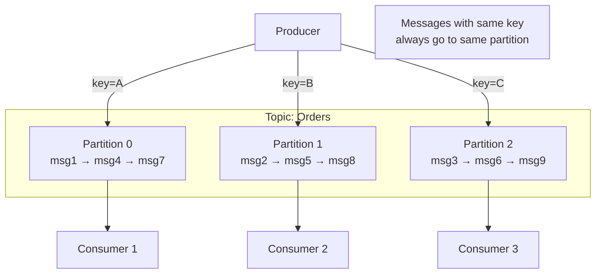
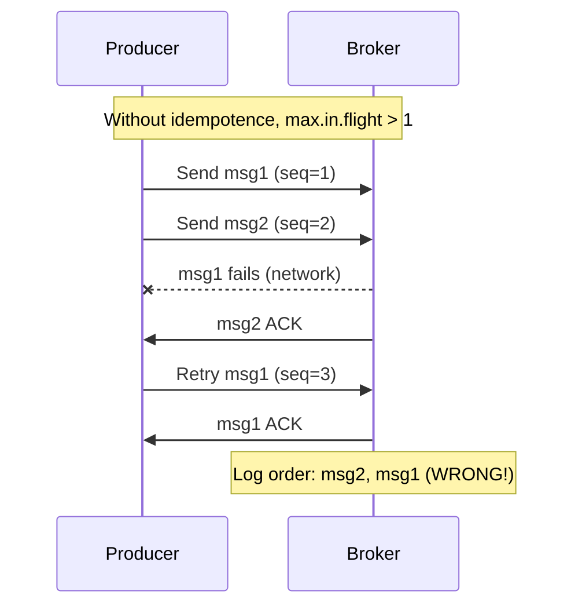

# How to Guarantee Message Order in Kafka

Author: [nawazdhandala](https://www.github.com/nawazdhandala)

Tags: Kafka, Message Ordering, Partitioning, Data Consistency, Architecture

Description: Ensure strict message ordering in Kafka through proper partitioning, producer configuration, and consumer design patterns.

---

Kafka guarantees ordering within a partition, not across partitions. If message A arrives before message B in the same partition, every consumer will see A before B. Understanding this constraint and designing around it is essential for systems that require ordering.

## How Kafka Ordering Works



Key principles:
- Messages with the same key go to the same partition
- Within a partition, messages are strictly ordered
- Consumers in a group each read from exclusive partitions

## Keying Messages for Order

Choose keys that group related messages together.

```java
// Order events should be keyed by order ID
// All events for order-123 go to the same partition
public void publishOrderEvent(OrderEvent event) {
    ProducerRecord<String, OrderEvent> record = new ProducerRecord<>(
        "order-events",
        event.getOrderId(),  // Key determines partition
        event
    );
    producer.send(record);
}

// User activity should be keyed by user ID
public void publishUserActivity(String userId, ActivityEvent event) {
    ProducerRecord<String, ActivityEvent> record = new ProducerRecord<>(
        "user-activity",
        userId,  // All activity for this user in same partition
        event
    );
    producer.send(record);
}
```

## Custom Partitioners

For special routing logic, implement a custom partitioner.

```java
public class GeographicPartitioner implements Partitioner {

    private Map<String, Integer> regionToPartition;

    @Override
    public void configure(Map<String, ?> configs) {
        // Map regions to partitions
        regionToPartition = Map.of(
            "US", 0,
            "EU", 1,
            "APAC", 2
        );
    }

    @Override
    public int partition(String topic, Object key, byte[] keyBytes,
                        Object value, byte[] valueBytes, Cluster cluster) {
        // Extract region from key (format: "region:entityId")
        String keyStr = (String) key;
        String region = keyStr.split(":")[0];

        int numPartitions = cluster.partitionCountForTopic(topic);
        int basePartition = regionToPartition.getOrDefault(region, 0);

        // Ensure we don't exceed partition count
        return basePartition % numPartitions;
    }

    @Override
    public void close() {}
}

// Usage
props.put("partitioner.class", "com.example.GeographicPartitioner");
```

## Producer Configuration for Ordering

Incorrect producer settings can break ordering even with proper keys.

```java
Properties props = new Properties();
props.put("bootstrap.servers", "localhost:9092");
props.put("key.serializer", StringSerializer.class.getName());
props.put("value.serializer", StringSerializer.class.getName());

// CRITICAL: Enable idempotence for ordering guarantees
props.put("enable.idempotence", "true");

// With idempotence, these are set automatically:
// acks=all
// retries=Integer.MAX_VALUE
// max.in.flight.requests.per.connection=5

// Without idempotence, limit in-flight requests to 1 for strict ordering
// props.put("max.in.flight.requests.per.connection", "1");

KafkaProducer<String, String> producer = new KafkaProducer<>(props);
```

Why `max.in.flight.requests.per.connection` matters:



## Single Partition for Global Ordering

When total ordering is required, use a single partition.

```bash
# Create single-partition topic
kafka-topics.sh --create \
  --topic global-sequence \
  --bootstrap-server localhost:9092 \
  --partitions 1 \
  --replication-factor 3
```

Trade-offs:
- Pro: Perfect global ordering
- Con: Limited throughput (single consumer)
- Con: No parallelism

Use for: Configuration changes, leader election, distributed locks.

## Ordering Within Entity Aggregates

For most applications, ordering per entity is sufficient.

```java
// Banking transactions - order per account
public class TransactionProducer {

    public void recordTransaction(Transaction tx) {
        // All transactions for account-123 are ordered
        String key = tx.getAccountId();
        producer.send(new ProducerRecord<>("transactions", key, tx));
    }
}

// E-commerce orders - order per customer
public class OrderProducer {

    public void recordOrderEvent(OrderEvent event) {
        // OrderCreated, PaymentReceived, Shipped - in order per customer
        String key = event.getCustomerId();
        producer.send(new ProducerRecord<>("order-events", key, event));
    }
}
```

## Consumer Patterns for Ordering

Consumers must also respect ordering guarantees.

```java
// Single-threaded consumer - simplest, guaranteed ordering
public void consumeOrdered() {
    consumer.subscribe(List.of("order-events"));

    while (true) {
        ConsumerRecords<String, OrderEvent> records =
            consumer.poll(Duration.ofMillis(100));

        for (ConsumerRecord<String, OrderEvent> record : records) {
            // Process strictly in order
            processEvent(record.value());
        }
        consumer.commitSync();
    }
}

// Multi-threaded with per-key ordering
public class OrderedProcessor {

    // One queue per partition key - preserves per-key ordering
    private final Map<String, BlockingQueue<ConsumerRecord<String, OrderEvent>>>
        keyQueues = new ConcurrentHashMap<>();

    private final ExecutorService executor = Executors.newFixedThreadPool(10);

    public void consumeWithParallelism() {
        consumer.subscribe(List.of("order-events"));

        while (true) {
            ConsumerRecords<String, OrderEvent> records =
                consumer.poll(Duration.ofMillis(100));

            for (ConsumerRecord<String, OrderEvent> record : records) {
                // Route to per-key queue
                String key = record.key();
                keyQueues.computeIfAbsent(key, k -> {
                    BlockingQueue<ConsumerRecord<String, OrderEvent>> queue =
                        new LinkedBlockingQueue<>();
                    // Start dedicated processor for this key
                    executor.submit(() -> processQueue(queue));
                    return queue;
                }).add(record);
            }
            consumer.commitSync();
        }
    }

    private void processQueue(
            BlockingQueue<ConsumerRecord<String, OrderEvent>> queue) {
        while (true) {
            try {
                ConsumerRecord<String, OrderEvent> record =
                    queue.take();  // Blocks until available
                processEvent(record.value());
            } catch (InterruptedException e) {
                Thread.currentThread().interrupt();
                break;
            }
        }
    }
}
```

## Handling Partition Reassignment

Rebalancing can affect in-flight processing order.

```java
public class OrderAwareRebalanceListener implements ConsumerRebalanceListener {

    private final Map<String, List<PendingRecord>> pendingByKey = new HashMap<>();

    @Override
    public void onPartitionsRevoked(Collection<TopicPartition> partitions) {
        // Complete or persist pending work for revoked partitions
        for (TopicPartition partition : partitions) {
            // Flush any buffered records for this partition
            flushPendingRecords(partition);
        }
    }

    @Override
    public void onPartitionsAssigned(Collection<TopicPartition> partitions) {
        // New partitions - start fresh
        // Ordering is preserved because we're the only consumer for these partitions
    }

    private void flushPendingRecords(TopicPartition partition) {
        // Ensure all records from this partition are processed
        // before partition is handed off
    }
}
```

## Ordering Across Topics

Kafka does not guarantee ordering across topics. For cross-topic ordering:

```java
// Option 1: Embed timestamp and sequence in messages
public class SequencedEvent {
    private String eventId;
    private long sequenceNumber;
    private Instant timestamp;
    private String payload;
}

// Consumer sorts by sequence before processing
public void processWithSequence(List<SequencedEvent> events) {
    events.sort(Comparator.comparing(SequencedEvent::getSequenceNumber));
    for (SequencedEvent event : events) {
        process(event);
    }
}

// Option 2: Use single topic with event type header
public void publishToSingleTopic(String entityId, Object event) {
    ProducerRecord<String, Object> record = new ProducerRecord<>(
        "all-events",
        entityId,
        event
    );
    record.headers().add("event-type",
        event.getClass().getSimpleName().getBytes());
    producer.send(record);
}
```

## Validating Order in Consumers

Add validation to detect ordering violations.

```java
public class OrderValidator {

    private final Map<String, Long> lastSequenceByKey = new ConcurrentHashMap<>();

    public void validateOrder(String key, long sequence) {
        Long lastSequence = lastSequenceByKey.get(key);

        if (lastSequence != null && sequence <= lastSequence) {
            // Out of order or duplicate
            throw new OutOfOrderException(
                "Expected sequence > " + lastSequence + ", got " + sequence);
        }

        lastSequenceByKey.put(key, sequence);
    }
}

// Usage in consumer
for (ConsumerRecord<String, SequencedEvent> record : records) {
    validator.validateOrder(record.key(), record.value().getSequenceNumber());
    process(record.value());
}
```

---

Kafka ordering comes from proper partitioning. Key messages by the entity that needs ordering, enable idempotent producers, and design consumers to maintain order within their processing. For global ordering across all messages, use a single partition and accept the throughput trade-off. Most systems need entity-level ordering, which scales well with multiple partitions. Test ordering assumptions explicitly because violations often appear only under load.
