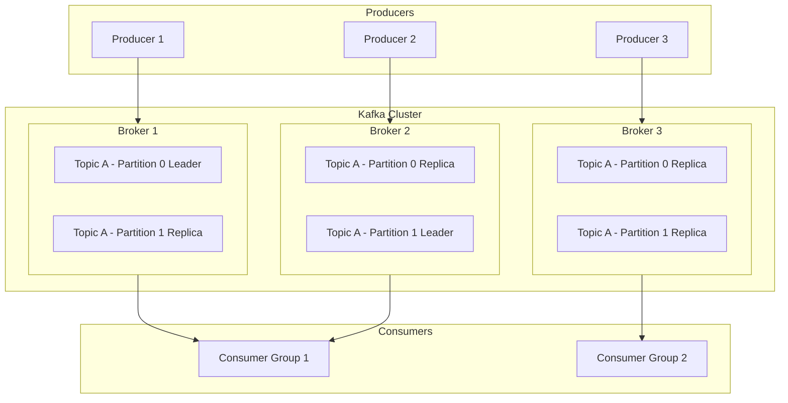
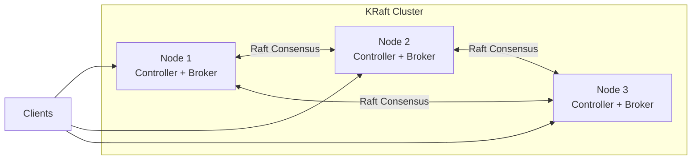
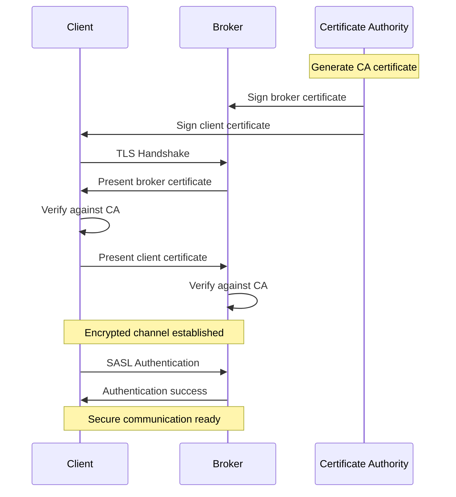
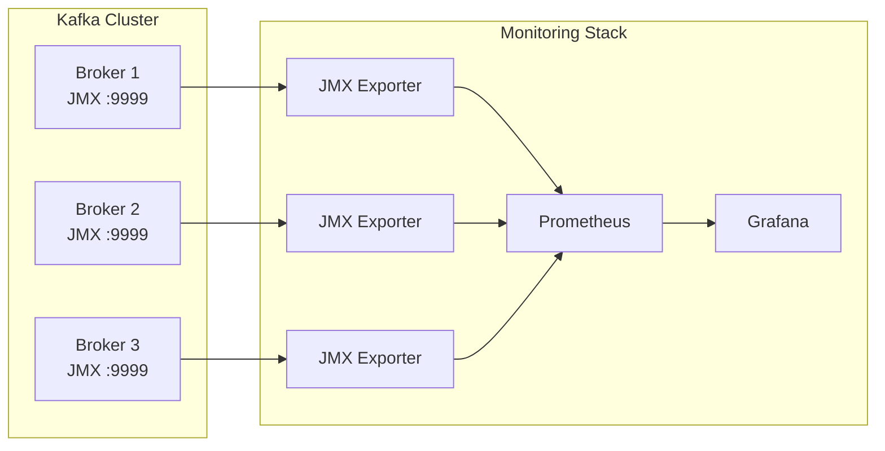
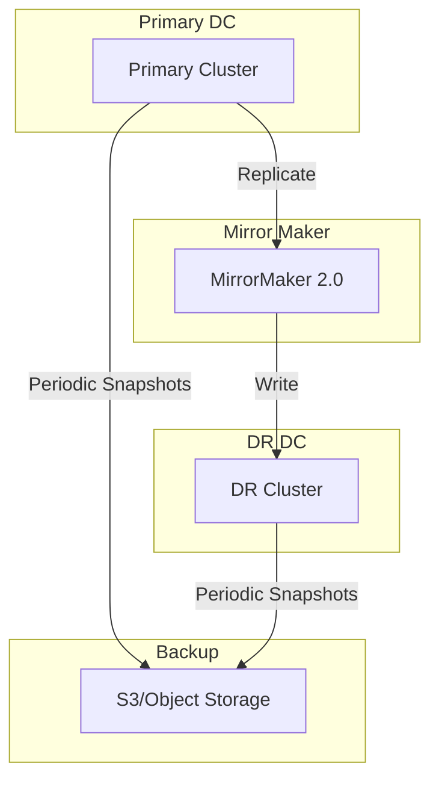

# How to Set Up Kafka for Production

Author: [nawazdhandala](https://www.github.com/nawazdhandala)

Tags: Kafka, Message Queue, Production, DevOps, Distributed Systems

Description: A comprehensive guide to setting up Apache Kafka for production environments, covering cluster configuration, replication, security, and monitoring.

---

Apache Kafka has become the backbone of modern data streaming architectures. Whether you are building real-time analytics pipelines, event-driven microservices, or log aggregation systems, Kafka provides the durability and throughput needed for production workloads. This guide walks through setting up a production-ready Kafka cluster from scratch.

## Understanding Kafka Architecture

Before diving into configuration, let's understand how Kafka components work together in a production environment.



A production Kafka deployment consists of multiple brokers forming a cluster. Each broker handles a portion of the data, and topics are divided into partitions that are replicated across brokers for fault tolerance.

## Prerequisites

Before setting up Kafka, ensure you have:

- At least 3 servers (physical or virtual) with minimum 8GB RAM and 4 CPU cores each
- Java 11 or later installed on all nodes
- Network connectivity between all nodes with low latency
- Dedicated storage volumes for Kafka data (SSDs recommended)

## Step 1: Install Kafka on All Nodes

First, download and extract Kafka on each server. We will use Kafka 3.6, which includes KRaft mode for running without ZooKeeper.

```bash
# Download Kafka (run on all nodes)
wget https://downloads.apache.org/kafka/3.6.1/kafka_2.13-3.6.1.tgz

# Extract the archive
tar -xzf kafka_2.13-3.6.1.tgz

# Move to a standard location
sudo mv kafka_2.13-3.6.1 /opt/kafka

# Create a dedicated user for running Kafka
sudo useradd -r -s /bin/false kafka

# Create data directories with proper ownership
sudo mkdir -p /var/lib/kafka/data
sudo mkdir -p /var/log/kafka
sudo chown -R kafka:kafka /opt/kafka /var/lib/kafka /var/log/kafka
```

## Step 2: Configure KRaft Mode

KRaft (Kafka Raft) eliminates the need for ZooKeeper by using Kafka's own consensus protocol. Here is the configuration for a 3-node cluster.



Create the configuration file at `/opt/kafka/config/kraft/server.properties`:

```properties
# /opt/kafka/config/kraft/server.properties
# Node 1 configuration (adjust node.id for each server)

# Unique identifier for this node in the cluster
# Set to 1, 2, or 3 depending on the server
node.id=1

# This node acts as both controller and broker
# Controllers handle metadata, brokers handle data
process.roles=broker,controller

# Define the controller quorum voters
# Format: node_id@hostname:port
# List all three controllers for high availability
controller.quorum.voters=1@kafka-node-1:9093,2@kafka-node-2:9093,3@kafka-node-3:9093

# Network listeners configuration
# PLAINTEXT for internal cluster communication
# CONTROLLER for Raft consensus protocol
listeners=PLAINTEXT://:9092,CONTROLLER://:9093

# Advertised listeners that clients will use to connect
# Replace with actual hostnames or IP addresses
advertised.listeners=PLAINTEXT://kafka-node-1:9092

# Map listener names to security protocols
listener.security.protocol.map=CONTROLLER:PLAINTEXT,PLAINTEXT:PLAINTEXT

# Controller listener name for inter-controller communication
controller.listener.names=CONTROLLER

# Listener used for inter-broker communication
inter.broker.listener.name=PLAINTEXT

# Storage configuration
# Directory where Kafka stores partition data and logs
log.dirs=/var/lib/kafka/data

# Number of partitions for auto-created topics
# Higher values allow better parallelism
num.partitions=6

# Default replication factor for auto-created topics
# Set to 3 for fault tolerance across all brokers
default.replication.factor=3

# Minimum in-sync replicas required for writes
# Ensures data durability even if one broker fails
min.insync.replicas=2

# Number of threads for handling network requests
num.network.threads=8

# Number of threads for performing disk I/O
num.io.threads=16

# Socket buffer sizes for high throughput
socket.send.buffer.bytes=102400
socket.receive.buffer.bytes=102400
socket.request.max.bytes=104857600

# Log retention settings
# Keep data for 7 days (168 hours)
log.retention.hours=168

# Maximum size of a single log segment file (1GB)
log.segment.bytes=1073741824

# Interval for checking log retention criteria
log.retention.check.interval.ms=300000

# Enable auto leader balancing for even load distribution
auto.leader.rebalance.enable=true

# Consumer group configuration
# Initial rebalance delay to allow consumers time to join
group.initial.rebalance.delay.ms=3000
```

For nodes 2 and 3, update the following properties:

```properties
# Node 2 configuration changes
node.id=2
advertised.listeners=PLAINTEXT://kafka-node-2:9092

# Node 3 configuration changes
node.id=3
advertised.listeners=PLAINTEXT://kafka-node-3:9092
```

## Step 3: Generate Cluster ID and Format Storage

Before starting the cluster, you need to generate a unique cluster ID and format the storage directories.

```bash
# Generate a unique cluster ID (run once on any node)
KAFKA_CLUSTER_ID=$(/opt/kafka/bin/kafka-storage.sh random-uuid)
echo "Cluster ID: $KAFKA_CLUSTER_ID"

# Format the storage directory on each node
# This initializes the metadata log for KRaft
/opt/kafka/bin/kafka-storage.sh format \
    -t $KAFKA_CLUSTER_ID \
    -c /opt/kafka/config/kraft/server.properties
```

The output should look like:

```
Formatting /var/lib/kafka/data with metadata.version 3.6-IV2.
```

## Step 4: Create Systemd Service

Create a systemd unit file to manage Kafka as a service.

```ini
# /etc/systemd/system/kafka.service

[Unit]
# Service description and documentation
Description=Apache Kafka Server (KRaft Mode)
Documentation=https://kafka.apache.org/documentation/
After=network.target

[Service]
# Run as the dedicated kafka user
User=kafka
Group=kafka

# Set Java options for production workloads
# Adjust heap sizes based on available memory
Environment="KAFKA_HEAP_OPTS=-Xms4g -Xmx4g"
Environment="KAFKA_JVM_PERFORMANCE_OPTS=-XX:+UseG1GC -XX:MaxGCPauseMillis=20 -XX:InitiatingHeapOccupancyPercent=35"

# Start the Kafka server
ExecStart=/opt/kafka/bin/kafka-server-start.sh /opt/kafka/config/kraft/server.properties

# Graceful shutdown with 30 second timeout
ExecStop=/opt/kafka/bin/kafka-server-stop.sh
TimeoutStopSec=30

# Restart automatically on failure
Restart=on-failure
RestartSec=10

# Limit file descriptors for high connection counts
LimitNOFILE=100000

[Install]
WantedBy=multi-user.target
```

Enable and start the service:

```bash
# Reload systemd to pick up new service file
sudo systemctl daemon-reload

# Enable Kafka to start on boot
sudo systemctl enable kafka

# Start the Kafka service
sudo systemctl start kafka

# Check service status
sudo systemctl status kafka
```

## Step 5: Verify Cluster Health

Once all nodes are running, verify the cluster is working correctly.

```bash
# Check cluster metadata and controller status
/opt/kafka/bin/kafka-metadata.sh --snapshot /var/lib/kafka/data/__cluster_metadata-0/00000000000000000000.log --command "cat"

# List all brokers in the cluster
/opt/kafka/bin/kafka-broker-api-versions.sh --bootstrap-server kafka-node-1:9092

# Create a test topic with replication
/opt/kafka/bin/kafka-topics.sh --bootstrap-server kafka-node-1:9092 \
    --create \
    --topic test-topic \
    --partitions 6 \
    --replication-factor 3

# Describe the topic to verify partition distribution
/opt/kafka/bin/kafka-topics.sh --bootstrap-server kafka-node-1:9092 \
    --describe \
    --topic test-topic
```

Expected output for topic description:

```
Topic: test-topic	TopicId: abc123	PartitionCount: 6	ReplicationFactor: 3
	Topic: test-topic	Partition: 0	Leader: 1	Replicas: 1,2,3	Isr: 1,2,3
	Topic: test-topic	Partition: 1	Leader: 2	Replicas: 2,3,1	Isr: 2,3,1
	Topic: test-topic	Partition: 2	Leader: 3	Replicas: 3,1,2	Isr: 3,1,2
```

## Step 6: Configure Security with TLS and SASL

Production deployments require encryption and authentication. Here is how to configure TLS for encryption and SASL for authentication.



### Generate TLS Certificates

```bash
#!/bin/bash
# generate-certs.sh
# Script to generate TLS certificates for Kafka cluster

# Configuration variables
PASSWORD="your-secure-password"
VALIDITY_DAYS=365
CA_CN="Kafka-CA"

# Create directory for certificates
mkdir -p /opt/kafka/ssl
cd /opt/kafka/ssl

# Step 1: Generate Certificate Authority (CA) key pair
# This CA will sign all broker and client certificates
keytool -genkeypair \
    -alias ca \
    -keyalg RSA \
    -keysize 4096 \
    -validity $VALIDITY_DAYS \
    -keystore ca.keystore.jks \
    -storepass $PASSWORD \
    -keypass $PASSWORD \
    -dname "CN=$CA_CN" \
    -ext bc=ca:true

# Export CA certificate for distribution
keytool -exportcert \
    -alias ca \
    -keystore ca.keystore.jks \
    -storepass $PASSWORD \
    -file ca.crt \
    -rfc

# Step 2: Generate broker keystore and certificate signing request
# Run this for each broker, replacing BROKER_HOST
for BROKER_HOST in kafka-node-1 kafka-node-2 kafka-node-3; do
    # Generate broker key pair
    keytool -genkeypair \
        -alias $BROKER_HOST \
        -keyalg RSA \
        -keysize 2048 \
        -validity $VALIDITY_DAYS \
        -keystore $BROKER_HOST.keystore.jks \
        -storepass $PASSWORD \
        -keypass $PASSWORD \
        -dname "CN=$BROKER_HOST"

    # Create certificate signing request
    keytool -certreq \
        -alias $BROKER_HOST \
        -keystore $BROKER_HOST.keystore.jks \
        -storepass $PASSWORD \
        -file $BROKER_HOST.csr

    # Sign the certificate with CA
    keytool -gencert \
        -alias ca \
        -keystore ca.keystore.jks \
        -storepass $PASSWORD \
        -infile $BROKER_HOST.csr \
        -outfile $BROKER_HOST.crt \
        -validity $VALIDITY_DAYS \
        -ext san=dns:$BROKER_HOST,dns:localhost

    # Import CA certificate into broker keystore
    keytool -importcert \
        -alias ca \
        -keystore $BROKER_HOST.keystore.jks \
        -storepass $PASSWORD \
        -file ca.crt \
        -noprompt

    # Import signed broker certificate
    keytool -importcert \
        -alias $BROKER_HOST \
        -keystore $BROKER_HOST.keystore.jks \
        -storepass $PASSWORD \
        -file $BROKER_HOST.crt

    # Create truststore with CA certificate
    keytool -importcert \
        -alias ca \
        -keystore $BROKER_HOST.truststore.jks \
        -storepass $PASSWORD \
        -file ca.crt \
        -noprompt
done

echo "Certificate generation complete!"
```

### Update Broker Configuration for TLS

Add these settings to your `server.properties`:

```properties
# TLS/SSL Configuration
# Update listeners to use SSL protocol
listeners=SSL://:9092,CONTROLLER://:9093
advertised.listeners=SSL://kafka-node-1:9092
listener.security.protocol.map=CONTROLLER:PLAINTEXT,SSL:SSL

# Keystore configuration (contains broker's private key and certificate)
ssl.keystore.location=/opt/kafka/ssl/kafka-node-1.keystore.jks
ssl.keystore.password=your-secure-password
ssl.key.password=your-secure-password

# Truststore configuration (contains CA certificate for verifying clients)
ssl.truststore.location=/opt/kafka/ssl/kafka-node-1.truststore.jks
ssl.truststore.password=your-secure-password

# Require client authentication (mutual TLS)
ssl.client.auth=required

# Enable hostname verification
ssl.endpoint.identification.algorithm=HTTPS
```

### Configure SASL Authentication

For SASL/SCRAM authentication, create user credentials:

```bash
# Create SCRAM credentials for admin user
/opt/kafka/bin/kafka-configs.sh --bootstrap-server kafka-node-1:9092 \
    --alter \
    --add-config 'SCRAM-SHA-512=[password=admin-secret]' \
    --entity-type users \
    --entity-name admin

# Create SCRAM credentials for application users
/opt/kafka/bin/kafka-configs.sh --bootstrap-server kafka-node-1:9092 \
    --alter \
    --add-config 'SCRAM-SHA-512=[password=producer-secret]' \
    --entity-type users \
    --entity-name producer-app

/opt/kafka/bin/kafka-configs.sh --bootstrap-server kafka-node-1:9092 \
    --alter \
    --add-config 'SCRAM-SHA-512=[password=consumer-secret]' \
    --entity-type users \
    --entity-name consumer-app
```

Add SASL configuration to `server.properties`:

```properties
# SASL Configuration
# Use both SSL encryption and SASL authentication
listeners=SASL_SSL://:9092,CONTROLLER://:9093
advertised.listeners=SASL_SSL://kafka-node-1:9092
listener.security.protocol.map=CONTROLLER:PLAINTEXT,SASL_SSL:SASL_SSL

# Enable SCRAM mechanism for authentication
sasl.enabled.mechanisms=SCRAM-SHA-512
sasl.mechanism.inter.broker.protocol=SCRAM-SHA-512

# JAAS configuration for inter-broker communication
listener.name.sasl_ssl.scram-sha-512.sasl.jaas.config=org.apache.kafka.common.security.scram.ScramLoginModule required \
    username="admin" \
    password="admin-secret";
```

## Step 7: Set Up Authorization with ACLs

Access Control Lists (ACLs) restrict which users can access specific resources.

```bash
# Grant producer-app permission to write to order-events topic
/opt/kafka/bin/kafka-acls.sh --bootstrap-server kafka-node-1:9092 \
    --add \
    --allow-principal User:producer-app \
    --operation Write \
    --operation Describe \
    --topic order-events

# Grant consumer-app permission to read from order-events topic
/opt/kafka/bin/kafka-acls.sh --bootstrap-server kafka-node-1:9092 \
    --add \
    --allow-principal User:consumer-app \
    --operation Read \
    --operation Describe \
    --topic order-events \
    --group order-processing-group

# List all ACLs to verify configuration
/opt/kafka/bin/kafka-acls.sh --bootstrap-server kafka-node-1:9092 --list
```

## Step 8: Configure Monitoring with JMX and Prometheus

Monitoring is critical for production Kafka clusters. Here is how to set up JMX metrics export for Prometheus.



### Enable JMX on Brokers

Update the systemd service to enable JMX:

```ini
# Add to /etc/systemd/system/kafka.service [Service] section
Environment="KAFKA_JMX_OPTS=-Dcom.sun.management.jmxremote -Dcom.sun.management.jmxremote.port=9999 -Dcom.sun.management.jmxremote.authenticate=false -Dcom.sun.management.jmxremote.ssl=false"
```

### Configure JMX Exporter

Download and configure the Prometheus JMX exporter:

```bash
# Download JMX exporter agent
wget https://repo1.maven.org/maven2/io/prometheus/jmx/jmx_prometheus_javaagent/0.19.0/jmx_prometheus_javaagent-0.19.0.jar \
    -O /opt/kafka/libs/jmx_prometheus_javaagent.jar
```

Create the exporter configuration at `/opt/kafka/config/jmx-exporter.yml`:

```yaml
# /opt/kafka/config/jmx-exporter.yml
# Prometheus JMX Exporter configuration for Kafka

# Lowercase metric names for consistency
lowercaseOutputName: true

# Rules define which JMX metrics to export and how to format them
rules:
  # Broker metrics - overall broker performance
  - pattern: kafka.server<type=BrokerTopicMetrics, name=(.+)><>Count
    name: kafka_server_brokertopicmetrics_$1_total
    type: COUNTER
    help: "Broker topic metrics - $1"

  # Request metrics - track request latency and throughput
  - pattern: kafka.network<type=RequestMetrics, name=(.+), request=(.+)><>Count
    name: kafka_network_requestmetrics_$1_total
    type: COUNTER
    labels:
      request: $2
    help: "Request metrics for $2 - $1"

  # Partition metrics - track partition state
  - pattern: kafka.server<type=ReplicaManager, name=(.+)><>Value
    name: kafka_server_replicamanager_$1
    type: GAUGE
    help: "Replica manager metrics - $1"

  # Under-replicated partitions - critical for data safety
  - pattern: kafka.server<type=ReplicaManager, name=UnderReplicatedPartitions><>Value
    name: kafka_server_underreplicated_partitions
    type: GAUGE
    help: "Number of under-replicated partitions"

  # Consumer group lag metrics
  - pattern: kafka.server<type=FetcherLagMetrics, name=ConsumerLag, clientId=(.+), topic=(.+), partition=(.+)><>Value
    name: kafka_server_consumer_lag
    type: GAUGE
    labels:
      client_id: $1
      topic: $2
      partition: $3
    help: "Consumer lag in messages"

  # Log flush metrics - monitor disk I/O
  - pattern: kafka.log<type=LogFlushStats, name=LogFlushRateAndTimeMs><>Count
    name: kafka_log_flush_total
    type: COUNTER
    help: "Total number of log flushes"

  # Controller metrics - track leader elections
  - pattern: kafka.controller<type=KafkaController, name=(.+)><>Value
    name: kafka_controller_$1
    type: GAUGE
    help: "Controller metrics - $1"
```

Update systemd to use the JMX exporter:

```ini
# Updated KAFKA_OPTS in systemd service
Environment="KAFKA_OPTS=-javaagent:/opt/kafka/libs/jmx_prometheus_javaagent.jar=7071:/opt/kafka/config/jmx-exporter.yml"
```

### Prometheus Configuration

Add Kafka targets to your Prometheus configuration:

```yaml
# prometheus.yml
scrape_configs:
  - job_name: 'kafka'
    static_configs:
      - targets:
          - 'kafka-node-1:7071'
          - 'kafka-node-2:7071'
          - 'kafka-node-3:7071'
    # Scrape every 15 seconds for timely alerting
    scrape_interval: 15s
```

### Key Metrics to Monitor

Create alerts for these critical metrics:

```yaml
# prometheus-alerts.yml
groups:
  - name: kafka-alerts
    rules:
      # Alert when partitions are under-replicated
      - alert: KafkaUnderReplicatedPartitions
        expr: kafka_server_underreplicated_partitions > 0
        for: 5m
        labels:
          severity: critical
        annotations:
          summary: "Kafka has under-replicated partitions"
          description: "Broker {{ $labels.instance }} has {{ $value }} under-replicated partitions"

      # Alert when no controller is active
      - alert: KafkaNoActiveController
        expr: sum(kafka_controller_activecontrollercount) != 1
        for: 1m
        labels:
          severity: critical
        annotations:
          summary: "No active Kafka controller"
          description: "The Kafka cluster has no active controller"

      # Alert on high request latency
      - alert: KafkaHighProduceLatency
        expr: kafka_network_requestmetrics_totaltimems{request="Produce"} > 1000
        for: 5m
        labels:
          severity: warning
        annotations:
          summary: "High Kafka produce latency"
          description: "Produce requests taking more than 1 second"

      # Alert when disk usage is high
      - alert: KafkaLogDirectoryFull
        expr: kafka_log_size_bytes / kafka_log_max_size_bytes > 0.85
        for: 10m
        labels:
          severity: warning
        annotations:
          summary: "Kafka log directory nearly full"
          description: "Log directory on {{ $labels.instance }} is {{ $value | humanizePercentage }} full"
```

## Step 9: Production Client Configuration

Here is how to configure producers and consumers for production reliability.

### Java Producer Configuration

```java
// KafkaProducerConfig.java
import org.apache.kafka.clients.producer.*;
import org.apache.kafka.common.serialization.StringSerializer;
import java.util.Properties;

public class KafkaProducerConfig {

    public static Producer<String, String> createProducer() {
        Properties props = new Properties();

        // Bootstrap servers - list all brokers for failover
        props.put(ProducerConfig.BOOTSTRAP_SERVERS_CONFIG,
            "kafka-node-1:9092,kafka-node-2:9092,kafka-node-3:9092");

        // Serializers for key and value
        props.put(ProducerConfig.KEY_SERIALIZER_CLASS_CONFIG,
            StringSerializer.class.getName());
        props.put(ProducerConfig.VALUE_SERIALIZER_CLASS_CONFIG,
            StringSerializer.class.getName());

        // RELIABILITY SETTINGS
        // Wait for all replicas to acknowledge the write
        // This ensures data is not lost if a broker fails
        props.put(ProducerConfig.ACKS_CONFIG, "all");

        // Enable idempotence to prevent duplicate messages
        // This guarantees exactly-once semantics per partition
        props.put(ProducerConfig.ENABLE_IDEMPOTENCE_CONFIG, true);

        // Number of retries for transient failures
        props.put(ProducerConfig.RETRIES_CONFIG, Integer.MAX_VALUE);

        // Maximum in-flight requests per connection
        // Set to 5 or less when idempotence is enabled
        props.put(ProducerConfig.MAX_IN_FLIGHT_REQUESTS_PER_CONNECTION, 5);

        // PERFORMANCE SETTINGS
        // Batch size in bytes - larger batches improve throughput
        props.put(ProducerConfig.BATCH_SIZE_CONFIG, 32768);

        // Wait up to 5ms to accumulate records into batches
        props.put(ProducerConfig.LINGER_MS_CONFIG, 5);

        // Compression reduces network bandwidth and storage
        props.put(ProducerConfig.COMPRESSION_TYPE_CONFIG, "lz4");

        // Buffer memory for batching records
        props.put(ProducerConfig.BUFFER_MEMORY_CONFIG, 67108864);

        // SECURITY SETTINGS (when TLS/SASL is enabled)
        props.put("security.protocol", "SASL_SSL");
        props.put("sasl.mechanism", "SCRAM-SHA-512");
        props.put("sasl.jaas.config",
            "org.apache.kafka.common.security.scram.ScramLoginModule required " +
            "username=\"producer-app\" password=\"producer-secret\";");

        return new KafkaProducer<>(props);
    }

    public static void sendWithCallback(Producer<String, String> producer,
                                         String topic,
                                         String key,
                                         String value) {
        ProducerRecord<String, String> record = new ProducerRecord<>(topic, key, value);

        // Asynchronous send with callback for error handling
        producer.send(record, (metadata, exception) -> {
            if (exception != null) {
                // Log the error and potentially retry or alert
                System.err.println("Failed to send message: " + exception.getMessage());
            } else {
                // Message sent successfully
                System.out.printf("Sent to partition %d at offset %d%n",
                    metadata.partition(), metadata.offset());
            }
        });
    }
}
```

### Java Consumer Configuration

```java
// KafkaConsumerConfig.java
import org.apache.kafka.clients.consumer.*;
import org.apache.kafka.common.serialization.StringDeserializer;
import java.time.Duration;
import java.util.Collections;
import java.util.Properties;

public class KafkaConsumerConfig {

    public static Consumer<String, String> createConsumer(String groupId) {
        Properties props = new Properties();

        // Bootstrap servers - list all brokers
        props.put(ConsumerConfig.BOOTSTRAP_SERVERS_CONFIG,
            "kafka-node-1:9092,kafka-node-2:9092,kafka-node-3:9092");

        // Deserializers for key and value
        props.put(ConsumerConfig.KEY_DESERIALIZER_CLASS_CONFIG,
            StringDeserializer.class.getName());
        props.put(ConsumerConfig.VALUE_DESERIALIZER_CLASS_CONFIG,
            StringDeserializer.class.getName());

        // Consumer group ID - consumers with same group share partitions
        props.put(ConsumerConfig.GROUP_ID_CONFIG, groupId);

        // RELIABILITY SETTINGS
        // Disable auto-commit for manual offset management
        // This prevents data loss during consumer failures
        props.put(ConsumerConfig.ENABLE_AUTO_COMMIT_CONFIG, false);

        // Start reading from earliest offset when no committed offset exists
        props.put(ConsumerConfig.AUTO_OFFSET_RESET_CONFIG, "earliest");

        // Read committed messages only (for transactional producers)
        props.put(ConsumerConfig.ISOLATION_LEVEL_CONFIG, "read_committed");

        // PERFORMANCE SETTINGS
        // Maximum records to fetch in a single poll
        props.put(ConsumerConfig.MAX_POLL_RECORDS_CONFIG, 500);

        // Maximum time between poll calls before consumer is considered dead
        props.put(ConsumerConfig.MAX_POLL_INTERVAL_MS_CONFIG, 300000);

        // Minimum bytes to fetch - wait for more data if below threshold
        props.put(ConsumerConfig.FETCH_MIN_BYTES_CONFIG, 1024);

        // Maximum time to wait for fetch.min.bytes
        props.put(ConsumerConfig.FETCH_MAX_WAIT_MS_CONFIG, 500);

        // Session timeout for consumer group membership
        props.put(ConsumerConfig.SESSION_TIMEOUT_MS_CONFIG, 45000);

        // Heartbeat interval - should be 1/3 of session timeout
        props.put(ConsumerConfig.HEARTBEAT_INTERVAL_MS_CONFIG, 15000);

        // SECURITY SETTINGS
        props.put("security.protocol", "SASL_SSL");
        props.put("sasl.mechanism", "SCRAM-SHA-512");
        props.put("sasl.jaas.config",
            "org.apache.kafka.common.security.scram.ScramLoginModule required " +
            "username=\"consumer-app\" password=\"consumer-secret\";");

        return new KafkaConsumer<>(props);
    }

    public static void consumeWithManualCommit(Consumer<String, String> consumer,
                                                String topic) {
        consumer.subscribe(Collections.singletonList(topic));

        try {
            while (true) {
                // Poll for new records with 1 second timeout
                ConsumerRecords<String, String> records = consumer.poll(Duration.ofSeconds(1));

                for (ConsumerRecord<String, String> record : records) {
                    // Process the record
                    processRecord(record);
                }

                // Commit offsets after successful processing
                // Synchronous commit ensures durability
                if (!records.isEmpty()) {
                    consumer.commitSync();
                }
            }
        } catch (Exception e) {
            System.err.println("Consumer error: " + e.getMessage());
        } finally {
            // Always close consumer to trigger rebalance quickly
            consumer.close();
        }
    }

    private static void processRecord(ConsumerRecord<String, String> record) {
        System.out.printf("Processing: topic=%s, partition=%d, offset=%d, key=%s%n",
            record.topic(), record.partition(), record.offset(), record.key());
        // Add your business logic here
    }
}
```

## Step 10: Backup and Disaster Recovery

Production clusters need backup strategies for disaster recovery.



### Configure MirrorMaker 2 for Cross-Datacenter Replication

```properties
# mm2.properties
# MirrorMaker 2 configuration for cross-datacenter replication

# Define the clusters
clusters=primary,dr

# Primary cluster connection
primary.bootstrap.servers=primary-kafka-1:9092,primary-kafka-2:9092,primary-kafka-3:9092

# DR cluster connection
dr.bootstrap.servers=dr-kafka-1:9092,dr-kafka-2:9092,dr-kafka-3:9092

# Enable replication from primary to DR
primary->dr.enabled=true

# Topics to replicate (regex pattern)
primary->dr.topics=.*

# Exclude internal topics from replication
topics.exclude=.*[-.]internal,.*\.replica,__.*

# Replication settings
replication.factor=3
offset-syncs.topic.replication.factor=3
heartbeats.topic.replication.factor=3
checkpoints.topic.replication.factor=3

# Sync consumer group offsets for failover
sync.group.offsets.enabled=true
sync.group.offsets.interval.seconds=60

# Emit heartbeats for monitoring
emit.heartbeats.enabled=true
emit.heartbeats.interval.seconds=5

# Refresh topics every 30 seconds
refresh.topics.interval.seconds=30
```

## Performance Tuning Checklist

Before going to production, verify these settings:

### Operating System Tuning

```bash
# /etc/sysctl.conf additions for Kafka

# Increase maximum file descriptors
fs.file-max=100000

# Increase socket buffer sizes
net.core.wmem_default=131072
net.core.rmem_default=131072
net.core.wmem_max=2097152
net.core.rmem_max=2097152

# Increase TCP buffer sizes
net.ipv4.tcp_wmem=4096 65536 2048000
net.ipv4.tcp_rmem=4096 65536 2048000

# Reduce swappiness to prefer RAM
vm.swappiness=1

# Increase number of memory map areas
vm.max_map_count=262144

# Apply changes
sudo sysctl -p
```

### Disk Configuration

```bash
# Mount options for Kafka data directory
# Use noatime to reduce disk writes
# Example fstab entry:
/dev/sdb1 /var/lib/kafka/data ext4 defaults,noatime 0 2

# Set I/O scheduler to deadline or noop for SSDs
echo deadline > /sys/block/sdb/queue/scheduler
```

## Summary

Setting up Kafka for production involves multiple components working together:

1. **Cluster Architecture**: Deploy at least 3 brokers with KRaft mode for high availability
2. **Security**: Enable TLS encryption and SASL authentication with ACLs for authorization
3. **Monitoring**: Export JMX metrics to Prometheus and set up alerts for critical conditions
4. **Client Configuration**: Use appropriate producer and consumer settings for reliability
5. **Disaster Recovery**: Implement cross-datacenter replication with MirrorMaker 2

With these configurations in place, your Kafka cluster will be ready to handle production workloads with the reliability and performance your applications demand.
