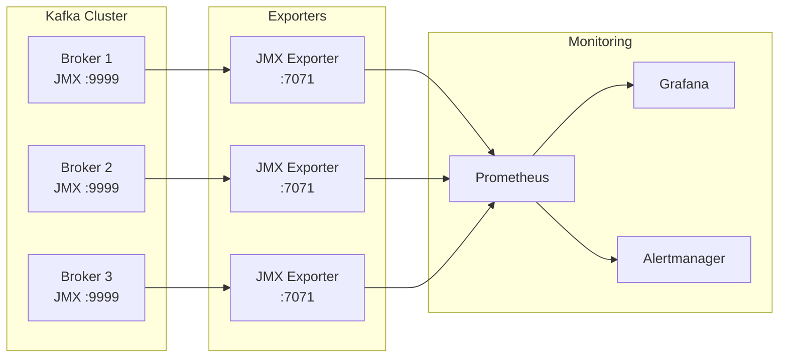

# How to Monitor Kafka Metrics with Prometheus

Author: [nawazdhandala](https://www.github.com/nawazdhandala)

Tags: Kafka, Prometheus, Monitoring, Observability, Metrics

Description: Set up comprehensive Kafka monitoring with Prometheus, including broker metrics, consumer lag tracking, and alerting for production reliability.

---

Kafka exposes hundreds of metrics via JMX. Prometheus scrapes these metrics, stores them, and powers dashboards and alerts. Proper monitoring catches problems before they become outages.

## Architecture Overview



## Setting Up JMX Exporter

The JMX Exporter converts Kafka's JMX metrics to Prometheus format.

```yaml
# kafka-jmx-config.yml
lowercaseOutputName: true
lowercaseOutputLabelNames: true

rules:
  # Broker metrics
  - pattern: kafka.server<type=(.+), name=(.+), clientId=(.+), topic=(.+), partition=(.*)><>Value
    name: kafka_server_$1_$2
    type: GAUGE
    labels:
      clientId: "$3"
      topic: "$4"
      partition: "$5"

  - pattern: kafka.server<type=(.+), name=(.+), clientId=(.+), brokerHost=(.+), brokerPort=(.+)><>Value
    name: kafka_server_$1_$2
    type: GAUGE
    labels:
      clientId: "$3"
      broker: "$4:$5"

  # Request metrics
  - pattern: kafka.network<type=RequestMetrics, name=(.+), request=(.+), error=(.+)><>Count
    name: kafka_network_requestmetrics_$1_total
    type: COUNTER
    labels:
      request: "$2"
      error: "$3"

  - pattern: kafka.network<type=RequestMetrics, name=(.+), request=(.+)><>Count
    name: kafka_network_requestmetrics_$1_total
    type: COUNTER
    labels:
      request: "$2"

  # Log metrics
  - pattern: kafka.log<type=LogFlushStats, name=(.+)><>(.+)
    name: kafka_log_logflushstats_$1
    type: GAUGE

  # Controller metrics
  - pattern: kafka.controller<type=(.+), name=(.+)><>Value
    name: kafka_controller_$1_$2
    type: GAUGE

  # Consumer group metrics
  - pattern: kafka.server<type=(.+), name=(.+), topic=(.+)><>Value
    name: kafka_server_$1_$2
    type: GAUGE
    labels:
      topic: "$3"

  # Replica metrics
  - pattern: kafka.server<type=ReplicaManager, name=(.+)><>Value
    name: kafka_server_replicamanager_$1
    type: GAUGE

  # Partition metrics
  - pattern: kafka.cluster<type=Partition, name=(.+), topic=(.+), partition=(.+)><>Value
    name: kafka_cluster_partition_$1
    type: GAUGE
    labels:
      topic: "$2"
      partition: "$3"
```

Start Kafka with JMX Exporter:

```bash
# kafka-server-start.sh modification
export KAFKA_OPTS="-javaagent:/opt/jmx_exporter/jmx_prometheus_javaagent.jar=7071:/opt/jmx_exporter/kafka-jmx-config.yml"

# Or in Docker
docker run -d \
  -e KAFKA_JMX_OPTS="-Dcom.sun.management.jmxremote -Dcom.sun.management.jmxremote.port=9999 -Dcom.sun.management.jmxremote.authenticate=false -Dcom.sun.management.jmxremote.ssl=false" \
  -e KAFKA_OPTS="-javaagent:/opt/jmx_exporter/jmx_prometheus_javaagent.jar=7071:/opt/jmx_exporter/config.yml" \
  confluentinc/cp-kafka:7.5.0
```

## Prometheus Configuration

Configure Prometheus to scrape Kafka exporters.

```yaml
# prometheus.yml
global:
  scrape_interval: 15s
  evaluation_interval: 15s

scrape_configs:
  # Kafka brokers
  - job_name: 'kafka'
    static_configs:
      - targets:
          - 'kafka-1:7071'
          - 'kafka-2:7071'
          - 'kafka-3:7071'
    relabel_configs:
      - source_labels: [__address__]
        regex: '(.+):\d+'
        target_label: instance
        replacement: '${1}'

  # Kafka Connect
  - job_name: 'kafka-connect'
    static_configs:
      - targets:
          - 'connect-1:7071'
          - 'connect-2:7071'

  # Consumer lag exporter
  - job_name: 'kafka-lag-exporter'
    static_configs:
      - targets:
          - 'kafka-lag-exporter:9999'
```

## Essential Metrics to Monitor

### Broker Health

```promql
# Under-replicated partitions (should be 0)
kafka_server_replicamanager_underreplicatedpartitions

# Active controller count (should be 1 across cluster)
sum(kafka_controller_kafkacontroller_activecontrollercount)

# Offline partition count (should be 0)
kafka_controller_kafkacontroller_offlinepartitionscount

# Leader election rate (spikes indicate instability)
rate(kafka_controller_controllerstats_leaderelectionrateandtimems_count[5m])
```

### Throughput

```promql
# Messages in per second per broker
rate(kafka_server_brokertopicmetrics_messagesinpersec_count[5m])

# Bytes in per second
rate(kafka_server_brokertopicmetrics_bytesinpersec_count[5m])

# Bytes out per second
rate(kafka_server_brokertopicmetrics_bytesoutpersec_count[5m])

# Produce requests per second
rate(kafka_network_requestmetrics_requestspersec_count{request="Produce"}[5m])

# Fetch requests per second
rate(kafka_network_requestmetrics_requestspersec_count{request="Fetch"}[5m])
```

### Latency

```promql
# Produce request latency (99th percentile)
kafka_network_requestmetrics_totaltimems{request="Produce", quantile="0.99"}

# Fetch request latency
kafka_network_requestmetrics_totaltimems{request="Fetch", quantile="0.99"}

# Request queue time (time waiting in queue)
kafka_network_requestmetrics_requestqueuetimems{quantile="0.99"}

# Log flush latency
kafka_log_logflushstats_logflushrateandtimems{quantile="0.99"}
```

### Consumer Lag

Consumer lag requires a dedicated exporter like kafka-lag-exporter or Burrow.

```yaml
# kafka-lag-exporter configuration
kafka-lag-exporter:
  image: seglo/kafka-lag-exporter:0.8.2
  environment:
    - KAFKA_LAG_EXPORTER_BOOTSTRAP_SERVERS=kafka-1:9092,kafka-2:9092
    - KAFKA_LAG_EXPORTER_GROUP_WHITELIST=.*
  ports:
    - "9999:9999"
```

```promql
# Consumer lag by group and topic
kafka_consumergroup_lag

# Lag in seconds (estimated time behind)
kafka_consumergroup_lag_seconds

# Max lag across all partitions
max(kafka_consumergroup_lag) by (group, topic)

# Consumer groups with increasing lag
rate(kafka_consumergroup_lag[5m]) > 0
```

## Grafana Dashboard

Create a comprehensive dashboard.

```json
{
  "dashboard": {
    "title": "Kafka Overview",
    "panels": [
      {
        "title": "Under-Replicated Partitions",
        "type": "stat",
        "targets": [
          {
            "expr": "sum(kafka_server_replicamanager_underreplicatedpartitions)",
            "legendFormat": "Under-replicated"
          }
        ],
        "thresholds": {
          "mode": "absolute",
          "steps": [
            {"color": "green", "value": null},
            {"color": "red", "value": 1}
          ]
        }
      },
      {
        "title": "Messages Per Second",
        "type": "graph",
        "targets": [
          {
            "expr": "sum(rate(kafka_server_brokertopicmetrics_messagesinpersec_count[5m])) by (topic)",
            "legendFormat": "{{topic}}"
          }
        ]
      },
      {
        "title": "Consumer Lag",
        "type": "graph",
        "targets": [
          {
            "expr": "sum(kafka_consumergroup_lag) by (group)",
            "legendFormat": "{{group}}"
          }
        ]
      },
      {
        "title": "Request Latency P99",
        "type": "graph",
        "targets": [
          {
            "expr": "kafka_network_requestmetrics_totaltimems{quantile=\"0.99\", request=\"Produce\"}",
            "legendFormat": "Produce P99"
          },
          {
            "expr": "kafka_network_requestmetrics_totaltimems{quantile=\"0.99\", request=\"Fetch\"}",
            "legendFormat": "Fetch P99"
          }
        ]
      }
    ]
  }
}
```

## Alerting Rules

Define alerts for critical conditions.

```yaml
# kafka-alerts.yml
groups:
  - name: kafka-broker-alerts
    rules:
      - alert: KafkaBrokerDown
        expr: up{job="kafka"} == 0
        for: 1m
        labels:
          severity: critical
        annotations:
          summary: "Kafka broker {{ $labels.instance }} is down"

      - alert: UnderReplicatedPartitions
        expr: kafka_server_replicamanager_underreplicatedpartitions > 0
        for: 5m
        labels:
          severity: warning
        annotations:
          summary: "{{ $value }} under-replicated partitions on {{ $labels.instance }}"

      - alert: OfflinePartitions
        expr: kafka_controller_kafkacontroller_offlinepartitionscount > 0
        for: 1m
        labels:
          severity: critical
        annotations:
          summary: "{{ $value }} offline partitions detected"

      - alert: NoActiveController
        expr: sum(kafka_controller_kafkacontroller_activecontrollercount) != 1
        for: 1m
        labels:
          severity: critical
        annotations:
          summary: "Kafka cluster has no active controller"

  - name: kafka-performance-alerts
    rules:
      - alert: HighProduceLatency
        expr: kafka_network_requestmetrics_totaltimems{request="Produce", quantile="0.99"} > 100
        for: 5m
        labels:
          severity: warning
        annotations:
          summary: "Produce latency P99 is {{ $value }}ms"

      - alert: HighConsumerLag
        expr: sum(kafka_consumergroup_lag) by (group) > 10000
        for: 10m
        labels:
          severity: warning
        annotations:
          summary: "Consumer group {{ $labels.group }} has lag > 10000"

      - alert: ConsumerLagIncreasing
        expr: rate(kafka_consumergroup_lag[5m]) > 100
        for: 15m
        labels:
          severity: warning
        annotations:
          summary: "Consumer lag increasing for {{ $labels.group }}"

  - name: kafka-disk-alerts
    rules:
      - alert: KafkaDiskUsageHigh
        expr: |
          (kafka_log_size / kafka_log_max_size) > 0.8
        for: 15m
        labels:
          severity: warning
        annotations:
          summary: "Kafka disk usage over 80% on {{ $labels.instance }}"
```

## Client-Side Metrics

Export metrics from your producers and consumers.

```java
// Producer with Micrometer metrics
@Configuration
public class KafkaMetricsConfig {

    @Bean
    public MeterRegistryCustomizer<MeterRegistry> kafkaMetrics() {
        return registry -> {
            new KafkaClientMetrics(producer).bindTo(registry);
            new KafkaClientMetrics(consumer).bindTo(registry);
        };
    }
}
```

Key client metrics:

```promql
# Producer metrics
kafka_producer_record_send_total
kafka_producer_record_error_total
kafka_producer_request_latency_avg

# Consumer metrics
kafka_consumer_records_consumed_total
kafka_consumer_fetch_latency_avg
kafka_consumer_records_lag_max
```

---

Monitoring Kafka with Prometheus provides visibility into cluster health, performance, and consumer behavior. Start with the essential metrics: under-replicated partitions, consumer lag, and request latency. Add alerts for conditions that require immediate attention. Build dashboards that answer questions before they are asked. When something goes wrong at 3am, good monitoring is the difference between a quick fix and a prolonged outage.
