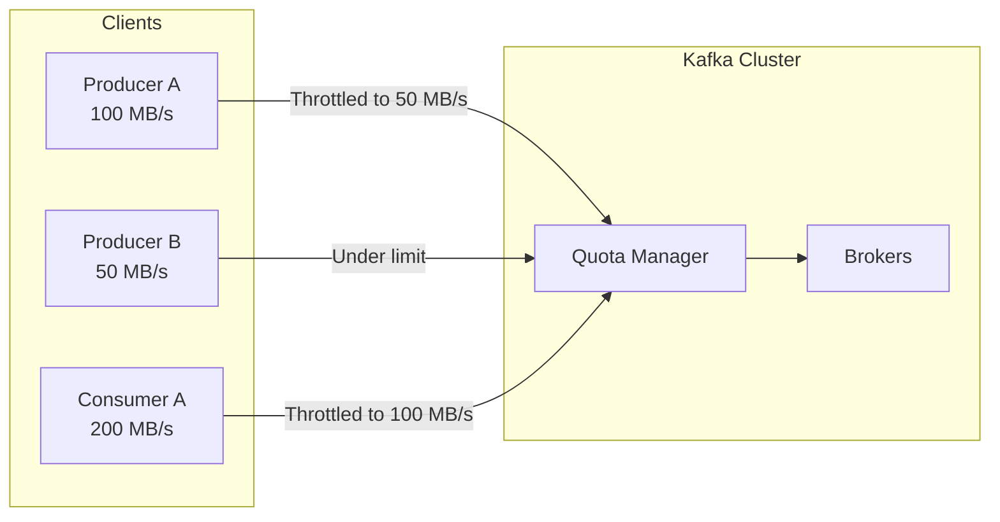

# How to Enforce Rate Limits with Kafka Quotas

Author: [nawazdhandala](https://www.github.com/nawazdhandala)

Tags: Kafka, Quotas, Rate Limiting, Multi-Tenancy, Resource Management

Description: Configure Kafka quotas to prevent noisy neighbors, protect cluster resources, and ensure fair bandwidth allocation across clients and users.

---

Without quotas, a single misbehaving producer or consumer can saturate your Kafka cluster. Quotas throttle clients that exceed their allocation, protecting the cluster and ensuring fair resource distribution across teams.

## Types of Kafka Quotas

Kafka supports three quota types:

1. **Produce quotas**: Limit bytes/second produced
2. **Fetch quotas**: Limit bytes/second consumed
3. **Request quotas**: Limit CPU time percentage



## Setting Quotas via CLI

Use `kafka-configs.sh` to configure quotas.

```bash
# Set quota for a specific user
# Limit user "analytics" to 50 MB/s produce, 100 MB/s consume
kafka-configs.sh --alter \
  --entity-type users \
  --entity-name analytics \
  --bootstrap-server localhost:9092 \
  --add-config 'producer_byte_rate=52428800,consumer_byte_rate=104857600'

# Set quota for a specific client ID
kafka-configs.sh --alter \
  --entity-type clients \
  --entity-name batch-processor \
  --bootstrap-server localhost:9092 \
  --add-config 'producer_byte_rate=10485760'

# Set quota for user + client combination
kafka-configs.sh --alter \
  --entity-type users \
  --entity-name analytics \
  --entity-type clients \
  --entity-name high-priority \
  --bootstrap-server localhost:9092 \
  --add-config 'producer_byte_rate=104857600'

# Set default quota for all users
kafka-configs.sh --alter \
  --entity-type users \
  --entity-default \
  --bootstrap-server localhost:9092 \
  --add-config 'producer_byte_rate=20971520,consumer_byte_rate=41943040'
```

## Quota Precedence

Quotas follow a specific precedence order:

1. `/config/users/<user>/clients/<client>` (most specific)
2. `/config/users/<user>/clients/<default>`
3. `/config/users/<user>`
4. `/config/users/<default>/clients/<client>`
5. `/config/users/<default>/clients/<default>`
6. `/config/users/<default>`
7. `/config/clients/<client>`
8. `/config/clients/<default>` (least specific)

```bash
# Example: Set different tiers
# Default users get 10 MB/s
kafka-configs.sh --alter \
  --entity-type users --entity-default \
  --bootstrap-server localhost:9092 \
  --add-config 'producer_byte_rate=10485760'

# Premium users get 100 MB/s
kafka-configs.sh --alter \
  --entity-type users --entity-name premium-user \
  --bootstrap-server localhost:9092 \
  --add-config 'producer_byte_rate=104857600'

# Premium user's batch client gets 500 MB/s
kafka-configs.sh --alter \
  --entity-type users --entity-name premium-user \
  --entity-type clients --entity-name batch-job \
  --bootstrap-server localhost:9092 \
  --add-config 'producer_byte_rate=524288000'
```

## Request Quota (CPU)

Limit the percentage of broker CPU time a client can use.

```bash
# Limit request processing to 10% of broker capacity
kafka-configs.sh --alter \
  --entity-type users \
  --entity-name heavy-user \
  --bootstrap-server localhost:9092 \
  --add-config 'request_percentage=10'
```

This prevents clients with expensive requests (large fetches, many partitions) from starving others.

## Configuring Producers for Quotas

Producers should handle throttling gracefully.

```java
Properties props = new Properties();
props.put("bootstrap.servers", "localhost:9092");
props.put("key.serializer", StringSerializer.class.getName());
props.put("value.serializer", StringSerializer.class.getName());

// Set client.id - used for quota matching
props.put("client.id", "order-producer");

// Handle throttling with appropriate timeouts
props.put("delivery.timeout.ms", "120000");  // Allow time for throttle delays
props.put("request.timeout.ms", "30000");
props.put("max.block.ms", "60000");  // Max time to wait for send buffer space

KafkaProducer<String, String> producer = new KafkaProducer<>(props);

// Monitor throttle metrics
producer.metrics().forEach((name, metric) -> {
    if (name.name().equals("produce-throttle-time-avg")) {
        System.out.println("Average throttle time: " + metric.metricValue() + " ms");
    }
    if (name.name().equals("produce-throttle-time-max")) {
        System.out.println("Max throttle time: " + metric.metricValue() + " ms");
    }
});
```

## Configuring Consumers for Quotas

Consumers also need quota-aware configuration.

```java
Properties props = new Properties();
props.put("bootstrap.servers", "localhost:9092");
props.put("group.id", "order-consumers");
props.put("client.id", "order-consumer-1");  // Used for quota matching

// Adjust fetch settings to work with quotas
props.put("fetch.max.bytes", "10485760");  // 10 MB max per fetch
props.put("max.partition.fetch.bytes", "1048576");  // 1 MB per partition

// Longer timeouts to handle throttling
props.put("default.api.timeout.ms", "60000");
props.put("request.timeout.ms", "30000");

KafkaConsumer<String, String> consumer = new KafkaConsumer<>(props);

// Monitor consumer throttle metrics
consumer.metrics().forEach((name, metric) -> {
    if (name.name().equals("fetch-throttle-time-avg")) {
        double throttleMs = (double) metric.metricValue();
        if (throttleMs > 0) {
            System.out.println("Being throttled: " + throttleMs + " ms avg");
        }
    }
});
```

## Viewing Current Quotas

Check what quotas are configured.

```bash
# List all quotas
kafka-configs.sh --describe \
  --entity-type users \
  --bootstrap-server localhost:9092

kafka-configs.sh --describe \
  --entity-type clients \
  --bootstrap-server localhost:9092

# Check quota for specific user
kafka-configs.sh --describe \
  --entity-type users \
  --entity-name analytics \
  --bootstrap-server localhost:9092

# Check default quotas
kafka-configs.sh --describe \
  --entity-type users \
  --entity-default \
  --bootstrap-server localhost:9092
```

## Monitoring Quota Usage

Track quota metrics to identify throttled clients.

```yaml
# Prometheus alerting rules
groups:
  - name: kafka-quota-alerts
    rules:
      - alert: ClientThrottled
        expr: kafka_server_clientquotametrics_throttle_time > 1000
        for: 5m
        labels:
          severity: warning
        annotations:
          summary: "Kafka client {{ $labels.client_id }} is being throttled"

      - alert: HighQuotaUtilization
        expr: >
          kafka_server_clientquotametrics_produce_byte_rate /
          kafka_server_clientquotametrics_quota_produce_byte_rate > 0.9
        for: 10m
        labels:
          severity: info
        annotations:
          summary: "Client {{ $labels.client_id }} using 90%+ of quota"
```

Key JMX metrics:

```java
// Broker-side quota metrics (JMX)
// kafka.server:type=ClientQuotaMetrics,user=*,client-id=*

// produce-throttle-time-avg - Average throttle time in ms
// produce-throttle-time-max - Max throttle time in ms
// fetch-throttle-time-avg - Average fetch throttle time
// request-throttle-time-avg - Average request throttle time

// Client-side metrics
// kafka.producer:type=producer-metrics,client-id=*
// produce-throttle-time-avg
// produce-throttle-time-max
```

## Dynamic Quota Management

Implement a service to manage quotas dynamically.

```java
@Service
public class QuotaManager {

    private final AdminClient adminClient;

    public QuotaManager(AdminClient adminClient) {
        this.adminClient = adminClient;
    }

    // Set quota for a team/user
    public void setUserQuota(String user, long produceBytesPerSec,
                            long fetchBytesPerSec) {
        ClientQuotaEntity entity = new ClientQuotaEntity(
            Map.of(ClientQuotaEntity.USER, user)
        );

        List<ClientQuotaAlteration.Op> ops = List.of(
            new ClientQuotaAlteration.Op(
                "producer_byte_rate",
                (double) produceBytesPerSec
            ),
            new ClientQuotaAlteration.Op(
                "consumer_byte_rate",
                (double) fetchBytesPerSec
            )
        );

        ClientQuotaAlteration alteration = new ClientQuotaAlteration(entity, ops);
        adminClient.alterClientQuotas(List.of(alteration)).all().join();
    }

    // Remove quota (revert to default)
    public void removeUserQuota(String user) {
        ClientQuotaEntity entity = new ClientQuotaEntity(
            Map.of(ClientQuotaEntity.USER, user)
        );

        // Op with null value removes the quota
        List<ClientQuotaAlteration.Op> ops = List.of(
            new ClientQuotaAlteration.Op("producer_byte_rate", null),
            new ClientQuotaAlteration.Op("consumer_byte_rate", null)
        );

        ClientQuotaAlteration alteration = new ClientQuotaAlteration(entity, ops);
        adminClient.alterClientQuotas(List.of(alteration)).all().join();
    }

    // List all quotas
    public Map<ClientQuotaEntity, Map<String, Double>> listQuotas() {
        ClientQuotaFilter filter = ClientQuotaFilter.all();

        Map<ClientQuotaEntity, Map<String, Double>> result = new HashMap<>();
        adminClient.describeClientQuotas(filter).entities().forEach(
            (entity, quotasFuture) -> {
                try {
                    result.put(entity, quotasFuture.get());
                } catch (Exception e) {
                    throw new RuntimeException(e);
                }
            }
        );

        return result;
    }
}
```

## Multi-Tenant Quota Strategy

For multi-tenant Kafka clusters, implement tiered quotas.

```bash
# Tier 1: Free tier (default) - 10 MB/s produce, 20 MB/s consume
kafka-configs.sh --alter \
  --entity-type users --entity-default \
  --bootstrap-server localhost:9092 \
  --add-config 'producer_byte_rate=10485760,consumer_byte_rate=20971520,request_percentage=5'

# Tier 2: Standard - 50 MB/s produce, 100 MB/s consume
# Applied per user via automation when they upgrade

# Tier 3: Enterprise - 500 MB/s produce, 1 GB/s consume
# Plus higher CPU allocation

# Reserved capacity for internal services
kafka-configs.sh --alter \
  --entity-type users --entity-name internal-services \
  --bootstrap-server localhost:9092 \
  --add-config 'producer_byte_rate=1073741824,consumer_byte_rate=2147483648,request_percentage=30'
```

## Broker-Level Limits

Set cluster-wide limits as a safety net.

```properties
# server.properties

# Default quota for users without specific configuration
quota.producer.default=10485760
quota.consumer.default=20971520

# Window for measuring rates
quota.window.num=11
quota.window.size.seconds=1
```

---

Quotas protect your Kafka cluster from misbehaving clients and ensure fair resource sharing. Start with conservative defaults, monitor throttle metrics, and adjust based on actual usage patterns. For multi-tenant environments, implement automated quota management tied to your billing or subscription system. The overhead of quota enforcement is minimal compared to the stability it provides.
