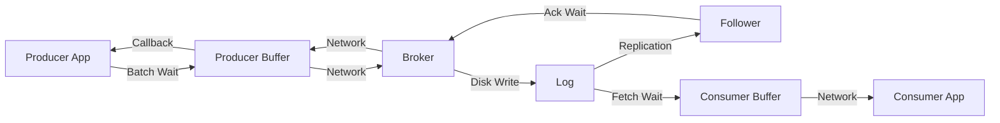

# How to Tune Kafka for Sub-Millisecond Latency

Author: [nawazdhandala](https://www.github.com/nawazdhandala)

Tags: Kafka, Performance, Latency, Tuning, Low Latency

Description: Configure Kafka brokers, producers, and consumers for ultra-low latency workloads, trading throughput for speed where needed.

---

Kafka defaults favor throughput over latency. Batching, compression, and replication add milliseconds that accumulate. For latency-sensitive applications like trading systems, real-time bidding, or gaming, every millisecond counts. Here is how to tune Kafka for sub-millisecond end-to-end latency.

## Understanding Latency Components



Each step adds latency:
- Producer batching: 0-linger.ms
- Network round trip: ~1ms local, higher remote
- Broker disk write: ~1ms SSD, higher HDD
- Replication: Additional network + disk per replica
- Consumer fetch delay: 0-fetch.max.wait.ms

## Producer Configuration for Low Latency

Minimize batching and waiting time.

```java
Properties props = new Properties();
props.put("bootstrap.servers", "localhost:9092");
props.put("key.serializer", StringSerializer.class.getName());
props.put("value.serializer", StringSerializer.class.getName());

// Disable batching delay - send immediately
props.put("linger.ms", "0");

// Small batch size to send quickly
props.put("batch.size", "1");  // 1 byte = effectively no batching

// Reduce buffer memory (less to fill)
props.put("buffer.memory", "33554432");  // 32 MB

// Acks configuration - trade-off
// acks=0: Fastest, no durability
// acks=1: Leader only, good balance
// acks=all: Slowest, full durability
props.put("acks", "1");

// Disable compression (CPU overhead)
props.put("compression.type", "none");

// Reduce request timeout
props.put("request.timeout.ms", "5000");

// Single connection is faster for low volume
props.put("max.in.flight.requests.per.connection", "1");

// Enable idempotence for safety (minimal overhead)
props.put("enable.idempotence", "true");

KafkaProducer<String, String> producer = new KafkaProducer<>(props);
```

## Synchronous Send for Predictable Latency

For lowest latency, wait for each send to complete.

```java
// Synchronous send - blocks until broker ack
public void sendLowLatency(String topic, String key, String value)
        throws ExecutionException, InterruptedException {

    ProducerRecord<String, String> record = new ProducerRecord<>(topic, key, value);

    // get() blocks until ack received
    RecordMetadata metadata = producer.send(record).get();

    // Latency is the full round trip
    System.out.printf("Sent to partition %d in %d ms%n",
        metadata.partition(),
        System.currentTimeMillis() - record.timestamp());
}

// Fire and forget - lowest latency, no guarantee
public void sendFireAndForget(String topic, String key, String value) {
    ProducerRecord<String, String> record = new ProducerRecord<>(topic, key, value);
    producer.send(record);  // Don't wait for result
}
```

## Consumer Configuration for Low Latency

Minimize fetch delays and batch waiting.

```java
Properties props = new Properties();
props.put("bootstrap.servers", "localhost:9092");
props.put("group.id", "low-latency-consumer");
props.put("key.deserializer", StringDeserializer.class.getName());
props.put("value.deserializer", StringDeserializer.class.getName());

// Fetch immediately when data available
props.put("fetch.min.bytes", "1");

// Don't wait for more data
props.put("fetch.max.wait.ms", "1");

// Fetch small amounts frequently
props.put("max.partition.fetch.bytes", "1048576");  // 1 MB

// Process small batches
props.put("max.poll.records", "1");

// Frequent heartbeats for fast group membership
props.put("heartbeat.interval.ms", "1000");
props.put("session.timeout.ms", "6000");

KafkaConsumer<String, String> consumer = new KafkaConsumer<>(props);
```

## Broker Configuration

Optimize broker settings for latency.

```properties
# server.properties

# Faster log flush (trade durability for speed)
# WARNING: Risk of data loss on crash
log.flush.interval.messages=1
log.flush.interval.ms=0

# Reduce replication latency
replica.lag.time.max.ms=500
replica.fetch.min.bytes=1
replica.fetch.wait.max.ms=10

# Socket tuning
socket.send.buffer.bytes=1048576
socket.receive.buffer.bytes=1048576
socket.request.max.bytes=104857600

# Network threads
num.network.threads=8
num.io.threads=16

# Request handling
queued.max.requests=500

# Log segment tuning
log.segment.bytes=536870912
log.index.interval.bytes=4096
```

## Hardware and OS Tuning

Software configuration only goes so far.

```bash
# Disable swap
sudo swapoff -a

# Increase file descriptors
ulimit -n 100000

# Tune TCP settings
echo "net.core.rmem_max=16777216" >> /etc/sysctl.conf
echo "net.core.wmem_max=16777216" >> /etc/sysctl.conf
echo "net.ipv4.tcp_rmem=4096 87380 16777216" >> /etc/sysctl.conf
echo "net.ipv4.tcp_wmem=4096 65536 16777216" >> /etc/sysctl.conf
echo "net.core.netdev_max_backlog=30000" >> /etc/sysctl.conf
sudo sysctl -p

# Use NVMe SSDs for log directories
# Mount with noatime
mount -o noatime /dev/nvme0n1 /var/kafka-logs

# Pin JVM to specific CPU cores
taskset -c 0-7 kafka-server-start.sh config/server.properties
```

JVM tuning:

```bash
# KAFKA_HEAP_OPTS for low-latency GC
export KAFKA_HEAP_OPTS="-Xms6g -Xmx6g"

# Use ZGC or Shenandoah for low pause times
export KAFKA_JVM_PERFORMANCE_OPTS="-XX:+UseZGC -XX:+ZGenerational"

# Or G1GC with tuned pauses
export KAFKA_JVM_PERFORMANCE_OPTS="-XX:+UseG1GC -XX:MaxGCPauseMillis=5 -XX:G1HeapRegionSize=16m"
```

## Measuring Latency

Instrument your application to measure actual latency.

```java
public class LatencyTracker {

    private final Histogram produceLatency;
    private final Histogram e2eLatency;

    public LatencyTracker(MeterRegistry registry) {
        this.produceLatency = Histogram.builder("kafka.produce.latency")
            .publishPercentiles(0.5, 0.95, 0.99, 0.999)
            .register(registry);

        this.e2eLatency = Histogram.builder("kafka.e2e.latency")
            .publishPercentiles(0.5, 0.95, 0.99, 0.999)
            .register(registry);
    }

    // Producer side
    public void recordProduceLatency(long startNanos) {
        long latencyMs = (System.nanoTime() - startNanos) / 1_000_000;
        produceLatency.record(latencyMs);
    }

    // Consumer side - requires timestamp in message
    public void recordE2ELatency(ConsumerRecord<?, ?> record) {
        long produceTime = record.timestamp();
        long consumeTime = System.currentTimeMillis();
        e2eLatency.record(consumeTime - produceTime);
    }
}

// Produce with timing
long start = System.nanoTime();
RecordMetadata metadata = producer.send(record).get();
tracker.recordProduceLatency(start);

// Consume with timing
for (ConsumerRecord<String, String> record : records) {
    tracker.recordE2ELatency(record);
    process(record);
}
```

## Replication Trade-offs

Replication adds latency. Choose based on your requirements.

```java
// Fastest: No replication wait
props.put("acks", "0");
// ~0.5ms produce latency
// Risk: Data loss if leader fails before replication

// Balanced: Leader only
props.put("acks", "1");
// ~1-2ms produce latency
// Risk: Data loss if leader fails after ack but before replication

// Safest: All replicas
props.put("acks", "all");
// ~3-5ms produce latency
// Adds ISR replication time
// No data loss (if min.insync.replicas > 1)
```

## Single Partition for Lowest Latency

Multiple partitions add coordination overhead.

```bash
# For ultra-low latency workloads
kafka-topics.sh --create \
  --topic ultra-fast \
  --bootstrap-server localhost:9092 \
  --partitions 1 \
  --replication-factor 1

# Or with replication
kafka-topics.sh --create \
  --topic fast-replicated \
  --bootstrap-server localhost:9092 \
  --partitions 1 \
  --replication-factor 2 \
  --config min.insync.replicas=1
```

## Network Proximity

Physical distance adds latency that cannot be tuned away.

| Scenario | Added Latency |
|----------|---------------|
| Same machine | ~0.1ms |
| Same rack | ~0.5ms |
| Same datacenter | ~1ms |
| Cross-datacenter | 10-100ms |
| Cross-region | 50-200ms |

For sub-millisecond latency:
- Colocate producers, brokers, and consumers
- Use dedicated network interfaces
- Avoid virtualization overhead when possible

## Benchmarking Setup

Test latency under realistic conditions.

```bash
# Kafka built-in producer performance test
kafka-producer-perf-test.sh \
  --topic latency-test \
  --num-records 100000 \
  --record-size 100 \
  --throughput 10000 \
  --producer-props \
    bootstrap.servers=localhost:9092 \
    acks=1 \
    linger.ms=0 \
    batch.size=1

# Consumer performance test
kafka-consumer-perf-test.sh \
  --topic latency-test \
  --bootstrap-server localhost:9092 \
  --messages 100000 \
  --fetch-size 1048576
```

---

Sub-millisecond Kafka latency requires compromises. Disable batching, reduce replication, use fast hardware, and colocate components. The fastest configuration sacrifices durability and throughput. Profile your actual workload to find the right balance. For most applications, 5-10ms latency with full durability is the better choice. Reserve aggressive tuning for systems where latency directly impacts business outcomes.
