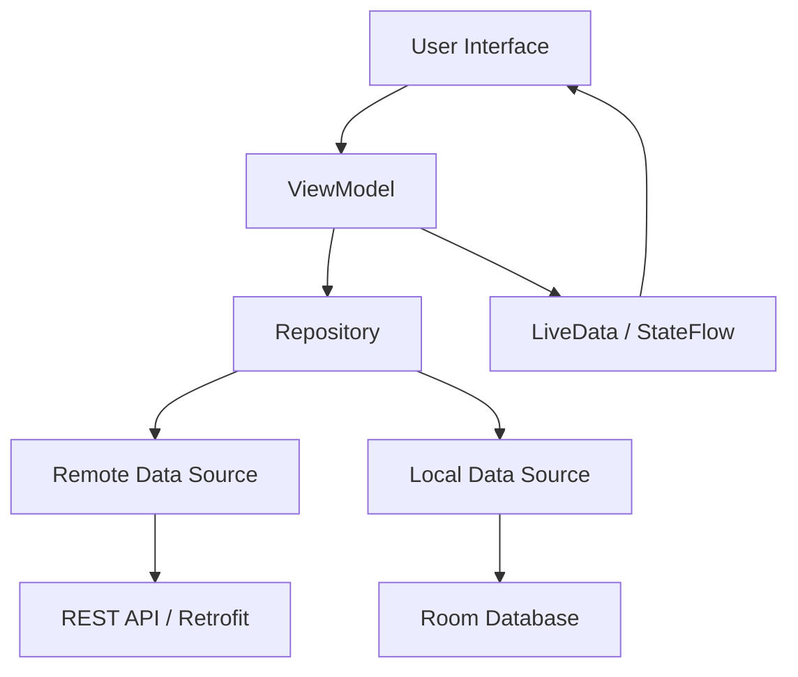
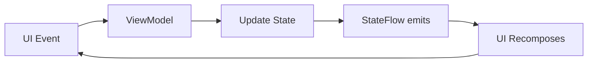
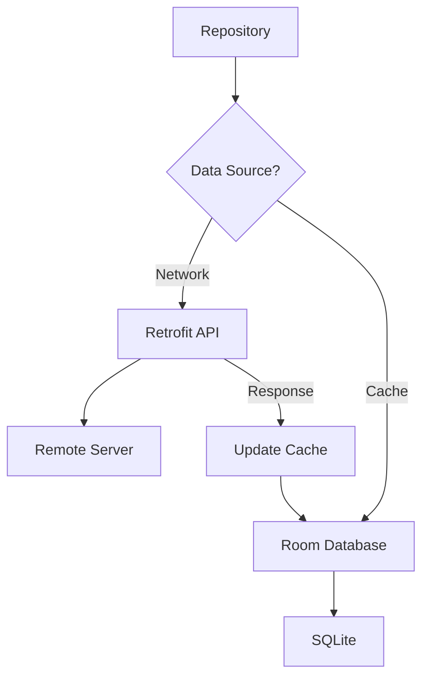

# How to Build Android Apps with Kotlin

Author: [nawazdhandala](https://www.github.com/nawazdhandala)

Tags: Android, Kotlin, Mobile Development, Jetpack Compose, MVVM, Android Studio, App Development

Description: A practical guide to building Android applications with Kotlin, covering project setup, UI development with Jetpack Compose, architecture patterns, and real-world examples.

---

> Kotlin has become the preferred language for Android development. Google officially recommends Kotlin for new Android projects, and most modern Android libraries are designed with Kotlin in mind. This guide walks you through building Android apps using Kotlin, from project setup to production-ready patterns.

Whether you're new to Android development or transitioning from Java, Kotlin offers concise syntax, null safety, and powerful features that make mobile development more productive and enjoyable.

---

## Setting Up Your Development Environment

Before writing code, you need Android Studio installed and configured.

### Installing Android Studio

1. Download Android Studio from [developer.android.com](https://developer.android.com/studio)
2. Run the installer and follow the setup wizard
3. Install the Android SDK and emulator images
4. Configure a virtual device for testing

### Creating a New Project

When creating a new project in Android Studio:

1. Select "Empty Compose Activity" for modern UI development
2. Set the language to Kotlin
3. Choose a minimum SDK (API 24 covers 95%+ of devices)
4. Set the package name following reverse domain notation

```kotlin
// Your project structure will look like this:
// app/
//   src/
//     main/
//       java/com/yourpackage/
//         MainActivity.kt
//         ui/theme/
//       res/
//         values/
//         drawable/
//       AndroidManifest.xml
//   build.gradle.kts
// build.gradle.kts (project level)
// settings.gradle.kts
```

---

## Understanding the Android App Architecture



Modern Android apps follow the MVVM (Model-View-ViewModel) pattern:

- **View**: Displays data and captures user interactions (Activities, Fragments, Composables)
- **ViewModel**: Holds UI state and handles business logic
- **Model/Repository**: Manages data operations and abstracts data sources

---

## Project Configuration

### build.gradle.kts (Module Level)

```kotlin
plugins {
    // Android application plugin
    id("com.android.application")
    // Kotlin Android plugin
    id("org.jetbrains.kotlin.android")
    // Kotlin compiler plugin for Compose
    id("org.jetbrains.kotlin.plugin.compose")
}

android {
    namespace = "com.example.myapp"
    compileSdk = 34

    defaultConfig {
        applicationId = "com.example.myapp"
        minSdk = 24
        targetSdk = 34
        versionCode = 1
        versionName = "1.0"

        testInstrumentationRunner = "androidx.test.runner.AndroidJUnitRunner"
    }

    buildTypes {
        release {
            // Enable minification for smaller APK size
            isMinifyEnabled = true
            proguardFiles(
                getDefaultProguardFile("proguard-android-optimize.txt"),
                "proguard-rules.pro"
            )
        }
    }

    compileOptions {
        sourceCompatibility = JavaVersion.VERSION_17
        targetCompatibility = JavaVersion.VERSION_17
    }

    kotlinOptions {
        jvmTarget = "17"
    }

    buildFeatures {
        // Enable Jetpack Compose
        compose = true
    }
}

dependencies {
    // Core Android KTX - Kotlin extensions for Android
    implementation("androidx.core:core-ktx:1.12.0")

    // Lifecycle - ViewModel and LiveData
    implementation("androidx.lifecycle:lifecycle-runtime-ktx:2.7.0")
    implementation("androidx.lifecycle:lifecycle-viewmodel-compose:2.7.0")

    // Compose BOM - manages Compose library versions
    implementation(platform("androidx.compose:compose-bom:2024.02.00"))
    implementation("androidx.compose.ui:ui")
    implementation("androidx.compose.ui:ui-graphics")
    implementation("androidx.compose.ui:ui-tooling-preview")
    implementation("androidx.compose.material3:material3")
    implementation("androidx.activity:activity-compose:1.8.2")

    // Navigation for Compose
    implementation("androidx.navigation:navigation-compose:2.7.7")

    // Retrofit for networking
    implementation("com.squareup.retrofit2:retrofit:2.9.0")
    implementation("com.squareup.retrofit2:converter-gson:2.9.0")

    // Room for local database
    implementation("androidx.room:room-runtime:2.6.1")
    implementation("androidx.room:room-ktx:2.6.1")
    annotationProcessor("androidx.room:room-compiler:2.6.1")

    // Coroutines for async operations
    implementation("org.jetbrains.kotlinx:kotlinx-coroutines-android:1.7.3")

    // Testing
    testImplementation("junit:junit:4.13.2")
    androidTestImplementation("androidx.test.ext:junit:1.1.5")
    androidTestImplementation("androidx.compose.ui:ui-test-junit4")
    debugImplementation("androidx.compose.ui:ui-tooling")
}
```

---

## Building UI with Jetpack Compose

Jetpack Compose is Android's modern toolkit for building native UI. It uses declarative Kotlin code instead of XML layouts.

### Your First Composable

```kotlin
package com.example.myapp

import android.os.Bundle
import androidx.activity.ComponentActivity
import androidx.activity.compose.setContent
import androidx.compose.foundation.layout.*
import androidx.compose.material3.*
import androidx.compose.runtime.*
import androidx.compose.ui.Alignment
import androidx.compose.ui.Modifier
import androidx.compose.ui.unit.dp

class MainActivity : ComponentActivity() {
    override fun onCreate(savedInstanceState: Bundle?) {
        super.onCreate(savedInstanceState)
        // setContent replaces setContentView for Compose
        setContent {
            // Apply your app theme
            MyAppTheme {
                // Surface provides background color from theme
                Surface(
                    modifier = Modifier.fillMaxSize(),
                    color = MaterialTheme.colorScheme.background
                ) {
                    GreetingScreen()
                }
            }
        }
    }
}

// Composable functions describe your UI
@Composable
fun GreetingScreen() {
    // remember preserves state across recompositions
    // mutableStateOf creates observable state
    var name by remember { mutableStateOf("") }
    var greeting by remember { mutableStateOf("") }

    Column(
        modifier = Modifier
            .fillMaxSize()
            .padding(16.dp),
        horizontalAlignment = Alignment.CenterHorizontally,
        verticalArrangement = Arrangement.Center
    ) {
        // Text input field
        OutlinedTextField(
            value = name,
            onValueChange = { name = it },
            label = { Text("Enter your name") },
            modifier = Modifier.fillMaxWidth()
        )

        Spacer(modifier = Modifier.height(16.dp))

        // Button that updates state when clicked
        Button(
            onClick = {
                greeting = if (name.isNotBlank()) {
                    "Hello, $name!"
                } else {
                    "Please enter your name"
                }
            }
        ) {
            Text("Greet Me")
        }

        Spacer(modifier = Modifier.height(24.dp))

        // Displays the greeting
        if (greeting.isNotEmpty()) {
            Text(
                text = greeting,
                style = MaterialTheme.typography.headlineMedium
            )
        }
    }
}
```

### Building a List with LazyColumn

```kotlin
import androidx.compose.foundation.clickable
import androidx.compose.foundation.lazy.LazyColumn
import androidx.compose.foundation.lazy.items
import androidx.compose.material.icons.Icons
import androidx.compose.material.icons.filled.Person
import androidx.compose.material3.*
import androidx.compose.runtime.*
import androidx.compose.ui.Modifier
import androidx.compose.ui.unit.dp

// Data class representing a user
data class User(
    val id: Int,
    val name: String,
    val email: String
)

@Composable
fun UserListScreen(
    users: List<User>,
    onUserClick: (User) -> Unit
) {
    // LazyColumn is like RecyclerView - only renders visible items
    LazyColumn(
        modifier = Modifier.fillMaxSize(),
        contentPadding = PaddingValues(16.dp),
        verticalArrangement = Arrangement.spacedBy(8.dp)
    ) {
        // items() efficiently renders list items
        items(
            items = users,
            key = { user -> user.id } // Stable key for better performance
        ) { user ->
            UserCard(
                user = user,
                onClick = { onUserClick(user) }
            )
        }
    }
}

@Composable
fun UserCard(
    user: User,
    onClick: () -> Unit
) {
    Card(
        modifier = Modifier
            .fillMaxWidth()
            .clickable(onClick = onClick),
        elevation = CardDefaults.cardElevation(defaultElevation = 2.dp)
    ) {
        Row(
            modifier = Modifier
                .padding(16.dp)
                .fillMaxWidth(),
            verticalAlignment = Alignment.CenterVertically
        ) {
            Icon(
                imageVector = Icons.Default.Person,
                contentDescription = null,
                modifier = Modifier.size(48.dp)
            )

            Spacer(modifier = Modifier.width(16.dp))

            Column {
                Text(
                    text = user.name,
                    style = MaterialTheme.typography.titleMedium
                )
                Text(
                    text = user.email,
                    style = MaterialTheme.typography.bodyMedium,
                    color = MaterialTheme.colorScheme.onSurfaceVariant
                )
            }
        }
    }
}
```

---

## State Management with ViewModel



### Creating a ViewModel

```kotlin
package com.example.myapp.ui.users

import androidx.lifecycle.ViewModel
import androidx.lifecycle.viewModelScope
import kotlinx.coroutines.flow.MutableStateFlow
import kotlinx.coroutines.flow.StateFlow
import kotlinx.coroutines.flow.asStateFlow
import kotlinx.coroutines.launch

// Sealed class represents all possible UI states
sealed class UsersUiState {
    object Loading : UsersUiState()
    data class Success(val users: List<User>) : UsersUiState()
    data class Error(val message: String) : UsersUiState()
}

class UsersViewModel(
    private val userRepository: UserRepository
) : ViewModel() {

    // Private mutable state - only ViewModel can modify
    private val _uiState = MutableStateFlow<UsersUiState>(UsersUiState.Loading)

    // Public read-only state for the UI to observe
    val uiState: StateFlow<UsersUiState> = _uiState.asStateFlow()

    init {
        loadUsers()
    }

    fun loadUsers() {
        // viewModelScope automatically cancels when ViewModel is cleared
        viewModelScope.launch {
            _uiState.value = UsersUiState.Loading

            try {
                val users = userRepository.getUsers()
                _uiState.value = UsersUiState.Success(users)
            } catch (e: Exception) {
                _uiState.value = UsersUiState.Error(
                    e.message ?: "Unknown error occurred"
                )
            }
        }
    }

    fun deleteUser(userId: Int) {
        viewModelScope.launch {
            try {
                userRepository.deleteUser(userId)
                // Reload the list after deletion
                loadUsers()
            } catch (e: Exception) {
                _uiState.value = UsersUiState.Error(
                    "Failed to delete user: ${e.message}"
                )
            }
        }
    }
}
```

### Connecting ViewModel to Compose UI

```kotlin
import androidx.compose.runtime.Composable
import androidx.compose.runtime.collectAsState
import androidx.compose.runtime.getValue
import androidx.lifecycle.viewmodel.compose.viewModel

@Composable
fun UsersScreen(
    viewModel: UsersViewModel = viewModel(),
    onUserClick: (User) -> Unit
) {
    // collectAsState converts Flow to Compose State
    val uiState by viewModel.uiState.collectAsState()

    // Handle different UI states
    when (val state = uiState) {
        is UsersUiState.Loading -> {
            LoadingIndicator()
        }

        is UsersUiState.Success -> {
            if (state.users.isEmpty()) {
                EmptyState(message = "No users found")
            } else {
                UserListScreen(
                    users = state.users,
                    onUserClick = onUserClick
                )
            }
        }

        is UsersUiState.Error -> {
            ErrorState(
                message = state.message,
                onRetry = { viewModel.loadUsers() }
            )
        }
    }
}

@Composable
fun LoadingIndicator() {
    Box(
        modifier = Modifier.fillMaxSize(),
        contentAlignment = Alignment.Center
    ) {
        CircularProgressIndicator()
    }
}

@Composable
fun ErrorState(
    message: String,
    onRetry: () -> Unit
) {
    Column(
        modifier = Modifier
            .fillMaxSize()
            .padding(16.dp),
        horizontalAlignment = Alignment.CenterHorizontally,
        verticalArrangement = Arrangement.Center
    ) {
        Text(
            text = message,
            color = MaterialTheme.colorScheme.error,
            style = MaterialTheme.typography.bodyLarge
        )

        Spacer(modifier = Modifier.height(16.dp))

        Button(onClick = onRetry) {
            Text("Retry")
        }
    }
}
```

---

## Networking with Retrofit

### Defining the API Interface

```kotlin
package com.example.myapp.data.remote

import retrofit2.http.*

// Data classes for API responses
data class UserDto(
    val id: Int,
    val name: String,
    val email: String,
    val phone: String?
)

data class CreateUserRequest(
    val name: String,
    val email: String
)

// Retrofit interface defines API endpoints
interface UserApi {
    // GET request to fetch all users
    @GET("users")
    suspend fun getUsers(): List<UserDto>

    // GET request with path parameter
    @GET("users/{id}")
    suspend fun getUserById(@Path("id") userId: Int): UserDto

    // POST request with request body
    @POST("users")
    suspend fun createUser(@Body request: CreateUserRequest): UserDto

    // PUT request for updates
    @PUT("users/{id}")
    suspend fun updateUser(
        @Path("id") userId: Int,
        @Body request: CreateUserRequest
    ): UserDto

    // DELETE request
    @DELETE("users/{id}")
    suspend fun deleteUser(@Path("id") userId: Int)

    // GET with query parameters
    @GET("users")
    suspend fun searchUsers(
        @Query("name") name: String?,
        @Query("page") page: Int = 1,
        @Query("limit") limit: Int = 20
    ): List<UserDto>
}
```

### Setting Up Retrofit

```kotlin
package com.example.myapp.data.remote

import okhttp3.OkHttpClient
import okhttp3.logging.HttpLoggingInterceptor
import retrofit2.Retrofit
import retrofit2.converter.gson.GsonConverterFactory
import java.util.concurrent.TimeUnit

object RetrofitClient {
    private const val BASE_URL = "https://api.example.com/"

    // Logging interceptor for debugging
    private val loggingInterceptor = HttpLoggingInterceptor().apply {
        level = HttpLoggingInterceptor.Level.BODY
    }

    // OkHttp client with timeouts and interceptors
    private val okHttpClient = OkHttpClient.Builder()
        .addInterceptor(loggingInterceptor)
        .addInterceptor { chain ->
            // Add auth header to all requests
            val request = chain.request().newBuilder()
                .addHeader("Authorization", "Bearer ${getAuthToken()}")
                .addHeader("Content-Type", "application/json")
                .build()
            chain.proceed(request)
        }
        .connectTimeout(30, TimeUnit.SECONDS)
        .readTimeout(30, TimeUnit.SECONDS)
        .writeTimeout(30, TimeUnit.SECONDS)
        .build()

    // Retrofit instance
    private val retrofit = Retrofit.Builder()
        .baseUrl(BASE_URL)
        .client(okHttpClient)
        .addConverterFactory(GsonConverterFactory.create())
        .build()

    // API service instance
    val userApi: UserApi = retrofit.create(UserApi::class.java)

    private fun getAuthToken(): String {
        // Retrieve token from secure storage
        return "your-auth-token"
    }
}
```

---

## Local Storage with Room Database



### Defining Entities

```kotlin
package com.example.myapp.data.local

import androidx.room.*

// Entity represents a table in the database
@Entity(tableName = "users")
data class UserEntity(
    @PrimaryKey
    val id: Int,

    @ColumnInfo(name = "name")
    val name: String,

    @ColumnInfo(name = "email")
    val email: String,

    @ColumnInfo(name = "phone")
    val phone: String?,

    @ColumnInfo(name = "cached_at")
    val cachedAt: Long = System.currentTimeMillis()
)

// Extension function to convert between Entity and Domain model
fun UserEntity.toUser(): User = User(
    id = id,
    name = name,
    email = email
)

fun User.toEntity(): UserEntity = UserEntity(
    id = id,
    name = name,
    email = email,
    phone = null
)
```

### Creating the DAO

```kotlin
package com.example.myapp.data.local

import androidx.room.*
import kotlinx.coroutines.flow.Flow

// DAO (Data Access Object) defines database operations
@Dao
interface UserDao {
    // Flow automatically emits when data changes
    @Query("SELECT * FROM users ORDER BY name ASC")
    fun observeAllUsers(): Flow<List<UserEntity>>

    // Suspend function for one-time queries
    @Query("SELECT * FROM users ORDER BY name ASC")
    suspend fun getAllUsers(): List<UserEntity>

    @Query("SELECT * FROM users WHERE id = :userId")
    suspend fun getUserById(userId: Int): UserEntity?

    // Insert with conflict strategy
    @Insert(onConflict = OnConflictStrategy.REPLACE)
    suspend fun insertUser(user: UserEntity)

    // Insert multiple users
    @Insert(onConflict = OnConflictStrategy.REPLACE)
    suspend fun insertUsers(users: List<UserEntity>)

    @Update
    suspend fun updateUser(user: UserEntity)

    @Delete
    suspend fun deleteUser(user: UserEntity)

    @Query("DELETE FROM users WHERE id = :userId")
    suspend fun deleteUserById(userId: Int)

    @Query("DELETE FROM users")
    suspend fun deleteAllUsers()

    // Query with parameters
    @Query("SELECT * FROM users WHERE name LIKE '%' || :searchQuery || '%'")
    suspend fun searchUsers(searchQuery: String): List<UserEntity>

    // Check if cache is stale (older than 1 hour)
    @Query("SELECT COUNT(*) FROM users WHERE cached_at < :threshold")
    suspend fun countStaleEntries(threshold: Long): Int
}
```

### Setting Up the Database

```kotlin
package com.example.myapp.data.local

import android.content.Context
import androidx.room.Database
import androidx.room.Room
import androidx.room.RoomDatabase

// Database class with all entities
@Database(
    entities = [UserEntity::class],
    version = 1,
    exportSchema = false
)
abstract class AppDatabase : RoomDatabase() {
    // Abstract function returns the DAO
    abstract fun userDao(): UserDao

    companion object {
        @Volatile
        private var INSTANCE: AppDatabase? = null

        fun getInstance(context: Context): AppDatabase {
            // Double-checked locking for thread safety
            return INSTANCE ?: synchronized(this) {
                INSTANCE ?: buildDatabase(context).also { INSTANCE = it }
            }
        }

        private fun buildDatabase(context: Context): AppDatabase {
            return Room.databaseBuilder(
                context.applicationContext,
                AppDatabase::class.java,
                "app_database"
            )
                .fallbackToDestructiveMigration() // Reset DB on schema changes
                .build()
        }
    }
}
```

---

## Repository Pattern

The repository abstracts data sources and provides a clean API for the ViewModel.

```kotlin
package com.example.myapp.data.repository

import kotlinx.coroutines.flow.Flow
import kotlinx.coroutines.flow.map
import kotlinx.coroutines.Dispatchers
import kotlinx.coroutines.withContext

class UserRepository(
    private val userApi: UserApi,
    private val userDao: UserDao
) {
    // Observe users with automatic updates from database
    fun observeUsers(): Flow<List<User>> {
        return userDao.observeAllUsers().map { entities ->
            entities.map { it.toUser() }
        }
    }

    // Fetch users with caching strategy
    suspend fun getUsers(forceRefresh: Boolean = false): List<User> {
        return withContext(Dispatchers.IO) {
            // Check if we need to refresh from network
            if (forceRefresh || shouldRefreshCache()) {
                try {
                    // Fetch from network
                    val remoteUsers = userApi.getUsers()

                    // Cache the results
                    val entities = remoteUsers.map { dto ->
                        UserEntity(
                            id = dto.id,
                            name = dto.name,
                            email = dto.email,
                            phone = dto.phone
                        )
                    }
                    userDao.deleteAllUsers()
                    userDao.insertUsers(entities)
                } catch (e: Exception) {
                    // If network fails, fall back to cache
                    // Only throw if cache is empty
                    if (userDao.getAllUsers().isEmpty()) {
                        throw e
                    }
                }
            }

            // Return cached data
            userDao.getAllUsers().map { it.toUser() }
        }
    }

    suspend fun getUserById(userId: Int): User? {
        return withContext(Dispatchers.IO) {
            // Try cache first
            userDao.getUserById(userId)?.toUser()
                ?: try {
                    // Fetch from network if not in cache
                    val dto = userApi.getUserById(userId)
                    val entity = UserEntity(
                        id = dto.id,
                        name = dto.name,
                        email = dto.email,
                        phone = dto.phone
                    )
                    userDao.insertUser(entity)
                    entity.toUser()
                } catch (e: Exception) {
                    null
                }
        }
    }

    suspend fun createUser(name: String, email: String): User {
        return withContext(Dispatchers.IO) {
            val dto = userApi.createUser(CreateUserRequest(name, email))
            val entity = UserEntity(
                id = dto.id,
                name = dto.name,
                email = dto.email,
                phone = dto.phone
            )
            userDao.insertUser(entity)
            entity.toUser()
        }
    }

    suspend fun deleteUser(userId: Int) {
        withContext(Dispatchers.IO) {
            userApi.deleteUser(userId)
            userDao.deleteUserById(userId)
        }
    }

    private suspend fun shouldRefreshCache(): Boolean {
        // Refresh if cache is older than 1 hour
        val oneHourAgo = System.currentTimeMillis() - (60 * 60 * 1000)
        return userDao.countStaleEntries(oneHourAgo) > 0
    }
}
```

---

## Navigation with Jetpack Navigation

```kotlin
package com.example.myapp.ui.navigation

import androidx.compose.runtime.Composable
import androidx.navigation.NavType
import androidx.navigation.compose.NavHost
import androidx.navigation.compose.composable
import androidx.navigation.compose.rememberNavController
import androidx.navigation.navArgument

// Define routes as sealed class for type safety
sealed class Screen(val route: String) {
    object UserList : Screen("users")
    object UserDetail : Screen("users/{userId}") {
        fun createRoute(userId: Int) = "users/$userId"
    }
    object CreateUser : Screen("users/create")
}

@Composable
fun AppNavigation() {
    val navController = rememberNavController()

    NavHost(
        navController = navController,
        startDestination = Screen.UserList.route
    ) {
        // User list screen
        composable(route = Screen.UserList.route) {
            UsersScreen(
                onUserClick = { user ->
                    navController.navigate(Screen.UserDetail.createRoute(user.id))
                },
                onCreateClick = {
                    navController.navigate(Screen.CreateUser.route)
                }
            )
        }

        // User detail screen with argument
        composable(
            route = Screen.UserDetail.route,
            arguments = listOf(
                navArgument("userId") {
                    type = NavType.IntType
                }
            )
        ) { backStackEntry ->
            val userId = backStackEntry.arguments?.getInt("userId") ?: return@composable

            UserDetailScreen(
                userId = userId,
                onBackClick = { navController.popBackStack() }
            )
        }

        // Create user screen
        composable(route = Screen.CreateUser.route) {
            CreateUserScreen(
                onUserCreated = {
                    navController.popBackStack()
                },
                onBackClick = {
                    navController.popBackStack()
                }
            )
        }
    }
}
```

### User Detail Screen Example

```kotlin
@Composable
fun UserDetailScreen(
    userId: Int,
    onBackClick: () -> Unit,
    viewModel: UserDetailViewModel = viewModel()
) {
    // Load user when screen is first displayed
    LaunchedEffect(userId) {
        viewModel.loadUser(userId)
    }

    val uiState by viewModel.uiState.collectAsState()

    Scaffold(
        topBar = {
            TopAppBar(
                title = { Text("User Details") },
                navigationIcon = {
                    IconButton(onClick = onBackClick) {
                        Icon(
                            imageVector = Icons.Default.ArrowBack,
                            contentDescription = "Back"
                        )
                    }
                }
            )
        }
    ) { paddingValues ->
        Box(modifier = Modifier.padding(paddingValues)) {
            when (val state = uiState) {
                is UserDetailUiState.Loading -> LoadingIndicator()

                is UserDetailUiState.Success -> {
                    UserDetailContent(user = state.user)
                }

                is UserDetailUiState.Error -> {
                    ErrorState(
                        message = state.message,
                        onRetry = { viewModel.loadUser(userId) }
                    )
                }
            }
        }
    }
}

@Composable
fun UserDetailContent(user: User) {
    Column(
        modifier = Modifier
            .fillMaxSize()
            .padding(16.dp)
    ) {
        Card(
            modifier = Modifier.fillMaxWidth(),
            elevation = CardDefaults.cardElevation(defaultElevation = 4.dp)
        ) {
            Column(
                modifier = Modifier.padding(16.dp)
            ) {
                Text(
                    text = user.name,
                    style = MaterialTheme.typography.headlineMedium
                )

                Spacer(modifier = Modifier.height(8.dp))

                Text(
                    text = user.email,
                    style = MaterialTheme.typography.bodyLarge,
                    color = MaterialTheme.colorScheme.onSurfaceVariant
                )
            }
        }
    }
}
```

---

## Dependency Injection with Hilt

For larger apps, dependency injection makes code more testable and maintainable.

### Setting Up Hilt

Add to your project-level `build.gradle.kts`:

```kotlin
plugins {
    id("com.google.dagger.hilt.android") version "2.48" apply false
}
```

Add to your module-level `build.gradle.kts`:

```kotlin
plugins {
    id("com.google.dagger.hilt.android")
    id("kotlin-kapt")
}

dependencies {
    implementation("com.google.dagger:hilt-android:2.48")
    kapt("com.google.dagger:hilt-android-compiler:2.48")
    implementation("androidx.hilt:hilt-navigation-compose:1.1.0")
}
```

### Creating Modules

```kotlin
package com.example.myapp.di

import android.content.Context
import dagger.Module
import dagger.Provides
import dagger.hilt.InstallIn
import dagger.hilt.android.qualifiers.ApplicationContext
import dagger.hilt.components.SingletonComponent
import javax.inject.Singleton

@Module
@InstallIn(SingletonComponent::class)
object AppModule {

    @Provides
    @Singleton
    fun provideDatabase(
        @ApplicationContext context: Context
    ): AppDatabase {
        return AppDatabase.getInstance(context)
    }

    @Provides
    fun provideUserDao(database: AppDatabase): UserDao {
        return database.userDao()
    }

    @Provides
    @Singleton
    fun provideUserApi(): UserApi {
        return RetrofitClient.userApi
    }

    @Provides
    @Singleton
    fun provideUserRepository(
        userApi: UserApi,
        userDao: UserDao
    ): UserRepository {
        return UserRepository(userApi, userDao)
    }
}
```

### Using Hilt in ViewModel

```kotlin
package com.example.myapp.ui.users

import androidx.lifecycle.ViewModel
import androidx.lifecycle.viewModelScope
import dagger.hilt.android.lifecycle.HiltViewModel
import kotlinx.coroutines.launch
import javax.inject.Inject

@HiltViewModel
class UsersViewModel @Inject constructor(
    private val userRepository: UserRepository
) : ViewModel() {

    private val _uiState = MutableStateFlow<UsersUiState>(UsersUiState.Loading)
    val uiState: StateFlow<UsersUiState> = _uiState.asStateFlow()

    init {
        loadUsers()
    }

    fun loadUsers() {
        viewModelScope.launch {
            _uiState.value = UsersUiState.Loading
            try {
                val users = userRepository.getUsers()
                _uiState.value = UsersUiState.Success(users)
            } catch (e: Exception) {
                _uiState.value = UsersUiState.Error(e.message ?: "Unknown error")
            }
        }
    }
}
```

### Using in Composables

```kotlin
import androidx.hilt.navigation.compose.hiltViewModel

@Composable
fun UsersScreen(
    viewModel: UsersViewModel = hiltViewModel(), // Inject with Hilt
    onUserClick: (User) -> Unit
) {
    val uiState by viewModel.uiState.collectAsState()
    // ... rest of the composable
}
```

---

## Handling Permissions

```kotlin
package com.example.myapp.ui.components

import android.Manifest
import androidx.compose.runtime.*
import androidx.compose.material3.*
import com.google.accompanist.permissions.*

@OptIn(ExperimentalPermissionsApi::class)
@Composable
fun CameraPermissionHandler(
    onPermissionGranted: @Composable () -> Unit
) {
    val cameraPermissionState = rememberPermissionState(
        Manifest.permission.CAMERA
    )

    when {
        cameraPermissionState.status.isGranted -> {
            // Permission granted, show camera content
            onPermissionGranted()
        }

        cameraPermissionState.status.shouldShowRationale -> {
            // Explain why permission is needed
            Column(
                modifier = Modifier
                    .fillMaxSize()
                    .padding(16.dp),
                horizontalAlignment = Alignment.CenterHorizontally,
                verticalArrangement = Arrangement.Center
            ) {
                Text(
                    text = "Camera permission is needed to take photos.",
                    style = MaterialTheme.typography.bodyLarge
                )

                Spacer(modifier = Modifier.height(16.dp))

                Button(onClick = { cameraPermissionState.launchPermissionRequest() }) {
                    Text("Grant Permission")
                }
            }
        }

        else -> {
            // First time asking for permission
            LaunchedEffect(Unit) {
                cameraPermissionState.launchPermissionRequest()
            }
        }
    }
}

// Multiple permissions example
@OptIn(ExperimentalPermissionsApi::class)
@Composable
fun LocationPermissionHandler(
    onPermissionsGranted: @Composable () -> Unit
) {
    val locationPermissions = rememberMultiplePermissionsState(
        listOf(
            Manifest.permission.ACCESS_FINE_LOCATION,
            Manifest.permission.ACCESS_COARSE_LOCATION
        )
    )

    if (locationPermissions.allPermissionsGranted) {
        onPermissionsGranted()
    } else {
        Button(onClick = { locationPermissions.launchMultiplePermissionRequest() }) {
            Text("Enable Location")
        }
    }
}
```

---

## Testing Your App

### Unit Testing ViewModels

```kotlin
package com.example.myapp.ui.users

import kotlinx.coroutines.ExperimentalCoroutinesApi
import kotlinx.coroutines.test.*
import org.junit.Before
import org.junit.Rule
import org.junit.Test
import kotlin.test.assertEquals
import kotlin.test.assertTrue

@OptIn(ExperimentalCoroutinesApi::class)
class UsersViewModelTest {

    // Test dispatcher for controlling coroutine execution
    private val testDispatcher = StandardTestDispatcher()

    // Fake repository for testing
    private lateinit var fakeRepository: FakeUserRepository
    private lateinit var viewModel: UsersViewModel

    @Before
    fun setup() {
        fakeRepository = FakeUserRepository()
    }

    @Test
    fun `loadUsers success updates state with users`() = runTest {
        // Arrange
        val expectedUsers = listOf(
            User(1, "John", "john@example.com"),
            User(2, "Jane", "jane@example.com")
        )
        fakeRepository.setUsers(expectedUsers)
        viewModel = UsersViewModel(fakeRepository)

        // Act - wait for initial load
        advanceUntilIdle()

        // Assert
        val state = viewModel.uiState.value
        assertTrue(state is UsersUiState.Success)
        assertEquals(expectedUsers, (state as UsersUiState.Success).users)
    }

    @Test
    fun `loadUsers error updates state with error message`() = runTest {
        // Arrange
        fakeRepository.setShouldFail(true)
        viewModel = UsersViewModel(fakeRepository)

        // Act
        advanceUntilIdle()

        // Assert
        val state = viewModel.uiState.value
        assertTrue(state is UsersUiState.Error)
    }
}

// Fake implementation for testing
class FakeUserRepository : UserRepository {
    private var users = listOf<User>()
    private var shouldFail = false

    fun setUsers(users: List<User>) {
        this.users = users
    }

    fun setShouldFail(shouldFail: Boolean) {
        this.shouldFail = shouldFail
    }

    override suspend fun getUsers(): List<User> {
        if (shouldFail) throw Exception("Network error")
        return users
    }
}
```

### UI Testing with Compose

```kotlin
package com.example.myapp.ui.users

import androidx.compose.ui.test.*
import androidx.compose.ui.test.junit4.createComposeRule
import org.junit.Rule
import org.junit.Test

class UserListScreenTest {

    @get:Rule
    val composeTestRule = createComposeRule()

    @Test
    fun userList_displaysUsers() {
        // Arrange
        val users = listOf(
            User(1, "John Doe", "john@example.com"),
            User(2, "Jane Smith", "jane@example.com")
        )

        // Act
        composeTestRule.setContent {
            UserListScreen(
                users = users,
                onUserClick = {}
            )
        }

        // Assert
        composeTestRule.onNodeWithText("John Doe").assertIsDisplayed()
        composeTestRule.onNodeWithText("Jane Smith").assertIsDisplayed()
    }

    @Test
    fun userCard_clickTriggersCallback() {
        // Arrange
        var clickedUser: User? = null
        val user = User(1, "John Doe", "john@example.com")

        composeTestRule.setContent {
            UserCard(
                user = user,
                onClick = { clickedUser = user }
            )
        }

        // Act
        composeTestRule.onNodeWithText("John Doe").performClick()

        // Assert
        assertEquals(user, clickedUser)
    }
}
```

---

## Building for Release

### Signing Your App

Create a signing configuration in `build.gradle.kts`:

```kotlin
android {
    signingConfigs {
        create("release") {
            storeFile = file("keystore/release.keystore")
            storePassword = System.getenv("KEYSTORE_PASSWORD")
            keyAlias = System.getenv("KEY_ALIAS")
            keyPassword = System.getenv("KEY_PASSWORD")
        }
    }

    buildTypes {
        release {
            isMinifyEnabled = true
            isShrinkResources = true
            signingConfig = signingConfigs.getByName("release")
            proguardFiles(
                getDefaultProguardFile("proguard-android-optimize.txt"),
                "proguard-rules.pro"
            )
        }
    }
}
```

### ProGuard Rules

```proguard
# proguard-rules.pro

# Keep Retrofit interfaces
-keep,allowobfuscation interface * {
    @retrofit2.http.* <methods>;
}

# Keep Gson models
-keepclassmembers class com.example.myapp.data.** {
    <fields>;
}

# Keep Room entities
-keep class * extends androidx.room.RoomDatabase
-keep @androidx.room.Entity class *
```

---

## Summary

Building Android apps with Kotlin involves several key components working together:

| Component | Purpose |
|-----------|---------|
| Jetpack Compose | Declarative UI framework |
| ViewModel | UI state management and business logic |
| Repository | Data abstraction layer |
| Retrofit | Network requests |
| Room | Local database storage |
| Navigation | Screen navigation |
| Hilt | Dependency injection |
| Coroutines | Async operations |

Key practices to follow:

1. Use MVVM architecture to separate concerns
2. Handle configuration changes with ViewModel
3. Cache data locally for offline support
4. Use StateFlow for reactive UI updates
5. Write unit tests for ViewModels and integration tests for repositories
6. Enable ProGuard for release builds

---

*Building production Android apps? [OneUptime](https://oneuptime.com) helps you monitor your mobile backend with real-time alerts and distributed tracing.*

**Related Reading:**
- [How to Implement Coroutines in Kotlin](https://oneuptime.com/blog/post/2026-01-26-kotlin-coroutines/view)
- [How to Use Kotlin Flow for Reactive Programming](https://oneuptime.com/blog/post/2026-01-26-kotlin-flow-reactive/view)
