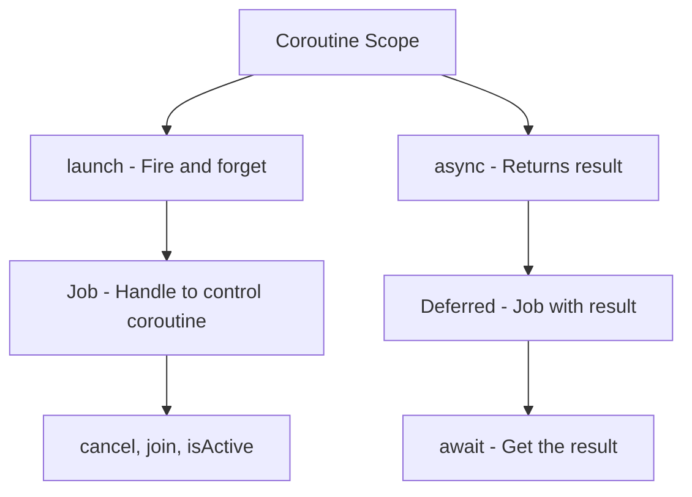
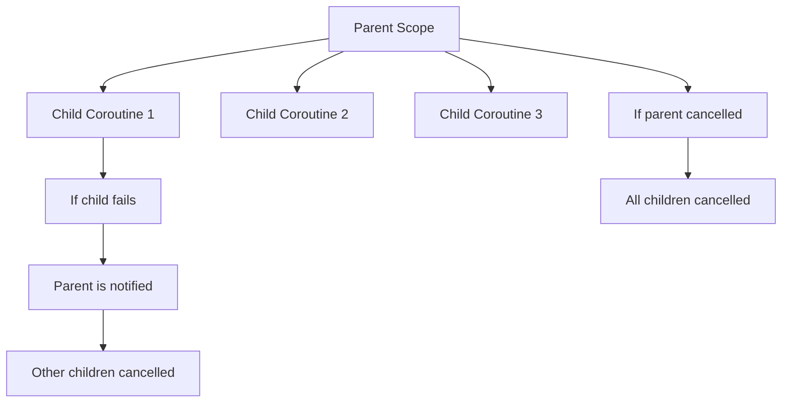

# How to Implement Coroutines in Kotlin

Author: [nawazdhandala](https://www.github.com/nawazdhandala)

Tags: Kotlin, Coroutines, Async, Concurrency, Android, JVM, Structured Concurrency

Description: Learn how to implement coroutines in Kotlin for asynchronous programming. This guide covers coroutine basics, suspend functions, dispatchers, structured concurrency, error handling, and practical patterns for real-world applications.

---

> Coroutines are Kotlin's answer to asynchronous programming. They let you write non-blocking code that reads like sequential code, without the callback hell or complex threading logic. Whether you're building Android apps or backend services, coroutines make concurrent programming simpler and safer.

Kotlin coroutines are lightweight threads that can suspend and resume execution without blocking the underlying thread. This makes them perfect for I/O operations, network calls, and any task that would otherwise block your application.

---

## Setting Up Kotlin Coroutines

Before diving into code, you need to add the coroutines dependency to your project.

### Gradle (Kotlin DSL)

```kotlin
// build.gradle.kts
dependencies {
    // Core coroutines library
    implementation("org.jetbrains.kotlinx:kotlinx-coroutines-core:1.7.3")

    // For Android projects
    implementation("org.jetbrains.kotlinx:kotlinx-coroutines-android:1.7.3")

    // For testing coroutines
    testImplementation("org.jetbrains.kotlinx:kotlinx-coroutines-test:1.7.3")
}
```

### Gradle (Groovy)

```groovy
// build.gradle
dependencies {
    implementation 'org.jetbrains.kotlinx:kotlinx-coroutines-core:1.7.3'
    implementation 'org.jetbrains.kotlinx:kotlinx-coroutines-android:1.7.3'
    testImplementation 'org.jetbrains.kotlinx:kotlinx-coroutines-test:1.7.3'
}
```

---

## Understanding Coroutine Basics

### Your First Coroutine

```kotlin
import kotlinx.coroutines.*

fun main() = runBlocking {
    // runBlocking bridges the regular world and coroutine world
    // It blocks the current thread until all coroutines complete

    launch {
        // launch starts a new coroutine
        delay(1000L) // Non-blocking delay for 1 second
        println("World!")
    }

    println("Hello,")
    // Output:
    // Hello,
    // World!
}
```

### Key Concepts



---

## Suspend Functions

Suspend functions are the building blocks of coroutines. They can pause execution without blocking the thread.

```kotlin
import kotlinx.coroutines.*

// The suspend modifier indicates this function can be paused
suspend fun fetchUserData(userId: String): User {
    // Simulating network call
    delay(1000L) // This suspends, not blocks
    return User(userId, "John Doe")
}

suspend fun fetchUserOrders(userId: String): List<Order> {
    delay(1500L)
    return listOf(Order("1", "Product A"), Order("2", "Product B"))
}

// Calling suspend functions sequentially
suspend fun getUserWithOrders(userId: String): UserWithOrders {
    // These run one after another
    val user = fetchUserData(userId)      // Takes 1 second
    val orders = fetchUserOrders(userId)  // Takes 1.5 seconds
    // Total: 2.5 seconds

    return UserWithOrders(user, orders)
}

// Running suspend functions concurrently with async
suspend fun getUserWithOrdersFast(userId: String): UserWithOrders = coroutineScope {
    // Both start immediately and run in parallel
    val userDeferred = async { fetchUserData(userId) }
    val ordersDeferred = async { fetchUserOrders(userId) }

    // Wait for both to complete
    val user = userDeferred.await()
    val orders = ordersDeferred.await()
    // Total: 1.5 seconds (the longer one)

    UserWithOrders(user, orders)
}

data class User(val id: String, val name: String)
data class Order(val id: String, val product: String)
data class UserWithOrders(val user: User, val orders: List<Order>)
```

---

## Coroutine Builders

Kotlin provides several ways to start coroutines, each suited for different use cases.

### launch - Fire and Forget

```kotlin
import kotlinx.coroutines.*

fun main() = runBlocking {
    // launch returns a Job, used for fire-and-forget operations
    val job: Job = launch {
        println("Starting background work...")
        delay(2000L)
        println("Background work completed!")
    }

    println("Main continues immediately")

    // Optionally wait for the job to complete
    job.join()

    println("All done")
}
```

### async - Returns a Result

```kotlin
import kotlinx.coroutines.*

fun main() = runBlocking {
    // async returns a Deferred which holds the future result
    val deferred: Deferred<Int> = async {
        println("Computing...")
        delay(1000L)
        42 // Return value
    }

    println("Waiting for result...")
    val result = deferred.await() // Suspends until result is ready
    println("Result: $result")
}

// Parallel computation example
suspend fun computeInParallel(): Int = coroutineScope {
    val sum1 = async { computePartialSum(1, 500_000) }
    val sum2 = async { computePartialSum(500_001, 1_000_000) }

    // Both computations run in parallel
    sum1.await() + sum2.await()
}

suspend fun computePartialSum(start: Int, end: Int): Int {
    delay(100) // Simulating computation
    return (start..end).sum()
}
```

### coroutineScope - Structured Concurrency

```kotlin
import kotlinx.coroutines.*

// coroutineScope creates a new scope and waits for all children
suspend fun processAllItems(items: List<String>) = coroutineScope {
    items.forEach { item ->
        launch {
            processItem(item)
        }
    }
    // Function returns only when all items are processed
}

suspend fun processItem(item: String) {
    delay(100)
    println("Processed: $item")
}
```

---

## Dispatchers - Controlling Thread Execution

Dispatchers determine which thread or thread pool runs your coroutine.

```kotlin
import kotlinx.coroutines.*

fun main() = runBlocking {
    // Default - CPU-intensive work (thread pool sized to CPU cores)
    launch(Dispatchers.Default) {
        println("Default: ${Thread.currentThread().name}")
        // Good for: sorting, parsing, complex calculations
    }

    // IO - Optimized for blocking I/O operations
    launch(Dispatchers.IO) {
        println("IO: ${Thread.currentThread().name}")
        // Good for: file operations, network calls, database queries
    }

    // Main - Main thread (Android UI thread)
    // Only available with kotlinx-coroutines-android
    // launch(Dispatchers.Main) {
    //     updateUI()
    // }

    // Unconfined - Starts in caller thread, resumes in whatever thread
    launch(Dispatchers.Unconfined) {
        println("Unconfined before: ${Thread.currentThread().name}")
        delay(100)
        println("Unconfined after: ${Thread.currentThread().name}")
    }
}
```

### Switching Contexts with withContext

```kotlin
import kotlinx.coroutines.*

class UserRepository {
    // Switch to IO dispatcher for database operations
    suspend fun saveUser(user: User) = withContext(Dispatchers.IO) {
        // This block runs on the IO dispatcher
        database.insert(user)
    }

    // Switch to Default for CPU-intensive parsing
    suspend fun parseUserData(json: String): User = withContext(Dispatchers.Default) {
        // Parse JSON (CPU-intensive)
        JsonParser.parse(json)
    }
}

// Android example: Fetch data and update UI
class UserViewModel : ViewModel() {
    fun loadUser(userId: String) {
        viewModelScope.launch {
            // Start on Main thread
            showLoading()

            // Switch to IO for network call
            val user = withContext(Dispatchers.IO) {
                api.fetchUser(userId)
            }

            // Back on Main thread automatically
            hideLoading()
            displayUser(user)
        }
    }
}
```

---

## Structured Concurrency

Structured concurrency ensures that coroutines don't leak and are properly cancelled when no longer needed.



### CoroutineScope in Classes

```kotlin
import kotlinx.coroutines.*

// Custom scope for a service class
class DataService : CoroutineScope {
    // Create a job to manage the lifecycle
    private val job = SupervisorJob()

    // Define the coroutine context
    override val coroutineContext = Dispatchers.Default + job

    fun fetchData() {
        launch {
            // This coroutine is tied to the service lifecycle
            val data = repository.getData()
            processData(data)
        }
    }

    // Clean up when the service is destroyed
    fun destroy() {
        job.cancel() // Cancels all coroutines in this scope
    }
}

// Android ViewModel with built-in scope
class MyViewModel : ViewModel() {
    init {
        // viewModelScope is automatically cancelled when ViewModel is cleared
        viewModelScope.launch {
            loadInitialData()
        }
    }
}
```

### SupervisorJob - Independent Child Failures

```kotlin
import kotlinx.coroutines.*

fun main() = runBlocking {
    // With regular Job: if one child fails, all siblings are cancelled
    // With SupervisorJob: children fail independently

    val supervisor = SupervisorJob()

    with(CoroutineScope(coroutineContext + supervisor)) {
        val child1 = launch {
            println("Child 1 starting")
            delay(500)
            throw RuntimeException("Child 1 failed!")
        }

        val child2 = launch {
            println("Child 2 starting")
            delay(1000)
            println("Child 2 completed") // This still runs!
        }

        // Handle the failed child
        child1.invokeOnCompletion { exception ->
            if (exception != null) {
                println("Child 1 failed: ${exception.message}")
            }
        }

        delay(2000)
    }

    supervisor.cancel()
}
```

---

## Error Handling

Proper error handling is crucial for robust coroutine-based applications.

### Try-Catch in Coroutines

```kotlin
import kotlinx.coroutines.*

suspend fun fetchDataSafely(): Result<Data> {
    return try {
        val data = apiService.fetchData()
        Result.success(data)
    } catch (e: Exception) {
        Result.failure(e)
    }
}

// Using runCatching for cleaner syntax
suspend fun fetchDataClean(): Result<Data> = runCatching {
    apiService.fetchData()
}

// Handling in the caller
fun main() = runBlocking {
    val result = fetchDataSafely()

    result.fold(
        onSuccess = { data -> println("Got data: $data") },
        onFailure = { error -> println("Error: ${error.message}") }
    )
}
```

### CoroutineExceptionHandler

```kotlin
import kotlinx.coroutines.*

fun main() = runBlocking {
    // Global exception handler for uncaught exceptions
    val handler = CoroutineExceptionHandler { _, exception ->
        println("Caught: ${exception.message}")
        // Log to monitoring service, show error UI, etc.
    }

    val scope = CoroutineScope(Dispatchers.Default + handler)

    scope.launch {
        throw RuntimeException("Something went wrong!")
    }

    delay(1000)
}

// Combining with SupervisorJob for resilient services
class ResilientService {
    private val exceptionHandler = CoroutineExceptionHandler { _, throwable ->
        logger.error("Coroutine failed", throwable)
        metrics.incrementCounter("coroutine.failures")
    }

    private val scope = CoroutineScope(
        SupervisorJob() + Dispatchers.Default + exceptionHandler
    )

    fun processRequests(requests: List<Request>) {
        requests.forEach { request ->
            scope.launch {
                // Each request is independent
                // If one fails, others continue
                processRequest(request)
            }
        }
    }
}
```

---

## Cancellation

Coroutines support cooperative cancellation - you need to check for cancellation and respond appropriately.

```kotlin
import kotlinx.coroutines.*

fun main() = runBlocking {
    val job = launch {
        repeat(1000) { i ->
            // isActive is false when cancelled
            if (!isActive) {
                println("Cancelled at iteration $i")
                return@launch
            }

            println("Processing $i...")
            delay(100) // delay checks for cancellation automatically
        }
    }

    delay(350)
    println("Cancelling...")
    job.cancelAndJoin() // Cancel and wait for completion
    println("Cancelled!")
}

// Cleaning up resources on cancellation
suspend fun processWithCleanup() = coroutineScope {
    val resource = acquireResource()

    try {
        // Do work
        while (isActive) {
            resource.processChunk()
        }
    } finally {
        // Always runs, even on cancellation
        // Use NonCancellable for suspend calls in finally
        withContext(NonCancellable) {
            resource.close()
            saveProgress()
        }
    }
}

// Timeout example
suspend fun fetchWithTimeout(): Data? {
    return withTimeoutOrNull(5000L) {
        // Returns null if times out
        api.fetchData()
    }
}
```

---

## Real-World Patterns

### Retry with Exponential Backoff

```kotlin
import kotlinx.coroutines.*
import kotlin.math.pow

suspend fun <T> retryWithBackoff(
    times: Int = 3,
    initialDelay: Long = 100,
    maxDelay: Long = 10000,
    factor: Double = 2.0,
    block: suspend () -> T
): T {
    var currentDelay = initialDelay

    repeat(times - 1) { attempt ->
        try {
            return block()
        } catch (e: Exception) {
            println("Attempt ${attempt + 1} failed: ${e.message}")
        }

        delay(currentDelay)
        currentDelay = (currentDelay * factor).toLong().coerceAtMost(maxDelay)
    }

    // Last attempt - let exception propagate
    return block()
}

// Usage
suspend fun fetchUserWithRetry(userId: String): User {
    return retryWithBackoff(times = 3, initialDelay = 500) {
        api.fetchUser(userId)
    }
}
```

### Flow for Reactive Streams

```kotlin
import kotlinx.coroutines.*
import kotlinx.coroutines.flow.*

// Creating a flow
fun numbersFlow(): Flow<Int> = flow {
    for (i in 1..5) {
        delay(100)
        emit(i) // Emit values
    }
}

// Transforming flows
fun main() = runBlocking {
    numbersFlow()
        .map { it * 2 }           // Transform each value
        .filter { it > 4 }        // Keep only values > 4
        .collect { value ->       // Collect/consume the flow
            println(value)
        }
}

// Real-world example: Observing database changes
class UserRepository(private val dao: UserDao) {
    // Returns a Flow that emits whenever data changes
    fun observeUsers(): Flow<List<User>> = dao.getAllUsersFlow()
        .map { entities -> entities.map { it.toUser() } }
        .catch { e ->
            emit(emptyList())
            logger.error("Database error", e)
        }
}

// Collecting in Android
class UserListFragment : Fragment() {
    override fun onViewCreated(view: View, savedInstanceState: Bundle?) {
        super.onViewCreated(view, savedInstanceState)

        // lifecycleScope is tied to fragment lifecycle
        viewLifecycleOwner.lifecycleScope.launch {
            // repeatOnLifecycle handles lifecycle automatically
            viewLifecycleOwner.repeatOnLifecycle(Lifecycle.State.STARTED) {
                viewModel.users.collect { users ->
                    adapter.submitList(users)
                }
            }
        }
    }
}
```

### Parallel Processing with Semaphore

```kotlin
import kotlinx.coroutines.*
import kotlinx.coroutines.sync.Semaphore
import kotlinx.coroutines.sync.withPermit

// Limit concurrent operations
class RateLimitedApiClient(
    private val maxConcurrent: Int = 10
) {
    private val semaphore = Semaphore(maxConcurrent)

    suspend fun <T> request(block: suspend () -> T): T {
        // Only maxConcurrent requests can run simultaneously
        return semaphore.withPermit {
            block()
        }
    }
}

// Usage: Process many items with limited concurrency
suspend fun processAllItems(items: List<Item>) = coroutineScope {
    val client = RateLimitedApiClient(maxConcurrent = 5)

    items.map { item ->
        async {
            client.request {
                processItem(item)
            }
        }
    }.awaitAll()
}
```

---

## Testing Coroutines

```kotlin
import kotlinx.coroutines.*
import kotlinx.coroutines.test.*
import org.junit.Test
import kotlin.test.assertEquals

class UserServiceTest {
    @Test
    fun `fetchUser returns user data`() = runTest {
        // runTest provides a TestScope with virtual time
        val service = UserService(FakeRepository())

        val user = service.fetchUser("123")

        assertEquals("John Doe", user.name)
    }

    @Test
    fun `virtual time control`() = runTest {
        var result = 0

        launch {
            delay(1000) // Uses virtual time, completes instantly
            result = 42
        }

        // Advance virtual time
        advanceTimeBy(500)
        assertEquals(0, result) // Not yet complete

        advanceTimeBy(500)
        assertEquals(42, result) // Now complete
    }

    @Test
    fun `test with real dispatcher`() = runTest {
        // Use UnconfinedTestDispatcher for immediate execution
        val testDispatcher = UnconfinedTestDispatcher(testScheduler)

        val service = UserService(
            repository = FakeRepository(),
            dispatcher = testDispatcher
        )

        val users = service.getAllUsers()
        assertEquals(3, users.size)
    }
}
```

---

## Summary

Kotlin coroutines provide a powerful yet approachable way to handle asynchronous programming. Here are the key takeaways:

| Concept | Purpose |
|---------|---------|
| suspend | Marks functions that can pause execution |
| launch | Fire-and-forget coroutine builder |
| async/await | Returns a result from coroutine |
| Dispatchers | Control which thread runs the code |
| withContext | Switch dispatcher within a coroutine |
| coroutineScope | Structured concurrency container |
| SupervisorJob | Independent child failure handling |
| Flow | Cold asynchronous data streams |

Remember these best practices:
- Always use structured concurrency to avoid coroutine leaks
- Choose the right dispatcher for your workload
- Handle errors appropriately at each level
- Use Flow for reactive data streams
- Test with runTest and virtual time

---

*Building applications with Kotlin coroutines? [OneUptime](https://oneuptime.com) helps you monitor your async applications with distributed tracing and performance metrics.*

**Related Reading:**
- [How to Use async Python Without Blocking](https://oneuptime.com/blog/post/2025-01-06-python-asyncio-io-bound/view)
- [How to Profile Kotlin Applications](https://oneuptime.com/blog/post/2026-01-07-kotlin-profiling/view)
