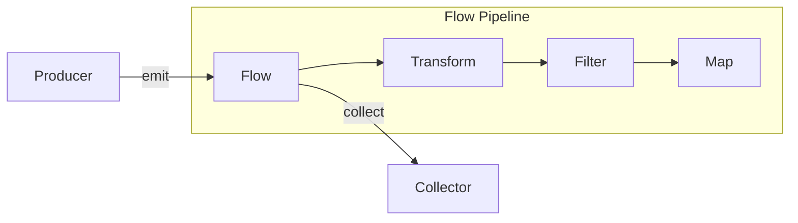
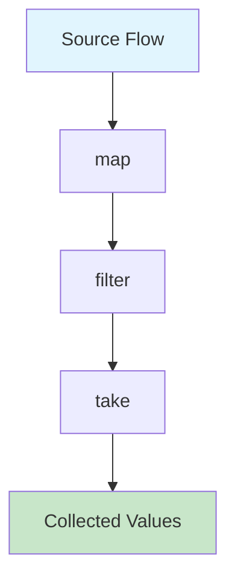
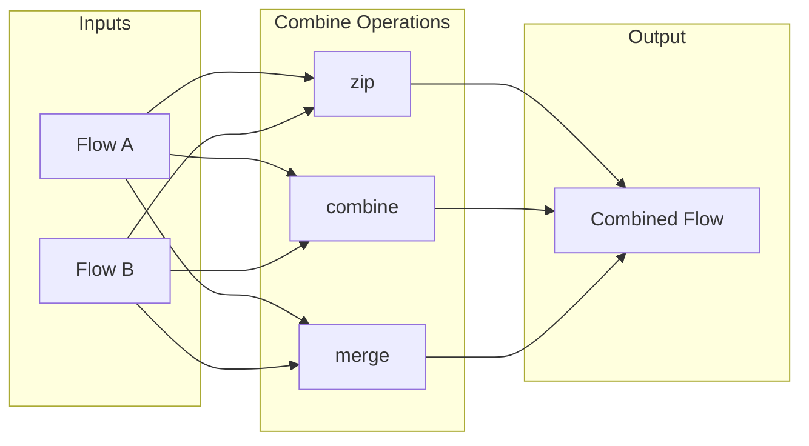
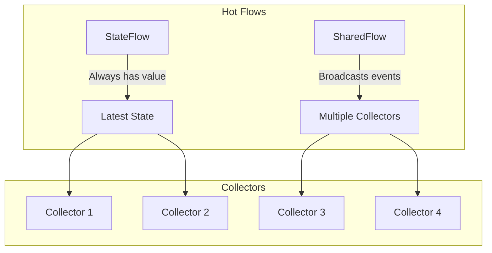
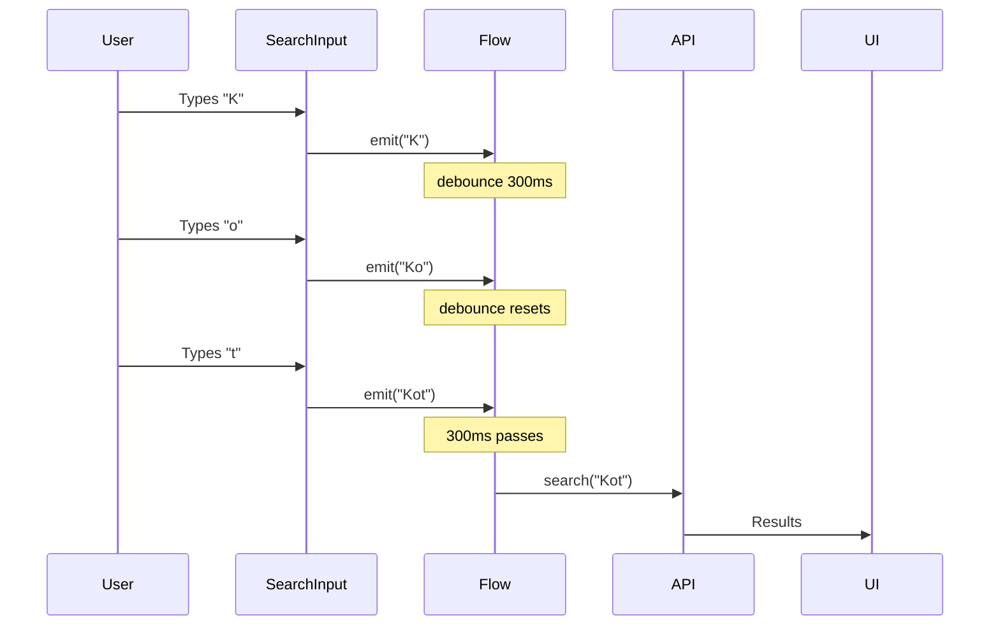

# How to Use Kotlin Flow for Reactive Programming

Author: [nawazdhandala](https://www.github.com/nawazdhandala)

Tags: Kotlin, Flow, Reactive Programming, Coroutines, Android

Description: Learn how to use Kotlin Flow for reactive programming with cold streams, operators, state management, and integration with coroutines.

---

Kotlin Flow is a powerful reactive streams API built on top of coroutines. It provides a simple and efficient way to handle asynchronous data streams in Kotlin applications. Whether you are building Android apps or backend services, Flow offers a clean approach to reactive programming without the complexity of RxJava.

## What is Kotlin Flow?

Flow is a cold asynchronous data stream that sequentially emits values and completes normally or with an exception. Unlike hot streams (like Channels), a Flow does not produce values until a collector starts collecting.



## Setting Up Your Project

First, add the coroutines dependencies to your project:

```kotlin
// build.gradle.kts
dependencies {
    // Core coroutines library
    implementation("org.jetbrains.kotlinx:kotlinx-coroutines-core:1.7.3")

    // For Android projects
    implementation("org.jetbrains.kotlinx:kotlinx-coroutines-android:1.7.3")
}
```

## Creating Your First Flow

There are several ways to create a Flow in Kotlin:

### Using the flow Builder

```kotlin
import kotlinx.coroutines.flow.Flow
import kotlinx.coroutines.flow.flow
import kotlinx.coroutines.delay

// Create a simple flow that emits numbers
fun numberFlow(): Flow<Int> = flow {
    // The flow builder runs in a coroutine context
    for (i in 1..5) {
        // Simulate some async work
        delay(100)

        // Emit a value to the collector
        emit(i)
    }
}

// Usage
suspend fun main() {
    // Collect values from the flow
    numberFlow().collect { value ->
        println("Received: $value")
    }
}
```

### Using flowOf for Simple Values

```kotlin
import kotlinx.coroutines.flow.flowOf

// Create a flow from fixed values
val simpleFlow = flowOf(1, 2, 3, 4, 5)

// Create a flow from a list
val listFlow = listOf("a", "b", "c").asFlow()
```

### Converting Callbacks to Flow

```kotlin
import kotlinx.coroutines.channels.awaitClose
import kotlinx.coroutines.flow.callbackFlow

// Convert a callback-based API to a Flow
fun locationUpdates(): Flow<Location> = callbackFlow {
    // Create a listener for the callback API
    val listener = object : LocationListener {
        override fun onLocationChanged(location: Location) {
            // Send the location to the flow
            trySend(location)
        }

        override fun onError(error: Exception) {
            // Close the flow with an error
            close(error)
        }
    }

    // Register the listener
    locationManager.registerListener(listener)

    // Clean up when the flow is cancelled
    awaitClose {
        locationManager.unregisterListener(listener)
    }
}
```

## Flow Operators

Flow provides a rich set of operators for transforming and combining streams.



### Transformation Operators

```kotlin
import kotlinx.coroutines.flow.*

suspend fun transformationExample() {
    val numbers = flowOf(1, 2, 3, 4, 5)

    // map: Transform each value
    numbers.map { it * 2 }
        .collect { println("Doubled: $it") }
    // Output: 2, 4, 6, 8, 10

    // filter: Keep only values matching a predicate
    numbers.filter { it % 2 == 0 }
        .collect { println("Even: $it") }
    // Output: 2, 4

    // transform: Emit multiple values for each input
    numbers.transform { value ->
        emit("Processing $value")
        emit(value * 10)
    }.collect { println(it) }

    // flatMapConcat: Flatten nested flows sequentially
    numbers.flatMapConcat { value ->
        flow {
            emit(value)
            emit(value * 100)
        }
    }.collect { println("Flat: $it") }
}
```

### Limiting Operators

```kotlin
suspend fun limitingExample() {
    val numbers = flowOf(1, 2, 3, 4, 5, 6, 7, 8, 9, 10)

    // take: Collect only the first n values
    numbers.take(3)
        .collect { println("First three: $it") }
    // Output: 1, 2, 3

    // takeWhile: Collect while predicate is true
    numbers.takeWhile { it < 5 }
        .collect { println("While < 5: $it") }
    // Output: 1, 2, 3, 4

    // drop: Skip the first n values
    numbers.drop(5)
        .collect { println("After dropping 5: $it") }
    // Output: 6, 7, 8, 9, 10
}
```

### Terminal Operators

```kotlin
suspend fun terminalOperatorExample() {
    val numbers = flowOf(1, 2, 3, 4, 5)

    // collect: The most common terminal operator
    numbers.collect { value ->
        println(value)
    }

    // toList: Collect all values into a list
    val list: List<Int> = numbers.toList()

    // first: Get the first value
    val firstValue: Int = numbers.first()

    // single: Get the only value (throws if more than one)
    val singleValue: Int = flowOf(42).single()

    // reduce: Accumulate values
    val sum: Int = numbers.reduce { acc, value -> acc + value }
    println("Sum: $sum") // Output: 15

    // fold: Accumulate with initial value
    val product: Int = numbers.fold(1) { acc, value -> acc * value }
    println("Product: $product") // Output: 120
}
```

## Combining Multiple Flows



### Combining Flows

```kotlin
import kotlinx.coroutines.flow.*

suspend fun combineFlowsExample() {
    val numbers = flowOf(1, 2, 3)
    val letters = flowOf("A", "B", "C")

    // zip: Combine corresponding elements
    numbers.zip(letters) { number, letter ->
        "$letter$number"
    }.collect { println("Zipped: $it") }
    // Output: A1, B2, C3

    // combine: Emit when either flow emits
    val flow1 = flow {
        emit(1)
        delay(100)
        emit(2)
    }
    val flow2 = flow {
        emit("A")
        delay(150)
        emit("B")
    }

    flow1.combine(flow2) { num, letter ->
        "$letter$num"
    }.collect { println("Combined: $it") }
    // Emits whenever either flow produces a new value
}

// Merge multiple flows into one
suspend fun mergeFlowsExample() {
    val flow1 = flowOf(1, 2, 3).onEach { delay(100) }
    val flow2 = flowOf(10, 20, 30).onEach { delay(150) }

    // merge: Combine flows concurrently
    merge(flow1, flow2)
        .collect { println("Merged: $it") }
}
```

## Error Handling

Flow provides several ways to handle errors gracefully.

```kotlin
import kotlinx.coroutines.flow.*

fun riskyFlow(): Flow<Int> = flow {
    emit(1)
    emit(2)
    throw RuntimeException("Something went wrong!")
    emit(3) // Never reached
}

suspend fun errorHandlingExample() {
    // catch: Handle upstream errors
    riskyFlow()
        .catch { exception ->
            println("Caught: ${exception.message}")
            // Optionally emit a fallback value
            emit(-1)
        }
        .collect { println("Value: $it") }
    // Output: Value: 1, Value: 2, Caught: Something went wrong!, Value: -1

    // onCompletion: Execute code when flow completes
    flowOf(1, 2, 3)
        .onCompletion { cause ->
            if (cause == null) {
                println("Flow completed successfully")
            } else {
                println("Flow failed with: ${cause.message}")
            }
        }
        .collect { println(it) }

    // retry: Retry on failure
    var attempts = 0
    flow {
        attempts++
        if (attempts < 3) {
            throw RuntimeException("Attempt $attempts failed")
        }
        emit("Success on attempt $attempts")
    }
    .retry(3) { cause ->
        // Return true to retry, false to propagate the exception
        cause is RuntimeException
    }
    .collect { println(it) }
}
```

## StateFlow and SharedFlow

For state management and event broadcasting, Kotlin provides StateFlow and SharedFlow.



### StateFlow for State Management

```kotlin
import kotlinx.coroutines.flow.*

class CounterViewModel {
    // MutableStateFlow holds mutable state
    private val _count = MutableStateFlow(0)

    // Expose as immutable StateFlow
    val count: StateFlow<Int> = _count.asStateFlow()

    fun increment() {
        // Update the state
        _count.value++
    }

    fun decrement() {
        _count.value--
    }

    // Update using update function for thread safety
    fun reset() {
        _count.update { 0 }
    }
}

// Usage in a coroutine
suspend fun observeCounter(viewModel: CounterViewModel) {
    // StateFlow always has a current value
    println("Current count: ${viewModel.count.value}")

    // Collect state changes
    viewModel.count.collect { count ->
        println("Count changed to: $count")
    }
}
```

### SharedFlow for Events

```kotlin
import kotlinx.coroutines.flow.*

class EventBus {
    // SharedFlow for one-time events
    private val _events = MutableSharedFlow<Event>(
        replay = 0,           // No replay for new collectors
        extraBufferCapacity = 64,  // Buffer for emissions
        onBufferOverflow = BufferOverflow.DROP_OLDEST
    )

    val events: SharedFlow<Event> = _events.asSharedFlow()

    // Emit an event
    suspend fun emit(event: Event) {
        _events.emit(event)
    }

    // Try to emit without suspending
    fun tryEmit(event: Event): Boolean {
        return _events.tryEmit(event)
    }
}

sealed class Event {
    data class ShowMessage(val text: String) : Event()
    data class NavigateTo(val screen: String) : Event()
    object Loading : Event()
}

// Usage
suspend fun handleEvents(eventBus: EventBus) {
    eventBus.events.collect { event ->
        when (event) {
            is Event.ShowMessage -> println("Message: ${event.text}")
            is Event.NavigateTo -> println("Navigate to: ${event.screen}")
            Event.Loading -> println("Loading...")
        }
    }
}
```

## Flow Context and Dispatchers

Understanding flow context is crucial for correct behavior.

```kotlin
import kotlinx.coroutines.*
import kotlinx.coroutines.flow.*

suspend fun flowContextExample() {
    // flowOn changes the upstream dispatcher
    flow {
        // This runs on Dispatchers.IO
        println("Emitting on: ${Thread.currentThread().name}")
        emit(fetchDataFromNetwork())
    }
    .flowOn(Dispatchers.IO)  // Change context for upstream operations
    .map { data ->
        // This also runs on Dispatchers.IO
        processData(data)
    }
    .flowOn(Dispatchers.Default)  // Can chain flowOn
    .collect { result ->
        // Collection runs on the collector's context
        println("Collecting on: ${Thread.currentThread().name}")
        updateUI(result)
    }
}

// Buffering for performance
suspend fun bufferingExample() {
    flow {
        for (i in 1..5) {
            delay(100)  // Simulate slow emission
            emit(i)
        }
    }
    .buffer()  // Buffer emissions, collector runs concurrently
    .collect { value ->
        delay(300)  // Simulate slow collection
        println("Collected $value")
    }

    // conflate: Keep only the latest value when collector is slow
    flow {
        for (i in 1..5) {
            delay(100)
            emit(i)
        }
    }
    .conflate()  // Drop intermediate values
    .collect { value ->
        delay(300)
        println("Conflated: $value")
    }
    // Output: 1, 3, 5 (some values skipped)
}
```

## Real-World Example: Search with Debounce

Here is a practical example implementing a search feature with debouncing:



```kotlin
import kotlinx.coroutines.*
import kotlinx.coroutines.flow.*

class SearchViewModel(
    private val searchRepository: SearchRepository
) {
    // Input from the search field
    private val _searchQuery = MutableStateFlow("")

    // Search results as a flow
    val searchResults: Flow<List<SearchResult>> = _searchQuery
        .debounce(300)  // Wait for user to stop typing
        .distinctUntilChanged()  // Ignore duplicate queries
        .filter { it.length >= 2 }  // Minimum query length
        .flatMapLatest { query ->
            // Cancel previous search when new query arrives
            flow {
                emit(SearchState.Loading)
                try {
                    val results = searchRepository.search(query)
                    emit(SearchState.Success(results))
                } catch (e: Exception) {
                    emit(SearchState.Error(e.message ?: "Unknown error"))
                }
            }
        }
        .catch { e ->
            emit(SearchState.Error(e.message ?: "Unknown error"))
        }

    fun onSearchQueryChanged(query: String) {
        _searchQuery.value = query
    }
}

sealed class SearchState {
    object Loading : SearchState()
    data class Success(val results: List<SearchResult>) : SearchState()
    data class Error(val message: String) : SearchState()
}
```

## Android Integration with Lifecycle

When using Flow in Android, properly handle lifecycle to avoid memory leaks:

```kotlin
import androidx.lifecycle.*
import kotlinx.coroutines.flow.*
import kotlinx.coroutines.launch

class MainActivity : AppCompatActivity() {
    private val viewModel: MyViewModel by viewModels()

    override fun onCreate(savedInstanceState: Bundle?) {
        super.onCreate(savedInstanceState)

        // Collect flow with lifecycle awareness
        lifecycleScope.launch {
            // repeatOnLifecycle ensures collection stops when
            // the lifecycle falls below the specified state
            repeatOnLifecycle(Lifecycle.State.STARTED) {
                viewModel.uiState.collect { state ->
                    updateUI(state)
                }
            }
        }

        // Alternative: Use flowWithLifecycle extension
        lifecycleScope.launch {
            viewModel.events
                .flowWithLifecycle(lifecycle, Lifecycle.State.STARTED)
                .collect { event ->
                    handleEvent(event)
                }
        }
    }
}

// In Compose, use collectAsStateWithLifecycle
@Composable
fun MyScreen(viewModel: MyViewModel) {
    val uiState by viewModel.uiState.collectAsStateWithLifecycle()

    when (uiState) {
        is UiState.Loading -> LoadingIndicator()
        is UiState.Success -> ContentView(uiState.data)
        is UiState.Error -> ErrorView(uiState.message)
    }
}
```

## Testing Flows

Kotlin provides utilities for testing flows effectively:

```kotlin
import kotlinx.coroutines.test.*
import kotlinx.coroutines.flow.*
import org.junit.Test
import kotlin.test.assertEquals

class FlowTest {

    @Test
    fun `test flow emissions`() = runTest {
        // Create a flow to test
        val flow = flowOf(1, 2, 3)

        // Collect into a list
        val result = flow.toList()

        assertEquals(listOf(1, 2, 3), result)
    }

    @Test
    fun `test StateFlow`() = runTest {
        val viewModel = CounterViewModel()

        // Use Turbine library for easier testing
        viewModel.count.test {
            // Initial value
            assertEquals(0, awaitItem())

            // Increment
            viewModel.increment()
            assertEquals(1, awaitItem())

            // Decrement
            viewModel.decrement()
            assertEquals(0, awaitItem())

            cancelAndIgnoreRemainingEvents()
        }
    }

    @Test
    fun `test flow transformations`() = runTest {
        val numbers = flowOf(1, 2, 3, 4, 5)

        val result = numbers
            .filter { it % 2 == 0 }
            .map { it * 10 }
            .toList()

        assertEquals(listOf(20, 40), result)
    }
}
```

## Best Practices

1. **Choose the right flow type**: Use regular Flow for one-shot operations, StateFlow for state, and SharedFlow for events.

2. **Handle errors appropriately**: Always use `catch` to handle errors in production code.

3. **Use appropriate dispatchers**: Run IO operations on `Dispatchers.IO` and CPU-intensive work on `Dispatchers.Default`.

4. **Avoid blocking operations**: Never use blocking calls inside flow builders. Use suspend functions instead.

5. **Cancel when not needed**: Use lifecycle-aware collection on Android to prevent memory leaks.

6. **Test your flows**: Use `runTest` and libraries like Turbine for comprehensive testing.

## Conclusion

Kotlin Flow provides a powerful and intuitive API for reactive programming. Its integration with coroutines makes it a natural choice for Kotlin developers who want to handle asynchronous data streams. By understanding the different flow types, operators, and best practices covered in this guide, you can build robust and efficient reactive applications.

Start with simple flows and gradually incorporate more advanced patterns as your needs grow. The key is to think in terms of data streams and transformations rather than imperative callbacks.
