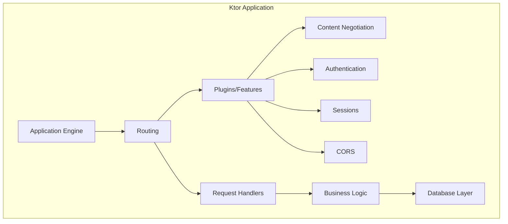

# How to Use Ktor for Kotlin Web Applications

Author: [nawazdhandala](https://github.com/nawazdhandala)

Tags: Kotlin, Ktor, Web Development, Backend, REST API, Coroutines, JVM

Description: A practical guide to building web applications with Ktor, the asynchronous Kotlin framework from JetBrains. Learn routing, authentication, database integration, and deployment best practices.

---

Ktor is a lightweight, asynchronous web framework built by JetBrains specifically for Kotlin. Unlike Spring Boot or other JVM frameworks, Ktor embraces Kotlin's coroutines from the ground up, making it a natural choice for developers who want to build modern, non-blocking web applications without the overhead of annotation processing or reflection-heavy frameworks.

This guide walks through building production-ready web applications with Ktor, from project setup to deployment.

## Why Ktor?

Before diving into code, here's why Ktor stands out:

- **Native Kotlin** - Built from scratch for Kotlin, not adapted from Java
- **Coroutines first** - Async by default without callback hell
- **Lightweight** - Only include what you need via plugins
- **Flexible** - Works as a server or client library
- **Testable** - First-class testing support built in



## Project Setup

### Gradle Configuration

Start with a `build.gradle.kts` file. Ktor uses a plugin system where you only add what you need.

```kotlin
plugins {
    kotlin("jvm") version "1.9.22"
    kotlin("plugin.serialization") version "1.9.22"
    id("io.ktor.plugin") version "2.3.7"
}

group = "com.example"
version = "1.0.0"

application {
    // Entry point for the application
    mainClass.set("com.example.ApplicationKt")
}

repositories {
    mavenCentral()
}

dependencies {
    // Ktor server core
    implementation("io.ktor:ktor-server-core-jvm:2.3.7")

    // Netty engine - production-ready, high performance
    implementation("io.ktor:ktor-server-netty-jvm:2.3.7")

    // Content negotiation for JSON
    implementation("io.ktor:ktor-server-content-negotiation-jvm:2.3.7")
    implementation("io.ktor:ktor-serialization-kotlinx-json-jvm:2.3.7")

    // Authentication
    implementation("io.ktor:ktor-server-auth-jvm:2.3.7")
    implementation("io.ktor:ktor-server-auth-jwt-jvm:2.3.7")

    // Request validation
    implementation("io.ktor:ktor-server-request-validation-jvm:2.3.7")

    // Status pages for error handling
    implementation("io.ktor:ktor-server-status-pages-jvm:2.3.7")

    // Logging
    implementation("ch.qos.logback:logback-classic:1.4.14")

    // Testing
    testImplementation("io.ktor:ktor-server-tests-jvm:2.3.7")
    testImplementation("org.jetbrains.kotlin:kotlin-test-junit:1.9.22")
}
```

### Application Entry Point

Create your main application file. Ktor applications start with an `Application` module that configures plugins and routing.

```kotlin
// src/main/kotlin/com/example/Application.kt
package com.example

import io.ktor.server.application.*
import io.ktor.server.engine.*
import io.ktor.server.netty.*

fun main() {
    // Start the server with Netty engine
    embeddedServer(
        Netty,
        port = System.getenv("PORT")?.toIntOrNull() ?: 8080,
        host = "0.0.0.0",
        module = Application::module
    ).start(wait = true)
}

fun Application.module() {
    // Configure plugins
    configureSerialization()
    configureAuthentication()
    configureRouting()
}
```

## Configuring Plugins

### JSON Serialization

Ktor uses content negotiation to handle request and response serialization.

```kotlin
// src/main/kotlin/com/example/plugins/Serialization.kt
package com.example.plugins

import io.ktor.serialization.kotlinx.json.*
import io.ktor.server.application.*
import io.ktor.server.plugins.contentnegotiation.*
import kotlinx.serialization.json.Json

fun Application.configureSerialization() {
    install(ContentNegotiation) {
        json(Json {
            // Pretty print JSON in responses
            prettyPrint = true

            // Don't fail on unknown keys in requests
            ignoreUnknownKeys = true

            // Include default values in serialization
            encodeDefaults = true
        })
    }
}
```

### Status Pages for Error Handling

Handle exceptions globally and return consistent error responses.

```kotlin
// src/main/kotlin/com/example/plugins/StatusPages.kt
package com.example.plugins

import io.ktor.http.*
import io.ktor.server.application.*
import io.ktor.server.plugins.statuspages.*
import io.ktor.server.response.*
import kotlinx.serialization.Serializable

@Serializable
data class ErrorResponse(
    val status: Int,
    val message: String,
    val details: String? = null
)

// Custom exception for validation errors
class ValidationException(message: String) : Exception(message)

// Custom exception for not found resources
class NotFoundException(message: String) : Exception(message)

fun Application.configureStatusPages() {
    install(StatusPages) {
        // Handle validation errors - return 400
        exception<ValidationException> { call, cause ->
            call.respond(
                HttpStatusCode.BadRequest,
                ErrorResponse(
                    status = 400,
                    message = "Validation failed",
                    details = cause.message
                )
            )
        }

        // Handle not found - return 404
        exception<NotFoundException> { call, cause ->
            call.respond(
                HttpStatusCode.NotFound,
                ErrorResponse(
                    status = 404,
                    message = "Resource not found",
                    details = cause.message
                )
            )
        }

        // Handle all other exceptions - return 500
        exception<Throwable> { call, cause ->
            call.application.environment.log.error("Unhandled exception", cause)
            call.respond(
                HttpStatusCode.InternalServerError,
                ErrorResponse(
                    status = 500,
                    message = "Internal server error"
                )
            )
        }
    }
}
```

## Routing

### Basic Routes

Ktor's routing DSL is clean and expressive.

```kotlin
// src/main/kotlin/com/example/plugins/Routing.kt
package com.example.plugins

import io.ktor.http.*
import io.ktor.server.application.*
import io.ktor.server.request.*
import io.ktor.server.response.*
import io.ktor.server.routing.*
import kotlinx.serialization.Serializable

@Serializable
data class User(
    val id: Long,
    val name: String,
    val email: String
)

@Serializable
data class CreateUserRequest(
    val name: String,
    val email: String
)

fun Application.configureRouting() {
    routing {
        // Health check endpoint
        get("/health") {
            call.respond(mapOf("status" to "healthy"))
        }

        // Group user-related routes
        route("/api/users") {
            // GET /api/users - list all users
            get {
                val users = listOf(
                    User(1, "Alice", "alice@example.com"),
                    User(2, "Bob", "bob@example.com")
                )
                call.respond(users)
            }

            // GET /api/users/{id} - get user by ID
            get("/{id}") {
                // Extract path parameter
                val id = call.parameters["id"]?.toLongOrNull()
                    ?: throw ValidationException("Invalid user ID")

                // Simulate database lookup
                val user = findUserById(id)
                    ?: throw NotFoundException("User with ID $id not found")

                call.respond(user)
            }

            // POST /api/users - create new user
            post {
                // Deserialize request body
                val request = call.receive<CreateUserRequest>()

                // Validate input
                if (request.name.isBlank()) {
                    throw ValidationException("Name cannot be empty")
                }
                if (!request.email.contains("@")) {
                    throw ValidationException("Invalid email format")
                }

                // Create user (simulated)
                val newUser = User(
                    id = System.currentTimeMillis(),
                    name = request.name,
                    email = request.email
                )

                call.respond(HttpStatusCode.Created, newUser)
            }

            // DELETE /api/users/{id} - delete user
            delete("/{id}") {
                val id = call.parameters["id"]?.toLongOrNull()
                    ?: throw ValidationException("Invalid user ID")

                // Delete user (simulated)
                call.respond(HttpStatusCode.NoContent)
            }
        }
    }
}

// Simulated database function
private fun findUserById(id: Long): User? {
    return if (id == 1L) User(1, "Alice", "alice@example.com") else null
}
```

### Route Organization

For larger applications, organize routes into separate files.

```kotlin
// src/main/kotlin/com/example/routes/UserRoutes.kt
package com.example.routes

import io.ktor.server.routing.*

fun Route.userRoutes(userService: UserService) {
    route("/api/users") {
        get { /* ... */ }
        post { /* ... */ }
        get("/{id}") { /* ... */ }
        put("/{id}") { /* ... */ }
        delete("/{id}") { /* ... */ }
    }
}

// src/main/kotlin/com/example/routes/ProductRoutes.kt
fun Route.productRoutes(productService: ProductService) {
    route("/api/products") {
        get { /* ... */ }
        post { /* ... */ }
    }
}

// Then in your main routing configuration:
fun Application.configureRouting() {
    val userService = UserService()
    val productService = ProductService()

    routing {
        userRoutes(userService)
        productRoutes(productService)
    }
}
```

## Authentication with JWT

### Setting Up JWT Authentication

```kotlin
// src/main/kotlin/com/example/plugins/Authentication.kt
package com.example.plugins

import com.auth0.jwt.JWT
import com.auth0.jwt.algorithms.Algorithm
import io.ktor.http.*
import io.ktor.server.application.*
import io.ktor.server.auth.*
import io.ktor.server.auth.jwt.*
import io.ktor.server.response.*
import java.util.*

// Configuration loaded from environment
object JwtConfig {
    val secret: String = System.getenv("JWT_SECRET") ?: "development-secret"
    val issuer: String = System.getenv("JWT_ISSUER") ?: "ktor-app"
    val audience: String = System.getenv("JWT_AUDIENCE") ?: "ktor-users"
    val realm: String = "ktor-app"

    // Token valid for 24 hours
    private val validityMs = 24 * 60 * 60 * 1000L

    // Generate a token for a user
    fun generateToken(userId: Long, email: String): String {
        return JWT.create()
            .withIssuer(issuer)
            .withAudience(audience)
            .withClaim("userId", userId)
            .withClaim("email", email)
            .withExpiresAt(Date(System.currentTimeMillis() + validityMs))
            .sign(Algorithm.HMAC256(secret))
    }
}

fun Application.configureAuthentication() {
    install(Authentication) {
        jwt("auth-jwt") {
            realm = JwtConfig.realm

            // Configure JWT verifier
            verifier(
                JWT.require(Algorithm.HMAC256(JwtConfig.secret))
                    .withIssuer(JwtConfig.issuer)
                    .withAudience(JwtConfig.audience)
                    .build()
            )

            // Validate the token and extract user info
            validate { credential ->
                val userId = credential.payload.getClaim("userId").asLong()
                val email = credential.payload.getClaim("email").asString()

                if (userId != null && email != null) {
                    JWTPrincipal(credential.payload)
                } else {
                    null
                }
            }

            // Custom response for authentication failures
            challenge { _, _ ->
                call.respond(
                    HttpStatusCode.Unauthorized,
                    ErrorResponse(401, "Invalid or expired token")
                )
            }
        }
    }
}
```

### Protected Routes

```kotlin
// src/main/kotlin/com/example/routes/ProtectedRoutes.kt
package com.example.routes

import io.ktor.server.application.*
import io.ktor.server.auth.*
import io.ktor.server.auth.jwt.*
import io.ktor.server.response.*
import io.ktor.server.routing.*
import kotlinx.serialization.Serializable

@Serializable
data class UserProfile(
    val userId: Long,
    val email: String
)

fun Route.protectedRoutes() {
    // All routes in this block require authentication
    authenticate("auth-jwt") {
        route("/api/me") {
            // GET /api/me - get current user profile
            get {
                // Extract user info from JWT
                val principal = call.principal<JWTPrincipal>()
                val userId = principal?.payload?.getClaim("userId")?.asLong()
                val email = principal?.payload?.getClaim("email")?.asString()

                if (userId != null && email != null) {
                    call.respond(UserProfile(userId, email))
                } else {
                    call.respond(
                        HttpStatusCode.Unauthorized,
                        ErrorResponse(401, "Invalid token claims")
                    )
                }
            }
        }

        // Other protected routes...
        route("/api/orders") {
            get { /* ... */ }
            post { /* ... */ }
        }
    }
}
```

### Login Endpoint

```kotlin
// src/main/kotlin/com/example/routes/AuthRoutes.kt
package com.example.routes

import com.example.plugins.JwtConfig
import com.example.plugins.ValidationException
import io.ktor.http.*
import io.ktor.server.application.*
import io.ktor.server.request.*
import io.ktor.server.response.*
import io.ktor.server.routing.*
import kotlinx.serialization.Serializable

@Serializable
data class LoginRequest(
    val email: String,
    val password: String
)

@Serializable
data class LoginResponse(
    val token: String,
    val expiresIn: Long = 86400 // 24 hours in seconds
)

fun Route.authRoutes() {
    route("/api/auth") {
        post("/login") {
            val request = call.receive<LoginRequest>()

            // Validate credentials (replace with real authentication)
            val user = authenticateUser(request.email, request.password)
                ?: throw ValidationException("Invalid email or password")

            // Generate JWT token
            val token = JwtConfig.generateToken(user.id, user.email)

            call.respond(LoginResponse(token))
        }

        post("/register") {
            // Registration logic...
        }
    }
}

// Simulated authentication - replace with database lookup
private fun authenticateUser(email: String, password: String): User? {
    // In production, verify password hash against stored hash
    return if (email == "alice@example.com" && password == "password123") {
        User(1, "Alice", email)
    } else {
        null
    }
}
```

## Database Integration with Exposed

Exposed is JetBrains' SQL library for Kotlin, which pairs well with Ktor.

```kotlin
// Add to build.gradle.kts
dependencies {
    implementation("org.jetbrains.exposed:exposed-core:0.46.0")
    implementation("org.jetbrains.exposed:exposed-dao:0.46.0")
    implementation("org.jetbrains.exposed:exposed-jdbc:0.46.0")
    implementation("com.zaxxer:HikariCP:5.1.0")
    implementation("org.postgresql:postgresql:42.7.1")
}
```

```kotlin
// src/main/kotlin/com/example/database/Database.kt
package com.example.database

import com.zaxxer.hikari.HikariConfig
import com.zaxxer.hikari.HikariDataSource
import org.jetbrains.exposed.sql.*
import org.jetbrains.exposed.sql.transactions.transaction

// Define table schema
object Users : Table("users") {
    val id = long("id").autoIncrement()
    val name = varchar("name", 255)
    val email = varchar("email", 255).uniqueIndex()
    val passwordHash = varchar("password_hash", 255)
    val createdAt = long("created_at").default(System.currentTimeMillis())

    override val primaryKey = PrimaryKey(id)
}

object DatabaseFactory {
    fun init() {
        // Configure connection pool
        val config = HikariConfig().apply {
            jdbcUrl = System.getenv("DATABASE_URL")
                ?: "jdbc:postgresql://localhost:5432/myapp"
            driverClassName = "org.postgresql.Driver"
            username = System.getenv("DATABASE_USER") ?: "postgres"
            password = System.getenv("DATABASE_PASSWORD") ?: "postgres"
            maximumPoolSize = 10
            isAutoCommit = false
            transactionIsolation = "TRANSACTION_REPEATABLE_READ"
        }

        val dataSource = HikariDataSource(config)
        Database.connect(dataSource)

        // Create tables if they don't exist
        transaction {
            SchemaUtils.create(Users)
        }
    }
}
```

### Repository Pattern

```kotlin
// src/main/kotlin/com/example/repository/UserRepository.kt
package com.example.repository

import com.example.database.Users
import com.example.models.User
import org.jetbrains.exposed.sql.*
import org.jetbrains.exposed.sql.SqlExpressionBuilder.eq
import org.jetbrains.exposed.sql.transactions.experimental.newSuspendedTransaction

class UserRepository {
    // Wrap database operations in suspended transactions for coroutine support
    private suspend fun <T> dbQuery(block: suspend () -> T): T =
        newSuspendedTransaction { block() }

    suspend fun findAll(): List<User> = dbQuery {
        Users.selectAll().map { rowToUser(it) }
    }

    suspend fun findById(id: Long): User? = dbQuery {
        Users.select { Users.id eq id }
            .map { rowToUser(it) }
            .singleOrNull()
    }

    suspend fun findByEmail(email: String): User? = dbQuery {
        Users.select { Users.email eq email }
            .map { rowToUser(it) }
            .singleOrNull()
    }

    suspend fun create(name: String, email: String, passwordHash: String): User = dbQuery {
        val id = Users.insert {
            it[Users.name] = name
            it[Users.email] = email
            it[Users.passwordHash] = passwordHash
        } get Users.id

        User(id, name, email)
    }

    suspend fun update(id: Long, name: String, email: String): Boolean = dbQuery {
        Users.update({ Users.id eq id }) {
            it[Users.name] = name
            it[Users.email] = email
        } > 0
    }

    suspend fun delete(id: Long): Boolean = dbQuery {
        Users.deleteWhere { Users.id eq id } > 0
    }

    private fun rowToUser(row: ResultRow): User = User(
        id = row[Users.id],
        name = row[Users.name],
        email = row[Users.email]
    )
}
```

## Testing

Ktor provides excellent testing utilities.

```kotlin
// src/test/kotlin/com/example/ApplicationTest.kt
package com.example

import io.ktor.client.request.*
import io.ktor.client.statement.*
import io.ktor.http.*
import io.ktor.server.testing.*
import kotlinx.serialization.json.Json
import kotlin.test.*

class ApplicationTest {
    @Test
    fun `health check returns healthy status`() = testApplication {
        application {
            module()
        }

        val response = client.get("/health")

        assertEquals(HttpStatusCode.OK, response.status)
        assertTrue(response.bodyAsText().contains("healthy"))
    }

    @Test
    fun `get users returns list`() = testApplication {
        application {
            module()
        }

        val response = client.get("/api/users")

        assertEquals(HttpStatusCode.OK, response.status)
        assertEquals(ContentType.Application.Json.withCharset(Charsets.UTF_8),
            response.contentType())
    }

    @Test
    fun `create user with invalid email returns 400`() = testApplication {
        application {
            module()
        }

        val response = client.post("/api/users") {
            contentType(ContentType.Application.Json)
            setBody("""{"name": "Test", "email": "invalid-email"}""")
        }

        assertEquals(HttpStatusCode.BadRequest, response.status)
    }

    @Test
    fun `protected route without token returns 401`() = testApplication {
        application {
            module()
        }

        val response = client.get("/api/me")

        assertEquals(HttpStatusCode.Unauthorized, response.status)
    }

    @Test
    fun `protected route with valid token returns user`() = testApplication {
        application {
            module()
        }

        // Generate a test token
        val token = JwtConfig.generateToken(1L, "test@example.com")

        val response = client.get("/api/me") {
            header(HttpHeaders.Authorization, "Bearer $token")
        }

        assertEquals(HttpStatusCode.OK, response.status)
    }
}
```

## Deployment

### Docker Configuration

```dockerfile
# Dockerfile
FROM gradle:8.5-jdk17 AS build
WORKDIR /app
COPY build.gradle.kts settings.gradle.kts ./
COPY src ./src
RUN gradle buildFatJar --no-daemon

FROM eclipse-temurin:17-jre-alpine
WORKDIR /app

# Create non-root user for security
RUN addgroup -S appgroup && adduser -S appuser -G appgroup
USER appuser

COPY --from=build /app/build/libs/*-all.jar app.jar

EXPOSE 8080

# JVM tuning for containers
ENV JAVA_OPTS="-XX:+UseContainerSupport -XX:MaxRAMPercentage=75.0"

ENTRYPOINT ["sh", "-c", "java $JAVA_OPTS -jar app.jar"]
```

### Kubernetes Deployment

```yaml
# kubernetes/deployment.yaml
apiVersion: apps/v1
kind: Deployment
metadata:
  name: ktor-app
spec:
  replicas: 3
  selector:
    matchLabels:
      app: ktor-app
  template:
    metadata:
      labels:
        app: ktor-app
    spec:
      containers:
      - name: ktor-app
        image: your-registry/ktor-app:latest
        ports:
        - containerPort: 8080
        env:
        - name: DATABASE_URL
          valueFrom:
            secretKeyRef:
              name: app-secrets
              key: database-url
        - name: JWT_SECRET
          valueFrom:
            secretKeyRef:
              name: app-secrets
              key: jwt-secret
        resources:
          requests:
            memory: "256Mi"
            cpu: "100m"
          limits:
            memory: "512Mi"
            cpu: "500m"
        livenessProbe:
          httpGet:
            path: /health
            port: 8080
          initialDelaySeconds: 30
          periodSeconds: 10
        readinessProbe:
          httpGet:
            path: /health
            port: 8080
          initialDelaySeconds: 5
          periodSeconds: 5
```

## Performance Considerations

Ktor with Netty handles thousands of concurrent connections efficiently due to its non-blocking architecture. Here are some tips:

1. **Connection pooling** - Always use HikariCP or similar for database connections
2. **Coroutine dispatchers** - Use appropriate dispatchers for blocking operations
3. **Response compression** - Enable gzip for large responses
4. **Caching** - Add caching headers for static content

```kotlin
// Enable compression
install(Compression) {
    gzip {
        priority = 1.0
        minimumSize(1024) // Only compress responses larger than 1KB
    }
}

// Handle blocking I/O properly
import kotlinx.coroutines.Dispatchers
import kotlinx.coroutines.withContext

suspend fun readLargeFile(path: String): ByteArray = withContext(Dispatchers.IO) {
    // Blocking file I/O runs on IO dispatcher, not blocking Netty threads
    File(path).readBytes()
}
```

## Summary

Ktor provides a clean, Kotlin-native approach to building web applications. Its plugin architecture keeps your application lean, and native coroutine support makes async programming straightforward.

| Feature | Implementation |
|---------|----------------|
| **Routing** | Type-safe DSL with path parameters |
| **Serialization** | kotlinx.serialization with JSON |
| **Authentication** | JWT with custom validation |
| **Database** | Exposed ORM with coroutine support |
| **Testing** | Built-in test engine |
| **Deployment** | Docker with Kubernetes ready |

The combination of Kotlin's expressive syntax and Ktor's lightweight design makes it an excellent choice for microservices and APIs where performance and developer productivity matter. Start small, add plugins as needed, and scale horizontally with confidence.
