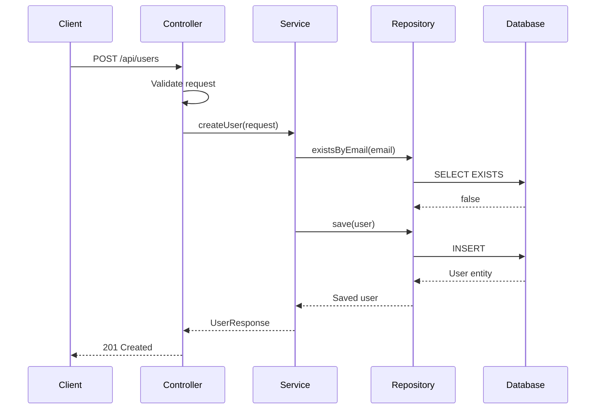
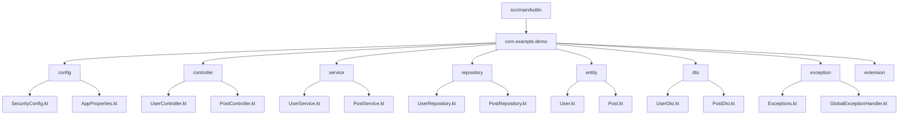

# How to Use Kotlin with Spring Boot

Author: [nawazdhandala](https://www.github.com/nawazdhandala)

Tags: Kotlin, Spring Boot, JVM, Web Development, REST API, Backend Development, Microservices

Description: Learn how to build modern web applications with Kotlin and Spring Boot, covering project setup, REST APIs, data persistence, and Kotlin-specific features.

---

Kotlin has become a first-class language for Spring Boot development. The combination brings concise syntax, null safety, and coroutine support to the Spring ecosystem. This guide walks through building a complete Spring Boot application with Kotlin.

## Why Kotlin for Spring Boot?

Kotlin offers several advantages over Java when working with Spring Boot:

- **Null safety** - Catch null pointer exceptions at compile time
- **Data classes** - Replace boilerplate with single-line declarations
- **Extension functions** - Add functionality to existing classes cleanly
- **Coroutines** - Write asynchronous code that looks synchronous
- **Concise syntax** - Less code means fewer bugs


## Project Setup

### Using Spring Initializr

The fastest way to start is using Spring Initializr. You can use the web interface or the command line.

```bash
# Using Spring CLI
spring init \
  --build=gradle \
  --java-version=17 \
  --language=kotlin \
  --dependencies=web,data-jpa,postgresql,validation \
  --group-id=com.example \
  --artifact-id=demo \
  demo-app
```

### Build Configuration

Here's a complete `build.gradle.kts` file for a Kotlin Spring Boot project:

```kotlin
// build.gradle.kts
import org.jetbrains.kotlin.gradle.tasks.KotlinCompile

plugins {
    // Spring Boot plugin for building executable JARs and running the app
    id("org.springframework.boot") version "3.2.0"

    // Dependency management from Spring
    id("io.spring.dependency-management") version "1.1.4"

    // Kotlin JVM plugin
    kotlin("jvm") version "1.9.20"

    // Spring plugin - opens classes for proxying (required for @Configuration, @Service, etc.)
    kotlin("plugin.spring") version "1.9.20"

    // JPA plugin - generates no-arg constructors for @Entity classes
    kotlin("plugin.jpa") version "1.9.20"
}

group = "com.example"
version = "1.0.0"

java {
    sourceCompatibility = JavaVersion.VERSION_17
}

repositories {
    mavenCentral()
}

dependencies {
    // Spring Boot starters
    implementation("org.springframework.boot:spring-boot-starter-web")
    implementation("org.springframework.boot:spring-boot-starter-data-jpa")
    implementation("org.springframework.boot:spring-boot-starter-validation")

    // Kotlin support
    implementation("com.fasterxml.jackson.module:jackson-module-kotlin")
    implementation("org.jetbrains.kotlin:kotlin-reflect")

    // Database
    runtimeOnly("org.postgresql:postgresql")

    // Testing
    testImplementation("org.springframework.boot:spring-boot-starter-test")
}

tasks.withType<KotlinCompile> {
    kotlinOptions {
        // Enable strict null checking for Java interop
        freeCompilerArgs += "-Xjsr305=strict"
        jvmTarget = "17"
    }
}

tasks.withType<Test> {
    useJUnitPlatform()
}
```

### Application Entry Point

```kotlin
// src/main/kotlin/com/example/demo/DemoApplication.kt
package com.example.demo

import org.springframework.boot.autoconfigure.SpringBootApplication
import org.springframework.boot.runApplication

// @SpringBootApplication enables auto-configuration, component scanning, and configuration
@SpringBootApplication
class DemoApplication

// Top-level function - no need for a companion object with main
fun main(args: Array<String>) {
    // runApplication is a Kotlin-specific function that infers the type
    runApplication<DemoApplication>(*args)
}
```

## Data Classes and Entities

Kotlin data classes work well for DTOs and, with some adjustments, for JPA entities.

### Data Transfer Objects

```kotlin
// src/main/kotlin/com/example/demo/dto/UserDto.kt
package com.example.demo.dto

import jakarta.validation.constraints.Email
import jakarta.validation.constraints.NotBlank
import jakarta.validation.constraints.Size

// Data class automatically provides equals(), hashCode(), toString(), copy()
data class CreateUserRequest(
    @field:NotBlank(message = "Name is required")
    @field:Size(min = 2, max = 100, message = "Name must be between 2 and 100 characters")
    val name: String,

    @field:NotBlank(message = "Email is required")
    @field:Email(message = "Invalid email format")
    val email: String,

    @field:Size(min = 8, message = "Password must be at least 8 characters")
    val password: String
)

data class UserResponse(
    val id: Long,
    val name: String,
    val email: String,
    val createdAt: java.time.Instant
)

data class UpdateUserRequest(
    val name: String? = null,  // Nullable with default - makes partial updates easy
    val email: String? = null
)
```

### JPA Entities

JPA entities need special handling in Kotlin because they require a no-arg constructor and mutable properties for some scenarios.

```kotlin
// src/main/kotlin/com/example/demo/entity/User.kt
package com.example.demo.entity

import jakarta.persistence.*
import org.hibernate.annotations.CreationTimestamp
import org.hibernate.annotations.UpdateTimestamp
import java.time.Instant

@Entity
@Table(name = "users")
class User(
    // Constructor parameters become properties
    @Column(nullable = false)
    var name: String,

    @Column(nullable = false, unique = true)
    var email: String,

    @Column(nullable = false)
    var passwordHash: String
) {
    // ID is auto-generated, so we keep it outside the constructor
    @Id
    @GeneratedValue(strategy = GenerationType.IDENTITY)
    var id: Long? = null

    @CreationTimestamp
    @Column(nullable = false, updatable = false)
    var createdAt: Instant? = null

    @UpdateTimestamp
    var updatedAt: Instant? = null

    // One-to-many relationship
    @OneToMany(mappedBy = "user", cascade = [CascadeType.ALL], orphanRemoval = true)
    var posts: MutableList<Post> = mutableListOf()

    // Custom equals/hashCode based on business key, not ID
    override fun equals(other: Any?): Boolean {
        if (this === other) return true
        if (other !is User) return false
        return email == other.email
    }

    override fun hashCode(): Int = email.hashCode()
}

@Entity
@Table(name = "posts")
class Post(
    @Column(nullable = false)
    var title: String,

    @Column(columnDefinition = "TEXT")
    var content: String,

    @ManyToOne(fetch = FetchType.LAZY)
    @JoinColumn(name = "user_id", nullable = false)
    var user: User
) {
    @Id
    @GeneratedValue(strategy = GenerationType.IDENTITY)
    var id: Long? = null

    @CreationTimestamp
    var createdAt: Instant? = null
}
```

## Repositories

Spring Data JPA repositories work identically in Kotlin, with some syntactic improvements.

```kotlin
// src/main/kotlin/com/example/demo/repository/UserRepository.kt
package com.example.demo.repository

import com.example.demo.entity.User
import org.springframework.data.jpa.repository.JpaRepository
import org.springframework.data.jpa.repository.Query
import java.util.Optional

interface UserRepository : JpaRepository<User, Long> {
    // Kotlin's nullable type for potentially missing results
    fun findByEmail(email: String): User?

    // Return Optional if you prefer Java-style
    fun findByName(name: String): Optional<User>

    // Boolean queries
    fun existsByEmail(email: String): Boolean

    // Custom JPQL query
    @Query("SELECT u FROM User u WHERE u.email LIKE %:domain")
    fun findByEmailDomain(domain: String): List<User>

    // Native SQL query
    @Query(
        value = "SELECT * FROM users WHERE created_at > NOW() - INTERVAL '30 days'",
        nativeQuery = true
    )
    fun findRecentUsers(): List<User>
}
```

## Service Layer

Services in Kotlin benefit from null safety and extension functions.

```kotlin
// src/main/kotlin/com/example/demo/service/UserService.kt
package com.example.demo.service

import com.example.demo.dto.CreateUserRequest
import com.example.demo.dto.UpdateUserRequest
import com.example.demo.dto.UserResponse
import com.example.demo.entity.User
import com.example.demo.exception.UserNotFoundException
import com.example.demo.exception.EmailAlreadyExistsException
import com.example.demo.repository.UserRepository
import org.springframework.security.crypto.password.PasswordEncoder
import org.springframework.stereotype.Service
import org.springframework.transaction.annotation.Transactional

@Service
@Transactional  // All public methods are transactional by default
class UserService(
    // Constructor injection - no need for @Autowired
    private val userRepository: UserRepository,
    private val passwordEncoder: PasswordEncoder
) {
    fun createUser(request: CreateUserRequest): UserResponse {
        // Check for existing email
        if (userRepository.existsByEmail(request.email)) {
            throw EmailAlreadyExistsException("Email ${request.email} is already registered")
        }

        val user = User(
            name = request.name,
            email = request.email,
            passwordHash = passwordEncoder.encode(request.password)
        )

        val savedUser = userRepository.save(user)
        return savedUser.toResponse()
    }

    @Transactional(readOnly = true)  // Optimization for read operations
    fun getUser(id: Long): UserResponse {
        val user = userRepository.findById(id)
            .orElseThrow { UserNotFoundException("User with ID $id not found") }
        return user.toResponse()
    }

    @Transactional(readOnly = true)
    fun getUserByEmail(email: String): UserResponse {
        // Using Kotlin's null-safe operator with custom exception
        val user = userRepository.findByEmail(email)
            ?: throw UserNotFoundException("User with email $email not found")
        return user.toResponse()
    }

    fun updateUser(id: Long, request: UpdateUserRequest): UserResponse {
        val user = userRepository.findById(id)
            .orElseThrow { UserNotFoundException("User with ID $id not found") }

        // Use apply for fluent updates - only update non-null fields
        user.apply {
            request.name?.let { name = it }
            request.email?.let { email = it }
        }

        return userRepository.save(user).toResponse()
    }

    fun deleteUser(id: Long) {
        if (!userRepository.existsById(id)) {
            throw UserNotFoundException("User with ID $id not found")
        }
        userRepository.deleteById(id)
    }

    @Transactional(readOnly = true)
    fun getAllUsers(): List<UserResponse> {
        return userRepository.findAll().map { it.toResponse() }
    }
}

// Extension function to convert Entity to DTO
// Keeps the mapping logic reusable and the service clean
private fun User.toResponse() = UserResponse(
    id = this.id!!,
    name = this.name,
    email = this.email,
    createdAt = this.createdAt!!
)
```

## REST Controllers

Controllers in Kotlin are clean and expressive.

```kotlin
// src/main/kotlin/com/example/demo/controller/UserController.kt
package com.example.demo.controller

import com.example.demo.dto.CreateUserRequest
import com.example.demo.dto.UpdateUserRequest
import com.example.demo.dto.UserResponse
import com.example.demo.service.UserService
import jakarta.validation.Valid
import org.springframework.http.HttpStatus
import org.springframework.http.ResponseEntity
import org.springframework.web.bind.annotation.*
import java.net.URI

@RestController
@RequestMapping("/api/users")
class UserController(private val userService: UserService) {

    @PostMapping
    fun createUser(@Valid @RequestBody request: CreateUserRequest): ResponseEntity<UserResponse> {
        val user = userService.createUser(request)
        // Return 201 Created with Location header
        return ResponseEntity
            .created(URI.create("/api/users/${user.id}"))
            .body(user)
    }

    @GetMapping("/{id}")
    fun getUser(@PathVariable id: Long): UserResponse {
        // Spring automatically wraps in 200 OK response
        return userService.getUser(id)
    }

    @GetMapping
    fun getAllUsers(): List<UserResponse> {
        return userService.getAllUsers()
    }

    @PutMapping("/{id}")
    fun updateUser(
        @PathVariable id: Long,
        @Valid @RequestBody request: UpdateUserRequest
    ): UserResponse {
        return userService.updateUser(id, request)
    }

    @DeleteMapping("/{id}")
    @ResponseStatus(HttpStatus.NO_CONTENT)
    fun deleteUser(@PathVariable id: Long) {
        userService.deleteUser(id)
    }

    @GetMapping("/search")
    fun searchByEmail(@RequestParam email: String): UserResponse {
        return userService.getUserByEmail(email)
    }
}
```

## Exception Handling

Kotlin's sealed classes are perfect for domain exceptions.

```kotlin
// src/main/kotlin/com/example/demo/exception/Exceptions.kt
package com.example.demo.exception

// Sealed class hierarchy for domain exceptions
sealed class DomainException(message: String) : RuntimeException(message)

class UserNotFoundException(message: String) : DomainException(message)
class EmailAlreadyExistsException(message: String) : DomainException(message)
class InvalidCredentialsException(message: String) : DomainException(message)
```

```kotlin
// src/main/kotlin/com/example/demo/exception/GlobalExceptionHandler.kt
package com.example.demo.exception

import org.springframework.http.HttpStatus
import org.springframework.http.ResponseEntity
import org.springframework.web.bind.MethodArgumentNotValidException
import org.springframework.web.bind.annotation.ExceptionHandler
import org.springframework.web.bind.annotation.RestControllerAdvice
import java.time.Instant

// Response DTO for errors
data class ErrorResponse(
    val timestamp: Instant = Instant.now(),
    val status: Int,
    val error: String,
    val message: String,
    val path: String? = null,
    val details: List<String>? = null
)

@RestControllerAdvice
class GlobalExceptionHandler {

    @ExceptionHandler(UserNotFoundException::class)
    fun handleUserNotFound(ex: UserNotFoundException): ResponseEntity<ErrorResponse> {
        val response = ErrorResponse(
            status = HttpStatus.NOT_FOUND.value(),
            error = "Not Found",
            message = ex.message ?: "User not found"
        )
        return ResponseEntity.status(HttpStatus.NOT_FOUND).body(response)
    }

    @ExceptionHandler(EmailAlreadyExistsException::class)
    fun handleEmailExists(ex: EmailAlreadyExistsException): ResponseEntity<ErrorResponse> {
        val response = ErrorResponse(
            status = HttpStatus.CONFLICT.value(),
            error = "Conflict",
            message = ex.message ?: "Email already exists"
        )
        return ResponseEntity.status(HttpStatus.CONFLICT).body(response)
    }

    // Handle validation errors
    @ExceptionHandler(MethodArgumentNotValidException::class)
    fun handleValidationErrors(ex: MethodArgumentNotValidException): ResponseEntity<ErrorResponse> {
        // Extract all validation error messages
        val details = ex.bindingResult.fieldErrors.map { error ->
            "${error.field}: ${error.defaultMessage}"
        }

        val response = ErrorResponse(
            status = HttpStatus.BAD_REQUEST.value(),
            error = "Validation Failed",
            message = "Request validation failed",
            details = details
        )
        return ResponseEntity.status(HttpStatus.BAD_REQUEST).body(response)
    }

    // Catch-all for unexpected errors
    @ExceptionHandler(Exception::class)
    fun handleGenericException(ex: Exception): ResponseEntity<ErrorResponse> {
        val response = ErrorResponse(
            status = HttpStatus.INTERNAL_SERVER_ERROR.value(),
            error = "Internal Server Error",
            message = "An unexpected error occurred"
        )
        return ResponseEntity.status(HttpStatus.INTERNAL_SERVER_ERROR).body(response)
    }
}
```

## Coroutines with Spring WebFlux

For non-blocking I/O, Kotlin coroutines integrate naturally with Spring WebFlux.

```kotlin
// build.gradle.kts - add these dependencies
dependencies {
    implementation("org.springframework.boot:spring-boot-starter-webflux")
    implementation("org.jetbrains.kotlinx:kotlinx-coroutines-core")
    implementation("org.jetbrains.kotlinx:kotlinx-coroutines-reactor")
}
```

```kotlin
// src/main/kotlin/com/example/demo/controller/AsyncUserController.kt
package com.example.demo.controller

import com.example.demo.dto.UserResponse
import com.example.demo.service.AsyncUserService
import kotlinx.coroutines.flow.Flow
import org.springframework.web.bind.annotation.*

@RestController
@RequestMapping("/api/v2/users")
class AsyncUserController(private val userService: AsyncUserService) {

    // Suspend function - handles one request at a time without blocking threads
    @GetMapping("/{id}")
    suspend fun getUser(@PathVariable id: Long): UserResponse {
        return userService.getUser(id)
    }

    // Flow - streams multiple items without loading all into memory
    @GetMapping
    fun getAllUsers(): Flow<UserResponse> {
        return userService.getAllUsers()
    }
}
```

```kotlin
// src/main/kotlin/com/example/demo/service/AsyncUserService.kt
package com.example.demo.service

import com.example.demo.dto.UserResponse
import com.example.demo.repository.UserCoroutineRepository
import kotlinx.coroutines.flow.Flow
import kotlinx.coroutines.flow.map
import org.springframework.stereotype.Service

@Service
class AsyncUserService(private val userRepository: UserCoroutineRepository) {

    suspend fun getUser(id: Long): UserResponse {
        val user = userRepository.findById(id)
            ?: throw UserNotFoundException("User not found")
        return user.toResponse()
    }

    fun getAllUsers(): Flow<UserResponse> {
        return userRepository.findAll().map { it.toResponse() }
    }
}
```

## Application Flow

Here's how a typical request flows through the application:



## Configuration

### Application Properties

Kotlin's syntax works in `application.properties`, but you can also use `@ConfigurationProperties` for type-safe configuration.

```yaml
# src/main/resources/application.yml
spring:
  datasource:
    url: jdbc:postgresql://localhost:5432/demo
    username: ${DB_USERNAME:demo}
    password: ${DB_PASSWORD:demo}
  jpa:
    hibernate:
      ddl-auto: validate
    properties:
      hibernate:
        dialect: org.hibernate.dialect.PostgreSQLDialect
        format_sql: true
    show-sql: false

server:
  port: 8080

app:
  jwt:
    secret: ${JWT_SECRET:your-secret-key}
    expiration-ms: 86400000
```

```kotlin
// src/main/kotlin/com/example/demo/config/AppProperties.kt
package com.example.demo.config

import org.springframework.boot.context.properties.ConfigurationProperties

@ConfigurationProperties(prefix = "app")
data class AppProperties(
    val jwt: JwtProperties
) {
    data class JwtProperties(
        val secret: String,
        val expirationMs: Long
    )
}
```

```kotlin
// Enable in main application
@SpringBootApplication
@ConfigurationPropertiesScan  // Scan for @ConfigurationProperties classes
class DemoApplication
```

## Testing

Kotlin makes testing concise and expressive.

```kotlin
// src/test/kotlin/com/example/demo/service/UserServiceTest.kt
package com.example.demo.service

import com.example.demo.dto.CreateUserRequest
import com.example.demo.entity.User
import com.example.demo.exception.EmailAlreadyExistsException
import com.example.demo.repository.UserRepository
import io.mockk.*
import io.mockk.impl.annotations.InjectMockKs
import io.mockk.impl.annotations.MockK
import org.junit.jupiter.api.BeforeEach
import org.junit.jupiter.api.Test
import org.junit.jupiter.api.assertThrows
import org.springframework.security.crypto.password.PasswordEncoder
import java.time.Instant
import kotlin.test.assertEquals

class UserServiceTest {

    @MockK
    private lateinit var userRepository: UserRepository

    @MockK
    private lateinit var passwordEncoder: PasswordEncoder

    @InjectMockKs
    private lateinit var userService: UserService

    @BeforeEach
    fun setup() {
        MockKAnnotations.init(this)
    }

    @Test
    fun `createUser should create user when email is unique`() {
        // Given
        val request = CreateUserRequest(
            name = "John Doe",
            email = "john@example.com",
            password = "password123"
        )

        val savedUser = User(
            name = request.name,
            email = request.email,
            passwordHash = "hashed_password"
        ).apply {
            id = 1L
            createdAt = Instant.now()
        }

        every { userRepository.existsByEmail(request.email) } returns false
        every { passwordEncoder.encode(request.password) } returns "hashed_password"
        every { userRepository.save(any()) } returns savedUser

        // When
        val result = userService.createUser(request)

        // Then
        assertEquals(1L, result.id)
        assertEquals("John Doe", result.name)
        assertEquals("john@example.com", result.email)

        verify(exactly = 1) { userRepository.save(any()) }
    }

    @Test
    fun `createUser should throw exception when email exists`() {
        // Given
        val request = CreateUserRequest(
            name = "John Doe",
            email = "existing@example.com",
            password = "password123"
        )

        every { userRepository.existsByEmail(request.email) } returns true

        // When/Then
        assertThrows<EmailAlreadyExistsException> {
            userService.createUser(request)
        }

        verify(exactly = 0) { userRepository.save(any()) }
    }
}
```

### Integration Tests

```kotlin
// src/test/kotlin/com/example/demo/controller/UserControllerIntegrationTest.kt
package com.example.demo.controller

import com.example.demo.dto.CreateUserRequest
import com.fasterxml.jackson.databind.ObjectMapper
import org.junit.jupiter.api.Test
import org.springframework.beans.factory.annotation.Autowired
import org.springframework.boot.test.autoconfigure.web.servlet.AutoConfigureMockMvc
import org.springframework.boot.test.context.SpringBootTest
import org.springframework.http.MediaType
import org.springframework.test.context.DynamicPropertyRegistry
import org.springframework.test.context.DynamicPropertySource
import org.springframework.test.web.servlet.MockMvc
import org.springframework.test.web.servlet.post
import org.testcontainers.containers.PostgreSQLContainer
import org.testcontainers.junit.jupiter.Container
import org.testcontainers.junit.jupiter.Testcontainers

@SpringBootTest
@AutoConfigureMockMvc
@Testcontainers
class UserControllerIntegrationTest {

    companion object {
        @Container
        val postgres = PostgreSQLContainer("postgres:15-alpine")

        @JvmStatic
        @DynamicPropertySource
        fun configureProperties(registry: DynamicPropertyRegistry) {
            registry.add("spring.datasource.url", postgres::getJdbcUrl)
            registry.add("spring.datasource.username", postgres::getUsername)
            registry.add("spring.datasource.password", postgres::getPassword)
        }
    }

    @Autowired
    private lateinit var mockMvc: MockMvc

    @Autowired
    private lateinit var objectMapper: ObjectMapper

    @Test
    fun `POST users should create user and return 201`() {
        val request = CreateUserRequest(
            name = "Integration Test User",
            email = "integration@test.com",
            password = "securepassword"
        )

        mockMvc.post("/api/users") {
            contentType = MediaType.APPLICATION_JSON
            content = objectMapper.writeValueAsString(request)
        }.andExpect {
            status { isCreated() }
            jsonPath("$.name") { value("Integration Test User") }
            jsonPath("$.email") { value("integration@test.com") }
            jsonPath("$.id") { isNumber() }
        }
    }
}
```

## Kotlin-Specific Features

### Scope Functions

Kotlin's scope functions (`let`, `apply`, `also`, `run`, `with`) make code cleaner:

```kotlin
// Use 'let' for null-safe transformations
fun findUserOrNull(id: Long): UserResponse? {
    return userRepository.findById(id).orElse(null)?.let { user ->
        UserResponse(
            id = user.id!!,
            name = user.name,
            email = user.email,
            createdAt = user.createdAt!!
        )
    }
}

// Use 'apply' for object configuration
fun createDefaultUser(): User {
    return User(
        name = "Default",
        email = "default@example.com",
        passwordHash = "hashed"
    ).apply {
        // 'this' refers to the User instance
        posts.add(Post("Welcome", "Welcome post", this))
    }
}

// Use 'also' for side effects (logging, validation)
fun saveUser(user: User): User {
    return userRepository.save(user).also { savedUser ->
        logger.info("Created user with ID: ${savedUser.id}")
        eventPublisher.publish(UserCreatedEvent(savedUser.id!!))
    }
}
```

### Extension Functions

Add methods to existing classes without inheritance:

```kotlin
// src/main/kotlin/com/example/demo/extension/Extensions.kt
package com.example.demo.extension

import org.springframework.data.domain.Page
import org.springframework.data.domain.PageRequest
import org.springframework.data.domain.Sort

// Extension function on String
fun String.toSlug(): String {
    return this.lowercase()
        .replace(Regex("[^a-z0-9\\s-]"), "")
        .replace(Regex("\\s+"), "-")
        .trim('-')
}

// Extension function for pagination
fun <T> Page<T>.toPageResponse(): PageResponse<T> {
    return PageResponse(
        content = this.content,
        page = this.number,
        size = this.size,
        totalElements = this.totalElements,
        totalPages = this.totalPages
    )
}

data class PageResponse<T>(
    val content: List<T>,
    val page: Int,
    val size: Int,
    val totalElements: Long,
    val totalPages: Int
)

// Usage in service
fun getAllUsersPaged(page: Int, size: Int): PageResponse<UserResponse> {
    val pageable = PageRequest.of(page, size, Sort.by("createdAt").descending())
    return userRepository.findAll(pageable)
        .map { it.toResponse() }
        .toPageResponse()
}
```

## Project Structure

A well-organized Kotlin Spring Boot project:



## Summary

| Feature | Kotlin Benefit |
|---------|---------------|
| **Data Classes** | Single-line DTOs with equals, hashCode, copy |
| **Null Safety** | Compile-time null checking, no NPEs |
| **Extension Functions** | Add methods to existing classes |
| **Scope Functions** | Clean object configuration and transformations |
| **Coroutines** | Async code that reads like sync code |
| **Default Parameters** | Fewer constructor overloads |
| **String Templates** | Clean string interpolation |

Kotlin and Spring Boot together provide a productive, type-safe environment for building backend applications. The language features reduce boilerplate while maintaining full compatibility with the Java ecosystem. Start with the basics shown here, then explore coroutines and reactive programming as your needs grow.
