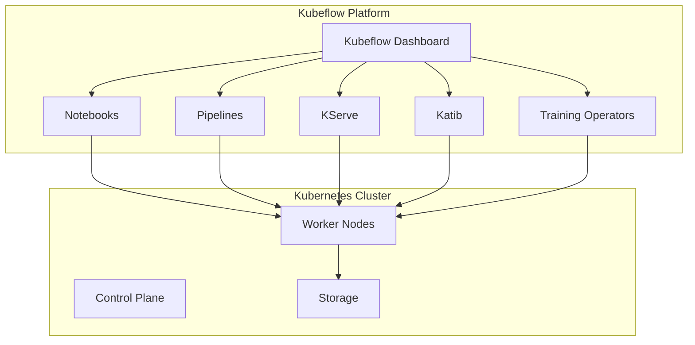
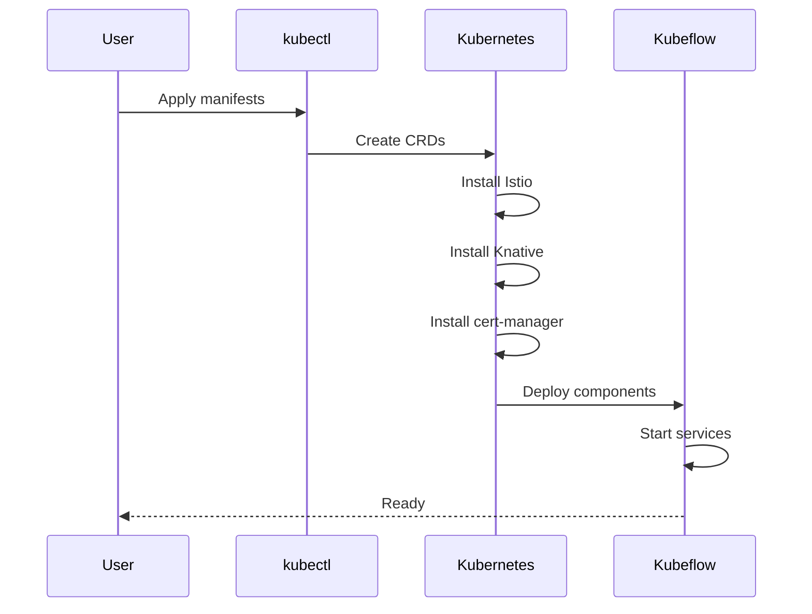
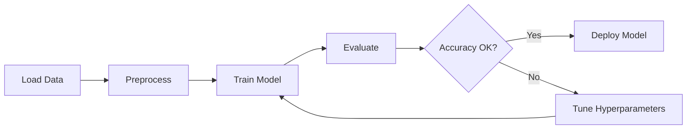
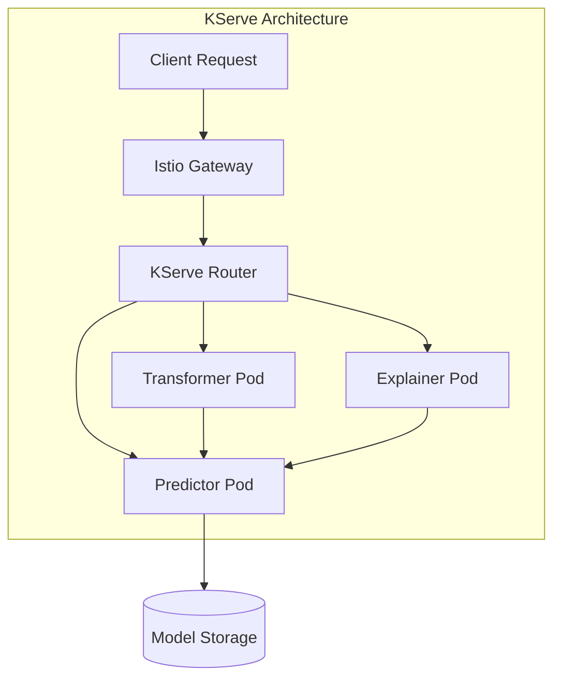
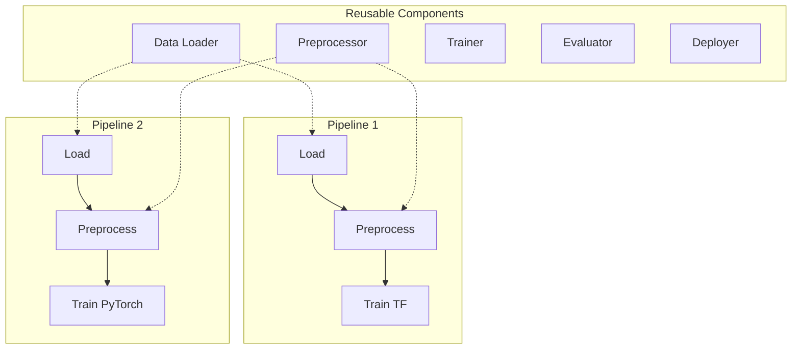

# How to Get Started with Kubeflow on Kubernetes

Author: [nawazdhandala](https://www.github.com/nawazdhandala)

Tags: Kubeflow, Kubernetes, Machine Learning, MLOps, Pipelines

Description: A beginner's guide to Kubeflow on Kubernetes covering installation, notebooks, pipelines, and model serving with KServe.

---

Kubeflow is an open-source machine learning platform designed to run on Kubernetes. It provides a collection of tools that help data scientists and ML engineers build, train, and deploy models at scale. If you are looking to bring your ML workflows into a production-ready environment, Kubeflow offers a solid foundation.

This guide walks you through the basics of setting up Kubeflow, using Jupyter notebooks, creating pipelines, and serving models with KServe.

## What is Kubeflow?

Kubeflow started as a way to run TensorFlow jobs on Kubernetes, but it has grown into a comprehensive ML platform. Today it includes:

- **Kubeflow Notebooks**: Jupyter notebook servers running in your cluster
- **Kubeflow Pipelines**: Orchestration system for ML workflows
- **KServe**: Model serving infrastructure for inference
- **Katib**: Hyperparameter tuning and neural architecture search
- **Training Operators**: Distributed training for TensorFlow, PyTorch, and other frameworks



## Prerequisites

Before installing Kubeflow, make sure you have:

- A Kubernetes cluster (version 1.25 or later)
- kubectl configured to access your cluster
- At least 16GB RAM and 4 CPUs available in your cluster
- A default StorageClass configured for persistent volumes

You can verify your Kubernetes setup with these commands:

```bash
# Check kubectl connection to cluster
kubectl cluster-info

# Verify Kubernetes version
kubectl version --short

# Check available nodes and resources
kubectl get nodes -o wide

# Confirm a default StorageClass exists
kubectl get storageclass
```

## Installing Kubeflow

There are several ways to install Kubeflow. The recommended approach for beginners is using the manifests provided by the Kubeflow project. Here we will use kustomize, which is built into kubectl.

### Step 1: Clone the Kubeflow Manifests Repository

```bash
# Clone the official Kubeflow manifests repository
git clone https://github.com/kubeflow/manifests.git
cd manifests

# Checkout a stable release tag
# Check https://github.com/kubeflow/manifests/releases for latest version
git checkout v1.9.0
```

### Step 2: Install Kubeflow Components

The installation uses kustomize to apply Kubernetes manifests. Run the following command from the manifests directory:

```bash
# This command installs all Kubeflow components
# The process may take 10-15 minutes depending on your cluster
while ! kustomize build example | kubectl apply -f -; do
    echo "Retrying to apply resources..."
    sleep 10
done
```

The while loop handles transient errors that occur when resources are created before their dependencies are ready.

### Step 3: Verify the Installation

Wait for all pods to become ready:

```bash
# Watch pods in the kubeflow namespace
kubectl get pods -n kubeflow --watch

# Check the status of all Kubeflow namespaces
kubectl get pods -A | grep -E "kubeflow|istio|knative|cert-manager"
```

All pods should show a Running or Completed status before proceeding.



## Accessing the Kubeflow Dashboard

The Kubeflow dashboard is served through Istio's ingress gateway. For local development, you can use port-forwarding:

```bash
# Forward the Istio ingress gateway to localhost
kubectl port-forward svc/istio-ingressgateway -n istio-system 8080:80

# Access the dashboard at http://localhost:8080
# Default credentials:
# Email: user@example.com
# Password: 12341234
```

For production deployments, you should configure a proper ingress with TLS certificates.

## Using Kubeflow Notebooks

Kubeflow Notebooks let you run Jupyter servers directly in your Kubernetes cluster. This gives you access to cluster resources and makes it easy to scale your experiments.

### Creating a Notebook Server

1. Open the Kubeflow dashboard
2. Click on "Notebooks" in the left sidebar
3. Click "New Notebook"
4. Configure your notebook server:

```yaml
# Example notebook server configuration
name: my-notebook
namespace: kubeflow-user
image: kubeflownotebookswg/jupyter-scipy:v1.9.0
cpu: 2
memory: 4Gi
gpus: 0  # Set to 1 or more if you need GPU access

# Optional: Mount a persistent volume for your work
volumeMounts:
  - name: workspace
    mountPath: /home/jovyan
volumes:
  - name: workspace
    persistentVolumeClaim:
      claimName: my-notebook-pvc
```

### Working with Notebooks

Once your notebook server is running, you can create Python notebooks and run ML experiments. Here is an example notebook cell that trains a simple model:

```python
# Import required libraries
import numpy as np
from sklearn.model_selection import train_test_split
from sklearn.ensemble import RandomForestClassifier
from sklearn.metrics import accuracy_score
import joblib

# Generate sample data for demonstration
# In production, you would load your actual dataset here
np.random.seed(42)
X = np.random.randn(1000, 10)  # 1000 samples, 10 features
y = (X[:, 0] + X[:, 1] > 0).astype(int)  # Binary classification

# Split data into training and test sets
# 80% for training, 20% for testing
X_train, X_test, y_train, y_test = train_test_split(
    X, y,
    test_size=0.2,
    random_state=42
)

# Initialize the model with reasonable defaults
model = RandomForestClassifier(
    n_estimators=100,  # Number of trees in the forest
    max_depth=10,      # Maximum depth of each tree
    random_state=42    # For reproducibility
)

# Train the model
model.fit(X_train, y_train)

# Evaluate on test data
predictions = model.predict(X_test)
accuracy = accuracy_score(y_test, predictions)
print(f"Model accuracy: {accuracy:.4f}")

# Save the model for later use in serving
joblib.dump(model, "model.joblib")
print("Model saved to model.joblib")
```

## Introduction to Kubeflow Pipelines

Kubeflow Pipelines lets you define ML workflows as code. Each step in your pipeline runs as a container, making your workflows reproducible and scalable.



### Creating a Simple Pipeline

Here is an example pipeline that loads data, trains a model, and evaluates it:

```python
# pipeline.py
# A simple Kubeflow Pipeline example

from kfp import dsl
from kfp import compiler

# Define a component for loading data
@dsl.component(
    base_image="python:3.10",
    packages_to_install=["pandas", "scikit-learn"]
)
def load_data() -> dsl.Output[dsl.Dataset]:
    """
    Load and prepare the dataset.
    This component downloads or generates training data.
    """
    import pandas as pd
    from sklearn.datasets import load_iris

    # Load the iris dataset as an example
    iris = load_iris()
    df = pd.DataFrame(
        data=iris.data,
        columns=iris.feature_names
    )
    df["target"] = iris.target

    # Save to the output path
    df.to_csv(load_data.outputs["output"].path, index=False)


# Define a component for training
@dsl.component(
    base_image="python:3.10",
    packages_to_install=["pandas", "scikit-learn", "joblib"]
)
def train_model(
    dataset: dsl.Input[dsl.Dataset],
    model: dsl.Output[dsl.Model],
    n_estimators: int = 100
):
    """
    Train a Random Forest classifier.

    Args:
        dataset: Input dataset from the load_data step
        model: Output path for the trained model
        n_estimators: Number of trees in the forest
    """
    import pandas as pd
    from sklearn.ensemble import RandomForestClassifier
    import joblib

    # Load the dataset
    df = pd.read_csv(dataset.path)
    X = df.drop("target", axis=1)
    y = df["target"]

    # Train the model
    clf = RandomForestClassifier(n_estimators=n_estimators)
    clf.fit(X, y)

    # Save the trained model
    joblib.dump(clf, model.path)


# Define a component for evaluation
@dsl.component(
    base_image="python:3.10",
    packages_to_install=["pandas", "scikit-learn", "joblib"]
)
def evaluate_model(
    model: dsl.Input[dsl.Model],
    dataset: dsl.Input[dsl.Dataset]
) -> float:
    """
    Evaluate the trained model and return accuracy.

    Args:
        model: Trained model from the train step
        dataset: Dataset to evaluate on

    Returns:
        Accuracy score as a float
    """
    import pandas as pd
    from sklearn.metrics import accuracy_score
    import joblib

    # Load model and data
    clf = joblib.load(model.path)
    df = pd.read_csv(dataset.path)
    X = df.drop("target", axis=1)
    y = df["target"]

    # Calculate accuracy
    predictions = clf.predict(X)
    accuracy = accuracy_score(y, predictions)

    print(f"Model accuracy: {accuracy:.4f}")
    return accuracy


# Define the pipeline
@dsl.pipeline(
    name="Simple ML Pipeline",
    description="A pipeline that loads data, trains a model, and evaluates it"
)
def ml_pipeline(n_estimators: int = 100):
    """
    Main pipeline definition.

    Args:
        n_estimators: Number of trees for the Random Forest
    """
    # Step 1: Load the data
    load_task = load_data()

    # Step 2: Train the model using the loaded data
    train_task = train_model(
        dataset=load_task.outputs["output"],
        n_estimators=n_estimators
    )

    # Step 3: Evaluate the trained model
    evaluate_task = evaluate_model(
        model=train_task.outputs["model"],
        dataset=load_task.outputs["output"]
    )


# Compile the pipeline to a YAML file
if __name__ == "__main__":
    compiler.Compiler().compile(
        pipeline_func=ml_pipeline,
        package_path="ml_pipeline.yaml"
    )
    print("Pipeline compiled to ml_pipeline.yaml")
```

### Running the Pipeline

Upload the compiled pipeline to Kubeflow:

```bash
# Install the Kubeflow Pipelines SDK if needed
pip install kfp

# Compile the pipeline
python pipeline.py

# You can also submit runs programmatically
python -c "
from kfp.client import Client

# Connect to the Kubeflow Pipelines API
client = Client(host='http://localhost:8080/pipeline')

# Upload and run the pipeline
run = client.create_run_from_pipeline_package(
    pipeline_file='ml_pipeline.yaml',
    arguments={'n_estimators': 200},
    run_name='My first pipeline run'
)
print(f'Run created: {run.run_id}')
"
```

## Serving Models with KServe

KServe (formerly known as KFServing) provides serverless inference on Kubernetes. It handles autoscaling, traffic management, and model versioning.



### Deploying a Model with KServe

First, save your model to a location accessible by KServe, such as an S3 bucket or a PersistentVolumeClaim.

```yaml
# inference-service.yaml
# KServe InferenceService configuration

apiVersion: serving.kserve.io/v1beta1
kind: InferenceService
metadata:
  name: sklearn-iris
  namespace: kubeflow-user
spec:
  predictor:
    # Use the sklearn server for scikit-learn models
    sklearn:
      # Point to your model location
      # This can be s3://, gs://, or a PVC path
      storageUri: "pvc://model-storage/sklearn/iris"

      # Resource requests and limits
      resources:
        requests:
          cpu: 100m
          memory: 256Mi
        limits:
          cpu: 1
          memory: 1Gi
```

Apply the InferenceService:

```bash
# Deploy the inference service
kubectl apply -f inference-service.yaml

# Check the status
kubectl get inferenceservice sklearn-iris -n kubeflow-user

# Wait for the service to be ready
kubectl wait --for=condition=Ready inferenceservice/sklearn-iris \
    -n kubeflow-user --timeout=300s
```

### Making Predictions

Once your model is deployed, you can send prediction requests:

```python
# predict.py
# Send prediction requests to a KServe endpoint

import requests
import json

# The service URL follows this pattern:
# http://{service-name}.{namespace}.svc.cluster.local/v1/models/{model-name}:predict
# For external access, use the Istio ingress gateway

SERVICE_URL = "http://localhost:8080/v1/models/sklearn-iris:predict"

# Prepare the input data
# KServe expects data in a specific format
input_data = {
    "instances": [
        [5.1, 3.5, 1.4, 0.2],  # Sample 1: Iris setosa
        [6.2, 2.9, 4.3, 1.3],  # Sample 2: Iris versicolor
        [7.9, 3.8, 6.4, 2.0],  # Sample 3: Iris virginica
    ]
}

# Send the prediction request
response = requests.post(
    SERVICE_URL,
    headers={"Content-Type": "application/json"},
    data=json.dumps(input_data)
)

# Parse and display the results
if response.status_code == 200:
    predictions = response.json()
    print("Predictions:", predictions["predictions"])
    # Output: Predictions: [0, 1, 2]
else:
    print(f"Error: {response.status_code}")
    print(response.text)
```

## Best Practices

Here are some recommendations for working with Kubeflow in production:

### Resource Management

```yaml
# Always set resource requests and limits for your components
resources:
  requests:
    cpu: 500m
    memory: 1Gi
  limits:
    cpu: 2
    memory: 4Gi
```

### Pipeline Organization

Structure your pipelines to be modular and reusable:



### Version Control

Keep your pipeline definitions, component code, and configurations in version control:

```
ml-project/
├── components/
│   ├── data_loader/
│   │   ├── Dockerfile
│   │   └── main.py
│   ├── trainer/
│   │   ├── Dockerfile
│   │   └── main.py
│   └── evaluator/
│       ├── Dockerfile
│       └── main.py
├── pipelines/
│   ├── training_pipeline.py
│   └── inference_pipeline.py
├── manifests/
│   └── inference_service.yaml
└── README.md
```

## Troubleshooting Common Issues

### Pods Stuck in Pending State

Check if there are resource constraints:

```bash
# Check pod events for error messages
kubectl describe pod <pod-name> -n kubeflow

# Verify node resources
kubectl describe nodes | grep -A 5 "Allocated resources"
```

### Pipeline Steps Failing

View the logs for the failed step:

```bash
# Get the pod name for the failed step from the pipeline UI
# Then check the logs
kubectl logs <pod-name> -n kubeflow-user -c main

# For init container issues
kubectl logs <pod-name> -n kubeflow-user -c init
```

### Model Serving Errors

Debug KServe issues:

```bash
# Check the inference service status
kubectl get inferenceservice -n kubeflow-user

# View the predictor pod logs
kubectl logs -l serving.kserve.io/inferenceservice=sklearn-iris \
    -n kubeflow-user -c kserve-container
```

## Conclusion

Kubeflow brings together the tools you need to run ML workloads on Kubernetes. Starting with Jupyter notebooks for experimentation, moving to pipelines for reproducible workflows, and finally serving models with KServe, you have a complete platform for the ML lifecycle.

The key to success with Kubeflow is starting simple. Begin with a notebook to develop your model, then package it into a pipeline component, and finally deploy it with KServe. As your needs grow, you can explore advanced features like hyperparameter tuning with Katib and distributed training.

For more detailed information, check out the official Kubeflow documentation at https://kubeflow.org/docs/.
