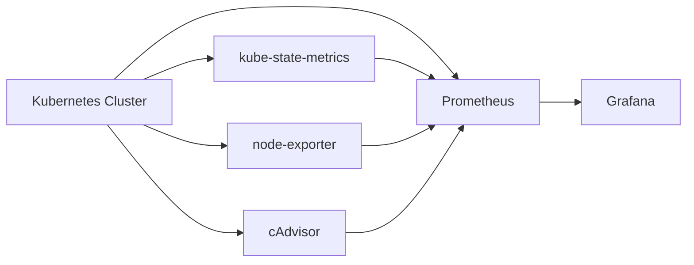

# How to Configure Kubernetes Monitoring in Grafana

Author: [nawazdhandala](https://www.github.com/nawazdhandala)

Tags: Grafana, Kubernetes, Monitoring, Prometheus, Observability, Containers, DevOps

Description: A comprehensive guide to setting up Kubernetes monitoring in Grafana using Prometheus, including cluster health, workload metrics, and resource utilization dashboards.

---

## Why Monitor Kubernetes with Grafana?

Kubernetes abstracts infrastructure but introduces its own complexity. Pods come and go, resources are dynamically allocated, and problems can cascade through deployments. Grafana combined with Prometheus gives you visibility into cluster health, workload performance, and resource utilization.

This guide covers setting up comprehensive Kubernetes monitoring from scratch.

## Architecture Overview



Key components:
- **Prometheus**: Collects and stores metrics
- **kube-state-metrics**: Exposes Kubernetes object state
- **node-exporter**: Provides node-level metrics
- **cAdvisor**: Container resource usage (built into kubelet)
- **Grafana**: Visualization and dashboards

## Setting Up the Monitoring Stack

### Using kube-prometheus-stack

The quickest path is the kube-prometheus-stack Helm chart:

```bash
# Add the Prometheus community Helm repo
helm repo add prometheus-community https://prometheus-community.github.io/helm-charts
helm repo update

# Install the stack
helm install monitoring prometheus-community/kube-prometheus-stack \
  --namespace monitoring \
  --create-namespace \
  --set grafana.adminPassword=your-secure-password
```

This installs:
- Prometheus Operator
- Prometheus instance
- Alertmanager
- Grafana with pre-built dashboards
- kube-state-metrics
- node-exporter

### Accessing Grafana

```bash
# Port forward to access Grafana
kubectl port-forward -n monitoring svc/monitoring-grafana 3000:80

# Default credentials
# Username: admin
# Password: (the value you set, or 'prom-operator' if using defaults)
```

## Essential Kubernetes Metrics

Understanding available metrics is key to building useful dashboards.

### Cluster-Level Metrics

```promql
# Total nodes in cluster
count(kube_node_info)

# Node conditions
kube_node_status_condition{condition="Ready", status="true"}

# Total allocatable resources
sum(kube_node_status_allocatable{resource="cpu"})
sum(kube_node_status_allocatable{resource="memory"})
```

### Workload Metrics

```promql
# Deployment replicas
kube_deployment_spec_replicas{namespace="production"}
kube_deployment_status_replicas_available{namespace="production"}

# Pod status
sum(kube_pod_status_phase{phase="Running"}) by (namespace)
sum(kube_pod_status_phase{phase="Pending"}) by (namespace)
sum(kube_pod_status_phase{phase="Failed"}) by (namespace)

# Container restarts
sum(increase(kube_pod_container_status_restarts_total[1h])) by (namespace, pod)
```

### Resource Utilization

```promql
# CPU usage by pod
sum(rate(container_cpu_usage_seconds_total{container!=""}[5m])) by (namespace, pod)

# Memory usage by pod
sum(container_memory_working_set_bytes{container!=""}) by (namespace, pod)

# CPU requests vs usage
sum(kube_pod_container_resource_requests{resource="cpu"}) by (namespace)
sum(rate(container_cpu_usage_seconds_total{container!=""}[5m])) by (namespace)
```

## Building the Cluster Overview Dashboard

### Panel 1: Cluster Health Summary

Create a stat panel showing overall cluster status:

```promql
# Percentage of nodes ready
count(kube_node_status_condition{condition="Ready", status="true"})
/
count(kube_node_info)
* 100
```

Configuration:

```yaml
Panel Type: Stat
Title: Cluster Health

Thresholds:
  - 100: green
  - 80: yellow
  - 0: red

Text mode: Value and name
```

### Panel 2: Resource Capacity

Show cluster-wide resource utilization:

```promql
# CPU utilization percentage
sum(rate(container_cpu_usage_seconds_total{container!=""}[5m]))
/
sum(kube_node_status_allocatable{resource="cpu"})
* 100
```

```promql
# Memory utilization percentage
sum(container_memory_working_set_bytes{container!=""})
/
sum(kube_node_status_allocatable{resource="memory"})
* 100
```

### Panel 3: Node Status Table

```promql
# Node information with status
kube_node_info * on(node) group_left() kube_node_status_condition{condition="Ready"}
```

Table configuration:

```yaml
Panel Type: Table
Transformations:
  - Organize fields:
      - node
      - kernel_version
      - kubelet_version
      - status
```

### Panel 4: Pod Distribution

Visualize pod distribution across nodes:

```promql
sum(kube_pod_info) by (node)
```

```yaml
Panel Type: Bar gauge
Orientation: Horizontal
Display mode: Gradient
```

## Namespace Dashboard

Create a dashboard focused on namespace-level metrics.

### Variable Setup

```yaml
Variable: namespace
Type: Query
Query: label_values(kube_namespace_status_phase, namespace)
Sort: Alphabetical (asc)
```

### Panel: Namespace Resource Usage

```promql
# CPU usage by workload in namespace
sum(rate(container_cpu_usage_seconds_total{namespace="$namespace", container!=""}[5m])) by (pod)
```

```promql
# Memory usage by workload in namespace
sum(container_memory_working_set_bytes{namespace="$namespace", container!=""}) by (pod)
```

### Panel: Deployment Status

```promql
# Deployment health
kube_deployment_status_replicas_available{namespace="$namespace"}
/
kube_deployment_spec_replicas{namespace="$namespace"}
```

Display as a table with conditional formatting:

```yaml
Panel Type: Table
Thresholds:
  - 1: green      # All replicas available
  - 0.5: yellow   # Partial availability
  - 0: red        # No replicas
```

## Workload Deep-Dive Dashboard

For detailed investigation of specific workloads.

### Variables

```yaml
Variable: namespace
Type: Query
Query: label_values(kube_pod_info, namespace)

Variable: workload
Type: Query
Query: label_values(kube_deployment_labels{namespace="$namespace"}, deployment)
```

### Pod Details Table

```promql
# Pod status and age
kube_pod_info{namespace="$namespace", pod=~"$workload.*"}
* on(pod, namespace) group_left()
kube_pod_status_phase
```

### Container Resource Panels

```promql
# CPU usage vs requests
# Usage
sum(rate(container_cpu_usage_seconds_total{namespace="$namespace", pod=~"$workload.*", container!=""}[5m])) by (container)

# Requests
sum(kube_pod_container_resource_requests{namespace="$namespace", pod=~"$workload.*", resource="cpu"}) by (container)

# Limits
sum(kube_pod_container_resource_limits{namespace="$namespace", pod=~"$workload.*", resource="cpu"}) by (container)
```

Overlay these on a time series panel with different line styles:

```yaml
Panel Type: Time series
Series overrides:
  - Alias: /requests/
    Line style: dashed
    Color: yellow
  - Alias: /limits/
    Line style: dashed
    Color: red
```

### Container Restarts

```promql
# Restart trend
sum(increase(kube_pod_container_status_restarts_total{namespace="$namespace", pod=~"$workload.*"}[1h])) by (container)
```

## Node Dashboard

Monitor individual node health and resource usage.

### Node Selection Variable

```yaml
Variable: node
Type: Query
Query: label_values(kube_node_info, node)
```

### System Metrics

```promql
# Node CPU usage
100 - (avg(rate(node_cpu_seconds_total{mode="idle", instance=~"$node.*"}[5m])) * 100)

# Node memory usage
(1 - node_memory_MemAvailable_bytes{instance=~"$node.*"} / node_memory_MemTotal_bytes{instance=~"$node.*"}) * 100

# Disk usage
(1 - node_filesystem_avail_bytes{instance=~"$node.*", mountpoint="/"} / node_filesystem_size_bytes{instance=~"$node.*", mountpoint="/"}) * 100
```

### Pods Running on Node

```promql
# Pods scheduled on this node
kube_pod_info{node="$node"}
```

### Network I/O

```promql
# Network receive
sum(rate(node_network_receive_bytes_total{instance=~"$node.*", device!~"lo|veth.*|docker.*|br.*"}[5m])) by (device)

# Network transmit
sum(rate(node_network_transmit_bytes_total{instance=~"$node.*", device!~"lo|veth.*|docker.*|br.*"}[5m])) by (device)
```

## Alerting Rules

Set up alerts for common Kubernetes issues.

### High Resource Utilization

```yaml
groups:
  - name: kubernetes-resources
    rules:
      - alert: HighCPUUtilization
        expr: |
          sum(rate(container_cpu_usage_seconds_total{container!=""}[5m])) by (namespace, pod)
          /
          sum(kube_pod_container_resource_requests{resource="cpu"}) by (namespace, pod)
          > 0.9
        for: 15m
        labels:
          severity: warning
        annotations:
          summary: "Pod {{ $labels.pod }} CPU usage exceeds 90% of requests"

      - alert: HighMemoryUtilization
        expr: |
          sum(container_memory_working_set_bytes{container!=""}) by (namespace, pod)
          /
          sum(kube_pod_container_resource_limits{resource="memory"}) by (namespace, pod)
          > 0.9
        for: 15m
        labels:
          severity: warning
        annotations:
          summary: "Pod {{ $labels.pod }} memory usage exceeds 90% of limits"
```

### Pod Issues

```yaml
- alert: PodCrashLooping
  expr: |
    rate(kube_pod_container_status_restarts_total[15m]) * 60 * 15 > 3
  for: 5m
  labels:
    severity: critical
  annotations:
    summary: "Pod {{ $labels.pod }} is crash looping"

- alert: PodNotReady
  expr: |
    kube_pod_status_ready{condition="true"} == 0
  for: 15m
  labels:
    severity: warning
  annotations:
    summary: "Pod {{ $labels.pod }} has been not ready for 15 minutes"
```

### Deployment Issues

```yaml
- alert: DeploymentReplicasMismatch
  expr: |
    kube_deployment_spec_replicas
    !=
    kube_deployment_status_replicas_available
  for: 15m
  labels:
    severity: warning
  annotations:
    summary: "Deployment {{ $labels.deployment }} has {{ $value }} unavailable replicas"
```

## Best Practices

### Use Recording Rules

Pre-compute expensive queries:

```yaml
groups:
  - name: kubernetes_recording_rules
    rules:
      - record: namespace:container_cpu_usage:sum_rate5m
        expr: sum(rate(container_cpu_usage_seconds_total{container!=""}[5m])) by (namespace)

      - record: namespace:container_memory_working_set:sum
        expr: sum(container_memory_working_set_bytes{container!=""}) by (namespace)
```

### Label Filtering

Exclude system metrics when focusing on workloads:

```promql
# Exclude kube-system and monitoring namespaces
{namespace!~"kube-system|monitoring"}
```

### Dashboard Organization

Structure dashboards hierarchically:

```
Kubernetes/
├── Cluster Overview
├── Namespace Overview
├── Node Details
├── Workload Details
└── Alerts Overview
```

## Conclusion

Kubernetes monitoring with Grafana provides the visibility needed to operate containerized workloads confidently. Start with the kube-prometheus-stack for quick deployment, customize dashboards for your specific needs, and set up alerts for proactive issue detection. As your cluster grows, the observability foundation you build today will scale with you.
