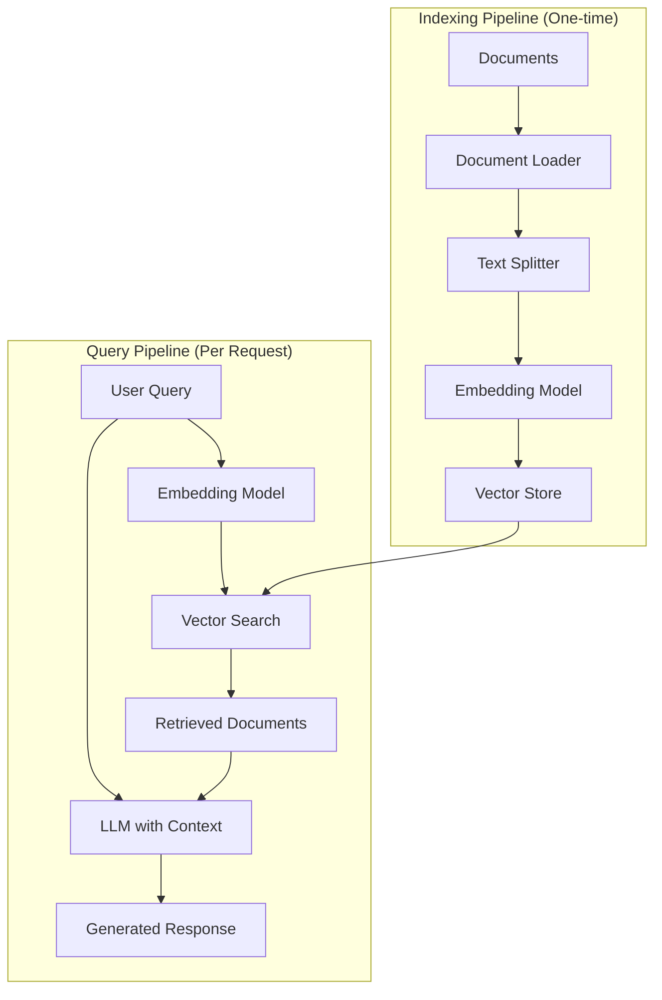
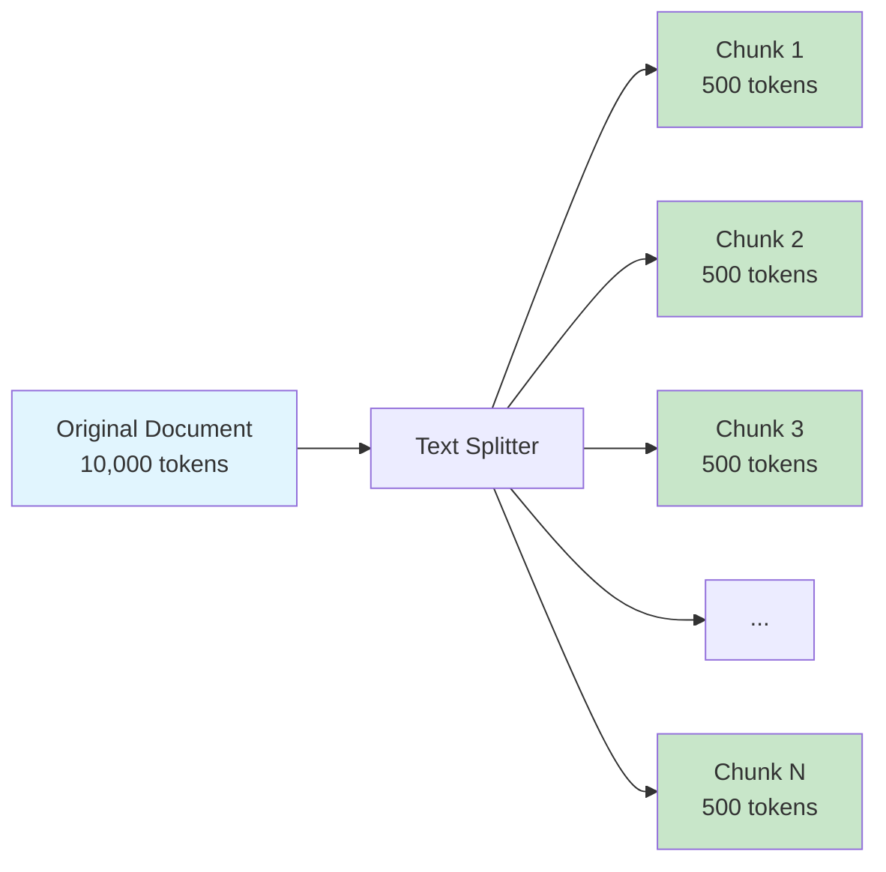
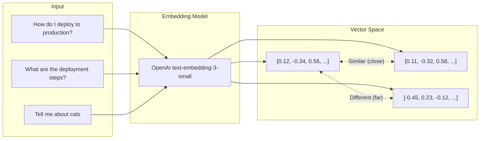
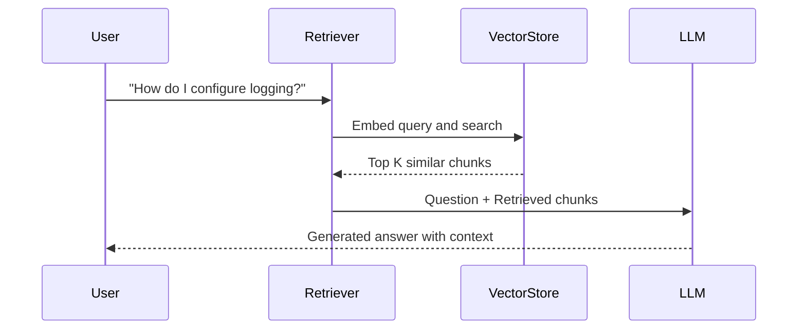
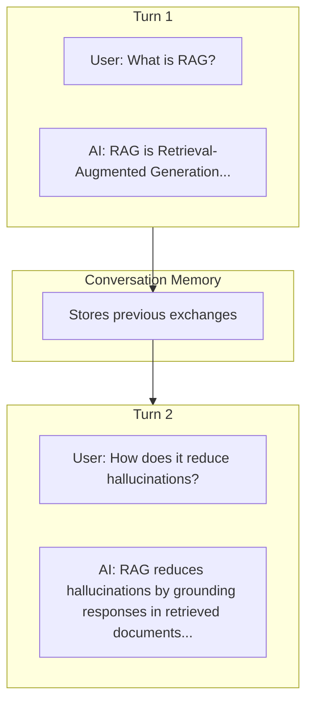

# How to Build RAG Applications with LangChain

Author: [nawazdhandala](https://www.github.com/nawazdhandala)

Tags: LangChain, RAG, LLM, Vector Database, AI

Description: Learn how to build Retrieval-Augmented Generation applications with LangChain, including document loading, embeddings, vector stores, and retrieval chains.

---

Retrieval-Augmented Generation (RAG) combines the power of large language models with external knowledge bases. Instead of relying solely on what the model learned during training, RAG systems fetch relevant documents at query time and use them as context for generating responses. This approach reduces hallucinations, keeps answers grounded in your actual data, and lets you work with information the model has never seen before.

LangChain provides a complete toolkit for building RAG applications. In this guide, we will walk through every component you need: loading documents, creating embeddings, storing vectors, and building retrieval chains that actually work.

---

## RAG Architecture Overview

Before diving into code, let's understand how the pieces fit together:



The indexing pipeline runs once when you load your documents. The query pipeline runs every time a user asks a question. Understanding this separation helps you optimize each part independently.

---

## Setting Up Your Environment

First, install the required packages:

```bash
# Core LangChain packages
pip install langchain langchain-openai langchain-community

# Vector store (we'll use Chroma for local development)
pip install chromadb

# Document loaders for various file types
pip install pypdf unstructured
```

Set up your API keys:

```python
import os

# Set your OpenAI API key
os.environ["OPENAI_API_KEY"] = "your-api-key-here"
```

---

## Step 1: Loading Documents

LangChain provides loaders for dozens of document formats. Here are the most common ones:

### Loading PDF Files

```python
from langchain_community.document_loaders import PyPDFLoader

# Load a single PDF file
# The loader extracts text from each page and creates a Document object per page
loader = PyPDFLoader("technical_manual.pdf")
documents = loader.load()

# Each document has page_content (the text) and metadata (page number, source, etc.)
print(f"Loaded {len(documents)} pages")
print(f"First page content preview: {documents[0].page_content[:200]}")
print(f"Metadata: {documents[0].metadata}")
```

### Loading Text Files from a Directory

```python
from langchain_community.document_loaders import DirectoryLoader, TextLoader

# Load all .txt files from a directory
# glob pattern controls which files to include
loader = DirectoryLoader(
    path="./docs",
    glob="**/*.txt",           # Recursive search for .txt files
    loader_cls=TextLoader,     # Use TextLoader for each file
    show_progress=True         # Display progress bar for large directories
)
documents = loader.load()
```

### Loading Web Pages

```python
from langchain_community.document_loaders import WebBaseLoader

# Load content from web pages
# Useful for documentation sites, wikis, or any public web content
urls = [
    "https://docs.example.com/getting-started",
    "https://docs.example.com/api-reference"
]
loader = WebBaseLoader(urls)
documents = loader.load()
```

### Loading Markdown Files (Common for Documentation)

```python
from langchain_community.document_loaders import UnstructuredMarkdownLoader

# Load markdown with structure preservation
# Useful for README files, documentation, wikis
loader = UnstructuredMarkdownLoader("README.md")
documents = loader.load()
```

---

## Step 2: Splitting Documents into Chunks

Raw documents are usually too large to fit in an LLM's context window. We need to split them into smaller, meaningful chunks. The key is finding the right balance: chunks should be small enough to be specific but large enough to contain complete thoughts.



### Recursive Character Text Splitter (Recommended Default)

```python
from langchain.text_splitter import RecursiveCharacterTextSplitter

# This splitter tries to keep paragraphs, sentences, and words together
# It recursively splits on different separators: \n\n, \n, " ", ""
splitter = RecursiveCharacterTextSplitter(
    chunk_size=1000,        # Maximum characters per chunk
    chunk_overlap=200,      # Characters to overlap between chunks (preserves context)
    length_function=len,    # Function to measure chunk size
    separators=["\n\n", "\n", " ", ""]  # Split hierarchy
)

# Split all loaded documents
chunks = splitter.split_documents(documents)
print(f"Split {len(documents)} documents into {len(chunks)} chunks")

# Inspect a chunk
print(f"Chunk content: {chunks[0].page_content}")
print(f"Chunk length: {len(chunks[0].page_content)} characters")
```

### Token-Based Splitting (For Precise Context Control)

```python
from langchain.text_splitter import TokenTextSplitter

# Split based on actual tokens (more accurate for LLM context windows)
# Useful when you need precise control over context size
splitter = TokenTextSplitter(
    chunk_size=500,         # Maximum tokens per chunk
    chunk_overlap=50,       # Token overlap between chunks
    encoding_name="cl100k_base"  # OpenAI's tokenizer
)

chunks = splitter.split_documents(documents)
```

### Code-Aware Splitting

```python
from langchain.text_splitter import Language, RecursiveCharacterTextSplitter

# For code files, use language-aware splitting
# This respects function boundaries, class definitions, etc.
python_splitter = RecursiveCharacterTextSplitter.from_language(
    language=Language.PYTHON,
    chunk_size=2000,
    chunk_overlap=200
)

# Works for Python, JavaScript, TypeScript, Go, Rust, and many more
js_splitter = RecursiveCharacterTextSplitter.from_language(
    language=Language.JS,
    chunk_size=2000,
    chunk_overlap=200
)
```

---

## Step 3: Creating Embeddings

Embeddings convert text into numerical vectors that capture semantic meaning. Similar texts produce similar vectors. This is what makes semantic search possible.



### Using OpenAI Embeddings

```python
from langchain_openai import OpenAIEmbeddings

# OpenAI's latest embedding model
# Produces 1536-dimensional vectors by default
embeddings = OpenAIEmbeddings(
    model="text-embedding-3-small",  # Smaller, faster, cheaper
    # model="text-embedding-3-large",  # Higher quality, more expensive
)

# Test embedding a single text
sample_text = "How do I deploy my application?"
vector = embeddings.embed_query(sample_text)
print(f"Vector dimension: {len(vector)}")
print(f"First 5 values: {vector[:5]}")

# Embed multiple texts at once (more efficient)
texts = ["First document", "Second document", "Third document"]
vectors = embeddings.embed_documents(texts)
```

### Using Local Embeddings (No API Required)

```python
from langchain_community.embeddings import HuggingFaceEmbeddings

# Run embeddings locally using HuggingFace models
# No API key needed, runs on your machine
embeddings = HuggingFaceEmbeddings(
    model_name="sentence-transformers/all-MiniLM-L6-v2",  # Fast and lightweight
    model_kwargs={"device": "cpu"},  # Use "cuda" for GPU
    encode_kwargs={"normalize_embeddings": True}  # L2 normalize for cosine similarity
)

# Same interface as OpenAI embeddings
vector = embeddings.embed_query("How do I deploy my application?")
```

---

## Step 4: Storing Vectors in a Vector Database

Vector databases are optimized for storing embeddings and performing similarity searches. They use specialized indexing algorithms (like HNSW or IVF) to find similar vectors quickly, even with millions of documents.

### Using Chroma (Great for Development)

```python
from langchain_community.vectorstores import Chroma
from langchain_openai import OpenAIEmbeddings

embeddings = OpenAIEmbeddings(model="text-embedding-3-small")

# Create a vector store from documents
# This embeds all chunks and stores them in Chroma
vectorstore = Chroma.from_documents(
    documents=chunks,           # Your split documents
    embedding=embeddings,       # Embedding model to use
    persist_directory="./chroma_db",  # Where to save the database
    collection_name="my_docs"   # Name for this collection
)

# The database is automatically persisted
print(f"Stored {vectorstore._collection.count()} vectors")
```

### Loading an Existing Vector Store

```python
# Load a previously created vector store
vectorstore = Chroma(
    persist_directory="./chroma_db",
    embedding_function=embeddings,
    collection_name="my_docs"
)
```

### Using FAISS (Facebook AI Similarity Search)

```python
from langchain_community.vectorstores import FAISS

# FAISS is faster for large datasets
# Great for production when you need speed
vectorstore = FAISS.from_documents(
    documents=chunks,
    embedding=embeddings
)

# Save to disk
vectorstore.save_local("./faiss_index")

# Load from disk
vectorstore = FAISS.load_local(
    "./faiss_index",
    embeddings,
    allow_dangerous_deserialization=True  # Required for loading
)
```

### Using Pinecone (Production-Grade Cloud Vector DB)

```python
from langchain_pinecone import PineconeVectorStore
import os

os.environ["PINECONE_API_KEY"] = "your-pinecone-api-key"

# Create index in Pinecone first via their dashboard or API
# Then connect and store documents
vectorstore = PineconeVectorStore.from_documents(
    documents=chunks,
    embedding=embeddings,
    index_name="my-rag-index"
)
```

---

## Step 5: Building the Retrieval Chain

Now we connect everything together. The retrieval chain takes a user question, finds relevant documents, and generates an answer using the LLM.



### Basic RAG Chain

```python
from langchain_openai import ChatOpenAI
from langchain.chains import RetrievalQA

# Initialize the LLM
llm = ChatOpenAI(
    model="gpt-4o",          # Use gpt-3.5-turbo for faster/cheaper responses
    temperature=0            # Lower temperature for more factual answers
)

# Create a retriever from the vector store
# k=4 means retrieve the 4 most similar chunks
retriever = vectorstore.as_retriever(
    search_type="similarity",    # Could also use "mmr" for diversity
    search_kwargs={"k": 4}
)

# Build the QA chain
qa_chain = RetrievalQA.from_chain_type(
    llm=llm,
    chain_type="stuff",          # Stuff all docs into one prompt
    retriever=retriever,
    return_source_documents=True  # Include source docs in response
)

# Ask a question
response = qa_chain.invoke({"query": "How do I configure logging?"})
print("Answer:", response["result"])
print("Sources:", [doc.metadata for doc in response["source_documents"]])
```

### Using LCEL (LangChain Expression Language) for More Control

```python
from langchain_openai import ChatOpenAI
from langchain_core.prompts import ChatPromptTemplate
from langchain_core.runnables import RunnablePassthrough
from langchain_core.output_parsers import StrOutputParser

# Custom prompt template
# This gives you full control over how context is presented to the LLM
prompt = ChatPromptTemplate.from_template("""
Answer the question based only on the following context. If you cannot
find the answer in the context, say "I don't have enough information
to answer this question."

Context:
{context}

Question: {question}

Answer:
""")

# Format documents into a string
def format_docs(docs):
    return "\n\n---\n\n".join(doc.page_content for doc in docs)

# Build the chain using LCEL pipe syntax
# This is more flexible and composable than the older chain APIs
rag_chain = (
    {
        "context": retriever | format_docs,  # Retrieve and format docs
        "question": RunnablePassthrough()     # Pass question through unchanged
    }
    | prompt                                  # Fill in the prompt template
    | llm                                     # Generate response
    | StrOutputParser()                       # Extract string from response
)

# Use the chain
answer = rag_chain.invoke("How do I configure logging?")
print(answer)
```

### Streaming Responses

```python
# Stream the response token by token
# Great for chat interfaces where you want immediate feedback
for chunk in rag_chain.stream("How do I configure logging?"):
    print(chunk, end="", flush=True)
```

---

## Step 6: Advanced Retrieval Strategies

Basic similarity search works well, but there are better strategies for different use cases.

### Maximum Marginal Relevance (MMR)

MMR balances relevance with diversity. It avoids returning multiple chunks that say the same thing.

```python
# MMR retriever - reduces redundancy in retrieved documents
retriever = vectorstore.as_retriever(
    search_type="mmr",
    search_kwargs={
        "k": 4,                    # Number of documents to return
        "fetch_k": 20,             # Number of documents to fetch before filtering
        "lambda_mult": 0.5         # 0 = max diversity, 1 = max relevance
    }
)
```

### Similarity Score Threshold

Only return documents above a certain similarity score.

```python
# Only return documents with similarity above threshold
retriever = vectorstore.as_retriever(
    search_type="similarity_score_threshold",
    search_kwargs={
        "score_threshold": 0.7,   # Minimum similarity score (0-1)
        "k": 10                   # Maximum documents to return
    }
)
```

### Self-Query Retriever (For Structured Metadata Filtering)

```python
from langchain.retrievers.self_query.base import SelfQueryRetriever
from langchain.chains.query_constructor.base import AttributeInfo

# Define metadata fields that can be filtered
metadata_field_info = [
    AttributeInfo(
        name="category",
        description="The category of the document (e.g., 'tutorial', 'api', 'guide')",
        type="string"
    ),
    AttributeInfo(
        name="date",
        description="The date the document was created",
        type="string"
    ),
]

# The retriever will automatically extract filters from natural language
# "Show me tutorials from 2024" -> category="tutorial" AND date contains "2024"
self_query_retriever = SelfQueryRetriever.from_llm(
    llm=llm,
    vectorstore=vectorstore,
    document_contents="Technical documentation",
    metadata_field_info=metadata_field_info
)
```

### Ensemble Retriever (Combine Multiple Strategies)

```python
from langchain.retrievers import EnsembleRetriever
from langchain_community.retrievers import BM25Retriever

# BM25 is keyword-based (good for exact matches)
bm25_retriever = BM25Retriever.from_documents(chunks)
bm25_retriever.k = 4

# Vector retriever is semantic (good for meaning)
vector_retriever = vectorstore.as_retriever(search_kwargs={"k": 4})

# Combine both - gets the best of keyword and semantic search
ensemble_retriever = EnsembleRetriever(
    retrievers=[bm25_retriever, vector_retriever],
    weights=[0.4, 0.6]  # Weight semantic search slightly higher
)
```

---

## Step 7: Adding Conversation Memory

For chat applications, you need to remember previous messages to handle follow-up questions.



```python
from langchain.chains import ConversationalRetrievalChain
from langchain.memory import ConversationBufferMemory

# Memory stores the conversation history
memory = ConversationBufferMemory(
    memory_key="chat_history",
    return_messages=True,
    output_key="answer"
)

# Conversational chain handles follow-up questions
# It reformulates questions based on chat history before searching
conversational_chain = ConversationalRetrievalChain.from_llm(
    llm=llm,
    retriever=retriever,
    memory=memory,
    return_source_documents=True,
    verbose=True  # See the reformulated questions
)

# First question
response1 = conversational_chain.invoke({"question": "What is RAG?"})
print("Answer:", response1["answer"])

# Follow-up question - "it" refers to RAG from the previous question
response2 = conversational_chain.invoke({"question": "How does it reduce hallucinations?"})
print("Answer:", response2["answer"])
```

---

## Complete Working Example

Here is everything combined into a working RAG application:

```python
"""
Complete RAG Application with LangChain
This script demonstrates a full RAG pipeline from document loading to question answering.
"""

import os
from langchain_community.document_loaders import DirectoryLoader, TextLoader
from langchain.text_splitter import RecursiveCharacterTextSplitter
from langchain_openai import OpenAIEmbeddings, ChatOpenAI
from langchain_community.vectorstores import Chroma
from langchain_core.prompts import ChatPromptTemplate
from langchain_core.runnables import RunnablePassthrough
from langchain_core.output_parsers import StrOutputParser

# Configuration
DOCS_DIR = "./documents"
CHROMA_DIR = "./chroma_db"
COLLECTION_NAME = "my_knowledge_base"

def load_and_split_documents(docs_dir: str) -> list:
    """Load documents from directory and split into chunks."""

    # Load all text files from the directory
    loader = DirectoryLoader(
        path=docs_dir,
        glob="**/*.txt",
        loader_cls=TextLoader,
        show_progress=True
    )
    documents = loader.load()
    print(f"Loaded {len(documents)} documents")

    # Split into chunks with overlap for context preservation
    splitter = RecursiveCharacterTextSplitter(
        chunk_size=1000,
        chunk_overlap=200,
        length_function=len
    )
    chunks = splitter.split_documents(documents)
    print(f"Split into {len(chunks)} chunks")

    return chunks


def create_vectorstore(chunks: list, persist_dir: str) -> Chroma:
    """Create and persist a vector store from document chunks."""

    embeddings = OpenAIEmbeddings(model="text-embedding-3-small")

    vectorstore = Chroma.from_documents(
        documents=chunks,
        embedding=embeddings,
        persist_directory=persist_dir,
        collection_name=COLLECTION_NAME
    )
    print(f"Created vector store with {vectorstore._collection.count()} vectors")

    return vectorstore


def load_vectorstore(persist_dir: str) -> Chroma:
    """Load an existing vector store."""

    embeddings = OpenAIEmbeddings(model="text-embedding-3-small")

    vectorstore = Chroma(
        persist_directory=persist_dir,
        embedding_function=embeddings,
        collection_name=COLLECTION_NAME
    )
    print(f"Loaded vector store with {vectorstore._collection.count()} vectors")

    return vectorstore


def create_rag_chain(vectorstore: Chroma):
    """Build the RAG chain with custom prompt."""

    # Custom prompt that instructs the model to use only the provided context
    prompt = ChatPromptTemplate.from_template("""
You are a helpful assistant that answers questions based on the provided context.
Use only the information from the context to answer. If the context does not
contain enough information to answer the question, say so clearly.

Context:
{context}

Question: {question}

Answer:
""")

    # Initialize the LLM
    llm = ChatOpenAI(model="gpt-4o", temperature=0)

    # Create retriever with MMR for diverse results
    retriever = vectorstore.as_retriever(
        search_type="mmr",
        search_kwargs={"k": 4, "fetch_k": 10}
    )

    # Format retrieved documents
    def format_docs(docs):
        formatted = []
        for i, doc in enumerate(docs, 1):
            source = doc.metadata.get("source", "Unknown")
            formatted.append(f"[Document {i}] (Source: {source})\n{doc.page_content}")
        return "\n\n".join(formatted)

    # Build the chain
    chain = (
        {
            "context": retriever | format_docs,
            "question": RunnablePassthrough()
        }
        | prompt
        | llm
        | StrOutputParser()
    )

    return chain, retriever


def main():
    """Main function to run the RAG application."""

    # Check if vector store exists
    if os.path.exists(CHROMA_DIR):
        print("Loading existing vector store...")
        vectorstore = load_vectorstore(CHROMA_DIR)
    else:
        print("Creating new vector store...")
        chunks = load_and_split_documents(DOCS_DIR)
        vectorstore = create_vectorstore(chunks, CHROMA_DIR)

    # Create the RAG chain
    chain, retriever = create_rag_chain(vectorstore)

    # Interactive question-answering loop
    print("\nRAG Application Ready!")
    print("Type 'quit' to exit, 'sources' to see retrieved documents\n")

    while True:
        question = input("Question: ").strip()

        if question.lower() == "quit":
            break

        if question.lower() == "sources":
            # Show sources for the last question
            if "last_question" in dir():
                docs = retriever.invoke(last_question)
                for i, doc in enumerate(docs, 1):
                    print(f"\n--- Document {i} ---")
                    print(f"Source: {doc.metadata.get('source', 'Unknown')}")
                    print(doc.page_content[:500])
            continue

        if not question:
            continue

        # Get answer
        last_question = question
        print("\nAnswer:", chain.invoke(question))
        print()


if __name__ == "__main__":
    main()
```

---

## Performance Tips

### 1. Batch Your Embeddings

```python
# Instead of embedding one at a time, batch them
# This reduces API calls and improves throughput
texts = [chunk.page_content for chunk in chunks]
embeddings_list = embeddings.embed_documents(texts)  # Single API call
```

### 2. Use Async for Multiple Queries

```python
import asyncio

async def answer_questions(chain, questions):
    """Answer multiple questions concurrently."""
    tasks = [chain.ainvoke(q) for q in questions]
    return await asyncio.gather(*tasks)

# Run multiple queries in parallel
questions = ["What is RAG?", "How do embeddings work?", "What is a vector database?"]
answers = asyncio.run(answer_questions(chain, questions))
```

### 3. Cache Embeddings

```python
from langchain.embeddings import CacheBackedEmbeddings
from langchain.storage import LocalFileStore

# Cache embeddings to avoid re-computing them
store = LocalFileStore("./embedding_cache")
cached_embeddings = CacheBackedEmbeddings.from_bytes_store(
    embeddings,
    store,
    namespace="my_embeddings"
)
```

### 4. Tune Chunk Size Based on Your Data

- **Shorter chunks (200-500 chars)**: Better for Q&A, precise retrieval
- **Longer chunks (1000-2000 chars)**: Better for summarization, more context
- **Code**: Use larger chunks (2000+) to keep functions intact

---

## Common Pitfalls and Solutions

| Problem | Cause | Solution |
|---------|-------|----------|
| Irrelevant results | Chunks too small or too large | Experiment with chunk_size and overlap |
| Missing context | Important info split across chunks | Increase chunk_overlap |
| Slow queries | Large vector store, no index | Use FAISS or Pinecone for production |
| Hallucinations | LLM ignoring context | Strengthen prompt instructions |
| High costs | Too many embeddings/queries | Cache embeddings, reduce k |
| Inconsistent answers | High temperature | Set temperature=0 for factual tasks |

---

## What Next?

Once you have a basic RAG system working, consider these enhancements:

1. **Evaluation**: Use RAGAS or similar frameworks to measure retrieval quality
2. **Reranking**: Add a cross-encoder to rerank retrieved documents
3. **Query Expansion**: Generate multiple query variations to improve recall
4. **Hybrid Search**: Combine keyword and semantic search
5. **Document Hierarchies**: Use parent-child relationships for better context

RAG is not a one-size-fits-all solution. The best approach depends on your specific documents, queries, and requirements. Start simple, measure what matters, and iterate based on real user feedback.

---

**Related Reading:**

- [OpenTelemetry Collector Guide](https://oneuptime.com/blog/post/2025-09-18-what-is-opentelemetry-collector-and-why-use-one/view)
- [Structured Logging with Python and OpenTelemetry](https://oneuptime.com/blog/post/2025-01-06-python-structured-logging-opentelemetry/view)
