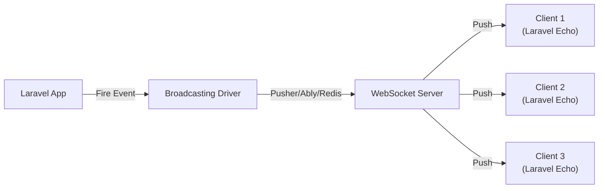

# How to Build Real-Time Features with Laravel Broadcasting

Author: [nawazdhandala](https://www.github.com/nawazdhandala)

Tags: Laravel, Broadcasting, WebSockets, Real-Time, PHP, Pusher, Laravel Echo, Backend Development

Description: Learn how to build real-time features in Laravel applications using Broadcasting. This guide covers events, channels, Pusher integration, Laravel Echo setup, private channels with authentication, and practical examples for notifications and live updates.

---

> Real-time features make applications feel alive. Laravel Broadcasting provides a clean, event-driven approach to sending server-side events to your frontend through WebSockets. Whether you're building chat applications, live notifications, or collaborative tools, Broadcasting is the way to go.

Modern users expect instant feedback. Broadcasting eliminates the need for constant polling and delivers updates the moment they happen.

---

## Overview

Laravel Broadcasting works by broadcasting server-side Laravel events over a WebSocket connection. When something happens in your application (like a new message or order update), you fire an event that gets pushed to connected clients in real time.



The flow is straightforward:
1. Something happens in your Laravel app (database update, user action, etc.)
2. You dispatch a broadcastable event
3. Laravel sends the event to your WebSocket driver (Pusher, Ably, or Redis)
4. Connected clients receive the event through Laravel Echo

---

## Installation and Configuration

### Install Required Packages

First, install the Laravel Broadcasting dependencies. If you're using Pusher as your driver:

```bash
# Install Pusher PHP SDK for server-side broadcasting
composer require pusher/pusher-php-server

# Install Laravel Echo and Pusher JS for the frontend
npm install --save laravel-echo pusher-js
```

### Configure Broadcasting Driver

Update your `.env` file with your Pusher credentials:

```env
BROADCAST_DRIVER=pusher

PUSHER_APP_ID=your-app-id
PUSHER_APP_KEY=your-app-key
PUSHER_APP_SECRET=your-app-secret
PUSHER_APP_CLUSTER=mt1
```

Laravel's broadcasting configuration lives in `config/broadcasting.php`. The default configuration works well for most setups, but here's what matters:

```php
// config/broadcasting.php
return [
    'default' => env('BROADCAST_DRIVER', 'null'),

    'connections' => [
        'pusher' => [
            'driver' => 'pusher',
            'key' => env('PUSHER_APP_KEY'),
            'secret' => env('PUSHER_APP_SECRET'),
            'app_id' => env('PUSHER_APP_ID'),
            'options' => [
                'cluster' => env('PUSHER_APP_CLUSTER'),
                'useTLS' => true,
                // For local development with Laravel Websockets package
                // 'host' => '127.0.0.1',
                // 'port' => 6001,
                // 'scheme' => 'http',
            ],
        ],
    ],
];
```

### Enable Broadcasting Service Provider

Make sure the `BroadcastServiceProvider` is registered in `config/app.php`:

```php
// config/app.php
'providers' => [
    // Other providers...
    App\Providers\BroadcastServiceProvider::class,
],
```

---

## Creating Broadcast Events

Broadcast events are regular Laravel events that implement the `ShouldBroadcast` interface. Let's create a simple notification event:

```bash
php artisan make:event OrderStatusUpdated
```

```php
<?php
// app/Events/OrderStatusUpdated.php

namespace App\Events;

use App\Models\Order;
use Illuminate\Broadcasting\Channel;
use Illuminate\Broadcasting\InteractsWithSockets;
use Illuminate\Broadcasting\PresenceChannel;
use Illuminate\Broadcasting\PrivateChannel;
use Illuminate\Contracts\Broadcasting\ShouldBroadcast;
use Illuminate\Foundation\Events\Dispatchable;
use Illuminate\Queue\SerializesModels;

class OrderStatusUpdated implements ShouldBroadcast
{
    use Dispatchable, InteractsWithSockets, SerializesModels;

    // Public properties are automatically serialized and sent to clients
    public Order $order;
    public string $previousStatus;

    public function __construct(Order $order, string $previousStatus)
    {
        $this->order = $order;
        $this->previousStatus = $previousStatus;
    }

    /**
     * Define which channels this event broadcasts on.
     * Using PrivateChannel ensures only authenticated users can listen.
     */
    public function broadcastOn(): array
    {
        return [
            // Broadcast to a private channel specific to this user
            new PrivateChannel('orders.' . $this->order->user_id),
        ];
    }

    /**
     * Customize the event name sent to the client.
     * By default, it uses the class name.
     */
    public function broadcastAs(): string
    {
        return 'order.status.updated';
    }

    /**
     * Control what data gets sent to the client.
     * Only include what the frontend needs.
     */
    public function broadcastWith(): array
    {
        return [
            'order_id' => $this->order->id,
            'order_number' => $this->order->order_number,
            'status' => $this->order->status,
            'previous_status' => $this->previousStatus,
            'updated_at' => $this->order->updated_at->toISOString(),
        ];
    }
}
```

Now dispatch the event when an order status changes:

```php
<?php
// app/Services/OrderService.php

namespace App\Services;

use App\Events\OrderStatusUpdated;
use App\Models\Order;

class OrderService
{
    public function updateStatus(Order $order, string $newStatus): Order
    {
        $previousStatus = $order->status;

        $order->update(['status' => $newStatus]);

        // Broadcast the event to all connected clients on the user's channel
        event(new OrderStatusUpdated($order, $previousStatus));

        return $order;
    }
}
```

---

## Channel Types and Authorization

Laravel Broadcasting supports three types of channels, each with different use cases.

### Public Channels

Anyone can listen to public channels without authentication:

```php
// In your event class
public function broadcastOn(): array
{
    return [
        new Channel('updates'),  // Public channel - anyone can subscribe
    ];
}
```

### Private Channels

Private channels require authentication. Define authorization logic in `routes/channels.php`:

```php
<?php
// routes/channels.php

use App\Models\Order;
use App\Models\User;
use Illuminate\Support\Facades\Broadcast;

// Users can only listen to their own order channel
Broadcast::channel('orders.{userId}', function (User $user, int $userId) {
    return $user->id === $userId;
});

// Team members can listen to team channels
Broadcast::channel('team.{teamId}', function (User $user, int $teamId) {
    return $user->teams()->where('id', $teamId)->exists();
});

// More complex authorization with model binding
Broadcast::channel('order.{order}', function (User $user, Order $order) {
    return $user->id === $order->user_id || $user->isAdmin();
});
```

### Presence Channels

Presence channels are private channels that also track who is subscribed. Perfect for showing who's online or building collaborative features:

```php
<?php
// app/Events/UserJoinedDocument.php

namespace App\Events;

use App\Models\Document;
use Illuminate\Broadcasting\PresenceChannel;
use Illuminate\Contracts\Broadcasting\ShouldBroadcast;

class UserJoinedDocument implements ShouldBroadcast
{
    public function __construct(public Document $document)
    {
    }

    public function broadcastOn(): array
    {
        // Presence channels track all subscribed users
        return [
            new PresenceChannel('document.' . $this->document->id),
        ];
    }
}
```

```php
<?php
// routes/channels.php

// Presence channel authorization returns user data shown to other subscribers
Broadcast::channel('document.{documentId}', function (User $user, int $documentId) {
    // Check if user has access to this document
    $document = Document::find($documentId);

    if ($document && $user->canAccess($document)) {
        // Return user data that will be visible to other users in the channel
        return [
            'id' => $user->id,
            'name' => $user->name,
            'avatar' => $user->avatar_url,
        ];
    }

    return false;  // Deny access
});
```

---

## Setting Up Laravel Echo on the Frontend

Laravel Echo is the JavaScript library that connects to your WebSocket server and handles subscriptions.

### Configure Echo

```javascript
// resources/js/bootstrap.js

import Echo from 'laravel-echo';
import Pusher from 'pusher-js';

// Make Pusher available globally (required by Echo)
window.Pusher = Pusher;

// Initialize Laravel Echo with your Pusher configuration
window.Echo = new Echo({
    broadcaster: 'pusher',
    key: import.meta.env.VITE_PUSHER_APP_KEY,
    cluster: import.meta.env.VITE_PUSHER_APP_CLUSTER,
    forceTLS: true,

    // Enable this for debugging connection issues
    // enabledTransports: ['ws', 'wss'],
});
```

### Listen to Public Channels

```javascript
// Subscribe to a public channel and listen for events
Echo.channel('updates')
    .listen('NewAnnouncement', (event) => {
        console.log('New announcement:', event.message);
        showNotification(event.title, event.message);
    });
```

### Listen to Private Channels

```javascript
// Subscribe to a private channel (requires authentication)
// The user must be logged in and authorized to access this channel
Echo.private(`orders.${userId}`)
    .listen('.order.status.updated', (event) => {
        // Note: prefix with '.' when using broadcastAs() custom names
        console.log('Order updated:', event);

        updateOrderStatus(event.order_id, event.status);
        showToast(`Order ${event.order_number} is now ${event.status}`);
    });
```

### Working with Presence Channels

```javascript
// Join a presence channel to track who's online
const channel = Echo.join(`document.${documentId}`);

channel
    .here((users) => {
        // Called once when you first join with all current users
        console.log('Users currently viewing:', users);
        updateOnlineUsers(users);
    })
    .joining((user) => {
        // Called when a new user joins the channel
        console.log(`${user.name} started viewing`);
        addOnlineUser(user);
    })
    .leaving((user) => {
        // Called when a user leaves the channel
        console.log(`${user.name} stopped viewing`);
        removeOnlineUser(user);
    })
    .listen('DocumentUpdated', (event) => {
        // Listen for broadcast events on this channel
        refreshDocument(event.document);
    });
```

---

## Practical Example: Live Notifications System

Let's build a complete live notifications system. This is one of the most common real-time features.

### The Notification Event

```php
<?php
// app/Events/NotificationSent.php

namespace App\Events;

use App\Models\User;
use Illuminate\Broadcasting\PrivateChannel;
use Illuminate\Contracts\Broadcasting\ShouldBroadcast;
use Illuminate\Notifications\Notification;

class NotificationSent implements ShouldBroadcast
{
    public string $id;
    public string $type;
    public array $data;
    public string $createdAt;

    public function __construct(
        public User $user,
        Notification $notification,
        array $data
    ) {
        $this->id = uniqid('notif_');
        $this->type = class_basename($notification);
        $this->data = $data;
        $this->createdAt = now()->toISOString();
    }

    public function broadcastOn(): array
    {
        return [
            new PrivateChannel('notifications.' . $this->user->id),
        ];
    }

    public function broadcastAs(): string
    {
        return 'notification.received';
    }

    public function broadcastWith(): array
    {
        return [
            'id' => $this->id,
            'type' => $this->type,
            'data' => $this->data,
            'created_at' => $this->createdAt,
        ];
    }
}
```

### Channel Authorization

```php
<?php
// routes/channels.php

Broadcast::channel('notifications.{userId}', function ($user, $userId) {
    // Users can only access their own notification channel
    return (int) $user->id === (int) $userId;
});
```

### Vue.js Notification Component

```vue
<!-- resources/js/components/NotificationBell.vue -->
<template>
    <div class="notification-bell">
        <button @click="toggleDropdown" class="bell-button">
            <svg class="bell-icon" viewBox="0 0 24 24">
                <path d="M12 22c1.1 0 2-.9 2-2h-4c0 1.1.9 2 2 2zm6-6v-5c0-3.07-1.63-5.64-4.5-6.32V4c0-.83-.67-1.5-1.5-1.5s-1.5.67-1.5 1.5v.68C7.64 5.36 6 7.92 6 11v5l-2 2v1h16v-1l-2-2z"/>
            </svg>
            <span v-if="unreadCount > 0" class="badge">
                {{ unreadCount > 99 ? '99+' : unreadCount }}
            </span>
        </button>

        <div v-if="showDropdown" class="dropdown">
            <div class="dropdown-header">
                <h3>Notifications</h3>
                <button @click="markAllRead">Mark all read</button>
            </div>

            <div v-if="notifications.length === 0" class="empty">
                No notifications yet
            </div>

            <ul v-else class="notification-list">
                <li
                    v-for="notification in notifications"
                    :key="notification.id"
                    :class="{ unread: !notification.read }"
                    @click="handleClick(notification)"
                >
                    <div class="content">
                        <p class="message">{{ notification.data.message }}</p>
                        <span class="time">{{ formatTime(notification.created_at) }}</span>
                    </div>
                </li>
            </ul>
        </div>
    </div>
</template>

<script>
export default {
    props: {
        userId: {
            type: Number,
            required: true
        }
    },

    data() {
        return {
            notifications: [],
            showDropdown: false,
        };
    },

    computed: {
        unreadCount() {
            return this.notifications.filter(n => !n.read).length;
        }
    },

    mounted() {
        // Load existing notifications from API
        this.fetchNotifications();

        // Subscribe to real-time notifications via Laravel Echo
        Echo.private(`notifications.${this.userId}`)
            .listen('.notification.received', (event) => {
                // Add new notification to the beginning of the list
                this.notifications.unshift({
                    ...event,
                    read: false,
                });

                // Show browser notification if permitted
                this.showBrowserNotification(event);
            });
    },

    beforeUnmount() {
        // Clean up subscription when component is destroyed
        Echo.leave(`notifications.${this.userId}`);
    },

    methods: {
        async fetchNotifications() {
            const response = await fetch('/api/notifications');
            this.notifications = await response.json();
        },

        toggleDropdown() {
            this.showDropdown = !this.showDropdown;
        },

        handleClick(notification) {
            notification.read = true;
            // Navigate or perform action based on notification type
            if (notification.data.url) {
                window.location.href = notification.data.url;
            }
        },

        markAllRead() {
            this.notifications.forEach(n => n.read = true);
            fetch('/api/notifications/mark-all-read', { method: 'POST' });
        },

        showBrowserNotification(event) {
            if (Notification.permission === 'granted') {
                new Notification(event.data.title || 'New Notification', {
                    body: event.data.message,
                    icon: '/notification-icon.png',
                });
            }
        },

        formatTime(timestamp) {
            const date = new Date(timestamp);
            const now = new Date();
            const diff = now - date;

            if (diff < 60000) return 'Just now';
            if (diff < 3600000) return `${Math.floor(diff / 60000)}m ago`;
            if (diff < 86400000) return `${Math.floor(diff / 3600000)}h ago`;
            return date.toLocaleDateString();
        }
    }
};
</script>
```

---

## Using Queues for Better Performance

By default, broadcasts happen synchronously. For better performance, implement `ShouldBroadcastNow` for immediate broadcasts or use queues:

```php
<?php
// app/Events/OrderStatusUpdated.php

namespace App\Events;

use Illuminate\Contracts\Broadcasting\ShouldBroadcast;
use Illuminate\Foundation\Events\Dispatchable;
use Illuminate\Queue\SerializesModels;

class OrderStatusUpdated implements ShouldBroadcast
{
    use Dispatchable, SerializesModels;

    // Specify which queue connection and queue name to use
    public $connection = 'redis';
    public $queue = 'broadcasts';

    // Or use ShouldBroadcastNow for immediate, synchronous broadcasting
    // class OrderStatusUpdated implements ShouldBroadcastNow

    public function __construct(public Order $order)
    {
    }

    // Rest of the event...
}
```

Make sure your queue worker is running:

```bash
php artisan queue:work redis --queue=broadcasts
```

---

## Self-Hosted Alternative: Laravel Websockets

If you prefer not to use a third-party service like Pusher, you can run your own WebSocket server with the Laravel Websockets package:

```bash
composer require beyondcode/laravel-websockets
php artisan vendor:publish --provider="BeyondCode\LaravelWebSockets\WebSocketsServiceProvider" --tag="migrations"
php artisan migrate
php artisan vendor:publish --provider="BeyondCode\LaravelWebSockets\WebSocketsServiceProvider" --tag="config"
```

Update your broadcasting configuration:

```php
// config/broadcasting.php
'pusher' => [
    'driver' => 'pusher',
    'key' => env('PUSHER_APP_KEY'),
    'secret' => env('PUSHER_APP_SECRET'),
    'app_id' => env('PUSHER_APP_ID'),
    'options' => [
        'host' => '127.0.0.1',
        'port' => 6001,
        'scheme' => 'http',
        'encrypted' => false,
    ],
],
```

Start the WebSocket server:

```bash
php artisan websockets:serve
```

---

## Debugging Tips

### Enable Pusher Logging

```javascript
// In your Echo configuration
window.Echo = new Echo({
    broadcaster: 'pusher',
    key: import.meta.env.VITE_PUSHER_APP_KEY,
    cluster: import.meta.env.VITE_PUSHER_APP_CLUSTER,
    forceTLS: true,

    // Enable logging for debugging
    enableLogging: true,
});

// Or enable Pusher's internal logging
Pusher.logToConsole = true;
```

### Test Broadcasting from Tinker

```bash
php artisan tinker
```

```php
>>> event(new App\Events\OrderStatusUpdated(App\Models\Order::first(), 'pending'));
```

### Check Channel Authorization

If private channels aren't working, verify:
1. The `BroadcastServiceProvider` is registered
2. Your `routes/channels.php` authorization logic is correct
3. The CSRF token is included in your requests
4. Your user is authenticated

---

## Summary

Laravel Broadcasting provides an elegant way to add real-time features to your applications. The key concepts to remember:

1. Create events that implement `ShouldBroadcast`
2. Define channel authorization in `routes/channels.php`
3. Use Laravel Echo on the frontend to subscribe to channels
4. Choose the right channel type (public, private, or presence) based on your needs
5. Consider using queues for better performance

Real-time features significantly improve user experience. With Laravel Broadcasting, you can implement them without the complexity of managing WebSocket connections yourself. Start with simple notifications and expand to more complex features like live collaboration as your application grows.
