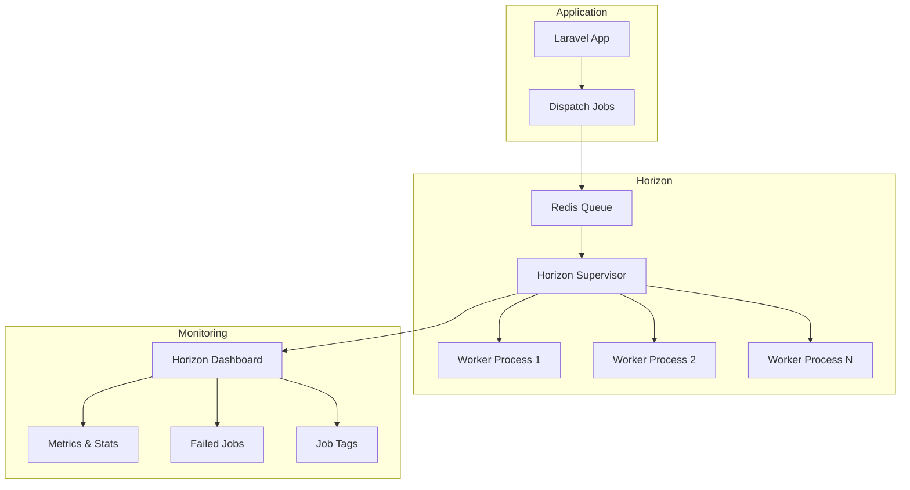
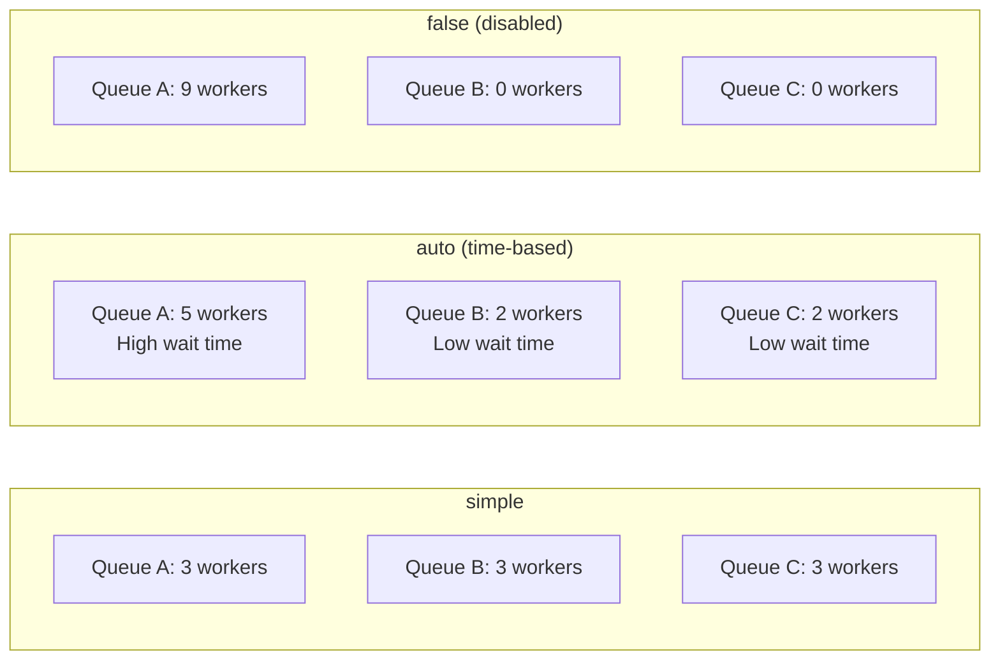
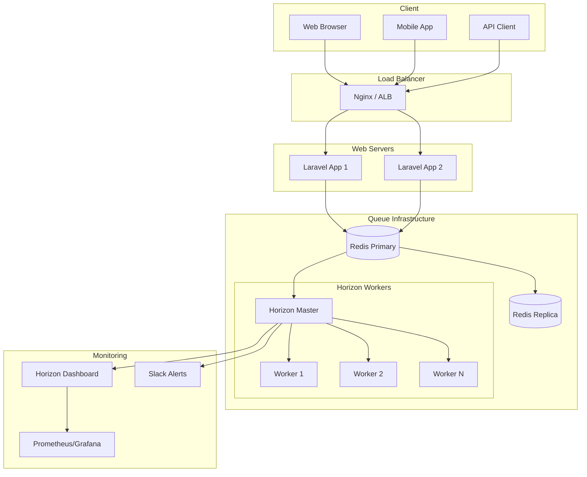

# How to Use Laravel Horizon for Queue Management

Author: [nawazdhandala](https://www.github.com/nawazdhandala)

Tags: Laravel, Horizon, Queue Management, Redis, PHP, Background Jobs, Monitoring

Description: A complete guide to installing, configuring, and using Laravel Horizon for managing and monitoring your Redis queues in production.

---

Laravel Horizon provides a beautiful dashboard and code-driven configuration for your Laravel Redis queues. It allows you to monitor key metrics like job throughput, runtime, and failures, while giving you fine-grained control over your queue workers. In this guide, we will cover everything from installation to production deployment.

## What is Laravel Horizon?

Laravel Horizon is a queue manager for Laravel applications that use Redis as the queue driver. It provides:

- A real-time dashboard for monitoring queue health
- Code-driven configuration for queue workers
- Automatic balancing of queue workers across multiple queues
- Job metrics including throughput, runtime, and failure rates
- Job tagging for better organization and searching
- Notifications for long wait times and failed jobs



## Prerequisites

Before installing Horizon, make sure you have:

- Laravel 9.0 or higher
- PHP 8.0 or higher
- Redis server installed and running
- The `predis/predis` package or the `phpredis` PHP extension

## Installing Laravel Horizon

First, install Horizon via Composer:

```bash
# Install the Horizon package
composer require laravel/horizon
```

After installation, publish the Horizon assets and configuration:

```bash
# Publish Horizon's assets and config file
php artisan horizon:install
```

This command creates:
- `config/horizon.php` - The main configuration file
- `app/Providers/HorizonServiceProvider.php` - Service provider for authorization

## Configuring Redis Connection

Make sure your `.env` file has the correct Redis configuration:

```env
# Redis connection settings for Horizon
QUEUE_CONNECTION=redis
REDIS_HOST=127.0.0.1
REDIS_PASSWORD=null
REDIS_PORT=6379

# Optional: Use a specific Redis database for queues
REDIS_QUEUE_DB=1
```

Update your `config/database.php` to include a dedicated Redis connection for Horizon:

```php
<?php
// config/database.php

return [
    // ... other configuration

    'redis' => [
        'client' => env('REDIS_CLIENT', 'phpredis'),

        // Default connection for caching
        'default' => [
            'host' => env('REDIS_HOST', '127.0.0.1'),
            'password' => env('REDIS_PASSWORD'),
            'port' => env('REDIS_PORT', 6379),
            'database' => env('REDIS_DB', 0),
        ],

        // Dedicated connection for queues
        'queue' => [
            'host' => env('REDIS_HOST', '127.0.0.1'),
            'password' => env('REDIS_PASSWORD'),
            'port' => env('REDIS_PORT', 6379),
            'database' => env('REDIS_QUEUE_DB', 1),
        ],
    ],
];
```

## Understanding Horizon Configuration

The `config/horizon.php` file is where you define your queue workers. Here is a complete example with explanations:

```php
<?php
// config/horizon.php

return [
    /*
    |--------------------------------------------------------------------------
    | Horizon Domain
    |--------------------------------------------------------------------------
    |
    | This is the subdomain where Horizon will be accessible from. If the
    | setting is null, Horizon will reside under the same domain as the
    | application. Otherwise, this value will be used as the subdomain.
    |
    */
    'domain' => env('HORIZON_DOMAIN'),

    /*
    |--------------------------------------------------------------------------
    | Horizon Path
    |--------------------------------------------------------------------------
    |
    | This is the URI path where Horizon will be accessible from. Feel free
    | to change this path to anything you like.
    |
    */
    'path' => env('HORIZON_PATH', 'horizon'),

    /*
    |--------------------------------------------------------------------------
    | Horizon Redis Connection
    |--------------------------------------------------------------------------
    |
    | This is the name of the Redis connection where Horizon will store the
    | meta information required for it to function.
    |
    */
    'use' => 'default',

    /*
    |--------------------------------------------------------------------------
    | Horizon Redis Prefix
    |--------------------------------------------------------------------------
    |
    | This prefix will be used when storing all Horizon data in Redis.
    |
    */
    'prefix' => env('HORIZON_PREFIX', 'horizon:'),

    /*
    |--------------------------------------------------------------------------
    | Horizon Route Middleware
    |--------------------------------------------------------------------------
    |
    | These middleware will get attached onto each Horizon route, giving you
    | the chance to add your own middleware to this list.
    |
    */
    'middleware' => ['web'],

    /*
    |--------------------------------------------------------------------------
    | Queue Wait Time Thresholds
    |--------------------------------------------------------------------------
    |
    | This option allows you to configure when the LongWaitDetected event
    | will be fired. Every connection / queue combination may have its
    | own notification threshold.
    |
    */
    'waits' => [
        'redis:default' => 60,      // Alert if jobs wait more than 60 seconds
        'redis:critical' => 30,     // Critical queue has stricter threshold
    ],

    /*
    |--------------------------------------------------------------------------
    | Job Trimming Times
    |--------------------------------------------------------------------------
    |
    | Here you can configure for how long completed and pending jobs are kept.
    |
    */
    'trim' => [
        'recent' => 60,             // Keep recent jobs for 60 minutes
        'pending' => 60,            // Keep pending jobs for 60 minutes
        'completed' => 60,          // Keep completed jobs for 60 minutes
        'recent_failed' => 10080,   // Keep failed jobs for 7 days (in minutes)
        'failed' => 10080,
        'monitored' => 10080,
    ],

    /*
    |--------------------------------------------------------------------------
    | Silenced Jobs
    |--------------------------------------------------------------------------
    |
    | Jobs listed here will not show up in the Horizon dashboard.
    |
    */
    'silenced' => [
        // App\Jobs\HeartbeatJob::class,
    ],

    /*
    |--------------------------------------------------------------------------
    | Metrics
    |--------------------------------------------------------------------------
    |
    | Here you can configure how long metrics snapshots are stored.
    |
    */
    'metrics' => [
        'trim_snapshots' => [
            'job' => 24,            // Keep job metrics for 24 hours
            'queue' => 24,          // Keep queue metrics for 24 hours
        ],
    ],

    /*
    |--------------------------------------------------------------------------
    | Fast Termination
    |--------------------------------------------------------------------------
    |
    | When set to true, Horizon's "terminate" command will not wait for
    | currently processing jobs to finish. This may cause job loss.
    |
    */
    'fast_termination' => false,

    /*
    |--------------------------------------------------------------------------
    | Memory Limit (MB)
    |--------------------------------------------------------------------------
    |
    | Maximum memory a worker may consume before being restarted.
    |
    */
    'memory_limit' => 64,

    /*
    |--------------------------------------------------------------------------
    | Queue Worker Configuration
    |--------------------------------------------------------------------------
    |
    | Here you can define your queue worker supervisors and their settings.
    |
    */
    'defaults' => [
        // Default supervisor settings that can be inherited
        'supervisor-1' => [
            'connection' => 'redis',
            'queue' => ['default'],
            'balance' => 'auto',
            'autoScalingStrategy' => 'time',
            'maxProcesses' => 10,
            'maxTime' => 0,
            'maxJobs' => 0,
            'memory' => 128,
            'tries' => 3,
            'timeout' => 60,
            'nice' => 0,
        ],
    ],

    'environments' => [
        // Production environment configuration
        'production' => [
            'supervisor-default' => [
                'connection' => 'redis',
                'queue' => ['default', 'emails'],
                'balance' => 'auto',
                'autoScalingStrategy' => 'time',
                'minProcesses' => 1,
                'maxProcesses' => 10,
                'balanceMaxShift' => 1,
                'balanceCooldown' => 3,
                'tries' => 3,
                'timeout' => 90,
                'memory' => 128,
            ],

            'supervisor-critical' => [
                'connection' => 'redis',
                'queue' => ['critical', 'payments'],
                'balance' => 'simple',
                'minProcesses' => 3,
                'maxProcesses' => 10,
                'tries' => 1,
                'timeout' => 30,
                'memory' => 256,
            ],

            'supervisor-long-running' => [
                'connection' => 'redis',
                'queue' => ['reports', 'exports'],
                'balance' => 'auto',
                'minProcesses' => 1,
                'maxProcesses' => 5,
                'tries' => 2,
                'timeout' => 3600,   // 1 hour timeout for long jobs
                'memory' => 512,
            ],
        ],

        // Local development configuration
        'local' => [
            'supervisor-1' => [
                'connection' => 'redis',
                'queue' => ['default', 'emails', 'critical'],
                'balance' => 'auto',
                'minProcesses' => 1,
                'maxProcesses' => 3,
                'tries' => 3,
                'timeout' => 60,
            ],
        ],
    ],
];
```

## Understanding Balance Strategies

Horizon provides three balancing strategies for distributing workers across queues:



### Simple Balance

Distributes workers evenly across all queues:

```php
'supervisor-1' => [
    'balance' => 'simple',
    'minProcesses' => 3,
    'maxProcesses' => 9,
    // With 3 queues, each gets 3 workers
],
```

### Auto Balance

Dynamically adjusts workers based on queue workload:

```php
'supervisor-1' => [
    'balance' => 'auto',
    'autoScalingStrategy' => 'time',  // or 'size'
    'minProcesses' => 1,
    'maxProcesses' => 10,
    'balanceMaxShift' => 1,           // Max workers to add/remove per cycle
    'balanceCooldown' => 3,           // Seconds between balance adjustments
],
```

### No Balance

Workers process queues in order (first queue has priority):

```php
'supervisor-1' => [
    'balance' => false,
    'queue' => ['critical', 'default', 'low'],
    // All workers focus on 'critical' first
],
```

## Creating Jobs for Horizon

Jobs work the same way as regular Laravel jobs. Here is an example with best practices:

```php
<?php
// app/Jobs/ProcessPayment.php

namespace App\Jobs;

use App\Models\Order;
use App\Services\PaymentGateway;
use Illuminate\Bus\Queueable;
use Illuminate\Contracts\Queue\ShouldQueue;
use Illuminate\Foundation\Bus\Dispatchable;
use Illuminate\Queue\InteractsWithQueue;
use Illuminate\Queue\SerializesModels;
use Illuminate\Support\Facades\Log;

class ProcessPayment implements ShouldQueue
{
    use Dispatchable, InteractsWithQueue, Queueable, SerializesModels;

    /**
     * The number of times the job may be attempted.
     * This overrides the supervisor's tries setting.
     */
    public int $tries = 3;

    /**
     * The number of seconds the job can run before timing out.
     */
    public int $timeout = 30;

    /**
     * The maximum number of unhandled exceptions to allow before failing.
     */
    public int $maxExceptions = 2;

    /**
     * Indicate if the job should be marked as failed on timeout.
     */
    public bool $failOnTimeout = true;

    /**
     * The number of seconds to wait before retrying the job.
     */
    public int $backoff = 10;

    /**
     * Create a new job instance.
     */
    public function __construct(
        public Order $order,
        public string $paymentMethod
    ) {
        // Assign this job to the critical queue
        $this->onQueue('critical');
    }

    /**
     * Get the tags that should be assigned to the job.
     * Tags help you search and filter jobs in Horizon.
     *
     * @return array<string>
     */
    public function tags(): array
    {
        return [
            'payment',
            'order:' . $this->order->id,
            'customer:' . $this->order->customer_id,
            'method:' . $this->paymentMethod,
        ];
    }

    /**
     * Execute the job.
     */
    public function handle(PaymentGateway $gateway): void
    {
        Log::info('Processing payment', [
            'order_id' => $this->order->id,
            'amount' => $this->order->total,
        ]);

        // Process the payment through the gateway
        $result = $gateway->charge(
            amount: $this->order->total,
            method: $this->paymentMethod,
            reference: $this->order->reference
        );

        // Update the order status
        $this->order->update([
            'payment_status' => 'completed',
            'transaction_id' => $result->transactionId,
        ]);

        Log::info('Payment processed successfully', [
            'order_id' => $this->order->id,
            'transaction_id' => $result->transactionId,
        ]);
    }

    /**
     * Handle a job failure.
     */
    public function failed(\Throwable $exception): void
    {
        Log::error('Payment processing failed', [
            'order_id' => $this->order->id,
            'error' => $exception->getMessage(),
        ]);

        // Mark order as payment failed
        $this->order->update([
            'payment_status' => 'failed',
            'payment_error' => $exception->getMessage(),
        ]);

        // Notify the customer about the failure
        $this->order->customer->notify(
            new \App\Notifications\PaymentFailed($this->order)
        );
    }

    /**
     * Calculate the number of seconds to wait before retrying.
     * This allows for exponential backoff.
     *
     * @return array<int>
     */
    public function backoff(): array
    {
        // Wait 10s, then 30s, then 60s between retries
        return [10, 30, 60];
    }

    /**
     * Determine the time at which the job should timeout.
     */
    public function retryUntil(): \DateTime
    {
        // Keep retrying for up to 5 minutes
        return now()->addMinutes(5);
    }
}
```

## Dispatching Jobs

Here are different ways to dispatch jobs to Horizon:

```php
<?php
// app/Http/Controllers/OrderController.php

namespace App\Http\Controllers;

use App\Jobs\ProcessPayment;
use App\Jobs\SendOrderConfirmation;
use App\Jobs\GenerateInvoice;
use App\Jobs\NotifyWarehouse;
use App\Models\Order;
use Illuminate\Http\Request;

class OrderController extends Controller
{
    /**
     * Process a new order.
     */
    public function store(Request $request)
    {
        $order = Order::create($request->validated());

        // Dispatch a single job to the critical queue
        ProcessPayment::dispatch($order, $request->payment_method);

        // Dispatch with a delay (process in 5 minutes)
        SendOrderConfirmation::dispatch($order)
            ->delay(now()->addMinutes(5));

        // Dispatch to a specific queue
        GenerateInvoice::dispatch($order)
            ->onQueue('reports');

        // Dispatch multiple jobs as a chain
        // Each job runs after the previous one completes
        \Illuminate\Support\Facades\Bus::chain([
            new ProcessPayment($order, $request->payment_method),
            new SendOrderConfirmation($order),
            new GenerateInvoice($order),
            new NotifyWarehouse($order),
        ])->onQueue('default')->dispatch();

        return response()->json(['order' => $order], 201);
    }

    /**
     * Dispatch a batch of jobs.
     */
    public function processBatch(Request $request)
    {
        $orders = Order::whereIn('id', $request->order_ids)->get();

        // Create a batch of jobs that can run in parallel
        $batch = \Illuminate\Support\Facades\Bus::batch(
            $orders->map(fn ($order) => new ProcessPayment($order, 'card'))
        )
            ->then(function ($batch) {
                // All jobs completed successfully
                Log::info('Batch completed', ['batch_id' => $batch->id]);
            })
            ->catch(function ($batch, $e) {
                // First batch job failure detected
                Log::error('Batch failed', [
                    'batch_id' => $batch->id,
                    'error' => $e->getMessage(),
                ]);
            })
            ->finally(function ($batch) {
                // The batch has finished executing
                Log::info('Batch finished', [
                    'batch_id' => $batch->id,
                    'failed' => $batch->failedJobs,
                ]);
            })
            ->name('Process Order Payments')
            ->onQueue('default')
            ->dispatch();

        return response()->json(['batch_id' => $batch->id]);
    }
}
```

## Securing the Horizon Dashboard

By default, Horizon is only accessible in the local environment. To secure it for production, update the `HorizonServiceProvider`:

```php
<?php
// app/Providers/HorizonServiceProvider.php

namespace App\Providers;

use App\Models\User;
use Illuminate\Support\Facades\Gate;
use Laravel\Horizon\Horizon;
use Laravel\Horizon\HorizonApplicationServiceProvider;

class HorizonServiceProvider extends HorizonApplicationServiceProvider
{
    /**
     * Bootstrap any application services.
     */
    public function boot(): void
    {
        parent::boot();

        // Configure night mode for the dashboard
        // Horizon::night();

        // Configure notification settings
        Horizon::routeSlackNotificationsTo(
            env('HORIZON_SLACK_WEBHOOK'),
            '#queue-alerts'
        );

        // Send email notifications for long wait times
        Horizon::routeMailNotificationsTo('devops@example.com');

        // Send SMS notifications for critical failures
        // Horizon::routeSmsNotificationsTo('1234567890');
    }

    /**
     * Register the Horizon gate.
     *
     * This gate determines who can access Horizon in non-local environments.
     */
    protected function gate(): void
    {
        Gate::define('viewHorizon', function (User $user) {
            // Allow access for admins and developers
            return $user->hasRole('admin') ||
                   $user->hasRole('developer') ||
                   in_array($user->email, [
                       'admin@example.com',
                       'developer@example.com',
                   ]);
        });
    }

    /**
     * Register any application services.
     */
    public function register(): void
    {
        // Register custom tags for jobs
        Horizon::tag(function ($job) {
            // Add environment tag to all jobs
            return ['env:' . app()->environment()];
        });
    }
}
```

## Setting Up Notifications

Horizon can notify you about queue issues. Here is how to configure comprehensive notifications:

```php
<?php
// app/Listeners/HorizonEventSubscriber.php

namespace App\Listeners;

use Illuminate\Support\Facades\Log;
use Illuminate\Support\Facades\Notification;
use Laravel\Horizon\Events\JobFailed;
use Laravel\Horizon\Events\LongWaitDetected;
use Laravel\Horizon\Events\MasterSupervisorLooped;
use Laravel\Horizon\Events\RedisEvent;
use Laravel\Horizon\Events\SupervisorLooped;
use Laravel\Horizon\Events\WorkerProcessRestarting;

class HorizonEventSubscriber
{
    /**
     * Handle job failed events.
     */
    public function handleJobFailed(JobFailed $event): void
    {
        Log::error('Horizon job failed', [
            'job' => $event->job->displayName(),
            'queue' => $event->job->getQueue(),
            'exception' => $event->exception->getMessage(),
            'payload' => $event->job->payload(),
        ]);

        // Send notification for critical queue failures
        if ($event->job->getQueue() === 'critical') {
            Notification::route('slack', config('services.slack.webhook'))
                ->notify(new \App\Notifications\CriticalJobFailed($event));
        }
    }

    /**
     * Handle long wait detected events.
     */
    public function handleLongWaitDetected(LongWaitDetected $event): void
    {
        Log::warning('Long wait detected on queue', [
            'connection' => $event->connection,
            'queue' => $event->queue,
            'seconds' => $event->seconds,
        ]);

        // Alert the team about queue backlog
        Notification::route('slack', config('services.slack.webhook'))
            ->notify(new \App\Notifications\QueueBacklog(
                $event->queue,
                $event->seconds
            ));
    }

    /**
     * Handle worker restarting events.
     */
    public function handleWorkerRestarting(WorkerProcessRestarting $event): void
    {
        Log::info('Horizon worker restarting', [
            'supervisor' => $event->supervisor->name,
        ]);
    }

    /**
     * Register the listeners for the subscriber.
     *
     * @return array<string, string>
     */
    public function subscribe($events): array
    {
        return [
            JobFailed::class => 'handleJobFailed',
            LongWaitDetected::class => 'handleLongWaitDetected',
            WorkerProcessRestarting::class => 'handleWorkerRestarting',
        ];
    }
}
```

Register the subscriber in your `EventServiceProvider`:

```php
<?php
// app/Providers/EventServiceProvider.php

namespace App\Providers;

use App\Listeners\HorizonEventSubscriber;
use Illuminate\Foundation\Support\Providers\EventServiceProvider as ServiceProvider;

class EventServiceProvider extends ServiceProvider
{
    /**
     * The subscriber classes to register.
     *
     * @var array<class-string>
     */
    protected $subscribe = [
        HorizonEventSubscriber::class,
    ];
}
```

## Running Horizon in Production

### Starting Horizon

For development, start Horizon with:

```bash
# Start Horizon in the foreground
php artisan horizon
```

For production, use a process manager like Supervisor to keep Horizon running.

### Supervisor Configuration

Create a Supervisor configuration file:

```ini
# /etc/supervisor/conf.d/horizon.conf

[program:horizon]
process_name=%(program_name)s
command=php /var/www/app/artisan horizon
autostart=true
autorestart=true
stopasgroup=true
killasgroup=true
user=www-data
numprocs=1
redirect_stderr=true
stdout_logfile=/var/www/app/storage/logs/horizon.log
stopwaitsecs=3600
```

Start Supervisor with the new configuration:

```bash
# Read the new configuration
sudo supervisorctl reread

# Start the Horizon process
sudo supervisorctl update

# Check the status
sudo supervisorctl status horizon

# Restart Horizon if needed
sudo supervisorctl restart horizon
```

### Deploying Updates

When deploying new code, you need to restart Horizon to pick up changes:

```bash
# Gracefully terminate Horizon (waits for current jobs to finish)
php artisan horizon:terminate

# Supervisor will automatically restart it
```

Add this to your deployment script:

```bash
#!/bin/bash
# deploy.sh

# Pull latest code
git pull origin main

# Install dependencies
composer install --no-dev --optimize-autoloader

# Run migrations
php artisan migrate --force

# Clear caches
php artisan config:cache
php artisan route:cache
php artisan view:cache

# Restart queue workers to pick up new code
php artisan horizon:terminate

# Publish new Horizon assets (if updated)
php artisan horizon:publish

echo "Deployment complete!"
```

## Monitoring Horizon Metrics

Horizon tracks various metrics you can access programmatically:

```php
<?php
// app/Http/Controllers/MetricsController.php

namespace App\Http\Controllers;

use Laravel\Horizon\Contracts\JobRepository;
use Laravel\Horizon\Contracts\MetricsRepository;
use Laravel\Horizon\Contracts\SupervisorRepository;
use Laravel\Horizon\Contracts\WorkloadRepository;

class MetricsController extends Controller
{
    public function __construct(
        private MetricsRepository $metrics,
        private JobRepository $jobs,
        private SupervisorRepository $supervisors,
        private WorkloadRepository $workload
    ) {}

    /**
     * Get queue metrics for monitoring dashboards.
     */
    public function index()
    {
        return response()->json([
            // Get throughput for the last hour
            'throughput' => [
                'jobs_per_minute' => $this->metrics->jobsProcessedPerMinute(),
                'failed_per_minute' => $this->metrics->failedJobsPerMinute(),
            ],

            // Get queue-specific metrics
            'queues' => [
                'default' => $this->metrics->queueThroughput('default'),
                'critical' => $this->metrics->queueThroughput('critical'),
            ],

            // Get job counts
            'jobs' => [
                'pending' => $this->jobs->countPending(),
                'completed' => $this->jobs->countCompleted(),
                'failed' => $this->jobs->countFailed(),
                'recent' => $this->jobs->countRecent(),
            ],

            // Get workload information
            'workload' => $this->workload->get(),

            // Get supervisor status
            'supervisors' => collect($this->supervisors->all())->map(fn ($s) => [
                'name' => $s->name,
                'status' => $s->status,
                'processes' => count($s->processes),
            ]),
        ]);
    }

    /**
     * Get metrics for a specific job type.
     */
    public function job(string $jobName)
    {
        return response()->json([
            'throughput' => $this->metrics->throughputForJob($jobName),
            'runtime' => $this->metrics->runtimeForJob($jobName),
            'snapshots' => $this->metrics->snapshotsForJob($jobName),
        ]);
    }
}
```

## Architecture Overview

Here is how Laravel Horizon fits into a typical application architecture:



## Best Practices

### 1. Use Multiple Supervisors for Different Workloads

Separate your queues based on job characteristics:

```php
'environments' => [
    'production' => [
        // Fast jobs that need quick processing
        'supervisor-fast' => [
            'queue' => ['notifications', 'emails'],
            'maxProcesses' => 10,
            'timeout' => 30,
        ],

        // Jobs that interact with external APIs
        'supervisor-api' => [
            'queue' => ['webhooks', 'integrations'],
            'maxProcesses' => 5,
            'timeout' => 60,
            'tries' => 3,
        ],

        // Long-running jobs like report generation
        'supervisor-heavy' => [
            'queue' => ['reports', 'exports', 'imports'],
            'maxProcesses' => 2,
            'timeout' => 3600,
            'memory' => 1024,
        ],
    ],
],
```

### 2. Implement Proper Error Handling

Always handle failures gracefully:

```php
<?php
// app/Jobs/ProcessReport.php

namespace App\Jobs;

use Illuminate\Bus\Queueable;
use Illuminate\Contracts\Queue\ShouldQueue;
use Illuminate\Foundation\Bus\Dispatchable;
use Illuminate\Queue\InteractsWithQueue;
use Illuminate\Queue\SerializesModels;
use Illuminate\Queue\Middleware\WithoutOverlapping;
use Illuminate\Queue\Middleware\RateLimited;
use Throwable;

class ProcessReport implements ShouldQueue
{
    use Dispatchable, InteractsWithQueue, Queueable, SerializesModels;

    public int $tries = 3;
    public int $maxExceptions = 2;

    public function __construct(
        public int $reportId
    ) {
        $this->onQueue('reports');
    }

    /**
     * Get the middleware the job should pass through.
     *
     * @return array<object>
     */
    public function middleware(): array
    {
        return [
            // Prevent overlapping jobs for the same report
            new WithoutOverlapping($this->reportId),

            // Rate limit to prevent overwhelming external services
            new RateLimited('reports'),
        ];
    }

    public function handle(): void
    {
        // Job logic here
    }

    /**
     * Determine if the job should be deleted when models are missing.
     */
    public function deleteWhenMissingModels(): bool
    {
        return true;
    }

    /**
     * Handle job failure.
     */
    public function failed(Throwable $exception): void
    {
        // Clean up any partial work
        // Notify relevant parties
        // Log detailed error information
    }
}
```

### 3. Use Job Batching for Related Operations

When processing multiple related items:

```php
<?php
// app/Http/Controllers/ExportController.php

use Illuminate\Bus\Batch;
use Illuminate\Support\Facades\Bus;

public function exportData(Request $request)
{
    $users = User::query()
        ->where('company_id', $request->company_id)
        ->cursor();

    $jobs = [];
    foreach ($users as $user) {
        $jobs[] = new ExportUserData($user);
    }

    $batch = Bus::batch($jobs)
        ->then(function (Batch $batch) use ($request) {
            // All jobs completed - combine results
            CombineExportFiles::dispatch(
                $batch->id,
                $request->company_id
            );
        })
        ->catch(function (Batch $batch, Throwable $e) {
            // Handle batch failure
            Log::error('Export batch failed', [
                'batch_id' => $batch->id,
                'error' => $e->getMessage(),
            ]);
        })
        ->allowFailures()  // Continue even if some jobs fail
        ->name('User Data Export')
        ->onQueue('exports')
        ->dispatch();

    return response()->json([
        'batch_id' => $batch->id,
        'total_jobs' => $batch->totalJobs,
    ]);
}
```

### 4. Monitor and Alert

Set up comprehensive monitoring:

```php
<?php
// app/Console/Commands/MonitorHorizon.php

namespace App\Console\Commands;

use Illuminate\Console\Command;
use Laravel\Horizon\Contracts\MetricsRepository;
use Laravel\Horizon\Contracts\SupervisorRepository;

class MonitorHorizon extends Command
{
    protected $signature = 'horizon:monitor';
    protected $description = 'Monitor Horizon health and alert on issues';

    public function handle(
        MetricsRepository $metrics,
        SupervisorRepository $supervisors
    ): int {
        // Check if any supervisors are down
        $allSupervisors = $supervisors->all();

        foreach ($allSupervisors as $supervisor) {
            if ($supervisor->status !== 'running') {
                $this->alert("Supervisor {$supervisor->name} is not running!");
            }
        }

        // Check failed job rate
        $failedPerMinute = $metrics->failedJobsPerMinute();
        if ($failedPerMinute > 10) {
            $this->alert("High failure rate: {$failedPerMinute} jobs/min");
        }

        // Check throughput
        $throughput = $metrics->jobsProcessedPerMinute();
        $this->info("Current throughput: {$throughput} jobs/minute");

        return Command::SUCCESS;
    }

    private function alert(string $message): void
    {
        $this->error($message);
        // Send to monitoring system
        // Notification::route('slack', config('services.slack.webhook'))
        //     ->notify(new HorizonAlert($message));
    }
}
```

## Troubleshooting Common Issues

### Jobs Not Processing

1. Check if Horizon is running:
```bash
php artisan horizon:status
```

2. Verify Redis connection:
```bash
php artisan tinker
>>> Redis::ping()
# Should return "PONG"
```

3. Check queue configuration:
```bash
php artisan queue:work --once
# This processes one job and shows any errors
```

### High Memory Usage

1. Set appropriate memory limits in configuration
2. Use `$this->release()` to release long jobs back to the queue
3. Restart workers periodically with `php artisan horizon:terminate`

### Jobs Timing Out

1. Increase timeout in supervisor configuration
2. Break large jobs into smaller chunks
3. Use job batching for parallel processing

## Summary

Laravel Horizon transforms queue management from a background concern into a visible, manageable part of your application. Key takeaways:

- Install Horizon with Composer and publish its assets
- Configure supervisors based on your job types and requirements
- Use job tags for better searchability in the dashboard
- Set up proper notifications for failures and queue backlogs
- Run Horizon with Supervisor in production for reliability
- Monitor metrics and adjust worker counts based on workload

With Horizon, you gain visibility into your background jobs, making it easier to identify bottlenecks, debug failures, and scale your queue workers appropriately.
