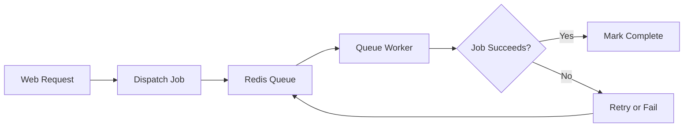
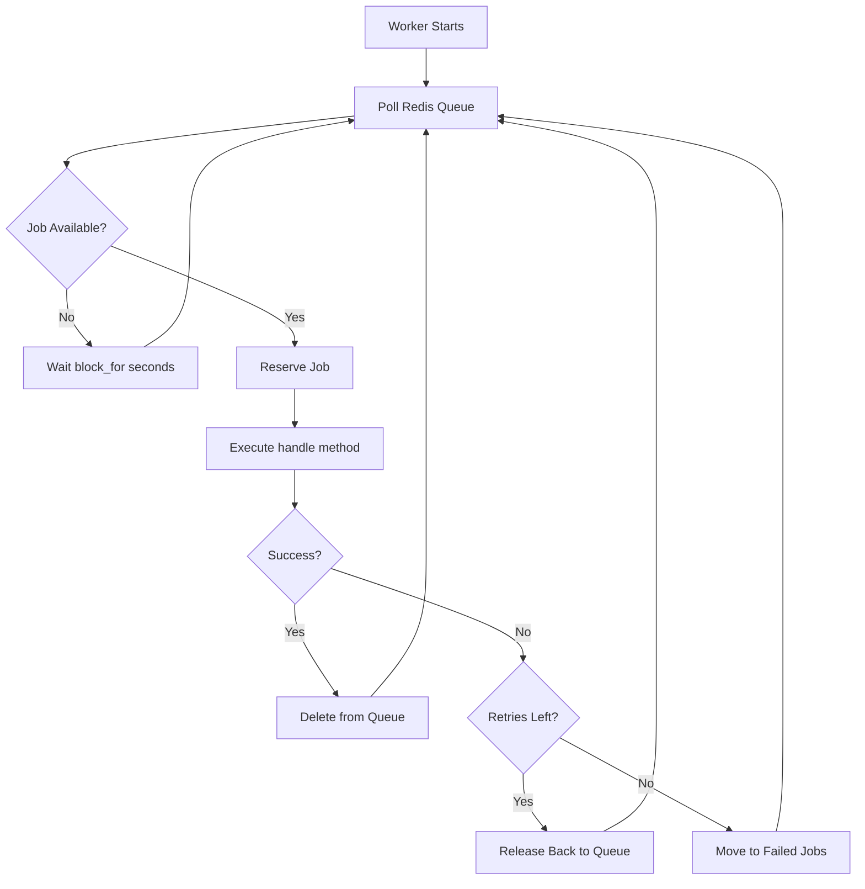
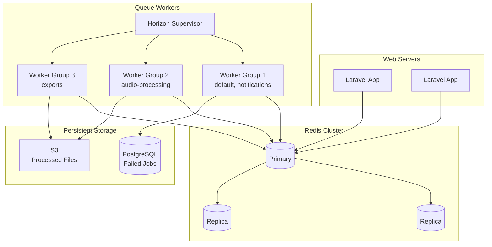

# How to Use Laravel Queues with Redis

Author: [nawazdhandala](https://www.github.com/nawazdhandala)

Tags: Laravel, Queues, Redis, PHP, Background Jobs

Description: Learn how to use Laravel Queues with Redis for background job processing including job creation, retries, rate limiting, and monitoring with Horizon.

---

Background jobs are essential for handling time-consuming tasks without blocking user requests. Laravel's queue system paired with Redis provides a fast, reliable way to defer work like sending emails, processing uploads, or syncing data with external services.

## How Laravel Queues Work

Before diving into code, here's how the queue system flows:



The web process pushes jobs onto Redis. Separate worker processes pull jobs off the queue and execute them. If a job fails, it can be retried or moved to a failed jobs table.

## 1. Install and Configure Redis

First, install the Redis PHP extension and the Predis package:

```bash
# Install PHP Redis extension (recommended for performance)
pecl install redis

# Or use Predis as a pure PHP alternative
composer require predis/predis
```

Configure your Redis connection in `.env`:

```env
# Queue driver setting
QUEUE_CONNECTION=redis

# Redis connection settings
REDIS_HOST=127.0.0.1
REDIS_PASSWORD=null
REDIS_PORT=6379
REDIS_CLIENT=phpredis
```

Update `config/database.php` to define your Redis connection:

```php
// config/database.php

'redis' => [
    // Use phpredis extension for better performance
    // Switch to 'predis' if you prefer the pure PHP client
    'client' => env('REDIS_CLIENT', 'phpredis'),

    'default' => [
        'host' => env('REDIS_HOST', '127.0.0.1'),
        'password' => env('REDIS_PASSWORD'),
        'port' => env('REDIS_PORT', 6379),
        'database' => env('REDIS_DB', 0),
    ],

    // Separate database for queue to avoid conflicts with cache
    'queue' => [
        'host' => env('REDIS_HOST', '127.0.0.1'),
        'password' => env('REDIS_PASSWORD'),
        'port' => env('REDIS_PORT', 6379),
        'database' => env('REDIS_QUEUE_DB', 1),
    ],
],
```

Update `config/queue.php` to use your Redis queue connection:

```php
// config/queue.php

'connections' => [
    'redis' => [
        'driver' => 'redis',
        'connection' => 'queue',          // Use the queue-specific Redis DB
        'queue' => 'default',             // Default queue name
        'retry_after' => 90,              // Re-release job if worker dies
        'block_for' => 5,                 // Blocking pop timeout in seconds
        'after_commit' => true,           // Only dispatch after DB transaction commits
    ],
],
```

## 2. Create Your First Job

Generate a job class using Artisan:

```bash
php artisan make:job ProcessPodcastUpload
```

Here's a complete job class with proper error handling:

```php
<?php
// app/Jobs/ProcessPodcastUpload.php

namespace App\Jobs;

use App\Models\Podcast;
use App\Services\AudioProcessor;
use Illuminate\Bus\Queueable;
use Illuminate\Contracts\Queue\ShouldQueue;
use Illuminate\Foundation\Bus\Dispatchable;
use Illuminate\Queue\InteractsWithQueue;
use Illuminate\Queue\SerializesModels;
use Illuminate\Support\Facades\Log;

class ProcessPodcastUpload implements ShouldQueue
{
    use Dispatchable, InteractsWithQueue, Queueable, SerializesModels;

    // Number of times to retry before marking as failed
    public int $tries = 3;

    // Maximum seconds the job can run before timing out
    public int $timeout = 300;

    // Seconds to wait before retrying a failed attempt
    public int $backoff = 60;

    public function __construct(
        public Podcast $podcast,
        public string $filePath
    ) {
        // The podcast model will be serialized and restored automatically
        // thanks to SerializesModels trait
    }

    public function handle(AudioProcessor $processor): void
    {
        Log::info('Processing podcast upload', [
            'podcast_id' => $this->podcast->id,
            'file' => $this->filePath,
        ]);

        // Transcode audio to multiple formats
        $processor->transcode($this->filePath, [
            'mp3' => ['bitrate' => 128],
            'aac' => ['bitrate' => 96],
        ]);

        // Generate waveform visualization
        $waveform = $processor->generateWaveform($this->filePath);

        // Update the podcast record
        $this->podcast->update([
            'processed' => true,
            'waveform_path' => $waveform,
        ]);

        Log::info('Podcast processing complete', [
            'podcast_id' => $this->podcast->id,
        ]);
    }

    // Called when all retry attempts have been exhausted
    public function failed(\Throwable $exception): void
    {
        Log::error('Podcast processing failed permanently', [
            'podcast_id' => $this->podcast->id,
            'error' => $exception->getMessage(),
        ]);

        // Notify the user or admin about the failure
        $this->podcast->user->notify(
            new PodcastProcessingFailed($this->podcast, $exception)
        );
    }
}
```

## 3. Dispatch Jobs

Dispatch jobs from your controller or service:

```php
<?php
// app/Http/Controllers/PodcastController.php

namespace App\Http\Controllers;

use App\Jobs\ProcessPodcastUpload;
use App\Models\Podcast;
use Illuminate\Http\Request;

class PodcastController extends Controller
{
    public function store(Request $request)
    {
        $request->validate([
            'title' => 'required|string|max:255',
            'audio' => 'required|file|mimes:mp3,wav,m4a|max:512000',
        ]);

        // Store the uploaded file
        $path = $request->file('audio')->store('podcasts', 'local');

        // Create the podcast record
        $podcast = Podcast::create([
            'user_id' => $request->user()->id,
            'title' => $request->title,
            'original_path' => $path,
            'processed' => false,
        ]);

        // Dispatch the processing job to the queue
        // The job runs in the background, so this returns immediately
        ProcessPodcastUpload::dispatch($podcast, storage_path("app/{$path}"));

        return response()->json([
            'message' => 'Upload received. Processing will complete shortly.',
            'podcast' => $podcast,
        ], 202);
    }
}
```

### Dispatch Options

Laravel provides several ways to customize job dispatch:

```php
// Dispatch to a specific queue
ProcessPodcastUpload::dispatch($podcast, $path)
    ->onQueue('audio-processing');

// Delay execution by 5 minutes
ProcessPodcastUpload::dispatch($podcast, $path)
    ->delay(now()->addMinutes(5));

// Dispatch only after the current database transaction commits
ProcessPodcastUpload::dispatch($podcast, $path)
    ->afterCommit();

// Chain multiple jobs to run in sequence
Bus::chain([
    new ProcessPodcastUpload($podcast, $path),
    new GeneratePodcastTranscript($podcast),
    new NotifySubscribers($podcast),
])->dispatch();
```

## 4. Run Queue Workers

Start a worker to process jobs:

```bash
# Process jobs from the default queue
php artisan queue:work redis

# Process jobs from a specific queue with custom settings
php artisan queue:work redis --queue=audio-processing --tries=3 --timeout=300

# Process a single job and exit (useful for testing)
php artisan queue:work redis --once
```

Here's how jobs flow through the worker:



### Production Worker Setup with Supervisor

For production, use Supervisor to keep workers running:

```ini
; /etc/supervisor/conf.d/laravel-worker.conf

[program:laravel-worker]
process_name=%(program_name)s_%(process_num)02d
command=php /var/www/app/artisan queue:work redis --sleep=3 --tries=3 --max-time=3600
autostart=true
autorestart=true
stopasgroup=true
killasgroup=true
user=www-data
numprocs=4
redirect_stderr=true
stdout_logfile=/var/www/app/storage/logs/worker.log
stopwaitsecs=3600
```

Reload Supervisor after changes:

```bash
sudo supervisorctl reread
sudo supervisorctl update
sudo supervisorctl start laravel-worker:*
```

## 5. Handle Retries and Backoff

Configure retry behavior directly on your job class:

```php
<?php
// app/Jobs/SyncInventory.php

namespace App\Jobs;

use Illuminate\Bus\Queueable;
use Illuminate\Contracts\Queue\ShouldQueue;
use Illuminate\Foundation\Bus\Dispatchable;
use Illuminate\Queue\InteractsWithQueue;
use Illuminate\Queue\SerializesModels;

class SyncInventory implements ShouldQueue
{
    use Dispatchable, InteractsWithQueue, Queueable, SerializesModels;

    // Retry up to 5 times
    public int $tries = 5;

    // Exponential backoff: wait 1s, 5s, 30s, 60s, 120s between retries
    public array $backoff = [1, 5, 30, 60, 120];

    // Stop retrying after 10 minutes total
    public int $retryUntil;

    public function __construct(public int $productId)
    {
        $this->retryUntil = now()->addMinutes(10)->timestamp;
    }

    public function handle(): void
    {
        // Your sync logic here
    }

    // Dynamically calculate backoff based on attempt number
    public function backoff(): array
    {
        return [1, 5, 30, 60, 120];
    }

    // Determine if the job should retry based on the exception
    public function retryIf(\Throwable $exception): bool
    {
        // Only retry on timeout or rate limit errors
        return $exception instanceof \Illuminate\Http\Client\ConnectionException
            || $exception instanceof RateLimitException;
    }
}
```

## 6. Rate Limiting Jobs

Prevent overwhelming external APIs with rate limiting:

```php
<?php
// app/Jobs/CallExternalApi.php

namespace App\Jobs;

use Illuminate\Bus\Queueable;
use Illuminate\Contracts\Queue\ShouldQueue;
use Illuminate\Foundation\Bus\Dispatchable;
use Illuminate\Queue\InteractsWithQueue;
use Illuminate\Queue\Middleware\RateLimited;
use Illuminate\Queue\SerializesModels;
use Illuminate\Support\Facades\Http;

class CallExternalApi implements ShouldQueue
{
    use Dispatchable, InteractsWithQueue, Queueable, SerializesModels;

    public function __construct(
        public string $endpoint,
        public array $payload
    ) {}

    // Apply rate limiting middleware
    public function middleware(): array
    {
        return [
            new RateLimited('external-api'),
        ];
    }

    public function handle(): void
    {
        $response = Http::post($this->endpoint, $this->payload);

        if ($response->failed()) {
            throw new \RuntimeException("API call failed: {$response->status()}");
        }
    }
}
```

Define the rate limiter in a service provider:

```php
<?php
// app/Providers/AppServiceProvider.php

namespace App\Providers;

use Illuminate\Cache\RateLimiting\Limit;
use Illuminate\Support\Facades\RateLimiter;
use Illuminate\Support\ServiceProvider;

class AppServiceProvider extends ServiceProvider
{
    public function boot(): void
    {
        // Allow 100 jobs per minute to the external API
        RateLimiter::for('external-api', function (object $job) {
            return Limit::perMinute(100);
        });

        // Rate limit per user to ensure fair usage
        RateLimiter::for('user-exports', function (object $job) {
            return Limit::perMinute(5)->by($job->userId);
        });
    }
}
```

## 7. Job Batching

Process large workloads by batching jobs together:

```php
<?php
// app/Http/Controllers/ExportController.php

namespace App\Http\Controllers;

use App\Jobs\ExportUserData;
use App\Models\User;
use Illuminate\Bus\Batch;
use Illuminate\Http\Request;
use Illuminate\Support\Facades\Bus;

class ExportController extends Controller
{
    public function bulkExport(Request $request)
    {
        $userIds = $request->input('user_ids');

        // Create individual jobs for each user
        $jobs = collect($userIds)->map(function ($userId) {
            return new ExportUserData($userId);
        });

        // Dispatch as a batch with callbacks
        $batch = Bus::batch($jobs)
            ->then(function (Batch $batch) {
                // All jobs completed successfully
                Log::info("Batch {$batch->id} completed");
            })
            ->catch(function (Batch $batch, \Throwable $e) {
                // First job failure detected
                Log::error("Batch {$batch->id} had a failure: {$e->getMessage()}");
            })
            ->finally(function (Batch $batch) {
                // Batch finished (success or failure)
                Notification::send(
                    Admin::all(),
                    new BatchCompleted($batch)
                );
            })
            ->allowFailures()        // Continue processing even if some jobs fail
            ->onQueue('exports')     // Use a dedicated queue
            ->dispatch();

        return response()->json([
            'batch_id' => $batch->id,
            'total_jobs' => $batch->totalJobs,
        ]);
    }
}
```

Create the batches table:

```bash
php artisan queue:batches-table
php artisan migrate
```

Track batch progress:

```php
// Check batch status
$batch = Bus::findBatch($batchId);

return [
    'id' => $batch->id,
    'total_jobs' => $batch->totalJobs,
    'pending_jobs' => $batch->pendingJobs,
    'failed_jobs' => $batch->failedJobs,
    'progress' => $batch->progress(),
    'finished' => $batch->finished(),
    'cancelled' => $batch->cancelled(),
];
```

## 8. Monitor with Laravel Horizon

Horizon provides a dashboard and configuration layer for Redis queues.

Install Horizon:

```bash
composer require laravel/horizon
php artisan horizon:install
php artisan migrate
```

Configure queue workers in `config/horizon.php`:

```php
<?php
// config/horizon.php

return [
    'defaults' => [
        'supervisor-1' => [
            'connection' => 'redis',
            'queue' => ['default'],
            'balance' => 'auto',           // Auto-balance workers across queues
            'autoScalingStrategy' => 'time', // Scale based on job wait time
            'maxProcesses' => 10,          // Maximum worker processes
            'minProcesses' => 2,           // Minimum worker processes
            'maxTime' => 3600,             // Restart workers after 1 hour
            'maxJobs' => 1000,             // Restart after processing 1000 jobs
            'memory' => 128,               // Restart if memory exceeds 128MB
            'tries' => 3,                  // Retry failed jobs 3 times
            'timeout' => 60,               // Job timeout in seconds
            'nice' => 0,                   // Process priority
        ],
    ],

    'environments' => [
        'production' => [
            'supervisor-1' => [
                'connection' => 'redis',
                'queue' => ['default', 'notifications'],
                'balance' => 'auto',
                'minProcesses' => 2,
                'maxProcesses' => 10,
                'balanceMaxShift' => 1,    // Max workers to add/remove per cycle
                'balanceCooldown' => 3,    // Seconds between balance adjustments
            ],
            // Dedicated supervisor for heavy processing
            'supervisor-2' => [
                'connection' => 'redis',
                'queue' => ['audio-processing', 'exports'],
                'balance' => 'simple',
                'minProcesses' => 1,
                'maxProcesses' => 5,
                'timeout' => 600,          // Longer timeout for heavy jobs
            ],
        ],
        'local' => [
            'supervisor-1' => [
                'connection' => 'redis',
                'queue' => ['default', 'notifications', 'audio-processing'],
                'balance' => 'simple',
                'minProcesses' => 1,
                'maxProcesses' => 3,
            ],
        ],
    ],
];
```

Run Horizon:

```bash
# Development
php artisan horizon

# Production (use Supervisor to keep it running)
php artisan horizon
```

Supervisor config for Horizon:

```ini
; /etc/supervisor/conf.d/horizon.conf

[program:horizon]
process_name=%(program_name)s
command=php /var/www/app/artisan horizon
autostart=true
autorestart=true
user=www-data
redirect_stderr=true
stdout_logfile=/var/www/app/storage/logs/horizon.log
stopwaitsecs=3600
```

Access the dashboard at `/horizon` in your browser.

## 9. Handle Failed Jobs

Set up the failed jobs table:

```bash
php artisan queue:failed-table
php artisan migrate
```

View and retry failed jobs:

```bash
# List all failed jobs
php artisan queue:failed

# Retry a specific failed job by ID
php artisan queue:retry 5

# Retry all failed jobs
php artisan queue:retry all

# Delete a failed job
php artisan queue:forget 5

# Delete all failed jobs
php artisan queue:flush
```

Programmatically handle failures in your job:

```php
<?php
// app/Jobs/ImportData.php

namespace App\Jobs;

use App\Models\Import;
use Illuminate\Bus\Queueable;
use Illuminate\Contracts\Queue\ShouldQueue;
use Illuminate\Foundation\Bus\Dispatchable;
use Illuminate\Queue\InteractsWithQueue;
use Illuminate\Queue\SerializesModels;
use Illuminate\Support\Facades\Log;

class ImportData implements ShouldQueue
{
    use Dispatchable, InteractsWithQueue, Queueable, SerializesModels;

    public int $tries = 3;
    public bool $deleteWhenMissingModels = true;

    public function __construct(public Import $import) {}

    public function handle(): void
    {
        // Mark import as in progress
        $this->import->update(['status' => 'processing']);

        // Process the import
        $this->processImport();

        // Mark as complete
        $this->import->update(['status' => 'completed']);
    }

    public function failed(\Throwable $exception): void
    {
        Log::error('Import job failed', [
            'import_id' => $this->import->id,
            'error' => $exception->getMessage(),
            'trace' => $exception->getTraceAsString(),
        ]);

        // Update the import record
        $this->import->update([
            'status' => 'failed',
            'error_message' => $exception->getMessage(),
        ]);

        // Send notification to the user
        $this->import->user->notify(new ImportFailed($this->import));
    }

    private function processImport(): void
    {
        // Import logic here
    }
}
```

## 10. Testing Jobs

Test jobs in isolation without touching Redis:

```php
<?php
// tests/Feature/PodcastUploadTest.php

namespace Tests\Feature;

use App\Jobs\ProcessPodcastUpload;
use App\Models\Podcast;
use App\Models\User;
use Illuminate\Foundation\Testing\RefreshDatabase;
use Illuminate\Http\UploadedFile;
use Illuminate\Support\Facades\Queue;
use Illuminate\Support\Facades\Storage;
use Tests\TestCase;

class PodcastUploadTest extends TestCase
{
    use RefreshDatabase;

    public function test_podcast_upload_dispatches_processing_job(): void
    {
        // Fake the queue to capture dispatched jobs
        Queue::fake();
        Storage::fake('local');

        $user = User::factory()->create();

        // Make the upload request
        $response = $this->actingAs($user)->postJson('/api/podcasts', [
            'title' => 'My Podcast Episode',
            'audio' => UploadedFile::fake()->create('episode.mp3', 1024),
        ]);

        $response->assertStatus(202);

        // Assert the job was dispatched
        Queue::assertPushed(ProcessPodcastUpload::class, function ($job) {
            return $job->podcast->title === 'My Podcast Episode';
        });
    }

    public function test_podcast_processing_job_updates_record(): void
    {
        Storage::fake('local');

        $podcast = Podcast::factory()->create(['processed' => false]);
        $path = Storage::put('podcasts/test.mp3', 'fake audio content');

        // Run the job synchronously
        $job = new ProcessPodcastUpload($podcast, Storage::path($path));
        $job->handle(new \App\Services\AudioProcessor());

        // Assert the podcast was marked as processed
        $this->assertTrue($podcast->fresh()->processed);
    }

    public function test_job_retries_on_transient_failure(): void
    {
        Queue::fake();

        $podcast = Podcast::factory()->create();
        $job = new ProcessPodcastUpload($podcast, '/tmp/test.mp3');

        // Dispatch with specific queue
        ProcessPodcastUpload::dispatch($podcast, '/tmp/test.mp3')
            ->onQueue('audio-processing');

        Queue::assertPushedOn('audio-processing', ProcessPodcastUpload::class);
    }
}
```

## Queue Architecture Overview

Here's a complete view of a production queue setup:



---

Laravel Queues with Redis give you a fast, reliable foundation for background processing. Start simple with the default queue, add Horizon for monitoring, and scale out workers as your load grows. The combination handles everything from sending emails to processing hours of audio without blocking your users.
