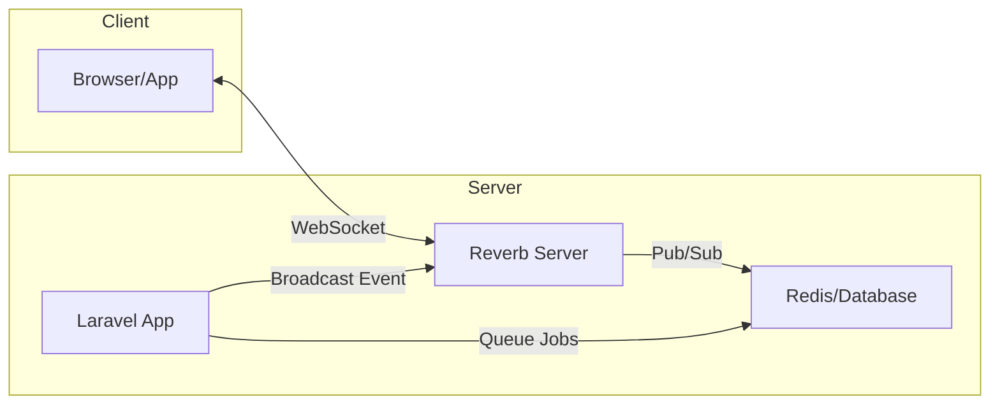
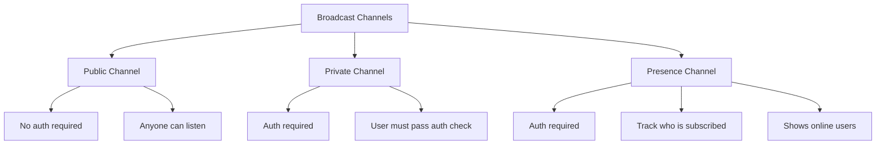
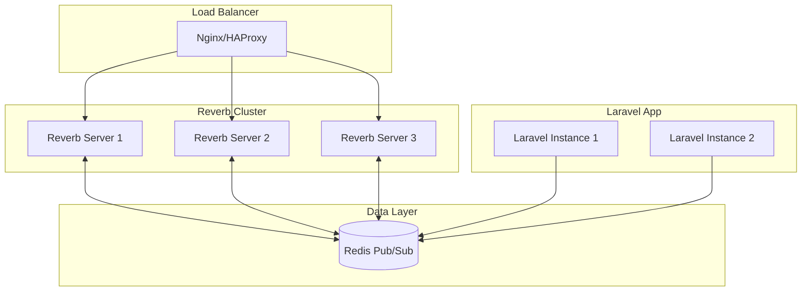

# How to Build WebSocket Applications with Laravel Reverb

Author: [nawazdhandala](https://www.github.com/nawazdhandala)

Tags: Laravel, WebSocket, Reverb, Real-time, PHP, Broadcasting, Pusher

Description: Learn how to build real-time WebSocket applications using Laravel Reverb, covering installation, configuration, channel authorization, and practical examples for chat and notifications.

---

> Laravel Reverb is a first-party WebSocket server for Laravel applications, providing high-performance real-time communication without external dependencies. Unlike Pusher or Ably, Reverb runs on your own infrastructure, giving you full control over your WebSocket connections.

Real-time features like live notifications, chat applications, collaborative editing, and live dashboards all benefit from WebSockets. Reverb makes implementing these features straightforward in Laravel.

---

## Architecture Overview

Before diving into code, let's understand how Laravel Reverb fits into your application architecture.



The Laravel application broadcasts events to Reverb, which then pushes them to connected clients over WebSocket connections. This separation allows your main application to remain stateless while Reverb handles persistent connections.

---

## Installation

Install Reverb using the Laravel installer command. This will install the package, publish the configuration, and set up the necessary environment variables.

```bash
# Install Reverb package
php artisan install:broadcasting

# This command will:
# 1. Install the laravel/reverb package
# 2. Publish the reverb.php config file
# 3. Add REVERB_* variables to your .env file
# 4. Install @laravel/echo npm package
```

After installation, your `.env` file will have these new variables:

```bash
# .env
# Reverb server configuration
REVERB_APP_ID=my-app-id
REVERB_APP_KEY=my-app-key
REVERB_APP_SECRET=my-app-secret
REVERB_HOST="localhost"
REVERB_PORT=8080
REVERB_SCHEME=http

# Broadcasting driver (use reverb instead of pusher)
BROADCAST_DRIVER=reverb

# Vite environment variables for client-side
VITE_REVERB_APP_KEY="${REVERB_APP_KEY}"
VITE_REVERB_HOST="${REVERB_HOST}"
VITE_REVERB_PORT="${REVERB_PORT}"
VITE_REVERB_SCHEME="${REVERB_SCHEME}"
```

---

## Starting the Reverb Server

Start the Reverb WebSocket server alongside your Laravel application.

```bash
# Start the Reverb server (development)
php artisan reverb:start

# Start with verbose output for debugging
php artisan reverb:start --debug

# Start on a specific host and port
php artisan reverb:start --host=0.0.0.0 --port=6001

# Production: Start with supervisor for process management
# Add to your supervisor config:
# [program:reverb]
# command=php /var/www/html/artisan reverb:start
# autostart=true
# autorestart=true
# user=www-data
```

---

## Creating Broadcast Events

Events are the core of Laravel's broadcasting system. Create an event that implements the `ShouldBroadcast` interface.

```php
<?php
// app/Events/MessageSent.php
// Event broadcast when a new chat message is sent

namespace App\Events;

use App\Models\Message;
use App\Models\User;
use Illuminate\Broadcasting\Channel;
use Illuminate\Broadcasting\InteractsWithSockets;
use Illuminate\Broadcasting\PresenceChannel;
use Illuminate\Broadcasting\PrivateChannel;
use Illuminate\Contracts\Broadcasting\ShouldBroadcast;
use Illuminate\Foundation\Events\Dispatchable;
use Illuminate\Queue\SerializesModels;

class MessageSent implements ShouldBroadcast
{
    use Dispatchable, InteractsWithSockets, SerializesModels;

    // Public properties are automatically included in the broadcast payload
    public Message $message;
    public User $user;

    public function __construct(Message $message, User $user)
    {
        $this->message = $message;
        $this->user = $user;
    }

    /**
     * Define which channels to broadcast on.
     * PrivateChannel requires authentication.
     */
    public function broadcastOn(): array
    {
        return [
            // Broadcast to the specific chat room
            new PrivateChannel('chat.' . $this->message->room_id),
        ];
    }

    /**
     * Customize the event name (optional).
     * Default would be "App\Events\MessageSent"
     */
    public function broadcastAs(): string
    {
        return 'message.sent';
    }

    /**
     * Customize the broadcast payload (optional).
     * Use this to control exactly what data is sent.
     */
    public function broadcastWith(): array
    {
        return [
            'id' => $this->message->id,
            'content' => $this->message->content,
            'user' => [
                'id' => $this->user->id,
                'name' => $this->user->name,
                'avatar' => $this->user->avatar_url,
            ],
            'sent_at' => $this->message->created_at->toIso8601String(),
        ];
    }
}
```

---

## Channel Types

Laravel supports three types of broadcast channels, each with different authorization requirements.



### Public Channels

Public channels don't require authentication. Use them for data that should be accessible to everyone.

```php
<?php
// app/Events/StockPriceUpdated.php
// Public event for stock price updates

namespace App\Events;

use Illuminate\Broadcasting\Channel;
use Illuminate\Contracts\Broadcasting\ShouldBroadcast;

class StockPriceUpdated implements ShouldBroadcast
{
    public string $symbol;
    public float $price;
    public float $change;

    public function __construct(string $symbol, float $price, float $change)
    {
        $this->symbol = $symbol;
        $this->price = $price;
        $this->change = $change;
    }

    public function broadcastOn(): array
    {
        // Public channel - no authentication needed
        return [
            new Channel('stocks.' . $this->symbol),
        ];
    }

    public function broadcastAs(): string
    {
        return 'price.updated';
    }
}
```

### Private Channels

Private channels require the user to be authenticated and authorized to access the channel.

```php
<?php
// routes/channels.php
// Define channel authorization rules

use Illuminate\Support\Facades\Broadcast;

// Private channel for user-specific notifications
// Only the user themselves can subscribe to their notification channel
Broadcast::channel('notifications.{userId}', function ($user, $userId) {
    // Return true if the authenticated user matches the channel user
    return (int) $user->id === (int) $userId;
});

// Private channel for chat rooms
// User must be a member of the room to subscribe
Broadcast::channel('chat.{roomId}', function ($user, $roomId) {
    // Check if user is a member of this chat room
    return $user->chatRooms()->where('id', $roomId)->exists();
});

// Private channel for order updates
// User must own the order to receive updates
Broadcast::channel('orders.{orderId}', function ($user, $orderId) {
    $order = \App\Models\Order::find($orderId);
    return $order && $order->user_id === $user->id;
});
```

### Presence Channels

Presence channels extend private channels with the ability to track who is currently subscribed. Perfect for showing online users.

```php
<?php
// routes/channels.php
// Presence channel for collaborative document editing

use Illuminate\Support\Facades\Broadcast;

// Presence channel returns user data instead of boolean
Broadcast::channel('document.{documentId}', function ($user, $documentId) {
    // Check if user has access to this document
    $document = \App\Models\Document::find($documentId);

    if (!$document || !$document->canAccess($user)) {
        return null; // Deny access
    }

    // Return user info to be shared with other subscribers
    // This data will be available to all users on the presence channel
    return [
        'id' => $user->id,
        'name' => $user->name,
        'avatar' => $user->avatar_url,
        'color' => $user->cursor_color, // For collaborative editing cursors
    ];
});
```

---

## Client-Side Setup with Laravel Echo

Laravel Echo is the JavaScript library that handles WebSocket connections and channel subscriptions on the client side.

```javascript
// resources/js/bootstrap.js
// Configure Laravel Echo with Reverb

import Echo from 'laravel-echo';
import Pusher from 'pusher-js';

// Echo uses the Pusher protocol, which Reverb implements
window.Pusher = Pusher;

window.Echo = new Echo({
    broadcaster: 'reverb',
    key: import.meta.env.VITE_REVERB_APP_KEY,
    wsHost: import.meta.env.VITE_REVERB_HOST,
    wsPort: import.meta.env.VITE_REVERB_PORT ?? 80,
    wssPort: import.meta.env.VITE_REVERB_PORT ?? 443,
    forceTLS: (import.meta.env.VITE_REVERB_SCHEME ?? 'https') === 'https',
    enabledTransports: ['ws', 'wss'], // Enable both secure and insecure WebSockets
});
```

---

## Listening to Events

Subscribe to channels and listen for events in your JavaScript code.

```javascript
// resources/js/chat.js
// Chat room implementation with Laravel Echo

// Subscribe to a private chat channel
// The channel name must match what's defined in broadcastOn()
Echo.private(`chat.${roomId}`)
    // Listen for the 'message.sent' event (matches broadcastAs())
    .listen('.message.sent', (event) => {
        // event contains the data from broadcastWith()
        console.log('New message:', event);

        // Add message to the chat UI
        addMessageToChat({
            id: event.id,
            content: event.content,
            user: event.user,
            sentAt: event.sent_at,
        });
    })
    // Listen for typing indicators (client events)
    .listenForWhisper('typing', (event) => {
        showTypingIndicator(event.user);
    });

// Send typing indicator (client-to-client, doesn't hit server)
function sendTypingIndicator() {
    Echo.private(`chat.${roomId}`)
        .whisper('typing', {
            user: currentUser.name,
        });
}
```

---

## Presence Channels for Online Users

Presence channels let you track who is currently viewing a page or using a feature.

```javascript
// resources/js/document-editor.js
// Collaborative document editing with presence

let onlineUsers = [];

Echo.join(`document.${documentId}`)
    // Called when you successfully join the channel
    // 'members' contains all current subscribers
    .here((members) => {
        console.log('Currently editing:', members);
        onlineUsers = members;
        updateOnlineUsersUI(onlineUsers);
    })
    // Called when a new user joins
    .joining((user) => {
        console.log('User joined:', user.name);
        onlineUsers.push(user);
        updateOnlineUsersUI(onlineUsers);
        showNotification(`${user.name} started editing`);
    })
    // Called when a user leaves
    .leaving((user) => {
        console.log('User left:', user.name);
        onlineUsers = onlineUsers.filter(u => u.id !== user.id);
        updateOnlineUsersUI(onlineUsers);
        showNotification(`${user.name} stopped editing`);
    })
    // Listen for cursor position updates from other users
    .listenForWhisper('cursor-move', (event) => {
        updateUserCursor(event.userId, event.position);
    });

// Broadcast cursor position to other users
function broadcastCursorPosition(position) {
    Echo.join(`document.${documentId}`)
        .whisper('cursor-move', {
            userId: currentUser.id,
            position: position,
        });
}
```

---

## Real-World Example: Notification System

Here's a complete implementation of a real-time notification system.

```php
<?php
// app/Events/NotificationReceived.php
// Event for user notifications

namespace App\Events;

use App\Models\Notification;
use Illuminate\Broadcasting\PrivateChannel;
use Illuminate\Contracts\Broadcasting\ShouldBroadcast;
use Illuminate\Queue\SerializesModels;

class NotificationReceived implements ShouldBroadcast
{
    use SerializesModels;

    public Notification $notification;

    public function __construct(Notification $notification)
    {
        $this->notification = $notification;
    }

    public function broadcastOn(): array
    {
        // Each user has their own private notification channel
        return [
            new PrivateChannel('notifications.' . $this->notification->user_id),
        ];
    }

    public function broadcastAs(): string
    {
        return 'notification.received';
    }

    public function broadcastWith(): array
    {
        return [
            'id' => $this->notification->id,
            'type' => $this->notification->type,
            'title' => $this->notification->title,
            'message' => $this->notification->message,
            'action_url' => $this->notification->action_url,
            'created_at' => $this->notification->created_at->toIso8601String(),
        ];
    }
}
```

```php
<?php
// app/Services/NotificationService.php
// Service for creating and broadcasting notifications

namespace App\Services;

use App\Events\NotificationReceived;
use App\Models\Notification;
use App\Models\User;

class NotificationService
{
    /**
     * Create a notification and broadcast it in real-time.
     */
    public function notify(
        User $user,
        string $type,
        string $title,
        string $message,
        ?string $actionUrl = null
    ): Notification {
        // Create the notification in the database
        $notification = Notification::create([
            'user_id' => $user->id,
            'type' => $type,
            'title' => $title,
            'message' => $message,
            'action_url' => $actionUrl,
            'read_at' => null,
        ]);

        // Broadcast the notification to the user's channel
        // This happens asynchronously via the queue
        broadcast(new NotificationReceived($notification));

        return $notification;
    }

    /**
     * Notify multiple users about the same event.
     */
    public function notifyMany(
        array $userIds,
        string $type,
        string $title,
        string $message,
        ?string $actionUrl = null
    ): void {
        foreach ($userIds as $userId) {
            $user = User::find($userId);
            if ($user) {
                $this->notify($user, $type, $title, $message, $actionUrl);
            }
        }
    }
}
```

```javascript
// resources/js/notifications.js
// Client-side notification handling

class NotificationManager {
    constructor(userId) {
        this.userId = userId;
        this.notifications = [];
        this.unreadCount = 0;

        this.initializeChannel();
    }

    initializeChannel() {
        // Subscribe to user's private notification channel
        Echo.private(`notifications.${this.userId}`)
            .listen('.notification.received', (event) => {
                this.handleNewNotification(event);
            });
    }

    handleNewNotification(notification) {
        // Add to local state
        this.notifications.unshift(notification);
        this.unreadCount++;

        // Update UI badge
        this.updateBadge();

        // Show browser notification if permitted
        this.showBrowserNotification(notification);

        // Show in-app toast
        this.showToast(notification);
    }

    updateBadge() {
        const badge = document.getElementById('notification-badge');
        if (badge) {
            badge.textContent = this.unreadCount > 99 ? '99+' : this.unreadCount;
            badge.style.display = this.unreadCount > 0 ? 'block' : 'none';
        }
    }

    showBrowserNotification(notification) {
        if (Notification.permission === 'granted') {
            new Notification(notification.title, {
                body: notification.message,
                icon: '/images/notification-icon.png',
            });
        }
    }

    showToast(notification) {
        // Use your preferred toast library
        const toast = document.createElement('div');
        toast.className = 'notification-toast';
        toast.innerHTML = `
            <strong>${notification.title}</strong>
            <p>${notification.message}</p>
        `;
        document.body.appendChild(toast);

        // Auto-remove after 5 seconds
        setTimeout(() => toast.remove(), 5000);
    }
}

// Initialize on page load
document.addEventListener('DOMContentLoaded', () => {
    const userId = document.body.dataset.userId;
    if (userId) {
        window.notificationManager = new NotificationManager(userId);
    }
});
```

---

## Scaling Reverb for Production

For high-traffic applications, configure Reverb to handle horizontal scaling with Redis.

```php
<?php
// config/reverb.php
// Production configuration for scaling

return [
    'default' => env('REVERB_SERVER', 'reverb'),

    'servers' => [
        'reverb' => [
            'host' => env('REVERB_SERVER_HOST', '0.0.0.0'),
            'port' => env('REVERB_SERVER_PORT', 8080),
            'hostname' => env('REVERB_HOST'),
            'options' => [
                'tls' => [], // Configure TLS for production
            ],
            // Scaling options for production
            'scaling' => [
                'enabled' => env('REVERB_SCALING_ENABLED', true),
                'channel' => env('REVERB_SCALING_CHANNEL', 'reverb'),
            ],
            // Connection limits
            'max_request_size' => env('REVERB_MAX_REQUEST_SIZE', 10_000),
            'pulse_ingest_interval' => env('REVERB_PULSE_INTERVAL', 15),
        ],
    ],

    'apps' => [
        'provider' => 'config',
        'apps' => [
            [
                'key' => env('REVERB_APP_KEY'),
                'secret' => env('REVERB_APP_SECRET'),
                'app_id' => env('REVERB_APP_ID'),
                'options' => [
                    'host' => env('REVERB_HOST'),
                    'port' => env('REVERB_PORT', 443),
                    'scheme' => env('REVERB_SCHEME', 'https'),
                    'useTLS' => env('REVERB_SCHEME', 'https') === 'https',
                ],
                'allowed_origins' => [
                    env('APP_URL'),
                ],
                // Connection settings
                'ping_interval' => env('REVERB_APP_PING_INTERVAL', 60),
                'activity_timeout' => env('REVERB_APP_ACTIVITY_TIMEOUT', 30),
                // Rate limiting
                'max_message_size' => 10_000, // 10KB max message size
                'max_messages_per_second' => 100,
                'max_connections_per_ip' => 100,
            ],
        ],
    ],
];
```



---

## Error Handling and Reconnection

Handle WebSocket disconnections and errors gracefully on the client side.

```javascript
// resources/js/websocket-handler.js
// Robust WebSocket connection handling

class WebSocketHandler {
    constructor() {
        this.isConnected = false;
        this.reconnectAttempts = 0;
        this.maxReconnectAttempts = 10;
        this.baseReconnectDelay = 1000; // 1 second

        this.setupConnectionHandlers();
    }

    setupConnectionHandlers() {
        // Handle successful connection
        Echo.connector.pusher.connection.bind('connected', () => {
            console.log('WebSocket connected');
            this.isConnected = true;
            this.reconnectAttempts = 0;
            this.onConnected();
        });

        // Handle disconnection
        Echo.connector.pusher.connection.bind('disconnected', () => {
            console.log('WebSocket disconnected');
            this.isConnected = false;
            this.onDisconnected();
        });

        // Handle connection errors
        Echo.connector.pusher.connection.bind('error', (error) => {
            console.error('WebSocket error:', error);
            this.handleError(error);
        });

        // Handle state changes
        Echo.connector.pusher.connection.bind('state_change', (states) => {
            console.log('Connection state:', states.current);
            this.onStateChange(states.current, states.previous);
        });
    }

    onConnected() {
        // Re-subscribe to channels after reconnection
        this.resubscribeChannels();

        // Update UI to show connected status
        this.updateConnectionStatus('connected');
    }

    onDisconnected() {
        // Update UI to show disconnected status
        this.updateConnectionStatus('disconnected');

        // Attempt reconnection with exponential backoff
        this.scheduleReconnect();
    }

    handleError(error) {
        // Log error for debugging
        console.error('WebSocket error details:', error);

        // Notify user if connection fails repeatedly
        if (this.reconnectAttempts >= this.maxReconnectAttempts) {
            this.showReconnectFailedMessage();
        }
    }

    scheduleReconnect() {
        if (this.reconnectAttempts >= this.maxReconnectAttempts) {
            console.error('Max reconnection attempts reached');
            return;
        }

        // Exponential backoff: 1s, 2s, 4s, 8s, etc.
        const delay = this.baseReconnectDelay * Math.pow(2, this.reconnectAttempts);
        this.reconnectAttempts++;

        console.log(`Reconnecting in ${delay}ms (attempt ${this.reconnectAttempts})`);

        setTimeout(() => {
            if (!this.isConnected) {
                Echo.connector.pusher.connect();
            }
        }, delay);
    }

    resubscribeChannels() {
        // Channels are automatically re-subscribed by Echo
        // but you may need to re-fetch initial state
        console.log('Re-subscribing to channels');
    }

    updateConnectionStatus(status) {
        const indicator = document.getElementById('connection-status');
        if (indicator) {
            indicator.className = `status-${status}`;
            indicator.textContent = status === 'connected' ? 'Online' : 'Offline';
        }
    }

    showReconnectFailedMessage() {
        const message = 'Connection lost. Please refresh the page to reconnect.';
        // Show alert or modal to user
        alert(message);
    }
}

// Initialize handler
const wsHandler = new WebSocketHandler();
```

---

## Debugging WebSocket Connections

Enable debug mode to troubleshoot WebSocket issues during development.

```javascript
// resources/js/bootstrap.js
// Enable debugging for development

window.Echo = new Echo({
    broadcaster: 'reverb',
    key: import.meta.env.VITE_REVERB_APP_KEY,
    wsHost: import.meta.env.VITE_REVERB_HOST,
    wsPort: import.meta.env.VITE_REVERB_PORT ?? 80,
    forceTLS: false,
    enabledTransports: ['ws', 'wss'],
    // Enable logging in development
    enableLogging: import.meta.env.DEV,
});

// In development, log all Echo events
if (import.meta.env.DEV) {
    Echo.connector.pusher.connection.bind('state_change', (states) => {
        console.log('[Echo] State change:', states.previous, '->', states.current);
    });

    Echo.connector.pusher.connection.bind('error', (error) => {
        console.error('[Echo] Connection error:', error);
    });
}
```

```bash
# Server-side debugging

# Start Reverb with debug output
php artisan reverb:start --debug

# Monitor WebSocket connections in real-time
php artisan reverb:connections

# Check Laravel's event broadcasting logs
tail -f storage/logs/laravel.log | grep -i "broadcast"
```

---

## Best Practices

1. **Use queued broadcasting** for better performance - events are processed asynchronously
2. **Implement proper authentication** on private and presence channels
3. **Handle reconnection** gracefully on the client side with exponential backoff
4. **Rate limit** client events (whispers) to prevent abuse
5. **Use presence channels** sparingly - they have higher overhead than private channels
6. **Monitor connection counts** and set appropriate limits for your infrastructure

---

## Conclusion

Laravel Reverb provides a powerful, self-hosted solution for real-time WebSocket communication. Key takeaways:

- **First-party support** means tight integration with Laravel's broadcasting system
- **Three channel types** (public, private, presence) cover different use cases
- **Laravel Echo** simplifies client-side implementation
- **Horizontal scaling** is possible with Redis pub/sub

Reverb gives you the simplicity of services like Pusher while keeping your WebSocket infrastructure under your control.

---

*Need to monitor your WebSocket connections in production? [OneUptime](https://oneuptime.com) provides real-time monitoring and alerting for your Laravel applications.*
