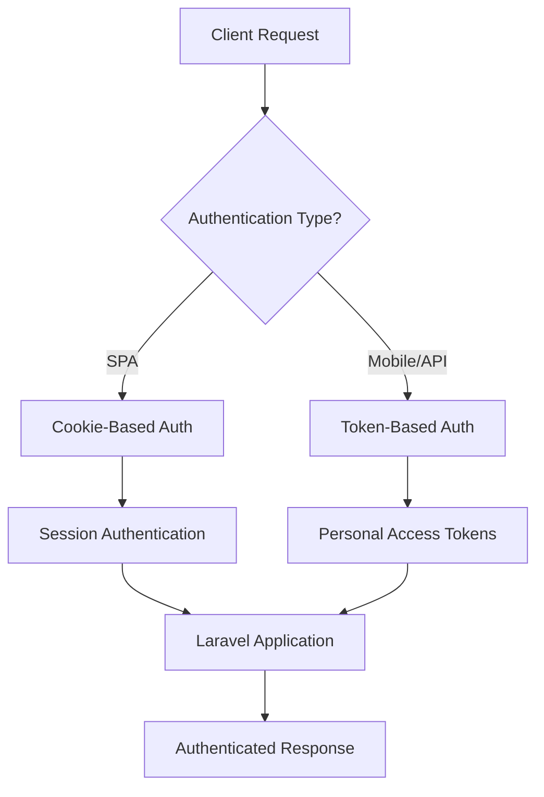

# How to Implement Authentication with Laravel Sanctum

Author: [nawazdhandala](https://github.com/nawazdhandala)

Tags: Laravel, PHP, Authentication, API, Security, Backend Development

Description: Learn how to implement secure API authentication in Laravel using Sanctum. This guide covers installation, SPA authentication, token-based authentication for mobile apps, token abilities, and best practices for production.

---

Laravel Sanctum provides a lightweight authentication system for SPAs (single page applications), mobile applications, and simple token-based APIs. Unlike Laravel Passport, which implements full OAuth2, Sanctum focuses on simplicity while maintaining security. If your application does not need OAuth2 or if you want a straightforward way to issue API tokens to your users, Sanctum is the right choice.

## Why Choose Sanctum?

Before diving into implementation, let's understand when Sanctum makes sense:

- **SPA Authentication**: Your React, Vue, or Angular frontend runs on the same domain (or subdomain) as your Laravel backend
- **Mobile App Authentication**: You need to issue API tokens to mobile apps
- **Simple API Tokens**: You want users to generate API tokens without the complexity of OAuth2
- **First-Party APIs**: Your API serves your own applications rather than third-party developers



## Installation and Setup

### Installing Sanctum

Sanctum comes pre-installed in new Laravel applications starting from Laravel 8. If you need to install it manually:

```bash
# Install Sanctum via Composer
composer require laravel/sanctum

# Publish the Sanctum configuration and migration files
php artisan vendor:publish --provider="Laravel\Sanctum\SanctumServiceProvider"

# Run the migrations to create the personal_access_tokens table
php artisan migrate
```

### Configuration

After publishing, you will find the configuration file at `config/sanctum.php`. Let's look at the key settings:

```php
<?php

// config/sanctum.php
return [
    // Domains that can authenticate using Sanctum cookies
    // Add your SPA domain here for cookie-based authentication
    'stateful' => explode(',', env('SANCTUM_STATEFUL_DOMAINS', sprintf(
        '%s%s',
        'localhost,localhost:3000,127.0.0.1,127.0.0.1:8000,::1',
        env('APP_URL') ? ','.parse_url(env('APP_URL'), PHP_URL_HOST) : ''
    ))),

    // Middleware for Sanctum's guard
    'guard' => ['web'],

    // Token expiration time in minutes (null = never expires)
    // For security, always set an expiration in production
    'expiration' => null,

    // Prefix for Sanctum routes
    'prefix' => 'sanctum',
];
```

### Middleware Setup

Add Sanctum's middleware to your API middleware group in `app/Http/Kernel.php`:

```php
<?php

// app/Http/Kernel.php
protected $middlewareGroups = [
    'api' => [
        // Enable Sanctum's stateful authentication for SPAs
        \Laravel\Sanctum\Http\Middleware\EnsureFrontendRequestsAreStateful::class,
        \Illuminate\Routing\Middleware\ThrottleRequests::class.':api',
        \Illuminate\Routing\Middleware\SubstituteBindings::class,
    ],
];
```

### User Model Configuration

Add the `HasApiTokens` trait to your User model:

```php
<?php

namespace App\Models;

use Illuminate\Foundation\Auth\User as Authenticatable;
use Laravel\Sanctum\HasApiTokens;

class User extends Authenticatable
{
    // This trait provides token management methods
    use HasApiTokens;

    protected $fillable = [
        'name',
        'email',
        'password',
    ];

    protected $hidden = [
        'password',
        'remember_token',
    ];
}
```

## Token-Based Authentication for Mobile Apps and APIs

This approach is ideal for mobile applications and third-party API consumers. The client receives a token that must be included in every request.

### Creating the Authentication Controller

```php
<?php

namespace App\Http\Controllers\Auth;

use App\Http\Controllers\Controller;
use App\Models\User;
use Illuminate\Http\Request;
use Illuminate\Support\Facades\Hash;
use Illuminate\Validation\ValidationException;

class AuthController extends Controller
{
    /**
     * Register a new user and issue a token
     */
    public function register(Request $request)
    {
        // Validate incoming registration data
        $validated = $request->validate([
            'name' => 'required|string|max:255',
            'email' => 'required|string|email|max:255|unique:users',
            'password' => 'required|string|min:8|confirmed',
            'device_name' => 'required|string|max:255',
        ]);

        // Create the user with hashed password
        $user = User::create([
            'name' => $validated['name'],
            'email' => $validated['email'],
            'password' => Hash::make($validated['password']),
        ]);

        // Create a token for the new user
        // The device_name helps identify which device the token belongs to
        $token = $user->createToken($validated['device_name'])->plainTextToken;

        return response()->json([
            'user' => $user,
            'token' => $token,
        ], 201);
    }

    /**
     * Authenticate user and issue a new token
     */
    public function login(Request $request)
    {
        $validated = $request->validate([
            'email' => 'required|string|email',
            'password' => 'required|string',
            'device_name' => 'required|string|max:255',
        ]);

        // Find the user by email
        $user = User::where('email', $validated['email'])->first();

        // Verify password - throw validation exception if wrong
        if (!$user || !Hash::check($validated['password'], $user->password)) {
            throw ValidationException::withMessages([
                'email' => ['The provided credentials are incorrect.'],
            ]);
        }

        // Create and return a new token
        $token = $user->createToken($validated['device_name'])->plainTextToken;

        return response()->json([
            'user' => $user,
            'token' => $token,
        ]);
    }

    /**
     * Revoke the current access token
     */
    public function logout(Request $request)
    {
        // Delete the token used for the current request
        $request->user()->currentAccessToken()->delete();

        return response()->json([
            'message' => 'Successfully logged out',
        ]);
    }

    /**
     * Revoke all tokens for the user (logout from all devices)
     */
    public function logoutAll(Request $request)
    {
        // Delete all tokens belonging to this user
        $request->user()->tokens()->delete();

        return response()->json([
            'message' => 'Successfully logged out from all devices',
        ]);
    }

    /**
     * Get the authenticated user's profile
     */
    public function profile(Request $request)
    {
        return response()->json([
            'user' => $request->user(),
        ]);
    }
}
```

### Setting Up API Routes

```php
<?php

// routes/api.php
use App\Http\Controllers\Auth\AuthController;
use Illuminate\Support\Facades\Route;

// Public routes - no authentication required
Route::post('/register', [AuthController::class, 'register']);
Route::post('/login', [AuthController::class, 'login']);

// Protected routes - require valid Sanctum token
Route::middleware('auth:sanctum')->group(function () {
    Route::get('/profile', [AuthController::class, 'profile']);
    Route::post('/logout', [AuthController::class, 'logout']);
    Route::post('/logout-all', [AuthController::class, 'logoutAll']);

    // Your other protected API routes go here
    Route::apiResource('/posts', PostController::class);
});
```

### Making Authenticated Requests

Once you have a token, include it in the Authorization header:

```bash
# Login and get a token
curl -X POST http://your-app.com/api/login \
  -H "Content-Type: application/json" \
  -H "Accept: application/json" \
  -d '{"email": "user@example.com", "password": "secret123", "device_name": "iPhone 15"}'

# Response:
# {"user": {...}, "token": "1|abc123def456..."}

# Use the token for authenticated requests
curl http://your-app.com/api/profile \
  -H "Authorization: Bearer 1|abc123def456..." \
  -H "Accept: application/json"
```

## SPA Authentication with Cookies

For single-page applications running on the same domain as your Laravel backend, cookie-based authentication is more secure and simpler to manage than tokens.

### CORS Configuration

First, configure CORS to allow your SPA to make requests. Update `config/cors.php`:

```php
<?php

// config/cors.php
return [
    'paths' => ['api/*', 'sanctum/csrf-cookie'],

    'allowed_methods' => ['*'],

    'allowed_origins' => ['*'],

    'allowed_origins_patterns' => [],

    'allowed_headers' => ['*'],

    'exposed_headers' => [],

    'max_age' => 0,

    // IMPORTANT: Must be true for cookie authentication
    'supports_credentials' => true,
];
```

### Session Configuration

Update your `.env` file to ensure cookies work correctly:

```bash
# Your SPA domain (for cookie domain setting)
SESSION_DOMAIN=.yourdomain.com

# Sanctum stateful domains - list all your SPA origins
SANCTUM_STATEFUL_DOMAINS=localhost:3000,spa.yourdomain.com
```

### SPA Authentication Controller

```php
<?php

namespace App\Http\Controllers\Auth;

use App\Http\Controllers\Controller;
use Illuminate\Http\Request;
use Illuminate\Support\Facades\Auth;

class SpaAuthController extends Controller
{
    /**
     * Authenticate user via session (for SPA)
     */
    public function login(Request $request)
    {
        $credentials = $request->validate([
            'email' => 'required|string|email',
            'password' => 'required|string',
        ]);

        // Attempt to authenticate using the web guard
        if (!Auth::attempt($credentials)) {
            return response()->json([
                'message' => 'Invalid credentials',
            ], 401);
        }

        // Regenerate session to prevent session fixation attacks
        $request->session()->regenerate();

        return response()->json([
            'user' => Auth::user(),
        ]);
    }

    /**
     * Logout and invalidate session
     */
    public function logout(Request $request)
    {
        Auth::guard('web')->logout();

        // Invalidate the session
        $request->session()->invalidate();

        // Regenerate CSRF token
        $request->session()->regenerateToken();

        return response()->json([
            'message' => 'Successfully logged out',
        ]);
    }
}
```

### Frontend Integration (JavaScript)

Here is how to authenticate from a JavaScript SPA:

```javascript
// api.js - Configure axios for Sanctum authentication
import axios from 'axios';

const api = axios.create({
    baseURL: 'http://your-laravel-app.com',
    // IMPORTANT: Include credentials (cookies) in requests
    withCredentials: true,
    headers: {
        'Accept': 'application/json',
        'Content-Type': 'application/json',
    },
});

// Authentication functions
export async function login(email, password) {
    // Step 1: Get CSRF cookie from Sanctum
    // This sets the XSRF-TOKEN cookie that Laravel will use for CSRF protection
    await api.get('/sanctum/csrf-cookie');

    // Step 2: Send login request
    // Axios automatically includes the XSRF-TOKEN in the X-XSRF-TOKEN header
    const response = await api.post('/api/login', { email, password });

    return response.data;
}

export async function logout() {
    const response = await api.post('/api/logout');
    return response.data;
}

export async function getProfile() {
    const response = await api.get('/api/profile');
    return response.data;
}

// Example usage in a React component
async function handleLogin(email, password) {
    try {
        const { user } = await login(email, password);
        console.log('Logged in as:', user.name);
    } catch (error) {
        if (error.response?.status === 401) {
            console.error('Invalid credentials');
        }
    }
}
```

## Token Abilities (Permissions)

Sanctum allows you to define abilities (permissions) for tokens, giving you fine-grained control over what each token can do.

### Creating Tokens with Abilities

```php
<?php

namespace App\Http\Controllers\Auth;

use App\Http\Controllers\Controller;
use Illuminate\Http\Request;

class TokenController extends Controller
{
    /**
     * Create a new API token with specific abilities
     */
    public function createToken(Request $request)
    {
        $validated = $request->validate([
            'name' => 'required|string|max:255',
            'abilities' => 'array',
            'abilities.*' => 'string|in:read,write,delete,admin',
        ]);

        // Create token with specified abilities
        // If no abilities provided, grant all abilities by default
        $abilities = $validated['abilities'] ?? ['*'];

        $token = $request->user()->createToken(
            $validated['name'],
            $abilities
        );

        return response()->json([
            'token' => $token->plainTextToken,
            'abilities' => $abilities,
        ]);
    }

    /**
     * List all tokens for the authenticated user
     */
    public function listTokens(Request $request)
    {
        // Get all tokens with their abilities
        $tokens = $request->user()->tokens->map(function ($token) {
            return [
                'id' => $token->id,
                'name' => $token->name,
                'abilities' => $token->abilities,
                'last_used_at' => $token->last_used_at,
                'created_at' => $token->created_at,
            ];
        });

        return response()->json(['tokens' => $tokens]);
    }

    /**
     * Revoke a specific token by ID
     */
    public function revokeToken(Request $request, $tokenId)
    {
        // Find and delete the token (only if it belongs to the user)
        $deleted = $request->user()->tokens()
            ->where('id', $tokenId)
            ->delete();

        if (!$deleted) {
            return response()->json(['message' => 'Token not found'], 404);
        }

        return response()->json(['message' => 'Token revoked']);
    }
}
```

### Checking Token Abilities in Controllers

```php
<?php

namespace App\Http\Controllers;

use Illuminate\Http\Request;

class PostController extends Controller
{
    public function index(Request $request)
    {
        // Check if the token has 'read' ability
        if (!$request->user()->tokenCan('read')) {
            return response()->json([
                'message' => 'Token does not have read permission',
            ], 403);
        }

        return Post::all();
    }

    public function store(Request $request)
    {
        // Check if the token has 'write' ability
        if (!$request->user()->tokenCan('write')) {
            return response()->json([
                'message' => 'Token does not have write permission',
            ], 403);
        }

        $post = Post::create($request->validated());
        return response()->json($post, 201);
    }

    public function destroy(Request $request, Post $post)
    {
        // Check for either 'delete' or 'admin' ability
        if (!$request->user()->tokenCan('delete') && !$request->user()->tokenCan('admin')) {
            return response()->json([
                'message' => 'Token does not have delete permission',
            ], 403);
        }

        $post->delete();
        return response()->json(null, 204);
    }
}
```

### Using Middleware for Abilities

You can also use middleware to check abilities:

```php
<?php

// routes/api.php
Route::middleware(['auth:sanctum', 'abilities:write'])->group(function () {
    Route::post('/posts', [PostController::class, 'store']);
    Route::put('/posts/{post}', [PostController::class, 'update']);
});

Route::middleware(['auth:sanctum', 'ability:delete,admin'])->group(function () {
    Route::delete('/posts/{post}', [PostController::class, 'destroy']);
});
```

## Token Expiration and Pruning

### Configuring Token Expiration

Set token expiration in `config/sanctum.php`:

```php
<?php

return [
    // Tokens expire after 7 days (in minutes)
    // Set to null for tokens that never expire
    'expiration' => 60 * 24 * 7, // 7 days
];
```

### Pruning Expired Tokens

Add a scheduled command to clean up expired tokens. In `app/Console/Kernel.php`:

```php
<?php

namespace App\Console;

use Illuminate\Console\Scheduling\Schedule;
use Illuminate\Foundation\Console\Kernel as ConsoleKernel;

class Kernel extends ConsoleKernel
{
    protected function schedule(Schedule $schedule)
    {
        // Prune tokens older than 24 hours after expiration
        $schedule->command('sanctum:prune-expired --hours=24')
            ->daily();
    }
}
```

## Security Best Practices

### Rate Limiting

Protect your authentication endpoints from brute force attacks:

```php
<?php

// routes/api.php
use Illuminate\Support\Facades\RateLimiter;
use Illuminate\Cache\RateLimiting\Limit;

// In RouteServiceProvider or bootstrap/app.php
RateLimiter::for('authentication', function (Request $request) {
    // Limit login attempts by email and IP
    return Limit::perMinute(5)->by(
        $request->input('email') . '|' . $request->ip()
    );
});

// Apply rate limiting to auth routes
Route::middleware('throttle:authentication')->group(function () {
    Route::post('/login', [AuthController::class, 'login']);
    Route::post('/register', [AuthController::class, 'register']);
});
```

### Token Hashing

By default, Sanctum stores tokens as SHA-256 hashes. The plain text token is only shown once when created - you cannot retrieve it later. Make sure users understand they need to save their token immediately.

### HTTPS Only

In production, always use HTTPS. Update your `.env`:

```bash
# Force HTTPS in production
APP_URL=https://your-app.com

# Secure cookie settings
SESSION_SECURE_COOKIE=true
```

### Token Rotation

For sensitive operations, consider implementing token rotation:

```php
<?php

public function refreshToken(Request $request)
{
    $user = $request->user();
    $currentToken = $user->currentAccessToken();

    // Get the abilities from the current token
    $abilities = $currentToken->abilities;
    $name = $currentToken->name;

    // Delete the current token
    $currentToken->delete();

    // Create a new token with the same abilities
    $newToken = $user->createToken($name, $abilities);

    return response()->json([
        'token' => $newToken->plainTextToken,
    ]);
}
```

## Testing Sanctum Authentication

### Feature Tests

```php
<?php

namespace Tests\Feature;

use App\Models\User;
use Illuminate\Foundation\Testing\RefreshDatabase;
use Laravel\Sanctum\Sanctum;
use Tests\TestCase;

class AuthenticationTest extends TestCase
{
    use RefreshDatabase;

    public function test_user_can_login_and_receive_token()
    {
        $user = User::factory()->create([
            'password' => bcrypt('password123'),
        ]);

        $response = $this->postJson('/api/login', [
            'email' => $user->email,
            'password' => 'password123',
            'device_name' => 'Test Device',
        ]);

        $response->assertStatus(200)
            ->assertJsonStructure(['user', 'token']);
    }

    public function test_authenticated_user_can_access_protected_routes()
    {
        // Sanctum provides a helper for testing authenticated requests
        $user = User::factory()->create();

        Sanctum::actingAs($user);

        $response = $this->getJson('/api/profile');

        $response->assertStatus(200)
            ->assertJson(['user' => ['id' => $user->id]]);
    }

    public function test_token_abilities_are_enforced()
    {
        $user = User::factory()->create();

        // Create a user with limited abilities
        Sanctum::actingAs($user, ['read']);

        // This should work (reading)
        $this->getJson('/api/posts')->assertStatus(200);

        // This should fail (writing requires 'write' ability)
        $this->postJson('/api/posts', ['title' => 'Test'])
            ->assertStatus(403);
    }

    public function test_unauthenticated_access_returns_401()
    {
        $response = $this->getJson('/api/profile');

        $response->assertStatus(401);
    }
}
```

## Summary

| Feature | Use Case |
|---------|----------|
| **Token Authentication** | Mobile apps, third-party API access |
| **SPA Authentication** | Same-domain JavaScript frontends |
| **Token Abilities** | Fine-grained permission control |
| **Token Expiration** | Time-limited access tokens |
| **Multiple Tokens** | Different devices/applications per user |

Laravel Sanctum provides a clean and secure way to add authentication to your Laravel APIs without the complexity of OAuth2. For most applications that serve first-party clients - whether mobile apps or SPAs - Sanctum offers everything you need with minimal configuration. The key is choosing the right authentication method for your use case: token-based for mobile apps and third-party access, or cookie-based for SPAs on the same domain.
