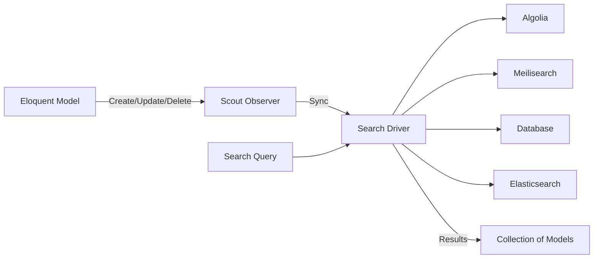
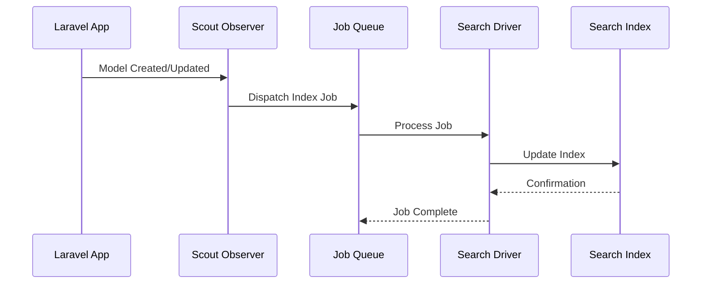
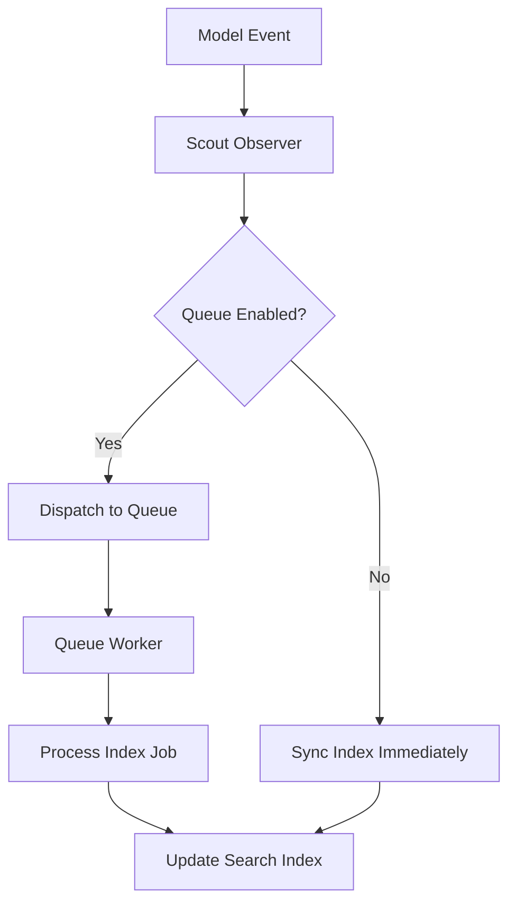
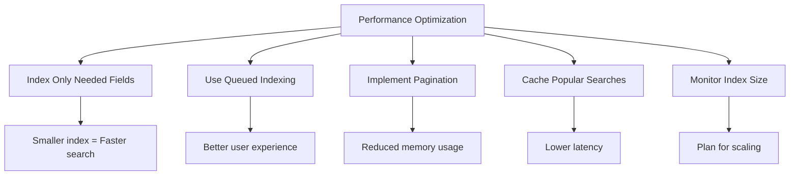

# How to Use Laravel Scout for Full-Text Search

Author: [nawazdhandala](https://www.github.com/nawazdhandala)

Tags: Laravel, Laravel Scout, Full-Text Search, Algolia, Meilisearch, PHP, Elasticsearch

Description: A practical guide to implementing fast, full-text search in Laravel applications using Scout with various search drivers.

---

Full-text search is a common requirement in modern web applications. Whether you're building an e-commerce platform, a blog, or a content management system, users expect instant and relevant search results. Laravel Scout provides a simple, driver-based solution for adding full-text search to your Eloquent models.

## What is Laravel Scout?

Laravel Scout is a package that provides a straightforward, driver-based interface for adding full-text search to your Eloquent models. It handles the heavy lifting of keeping your search indexes in sync with your database records.



## Installing Laravel Scout

First, install Scout via Composer:

```bash
# Install the Laravel Scout package
composer require laravel/scout
```

After installation, publish the Scout configuration file:

```bash
# Publish the Scout config to config/scout.php
php artisan vendor:publish --provider="Laravel\Scout\ScoutServiceProvider"
```

## Choosing a Search Driver

Scout supports multiple search drivers. Here's a comparison to help you choose:

| Driver | Best For | Pricing | Self-Hosted |
|--------|----------|---------|-------------|
| Algolia | Production apps with high traffic | Paid (free tier available) | No |
| Meilisearch | Self-hosted, privacy-focused apps | Free | Yes |
| Database | Simple apps, development | Free | Yes |
| Elasticsearch | Large-scale enterprise apps | Free (self-hosted) | Yes |

### Setting Up Meilisearch (Recommended for Self-Hosted)

Meilisearch is a fast, open-source search engine that's easy to set up:

```bash
# Install the Meilisearch PHP SDK
composer require meilisearch/meilisearch-php http-interop/http-factory-guzzle
```

Run Meilisearch using Docker:

```bash
# Start Meilisearch container with persistent data
docker run -d \
    --name meilisearch \
    -p 7700:7700 \
    -v $(pwd)/meili_data:/meili_data \
    -e MEILI_MASTER_KEY='your-master-key-here' \
    getmeili/meilisearch:latest
```

Update your `.env` file:

```env
# Scout configuration for Meilisearch
SCOUT_DRIVER=meilisearch
MEILISEARCH_HOST=http://127.0.0.1:7700
MEILISEARCH_KEY=your-master-key-here
```

### Setting Up Algolia

For cloud-hosted search, Algolia is a popular choice:

```bash
# Install the Algolia PHP SDK
composer require algolia/algoliasearch-client-php
```

Add your Algolia credentials to `.env`:

```env
# Scout configuration for Algolia
SCOUT_DRIVER=algolia
ALGOLIA_APP_ID=your-app-id
ALGOLIA_SECRET=your-admin-api-key
```

## Making Models Searchable

To make a model searchable, add the `Searchable` trait:

```php
<?php

namespace App\Models;

use Illuminate\Database\Eloquent\Model;
use Laravel\Scout\Searchable;

class Product extends Model
{
    // Add the Searchable trait to enable full-text search
    use Searchable;

    /**
     * The attributes that are mass assignable.
     *
     * @var array<string>
     */
    protected $fillable = [
        'name',
        'description',
        'category',
        'price',
        'sku',
    ];

    /**
     * Get the indexable data array for the model.
     * This determines which fields are sent to the search index.
     *
     * @return array<string, mixed>
     */
    public function toSearchableArray(): array
    {
        return [
            'id' => $this->id,
            'name' => $this->name,
            'description' => $this->description,
            'category' => $this->category,
            // Include formatted price for display in search results
            'price' => $this->price,
            'sku' => $this->sku,
        ];
    }

    /**
     * Get the name of the index associated with the model.
     * This allows you to customize the index name.
     *
     * @return string
     */
    public function searchableAs(): string
    {
        // Use environment-specific index names to separate dev/staging/prod
        return 'products_' . config('app.env');
    }
}
```

Here's how the search indexing flow works:



## Indexing Existing Records

If you have existing data, import it into the search index:

```bash
# Import all products into the search index
php artisan scout:import "App\Models\Product"
```

For large datasets, consider chunking:

```php
<?php

namespace App\Console\Commands;

use App\Models\Product;
use Illuminate\Console\Command;

class IndexProducts extends Command
{
    /**
     * The name and signature of the console command.
     *
     * @var string
     */
    protected $signature = 'products:index {--chunk=500}';

    /**
     * The console command description.
     *
     * @var string
     */
    protected $description = 'Index all products for search';

    /**
     * Execute the console command.
     */
    public function handle(): int
    {
        $chunkSize = (int) $this->option('chunk');

        $this->info('Starting product indexing...');

        // Process products in chunks to avoid memory issues
        $bar = $this->output->createProgressBar(Product::count());

        Product::chunk($chunkSize, function ($products) use ($bar) {
            // Make each chunk searchable
            $products->searchable();
            $bar->advance($products->count());
        });

        $bar->finish();
        $this->newLine();
        $this->info('Indexing complete!');

        return Command::SUCCESS;
    }
}
```

## Performing Searches

Once your models are indexed, searching is straightforward:

```php
<?php

namespace App\Http\Controllers;

use App\Models\Product;
use Illuminate\Http\Request;
use Illuminate\View\View;

class ProductSearchController extends Controller
{
    /**
     * Search for products.
     */
    public function search(Request $request): View
    {
        // Validate the search input
        $validated = $request->validate([
            'q' => 'required|string|min:2|max:100',
        ]);

        // Perform the search using Scout
        // This returns a collection of Product models
        $products = Product::search($validated['q'])->get();

        return view('products.search', [
            'products' => $products,
            'query' => $validated['q'],
        ]);
    }

    /**
     * Search with pagination for better performance.
     */
    public function searchPaginated(Request $request): View
    {
        $validated = $request->validate([
            'q' => 'required|string|min:2|max:100',
            'per_page' => 'integer|min:10|max:100',
        ]);

        // Use paginate() for large result sets
        $products = Product::search($validated['q'])
            ->paginate($validated['per_page'] ?? 20);

        return view('products.search', [
            'products' => $products,
            'query' => $validated['q'],
        ]);
    }
}
```

## Advanced Search Features

### Filtering Search Results

You can apply constraints to search queries using the `where` method:

```php
<?php

namespace App\Http\Controllers;

use App\Models\Product;
use Illuminate\Http\Request;
use Illuminate\Http\JsonResponse;

class AdvancedSearchController extends Controller
{
    /**
     * Search products with filters.
     */
    public function filteredSearch(Request $request): JsonResponse
    {
        $validated = $request->validate([
            'q' => 'required|string|min:2',
            'category' => 'nullable|string',
            'min_price' => 'nullable|numeric|min:0',
            'max_price' => 'nullable|numeric|min:0',
        ]);

        // Build the search query with filters
        $query = Product::search($validated['q']);

        // Filter by category if provided
        if ($validated['category'] ?? null) {
            $query->where('category', $validated['category']);
        }

        // Filter by price range if provided
        // Note: Numeric filtering support depends on your driver
        if ($validated['min_price'] ?? null) {
            $query->where('price', '>=', $validated['min_price']);
        }

        if ($validated['max_price'] ?? null) {
            $query->where('price', '<=', $validated['max_price']);
        }

        $products = $query->get();

        return response()->json([
            'data' => $products,
            'count' => $products->count(),
        ]);
    }
}
```

### Customizing Search Behavior

Configure index settings for better search relevance:

```php
<?php

namespace App\Models;

use Illuminate\Database\Eloquent\Model;
use Laravel\Scout\Searchable;

class Article extends Model
{
    use Searchable;

    protected $fillable = [
        'title',
        'content',
        'author',
        'published_at',
        'tags',
    ];

    protected $casts = [
        'published_at' => 'datetime',
        'tags' => 'array',
    ];

    /**
     * Modify the query used to retrieve models when making all models searchable.
     * This is useful for eager loading relationships.
     */
    public function makeAllSearchableUsing($query)
    {
        // Eager load the author relationship when indexing
        return $query->with('author');
    }

    /**
     * Determine if the model should be searchable.
     * Only published articles should appear in search.
     */
    public function shouldBeSearchable(): bool
    {
        // Only index published articles
        return $this->published_at !== null
            && $this->published_at->isPast();
    }

    /**
     * Get the indexable data array for the model.
     */
    public function toSearchableArray(): array
    {
        return [
            'id' => $this->id,
            'title' => $this->title,
            'content' => $this->content,
            'author_name' => $this->author->name,
            // Convert to timestamp for date filtering
            'published_at' => $this->published_at->timestamp,
            'tags' => $this->tags,
        ];
    }
}
```

### Soft Delete Handling

Scout can be configured to work with soft deletes:

```php
<?php

// In config/scout.php
return [
    // ... other configuration

    // Enable soft delete handling
    'soft_delete' => true,
];
```

```php
<?php

namespace App\Models;

use Illuminate\Database\Eloquent\Model;
use Illuminate\Database\Eloquent\SoftDeletes;
use Laravel\Scout\Searchable;

class Document extends Model
{
    use Searchable, SoftDeletes;

    /**
     * Get the indexable data array for the model.
     * Include soft delete status for filtering.
     */
    public function toSearchableArray(): array
    {
        return [
            'id' => $this->id,
            'title' => $this->title,
            'content' => $this->content,
            // Include soft delete status in index
            '__soft_deleted' => $this->trashed() ? 1 : 0,
        ];
    }
}
```

Search including trashed records:

```php
// Search only non-deleted records (default)
$documents = Document::search('contract')->get();

// Search including soft-deleted records
$allDocuments = Document::search('contract')->withTrashed()->get();

// Search only soft-deleted records
$trashedDocuments = Document::search('contract')->onlyTrashed()->get();
```

## Queuing Index Updates

For better performance, queue your search index updates:

```php
<?php

// In config/scout.php
return [
    // Queue all search index operations
    'queue' => true,

    // Or specify a specific queue and connection
    'queue' => [
        'connection' => 'redis',
        'queue' => 'scout',
    ],
];
```

Here's how queued indexing works:



## Building a Search API

Here's a complete example of a search API endpoint:

```php
<?php

namespace App\Http\Controllers\Api;

use App\Http\Controllers\Controller;
use App\Http\Resources\ProductResource;
use App\Models\Product;
use Illuminate\Http\Request;
use Illuminate\Http\Resources\Json\AnonymousResourceCollection;

class SearchController extends Controller
{
    /**
     * Search products with full-text search.
     */
    public function products(Request $request): AnonymousResourceCollection
    {
        // Validate search parameters
        $validated = $request->validate([
            'query' => 'required|string|min:1|max:200',
            'category' => 'nullable|string|max:50',
            'sort' => 'nullable|in:relevance,price_asc,price_desc,newest',
            'per_page' => 'nullable|integer|min:1|max:50',
        ]);

        // Initialize the search query
        $search = Product::search($validated['query']);

        // Apply category filter if provided
        if (!empty($validated['category'])) {
            $search->where('category', $validated['category']);
        }

        // Execute search and get results
        $results = $search->paginate($validated['per_page'] ?? 15);

        // Apply post-search sorting if needed
        // Note: Some sorting is better done at the search engine level
        if (!empty($validated['sort']) && $validated['sort'] !== 'relevance') {
            $sorted = match($validated['sort']) {
                'price_asc' => $results->getCollection()->sortBy('price'),
                'price_desc' => $results->getCollection()->sortByDesc('price'),
                'newest' => $results->getCollection()->sortByDesc('created_at'),
                default => $results->getCollection(),
            };
            $results->setCollection($sorted->values());
        }

        return ProductResource::collection($results);
    }

    /**
     * Get search suggestions based on partial input.
     */
    public function suggestions(Request $request): array
    {
        $validated = $request->validate([
            'query' => 'required|string|min:2|max:100',
        ]);

        // Limit suggestions to 5 results for performance
        $products = Product::search($validated['query'])
            ->take(5)
            ->get();

        // Return simplified suggestion data
        return [
            'suggestions' => $products->map(fn ($product) => [
                'id' => $product->id,
                'name' => $product->name,
                'category' => $product->category,
            ])->toArray(),
        ];
    }
}
```

## Configuring Meilisearch Index Settings

For optimal search results, configure your index settings:

```php
<?php

namespace App\Console\Commands;

use Illuminate\Console\Command;
use Meilisearch\Client;

class ConfigureSearchIndex extends Command
{
    protected $signature = 'search:configure';
    protected $description = 'Configure Meilisearch index settings';

    public function handle(): int
    {
        // Connect to Meilisearch
        $client = new Client(
            config('scout.meilisearch.host'),
            config('scout.meilisearch.key')
        );

        $indexName = 'products_' . config('app.env');
        $index = $client->index($indexName);

        // Configure searchable attributes (order matters for relevance)
        // Attributes listed first have higher search priority
        $index->updateSearchableAttributes([
            'name',        // Highest priority
            'sku',         // Second priority
            'description', // Third priority
            'category',    // Lowest priority
        ]);

        // Configure filterable attributes for where() clauses
        $index->updateFilterableAttributes([
            'category',
            'price',
            'in_stock',
        ]);

        // Configure sortable attributes
        $index->updateSortableAttributes([
            'price',
            'created_at',
            'name',
        ]);

        // Configure ranking rules for relevance
        $index->updateRankingRules([
            'words',        // Number of matching words
            'typo',         // Number of typos
            'proximity',    // Distance between matching words
            'attribute',    // Attribute ranking order
            'sort',         // User-defined sort
            'exactness',    // Exact match bonus
        ]);

        // Configure synonyms for better search coverage
        $index->updateSynonyms([
            'phone' => ['mobile', 'smartphone', 'cell phone'],
            'laptop' => ['notebook', 'portable computer'],
            'tv' => ['television', 'smart tv'],
        ]);

        $this->info('Search index configured successfully!');

        return Command::SUCCESS;
    }
}
```

## Testing Search Functionality

Write tests to verify your search implementation:

```php
<?php

namespace Tests\Feature;

use App\Models\Product;
use Illuminate\Foundation\Testing\RefreshDatabase;
use Tests\TestCase;

class ProductSearchTest extends TestCase
{
    use RefreshDatabase;

    protected function setUp(): void
    {
        parent::setUp();

        // Use the database driver for testing
        config(['scout.driver' => 'database']);
    }

    public function test_can_search_products_by_name(): void
    {
        // Create test products
        Product::factory()->create(['name' => 'iPhone 15 Pro']);
        Product::factory()->create(['name' => 'Samsung Galaxy S24']);
        Product::factory()->create(['name' => 'Google Pixel 8']);

        // Search for iPhone
        $results = Product::search('iPhone')->get();

        // Assert we found the iPhone product
        $this->assertCount(1, $results);
        $this->assertEquals('iPhone 15 Pro', $results->first()->name);
    }

    public function test_search_returns_empty_for_no_matches(): void
    {
        Product::factory()->create(['name' => 'Test Product']);

        $results = Product::search('nonexistent')->get();

        $this->assertCount(0, $results);
    }

    public function test_search_with_category_filter(): void
    {
        Product::factory()->create([
            'name' => 'Gaming Laptop',
            'category' => 'Electronics',
        ]);
        Product::factory()->create([
            'name' => 'Gaming Chair',
            'category' => 'Furniture',
        ]);

        $results = Product::search('Gaming')
            ->where('category', 'Electronics')
            ->get();

        $this->assertCount(1, $results);
        $this->assertEquals('Gaming Laptop', $results->first()->name);
    }

    public function test_search_pagination_works(): void
    {
        // Create 25 products
        Product::factory()->count(25)->create([
            'name' => 'Test Product',
        ]);

        $results = Product::search('Test')->paginate(10);

        $this->assertCount(10, $results);
        $this->assertEquals(25, $results->total());
        $this->assertEquals(3, $results->lastPage());
    }
}
```

## Performance Considerations

When implementing search in production, keep these tips in mind:



Here are some best practices:

```php
<?php

namespace App\Services;

use App\Models\Product;
use Illuminate\Support\Facades\Cache;
use Illuminate\Pagination\LengthAwarePaginator;

class SearchService
{
    /**
     * Cache duration for popular searches in seconds.
     */
    private const CACHE_TTL = 300; // 5 minutes

    /**
     * Perform a cached search for better performance.
     */
    public function search(
        string $query,
        ?string $category = null,
        int $perPage = 20
    ): LengthAwarePaginator {
        // Generate a unique cache key for this search
        $cacheKey = $this->generateCacheKey($query, $category, $perPage);

        // Check cache first for frequently searched terms
        if (Cache::has($cacheKey)) {
            return Cache::get($cacheKey);
        }

        // Perform the search
        $search = Product::search($query);

        if ($category) {
            $search->where('category', $category);
        }

        $results = $search->paginate($perPage);

        // Cache popular searches (those with results)
        if ($results->total() > 0) {
            Cache::put($cacheKey, $results, self::CACHE_TTL);
        }

        return $results;
    }

    /**
     * Generate a consistent cache key for search parameters.
     */
    private function generateCacheKey(
        string $query,
        ?string $category,
        int $perPage
    ): string {
        return sprintf(
            'search:%s:%s:%d',
            md5(strtolower(trim($query))),
            $category ?? 'all',
            $perPage
        );
    }

    /**
     * Clear search cache when products are updated.
     */
    public function clearCache(): void
    {
        // In production, use tagged cache for selective clearing
        Cache::flush();
    }
}
```

## Summary

Laravel Scout makes implementing full-text search straightforward. The key steps are:

1. Install Scout and choose a search driver based on your needs
2. Add the `Searchable` trait to your models
3. Configure which fields to index using `toSearchableArray()`
4. Import existing data and enable queued indexing for performance
5. Use the search API to query your models

For production applications, consider using Meilisearch for self-hosted deployments or Algolia for a managed solution. Both provide excellent search performance and features like typo tolerance, faceting, and relevance tuning.

Remember to configure your index settings properly, implement caching for popular searches, and write tests to ensure your search functionality works as expected.
