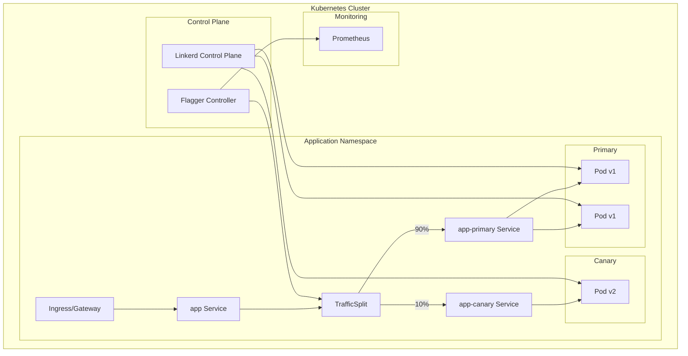
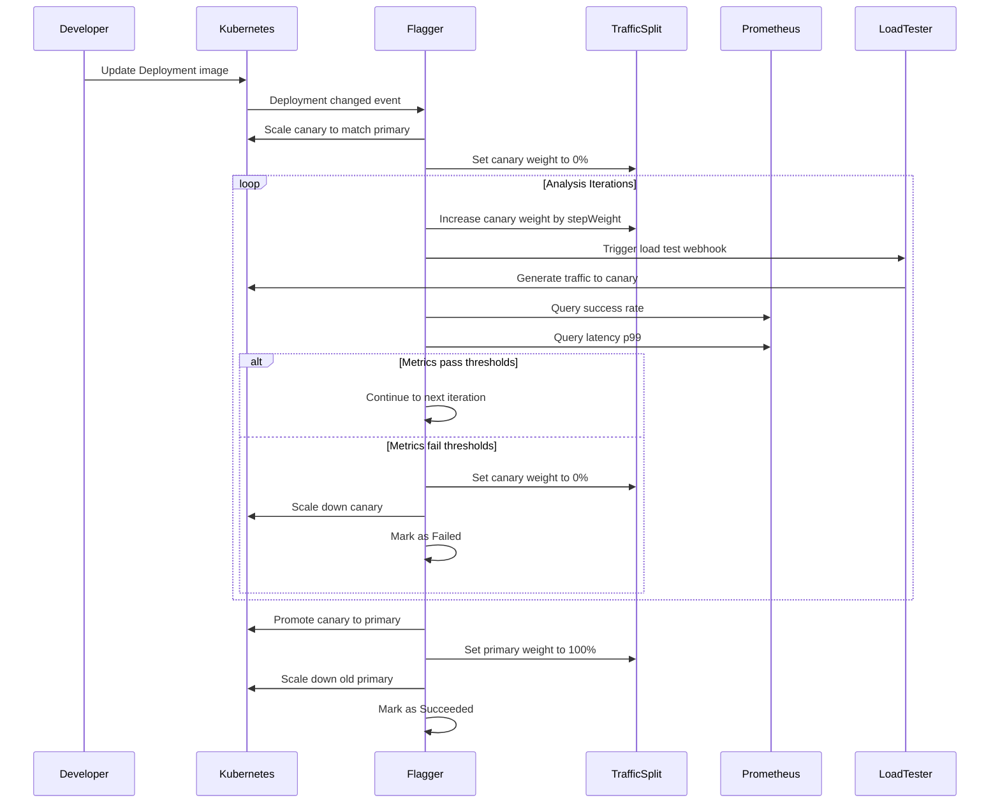

# How to Implement Linkerd Canary Deployments

Author: [nawazdhandala](https://www.github.com/nawazdhandala)

Tags: Linkerd, Canary Deployments, Kubernetes, Service Mesh, Progressive Delivery, Flagger, Traffic Management

Description: A practical guide to implementing canary deployments with Linkerd and Flagger for safe, automated progressive rollouts in Kubernetes.

---

## What Are Canary Deployments

Canary deployments allow you to roll out new versions of your application to a small subset of users before exposing them to the entire user base. If the new version performs well, you gradually increase traffic to it. If it fails, you roll back automatically. The name comes from the "canary in a coal mine" concept - an early warning system.

With Linkerd and Flagger, you can automate this entire process based on metrics like success rate, latency, and custom queries.

## Why Linkerd for Canary Deployments

Linkerd is a lightweight service mesh that provides:

- **Traffic splitting**: Route percentages of traffic to different service versions
- **Observability**: Built-in metrics for success rates, latencies, and request volumes
- **Zero-config mTLS**: Automatic encryption between services
- **Low overhead**: Minimal resource consumption compared to other service meshes

When combined with Flagger, Linkerd enables fully automated canary releases.

## Architecture Overview

The canary deployment flow with Linkerd and Flagger involves several components working together:



## Prerequisites

Before you begin, ensure you have:

- A Kubernetes cluster (v1.21 or later)
- kubectl configured to access your cluster
- Helm 3.x installed
- Linkerd CLI installed

## Installing Linkerd

First, install the Linkerd CLI and validate your cluster:

```bash
# Install the Linkerd CLI
curl -sL https://run.linkerd.io/install | sh

# Add linkerd to your PATH
export PATH=$PATH:$HOME/.linkerd2/bin

# Validate that Linkerd can be installed on your cluster
linkerd check --pre

# Expected output:
# kubernetes-api
# --------------
# can initialize the client................[ok]
# can query the Kubernetes API.............[ok]
#
# kubernetes-version
# ------------------
# is running the minimum Kubernetes API version...[ok]
```

Install Linkerd CRDs and control plane:

```bash
# Install Linkerd CRDs
linkerd install --crds | kubectl apply -f -

# Install Linkerd control plane
linkerd install | kubectl apply -f -

# Verify installation
linkerd check

# Expected output (truncated):
# linkerd-existence
# -----------------
# 'linkerd-config' config map exists..................[ok]
# 'linkerd-identity' service exists...................[ok]
#
# linkerd-config
# --------------
# control plane Namespace exists.....................[ok]
# control plane ClusterRoles exist...................[ok]
#
# linkerd-identity
# ----------------
# certificate config is valid........................[ok]
# trust anchors are valid for at least 60 days.......[ok]
```

Install the Linkerd Viz extension for observability:

```bash
# Install Linkerd Viz extension
# This provides dashboards and Prometheus metrics
linkerd viz install | kubectl apply -f -

# Verify the viz extension
linkerd viz check

# Access the dashboard (optional)
linkerd viz dashboard &
```

## Installing Flagger

Flagger is a progressive delivery operator that automates canary deployments. Install it with Linkerd support:

```bash
# Add the Flagger Helm repository
helm repo add flagger https://flagger.app

# Update the repository cache
helm repo update

# Install Flagger with Linkerd support
helm install flagger flagger/flagger \
  --namespace linkerd-viz \
  --set meshProvider=linkerd \
  --set metricsServer=http://prometheus.linkerd-viz:9090

# Verify Flagger is running
kubectl get pods -n linkerd-viz -l app.kubernetes.io/name=flagger

# Expected output:
# NAME                       READY   STATUS    RUNNING   AGE
# flagger-7d8b9f9c8f-xyz12   1/1     Running   0         1m
```

Install the Flagger load tester for generating traffic during analysis:

```bash
# Install Flagger load tester in a test namespace
kubectl create namespace test

# Deploy the load tester
helm install flagger-loadtester flagger/loadtester \
  --namespace test

# Verify the load tester is running
kubectl get pods -n test -l app=loadtester
```

## Setting Up Your Application

Create a namespace for your application and inject it with the Linkerd proxy:

```bash
# Create namespace with Linkerd injection enabled
kubectl create namespace demo

# Enable automatic proxy injection for the namespace
kubectl annotate namespace demo linkerd.io/inject=enabled
```

Deploy a sample application:

```yaml
# deployment.yaml
# Sample application deployment that will be managed by Flagger
# Flagger will create primary and canary deployments from this

apiVersion: apps/v1
kind: Deployment
metadata:
  name: podinfo
  namespace: demo
  labels:
    app: podinfo
spec:
  # Flagger will manage replicas, but we need an initial value
  replicas: 2
  selector:
    matchLabels:
      app: podinfo
  template:
    metadata:
      labels:
        app: podinfo
      annotations:
        # Linkerd proxy is injected via namespace annotation
        prometheus.io/scrape: "true"
        prometheus.io/port: "9797"
    spec:
      containers:
        - name: podinfo
          # Start with version 6.0.0
          image: ghcr.io/stefanprodan/podinfo:6.0.0
          ports:
            - containerPort: 9898
              name: http
              protocol: TCP
            - containerPort: 9797
              name: http-metrics
              protocol: TCP
          resources:
            requests:
              cpu: 100m
              memory: 64Mi
            limits:
              cpu: 200m
              memory: 128Mi
          # Health checks are required for canary analysis
          livenessProbe:
            httpGet:
              path: /healthz
              port: 9898
            initialDelaySeconds: 5
            periodSeconds: 10
          readinessProbe:
            httpGet:
              path: /readyz
              port: 9898
            initialDelaySeconds: 5
            periodSeconds: 10
          env:
            - name: PODINFO_UI_COLOR
              value: "#34577c"
```

Create a service for the application:

```yaml
# service.yaml
# Service that exposes the application
# Flagger will create additional services for traffic splitting

apiVersion: v1
kind: Service
metadata:
  name: podinfo
  namespace: demo
  labels:
    app: podinfo
spec:
  type: ClusterIP
  ports:
    - port: 9898
      targetPort: http
      protocol: TCP
      name: http
  selector:
    app: podinfo
```

Apply the deployment and service:

```bash
# Apply the deployment and service
kubectl apply -f deployment.yaml
kubectl apply -f service.yaml

# Verify the pods are running with Linkerd proxy
kubectl get pods -n demo

# Expected output (notice 2/2 ready - app container + linkerd proxy):
# NAME                       READY   STATUS    RESTARTS   AGE
# podinfo-7d8b9f9c8f-abc12   2/2     Running   0          30s
# podinfo-7d8b9f9c8f-def34   2/2     Running   0          30s

# Verify Linkerd proxy injection
kubectl get pods -n demo -o jsonpath='{.items[*].spec.containers[*].name}'
# Expected output: podinfo linkerd-proxy podinfo linkerd-proxy
```

## Creating the Canary Resource

The Canary resource defines how Flagger should manage progressive delivery:

```yaml
# canary.yaml
# Canary resource that configures automated progressive delivery
# Flagger uses this to create traffic splits and analyze metrics

apiVersion: flagger.app/v1beta1
kind: Canary
metadata:
  name: podinfo
  namespace: demo
spec:
  # Reference to the deployment to manage
  targetRef:
    apiVersion: apps/v1
    kind: Deployment
    name: podinfo

  # Service configuration for traffic splitting
  service:
    # Port exposed by the service
    port: 9898
    # Target port on the container
    targetPort: http
    # Gateway and host configuration for external traffic
    # gatewayRefs:
    #   - name: public-gateway
    #     namespace: istio-system

  # Analysis configuration
  analysis:
    # How long to wait between analysis iterations
    interval: 30s

    # Number of successful iterations before promotion
    threshold: 5

    # Maximum percentage of traffic to route to canary
    maxWeight: 50

    # Percentage to increase traffic on each iteration
    stepWeight: 10

    # Linkerd Prometheus metrics server
    metrics:
      # Success rate metric - must be above 99%
      - name: success-rate
        # Linkerd specific query for success rate
        templateRef:
          name: success-rate
          namespace: linkerd-viz
        # Minimum acceptable success rate
        thresholdRange:
          min: 99
        # How long to measure the metric
        interval: 1m

      # Latency metric - p99 must be under 500ms
      - name: latency
        templateRef:
          name: latency
          namespace: linkerd-viz
        # Maximum acceptable p99 latency in milliseconds
        thresholdRange:
          max: 500
        interval: 1m

    # Load testing during canary analysis
    webhooks:
      # Generate load to produce metrics
      - name: load-test
        type: rollout
        url: http://flagger-loadtester.test/
        timeout: 5s
        metadata:
          # Send 10 requests per second for 2 minutes
          cmd: "hey -z 2m -q 10 -c 2 http://podinfo-canary.demo:9898/"
```

Create the metric templates for Linkerd:

```yaml
# metric-templates.yaml
# MetricTemplates define Prometheus queries for canary analysis
# These are specific to Linkerd's metrics format

apiVersion: flagger.app/v1beta1
kind: MetricTemplate
metadata:
  name: success-rate
  namespace: linkerd-viz
spec:
  provider:
    type: prometheus
    address: http://prometheus.linkerd-viz:9090
  query: |
    sum(
      rate(
        response_total{
          namespace="{{ namespace }}",
          deployment="{{ target }}",
          classification="success"
        }[{{ interval }}]
      )
    )
    /
    sum(
      rate(
        response_total{
          namespace="{{ namespace }}",
          deployment="{{ target }}"
        }[{{ interval }}]
      )
    )
    * 100

---
apiVersion: flagger.app/v1beta1
kind: MetricTemplate
metadata:
  name: latency
  namespace: linkerd-viz
spec:
  provider:
    type: prometheus
    address: http://prometheus.linkerd-viz:9090
  query: |
    histogram_quantile(
      0.99,
      sum(
        rate(
          response_latency_ms_bucket{
            namespace="{{ namespace }}",
            deployment="{{ target }}"
          }[{{ interval }}]
        )
      ) by (le)
    )
```

Apply the Canary resource and metric templates:

```bash
# Apply metric templates first
kubectl apply -f metric-templates.yaml

# Apply the canary resource
kubectl apply -f canary.yaml

# Watch Flagger initialize the canary
kubectl get canary -n demo -w

# Expected output:
# NAME      STATUS        WEIGHT   LASTTRANSITIONTIME
# podinfo   Initializing  0        2026-01-26T10:00:00Z
# podinfo   Initialized   0        2026-01-26T10:00:30Z
```

After initialization, Flagger creates additional resources:

```bash
# View the resources created by Flagger
kubectl get deployments,services,trafficsplits -n demo

# Expected output:
# NAME                             READY   UP-TO-DATE   AVAILABLE
# deployment.apps/podinfo          0/0     0            0
# deployment.apps/podinfo-primary  2/2     2            2
#
# NAME                      TYPE        CLUSTER-IP      PORT(S)
# service/podinfo           ClusterIP   10.96.123.45    9898/TCP
# service/podinfo-canary    ClusterIP   10.96.123.46    9898/TCP
# service/podinfo-primary   ClusterIP   10.96.123.47    9898/TCP
#
# NAME                               SERVICE
# trafficsplit.split.smi-spec.io/podinfo   podinfo
```

## Canary Deployment Flow

When you update your application, Flagger automatically triggers a canary analysis:



## Triggering a Canary Deployment

To trigger a canary deployment, update the container image:

```bash
# Update the deployment with a new image version
# This triggers Flagger to start canary analysis
kubectl set image deployment/podinfo \
  podinfo=ghcr.io/stefanprodan/podinfo:6.1.0 \
  -n demo

# Watch the canary progress
kubectl get canary podinfo -n demo -w

# Expected output over several minutes:
# NAME      STATUS        WEIGHT   LASTTRANSITIONTIME
# podinfo   Progressing   0        2026-01-26T10:05:00Z
# podinfo   Progressing   10       2026-01-26T10:05:30Z
# podinfo   Progressing   20       2026-01-26T10:06:00Z
# podinfo   Progressing   30       2026-01-26T10:06:30Z
# podinfo   Progressing   40       2026-01-26T10:07:00Z
# podinfo   Progressing   50       2026-01-26T10:07:30Z
# podinfo   Promoting     50       2026-01-26T10:08:00Z
# podinfo   Finalising    100      2026-01-26T10:08:30Z
# podinfo   Succeeded     0        2026-01-26T10:09:00Z
```

View detailed canary events:

```bash
# Describe the canary to see events
kubectl describe canary podinfo -n demo

# Output includes events like:
# Events:
#   Type     Reason  Age   From     Message
#   ----     ------  ----  ----     -------
#   Normal   Synced  5m    flagger  New revision detected podinfo.demo
#   Normal   Synced  5m    flagger  Scaling up podinfo.demo
#   Normal   Synced  4m    flagger  Starting canary analysis
#   Normal   Synced  4m    flagger  Advance podinfo.demo canary weight 10
#   Normal   Synced  3m    flagger  Advance podinfo.demo canary weight 20
#   Normal   Synced  2m    flagger  Advance podinfo.demo canary weight 30
#   Normal   Synced  1m    flagger  Advance podinfo.demo canary weight 40
#   Normal   Synced  30s   flagger  Advance podinfo.demo canary weight 50
#   Normal   Synced  10s   flagger  Promotion completed podinfo.demo
```

## Observing Traffic Split

During a canary deployment, you can observe the traffic split:

```bash
# View the traffic split configuration
kubectl get trafficsplit podinfo -n demo -o yaml

# Output shows weight distribution:
# apiVersion: split.smi-spec.io/v1alpha1
# kind: TrafficSplit
# metadata:
#   name: podinfo
#   namespace: demo
# spec:
#   service: podinfo
#   backends:
#     - service: podinfo-primary
#       weight: 700   # 70% to primary
#     - service: podinfo-canary
#       weight: 300   # 30% to canary
```

Use Linkerd to view live traffic:

```bash
# View live traffic stats with Linkerd
linkerd viz stat deploy -n demo

# Expected output during canary:
# NAME              MESHED   SUCCESS   RPS    LATENCY_P50   LATENCY_P95   LATENCY_P99
# podinfo-primary   2/2      100.00%   5.2    3ms           10ms          15ms
# podinfo-canary    1/1      100.00%   2.3    4ms           12ms          18ms

# View traffic routes
linkerd viz routes deploy/podinfo-primary -n demo

# Watch traffic in real-time
linkerd viz tap deploy/podinfo-canary -n demo
```

## Handling Failed Canaries

If the canary fails to meet the defined metrics, Flagger automatically rolls back:

```bash
# Deploy a version that returns errors
kubectl set image deployment/podinfo \
  podinfo=ghcr.io/stefanprodan/podinfo:6.0.0-fault \
  -n demo

# Watch the canary fail and rollback
kubectl get canary podinfo -n demo -w

# Expected output:
# NAME      STATUS        WEIGHT   LASTTRANSITIONTIME
# podinfo   Progressing   0        2026-01-26T10:15:00Z
# podinfo   Progressing   10       2026-01-26T10:15:30Z
# podinfo   Failed        0        2026-01-26T10:16:00Z

# View failure events
kubectl describe canary podinfo -n demo

# Events:
#   Type     Reason  Age   From     Message
#   ----     ------  ----  ----     -------
#   Warning  Synced  2m    flagger  Halt podinfo.demo advancement success rate 85.32% < 99%
#   Warning  Synced  1m    flagger  Rolling back podinfo.demo failed checks threshold reached 5
#   Warning  Synced  30s   flagger  Canary failed! Scaling down podinfo.demo
```

## Custom Metrics

You can define custom metrics for canary analysis. Here is an example using custom Prometheus queries:

```yaml
# custom-metrics.yaml
# Custom metric template for error rate by HTTP status code

apiVersion: flagger.app/v1beta1
kind: MetricTemplate
metadata:
  name: error-rate-5xx
  namespace: demo
spec:
  provider:
    type: prometheus
    address: http://prometheus.linkerd-viz:9090
  query: |
    100 - sum(
      rate(
        response_total{
          namespace="{{ namespace }}",
          deployment="{{ target }}",
          status_code!~"5.*"
        }[{{ interval }}]
      )
    )
    /
    sum(
      rate(
        response_total{
          namespace="{{ namespace }}",
          deployment="{{ target }}"
        }[{{ interval }}]
      )
    )
    * 100

---
# Custom metric for request duration percentile
apiVersion: flagger.app/v1beta1
kind: MetricTemplate
metadata:
  name: request-duration-p95
  namespace: demo
spec:
  provider:
    type: prometheus
    address: http://prometheus.linkerd-viz:9090
  query: |
    histogram_quantile(
      0.95,
      sum(
        rate(
          response_latency_ms_bucket{
            namespace="{{ namespace }}",
            deployment="{{ target }}"
          }[{{ interval }}]
        )
      ) by (le)
    )
```

Use custom metrics in your Canary resource:

```yaml
# canary-custom-metrics.yaml
# Canary with custom metrics configuration

apiVersion: flagger.app/v1beta1
kind: Canary
metadata:
  name: podinfo
  namespace: demo
spec:
  targetRef:
    apiVersion: apps/v1
    kind: Deployment
    name: podinfo
  service:
    port: 9898
    targetPort: http
  analysis:
    interval: 30s
    threshold: 5
    maxWeight: 50
    stepWeight: 10
    metrics:
      # Built-in success rate
      - name: success-rate
        templateRef:
          name: success-rate
          namespace: linkerd-viz
        thresholdRange:
          min: 99
        interval: 1m

      # Custom 5xx error rate must be below 1%
      - name: error-rate-5xx
        templateRef:
          name: error-rate-5xx
          namespace: demo
        thresholdRange:
          max: 1
        interval: 1m

      # Custom p95 latency must be under 200ms
      - name: request-duration-p95
        templateRef:
          name: request-duration-p95
          namespace: demo
        thresholdRange:
          max: 200
        interval: 1m
```

## Manual Approval Gates

For critical deployments, you can add manual approval gates:

```yaml
# canary-manual-gate.yaml
# Canary with manual approval webhook

apiVersion: flagger.app/v1beta1
kind: Canary
metadata:
  name: podinfo
  namespace: demo
spec:
  targetRef:
    apiVersion: apps/v1
    kind: Deployment
    name: podinfo
  service:
    port: 9898
  analysis:
    interval: 30s
    threshold: 5
    maxWeight: 50
    stepWeight: 10
    metrics:
      - name: success-rate
        templateRef:
          name: success-rate
          namespace: linkerd-viz
        thresholdRange:
          min: 99
        interval: 1m
    webhooks:
      # Pause at 50% for manual approval
      - name: manual-gate
        type: confirm-promotion
        url: http://flagger-loadtester.test/gate/check

      # Approval endpoint to call when ready
      # To approve: kubectl exec -n test deploy/flagger-loadtester -- \
      #   curl -d '{"name":"podinfo","namespace":"demo"}' \
      #   http://localhost:8080/gate/approve

      - name: load-test
        type: rollout
        url: http://flagger-loadtester.test/
        timeout: 5s
        metadata:
          cmd: "hey -z 2m -q 10 -c 2 http://podinfo-canary.demo:9898/"
```

Approve a pending canary:

```bash
# Check if canary is waiting for approval
kubectl get canary podinfo -n demo

# NAME      STATUS              WEIGHT   LASTTRANSITIONTIME
# podinfo   WaitingPromotion    50       2026-01-26T10:20:00Z

# Approve the promotion
kubectl exec -n test deploy/flagger-loadtester -- \
  curl -s -d '{"name":"podinfo","namespace":"demo"}' \
  http://localhost:8080/gate/approve

# Watch the canary complete
kubectl get canary podinfo -n demo -w
```

## Alerting and Notifications

Configure Flagger to send alerts on canary events:

```yaml
# alert-provider.yaml
# Slack alert provider for canary notifications

apiVersion: flagger.app/v1beta1
kind: AlertProvider
metadata:
  name: slack
  namespace: demo
spec:
  type: slack
  # Slack incoming webhook URL
  address: https://hooks.slack.com/services/YOUR/SLACK/WEBHOOK
  # Secret reference for webhook URL (recommended)
  # secretRef:
  #   name: slack-webhook
```

Create a secret for the webhook URL:

```bash
# Create secret with Slack webhook URL
kubectl create secret generic slack-webhook \
  --from-literal=address=https://hooks.slack.com/services/YOUR/SLACK/WEBHOOK \
  -n demo
```

Reference the alert provider in your Canary:

```yaml
# canary-with-alerts.yaml
# Canary configuration with Slack alerts

apiVersion: flagger.app/v1beta1
kind: Canary
metadata:
  name: podinfo
  namespace: demo
spec:
  targetRef:
    apiVersion: apps/v1
    kind: Deployment
    name: podinfo
  service:
    port: 9898
  analysis:
    interval: 30s
    threshold: 5
    maxWeight: 50
    stepWeight: 10
    # Alert configuration
    alerts:
      - name: slack-notification
        severity: info
        providerRef:
          name: slack
          namespace: demo
    metrics:
      - name: success-rate
        templateRef:
          name: success-rate
          namespace: linkerd-viz
        thresholdRange:
          min: 99
        interval: 1m
```

## Multi-Environment Setup

For production deployments, use different configurations per environment:

```yaml
# canary-production.yaml
# Production canary with stricter thresholds and longer analysis

apiVersion: flagger.app/v1beta1
kind: Canary
metadata:
  name: podinfo
  namespace: production
spec:
  targetRef:
    apiVersion: apps/v1
    kind: Deployment
    name: podinfo
  service:
    port: 9898
  analysis:
    # Longer intervals for production stability
    interval: 1m

    # More iterations before promotion
    threshold: 10

    # Lower max weight to limit blast radius
    maxWeight: 30

    # Smaller increments for gradual rollout
    stepWeight: 5

    # Stricter success rate threshold
    metrics:
      - name: success-rate
        templateRef:
          name: success-rate
          namespace: linkerd-viz
        thresholdRange:
          min: 99.9
        interval: 2m

      - name: latency
        templateRef:
          name: latency
          namespace: linkerd-viz
        thresholdRange:
          max: 200
        interval: 2m

    webhooks:
      - name: manual-gate
        type: confirm-promotion
        url: http://flagger-loadtester.production/gate/check

      - name: smoke-test
        type: pre-rollout
        url: http://flagger-loadtester.production/
        timeout: 30s
        metadata:
          type: bash
          cmd: "curl -s http://podinfo-canary.production:9898/healthz | grep ok"
```

## Troubleshooting

### Canary Stuck in Initializing

If the canary remains in Initializing state:

```bash
# Check Flagger logs for errors
kubectl logs -n linkerd-viz deploy/flagger -f

# Verify the deployment exists and has the correct labels
kubectl get deploy podinfo -n demo -o yaml | grep -A5 labels

# Ensure the service selector matches deployment labels
kubectl get svc podinfo -n demo -o yaml | grep -A5 selector

# Check if Linkerd proxy is injected
kubectl get pods -n demo -o jsonpath='{.items[*].spec.containers[*].name}'
```

### Metrics Not Available

If metrics analysis fails with "no values found":

```bash
# Check Prometheus is scraping Linkerd metrics
kubectl port-forward -n linkerd-viz svc/prometheus 9090:9090 &

# Query for available metrics
curl -s 'http://localhost:9090/api/v1/query?query=response_total' | jq .

# Verify the metric template query works
curl -s 'http://localhost:9090/api/v1/query?query=sum(rate(response_total{namespace="demo"}[1m]))' | jq .

# Check Linkerd stats for traffic
linkerd viz stat deploy -n demo
```

### Traffic Split Not Working

If traffic is not being split correctly:

```bash
# Check the TrafficSplit resource
kubectl get trafficsplit -n demo -o yaml

# Verify the services exist
kubectl get svc -n demo

# Check endpoints for each service
kubectl get endpoints -n demo

# Verify Linkerd is handling traffic
linkerd viz tap deploy/podinfo-primary -n demo --to deploy/podinfo-canary
```

## Cleanup

To remove the canary setup:

```bash
# Delete the canary resource
kubectl delete canary podinfo -n demo

# Remove Flagger-created resources
kubectl delete deploy podinfo-primary -n demo
kubectl delete svc podinfo-primary podinfo-canary -n demo
kubectl delete trafficsplit podinfo -n demo

# Uninstall Flagger
helm uninstall flagger -n linkerd-viz
helm uninstall flagger-loadtester -n test

# Uninstall Linkerd
linkerd viz uninstall | kubectl delete -f -
linkerd uninstall | kubectl delete -f -
```

## Conclusion

Linkerd and Flagger provide a powerful combination for automated canary deployments. Key takeaways:

- Flagger automates the entire canary lifecycle based on metrics
- Linkerd provides the traffic splitting and observability needed for analysis
- Custom metrics allow you to define application-specific success criteria
- Manual gates add human oversight for critical deployments
- Automatic rollback protects production from bad releases

By implementing canary deployments, you reduce the risk of releasing problematic code to all users while maintaining the ability to ship changes frequently and confidently.
