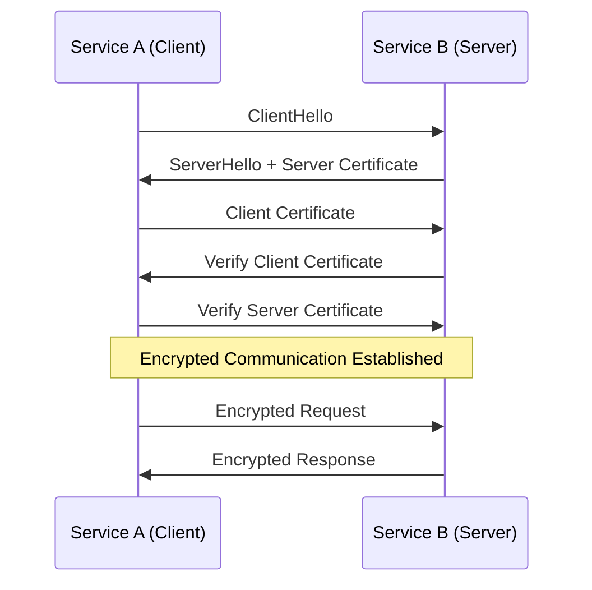
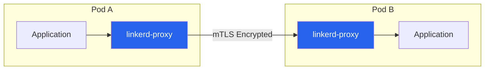
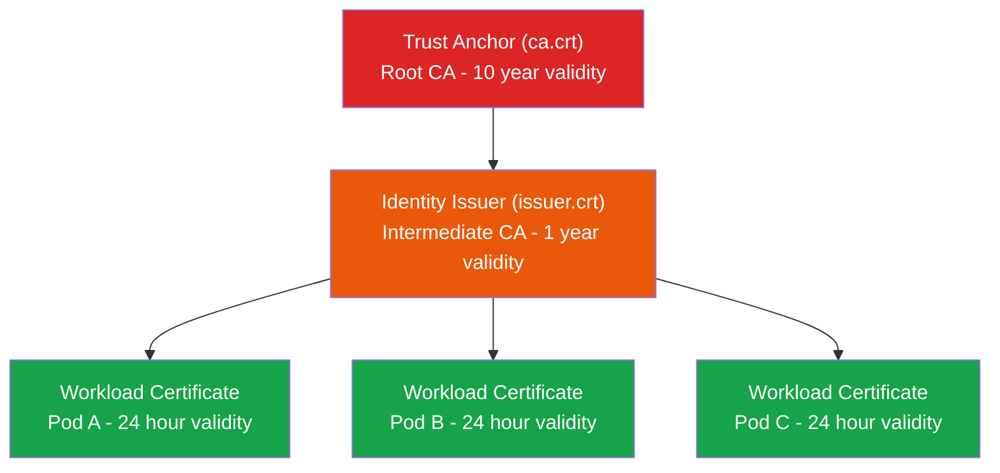
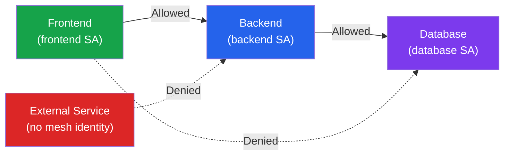

# How to Use Linkerd for mTLS

Author: [nawazdhandala](https://www.github.com/nawazdhandala)

Tags: Linkerd, mTLS, Kubernetes, Service Mesh, Security, Zero Trust, Microservices

Description: A practical guide to implementing mutual TLS (mTLS) with Linkerd for secure service-to-service communication in Kubernetes.

---

Securing communication between services in a Kubernetes cluster is essential for any production environment. Linkerd, a lightweight service mesh, provides automatic mutual TLS (mTLS) out of the box, encrypting all traffic between meshed services without requiring code changes. This guide walks you through setting up and using Linkerd's mTLS capabilities.

## What is mTLS and Why Does It Matter?

Mutual TLS (mTLS) ensures that both parties in a connection authenticate each other using certificates. Unlike standard TLS where only the server proves its identity, mTLS requires both client and server to present valid certificates.



Benefits of mTLS include:
- **Encryption**: All traffic is encrypted in transit
- **Authentication**: Both services verify each other's identity
- **Zero Trust**: No implicit trust based on network location
- **Compliance**: Meets security requirements for many regulations

## How Linkerd Handles mTLS

Linkerd uses a sidecar proxy architecture. Each pod in your cluster gets a lightweight proxy (linkerd-proxy) that handles all mTLS operations transparently.



Linkerd's identity system consists of:
- **Trust Anchor**: Root certificate authority (CA) that establishes trust
- **Identity Issuer**: Intermediate CA that signs workload certificates
- **Workload Certificates**: Short-lived certificates for each proxy

## Prerequisites

Before starting, ensure you have:
- A Kubernetes cluster (v1.21+)
- kubectl configured to access your cluster
- Helm 3.x installed (optional but recommended)

## Step 1: Install the Linkerd CLI

Download and install the Linkerd CLI to manage your service mesh.

```bash
# Download the latest Linkerd CLI
curl --proto '=https' --tlsv1.2 -sSfL https://run.linkerd.io/install | sh

# Add linkerd to your PATH
export PATH=$PATH:$HOME/.linkerd2/bin

# Verify installation
linkerd version
```

The CLI provides tools for installation, debugging, and monitoring your mesh.

## Step 2: Validate Your Cluster

Run the pre-installation checks to ensure your cluster meets Linkerd's requirements.

```bash
# Run pre-flight checks
linkerd check --pre

# Expected output includes checks for:
# - Kubernetes API access
# - Kubernetes version
# - Cluster networking
# - Pod security policies
```

Address any issues the check identifies before proceeding.

## Step 3: Generate mTLS Certificates

For production environments, you should generate your own trust anchor and identity issuer certificates. This gives you control over certificate rotation and security policies.

```bash
# Create a directory for certificates
mkdir -p linkerd-certs && cd linkerd-certs

# Generate the trust anchor certificate (root CA)
# Valid for 10 years - this is the root of trust
step certificate create root.linkerd.cluster.local ca.crt ca.key \
  --profile root-ca \
  --no-password --insecure \
  --not-after=87600h

# Generate the identity issuer certificate (intermediate CA)
# Valid for 1 year - this signs workload certificates
step certificate create identity.linkerd.cluster.local issuer.crt issuer.key \
  --profile intermediate-ca \
  --not-after=8760h \
  --no-password --insecure \
  --ca ca.crt --ca-key ca.key
```

The certificate hierarchy looks like this:



## Step 4: Install Linkerd with Custom Certificates

Install Linkerd's Custom Resource Definitions (CRDs) first, then the control plane with your certificates.

```bash
# Install Linkerd CRDs
linkerd install --crds | kubectl apply -f -

# Install Linkerd control plane with your certificates
linkerd install \
  --identity-trust-anchors-file ca.crt \
  --identity-issuer-certificate-file issuer.crt \
  --identity-issuer-key-file issuer.key \
  | kubectl apply -f -

# Wait for the control plane to be ready
linkerd check
```

Alternatively, use Helm for more configuration options:

```bash
# Add the Linkerd Helm repository
helm repo add linkerd https://helm.linkerd.io/stable
helm repo update

# Install CRDs
helm install linkerd-crds linkerd/linkerd-crds -n linkerd --create-namespace

# Install control plane with certificates
helm install linkerd-control-plane linkerd/linkerd-control-plane \
  -n linkerd \
  --set identity.trustAnchorsPEM="$(cat ca.crt)" \
  --set identity.issuer.tls.crtPEM="$(cat issuer.crt)" \
  --set identity.issuer.tls.keyPEM="$(cat issuer.key)"
```

## Step 5: Inject Linkerd Proxy into Your Applications

Linkerd needs to inject its sidecar proxy into your pods to enable mTLS. You can do this at the namespace or deployment level.

### Option A: Namespace-Level Injection (Recommended)

```yaml
# namespace-injection.yaml
# Annotate the namespace to automatically inject proxies
apiVersion: v1
kind: Namespace
metadata:
  name: my-application
  annotations:
    # This annotation enables automatic proxy injection
    linkerd.io/inject: enabled
```

Apply the configuration:

```bash
kubectl apply -f namespace-injection.yaml
```

### Option B: Deployment-Level Injection

```yaml
# deployment-with-linkerd.yaml
apiVersion: apps/v1
kind: Deployment
metadata:
  name: my-service
  namespace: my-application
spec:
  replicas: 3
  selector:
    matchLabels:
      app: my-service
  template:
    metadata:
      annotations:
        # Enable proxy injection for this specific deployment
        linkerd.io/inject: enabled
      labels:
        app: my-service
    spec:
      containers:
      - name: my-service
        image: my-service:v1.0.0
        ports:
        - containerPort: 8080
```

### Option C: Inject Using CLI

```bash
# Inject proxy into an existing deployment
kubectl get deployment my-service -n my-application -o yaml \
  | linkerd inject - \
  | kubectl apply -f -

# Inject all deployments in a namespace
kubectl get deploy -n my-application -o yaml \
  | linkerd inject - \
  | kubectl apply -f -
```

## Step 6: Verify mTLS is Working

After injecting the proxy, verify that mTLS is active between your services.

### Check Proxy Status

```bash
# Verify the proxy is running in your pods
kubectl get pods -n my-application -o jsonpath='{.items[*].spec.containers[*].name}' | tr ' ' '\n' | grep linkerd

# Check the linkerd-proxy container in a specific pod
kubectl describe pod <pod-name> -n my-application | grep -A5 linkerd-proxy
```

### Verify mTLS Using the Dashboard

```bash
# Install the Linkerd viz extension for observability
linkerd viz install | kubectl apply -f -

# Wait for viz to be ready
linkerd viz check

# Open the dashboard
linkerd viz dashboard
```

The dashboard shows a padlock icon next to connections that are secured with mTLS.

### Verify mTLS Using the CLI

```bash
# Check the edges (connections) between services
linkerd viz edges deployment -n my-application

# Output shows secured connections:
# SRC          DST          SRC_NS          DST_NS          SECURED
# frontend     backend      my-application  my-application  true
# backend      database     my-application  my-application  true
```

### Inspect TLS Identity

```bash
# Get detailed identity information for a pod
linkerd identity -n my-application <pod-name>

# This shows the certificate chain and identity
```

## Step 7: Enforce mTLS with Server Authorization

By default, Linkerd allows both mTLS and plaintext connections (permissive mode). For production, enforce mTLS-only communication.

```yaml
# server-authorization.yaml
# This Server resource defines which ports to protect
apiVersion: policy.linkerd.io/v1beta1
kind: Server
metadata:
  name: my-service-server
  namespace: my-application
spec:
  podSelector:
    matchLabels:
      app: my-service
  port: 8080
  proxyProtocol: HTTP/2
---
# This AuthorizationPolicy requires mTLS authentication
apiVersion: policy.linkerd.io/v1beta1
kind: AuthorizationPolicy
metadata:
  name: require-mtls
  namespace: my-application
spec:
  targetRef:
    group: policy.linkerd.io
    kind: Server
    name: my-service-server
  requiredAuthenticationRefs:
    - name: all-authenticated
      kind: MeshTLSAuthentication
      group: policy.linkerd.io
---
# Define what "authenticated" means - any identity in the mesh
apiVersion: policy.linkerd.io/v1beta1
kind: MeshTLSAuthentication
metadata:
  name: all-authenticated
  namespace: my-application
spec:
  # Accept any identity with a valid certificate from our trust anchor
  identities:
    - "*"
```

Apply the authorization policy:

```bash
kubectl apply -f server-authorization.yaml
```

## Step 8: Restrict Access to Specific Services

For fine-grained access control, specify which services can communicate with each other.

```yaml
# restricted-authorization.yaml
# Only allow frontend to talk to backend
apiVersion: policy.linkerd.io/v1beta1
kind: Server
metadata:
  name: backend-server
  namespace: my-application
spec:
  podSelector:
    matchLabels:
      app: backend
  port: 8080
  proxyProtocol: HTTP/2
---
apiVersion: policy.linkerd.io/v1beta1
kind: AuthorizationPolicy
metadata:
  name: backend-authz
  namespace: my-application
spec:
  targetRef:
    group: policy.linkerd.io
    kind: Server
    name: backend-server
  requiredAuthenticationRefs:
    - name: frontend-only
      kind: MeshTLSAuthentication
      group: policy.linkerd.io
---
apiVersion: policy.linkerd.io/v1beta1
kind: MeshTLSAuthentication
metadata:
  name: frontend-only
  namespace: my-application
spec:
  identities:
    # Only pods with this service account can connect
    - "frontend.my-application.serviceaccount.identity.linkerd.cluster.local"
```

This creates a zero-trust architecture where services must be explicitly authorized:



## Step 9: Monitor mTLS Metrics

Linkerd provides detailed metrics about your mTLS connections through Prometheus.

```bash
# Check mTLS success rate
linkerd viz stat deploy -n my-application

# Output includes:
# NAME       MESHED   SUCCESS   RPS   LATENCY_P50   LATENCY_P95   LATENCY_P99
# frontend   1/1      100.00%   10    5ms           10ms          20ms
# backend    1/1      100.00%   10    3ms           8ms           15ms
```

### Query Prometheus Directly

```bash
# Port-forward to Prometheus
kubectl port-forward -n linkerd-viz svc/prometheus 9090:9090

# Query for TLS handshake failures
# PromQL: sum(rate(inbound_http_errors_total{error="tls"}[5m])) by (deployment)
```

### Create Alerts for mTLS Issues

```yaml
# mtls-alerts.yaml
apiVersion: monitoring.coreos.com/v1
kind: PrometheusRule
metadata:
  name: linkerd-mtls-alerts
  namespace: linkerd-viz
spec:
  groups:
  - name: linkerd-mtls
    rules:
    - alert: LinkerdMTLSFailures
      # Alert when TLS errors occur
      expr: sum(rate(inbound_http_errors_total{error="tls"}[5m])) by (deployment) > 0
      for: 5m
      labels:
        severity: warning
      annotations:
        summary: "mTLS failures detected for {{ $labels.deployment }}"
        description: "Service {{ $labels.deployment }} is experiencing mTLS handshake failures"
```

## Step 10: Certificate Rotation

Linkerd handles workload certificate rotation automatically (every 24 hours by default). However, you need to rotate the identity issuer certificate before it expires.

### Automatic Rotation with cert-manager

```yaml
# cert-manager-issuer.yaml
# Use cert-manager to automatically rotate the identity issuer
apiVersion: cert-manager.io/v1
kind: Certificate
metadata:
  name: linkerd-identity-issuer
  namespace: linkerd
spec:
  secretName: linkerd-identity-issuer
  # Rotate 30 days before expiry
  renewBefore: 720h
  duration: 8760h
  issuerRef:
    name: linkerd-trust-anchor
    kind: ClusterIssuer
  commonName: identity.linkerd.cluster.local
  isCA: true
  privateKey:
    algorithm: ECDSA
  usages:
    - cert sign
    - crl sign
    - server auth
    - client auth
```

### Manual Rotation

```bash
# Generate a new identity issuer certificate
step certificate create identity.linkerd.cluster.local issuer-new.crt issuer-new.key \
  --profile intermediate-ca \
  --not-after=8760h \
  --no-password --insecure \
  --ca ca.crt --ca-key ca.key

# Update the secret in Kubernetes
kubectl create secret tls linkerd-identity-issuer \
  --cert=issuer-new.crt \
  --key=issuer-new.key \
  --namespace=linkerd \
  --dry-run=client -o yaml | kubectl apply -f -

# Restart the identity service to pick up new certificates
kubectl rollout restart deploy/linkerd-identity -n linkerd
```

## Troubleshooting Common mTLS Issues

### Issue 1: Proxy Not Injected

```bash
# Check if the namespace has injection enabled
kubectl get namespace my-application -o jsonpath='{.metadata.annotations}'

# Verify pod has the proxy sidecar
kubectl get pods -n my-application -o jsonpath='{.items[*].spec.containers[*].name}'

# If missing, re-inject the deployment
kubectl get deploy my-service -n my-application -o yaml | linkerd inject - | kubectl apply -f -
```

### Issue 2: Certificate Errors

```bash
# Check identity service logs
kubectl logs -n linkerd deploy/linkerd-identity

# Verify trust anchor is correctly configured
kubectl get configmap linkerd-identity-trust-roots -n linkerd -o yaml

# Check if certificates are expired
linkerd check --proxy
```

### Issue 3: Connection Refused Between Services

```bash
# Check if authorization policies are blocking traffic
linkerd viz authz -n my-application deploy/my-service

# Review the Server and AuthorizationPolicy resources
kubectl get servers,authorizationpolicies -n my-application

# Temporarily disable policy enforcement for debugging
kubectl annotate namespace my-application config.linkerd.io/default-inbound-policy=all-unauthenticated
```

### Issue 4: High Latency After Enabling mTLS

```bash
# Check proxy resource usage
kubectl top pods -n my-application -l linkerd.io/proxy-deployment

# If proxies are resource-constrained, increase limits
kubectl patch deployment my-service -n my-application --patch '
spec:
  template:
    metadata:
      annotations:
        config.linkerd.io/proxy-cpu-request: "100m"
        config.linkerd.io/proxy-memory-request: "128Mi"
'
```

## Best Practices

1. **Use Separate Trust Anchors per Environment**: Do not share the root CA between production and non-production clusters.

2. **Rotate Certificates Proactively**: Set up automated rotation well before certificates expire.

3. **Start with Permissive Mode**: Enable mTLS without enforcing it first, then gradually add authorization policies.

4. **Monitor Certificate Expiry**: Set up alerts for certificates approaching expiration.

5. **Document Your Identity Hierarchy**: Keep a record of which CAs issue which certificates.

6. **Test Failover Scenarios**: Verify your applications handle certificate rotation gracefully.

## Conclusion

Linkerd makes implementing mTLS straightforward by handling certificate management, proxy injection, and encryption automatically. By following this guide, you have set up a secure service mesh where all communication between services is encrypted and authenticated. The authorization policies give you fine-grained control over which services can communicate, implementing a true zero-trust architecture in your Kubernetes cluster.

For ongoing maintenance, focus on certificate rotation, monitoring mTLS metrics, and gradually tightening authorization policies as you understand your service communication patterns better.
