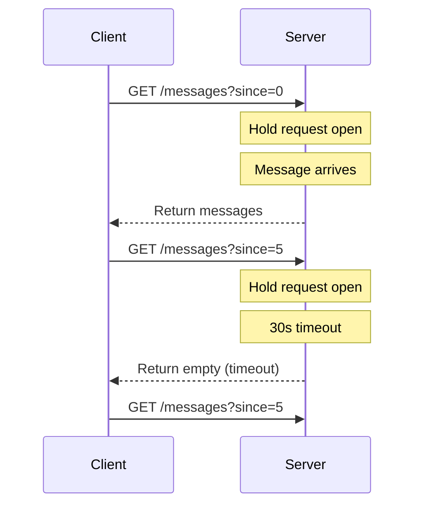

# How to Implement Long Polling for Chat Apps in Node.js

Author: [nawazdhandala](https://www.github.com/nawazdhandala)

Tags: Node.js, Long Polling, Real-time, Chat, Backend

Description: Learn how to implement long polling for real-time chat applications in Node.js, with message ordering, connection management, and scaling strategies.

---

Real-time communication in web applications typically uses WebSockets, Server-Sent Events, or long polling. Long polling is the simplest approach that works everywhere, including behind corporate proxies and firewalls that block WebSocket connections. It works by having the client make a request that the server holds open until new data is available.

This guide covers building a complete chat application with long polling: message delivery, connection management, handling multiple users, and scaling considerations.

## How Long Polling Works

Traditional polling wastes bandwidth by repeatedly asking "any new messages?" even when there are none. Long polling flips this by having the server wait until there is something to send.



The flow:
1. Client makes a request for new messages
2. Server holds the request open (up to a timeout, typically 30 seconds)
3. When messages arrive, server responds immediately
4. Client processes the response and immediately makes a new request
5. If no messages arrive before timeout, server responds with empty and client retries

## Basic Server Implementation

Start with a simple Express server that holds connections open:

```typescript
// server.ts
import express, { Request, Response } from 'express';

const app = express();
app.use(express.json());

// In-memory message storage
interface Message {
  id: number;
  roomId: string;
  userId: string;
  content: string;
  timestamp: number;
}

const messages: Message[] = [];
let messageIdCounter = 0;

// Pending requests waiting for new messages
interface PendingRequest {
  res: Response;
  roomId: string;
  sinceId: number;
  timeoutId: NodeJS.Timeout;
}

const pendingRequests: Map<string, PendingRequest> = new Map();

// Long polling endpoint
// Client calls this with ?roomId=xxx&since=lastMessageId
app.get('/api/messages', (req: Request, res: Response) => {
  const roomId = req.query.roomId as string;
  const sinceId = parseInt(req.query.since as string) || 0;
  const clientId = req.query.clientId as string || crypto.randomUUID();

  // Check if there are already new messages
  const newMessages = messages.filter(
    (m) => m.roomId === roomId && m.id > sinceId
  );

  if (newMessages.length > 0) {
    // Immediate response if messages exist
    res.json({ messages: newMessages });
    return;
  }

  // No new messages, hold the connection open
  const timeoutId = setTimeout(() => {
    // Timeout after 30 seconds, return empty response
    pendingRequests.delete(clientId);
    res.json({ messages: [] });
  }, 30000);

  // Store the pending request
  pendingRequests.set(clientId, {
    res,
    roomId,
    sinceId,
    timeoutId,
  });

  // Handle client disconnect
  req.on('close', () => {
    const pending = pendingRequests.get(clientId);
    if (pending) {
      clearTimeout(pending.timeoutId);
      pendingRequests.delete(clientId);
    }
  });
});

// Send a message
app.post('/api/messages', (req: Request, res: Response) => {
  const { roomId, userId, content } = req.body;

  const message: Message = {
    id: ++messageIdCounter,
    roomId,
    userId,
    content,
    timestamp: Date.now(),
  };

  messages.push(message);

  // Notify all waiting clients in this room
  for (const [clientId, pending] of pendingRequests) {
    if (pending.roomId === roomId) {
      clearTimeout(pending.timeoutId);
      pending.res.json({ messages: [message] });
      pendingRequests.delete(clientId);
    }
  }

  res.json({ message });
});

app.listen(3000, () => {
  console.log('Chat server running on port 3000');
});
```

## Client Implementation

The client needs to handle connection lifecycle, reconnection, and message ordering:

```typescript
// client.ts
class LongPollingClient {
  private baseUrl: string;
  private roomId: string;
  private userId: string;
  private clientId: string;
  private lastMessageId: number = 0;
  private running: boolean = false;
  private abortController: AbortController | null = null;
  private onMessage: (message: Message) => void;
  private reconnectDelay: number = 1000;

  constructor(options: {
    baseUrl: string;
    roomId: string;
    userId: string;
    onMessage: (message: Message) => void;
  }) {
    this.baseUrl = options.baseUrl;
    this.roomId = options.roomId;
    this.userId = options.userId;
    this.clientId = crypto.randomUUID();
    this.onMessage = options.onMessage;
  }

  // Start the long polling loop
  start(): void {
    if (this.running) return;
    this.running = true;
    this.poll();
  }

  // Stop polling
  stop(): void {
    this.running = false;
    if (this.abortController) {
      this.abortController.abort();
    }
  }

  private async poll(): Promise<void> {
    while (this.running) {
      try {
        this.abortController = new AbortController();

        const url = new URL(`${this.baseUrl}/api/messages`);
        url.searchParams.set('roomId', this.roomId);
        url.searchParams.set('since', this.lastMessageId.toString());
        url.searchParams.set('clientId', this.clientId);

        const response = await fetch(url.toString(), {
          signal: this.abortController.signal,
        });

        if (!response.ok) {
          throw new Error(`HTTP ${response.status}`);
        }

        const data = await response.json();

        // Process received messages
        for (const message of data.messages) {
          // Only process messages we have not seen
          if (message.id > this.lastMessageId) {
            this.lastMessageId = message.id;
            this.onMessage(message);
          }
        }

        // Reset reconnect delay on successful poll
        this.reconnectDelay = 1000;
      } catch (error) {
        if ((error as Error).name === 'AbortError') {
          // Intentional abort, stop polling
          break;
        }

        console.error('Poll error:', error);

        // Exponential backoff on errors
        await this.sleep(this.reconnectDelay);
        this.reconnectDelay = Math.min(this.reconnectDelay * 2, 30000);
      }
    }
  }

  // Send a message to the room
  async send(content: string): Promise<Message> {
    const response = await fetch(`${this.baseUrl}/api/messages`, {
      method: 'POST',
      headers: { 'Content-Type': 'application/json' },
      body: JSON.stringify({
        roomId: this.roomId,
        userId: this.userId,
        content,
      }),
    });

    if (!response.ok) {
      throw new Error(`Failed to send: HTTP ${response.status}`);
    }

    const data = await response.json();
    return data.message;
  }

  private sleep(ms: number): Promise<void> {
    return new Promise((resolve) => setTimeout(resolve, ms));
  }
}

// Usage example
const client = new LongPollingClient({
  baseUrl: 'http://localhost:3000',
  roomId: 'general',
  userId: 'user-123',
  onMessage: (message) => {
    console.log(`[${message.userId}]: ${message.content}`);
    // Update your UI here
  },
});

client.start();

// Send a message
await client.send('Hello, world!');

// Stop when done
// client.stop();
```

## Handling Multiple Rooms and Users

A production chat server needs to manage multiple rooms efficiently:

```typescript
// rooms/roomManager.ts
interface Room {
  id: string;
  name: string;
  members: Set<string>;
  messages: Message[];
  lastMessageId: number;
}

interface PendingConnection {
  res: Response;
  userId: string;
  sinceId: number;
  timeoutId: NodeJS.Timeout;
}

class RoomManager {
  private rooms: Map<string, Room> = new Map();
  private pendingByRoom: Map<string, Map<string, PendingConnection>> = new Map();

  // Create or get a room
  getRoom(roomId: string): Room {
    let room = this.rooms.get(roomId);
    if (!room) {
      room = {
        id: roomId,
        name: roomId,
        members: new Set(),
        messages: [],
        lastMessageId: 0,
      };
      this.rooms.set(roomId, room);
      this.pendingByRoom.set(roomId, new Map());
    }
    return room;
  }

  // Join a room
  join(roomId: string, userId: string): void {
    const room = this.getRoom(roomId);
    room.members.add(userId);
  }

  // Leave a room
  leave(roomId: string, userId: string): void {
    const room = this.rooms.get(roomId);
    if (room) {
      room.members.delete(userId);
    }
  }

  // Get messages since a given ID
  getMessagesSince(roomId: string, sinceId: number): Message[] {
    const room = this.rooms.get(roomId);
    if (!room) return [];
    return room.messages.filter((m) => m.id > sinceId);
  }

  // Add a message and notify waiting clients
  addMessage(roomId: string, userId: string, content: string): Message {
    const room = this.getRoom(roomId);

    const message: Message = {
      id: ++room.lastMessageId,
      roomId,
      userId,
      content,
      timestamp: Date.now(),
    };

    room.messages.push(message);

    // Keep only last 1000 messages per room
    if (room.messages.length > 1000) {
      room.messages = room.messages.slice(-1000);
    }

    // Notify all waiting clients
    this.notifyRoom(roomId, [message]);

    return message;
  }

  // Register a long polling connection
  waitForMessages(
    roomId: string,
    userId: string,
    sinceId: number,
    res: Response
  ): void {
    const pending = this.pendingByRoom.get(roomId);
    if (!pending) return;

    const timeoutId = setTimeout(() => {
      pending.delete(userId);
      res.json({ messages: [] });
    }, 30000);

    pending.set(userId, { res, userId, sinceId, timeoutId });
  }

  // Remove a pending connection
  removePending(roomId: string, userId: string): void {
    const pending = this.pendingByRoom.get(roomId);
    if (!pending) return;

    const conn = pending.get(userId);
    if (conn) {
      clearTimeout(conn.timeoutId);
      pending.delete(userId);
    }
  }

  // Notify all waiting clients in a room
  private notifyRoom(roomId: string, messages: Message[]): void {
    const pending = this.pendingByRoom.get(roomId);
    if (!pending) return;

    for (const [userId, conn] of pending) {
      // Filter messages newer than what client has seen
      const newMessages = messages.filter((m) => m.id > conn.sinceId);
      if (newMessages.length > 0) {
        clearTimeout(conn.timeoutId);
        conn.res.json({ messages: newMessages });
        pending.delete(userId);
      }
    }
  }

  // Get room statistics
  getStats(): { rooms: number; pendingConnections: number } {
    let pendingConnections = 0;
    for (const pending of this.pendingByRoom.values()) {
      pendingConnections += pending.size;
    }
    return {
      rooms: this.rooms.size,
      pendingConnections,
    };
  }
}

export const roomManager = new RoomManager();
```

## Updated Server with Room Management

```typescript
// server-v2.ts
import express, { Request, Response } from 'express';
import { roomManager } from './rooms/roomManager';

const app = express();
app.use(express.json());

// Join a room
app.post('/api/rooms/:roomId/join', (req: Request, res: Response) => {
  const { roomId } = req.params;
  const { userId } = req.body;

  roomManager.join(roomId, userId);
  const room = roomManager.getRoom(roomId);

  res.json({
    roomId,
    members: Array.from(room.members),
    recentMessages: roomManager.getMessagesSince(roomId, 0).slice(-50),
  });
});

// Leave a room
app.post('/api/rooms/:roomId/leave', (req: Request, res: Response) => {
  const { roomId } = req.params;
  const { userId } = req.body;

  roomManager.leave(roomId, userId);
  res.json({ success: true });
});

// Long polling for messages
app.get('/api/rooms/:roomId/messages', (req: Request, res: Response) => {
  const { roomId } = req.params;
  const sinceId = parseInt(req.query.since as string) || 0;
  const userId = req.query.userId as string;

  // Check for existing messages
  const messages = roomManager.getMessagesSince(roomId, sinceId);

  if (messages.length > 0) {
    res.json({ messages });
    return;
  }

  // No messages, wait for new ones
  roomManager.waitForMessages(roomId, userId, sinceId, res);

  // Clean up on disconnect
  req.on('close', () => {
    roomManager.removePending(roomId, userId);
  });
});

// Send a message
app.post('/api/rooms/:roomId/messages', (req: Request, res: Response) => {
  const { roomId } = req.params;
  const { userId, content } = req.body;

  const message = roomManager.addMessage(roomId, userId, content);
  res.json({ message });
});

// Server stats endpoint
app.get('/api/stats', (req: Request, res: Response) => {
  res.json(roomManager.getStats());
});

app.listen(3000, () => {
  console.log('Chat server v2 running on port 3000');
});
```

## Handling Typing Indicators

Typing indicators show when other users are composing messages:

```typescript
// typing/typingIndicator.ts
interface TypingUser {
  userId: string;
  username: string;
  expiresAt: number;
}

class TypingIndicatorManager {
  // roomId -> Map of userId -> TypingUser
  private typing: Map<string, Map<string, TypingUser>> = new Map();
  private cleanupInterval: NodeJS.Timeout;

  constructor() {
    // Clean up expired typing indicators every second
    this.cleanupInterval = setInterval(() => this.cleanup(), 1000);
  }

  // Mark user as typing
  setTyping(roomId: string, userId: string, username: string): void {
    let roomTyping = this.typing.get(roomId);
    if (!roomTyping) {
      roomTyping = new Map();
      this.typing.set(roomId, roomTyping);
    }

    roomTyping.set(userId, {
      userId,
      username,
      expiresAt: Date.now() + 3000, // Expires in 3 seconds
    });
  }

  // Clear typing indicator
  clearTyping(roomId: string, userId: string): void {
    const roomTyping = this.typing.get(roomId);
    if (roomTyping) {
      roomTyping.delete(userId);
    }
  }

  // Get all typing users in a room
  getTyping(roomId: string): TypingUser[] {
    const roomTyping = this.typing.get(roomId);
    if (!roomTyping) return [];

    const now = Date.now();
    return Array.from(roomTyping.values()).filter((t) => t.expiresAt > now);
  }

  // Clean up expired indicators
  private cleanup(): void {
    const now = Date.now();
    for (const [roomId, roomTyping] of this.typing) {
      for (const [userId, typing] of roomTyping) {
        if (typing.expiresAt <= now) {
          roomTyping.delete(userId);
        }
      }
    }
  }

  destroy(): void {
    clearInterval(this.cleanupInterval);
  }
}

export const typingManager = new TypingIndicatorManager();
```

## Scaling Long Polling

For multiple server instances, use Redis pub/sub to broadcast messages:

```typescript
// scaling/redisAdapter.ts
import { Redis } from 'ioredis';

const publisher = new Redis();
const subscriber = new Redis();

class ScaledRoomManager {
  private localPending: Map<string, Map<string, PendingConnection>> = new Map();

  constructor() {
    // Subscribe to message events
    subscriber.subscribe('chat:messages');

    subscriber.on('message', (channel, data) => {
      if (channel === 'chat:messages') {
        const { roomId, message } = JSON.parse(data);
        this.notifyLocalClients(roomId, message);
      }
    });
  }

  // Publish message to all server instances
  async broadcastMessage(roomId: string, message: Message): Promise<void> {
    await publisher.publish(
      'chat:messages',
      JSON.stringify({ roomId, message })
    );
  }

  // Notify only clients connected to this server instance
  private notifyLocalClients(roomId: string, message: Message): void {
    const pending = this.localPending.get(roomId);
    if (!pending) return;

    for (const [userId, conn] of pending) {
      if (message.id > conn.sinceId) {
        clearTimeout(conn.timeoutId);
        conn.res.json({ messages: [message] });
        pending.delete(userId);
      }
    }
  }

  // Store messages in Redis for persistence
  async storeMessage(message: Message): Promise<void> {
    const key = `room:${message.roomId}:messages`;
    await publisher.zadd(key, message.id, JSON.stringify(message));
    // Keep only last 1000 messages
    await publisher.zremrangebyrank(key, 0, -1001);
  }

  // Get messages from Redis
  async getMessagesSince(roomId: string, sinceId: number): Promise<Message[]> {
    const key = `room:${roomId}:messages`;
    const data = await publisher.zrangebyscore(key, sinceId + 1, '+inf');
    return data.map((d) => JSON.parse(d));
  }
}

export const scaledRoomManager = new ScaledRoomManager();
```

## Summary

Long polling provides real-time messaging without WebSocket complexity:

| Aspect | Implementation |
|--------|----------------|
| **Connection** | Hold HTTP request open up to 30s |
| **Message delivery** | Respond immediately when messages arrive |
| **Reconnection** | Client retries immediately after each response |
| **Multiple rooms** | Track pending connections per room |
| **Scaling** | Use Redis pub/sub across server instances |
| **Typing indicators** | Short-lived state with automatic expiration |

Long polling works through any proxy or firewall that supports HTTP. While WebSockets are more efficient for high-frequency updates, long polling remains a reliable fallback that works everywhere. Many production chat systems use long polling as their default transport with WebSocket upgrade when available.
